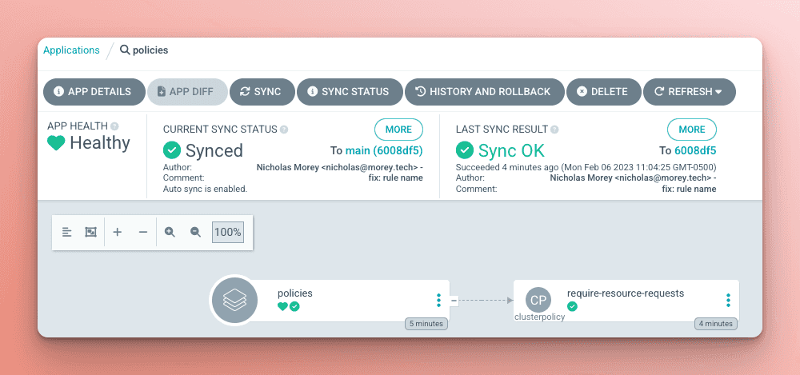
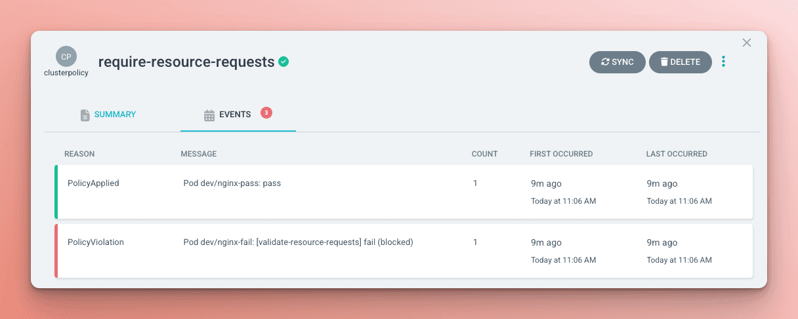

如果你正在阅读这篇博客文章，我假设你已经熟悉 Kubernetes 并且知道它是一个容器编排平台。在创建新的应用程序版本时，你的容器构建过程已经很好了。Kubernetes 提供了广泛的功能，使用户能够执行复杂的部署策略。挑战在于根据你的环境，有正确和错误的使用方式。

你组织中的平台工程师很可能非常熟悉 Kubernetes，了解将应用程序部署到集群中的正确和错误方式。挑战在于向平台的所有用户传递这些信息。

大多数运维人员的理解很可能来自于正式培训或花费很多时间构建平台并从错误中学习。要求所有打算与平台交互的应用程序开发人员具有相同的经验是不现实的。这对组织来说在时间、精力和对产品和客户的潜在影响方面都是昂贵的，因为这些经验是从错误中学到的。

在每个组织内，用户使用内部开发平台的策略和标准是已知的或需要遵循的。挑战在于许多组织使用文档和广泛的沟通来确保用户遵循这些标准。这在人们偏离预期标准并学习正确方法之间提供了长时间的反馈循环。

## Kyverno

这就是 [Kyverno](https://kyverno.io/) 的用武之地，它是一个基于 Kubernetes 的策略引擎，提供了一种将平台管理员学到的经验编码化的方式。Kyverno 直接部署到 Kubernetes 集群中，并使用自定义资源来定义策略。使用 admission webhook，Kyverno 可以审计策略违规或甚至阻止尝试进入集群的请求。

策略引擎可以大大缩短在 Kubernetes 中尝试应用更改并学习部署不符合平台管理员设置的标准时的反馈循环。当应用程序开发人员与集群交互时，策略会立即提供反馈，指出他们是否偏离了平台团队制定的最佳实践。

例如，一个刚开始熟悉 Kubernetes 的开发人员决定部署应用程序的 `latest` 标记。这似乎是无害的，但他们不知道使用可变标记的危险。在此错误被集群管理员捕捉并向用户报告之前，这段时间可能造成很大的损失。

相反，当用户尝试将 `latest` 标记部署到集群中时，他们可以立即收到一个清晰的消息，解释为什么不允许这样做，并提供纠正策略违规的步骤。这使他们可以继续实现他们想要完成的目标，将他们的应用程序部署到集群中。

组织甚至可以将策略集成到 CI/CD 工作流程中，以更早地捕捉任何违规行为。如果某些违规行为在集群中得以实现，Kyverno 可以阻止 admission 请求以强制执行该策略，甚至可以在应用它们时改变资源，使它们符合最佳实践。

## GitOps / Argo CD

作为 Kubernetes 管理员，你可能好奇如何管理这些策略，这就是 Argo CD 和 GitOps 的作用。

[GitOps](https://akuity.io/gitops/) 将应用程序开发的最佳实践（如版本控制、协作、合规性和工具）应用于 Kubernetes。集群中使用的 Kubernetes 资源的清单存储在 Git 中，这提供了所需状态的不可变版本。

[Argo CD](https://akuity.io/what-is-argo/) 充当 GitOps 代理，不断地将期望状态与集群的实际状态进行比较。它将 Git 中的任何更改应用于 Kubernetes 集群。

与任何 Kubernetes 清单一样，Kyverno 策略可以通过 Git 存储和管理。这使它们可以遵循透明的批准流程，并提供策略何时以及为什么发生更改的审计跟踪。

## Kyverno 最佳实践策略

让我们看一下使用 Kyverno 策略实施 Kubernetes 最佳实践的典型示例。我们将从使用 Argo CD 向集群添加策略开始。对于此示例，Kyverno 和 Argo CD 已安装在集群中。

在 [GitOps 仓库](https://github.com/morey-tech/argo-cd-kyverno) 中，添加 `require-resource-requests` 策略，该策略要求 pod 具有定义的资源请求。这对 Kubernetes 能够将 pod [安排到具有足够资源的节点上](https://kubernetes.io/docs/concepts/configuration/manage-resources-containers/#how-pods-with-resource-requests-are-scheduled)至关重要。如果没有这些资源请求，从资源可用性的角度来看，Kubernetes 将盲目地将 pod 安排到节点上。

```yaml
apiVersion: kyverno.io/v1
kind: ClusterPolicy
metadata:
  name: require-resource-requests
  annotations:
    policies.kyverno.io/title: Require Resource Requests
    policies.kyverno.io/category: Best Practices
    policies.kyverno.io/severity: medium
    policies.kyverno.io/subject: Pod
    policies.kyverno.io/minversion: 1.6.0
    policies.kyverno.io/description: >-
      As application workloads share cluster resources, it is important to specify resources
      requested and consumed by each Pod. Requiring resource requests per Pod is recommended,
      especially for memory and CPU. If a Namespace level request is specified, defaults will
      automatically be applied to each Pod based on the LimitRange configuration. This policy
      validates that all containers have something specified for memory and CPU requests.
spec:
  validationFailureAction: enforce
  background: true
  rules:
  - name: validate-resource-requests
    match:
      any:
      - resources:
          kinds:
          - Pod
          namespaces:
          - dev
    validate:
      message: "CPU and memory resource requests are required."
      pattern:
        spec:
          containers:
          - resources:
              requests:
                memory: "?*"
                cpu: "?*"
```

`validationFailureAction` 字段确定 Kyverno 如何响应失败的验证检查的行为。`require-resource-requests` 策略设置为强制执行规则失败，阻止任何违反它们的请求。当发生这种情况时，它将在负责的策略资源上记录一个 `fail (blocked)` 事件。

`validate-resource-requests` 规则将匹配 `dev` 命名空间中的任何 `Pod` 资源，即使是从更高级别的资源（如 Deployment 或 ReplicaSet）生成的。它将验证 pod 中的容器上的 `cpu` 和 `memory` 资源请求字段是否定义了值。当策略验证失败时，它将包括规则中定义的 `message`。

我们将添加一个应用程序到 Argo CD，该应用程序指向包含策略的仓库中的目录。

```yaml
apiVersion: argoproj.io/v1alpha1
kind: Application
metadata:
  name: policies
spec:
  destination:
    name: kind
    namespace: kyverno
  project: default
  source:
    path: policies
    repoURL: https://github.com/morey-tech/argo-cd-kyverno.git
    targetRevision: main
    directory:
      recurse: true
```



随着策略同步到集群中，我们将部署另一个 Argo CD 应用程序，其中包含两个 `nginx` pod，一个将通过策略验证，另一个将因缺少资源请求而失败。


同步最终将失败，因为该策略设置为阻止创建任何包含违规的资源。查看 Argo CD 中的同步状态时，用户可以看到消息中的 Kyverno 策略失败和规则解释失败原因。


同步状态还将每个资源的结果分解，使用户清楚地了解哪个资源失败以及原因。


在策略资源上，事件也会显示违规行为。



一旦资源的策略违规得到解决，Argo CD 应用程序就能将该资源同步到集群中。

## 结论

Kyverno 作为策略引擎，是向内部开发者平台用户提供实现平台团队制定的最佳实践的清晰反馈的强大工具。然而，这只是 Kyverno 能力的冰山一角。本文中的示例演示了注入控制功能，但策略也可以、生成和清理资源。这样就可以通过自动更新资源来强制执行策略，使其符合进入集群的资源，或者构建一个自助式平台，响应在集群中创建的资源，创建新的集群并使用 Argo CD 引导它们。

遵循 GitOps 原则并使用 Argo CD 管理部署时，管理集群的策略变得更加简单。Argo CD UI 明确了通过策略验证阻止的任何资源，使用户易于理解如何使资源符合标准。

Kyverno 和 Argo CD 一起开辟了一个全新的集群管理世界，可以根据您组织的需求进行扩展。有关使用 Argo CD 和 Kyverno 的更多最佳实践，请参阅 Nirmata 博客上的[“使用 Argo CD 和 Kyverno 的 3 个基本技巧” 。](https://nirmata.com/2023/03/09/3-essential-tips-for-using-argo-cd-and-kyverno/)
