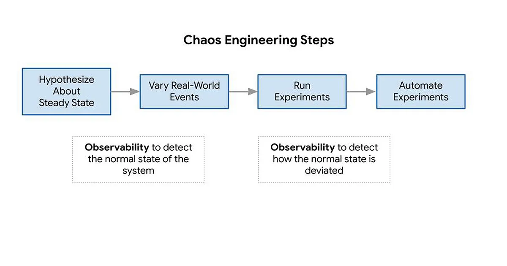
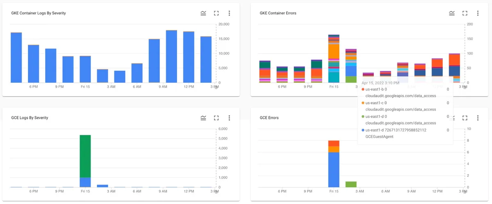
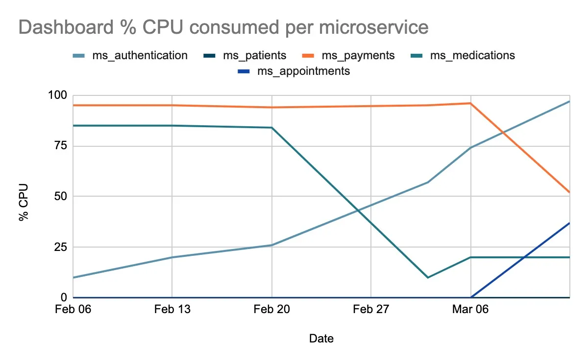
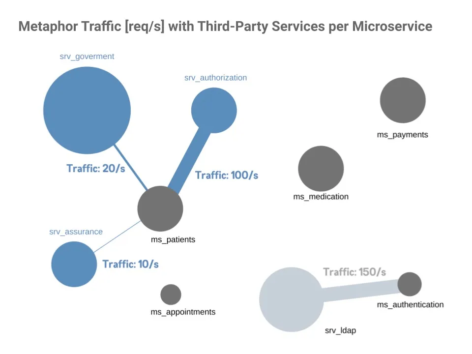
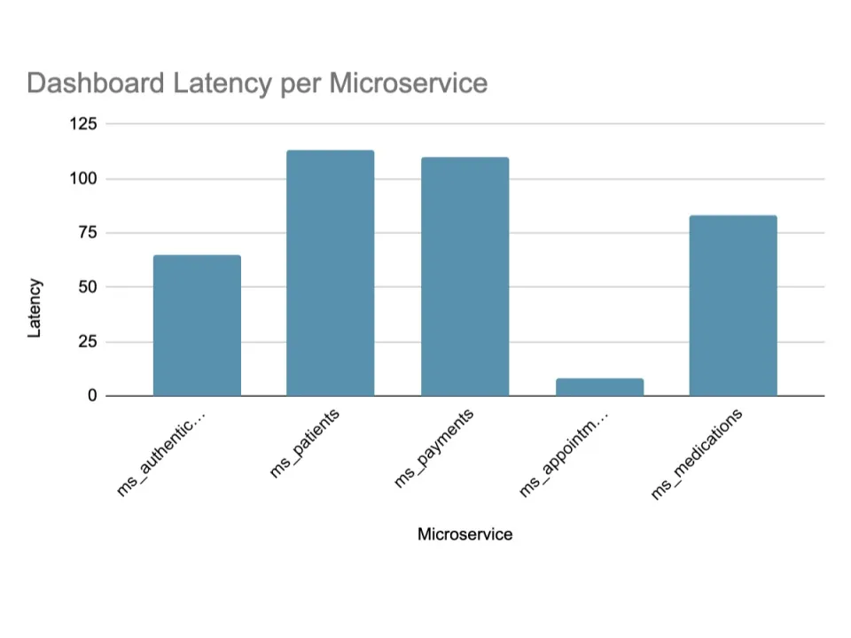

## 主要收获

-   对于现代软件系统来说，可观测性不是关于数学方程。它是关于人类如何与复杂的系统互动并试图理解它们。

-   混沌工程利用了可观测性，因为它可以检测到系统稳定状态的偏差。混沌工程借助可观测性可以发现和克服系统的弱点。

-   可观测性依赖于系统所发出的信号，这些信号提供了关于系统行为的原始数据。然而，可观测性不仅受限于这些信号的质量，还受限于这些信号的可视化和解释的方式。

-   考虑到混沌工程、可观测性和可视化涉及到人类自我的解释，仪表盘的设计者可能会对这些解释产生偏差，这是一个事实。在这个意义上，视觉隐喻并不能保证我们以正确的方式解释这些数据。

-   基于视觉隐喻的仪表盘可以提供比经典的可视化更有用的数据。然而，这两种策略都很容易产生偏差；例如，在一项研究中，大多数参与者都注意到，由于显示了糟糕的柱状图和线状图，没有在图中显示出重要的分界点，因此整体结果是有偏差的。

自从 Netflix、Slack 和 Linkedin 等领先的技术公司采用混沌工程来抵御生产中的意外中断后，这门学科在近来已经成为主流。在这条道路上，可观测性发挥了关键作用，为工程师们带来了数据和监控的力量，他们现在有了了解自己系统的策略，确定当某些东西发生故障时它们将如何表现，并增加复原力和可靠性。

混沌工程和可观测性是两个密切相关的学科。根据 Russ Miles 的说法，\"可观测性原则将系统变成了可检查和可调试的案发现场，而混沌工程鼓励并利用可观测性，因为它试图帮助预先发现并克服系统的弱点 \"。混沌工程鼓励并要求可观测性，因为要自信地执行混沌实验，可观测性必须检测系统何时正常，以及在执行方法实验时如何偏离该稳定状态。见图 1 中的说明。

学术界和科技界都做出了巨大的努力，为实践混沌工程和可观测性提供了工具。然而，指标的可视化和视觉策略的适当选择仍然是有限的。本文引入了一个新的角色：视觉隐喻。具体来说，它提供了混沌工程和可观测性的概念基础，介绍了市场上可用的可视化技术的现状，并展示了树状图、仪表图、地理图和城市隐喻是如何丰富观察混沌的视觉策略的。

混沌工程和可观测性的基础
------------------------

关于混沌工程：混沌、弹性和可靠性是关键的概念，而关于可观测性，当人类想要观察他们的系统时，监控、度量和仪表盘是至关重要的。因此，在深入研究混沌工程和可观测性之间的关系之前，明确这些定义很重要。

混沌工程根据混沌原理定义为一门在系统上进行实验的学科，以建立对系统在生产中承受动荡条件能力的信心。为了具体解决大规模分布式系统的不确定性，混沌工程提供了一种基于实验的方法，包括四个步骤：第一个步骤包括定义稳定状态，这是系统的一个可测量的输出，表示正常行为。第二步是与假设相关的，它提出了一个改变稳态的后果的句子。有了这个假设，就该引入现实世界的事件，如服务器崩溃或硬盘故障，以证实或反驳这个假设。最后，目标是建立控制组和实验组之间稳定状态的差异分析。

可观测性是指能够完全理解一个系统。在控制理论中，它被定义为衡量一个系统的内部状态可以从其外部输出的知识中推断出来的程度。特别是在软件工程中，可观测性可以被描述为提出适当的问题、提供正确的答案以及用收集到的数据建立知识的艺术。

监控与可观测性是不同的，理解两者的区别很重要。监控是关于收集、处理、汇总和显示系统的实时定量数据；而可观测性是关于处理和分析这些数据，让团队主动理解和调试系统的行为。对于现代软件系统来说，可观测性不是关于数学公式。它是关于人们如何与复杂的系统互动并试图理解它们。

在这个意义上，监控涉及到通过数字读取系统发出的信号，这些数字被命名为度量。指标是一个单一的数字，可以选择附加标签进行分组和搜索，比如查询次数和类型、错误次数和类型、处理时间或服务器寿命。这些数值在仪表盘中被可视化，仪表盘是提供服务核心指标的摘要视图的应用程序。

传统的仪表盘是建立在折线图、饼图或柱状图上的。考虑到可观测性取决于系统发出的信号以及这些信号被可视化和解释的质量，提供最好的工具和设计是很重要的。如果颜色、图例和比例使用不当，一些可视化可能会对操作者造成限制和困惑。下一节提供了监控和可观测性的技术状况，并更详细地描述了其中的一些限制。

监控和可观测性
--------------

监控和可观测性已经成为工程团队和一般现代数字企业最基本的能力之一，他们希望在他们的解决方案中提供卓越。由于监控和观察系统有很多原因，谷歌记录了四个黄金信号或指标，它们定义了系统健康的含义，是可观测性和监控平台现状的基础。这四个指标描述如下。

延迟（Latency）是指一个服务为一个请求提供服务所需的时间。它包括由于与数据库或其他关键后端失去连接而触发的 HTTP 500 错误，这些错误可能不会很快得到服务。延迟是一个基本指标，因为慢的错误甚至比快的错误更糟糕。

流量（Traffic）是衡量对系统的需求有多大。它决定了系统在某一特定时间内从用户或通过服务运行的事务中承受多大的压力。以网络服务为例，这种测量通常是每秒的 HTTP 请求。通过监控应用程序或服务中的真实用户互动和流量，工程团队可以看到系统如何支持需求的变化，以及他们应该如何扩展资源以满足需求。

错误（Error）与请求失败的比率有关，无论是显性的还是隐性的。根据系统和发生故障的组件，监控错误情况可能会有很大的不同。这就是为什么工程团队需要监控整个系统的错误发生率，但也需要监控单个服务层面的错误发生率的原因。同样重要的是，要优先考虑哪些错误是关键的，哪些错误是不太危险的。

最后，饱和度（Saturation）是系统对资源利用的信号，如内存、I/O 或 CPU。考虑到许多系统在达到 100% 的利用率之前就会出现性能下降的情况，拥有一个饱和度目标是非常重要的。它允许我们回答这样的问题：服务还有多少容量？什么水平的饱和度能保证客户的服务性能和可用性？

用于监控的传统可视化方法
------------------------

现在，上一节所述的四个黄金信号是用传统方法监控的，如折线图、柱状图或饼状图。

如图 2 所示，折线图是将系统的四个黄金信号的行为在时间上可视化的最常用策略。

线形图在颜色、图例、轴和系列的标题方面提出了不同的挑战，因为变量会聚、交叉，而且通常会纠缠在一起。如果仪表盘的创建者没有使用适当的视觉资产，这种类型的图形可能会变成最令人困惑的图表之一。

另一个常见的图表是柱状图，它是用高度或长度与所代表的数值成正比的矩形条来表示分类数据。如图 3 所示，一些云供应商用它们来表示日志的分类数据。

最后，尽管较少使用，饼图是表示和比较数据分布中的比例的一种简单方法。当一个比例占主导地位——一半或四分之三时，它们是最有效的。超过几种颜色的楔形图会在楔形图之间产生同一性，使其难以比较数值。

考虑到这些局限性，下一节将介绍一种不同的方式来可视化这四个黄金指标。由于本文是关于混沌工程的，这种技术是在报告事件的情况下进行分析的。

视觉隐喻作为视觉化混沌的一种建议
--------------------------------

为了克服前面提到的局限性，本文提出了一种新的策略，将生产中的混乱现象可视化。这个建议是基于其他科学领域的一个概念：视觉隐喻。视觉隐喻是一种策略，将一个应用领域的概念和对象映射到一个相似性和类比的系统中。计算机隐喻是交互式视觉对象和模型对象之间同化的基本思想。它的作用是促进对对象的语义的更好理解。一个熟悉的例子可以是在跑车的图片前使用一只豹子，暗示该产品具有速度、力量和耐力等可比性。

一些例子包括：地图、城市和几何场景，如图 3 所示。该图显示了城市隐喻，这是一种用于可视化程序代码属性的流行方法。许多项目都采用了这种隐喻来可视化软件库的属性，比如说。现有的研究已经被用来用包来映射街区，用建筑来映射类。

](f4.webp "图 4. 一个虚构项目中的城市隐喻，来自[这里](https://www.researchgate.net/publication/224503826_Visual_Exploration_of_Large-Scale_Evolving_Software)")

在这种情况下，这个隐喻把类表示为建筑物，把包表示为建筑物所处的邻域。建筑物的每个边缘都被用来映射类的属性。

提出一个将事件可视化的实验
--------------------------

为了确定参与运营活动的工程团队的看法，我们对他们中的 28 人进行了关于传统仪表盘和视觉隐喻的调查。具体来说，他们被问及使用经典仪表盘和视觉隐喻对四个黄金指标（错误、延迟、流量和饱和度）进行可视化的事件。

这项研究由关于一个事件的具体问题组成，其中提供了两种可视化：一种是传统的图表，另一种是视觉隐喻。对于每一种情况，都分析了每种可视化的价值。在接下来的段落中，将介绍每个问题和分析。

关于人口统计学，共有 28 名参与者，其背景分布在后端、前端和全栈工程师、软件架构师、数据工程师和网站可靠性工程师。如图 5 所示，参与人数最多的是后端开发工程师。

第一个问题是关于 饱和信号。基本上，使用了两个仪表盘——一个折线图和一个城市隐喻来询问五个微服务的状态：`ms_authentication`、`ms_patients`、`ms_payments`、`ms_medications` 和 `ms_appointments`。这些微服务是一个虚构的医疗系统的一部分。

具体来说，问题是：使用传统的仪表板（见图 6）和视觉隐喻（见图 7），哪个微服务受到影响？正确答案是 `ms_authentication`。

如图 8 所示，当他们使用视觉隐喻时，一些参与者的答案改变了，选择了正确的答案。

所有参与者都认为，受 CPU 高利用率影响的微服务是认证。在这种情况下，视觉隐喻比传统的图表更有用，因为图表线很混乱，而且颜色、形状和大小都不好，改变了参与者的看法。

关于错误信号，我们用经典的柱状图和树状图来要求参与者计算每个微服务的平均错误，如图 9 所示。

正确的答案是 `ms_appointments`，虽然有些参与者没有选择它，但当他们使用视觉隐喻时，许多人改变了他们的答案。图 11 说明了这一点。

关于流量信号，我们用一个经典的柱状图和一个地理中心的隐喻来询问参与者哪个第三方服务的流量更大。在这种情况下，原有的微服务和新的四个第三方服务：`srv_ldap`、`srv_goverment`、`srv_assurance` 和 `srv_authentication` 之间的互动被分析了。图 12 用柱状图显示了这种整合，图 13 用地理中心的隐喻显示了相同的流量值。在这个比喻中，圆圈代表服务和微服务，线条连接它们之间的关系。

尽管有线条和大小来代表微服务和第三方服务之间的连接和流量负载，但这个比喻对参与者来说是混乱的。圆圈的大小可能与 `srv_ldap` 的最小百分比有关，而 `srv_ldap` 是正确的答案，它在饼中由绿色部分表示（见图 14）。

最后，我们用柱状图的视觉化和仪表的比喻来分析**延迟信号**。图 15 和图 16 分别说明了这两种可视化方式。

对于这种情况，这个隐喻肯定没有为参与者提供价值，因为正确的答案是 `ms_patients`，这在图 17 中有说明。

引入视觉隐喻的结论
------------------

混沌的可视化，特别是生产事故的可视化，给专注于可观测性的工业和学术界带来了一些挑战。正如我们在这篇文章中所展示的，由于混沌工程、可观测性和可视化涉及到人与机器的互动，解释中的偏差是一个持续的风险。通过一项研究，28 位工程师回答了与经典仪表盘和视觉隐喻有关的 12 个问题，可以得出结论，可观测性不仅受到这些信号的数量和质量的限制，而且受到这些信号的可视化和解释方式的限制。结论是，视觉隐喻可能比传统的仪表盘表现得更好，然而，由于两者都涉及到人，所以都不能保证操作人员以正确的方式解释事故中的数据。

有兴趣了解更多关于混沌工程中的可观测性吗？
------------------------------------------

我想推荐这三本书。

-   我的第一个推荐是 Russ Miles 的《[混沌工程可观测性](https://www.humio.com/chaos-observability/)》一书。在这本书中，作者演示了如何将你的混沌实验带入系统可观测性的世界。混沌可观测性能够使整个系统的混沌实验实时地浮现、调试和可视化。

-   另一个很好的参考是 Charity Majors、Liz Fong-Jones 和 George
    Miranda 的《[可观测性工程](https://learning.oreilly.com/library/view/observability-engineering/9781492076438/)》一书，他们在一家名为 Honeycomb 的公司工作，正是专门从事可观测性的工作。我喜欢这本书，因为在书中，可观测性被当作一个工程领域。如你所知，可观测性对于工程、管理和改进复杂的关键业务系统至关重要，所以它应该被视为一门学科，甚至是一个组织内部的角色。

-   最后，我想提到一本专注于 [混沌工程](https://www.manning.com/books/chaos-engineering) 的参考书。我说的是 Mikolaj
    Pawlikowski 的一本实用书，由曼宁公司出版。该书记录了模拟现实生活中的失败的实验室和实际实验。作者通过学习像混沌工程师那样思考，最大限度地发挥了混沌工程的优势，提供了涵盖整个软件领域的例子。
