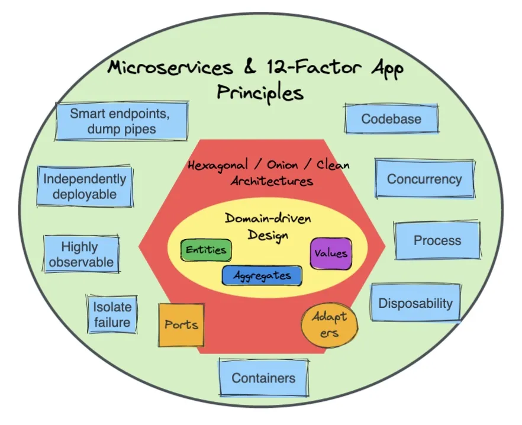
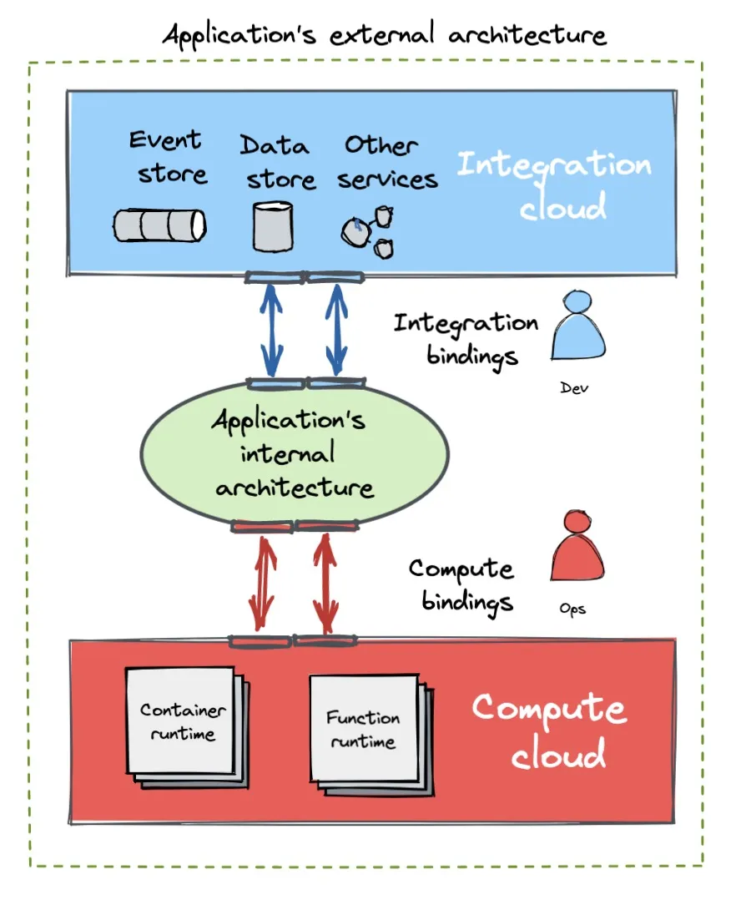
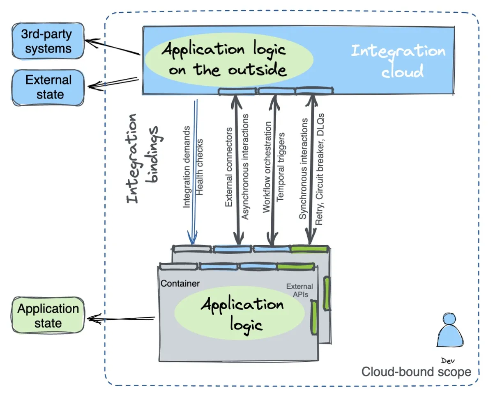

本文作者 Bilgin Ibryam 是 Diagrid 的技术产品经理，致力于开发人员生产力工具。在此之前，他曾在 Red Hat 担任顾问和架构师，同时也是 Apache 软件基金会的提交者和成员。Bilgin 还与人合著了两本关于 Kubernetes 模式和 Camel 设计模式的书。在业余时间，Bilgin 喜欢通过博客和其他方式写作和分享他的知识。

译者注：本文介绍了云绑定应用程序的概念，并探讨了在使用云绑定应用程序时需要考虑的几个关键因素。首先，作者解释了云绑定应用程序是指在构建应用程序时使用云提供的服务和资源。作者强调了使用云绑定应用程序可以带来很多好处，例如降低成本和提高可靠性。然而，作者也指出了在使用云绑定应用程序时需要考虑的几个关键因素，包括云供应商锁定、数据隐私和网络连接可靠性等。最后，作者提供了一些建议，帮助企业在使用云绑定应用程序时避免潜在的风险。例如，选择具有高可用性的云服务提供商，并在使用云绑定应用程序时加强数据安全措施。

### 关键要点

- 云提供商将重点从基础设施服务转移到开发人员直接使用的应用程序优先服务，从而产生了新的应用程序架构。
- 这种架构允许开发人员将集成逻辑和管理责任卸载到云服务，并专注于实现业务逻辑。
- “云绑定”代表了云原生从解决以计算为中心的问题向管理应用集成问题的演进。
- 云绑定应用程序使用开放 API 和事实标准将应用程序的内部架构与其外部依赖项分离。
- 云绑定应用程序使用开放的 API 和数据格式将应用程序绑定到计算基础设施，并将状态编排、事件驱动的交互和可靠的同步交互等集成责任卸载到云服务。

[应用程序优先](https://www.diagrid.io/blog/evolution-of-cloud-computing) 云服务的日益普及导致应用程序和云服务的集成比以前更深入。应用程序和云之间的运行时边界正在从虚拟机转移到容器和函数。在这个最终架构中，应用程序是“云绑定”的，通过将更多应用程序逻辑和管理责任卸载到云服务，开发人员可以专注于业务逻辑。

本文通过使用保持灵活性和可移植性的开放 API 和标准将应用程序绑定到云服务来检查整个软件堆栈的商品化。

## 内部架构演变

应用程序的内部架构通常由一个团队拥有和控制。根据所选的语言和运行时，包、模块、接口、类和函数等工具和抽象可帮助开发人员控制内部边界。[领域驱动设计](https://martinfowler.com/bliki/DomainDrivenDesign.html)(DDD) 帮助开发人员设计领域模型，这些模型作为抽象来封装复杂的业务逻辑并调解业务现实与代码之间的差距。

[Hexagonal](https://alistair.cockburn.us/hexagonal-architecture/)，[Onion](https://jeffreypalermo.com/2013/08/onion-architecture-part-4-after-four-years/ ) 和 [Clean](https://blog.cleancoder.com/uncle-bob/2012/08/13/the-clean-architecture.html) 架构可以[补充](https://herbertograca.com/2017/ 11/16/explicit-architecture-01-ddd-hexagonal-onion-clean-cqrs-how-i-put-it-all-together/) DDD 并安排具有不同边界和外部化基础设施依赖性的应用程序代码。尽管这些方法在开始时是创新的并且在今天仍然适用，但它们最初是为三层 Java 应用程序开发的，该应用程序由部署在共享应用程序运行时中的 JSP、Servlet 和 EJB 组成。当时的主要焦点是将应用程序逻辑与 UI 和数据库分离，并启用隔离测试。

从那时起，微服务和[十二因素](https://12factor.net/) 应用程序等新挑战和概念不断涌现，并影响了我们设计应用程序的方式。微服务的核心是将应用程序逻辑分离到由单个团队拥有的可独立部署的单元中。十二因素应用程序方法旨在创建在动态云环境中运行和扩展的分布式、无状态应用程序。所有这些架构都引入了原则和最佳实践，这些原则和最佳实践塑造了我们构建应用程序内部架构的方式以及我们管理它的方式。

后来在应用程序架构演变时间表中，容器的主流采用和 Kubernetes 的引入彻底改变了应用程序的打包和编排方式。AWS Lambda 引入了高度可扩展的函数即服务 (FaaS) 的概念，将应用程序粒度的概念提升到一个新的水平，并将完整的基础设施管理责任卸载给云提供商。其他技术趋势，例如服务网格和[多运行时微服务架构](https://www.infoq.com/articles/multi-runtime-microservice-architecture/)，也已经出现并将非功能方面商品化，例如网络和分布式开发原语，分别将它们提取到 sidecar 中。受微服务的启发，数据网格架构旨在将应用程序的分析数据架构分解为更小、独立的数据域，每个域都有自己的产品和团队。这些以及最近的趋势，例如应用程序优先的云服务，正在开始重塑应用程序的外部架构，我在本文中将其统称为“云绑定应用程序”。

## 外部架构演化

外部架构是应用程序与其他团队和组织拥有的其他应用程序和基础设施相交的地方，通常以专用的本地中间件、存储系统或云服务的形式出现。应用程序连接到外部系统并卸载其部分职责的方式形成了外部架构。为了从基础架构中受益，应用程序需要绑定到该基础架构并强制执行清晰的边界以保持其敏捷性。一个应用程序的内部架构和实现应该能够在不改变另一个应用程序的情况下进行更改，外部依赖关系（例如云服务）可以在不改变内部结构的情况下进行交换。

从广义上讲，我们可以将应用程序与其周围环境绑定的方式分为两类：

- 计算绑定是在计算平台（例如 Kubernetes、容器服务，甚至是 AWS Lambda 等无服务器函数）上运行应用程序所需的所有绑定、配置、API 和合约。大多数情况下，这些绑定对内部架构是透明的，并且由运营团队而非开发人员配置和使用。容器抽象是当今应用程序计算绑定最广泛的“API”。
- 集成绑定是对应用程序所依赖的外部依赖项的所有其他绑定的总称。云服务还使用这些绑定与应用程序交互，通常是通过定义明确的 HTTP “API”或专门的消息传递和存储访问协议，例如 AWS S3、Apache Kafka、Redis API 等。集成绑定不像运行时绑定那样透明。开发人员需要围绕它们实现额外的逻辑，例如重试、TTL、延迟、死信队列 (DLQ) 等，并将它们绑定到应用程序的业务逻辑。

应用程序在云上运行并通过使用这些绑定来使用其他服务。让我们更详细地了解这些绑定背后的内容。

## 计算绑定

对于运营团队来说，理想情况下，每个应用程序都是一个需要在计算平台上运行的黑盒单元。计算绑定用于管理 Kubernetes、AWS Lambda 和其他服务等平台上应用程序的生命周期。这些绑定以应用程序和应用程序运行平台之间的配置和 API 交互集合的形式形式化和定义。这些交互中的大部分对应用程序是透明的，只有少数 API 需要开发人员实现，例如健康端点和指标 API。这是目前CNCF对“云原生”[定义](https://github.com/cncf/toc/blob/main/DEFINITION.md)和范围的扩展，只要开发者实现云原生应用，他们可以在云计算平台上绑定运行。

要在云平台上可靠地运行，应用程序必须在从规范到最佳实践的多个层面上与之绑定。这是通过一组行业标准规范（例如容器 API、指标 API）实现的，例如基于 Prometheus、健康端点或云提供商规范（例如 AWS Lambda 或 AWS ECS 规范）。此外，通过云原生最佳技术和共享知识，例如健康检查、部署策略和放置策略。让我们看看当今使用的常见计算绑定。

### 资源需求

包括微服务和函数在内的应用程序需要 CPU、内存和存储等资源。这些资源的定义因所使用的平台而异。例如，在 Kubernetes 上，CPU 和内存是通过[请求和限制](https://kubernetes.io/docs/concepts/configuration/manage-resources-containers/) 定义的，而在 AWS Lambda 上，用户[指定]( https://docs.aws.amazon.com/lambda/latest/dg/configuration-function-common.html)运行时分配的内存量，以及对应的CPU分配。存储在这些平台上的处理方式也不同，Kubernetes 使用临时存储和卷，而 Lambda 提供临时暂存资源和基于 Amazon EFS 挂载的持久存储。

### 生命周期钩子

由平台管理的应用程序通常需要了解重要的生命周期事件。例如，在 Kubernetes 上，init 容器等概念和 PostStart 和 PreStop 等钩子允许应用程序对这些事件做出反应。同样，Lambda 的 [extensions](https://docs.aws.amazon.com/lambda/latest/dg/runtimes-extensions-api.html) API 允许应用程序拦截 Init、Invoke 和 Shutdown 阶段。处理生命周期事件的其他选项包括包装器脚本或特定于语言的运行时修改选项，例如 JVM 的关闭钩子。这些机制形成了平台和应用程序之间的契约，使其能够响应和管理自己的生命周期。

### 健康检查

运行状况探测是平台监控应用程序运行状况并在必要时采取纠正措施（例如重新启动应用程序）的一种方式。由于请求的生命周期较短，Lambda 函数没有健康探测，而容器化应用程序和编排器（如 Kubernetes、AWS EKS 和 GCP Cloud Run）确实在其定义中包含 [健康探测 ](https://cloud.google.com/run/docs/configuring/healthchecks) 。这使平台能够确保应用程序平稳运行，并在应用程序运行不平稳时采取措施。

### 部署和放置策略

一旦知道所需的资源，计算平台就可以开始管理应用程序的生命周期。要以不损害业务逻辑完整性的方式执行此操作，平台必须了解扩展约束。有些应用程序被设计为单例。例如，它们需要维护已处理事件的顺序并且不能扩展到多个实例。其他有状态应用程序可能是仲裁驱动的，并且需要特定数量的最小实例连续运行才能正常运行。还有一些函数，例如无状态函数，可能有利于快速扩展以解决不断增加的负载峰值问题。一旦建立了应用程序的缩放指南，平台就会控制应用程序实例的启动和终止。

计算还提供滚动、蓝绿、金丝雀、一次等多种部署策略，来控制服务更新的顺序。除了部署顺序之外，这些平台还允许用户指定放置首选项。例如，Kubernetes 提供标签、污点和容忍度、亲和力和反亲和力等选项，而 Lambda 允许用户在区域和[边缘放置](https://aws.amazon.com/lambda/edge/) 类型之间进行选择。这些首选项可确保部署应用程序并满足合规性和性能要求。

### 网络流量

计算平台还负责将低级网络流量引导至服务实例。这是因为它负责部署排序、放置和自动缩放，这些都会影响流量如何定向到服务实例。健康检查也可以在流量管理中发挥作用，例如 GCP Cloud Run 和 Kubernetes 中的[准备情况检查](https://cloud.google.com/run/docs/configuring/healthchecks)。通过处理这些任务，计算平台有助于确保流量高效且有效地路由到适当的服务实例。

### 监控和报告

任何用于分布式应用程序的计算平台都必须以日志、指标和跟踪的形式提供深入的应用程序洞察力。目前该领域几乎没有被广泛接受的事实标准：日志最好以结构化格式使用，例如 JSON 或其他行业特定标准。计算平台通常收集日志或为专门的日志提取和分析服务提供扩展点以访问日志。这可以是 Kubernetes 上的 DaemonSet，用于监控的 Lambda 合作伙伴扩展，或 Vercel 边缘功能日志 Drainer。计算平台必须支持指标和追踪数据的收集和分析，以全面了解分布式应用程序的性能和行为。有几种行业标准格式和工具可用于处理此数据 [OpenTelemetry (OTEL) for Tracking ](https://opentelemetry.io/) 计算平台可以提供内置工具来收集和分析这些数据，或者为专门服务提供扩展点来访问数据。无论代码粒度（微服务或函数）或位置（边缘或非边缘）如何，计算平台都必须允许捕获日志、指标和追踪数据，并导出到其他同类最佳的云服务。例如 [Honeycomb](http://honeycomb.io/)、[DataDog](https://www.datadoghq.com/)、[Grafana](https://sysdig.com/) 等。

### 计算绑定趋势

计算绑定与语言和应用程序运行时无关，主要由运营团队用于在运行时管理应用程序，而不是开发人员实现它们。

虽然应用程序的大小和复杂性可能因整体和功能而异，但它们通常打包在具有健康检查端点、实施的生命周期挂钩和公开指标的容器中。了解这些计算绑定将帮助你有效地使用任何基于容器的计算平台，无论是本地 Kubernetes 集群、托管容器服务（例如 AWS ECS、Google Cloud Run、Azure Container App），还是基于函数的运行时（例如作为 AWS Lambda、GCP 函数或边缘运行时，例如 Vercel [边缘函数](https://vercel.com/docs/concepts/functions/edge-functions)、CloudFlare [worker](https://workers.cloudflare.com/) 或 Netlify edge [functions](https://docs.netlify.com/edge-functions/overview) 等。使用开放的事实上的标准 API 不仅可以帮助你创建可移植的应用程序，还可以通过使用可跨云供应商和服务提供商移植的操作实践和工具来限制供应商锁定。

## 集成绑定

另一方面，集成绑定旨在供开发人员而不是运营团队使用。它们以常见的分布式系统实现领域为中心，例如服务调用、事件驱动交互、任务调度和有状态工作流编排。它们通过基于云的类似中间件的服务帮助将应用程序与专用存储系统和外部系统连接起来，在本文中统称为集成云。与容器提供计算抽象的方式相同，集成云服务提供与语言无关的集成抽象作为服务。这些原语独立于用例、应用程序实现、运行时和计算环境。例如[重试模式](https://learn.microsoft.com/en-us/azure/architecture/patterns/retry)、[DLQ模式](https://www.enterpriseintegrationpatterns.com/DeadLetterChannel.html)、 [Saga 模式](https://microservices.io/patterns/data/saga.html)、服务发现和[断路器](https://martinfowler.com/bliki/CircuitBreaker.html) 模式都可以集成为服务使用。

今天不存在将所有主要模式公开为独立功能的纯集成云。早期的云服务正在提供其中一些集成原语作为存储系统（如 Kafka、Redis 等）的功能，但这些功能很少单独使用或与其他功能结合使用。这里值得注意的例外是 AWS EventBridge 和 Azure Event Grid 等服务，你可以将它们与来自同一提供商的多个云服务一起使用，但不能直接与其他提供商一起使用。这是一个快速发展的领域，有一些很好的例子和一些尚未填补的空白，但我相信它们会在未来出现。应用程序必须绑定到集成的云服务并卸载其中的一些开发人员职责才能运行。以下是集成云服务的主要类型和绑定方面。

### 集成要求

与应用程序可以请求资源并向计算平台表达部署和放置偏好的方式相同，应用程序也可以请求和激活特定的集成绑定。这些绑定可以通过以声明方式传递给平台的配置来激活，或者在运行时通过编程交互来激活。例如，应用程序可以使用声明式和编程式[订阅](https://docs.dapr.io/developing-applications/building-blocks/pubsub/subscription-methods/) pub/sub 主题。AWS Lambda 函数事件源可以通过配置以声明方式订阅，也可以通过客户端库或 SDK 请求集成平台注册或注销特定绑定以编程方式订阅。应用程序可以订阅 cron 作业触发器、激活外部系统的连接器、进行配置更改等等，所有这些都在集成云上运行。

### 工作流程编排

持久服务编排逻辑是一种非常普遍的必需品，也是作为服务进行外部化和消费的主要候选者。因此，工作流编排是当今最著名的集成绑定类型之一。该服务的常见用途包括为服务和业务流程编排实施 Saga 模式、使用 AWS Step Functions、Google Stateful Functions、Azure Durable Functions 进行函数编排、使用 Google Workflow 进行任务分配等等。当使用这样的绑定时，部分应用程序编排状态和逻辑被卸载到另一个服务中。虽然应用程序服务具有内部状态和管理该状态的逻辑，但其他部分是外部的，可能在其他一些云服务中。这代表了当今应用程序作为一个独立的单元进行设计和操作的方式的转变。未来的应用程序不仅[数据是外部的](https://queue.acm.org/detail.cfm?id=3415014)，而且集成也将是外部的。随着越来越多地采用集成云，更多的集成数据和逻辑将开始存在于外部。

### 时间触发器

时间绑定表示编排绑定的时间限制专业化。它只有一个目标，即根据给定的策略在特定时间触发各种服务。此类别中的示例包括 AWS EventBridge Scheduler、Google Cloud Scheduler、Upstash Qstack 服务等。

### 事件驱动和消息服务

这些绑定充当事件存储来卸载请求和解耦应用程序，但它们越来越不限于存储和扩展以提供消息处理模式。它们在事件存储之上提供开发者原语，例如死信队列、重试、延迟传递和消息处理模式，例如过滤、聚合、重新排序、基于内容的路由、窃听等。这种绑定的例子有 Confluent Cloud kSQL、AWS EventBridge、Decodable Data Pipeline 等。

### 外部连接器

这些绑定有助于连接到外部系统。它们还执行数据规范化、错误处理、协议转换和数据转换。示例包括 Knative 源导入器、AWS EventBridge 连接器、Confluent Cloud [连接器](https://www.confluent.io/product/confluent-connectors)、可解码的 Kafka 连接器、AWS Lambda 源和目标。

### 健康检查

健康检查对于计算连接至关重要，失败的健康检查通常会导致应用程序重启。集成绑定也需要健康检查，但目的不同：集成健康检查不会影响应用程序的运行时，但它会告诉集成云应用程序是否能够处理集成驱动的交互。失败的集成状态检查会停止集成绑定，直到应用程序返回正常状态并且集成绑定恢复。通常，你可以使用相同的应用程序端点进行计算和集成绑定测试。一个很好的例子是 Dapr 应用程序 [健康检查](https://docs.dapr.io/developing-applications/building-blocks/observability/app-health/)，它可以暂时阻止消费者和连接器。将数据插入不健康的应用程序。

### 其他绑定

还有更多的绑定，属于集成绑定的范畴。例如，Kubernetes [Downward](https://kubernetes.io/docs/concepts/workloads/pods/downward-api/) API 和 Lambda [环境变量](https://docs.aws.amazon.com/lambda/latest/dg/configuration-envvars.html) 等为应用程序提供内省数据，它为应用程序自省和元数据注入提供了一种简单的机制。配置和秘密绑定，其中秘密不仅在启动时注入到应用程序中，而且任何配置更新都通过 sidecars 推送到应用程序，例如 Hashicorp Vault Sidecar [Injector](https://developer.hashicorp.com/ vault /docs/platform/k8s/injector) 或者 Dapr 的 [Configuration](https://docs.dapr.io/developing-applications/building-blocks/configuration/configuration-api-overview/) API, Kubernetes 的 [Service Binding 设置](https://servicebinding.io/) 规范。和不太常见的模式，例如分布式[锁](https://docs.dapr.io/developing-applications/building-blocks/distributed-lock/distributed-lock-api-overview/)，这也是一个集成绑定提供对共享资源的互斥访问。

### 集成绑定趋势

容器正在成为最流行和广泛使用的可移植格式，用于打包和运行应用程序，无论它们是长期运行的微服务还是短期功能。另一方面，集成绑定可以分为不同的问题域，例如事件驱动的交互、有状态的编排和状态访问，并且在底层存储和使用模式方面有所不同。例如，Apache Kafka 是 [事实上的标准](https://www.kai-waehner.de/blog/2021/05/09/kafka-api-de-facto-standard-event-streaming-like-amazon-s3-object-storage/)、用于文档访问的 AWS S3 API、用于键值缓存的 Redis、用于关系数据访问的 PostgreSQL 等等。使它们成为标准的是围绕它们构建的库、工具和服务的不断增长的生态系统，为成熟度、稳定性和未来的向后兼容性提供了很大程度的保证。但这些 API 本质上仅限于存储访问，并且通常需要开发人员解决应用程序代码中的分布式系统挑战。与堆栈上层软件的商品化一致，集成绑定作为服务提供。越来越多的无服务器云服务提供了额外的集成功能，除了数据访问之外，应用程序代码还可以绑定这些功能。

在此模型中，云绑定应用程序通常在无服务器计算基础设施上运行，遵循云原生原语。它与其他无服务器云服务绑定，用于服务编排、事件处理或同步交互，如下所示。

CNCF 的 [Dapr](https://dapr.io/) 是一个将大部分集成绑定和开发人员关注点整合到一个开源 API 中的项目。它提供同步服务调用、有状态服务编排、异步事件驱动交互和特定技术连接器作为 API。类似于容器和 Kubernetes 如何充当计算抽象，Dapr 充当外部服务的抽象。Dapr 还提供了独立于底层云服务且往往必须在应用层实现的集成能力，例如弹性策略、死信队列、[延迟交付](https://github.com/dapr/dapr/issues/ 2675)、跟踪、细粒度授权等。Dapr 被设计为多语言并在应用程序外部运行，从而可以轻松交换外部依赖项而无需更改应用程序的内部架构，如 Hexagon Architecture 中所述。虽然 Dapr 主要由实施应用程序的开发人员使用，但一旦引入，Dapr 就会增强分布式应用程序的可靠性和可见性，为运营和架构师团队提供 [整体利益](https://www.diagrid.io/blog/dapr-as-a-10x-platform)。要了解有关此主题的更多信息，请在今年晚些时候亲自或以虚拟方式参加 QConLondon，我将在那里[讨论](https://qconlondon.com/presentation/mar2023/commoditization-software-stack-how-application-first-cloud-services-are) “应用程序优先的云服务如何改变游戏规则”。

## 后云原生应用

云绑定应用代表了云原生的进步，从只解决计算问题到管理应用层需求。应用程序堆栈中的云服务从基础设施扩展到应用程序优先服务，加速了这一趋势。我们可以在以开发人员为中心的云服务的爆炸式增长中观察到这种转变，包括状态协调、事件驱动的应用程序基础架构、同步交互、基于云的开发和测试环境以及无服务运行时。这种向应用程序优先的云服务的转变正在产生一种新的应用程序架构，越来越多的应用程序逻辑在云服务中运行。应用程序与第三方云服务的这种混合允许开发人员分担更多责任，但是，它可能会限制不断变化的业务需求所需的灵活性和敏捷性。为了保持应用程序的内部和外部架构独立，应用程序和云服务需要在开发时通过清晰的边界解耦，并在运行时使用定义良好的开放 API 和格式进行深度绑定。正如容器和 Kubernetes 为计算提供了开放的 API，我们需要为应用程序集成抽象提供开放的 API。这将使操作实践和工具以及开发模式、功能和实践的可移植性和重用成为可能。