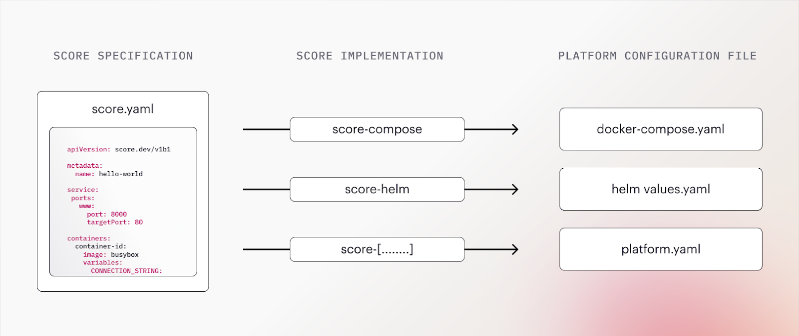
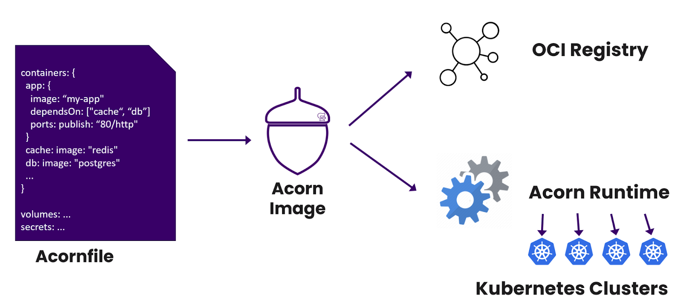

本文译自：<https://www.infracloud.io/blogs/decoding-workload-specification-for-effective-platform-engineering/>

摘要：这篇文章介绍了工作负载规范的概念和作用，它是一种标准化的方法，可以简化和统一不同环境下的软件部署，减轻开发者的认知负担。

---

在理想的情况下，开发人员专注于编写应用程序，而运维团队专注于将它们的工作负载无缝部署到不同的环境中。然而，现实远非如此。

开发人员经常难以理解每个部署目标的细微差别，这增加了他们的认知负担。例如，他们可能在本地开发中使用 Docker Compose，但他们的工作负载可能在 Kubernetes 环境中部署。这种差距可能导致错误和不一致，影响工作负载的开发和部署。

这就是为什么有迫切需要通过内部开发者平台（IDP）的标准化方法来配置工作负载。平台工程试图通过提供工具来管理工作负载来解决这个问题。

在这篇博文中，我们将深入探讨工作负载规范的复杂性，这有助于简化代码从一个环境过渡到另一个环境，并减轻开发人员的认知负担。听起来激动人心吗？让我们深入了解。

## 了解工作负载规范

工作负载规范充当软件开发和部署的指南。它是一种结构化的蓝图，概述了工作负载所需的各种配置、应用程序的资源要求、依赖关系和缩放策略等。这通过使部署过程保持一致和准确，促使无错误和高效的工作负载而简化。

让我们看一些突显对工作负载规范的需求的场景。

### 一致的部署

将工作负载部署到不同的环境意味着每个部署都变成一个独特的挑战。每个部署将具有不同的配置设置、缩放参数和资源要求。这可能导致不一致性和错误，使部署和迁移成为一场噩梦。使用工作负载规范，团队可以拥有遵循最佳实践的标准化模板，这不仅减少了错误，还实现了工作负载的一致部署。

### 减少认知负担

开发人员处理多个环境，如演示、集成、生产等，他们需要在这些环境的不同配置上保持警惕。在部署到不同环境时，他们必须记住并应用这些变更到他们的工作负载，这会增加配置错误的风险。工作负载规范减轻了开发人员的认知负担，并作为工作负载的单一综合模板。

### 更好的协作

随着部署工作负载的多个环境的存在，开发和运维团队都需要正确满足需求。开发人员可能难以与运维团队沟通其工作负载的确切需求，而运维团队可能难以在不同环境中一致地实施这些配置。工作负载规范充当开发和运维团队的共同语言，促进协作和清晰沟通，从而实现更顺畅的工作流程。

在了解了工作负载规范是什么以及为什么需要它们之后，我们将在以下部分探讨指定工作负载的各种可用选项。

## 实际中的工作负载规范

采用工作负载规范提供了对前面讨论的挑战的实际解决方案。工作负载规范简化了配置、部署和管理工作负载的过程，促进了一致性、减少了错误，并提高了开发和运维团队之间的协作。

有多种方式和工具可供您指定您的工作负载。在这一部分，我们将探讨三种流行的用于工作负载规范的开源选项以及如何使用它们。

### Score

[Score](https://github.com/score-spec/spec) 是一个基于容器的、平台无关的工作负载规范。使用 Score，您可以为您的工作负载创建一个统一的定义，该定义可以使用 Score CLI 被翻译为其他平台，如 Helm 和 Docker Compose。

它通过提供一个 `score.yaml` 文件简化了工作负载描述，该文件自动化和标准化了配置生成。当与 Score 实现一起执行时，比如 `score-compose` 或 `score-yaml`，它会生成平台特定的配置文件，如 `docker-compose.yaml` 和 Helm 的 `values.yaml`。这些文件可以直接在相应的环境中执行，并且还可以进一步定制。



（图片来源：[Score/GitHub Repo](https://github.com/score-spec/spec/raw/main/docs/images/how-score-works.png)）

#### Score 到 YAML 示例

如前所述，Score 提供了可以用来处理 `score.yaml` 文件以生成特定工作负载配置文件的不同实现。我们将看看如何将 `score.yaml` 转换为可以与 Helm

 一起使用的 `values.yaml` 文件。

以下是一个定义工作负载详细信息的示例 score.yaml 文件。

```yaml
apiVersion: score.dev/v1b1

metadata:
  name: hello-world

containers:
  hello:
    image: busybox
    command: ["/bin/sh"]
    args: ["-c", "while true; do echo Hello World!; sleep 5; done"]
```

通过运行 `score-helm run -f ./score.yaml -o ./values.yaml` 命令，Score 会自动将您的 `score.yaml` 文件转换为有效的 `values.yaml` 文件。

```yaml
containers:
  hello:
    args:
    - -c
    - while true; do echo Hello World!; sleep 5; done
    command:
    - /bin/sh
    image:
    name: busybox
```

您可以使用 `helm install hello --values ./values.yaml` 部署工作负载。

这样，您可以使用 Score 指定工作负载的单一规范，并将其转换为 Docker Compose、Helm 或自定义规范。

#### 使用 Score 的好处

在涉及工作负载规范时，Score 提供了实质性的好处。其中一些是：

- **声明性的**: Score 允许开发人员以声明性的方式定义其工作负载所需的资源。您可以声明工作负载所需的“什么”资源，而无需担心这些资源将如何被配置。 “如何”通常是一个特定于环境的实现，Score 会处理这个问题。
- **集成**: 使用 Score 实现时，`score.yaml` 文件可以被转换为可以无缝在不同环境中使用的规范，并成为您的工作流程的一部分。它为您提供了一个文件更改，Score 可以处理它，而不考虑底层技术栈的任何更改。

请参阅 [Score 文档](https://docs.score.dev/docs/get-started/) 以了解更多有关 Score 的信息并入门。

### Acorn

[Acorn](https://github.com/acorn-io/runtime) 是另一个用于在 Kubernetes 上部署应用程序的开源打包工具。它将 docker 镜像、设置和部署捆绑成一个 Acorn 镜像包。该包可以上传到任何 OCI 容器存储库，适用于在任何 Kubernetes 环境中部署。

开发人员在 Acornfile 中描述应用程序的设置。该文件涵盖了应用程序的方面，而开发人员无需处理 Kubernetes yaml 文件的复杂性。您可以使用 Acorn CLI 在 Kubernetes 集群上创建、部署和管理 Acorn 镜像，从而简化在 Kubernetes 上部署应用程序的过程。



（图片来源：[Acorn](https://docs.acorn.io/assets/images/acorn.workflow-0fc70d0200340a9d8adf7c9a983616ab.png)）

#### Acornfile 示例

Acornfile 遵循类似 yaml 的熟悉语法，因此作为开发人员，您无需学习任何新东西。该模板包含不同组件，如容器、卷、密码、作业、服务、权限等组件，[定义了工作负载](https://docs.acorn.io/authoring/structure)。

以下是一个简单的 Acornfile，其中包含一个 Nginx 容器和一个在屏幕上打印消息的 index.html 文件。

```yaml
containers: {
 web: {
  image: "nginx"
  ports: publish: "80/http"
  files: {
   // 简单的 index.html 文件
   "/usr/share/nginx/html/index.html": "<h1>My First Acorn!</h1>"
  }
 }
}
```

可以使用 `acorn run .` 部署上面的 Acornfile，Acorn 将会将该应用程序部署到目标 Kubernetes 集群，并为您配置网络和存储。因此，即使不了解 Helm，您也可以将应用程序部署到 Kubernetes 集群。

#### 使用 Acorn 的好处

摘要：Acorn 作为工作负载规范和应用打包工具，为开发人员和 DevOps 团队提供了引人注目的优势。其中一些包括：

- **应用级定义**：开发人员可以使用 Acornfile 不仅定义基础设施级结构，还可以定义应用级配置。从环境变量和秘密到服务地址和端口，Acornfile 允许您从单个文件定义所有所需配置，为应用部署带来结构。
- **OCI 兼容镜像**：在容器领域，OCI 符合性是一个关键标准，确保容器具有互操作性并可在不同容器运行时上运行。包含 Docker 镜像、配置和部署规范的 Acorn 镜像遵循 OCI 标准，简化了部署过程，提高了应用的可移植性。

您可以阅读更多关于[使用 Acorn](https://docs.acorn.io/)的信息。

### Dagger

如果您是一位正在构建自定义工具以统一组织内持续交付的平台工程师，那么[Dagger](https://github.com/dagger/dagger)是一个值得探索的好选择。Dagger 允许您使用与应用程序相同的语言编写工作流，从而使其更容易更快速。它将您的流水线作为标准 OCI 容器运行。

您可以使用基于您使用的编程语言的 Dagger SDK 来准备以编程方式执行工作流。在撰写本文时，Dagger 具有[Go](https://docs.dagger.io/sdk/go)、[Python](https://docs.dagger.io/sdk/python)和[NodeJS](https://docs.dagger.io/sdk/nodejs) SDK，可以供使用。


（图片来源：[Dagger 的工作原理？](https://docs.dagger.io/)）

#### Dagger 流水线示例

由于 Dagger 允许您使用自己选择的语言编写流水线，我们将快速了解如何使用[Dagger Python SDK](https://docs.dagger.io/sdk/python)。在安装了 SDK 后，您可以创建一个类似下面的 Python 文件。

```python
import sys
import anyio
import dagger


async def test():
    async with dagger.Connection(dagger.Config(log_output=sys.stderr)) as client:
        python = (
            client.container()
            # 拉取容器
            .from_("python:3.11-slim-buster")
            # 获取 Python 版本
            .with_exec(["python", "-V"])
        )

        # 执行
        version = await python.stdout()

    print(f"Hello from Dagger and {version}")


anyio.run(test)
```

上面的文件基本上创建了一个 Dagger 客户端，充当与 Dagger 引擎的接口。它还从一个镜像初始化了一个新的容器（在这种情况下是 Python 3.11 slim），该容器返回一个容器。然后，使用此容器执行指定的命令。

通过使用 `dagger run python test.py` 执行此命令，它将创建一个容器并执行命令，然后返回结果。

```plaintext
Hello from Dagger and Python 3.11.1
```

您可以配置容器以满足工作负载所需的不同配置，Dagger 将为每次创建这些容器，从而提供一致的环境。

#### 使用 Dagger 的好处

Dagger 使开发人员更容易将流水线作为代码实现，并始终提供一致的环境。以下是使其脱颖而出的一些优点：

- **可移植性**：Dagger 的最大优势在于可移植性。使用 Dagger 创建的工作流可以在本地机器上执行，任何容器托管服务上执行，或者在服务器上执行。这消除了对广泛配置更改的需求，并确保更平稳和一致的部署。
- **跨语言支持**：Dagger 支持使用您喜欢的语言构建工作流，从而使团队能够利用彼此的工具和资源，而无需学习新语言。这允许多样化的团队在不学习新技术的情况下一起使用他们喜欢的技术栈，从而加速开发周期。

您可以参考[Dagger 文档](https://docs.dagger.io/)了解有关使用 Dagger 创建工作流的更多信息。

这些是一些流行的开源工具，可以用来指定工作负载。我们理解并不是每个人都有相同的工作负载要求，但这是否意味着您应该构建自己的工具来定义和管理工作负载呢？

## 工作负载规范的开源工具与自己动手 - 该选择哪一个？

在本博客文章的前几节中，我们讨论了开源解决方案。但并不总是一切都符合您的需求，这时您可能需要考虑构建一些符合您需求的特定工具。

然而，在选择开源解决方案和自己动手解决方案之间做出决策可能是关键的。虽然自己动手可能看起来是一个诱人的选择，您可以完全掌控一切，但它可能导致额外的责任。

例如，构建和维护自定义解决方案可能会降低团队的生产力，使他们的注意力从核心开发任务转移。此外，自己动手的解决方案通常需要持续的维护和更新，未能跟上这些可能导致漏洞和兼容性问题的更新可能会产生问题。

以下是关于**为什么选择开源解决方案更好**的一些建议。

### 最佳资源利用

如果选择自己构建工作负载规范工具，您很可能会花费大量时间和资源。您不仅需要资源来构建它，还需要资源来维护它。自己动手的解决方案将需要持续的关注以解决错误，实施新功能，并适应不断变化的需求。

### 利用最佳实践

创建自己动手的解决方案可能能够提供您所需的内容，但您可能会错过行业最佳实践。由于这些原因，您可能会牺牲提高效率和质量的已建立的实践。这样的工具可能缺乏一些优化，从而导致效率较低的结果。

### 避免重复造轮子

当您已经有一款高效且功能丰富的产品时，为什么要从零开始构建呢？选择开源解决方案使您能够利用一个精心构建的产品，它将为您节省时间和资源，并为您提供行业最佳实践、社区支持和专业知识。仍然想要重新发明轮子吗？

## 总结

随着环境数量的增加，开发人员通常需要学习每个环境的细微差别以部署其应用程序。这就是工作负载规范派上用场的地方。它们定义了一个蓝图，允许开发人员指定一个规范并将其应用程序部署到不同的环境中，而无需额外的认知负担。

Score、Acorn 和 Dagger 等工具通过提高开发人员的生产力来简化创建工作负载规范的流程。这些开源工具帮助开发人员和 DevOps 团队轻松地将工作负载部署到不同的环境中。

尽管构建自己的解决方案可能很诱人，但开源解决方案提供了业界领先的功能，同时为您节省了时间和精力。在这方面，我们在[InfraCloud 可以提供定制的解决方案](https://www.infracloud.io/platform-engineering-consulting/)来管理您的工作负载。

此外，欢迎在此博客文章中与我分享您的想法，以及对平台工程的看法。通过[LinkedIn](https://www.linkedin.com/in/atulpriyasharma)或[Twitter](https://twitter.com/TheTechMaharaj)与我联系。
