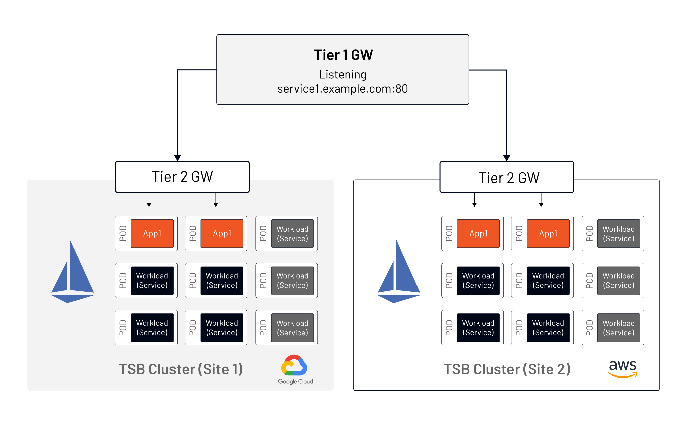
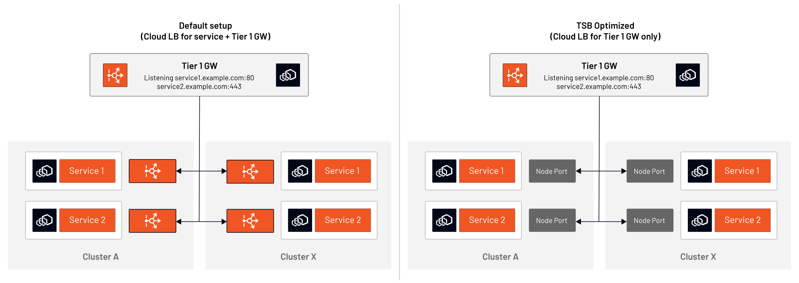
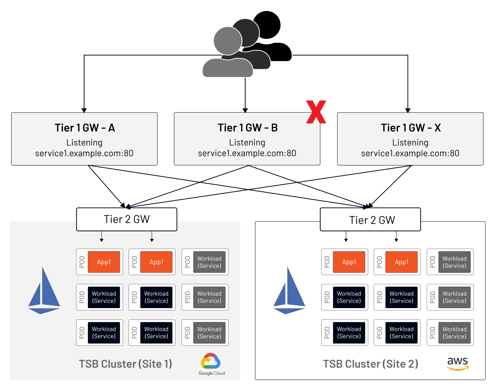

## 编者的话{#foreword}

本文是来自 [Tetrate](https://tetrate.io) 工程师的分享，Tetrate 的拳头产品是 [Tetrate Service Bridge](https://tetrate.io/tetrate-service-bridge)（下文简称 TSB），它是在开源的 Istio 和 Envoy 基础上构建的，但为其增加了管理平面。

## 简介{#intro}

Tetrate 的应用连接平台 Tetrate Service Bridge（TSB）提供两种网关类型，分别为一级网关（Tier-1）和二级网关（Tier-2），它们都基于 Envoy 构建，但是目的有所不同。本文将探讨这两种类型网关的功能，以及何时选用哪种网关。

关于两级网关的简要介绍：

- 一级网关（下文简称 T1）位于应用边缘，用于多集群环境。同一应用会同时托管在不同的集群上，T1网关将对该应用的请求流量在这些集群之间路由。
- 二级网关（下文简称 T2）位于一个的集群边缘，用于将流量路由到该集群内由服务网格管理的服务。

## 两级网关释义{#explain}

托管在 TSB 管理的集群中的应用部署的设计与开源的 Istio 模型非常相似。它们的结构相同，使用入口网关来路由传入的流量。T2 网关相当于 Istio 的入口网关（Ingress Gateway），在逻辑上与 Istio 开源模型相同，如图 1 所示。


Tetrate Service Bridge 使用 Istio 和 Envoy 构建的服务网格管理集群的控制平面和数据平面，其本身不存在于应用数据路径中。比较开源 Istio 管理的集群和 TSB 管理的集群之间的数据包路径，你会发现两者之间没有区别。TSB 的配置清单（manifest）被 Istio 消费和使用。通过这种方式，TSB 的作用类似于 CI/CD 自动化逻辑，其中部署过程会影响应用程序的行为，但不会影响应用程序逻辑本身。

TSB 在开源 Istio 的增加了一些组件，以管理每组应用程序网关范围的安装和配置，以加快开发和运维人员的工作进度，将基础设施和应用程序之间的职责分离，将错误配置网关的影响与其他应用程序/业务组隔离。

## 何时使用 T1 网关？{#when-use-t1}

当你有两个或更多的 Kubernetes 集群为同一个应用服务时，为了增加容量、蓝绿部署、故障转移等，问题总是出现：入站流量如何在这些集群之间分配？ 在每个集群边缘的 T2 网关允许直接访问应用程序 —— 例如，集群 A 将监听 `service1A.example.com`，集群 X 将监听 `service1X.example.com`。反过来，T2 网关提供跨集群的全局负载均衡。跨集群的流量路由分配基于 1 到 100 之间的权重值，指定发送到特定集群的流量的百分比。

下面是一个简单的 T1 网关配置的例子。这个例子表示了一个完整的 T1 网关清单，以证明该解决方案的简单性。关于具体设置的细节，请参考[ Tetrate API 文档](https://docs.tetrate.io/service-bridge/1.4.x/en-us/refs/tsb/gateway/v2/tier1_gateway#tier1gateway)。

```yaml
apiVersion: gateway.tsb.tetrate.io/v2
kind: Tier1Gateway
metadata:
  name: service1-tier1
  group: demo-gw-group
  organization: demo-org
  tenant: demo-tenant
  workspace: demo-ws
spec:
  workloadSelector:
    namespace: service1-tier1
    labels:
      app: tsb-gateway-service1-tier1
      istio: ingressgateway
  externalServers:
  - name: service1
    hostname: service1.cx.example.com
    port: 80
    tls: {}
    clusters:
    - name: site-1-gcp
      weight: 75
    - name: site-2-aws
      weight: 25 
```

在这个例子中，到 `service1.cx.example.com` 的 75% 用户请求被转发到 GCP 中的 `site-1`，其余的转发到 AWS 中的 `site-2`。这个例子中的流量到达明文端口 80，之后 T1 网关和应用集群之间的所有通信都经过 mTLS 加密。



## 云供应网关整合{#consolidate}

Istio 用户通常按应用模型实施入口网关。这种方法保证了对一个应用程序及其工件的安全、独立管理。

这里注意到的最常见的痛点 —— 每个应用都需要使用云供应商的负载均衡器。这样做使得用户需要维护位于 Envoy 入口网关 Pod 前大量的负载均衡器，这带来资金开销和管理成本。

TSB 允许通过 NodePort 服务类型而不是 LoadBalancer 进行服务发现和通信，这意味着不再需要云供应商的负载均衡器；**TSB 集群内的服务可以通过 NodePort 直接到达**。T1 网关允许我们将云供应商负载均衡器的使用压缩到一个单一的入口点。



图 3 展示了通过将集群内的服务连接转移到 TSB，而不使用云供应商的负载均衡器来简化云设置。在没有 TSB 的情况下，要实现上述设置，需要使用外部负载均衡器。TSB 还维护 Kubernetes 节点的列表。

## 资源要求{#resource-requirement}

就 T2 网关所需的资源而言，开源 Istio 和 TSB 的要求没有什么不同。事实上，实现方式是一样的 —— Gateway 和 VirtualService 清单可以手动创建，也可以通过开源的自动化工具创建。在 Tetrate 的用例中，TSB 为 Istio 创建清单。

T1 网关确实需要一个专门的控制平面，这意味着网格管理的应用程序和 T1 网关不能在同一个集群中运行，尽管承载 T1 网关的 Kubernetes 集群也可以承载服务网格以外的应用程序。不过，Tetrate 的有些客户将 T1 网关放在与 TSB 管理平面相同的集群上。

## 架构考虑因素{#consideration}

随着应用环境的发展和成熟，出现新的需求是很常见的。T1 网关可以作为初始服务网格架构实施的一部分进行规划和实施，也可以在以后添加。增加一级网关只影响入口点的入站流量，但不需要对现有集群做任何改变。

图 4 展示了一个没有 T1 网关的部署配置。


当引入 T1 网关时（图5），必须更新 DNS 记录以指向一级网关，而不需要对应用集群的设置进行修改。



TSB 不是 DNS 管理工具，DNS 记录的更改是在 TSB 之外进行的（有多种自动化工具和技术可用于该操作)。


然而，在添加 T2 网关时，从使用 LoadBalancer 切换到 NodePort 架构，确实需要对应用集群进行轻微的改变。

虽然 T1 网关作为应用边缘传入流量的前端，但它可以部署在一个高可用性的配置中（图 6）。



在高可用性方面，可以使用 T1 网关的数量没有限制。这种灵活的架构允许用户建立强大的设计以满足广泛的要求。

## 总结{#summary}

本文涵盖了服务网格架构师在企业环境中设计 TSB 部署时最常见的架构问题。以下是最重要的收获：

- TSB T1 和 T2 网关使用 Istio 入口网关 Pod 和服务。这里没有引入额外的专有组件。
- TSB 支持开源 Istio 中的网关模式。仅仅是名称上的改变，如 TSB 的入口网关被称为 T2 网关。
- 单一的网关可以用于所有的应用，也可以采用按应用划分的网关模式。
- TSB 可以通过利用 Kubernetes NodePort 而不是 LoadBalancer 进行集群内通信，减少使用的云厂商负载均衡器的数量，从而降低云计算成本。
- TSB T1 网关提供跨集群负载均衡功能。
- 由于在实施的早期阶段可能不需要跨集群负载均衡，因此 T1 网关不需要成为初始部署的一部分，可以在以后添加，对现有的应用程序没有重大影响。
- 多个 T1 网关可以部署在同一个应用程序前面，以实现高可用性。
