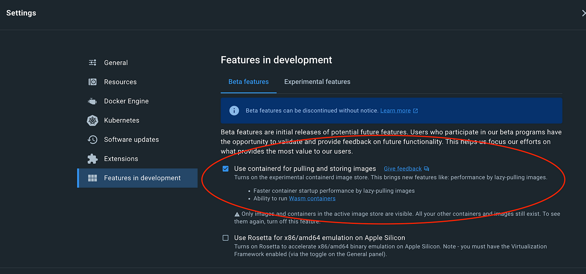

> 译者注：本文译自 [Docker + WebAssembly: a quick intro | by Fabrizio Guglielmino | Medium](https://medium.com/@guglielmino/docker-webassembly-a-quick-intro-730c38e8390c)，本文介绍了使用 Docker 和 WebAssembly 创建容器的过程。通过比较标准 Docker 容器和 WebAssembly 容器，作者指出 WebAssembly 容器具有性能优势、架构中立等优点，但也存在不成熟的问题。WebAssembly 容器有望彻底改变容器化应用程序的方式。

今天，我想展示一种实用且有趣的使用 Docker 的方式：在容器中使用 WebAssembly。

我说 “实用的方式”，这就是为什么我假设您有一些经验：

1. Docker（当然）
2. Rust（实际上，只是为了理解 “Hello World”）
3. WebAssembly；只需要对其有一个基本的了解（注意：我将在讨论中交替使用 WASM 和 WebAssembly 这两个术语）

关于我即将展示的内容，简单说一下：一个 Docker 容器是一个包含运行环境的映像的运行实例。运行环境通常是一个操作系统，大多数情况下是 Linux。操作系统是运行应用程序的必要条件。

如果我们能够在最小化依赖关系的情况下运行应用程序，甚至不需要任何依赖关系，会怎样呢？

这就是我想谈论的想法：使用 WASM，以及 Docker 中（目前测试版）的支持，我们将创建一个不含任何操作系统基础镜像的容器。

## 为什么是 WebAssembly 容器？

引用 Docker 的作者 Solomon Hykes 的话：

> “如果 WASM+WASI 在 2008 年就存在了，我们就不需要创造 Docker 了。”

这可能足够了，但让我们列举一些具体的好处：

- **安全性**：仅部署我们的代码可以减少 “攻击面”，从而提高整体安全性
- **大小**：我们可以创建比等效于带有操作系统的应用程序更小得多的容器
- **性能**：如您所料，没有操作系统层，WASM 容器可以表现出更好的性能（不总是正确的，但平均而言是正确的）
- **架构中立性**：Docker 容器是为特定目标架构（arm、x86 等）编译的，只能在具有相同架构的主机上运行。相比之下，WebAssembly 是架构中立的，这意味着只要运行时可用，应用程序就可以在任何底层架构上运行。这提供了几个优点，例如在不需要重新编译的情况下在多个平台上运行相同的代码以及在以前不受支持的平台上运行代码的能力。

总之，使用 WebAssembly 容器有一些有趣的好处！

## 让我们开始吧

本文将高度实用，只涉及该主题的表面，并留下许多细节。这些细节将在将来的文章中深入探讨，尽管已经有许多很好的资源可用。

让我们从一个基本应用程序开始。尽管在这个例子中是用 Rust 编写的，但使用的语言并不重要，只要它支持 WebAssembly 作为编译目标即可。

假设在计算机上已经安装了 Rust（[如果没有](https://www.rust-lang.org/tools/install)），让我们使用 `cargo new rust-wasm-docker` 创建一个新的 Rust 应用程序

这将创建最小化的 Rust 应用程序结构。

```
total 8
drwxr-xr-x@ 3 fabrizio  staff   96 Jan 12 20:55 src
-rw-r--r--@ 1 fabrizio  staff  186 Jan 12 20:55 Cargo.toml
```

我们可以保留提供的最小应用程序代码，这是一个相当常见和易读的 “Hello World”。

```
# cat src/main.rs
fn main() {
    println!("Hello, world!");
}
```

让我们尝试使用 `cargo run` 运行，输出应该是 “Hello, world!”。

## 常见的 Docker 方式

如果没有 WebAssembly 的方法，我们将创建一个 Docker 镜像：

```
FROM rust:latest

WORKDIR /usr/src/myapp
COPY . .

RUN cargo install --path .

CMD ["wasm-docker-hello"]
```

这是一个非常简单的 `Dockerfile` ，它使用 Docker Hub 的 `rust` 基本镜像，将源从当前主机目录复制到镜像中的 `/usr/src/myapp` ，运行 `cargo install` 来编译应用程序，最终将应用程序二进制文件定义为容器命令。

假设 Docker 已经安装在计算机上（[如果没有](https://docs.docker.com/get-docker/)），我们可以使用以下命令创建一个镜像： `docker build -t hello-docker .` 该命令使用当前目录中的 Dockerfile 构建镜像，并将其标记为 “hello-docker”。

然后，在构建镜像后，我们可以使用 `docker run hello-world` 运行它。

```bash
# docker run hello-docker
Hello, world!
```


现在，让我们尝试进行另一个快速测试，稍后在本文中更清楚地说明 WebAssembly 容器的区别。我们可以使用 `bash` shell 覆盖默认命令来运行我们的镜像。

```bash
docker run -it hello-docker bash
root@be1902d5e9b6:/usr/src/myapp#
```


输出可能略有不同，因为容器 ID（be1902d5e9b6）在每次运行容器时都是随机生成的。无论如何，这里的重要点是，您可以获取一个 shell 与之交互，就像在任何常见的 Linux 机器上一样。

## 走进 WebAssembly

现在，让我回顾一下我们到目前为止所做的事情：

1. 我们创建了一个非常（非常）简单的 Rust 应用程序
2. 我们在主机机器上构建和运行了该应用程序
3. 我们创建了一个 `Dockerfile` 来构建应用程序和镜像
4. 我们通过成功运行它来测试了 Docker 镜像的功能

接下来呢？目标是仅使用我们的应用程序创建一个 docker 镜像。要非常明确：这意味着一个不含任何操作系统的镜像作为运行环境。实际上，我运行了 `docker run -it hello-docker bash` 来展示我们创建的镜像实际上是一个带有我们的应用程序捆绑的 Linux 运行环境。

在继续之前，我们需要配置一些工具。首先，我们必须设置编译 WebAssembly + WASI 的能力，然后启用实验性的 Docker 功能以运行 WASM 容器。

让我们开始使用 `rustup target add wasm32-wasi` 安装 WASI。

> WASI（WebAssembly 系统接口）是一组规范和 API，提供了执行 WebAssembly 代码的标准接口，这些代码不在 Web 浏览器中运行，例如在服务器或独立应用程序中运行。它允许 WebAssembly 模块访问系统资源，如文件系统和网络，并提供安全的沙箱环境。它提供了使 WebAssembly 成为独立可执行格式所需的关键功能，使其能够用于各种超越 Web 的场景。

到目前为止一切顺利！现在可以运行 `cargo build --target wasm32-wasi` 编译 WebAssembly。如果尝试，我们将在 `target/wasm32-wasi/debug` 目录中获得一个名为 `wasm-docker-hello.wasm` 的文件。很好，但是我们该如何运行此二进制文件？尝试像普通可执行文件一样执行它，如 `. ./target/wasm32-wasi/debug/wasm-docker-hello.wasm`，我们会收到错误，为什么？实际上，错误是不言自明的：

```bash
zsh: exec format error: ./target/wasm32-wasi/debug/wasm-docker-hello.wasm
```

wasm 文件不是为我们主机的本机架构（无论是 x86_64、arm 还是其他）构建的。我们需要一个 **WebAssembly 运行时**。

## WebAssembly 运行时：将 WASM 带到各处

有许多 WASM 运行时。WebAssembly 最初是为在 Web 浏览器中使用而设计的，在这种情况下，运行时不需要，因为 **浏览器充当运行时**。但是，在创建命令行应用程序的情况下，需要运行时，对于完整的应用程序、服务器等也是如此。

我们将安装 **WasmEdge**，这是 Docker 用于执行我们的 WASM 镜像的运行时。如果您在 Mac OS 或 Linux 机器上，可以使用以下命令进行安装：

```bash
curl -sSf <https://raw.githubusercontent.com/WasmEdge/WasmEdge/master/utils/install.sh> | bash
```

如需完整的安装说明（包括 Windows），请在此处查看 https://wasmedge.org/book/en/quick_start/install.html。

## 启用 Docker+WASM 集成

最后一步是启用 Docker 中的 WASM 支持，这是目前的实验性功能。可以通过启用 containerd 镜像存储库来完成此操作。

使用 Docker Desktop，只需在设置页面中打开该功能即可。



详细说明可以在此处找到 https://docs.docker.com/desktop/wasm/。

## 准备创建 “无操作系统 “的容器

现在我们已经准备好创建一个新的 Dockerfile（我们将其命名为 `Dockerfile.wasm` 以区分它与以前的文件），内容如下。

```bash
FROM scratch
COPY target/wasm32-wasi/debug/wasm-docker-hello.wasm /app.wasm

ENTRYPOINT [ "app.wasm" ]
```

它非常简短和易懂，但有几个要点需要强调：

1. 它以 “FROM scratch” 开始，表示该镜像是从头开始构建的，不会继承任何操作系统环境
2. 我们将编译后的二进制文件复制到镜像中，在前一个示例中，我们复制了源文件并在构建镜像过程中对其进行了编译，这里我们使用已经编译好的（在主机上）wasm 二进制文件
3. `ENTRYPOINT` 是二进制文件本身，这里没有指定运行时

构建我们的镜像，方式与我们为 “通用” 镜像所做的方式相同。

```bash
docker build -t wasm-docker -f Dockerfile.wasm .
```

也许有人已经注意到了一个有趣的点：Docker 如何知道在 ENTRYPOINT 指向.wasm 二进制文件的镜像中使用 **WasmEdge** 作为运行时？我们已经测试过，直接运行.wasm 文件不起作用。

实际上没有，我们需要在启动容器时指定运行时。

```bash
docker run --runtime=io.containerd.wasmedge.v1 --platform=wasi/wasm32 b678ba11b941
```

我们指定 `--runtime` 告诉 Docker 使用 WasmEdge 作为运行时，并指定 `--platform` 使用 WASI 接口作为平台。就这样，如果您按照所有步骤操作，您应该看到一个令人兴奋的 “Hello, world!”。

当然，我是开玩笑的，比较镜像大小使用 `docker images` 命令可以看到更有趣的结果。

```bash
REPOSITORY                  TAG       IMAGE ID       CREATED         SIZE
hello-docker                latest    e9ed5014b408   7 seconds ago   544MB
wasm-docker                 latest    b678ba11b941   2 seconds ago   507kB
```

`hello-docker` 是我们在开始时构建的镜像，尺寸差异巨大。

## **结论**

在本文中，我们比较了标准 Docker 容器和 WASM 容器。标准 Docker 容器和 WebAssembly 容器都有各自独特的优点和限制，但 WASM 正在展示成为一种高度有前途的容器化技术，尤其是对于某些用例。与标准 Docker 容器相比，WebAssembly 提供了性能优势，例如更快的启动时间、更低的内存使用率以及代码和主机系统之间更好的隔离。此外，WebAssembly 是架构中立的，这意味着只要运行时可用，应用程序就可以在任何底层架构上运行。这提供了多种优势，例如在多个平台上运行相同的代码而无需重新编译，并能在以前不支持的平台上运行代码。甚至可以在诸如物联网、边缘计算等受限设备上扩展容器的使用。

然而，值得注意的是，WebAssembly 仍处于早期阶段，尚不成熟，尚不具备广泛采用的条件。尽管如此，重要的是要关注这项技术，因为它有潜力彻底改变我们容器化应用程序的方式。
