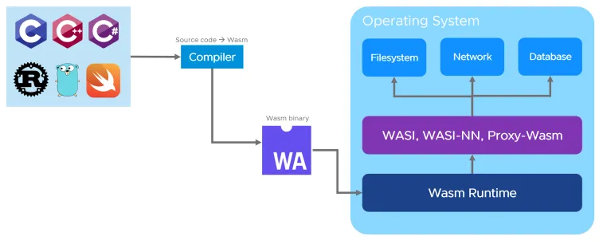
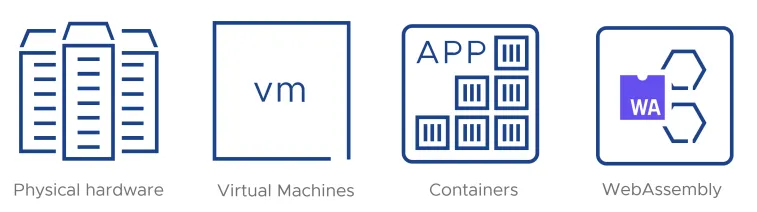
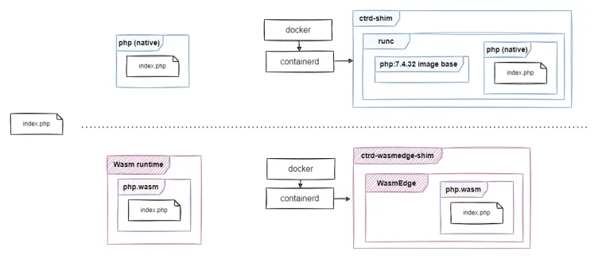

最近，Docker 宣布与 WasmEdge 合作，在 Docker 生态系统中支持 [WebAssembly](https://docs.docker.com/desktop/wasm/)。

本文将介绍什么是 WebAssembly，以及为什么它与 Docker 生态系统相关，并提供一些实践示例。我们假设您熟悉 Docker 工具集。我们将使用我们的 [WebAssembly PHP 的端口](https://wasmlabs.dev/articles/php-wasm32-wasi-port/) 来演示如何构建 PHP 解释器，将其打包为 OCI 镜像的一部分，并使用 Docker 运行它。

请注意，本文的重点是获得实践经验，而不是讨论技术细节。您可以复制以下示例，也可以只读到最后，因为我们还将提供输出。

## WebAssembly - 什么？为什么？

这是一个非常基本的介绍。如果您已经熟悉该技术，则可以跳到动手环节。

### 什么是 WebAssembly？

WebAssembly（或 Wasm）是一个开放标准，定义了一种二进制指令格式，可以从不同的源语言创建可移植的二进制可执行文件。


这些二进制文件可以在各种环境中运行。它起源于 web，并得到所有主要浏览器的支持。

### Wasm 在浏览器中是如何工作的？

浏览器引擎集成了一个 Wasm 虚拟机，通常称为 Wasm 运行时，它可以运行 Wasm 二进制指令。有编译器工具链（如 Emscripten）可以将源代码编译为 Wasm 目标。这允许将传统应用程序移植到浏览器，并直接与在客户端 Web 应用程序中运行的 JS 代码通信。


这些技术使传统桌面应用程序可以在浏览器中运行。现在它们可以在任何您拥有浏览器的设备上运行。一些著名的例子是 [Google Earth](https://earth.google.com/) 和计算机视觉的 [Open CV](https://opencv.org/) 库。

### Wasm 在服务器上是如何工作的？

有一些 Wasm 运行时可以在浏览器之外运行，包括传统操作系统，如 Linux、Windows 和 macOS。由于它们不能依赖于 JavaScript 引擎的可用性，它们使用不同的接口（例如 WASI，[WebAssembly 系统接口](https://wasi.dev/)）与外界通信。这些运行时允许 Wasm 应用程序以与 POSIX 类似（但不完全相同）的方式与其主机系统交互。像 WASI SDK 和 wasi-libc 这样的项目可以帮助人们将现有的 POSIX 兼容应用程序编译到 WebAssembly。



您只需要将应用程序编译为 Wasm 模块一次，然后就可以在任何地方运行完全相同的二进制文件。

### 什么使 Wasm 如此出色？

一些使 Wasm 在浏览器中出色的功能也使其对服务器端开发非常有吸引力：

🌐 开放 - 它是行业广泛采用的标准。与过去的浏览器之争不同，主要公司正在协作标准化 WASI 和 WebAssembly 应用程序。

🚀 快速 - 它可以通过大多数运行时的 JIT/AOT 能力提供类似本机的速度。不像启动 VM 或启动容器那样有冷启动。

🔒 安全 - Wasm 运行时默认情况下是隔离的，并允许安全地访问内存。基于能力的模型确保 Wasm 应用程序仅能访问其明确允许的内容。安全的供应链。

💼 可移植 - 在几个主要运行时中，支持大多数 CPU（x86、ARM、RISC-V）和大多数操作系统，包括 Linux、Windows、macOS、Android、ESXi，甚至非 POSIX 的操作系统。

🔋 高效 - Wasm 应用程序可以通过最小的内存占用和 CPU 要求运行。

🗣️ 多语言支持 - 40 多种语言可以编译为 Wasm，并具有现代的、不断改进的工具链。

### 服务器平台演进的下一步？

您可能已经看到过 Docker 的共同创始人之一 Solomon Hykes 的这段 [引述](https://twitter.com/solomonstre/status/1111004913222324225)：

> 如果 WASM+WASI 在 2008 年存在，我们就不需要创建 Docker 了。这就是它的重要性。WebAssembly 在服务器上是计算的未来。
> 

确实，WASM+WASI 似乎是服务器端软件基础架构演进的下一步。

- 在过去，我们有物理硬件可用。我们会在每个盒子上仔细安装操作系统和应用程序，并逐个维护它们。
- 然后，随着由 VMware 开创的 VM 的采用，事情变得更容易了。人们可以复制、克隆和移动 VM 跨硬件盒。但这仍然需要在 VM 中安装操作系统和应用程序。
- 然后，容器出现了，由 Docker 推广，它使得在极简的包装上下文中运行应用程序配置变得更加容易，而不会影响主机操作系统上的任何其他应用程序。然而，这仍然需要分发应用程序与其运行时和必要的库捆绑在一起。安全边界由 Linux 内核提供。
- 我们现在有了 WebAssembly。它的技术特点和可移植性使得分发应用程序变得可能，无需运输 OS 级别的依赖项，并且可以在严格的安全约束下运行。

考虑到所有这些，开发人员通常会将 WebAssembly 视为容器的“继承者”和基础架构部署的下一个逻辑步骤。



然而，另一种看待 WebAssembly 的方式是作为 Docker 工具链的替代“后端”。您可以使用相同的命令行工具和工作流程，但是，而不是使用 Linux 容器，它是使用基于 WebAssembly 的容器等价物实现的。本文的其余部分探讨了这个概念，这就是我们所说的“没有容器的 Docker”标题。

### Wasm 如何与 Docker 配合使用？

Docker Desktop 现在包括对 WebAssembly 的支持。它是使用一个称为 [WasmEdge](https://github.com/WasmEdge/Wasmedge) 的 Wasm 运行时运行 Wasm 应用程序的 containerd shim 实现的。这意味着，与运行容器镜像中的二进制文件的单独进程不同，您现在可以在 WasmEdge 运行时中运行 Wasm 应用程序，模拟容器。

因此，容器镜像不需要包含正在运行的应用程序的 OS 或运行时上下文——单个 Wasm 二进制文件就足够了。

这在 Docker 的 [Wasm 技术预览文章](https://www.docker.com/blog/docker-wasm-technical-preview/) 中有详细说明。

### 什么是 WasmEdge？

[WasmEdge](https://github.com/WasmEdge/Wasmedge) 是一个高性能的 WebAssembly 运行时，具有以下特点：

- 是开源的，是 [CNCF](https://cncf.io/) 的一部分。
- 支持所有主要的 CPU 架构（x86、ARM、RISC-V）。
- 支持所有主要的操作系统（Linux、Windows、macOS），以及其他操作系统，如 seL4 RTOS、Android。
- 为云原生和 Edge 应用程序进行了优化。
- 是可扩展的，支持标准和新兴技术
    - 与 Tensorflow、OpenVINO、PyTorch 一起进行 AI 推理
    - 支持使用 Tokio 进行异步网络。支持微服务、数据库客户端、消息队列等。
    - 与容器生态系统、Docker 和 Kubernetes 完美集成（正如本文所示！）

### 解释性语言呢？

到目前为止，我们只提到了编译语言（如 C 和 Rust）可以针对 WebAssembly。对于解释性语言（如 Python、Ruby 和 PHP），方法是不同的：它们的解释器是用 C 编写的，可以编译为 WebAssembly。然后，这个解释器编译为 Wasm，可以用于执行源代码文件，通常以 .py、.rb、.php 等结尾。一旦编译为 Wasm，任何具有 Wasm 运行时的平台都将能够运行那些解释性语言，即使实际的解释器从未原生地编译为该平台。


## 实际演示

让我们开始吧！在实际演示中，我们将使用编译为 Wasm 的 PHP 解释器。我们将：

- 构建一个 [Wasm 容器](https://wasmlabs.dev/articles/docker-without-containers/#building-a-wasm-container)。
- 比较 [Wasm 和本地](https://wasmlabs.dev/articles/docker-without-containers/#native-vs-wasm) 二进制文件。
- 比较 [传统和 Wasm](https://wasmlabs.dev/articles/docker-without-containers/#traditional-vs-wasm-containers) 容器。
- 展示了 [Wasm 的可移植性](https://wasmlabs.dev/articles/docker-without-containers/#wasm-portability)。

## 先决条件

如果您想在本地复制演示，您需要准备一些或全部以下内容的环境：

- WASI SDK - 从旧 C 代码构建 WebAssembly 应用程序
- PHP - 为了进行本地 PHP 二进制文件比较
- WasmEdge 运行时 - 运行 WebAssembly 应用程序
- Docker Desktop + Wasm（在撰写本文时，可在 [版本 4.15](https://docs.docker.com/desktop/release-notes/#4150) 中稳定测试版中使用）以能够运行 Wasm 容器

我们还利用了[“Wasm 语言运行时”](https://github.com/vmware-labs/webassembly-language-runtimes)存储库，该存储库提供了将 PHP 解释器构建为 WebAssembly 应用程序的方法。

您可以通过以下方式开始检查演示分支：

```bash
git clone --depth=1 -b php-wasmedge-demo \\
   <https://github.com/vmware-labs/webassembly-language-runtimes.git> wlr-demo
cd wlr-demo
```

## 构建一个 Wasm 容器

首先，我们将展示如何构建一个类似于 PHP 解释器的基于 C 的应用程序。

构建过程使用 WASI-SDK 工具集。它包括一个可以构建为 wasm32-wasi 目标的 clang 编译器，以及实现在 WASI 上的基本 POSIX 系统调用接口的 wasi-libc。使用 WASI SDK，我们可以从 PHP 的 C 代码库构建 Wasm 模块。然后，我们只需要一个基于 scratch 的非常简单的 Dockerfile 就可以制作一个 OCI 镜像，该镜像可以使用 Docker+Wasm 运行。


### 构建 WASM 二进制文件

假设你在 `wlr-demo` 文件夹中，你可以运行以下命令来构建 Wasm 二进制文件。

```bash
export WASI_SDK_ROOT=/opt/wasi-sdk/
export WASMLABS_RUNTIME=wasmedge

./wl-make.sh php/php-7.4.32/ && tree build-output/php/php-7.4.32/bin/

... ( a few minutes and hundreds of build log lines)

build-output/php/php-7.4.32/bin/
├── php-cgi-wasmedge
└── php-wasmedge
```

PHP 是使用 *autoconf* 和 *make* 构建的。因此，如果你查看 `scripts/wl-build.sh` 脚本，你会注意到我们设置了所有相关变量，如 `CC`、`LD`、`CXX` 等，以使用来自 WASI_SDK 的编译器。

```bash
export WASI_SYSROOT="${WASI_SDK_ROOT}/share/wasi-sysroot"
export CC=${WASI_SDK_ROOT}/bin/clang
export LD=${WASI_SDK_ROOT}/bin/wasm-ld
export CXX=${WASI_SDK_ROOT}/bin/clang++
export NM=${WASI_SDK_ROOT}/bin/llvm-nm
export AR=${WASI_SDK_ROOT}/bin/llvm-ar
export RANLIB=${WASI_SDK_ROOT}/bin/llvm-ranlib
```

然后，进一步研究 `php/php-7.4.32/wl-build.sh`，你可以看到我们像往常一样使用 *autoconf* 构建过程。

```bash
./configure --host=wasm32-wasi host_alias=wasm32-musl-wasi \\
   --target=wasm32-wasi target_alias=wasm32-musl-wasi \\
   ${PHP_CONFIGURE} || exit 1
...
make -j ${MAKE_TARGETS} || exit 1
```

WASI 还在不断发展，许多 POSIX 调用仍然无法在其上实现。因此，为了构建 PHP，我们不得不在原始代码库的基础上应用几个补丁。

我们在上面看到了输出二进制文件到 `build-output/php/php-7.4.32`。在接下来的例子中，我们将使用专门为 WasmEdge 构建的 `php-wasmedge` 二进制文件，因为它提供了服务器端套接字支持，这还不是 WASI 的一部分。

### 优化二进制文件

Wasm 是一种虚拟指令集，因此任何运行时的默认行为都是实时解释这些指令。当然，在某些情况下这可能会使事情变慢。因此，为了在 WasmEdge 中获得最佳性能，您可以创建一个 AOT（ahead-of-time）优化二进制文件，该文件在当前机器上本地运行，但仍可以在其他机器上解释。

要创建该优化二进制文件，请运行以下命令：

```bash
wasmedgec --enable-all --optimize 3 \\
   build-output/php/php-7.4.32/bin/php-wasmedge \\
   build-output/php/php-7.4.32/bin/php-wasmedge-aot
```

我们将在以下示例中使用此 `build-output/php/php-7.4.32/bin/php-wasmedge-aot` 二进制文件。要了解有关 WasmEdge AOT 优化二进制文件的更多信息，请查看 [此处](https://wasmlabs.dev/articles/docker-without-containers/build-output/php/php-7.4.32/bin/php-wasmedge-aot)。

### 构建 OCI 镜像

现在我们有了二进制文件，我们可以将其包装在 OCI 镜像中。

让我们来看看 `images/php/Dockerfile.cli`。我们只需要复制 Wasm 二进制文件并将其设置为 `ENTRYPOINT` 就可以了。

```dockerfile
FROM scratch
ARG PHP_TAG=php-7.4.32
ARG PHP_BINARY=php
COPY build-output/php/${PHP_TAG}/bin/${PHP_BINARY} /php.wasm

ENTRYPOINT [ "php.wasm" ]
```

我们还可以向镜像添加更多内容，当 Wasm 二进制文件在 Docker 中运行时，这些内容将可访问。例如，在 `images/php/Dockerfile.server` 中，我们还添加了一些 docroot 内容，以便在容器启动时由 `php.wasm` 服务。

```dockerfile
FROM scratch
ARG PHP_TAG=php-7.4.32
ARG PHP_BINARY=php
COPY build-output/php/${PHP_TAG}/bin/${PHP_BINARY} /php.wasm
COPY images/php/docroot /docroot

ENTRYPOINT [ "php.wasm" , "-S", "0.0.0.0:8080", "-t", "/docroot"]
```

基于上述文件，我们可以轻松地在本地构建我们的 `php-wasm` 镜像。

```bash
docker build --build-arg PHP_BINARY=php-wasmedge-aot -t ghcr.io/vmware-labs/php-wasm:7.4.32-cli-aot -f images/php/Dockerfile.cli .
docker build --build-arg PHP_BINARY=php-wasmedge-aot -t ghcr.io/vmware-labs/php-wasm:7.4.32-server-aot -f images/php/Dockerfile.server .
```

## 原生 vs Wasm

现在让我们将原生 PHP 二进制文件与 Wasm 二进制文件进行比较。在本地和 Docker 容器中都使用相同的 `index.php` 文件运行它，并比较我们运行它时得到的结果：

- `php`,
- `php-wasmedge-aot`,
- 传统容器中的 `php`,
- Wasm 容器中的 `php-wasmedge-aot`。



在以下所有示例中，我们都使用相同的 `images/php/docroot/index.php` 文件，因此让我们来看看。简而言之，此脚本将：

- 使用 `phpversion` 和 `php_uname` 显示解释器版本和正在运行的平台
- 打印脚本可以访问的所有环境变量的名称
- 使用当前时间和日期打印一个 hello 消息
- 列出根目录 `/` 的内容

```html
<html>
<body>
<h1>Hello from PHP <?php echo phpversion() ?> running on "<?php echo php_uname()?>"</h1>

<h2>List env variable names</h2>
<?php
$php_env_vars_count = count(getenv());
echo "Running with $php_env_vars_count environment variables:\\n";
foreach (getenv() as $key => $value) {
    echo  $key . " ";
}
echo "\\n";
?>

<h2>Hello</h2>
<?php
$date = getdate();

$message = "Today, " . $date['weekday'] . ", " . $date['year'] . "-" . $date['mon'] . "-" . $date['mday'];
$message .= ", at " . $date['hours'] . ":" . $date['minutes'] . ":" . $date['seconds'];
$message .= " we greet you with this message!\\n";
echo $message;
?>

<h2>Contents of '/'</h2>
<?php
foreach (array_diff(scandir('/'), array('.', '..')) as $key => $value) {
    echo  $value . " ";
}
echo "\\n";
?>

</body>
</html>
```

### 原生运行 index.php 的 PHP

当我们使用原生的 `php` 二进制文件时，我们会看到

- 基于 Linux 的平台
- 脚本可以访问的 58 个环境变量列表（如果需要的话）
- `/` 中所有文件和文件夹的列表，这些都是脚本可以访问的

```bash
$ php -f images/php/docroot/index.php

<html>
<body>
<h1>Hello from PHP 7.4.3 running on "Linux alexandrov-z01 5.15.79.1-microsoft-standard-WSL2 #1 SMP Wed Nov 23 01:01:46 UTC 2022 x86_64"</h1>

<h2>List env variable names</h2>
Running with 58 environment variables:
SHELL NVM_INC WSL2_GUI_APPS_ENABLED rvm_prefix WSL_DISTRO_NAME TMUX rvm_stored_umask TMUX_PLUGIN_MANAGER_PATH MY_RUBY_HOME NAME RUBY_VERSION PWD NIX_PROFILES LOGNAME rvm_version rvm_user_install_flag MOTD_SHOWN HOME LANG WSL_INTEROP LS_COLORS WASMTIME_HOME WAYLAND_DISPLAY NIX_SSL_CERT_FILE PROMPT_COMMAND NVM_DIR rvm_bin_path GEM_PATH GEM_HOME LESSCLOSE TERM CPLUS_INCLUDE_PATH LESSOPEN USER TMUX_PANE LIBRARY_PATH rvm_loaded_flag DISPLAY SHLVL NVM_CD_FLAGS LD_LIBRARY_PATH XDG_RUNTIME_DIR PS1 WSLENV XDG_DATA_DIRS PATH DBUS_SESSION_BUS_ADDRESS C_INCLUDE_PATH NVM_BIN HOSTTYPE WASMER_CACHE_DIR IRBRC PULSE_SERVER rvm_path WASMER_DIR OLDPWD BASH_FUNC_cr-open%% _

<h2>Hello</h2>
Today, Wednesday, 2022-12-14, at 12:0:36 we greet you with this message!

<h2>Contents of '/'</h2>
apps bin boot dev docroot etc home init lib lib32 lib64 libx32 lost+found media mnt nix opt path proc root run sbin snap srv sys tmp usr var wsl.localhost

</body>
</html>
```

### php-aot-wasm 运行 index.php

当我们使用`php-aot-wasm`与 Wasmedge 结合使用时，我们发现

- wasi/wasm32平台
- 没有环境变量，因为没有将任何环境变量显式暴露给 Wasm 应用程序
- Wasm 应用程序没有被明确授权访问`/`，因此尝试列出其内容时会出现错误

当然，要使`php-wasmedge-aot`可以访问读取`index.php`文件，我们必须明确说明我们想要预先打开`images/php/docroot`以便 WasmEdge 可以访问它作为 Wasm 应用程序上下文中的`/docroot`。

这很容易显示了 Wasm 除了可移植性之外的最大优点之一。我们获得了更好的安全性，因为除非明确说明，否则没有任何内容是可访问的。

```bash
$ wasmedge --dir /docroot:$(pwd)/images/php/docroot \\
   build-output/php/php-7.4.32/bin/php-wasmedge-aot -f /docroot/index.php

<html>
<body>
<h1>Hello from PHP 7.4.32 running on "wasi (none) 0.0.0 0.0.0 wasm32"</h1>

<h2>List env variable names</h2>
Running with 0 environment variables:

<h2>Hello</h2>
Today, Wednesday, 2022-12-14, at 10:8:46 we greet you with this message!

<h2>Contents of '/'</h2>

Warning: scandir(/): failed to open dir: Capabilities insufficient in /docroot/index.php on line 27

Warning: scandir(): (errno 76): Capabilities insufficient in /docroot/index.php on line 27

Warning: array_diff(): Expected parameter 1 to be an array, bool given in /docroot/index.php on line 27

Warning: Invalid argument supplied for foreach() in /docroot/index.php on line 27

</body>
</html>
```

### 容器中运行 index.php 的 PHP

当我们使用传统容器中的“php”时，我们会看到

- 基于 Linux 的平台
- 脚本具有访问权限的 14 个环境变量列表
- 带有当前时间和日期的问候消息
- 根文件夹`/`的内容列表

与在主机上使用“php”的情况相比，这已经有所改善。由于环境变量和`/`的内容是“虚拟”的，因此仅存在于容器内。

```bash
docker run --rm \\
   -v $(pwd)/images/php/docroot:/docroot \\
   php:7.4.32-cli \\
   php -f /docroot/index.php

<html>
<body>
<h1>Hello from PHP 7.4.32 running on "Linux 227b2bc2f611 5.15.79.1-microsoft-standard-WSL2 #1 SMP Wed Nov 23 01:01:46 UTC 2022 x86_64"</h1>

<h2>List env variable names</h2>
Running with 14 environment variables:
HOSTNAME PHP_INI_DIR HOME PHP_LDFLAGS PHP_CFLAGS PHP_VERSION GPG_KEYS PHP_CPPFLAGS PHP_ASC_URL PHP_URL PATH PHPIZE_DEPS PWD PHP_SHA256

<h2>Hello</h2>
Today, Wednesday, 2022-12-14, at 10:15:35 we greet you with this message!

<h2>Contents of '/'</h2>
bin boot dev docroot etc home lib lib64 media mnt opt proc root run sbin srv sys tmp usr var

</body>
</html>
```

### 容器中运行 index.php 的 php-aot-wasm

当我们使用`php-aot-wasm`与 Wasmedge 结合使用时，我们发现

- wasi / wasm32 平台
- 只有 2 个基础架构环境变量，使用运行在 containerd 中的 WasmEdge shim 预设
- 显示了容器中`/`中的所有文件和文件夹的列表，这是 Wasm 应用程序明确预先打开以便访问的（WasmEdge shim 中的逻辑的一部分）

注意：如果您更加细心，您将会看到为了从此镜像运行容器，我们必须：

- 通过`runtime=io.containerd.wasmedge.v1`明确地指定运行时
- 直接传递命令行参数到`php.wasm`，而不包括二进制文件本身。向上滚动并查看传统 PHP 容器，包括`php`二进制文件（并不是必要的）。

最后，即使是在 Docker 中，Wasm 也加强了运行 index.php 的安全性，因为暴露给它的东西要少得多。

```bash
docker run --rm \\
   --runtime=io.containerd.wasmedge.v1 \\
   -v $(pwd)/images/php/docroot:/docroot \\
   ghcr.io/vmware-labs/php-wasm:7.4.32-cli-aot \\
   -f /docroot/index.php

<html>
<body>
<h1>Hello from PHP 7.4.32 running on "wasi (none) 0.0.0 0.0.0 wasm32"</h1>

<h2>List env variable names</h2>
Running with 2 environment variables:
PATH HOSTNAME

<h2>Hello</h2>
Today, Wednesday, 2022-12-14, at 11:33:10 we greet you with this message!

<h2>Contents of '/'</h2>
docroot etc php.wasm

</body>
</html>

```

## 传统容器与 wasm 容器

我们成功地构建和运行了一个 Wasm 二进制文件，并将其作为容器运行。我们看到了 Wasm 容器和传统容器之间的输出差异以及 Wasm 带来的高级“沙盒”性能。让我们看看我们可以轻松看到的两种容器类型之间的其他差异。

首先，我们将运行两个守护程序容器，并查看如何解释有关它们的一些统计信息。然后，我们将检查容器镜像中的差异。


### 容器统计

我们将运行两个守护程序容器 - 一个来自传统的`php`镜像，另一个来自`php-wasm`镜像。

```bash
docker run --rm -d \\
   -p 8083:8080 -v $(pwd)/images/php/docroot:/docroot \\
   php:7.4.32-cli \\
   -S 0.0.0.0:8080 -t /docroot
```

```bash
docker run --rm -d \\
   --runtime=io.containerd.wasmedge.v1 \\
   -p 8082:8080 -v $(pwd)/images/php/docroot:/docroot \\
   ghcr.io/vmware-labs/php-wasm:7.4.32-cli-aot
   -S 0.0.0.0:8080 -t /docroot
```

但是，如果我们查看`docker stats`，我们将只看到传统容器的统计信息。由于 Docker+Wasm 是 beta 功能，这可能会发生变化。因此，如果想要查看正在发生的情况，可以监视控制组。每个传统容器都有自己的控制组，如`docker/ee44...`所示。另一方面，Wasm 容器包含在`podruntime/docker`控制组中，您可以间接观察它们的 CPU 或内存消耗。

```bash
$ systemd-cgtop -kP --depth=10

Control Group           Tasks    %CPU     Memory
podruntime              145      0.1      636.3M
podruntime/docker       145      0.1      636.3M
docker                  2        0.0      39.7M
docker/ee444b...        1        0.0      6.7M
```

### 镜像大小

首先，探索镜像时，我们会发现 Wasm 容器镜像比传统容器镜像小得多。即使是“php”容器的`alpine`版本也比 Wasm 容器大。

```bash
$ docker images

REPOSITORY                     TAG                 IMAGE ID       CREATED          SIZE
php                            7.4.32-cli          680c4ba36f1b   2 hours ago      166MB
php                            7.4.32-cli-alpine   a785f7973660   2 minutes ago    30.1MB
ghcr.io/vmware-labs/php-wasm   7.4.32-cli-aot      63460740f6d5   44 minutes ago   5.35MB
```

这是因为使用 Wasm 时，我们只需要将可执行二进制文件放入容器中，而传统容器还需要一些来自操作系统的基本库和文件。

这种大小上的差异对第一次拉取镜像的速度以及镜像在本地仓库中所占用的空间都有很大的益处。

## Wasm 的可移植性

Wasm 最好的一点就是可移植性。当我们想要一个可移植的应用程序时，Docker 已经成为了传统容器的首选。然而，除了镜像大小之外，传统容器还绑定在它们运行的平台的架构上。我们中的许多人都经历过为支持不同架构构建软件的版本并将其打包到每个架构的不同镜像中的起伏。

WebAssembly 带来了真正的可移植性。您可以编译一次二进制文件并在任何地方运行它。为了证明这种可移植性，我们准备了几个示例，演示了如何通过我们为 WebAssembly 构建的 PHP 解释器运行 WordPress。

当它以独立的 Wasm 应用程序运行时，PHP 将为 WordPress 提供服务。同样地，它也可以在 Docker+Wasm 容器中运行。它还可以在嵌入 Wasm 运行时的任何应用程序中运行。在我们的示例中，这是 apache httpd，它通过 mod_wasm 可以将 Wasm 应用程序用作内容处理程序。最后，PHP.wasm 也可以在浏览器中运行。


### 通过 WasmEdge 提供 WordPress

我们为此演示准备了一个紧凑的 WordPress+Sqlite 示例。由于它是 `ghcr.io/vmware-labs/php-wasm:7.4.32-server-wordpress` 容器映像的一部分，因此让我们首先将其下载到本地。

这条命令只会创建一个临时容器（拉取镜像），将 WordPress 文件复制到 `/tmp/wp/docroot` 中，然后删除容器。

```bash
container_id=$(docker create ghcr.io/vmware-labs/php-wasm:7.4.32-server-wordpress) && \\
   mkdir /tmp/wp && \\
   docker cp $container_id:/docroot /tmp/wp/ && \\
   docker rm $container_id
```

现在我们有了 WordPress，让我们使用以下命令提供服务：

```bash
wasmedge --dir /docroot:/tmp/wp/docroot \\
   build-output/php/php-7.4.32/bin/php-wasmedge-aot \\
   -S 0.0.0.0:8085 -t /docroot
```

您可以转到 [http://localhost:8085](http://localhost:8085/) 并享受由 PHP Wasm 解释器提供的 WordPress。

### 通过 Docker+Wasm 提供 WordPress

当然，使用 Docker，事情要简单得多。

```bash
docker run --rm --runtime=io.containerd.wasmedge.v1 \\
   -p 8086:8080 -v /tmp/wp/docroot/:/docroot/ \\
   ghcr.io/vmware-labs/php-wasm:7.4.32-cli-aot
   -S 0.0.0.0:8080 -t /docroot
```

您可以转到 [http://localhost:8086](http://localhost:8086/) 并享受由 PHP Wasm 解释器提供的 WordPress，这一次它在 Docker 容器中运行。

### 通过 Apache HTTPD 中的 mod_wasm 提供 WordPress

Apache HTTPD 是最广泛使用的 HTTP 服务器之一。现在，通过 mod_wasm，它也可以运行 WebAssembly 应用程序。为了避免在本地安装和配置它，我们准备了一个容器，其中包含 Apache HTTPD、mod_wasm 和 WordPress。

```bash
docker run -p 8087:8080 projects.registry.vmware.com/wasmlabs/containers/php-mod-wasm:wordpress
```

您可以转到 [http://localhost:8087](http://localhost:8087/) 并享受由 Apache HTTPD 中加载的 mod_wasm 提供的 PHP Wasm 解释器提供的 WordPress。

### 直接在浏览器中提供 WordPress

只需转到 [[https://wordpress.wasmlabs.dev](https://wordpress.wasmlabs.dev/)] 查看示例。您将看到一个框架，其中 PHP Wasm 解释器正在现场渲染 WordPress。

## 结论

感谢您阅读本文。这是很多内容要消化，但我们希望它有助于了解 WebAssembly 的功能以及它如何与您现有的代码库和工具（包括 Docker）一起使用。期待看到您使用 Wasm 构建的内容！