## 前言

译者注：本文译自 Codefresh 公司发布的系列博客 [Enterprise CI/CD Best Practices](https://codefresh.io/blog/enterprise-ci-cd-best-practices-part-1/)。

> 如果你正在学习持续集成/交付/部署，你可能会发现主要有两类资源：

1. CI/CD 是什么以及为什么需要它的概述。这些对于初学者很好，但不涵盖有关 Day2 操作或如何优化现有流程的任何内容。
2. 仅涵盖 CI/CD 的特定方面（例如仅单元测试或仅部署）的详细教程，使用特定的编程语言和工具。

我们相信这两个极端之间存在差距。我们缺少一份恰当的指南，介于这两个类别之间，讨论最佳实践，但不是以抽象的方式。如果你一直想阅读有关 CI/CD 的指南，不仅解释“为什么”，还解释“如何”应用最佳实践，那么这份指南适合你。

我们将描述所有有效的 CI/CD 工作流程的基本原理，但不仅以一般术语谈论，而且还将解释每个最佳实践背后的技术细节，更重要的是，如果你不采用它，它可能会对你产生什么影响。

**设置优先级**

> 一些公司试图在掌握基础知识之前跳上 DevOps 的列车。你很快会发现，CI/CD 流程中出现的一些问题通常是现有流程问题，只有当该公司试图遵循 CI/CD 流程的最佳实践时，才会变得明显。

下表总结了本指南中讨论的要求。我们还根据优先级分了要求：

- 关键要求是在采用 DevOps 或选择 CI/CD 解决方案之前必须具备的要求。你应该首先解决它们。如果你不这样做，它们将在后面阻止该过程。
- 具有高优先级的要求仍然很重要，但你可以在采用 CI/CD 平台时进行修复。
- 具有中等优先级的要求可以在长期解决。尽管它们将改善你的部署流程，但你可以绕过它们，直到找到合适的解决方案。

| 编号 | 最佳实践                             | 类别              | 重要性 |
| ---- | ------------------------------------ | ----------------- | ------ |
| 1    | 所有项目资产都在源代码控制中         | Artifacts         | 关键   |
| 2    | 所有环境都生成一个单一的工件         | Artifacts         | 高     |
| 3    | 工件在管道中移动（而不是源代码修订） | Artifacts         | 高     |
| 4    | 开发使用短期分支（每个特性一个）     | Build             | 高     |
| 5    | 可以在一个步骤中执行构建             | Build             | 高     |
| 6    | 构建速度快（少于 5 分钟）              | Build             | 中等   |
| 7    | 存储你的依赖                         | Build             | 高     |
| 8    | 测试自动化                           | Testing           | 高     |
| 9    | 测试速度快                           | Testing           | 高     |
| 10   | 测试自动清理其副作用                 | Testing           | 高     |
| 11   | 存在多个测试套件                     | Testing           | 中等   |
| 12   | 根据需要进行测试环境测试             | Testing           | 中等   |
| 13   | 并行运行测试套件                     | Testing           | 中等   |
| 14   | 安全扫描是流程的一部分               | Quality and Audit | 高     |
| 15   | 质量扫描/代码审核是流程的一部分      | Quality and Audit | 中等   |
| 16   | 数据库更新具有其生命周期             | Databases         | 高     |
| 17   | 数据库更新是自动化的                 | Databases         | 高     |
| 18   | 数据库更新是向前和向后兼容的         | Databases         | 高     |
| 19   | 部署通过单个路径（CI/CD 服务器）进行  | Deployments       | 关键   |
| 20   | 部署逐步进行                         | Deployments       | 高     |
| 21   | 指标和日志可以检测到错误的部署       | Deployments       | 高     |
| 22   | 自动回滚已实施                       | Deployments       | 中等   |
| 23   | 部署与生产匹配                       | Deployments       | 中等   |

## 1. 将所有内容放在源代码控制下

> 工件管理可能是流程的最重要特征。在最基本的级别上，流程从源代码创建二进制/包工件开始，并将其部署到支持应用程序的适当基础架构中。

关于资产和源代码的最重要规则是：

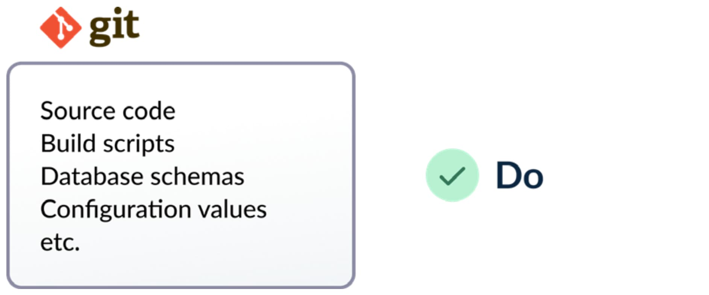

**所有构成应用程序的文件都应使用源代码控制进行管理。**

不幸的是，尽管这个规则似乎非常基本，但还是有很多组织没有遵循它。传统上，开发人员仅使用版本控制系统管理应用程序的源代码，但是忽略了其他支持文件，例如安装脚本、配置值或测试数据。

参与应用程序生命周期的所有内容都应检入源代码控制。这包括但不限于：

1. **源代码**
2. **构建脚本**
3. **管道定义**
4. **配置值**
5. **测试和测试数据**
6. **数据库模式**
7. **数据库更新脚本**
8. **基础架构定义脚本**
9. **清理/安装/清除脚本**
10. **相关的文档**

最终目标是任何人都可以检出与应用程序相关的所有内容，并在本地或任何其他替代环境中重新创建它。

我们经常看到的常见反模式是使用特殊脚本在特定计算机或特定团队成员的工作站上进行部署，甚至是在 Wiki 页面中进行附件等。

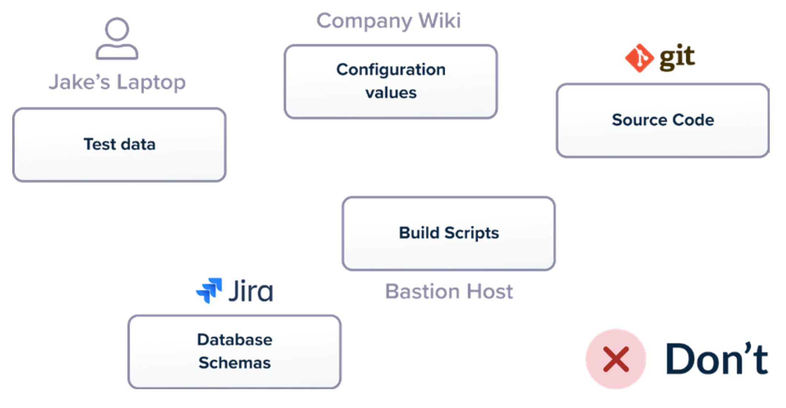

版本控制也意味着所有这些资源都经过审核，并具有详细的更改历史记录。如果你想查看应用程序 6 个月前的样子，可以轻松使用版本控制系统的功能获取该信息。

请注意，即使所有这些资源都应该使用版本控制，它们也不一定必须在同一个存储库中。你是否使用多个存储库或单个存储库都需要仔细考虑，而且没有明确的答案。然而，重要的一点是确保确实对所有内容进行了版本控制。

即使 GitOps 是使用 Git 操作进行升级和部署的新兴实践，你也不需要专门遵循 GitOps 来遵循这一最佳实践。具有项目资产的历史和审计信息始终是一件好事，无论你遵循哪种软件范例。

## 2. 为所有环境创建单个包/二进制/容器

> CI/CD流程的主要功能之一是验证新功能是否适合部署到生产环境。这是逐步进行的，因为每个流程步骤都在实际上执行附加检查。

然而，为此范例工作，你需要确保在管道中测试和探测的内容与部署的内容相同。在实践中，这意味着特性/版本应该只打包一次，并以相同的方式部署到所有后续环境中。

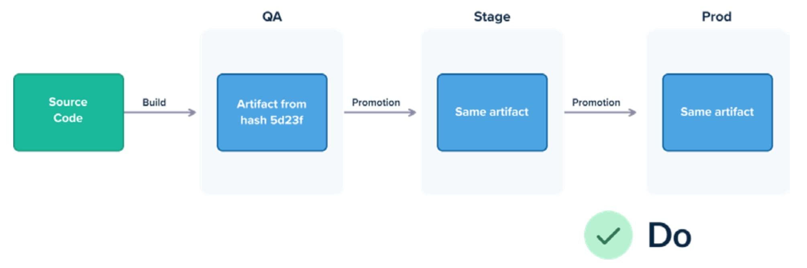

不幸的是，许多组织陷入了为 dev/staging/prod 环境创建不同工件的常见陷阱，因为它们尚未掌握一个通用的配置基础架构。这意味着他们会部署与管道中测试的稍有不同版本。配置差异和最后一刻的更改是导致部署失败的最大罪魁祸首之一，并且每个环境都拥有不同的包，加剧了这个问题。

与其为每个环境创建多个版本，更好的做法是拥有一个单一的工件，仅在不同环境之间更改配置。随着容器的出现以及创建应用程序的自包容能力（即 Docker 镜像形式的应用程序的自包容能力），没有理由不遵循这一做法。

关于配置，有两种方法：

1. **二进制工件/容器具有嵌入其中的所有配置，并根据运行环境更改活动配置（易于开始，但不太灵活。我们不建议采用此方法）**
2. **容器根本没有配置。它在运行时按需从发现机制（例如键/值数据库、文件系统卷、服务发现机制等）中获取所需的配置。（推荐的方法）**

结果是保证在生产中部署的确切二进制/包与管道中测试的确切二进制/包相同。

## 3. 工件，而不是 Git 提交，应在管道中移动

> 与先前一点的推论（所有环境都应部署相同的二进制/包）是部署工件应仅构建一次。

容器的整个概念（以及过去的 VM 映像）是具有不变的工件。应用程序仅在最新特性或即将发布的特性的情况下构建一次。

一旦构建了该工件，它应作为未更改的实体从每个管道步骤移动到下一个步骤。容器是这种不变性的完美载体，因为它们允许你只创建一次映像（在管道开始时）并随着每个连续的管道步骤向生产推广。

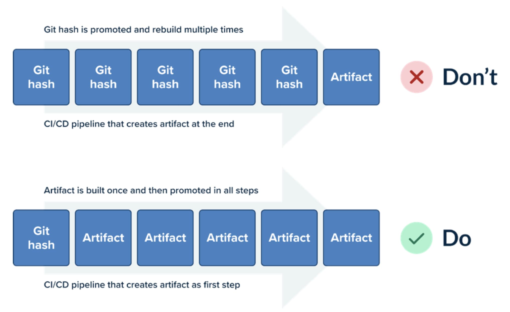

不幸的是，常见的反模式是公司推广提交而不是容器映像。源代码提交在管道阶段中旅行，每个步骤都会通过再次检出源代码来重新构建。

这是一种不好的实践，主要有两个原因。首先，它使管道非常缓慢，因为打包和编译软件是非常耗时的过程，在每个步骤中重复这些过程是浪费时间和资源。

其次，它破坏了先前的规则。在每个管道步骤中重新编译代码提交，留下了造成不同于之前的工件的空间。你失去了在生产中部署的确切内容与管道中测试的确切内容相同的保证。

## 4. 对每个功能使用短期分支

> 一个完善的流水线拥有多个质量检测点（例如单元测试或安全扫描），以测试功能的质量和适用性于生产部署。在高速开发环境（并且有庞大的开发团队）中，并不是所有功能都被期望立即达到生产。一些功能甚至在最初的部署版本中会相互冲突。

为了允许对功能进行细粒度的质量检测，流水线应该有权否决单个功能，并且能够选择其中一部分进行生产部署。获得这种保证的最简单方法是遵循每个功能一个分支的方法，其中短期功能（即在单个开发迭代中完成）对应于单个源代码控制分支。

这使得流水线设计非常简单，因为所有操作都围绕单个功能展开。对代码分支运行测试套件仅测试新功能。对分支进行安全扫描会显示新功能中的问题。

项目利益相关者随后可以部署和回滚单个功能或阻止完整分支合并到主线代码中。

不幸的是，仍然有一些公司拥有长期的功能分支，这些分支在单个批次中收集多个和不相关的功能。这不仅使合并变得困难，而且在单个功能发现问题时也变得棘手（因为难以单独恢复它）。

短期分支的演进是遵循基于主干的开发和功能切换。这可能是你的最终目标，但只有你掌握了短期分支，才能实现它。

## 5. 基本构建应仅需要一步

> CI/CD流水线的全部内容都围绕着自动化展开。自动化本身非常容易，只要最初的运行方式就很容易自动化。

理想情况下，项目的简单构建应为单个命令。该命令通常调用构建系统或脚本（例如 Bash、PowerShell），该系统或脚本负责获取源代码、运行基本测试并打包最终构件/容器。

如果需要进行更高级的检查（例如负载测试），则需要额外的步骤。但是，基本构建（生成可部署构件）应仅涉及一步命令。新的开发人员应该能够检出源代码的全新副本，执行此单个命令，并立即获取可部署构件。

部署也应该用单个命令完成，然后如果需要创建任何流水线，则可以简单地将该单个步骤插入流水线的任何部分。

不幸的是，仍然有许多公司需要执行许多手动步骤才能运行基本构建。下载额外的文件、更改属性以及一般需要遵循的大型检查表等步骤应在同一脚本中自动化。

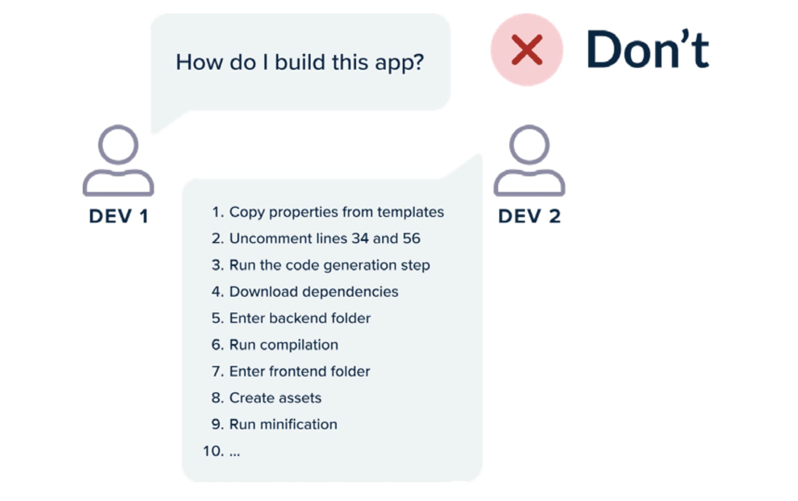

如果你的开发团队中的新雇员需要超过 15 分钟来完成基本构建（在他们的工作站上检查代码之后），那么你几乎可以肯定存在此问题。

构建完善的CI/CD流水线只是重复了本地工作站上已经可能的操作。在将其移动到CI/CD平台之前，基本构建和部署过程应该已经得到很好的优化。

## 6. 基本构建速度快（5-10 分钟）

> 快速构建对开发人员和运营人员/系统管理员都是一个巨大的优势。
>
> 开发人员在提交和其副作用之间的反馈循环尽可能短暂时会感到高兴。在你的脑海中，刚刚提交的代码中修复错误非常容易。必须等待一个小时才能检测到失败的构建是一种非常令人沮丧的经历。

构建应该在 CI 平台和本地站点上都很快。在任何给定时间点，多个功能正在尝试进入代码主干。如果构建它们需要很长时间，CI 服务器可能会轻松地被压垮。

运营人员也从快速构建中获得巨大的好处。在生产环境中推送热更新或回滚到以前的版本始终是一种紧张的体验。这种体验越短暂，越好。需要 30 分钟的回滚比需要 3 分钟的回滚更难处理。

总之，基本构建应该非常快。理想情况下不超过 5 分钟。如果需要超过 10 分钟，则你的团队应该调查原因并缩短时间。现代构建系统具有出色的缓存机制。

- 库依赖项应从内部代理存储库中获取，而不是从互联网中获取
- 除非必要，否则避免使用代码生成器
- 将单元测试（快速）和集成测试（慢速）分开，并仅使用单元测试进行基本构建
- 调整你的容器映像以充分利用 Docker 层缓存

获得更快的构建也是你应该探索的原因之一，如果要转向微服务。

## 7. 存储/缓存依赖项

> 这已经是新闻了。[左侧填充事件](https://www.theregister.com/2016/03/23/npm_left_pad_chaos/)。[依赖项混淆攻击](https://medium.com/@alex.birsan/dependency-confusion-4a5d60fec610)。虽然这两起事件都具有很强的安全影响，但事实是，存储你的依赖项也是一个非常重要的原则，是你的构建稳定性的根本。

所有重要的代码都使用库或相关工具的外部依赖项。当然，你的代码应始终存储在 Git 中。但是，所有外部库也应存储在某种工件存储库中。

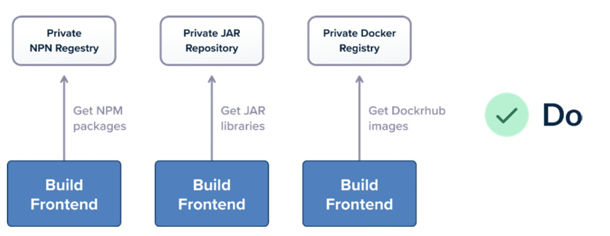

花一些时间收集依赖项并了解它们来自何处。除了代码库之外，还需要其他不太明显的移动部件，例如基础 Docker 映像、构建所需的任何命令行实用程序等。

测试你的构建稳定性的最佳方法是在构建服务器中完全断开互联网访问（实质上是模拟空气隔离环境）。尝试启动流水线构建，其中所有内部服务（git、数据库、工件存储、容器注册表）都可用，但是公共互联网上没有其他内容，并查看发生了什么。

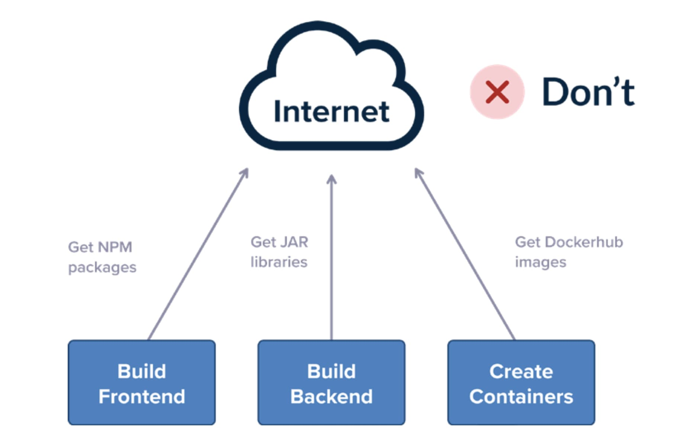

如果你的构建抱怨缺少依赖项，则意味着如果该特定外部资源也出现问题，则在实际情况下也会发生相同的问题。

## 8. 自动化所有测试

> 单元/集成/功能测试的主要目标是增加部署的每个新版本的信心。理论上，全面的测试量将保证每个新功能都没有回退。

要实现这个目标，测试应该完全自动化并由 CI/CD 平台管理。测试不仅应在每次部署之前运行，还应在创建拉取请求之后运行。实现自动化的唯一方法是使测试套件能够在单个步骤中运行。

不幸的是，一些公司仍然以旧方式创建测试，其中一群测试工程师被分配执行各种测试套件的手动执行。这会阻止所有新版本，因为测试速度实际上变成了部署速度。

测试工程师只应编写新测试。他们不应自己执行测试，因为这会使新功能的反馈循环大大延长。测试始终由 CI/CD 平台在各种工作流程和管道中自动执行。

如果一些测试需要由人手动运行以进行冒烟测试，则可以手动运行少量测试。但是，除此之外的所有主要测试套件都应完全自动化。

## 9. 让测试快速

> 上一节的推论是测试的快速执行。如果测试套件将集成到交付管道中，则它们应该非常快速。理想情况下，测试时间不应大于打包/编译时间，这意味着测试应该在五分钟内完成，而不超过 15 分钟。

快速测试执行为开发人员提供了信心，即他们刚提交的功能没有回退，并且可以安全地推广到下一个工作流阶段。测试时间为两个小时是开发人员的灾难，因为他们不可能在提交功能后等待那么长时间。

如果测试期间时间太长，开发人员只会转到下一个任务并更改他们的思维上下文。一旦测试结果到达，就更难在不活跃的功能上修复问题。

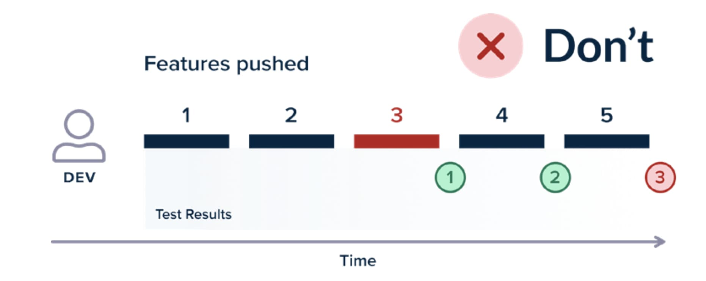

不幸的是，大多数测试等待时间都来自于低效的测试实践和缺乏优化。测试速度缓慢的常见因素是代码“休眠”或“等待”事件，使测试运行时间比应该运行时间更长。所有这些 sleep 语句都应该被删除，并且测试应该遵循事件驱动架构（即响应事件而不是等待事情发生）

测试数据创建也是测试花费大量数据的另一个领域。测试数据创建代码应该集中并重复使用。如果测试具有长时间的设置阶段，则可能会测试过多的内容或需要对不相关服务进行一些模拟。

总之，测试套件应该快速（5-10 分钟），需要几个小时的巨型测试应该进行重构和重新设计。

## 10. 每个测试自动清理其副作用

> 一般来说，你可以将单元测试分为两种类别（除了单元/集成或慢速/快速之外），这与它们的副作用有关：

1. **没有副作用的测试。它们仅从外部源读取信息，从不修改任何内容，并且可以随意运行（甚至可以并行）多次，没有任何复杂性。**
2. **具有副作用的测试。这些测试将写入数据库、将数据提交给外部系统、对依赖项执行输出操作等。**

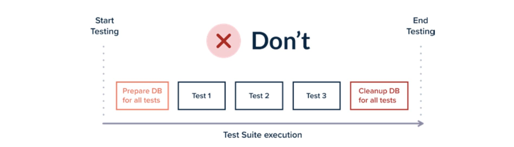

第一类（只读测试）很容易处理，因为它们不需要特殊维护。但是，第二类（读/写测试）更复杂，因为你需要确保在测试完成后立即清除其操作。有两种方法：

1. 让所有测试运行，然后在测试套件结束时清除所有测试的操作
2. 让每个测试在运行后自行清理（推荐方法）

让每个测试清理其副作用是更好的方法，因为这意味着你可以随时以任何次数运行所有测试套件（即在套件中运行单个测试，然后再次运行它两次或三次）。

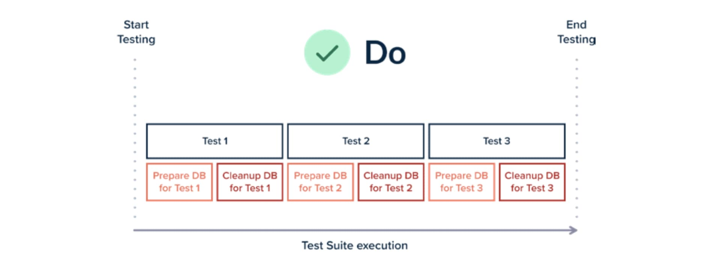

能够并行执行测试是使用动态测试环境的先决条件，我们将在本指南的后面看到这一点。

## 11. 使用多个测试套件

> 测试不仅仅是在CI/CD流程的一个步骤中发生的事情。
> 测试是一个连续的过程，涉及到管道的所有阶段。

这意味着任何精心设计的应用程序中都应该存在多个测试类型。最常见的一些例子包括：

- **快速单元测试，查找主要回归并非常快速地完成**
- **更长的集成测试，寻找更复杂的情况（例如事务或安全性）**
- **压力和负载测试**
- **用于检测使用的外部服务的 API 更改的合同测试**
- **可以在生产环境中运行以验证发布的烟雾测试**
- **测试用户体验的 UI 测试**

这只是不同测试类型的样本。每个公司可能有多个类别。这些类别背后的想法是，开发人员和运营人员可以为他们创建的特定管线选择不同的测试类型。

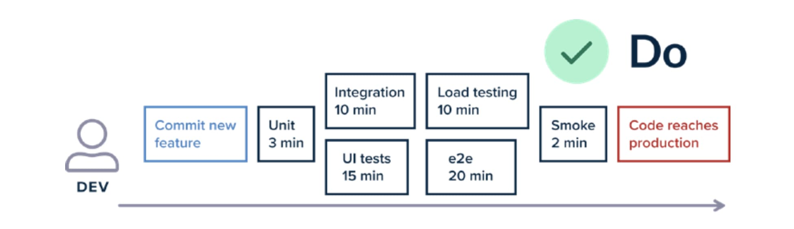

例如，拉取请求管线可能不包括压力和负载测试阶段，因为它们仅在生产发布之前需要。创建拉取请求将仅运行快速单元测试和可能的联系测试套件。

然后，在批准拉取请求之后，其余的测试（例如生产中的烟雾测试）将运行以验证预期的行为。

某些测试套件可能非常缓慢，对于每个拉取请求按需运行它们太困难了。运行压力和负载测试通常是在发布之前发生的事情（可能将多个拉取请求分组），或者以计划的方式进行（即夜间构建）

确切的工作流程并不重要，因为每个组织都有不同的流程。重要的是能够隔离每个测试套件并能够为软件生命周期中的每个阶段选择一个或多个。

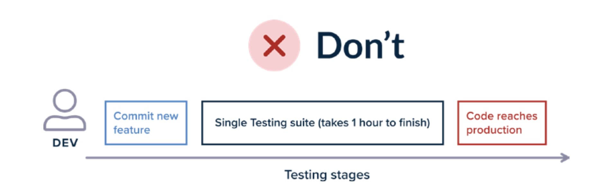

使用单个测试套件来进行所有测试很麻烦，会强制开发人员跳过本地测试。理想情况下，作为开发人员，我应该能够选择任意数量的测试套件针对我的功能分支进行测试，以便能够灵活地测试我的功能。

## 12. 根据需要创建测试环境

> 传统的应用程序测试方法是在生产之前的暂存环境中进行的。拥有单个暂存环境是一个很大的缺点，因为这意味着开发人员必须同时测试所有功能，或者他们必须进入队列并“预订”暂存环境仅供其功能使用。

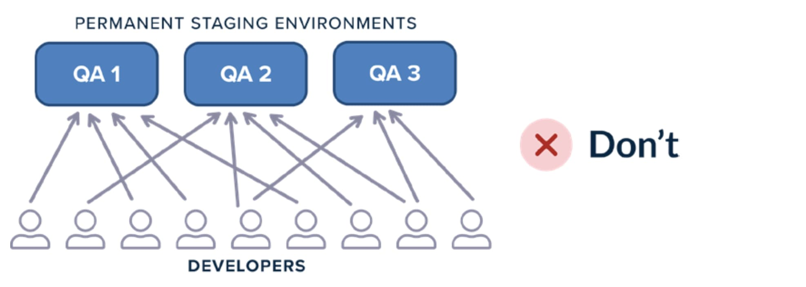

这迫使许多组织创建测试环境的一组（例如 QA1、QA2、QA3），以便多个开发人员可以并行测试其功能。这种技术仍然不理想，因为：

- **最多 N 名开发人员可以并行测试其功能（与环境数量相同）**
- **测试环境始终使用资源（即使它们没有使用）**
- **环境的静态特性意味着它们必须进行清理和更新，这为负责测试环境的团队增加了额外的维护工作量**

现在，使用基于云的架构，更容易根据需要创建测试环境。你应该修改管线工作流程，使每当开发人员创建拉取请求时，一个专用的测试环境也会创建，其中包含该特定拉取请求的内容。

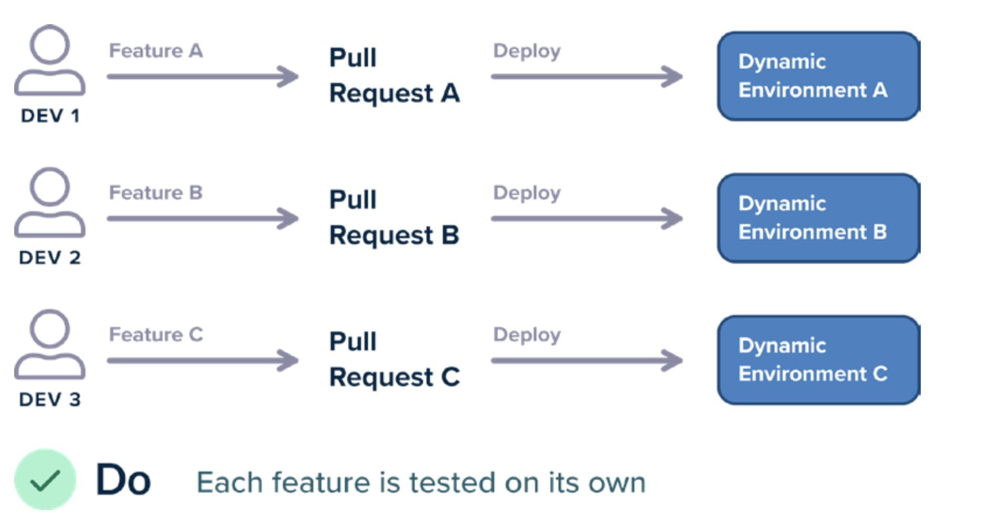

动态测试环境的优点不言而喻：

1. **每个开发人员都可以在不与其他开发人员冲突的情况下进行测试**
2. **你只在使用测试环境时支付其资源**
3. **由于测试环境在结束时被丢弃，因此无需维护或清理任何内容**

动态测试环境适用于开发计划不规则的团队（例如在冲刺结束时有太多功能）

## 13. 并发运行测试套件

> 这是前面最佳实践的一个推论。如果你的开发过程具有动态测试环境，那么不同的测试套件可以在任何时候运行于任何数量的这些环境中，甚至可以同时运行。

如果你的测试具有特殊的依赖关系（例如，它们必须按特定顺序启动，或它们需要在功能执行之前期望特定数据），那么动态测试环境的数量将进一步加剧你为测试运行的前运行和后运行函数。

解决方案是采用最佳实践 10，使每个测试准备其状态并在自己之后进行清理。只读测试（即没有任何副作用的测试）可以根据定义并行运行。

需要编写/读取信息的测试需要自给自足。例如，如果测试在数据库中编写实体，然后读取它，你不应该使用硬编码的主键，因为这意味着如果两个测试套件同时运行此测试，则第二个测试套件将因数据库约束而失败。

虽然大多数开发人员认为测试并行性仅是加速测试的一种方法，但实际上它也是具有正确测试且没有任何不受控制的副作用的一种方法。

## 14. 安全扫描是流程的一部分

> 许多组织仍然遵循软件开发的传统瀑布模型。在大多数情况下，安全分析是在最后进行的。软件被生产出来，然后对源代码进行安全扫描（甚至渗透测试）。结果发布，开发人员赶紧修复所有问题。

在发布的最后阶段放置安全扫描是徒劳的。一些重要的架构决策会影响漏洞的检测，并且提前了解它们对于开发人员和所有项目相关方都是必要的。

安全是一个持续的过程。应在开发时检查应用程序中的漏洞。这意味着安全扫描应该是预合并过程的一部分（即拉取请求的检查之一）。在完成软件包中解决安全问题比在开发过程中更难。

安全扫描还应具有适当的深度。你需要至少检查：

1. **应用程序源代码**
2. **应用程序运行的容器或基础运行时**
3. **将托管应用程序的计算节点和操作系统**

许多公司仅关注其中两个（甚至一个）领域，并忘记了安全的工作方式恰好像链条一样（最弱的环节负责整体安全）

如果你还想积极处理安全问题，最好在拉取请求级别上强制执行安全性。与其仅扫描源代码然后报告其漏洞，不如在首次未通过某个安全门槛时防止合并的发生。

## 15. 质量扫描/代码审核是流程的一部分

> 与安全扫描类似，代码扫描也应成为日常开发人员操作的一部分。这包括：

- **用于公司批准样式/格式的代码的静态分析**
- **用于安全问题、隐藏错误的代码的静态分析**
- **用于错误和其他问题的运行时代码分析**

虽然存在处理分析部分的现有工具（例如 Sonarqube），但并非所有组织都以自动化方式执行这些工具。我们看到的非常常见的模式是，热情的软件团队誓言在下一个软件项目中使用这些工具，但在一段时间后忘记了它们或完全忽略了分析报告中呈现的警告和错误。

与安全扫描一样，代码质量扫描应该是拉取请求过程的一部分。与其仅向开发人员报告最终结果，不如通过防止合并存在一定数量的警告来强制执行良好的质量实践。

## 16. 数据库更新有其生命周期

> 随着越来越多的公司采用持续交付，我们看到一个令人担忧的趋势，即将数据库视为存在于交付过程之外的外部实体。这种说法根本不属实。

数据库（以及其他支持系统，例如消息队列、缓存、服务发现解决方案等）应像任何其他软件项目一样处理。这意味着：

- **它们的配置和内容应存储在版本控制中**
- **所有相关的脚本、维护操作和升级/降级说明也应在版本控制中**
- **配置更改应像任何其他软件更改一样经过批准（从 自动化分析、拉取请求审查、安全扫描、单元测试等）**

应有专门的管道负责安装/升级/回滚每个新版本的数据库

最后一点尤为重要。有许多编程框架（例如 rails migrations、Java Liquibase、ORM migrations），它们允许应用程序本身处理 DB 迁移。通常情况下，应用程序第一次启动时，它还可以将关联数据库升级到正确的架构。虽然很方便，但是这种做法使回滚变得非常困难，最好避免使用。

数据库迁移应像隔离的软件升级一样处理。你应该具有仅处理数据库的自动化管道，应用程序管道不应以任何方式触及数据库。这将为你提供最大的灵活性，以通过控制数据库升级的时间和方式来处理数据库升级和回滚。

## 17. 数据库更新是自动化的

> 一些组织拥有出色的应用程序代码管道，但很少关注自动化数据库更新。处理数据库应该像处理应用程序本身一样重要（如果不是更重要）。

这意味着你应该像应用程序代码一样自动化数据库：

- **在源代码中存储数据库更改集**
- **创建管道，当创建新更改集时自动更新数据库**
- **为数据库创建动态临时环境，在此环境中审查更改集，然后才合并到主要环境中**
- **对数据库更改集进行代码审查和其他质量检查**
- **有一种策略，在数据库升级失败后进行回滚**

它还有助于自动化生产数据到测试数据的转换，以便在应用程序代码的测试环境中使用。在大多数情况下，由于安全限制，保留所有生产数据的副本在测试环境中是低效的（甚至不可能）。最好有一个被匿名/简化的小数据子集，以便更有效地处理它。

## 18.进行逐步数据库升级

> 应用程序回滚已经得到很好的理解，现在我们已经有了专用工具，在失败的应用程序部署后执行回滚操作。通过渐进式交付技术，如金丝雀和蓝/绿部署，我们甚至可以将停机时间进一步减少。

由于内在状态的缘故，渐进式交付技术无法用于数据库，但我们可以计划数据库升级并采用[进化数据库设计原则](https://martinfowler.com/articles/evodb.html)。

通过遵循进化设计，你可以使所有数据库更改集向前和向后兼容，从而允许你随时回滚应用程序和数据库更改，而不会产生任何负面影响。

例如，如果要重命名列，而不是简单地创建更改集以重命名该列并执行单个数据库升级，你可以按照以下逐步更新的计划进行更新：

1. **仅添加具有新名称的新列的数据库更改集（并从旧列复制现有数据）。应用程序代码仍在从旧列中写入/读取**
2. **应用程序升级，其中应用程序代码现在同时写入两个列，但从新列中读取**
3. **应用程序升级，其中应用程序代码仅写入/读取新列**
4. **删除旧列的数据库升级**

该过程需要纪律严明的团队，因为它使每个数据库更改跨越多个部署。但是，这个过程的优点不能过分强调。在此过程的任何阶段，你都可以回到先前的版本，而不会丢失数据，也不需要停机时间。

有关全部技术列表，请参见数据库重构网站。

## 19. 所有部署都必须通过 CD 平台进行（绝不从工作站进行）

> 继续不可变工件和将已部署内容发送到生产的部署主题，我们还必须确保管道本身是唯一通向生产的单一路径。

使用CI/CD管道的主要方法是确保CI/CD平台是**唯一**可以部署到生产环境的应用程序。这种做法保证了生产环境正在运行预期运行的内容（即最后部署的工件）。

不幸的是，许多组织允许开发人员直接从他们的工作站进行部署，甚至在各个阶段“注入”其工件到管道中。

这是一种非常危险的做法，因为它破坏了适当的 CI/CD 平台提供的可追溯性和监控。它允许开发人员部署到生产中可能没有在源代码控制中提交的功能。许多失败的部署源于在开发人员工作站上存在但不在源代码控制中的缺少文件。

总之，部署只有一个关键路径，而这个路径严格由 CI/CD 平台掌握。在网络/访问/硬件级别禁止从开发人员工作站部署生产代码。

## 20.使用渐进式部署模式

> 我们已经讨论了最佳实践 18 中的数据库部署以及每个数据库升级应该是向前和向后兼容的。此模式与应用程序端的渐进式交付模式相辅相成。

传统的部署采用全有或全无的方法，其中所有应用程序实例都向前移动到软件的下一个版本。这是非常简单的部署方法，但使回滚成为一个具有挑战性的过程。

你应该转而考虑：

1. [蓝/绿部署](https://martinfowler.com/bliki/BlueGreenDeployment.html)，部署新版本的整个新实例集，但仍然保留旧版本，以便轻松回滚
2. [金丝雀发布](https://martinfowler.com/bliki/CanaryRelease.html)，其中只有应用程序实例的子集移动到新版本。大多数用户仍然路由到上一个版本

如果将这些技术与逐步数据库部署相结合，你可以在新部署发生时将停机时间最小化。采用这两种方法，回滚也变得不复杂，因为在两种情况下，你只需更改负载平衡器/服务网格以返回到原始版本的应用程序。

确保还查看涉及部署过程的指标（请参见最佳实践 21 和 22）以进行完全自动化的回滚。

## 21.指标和日志可以检测到错误的部署

> 拥有部署应用程序的管道（即使使用渐进式交付）是不够的，如果你想要知道部署的真实结果。首先看起来“成功”的部署，但不久就会被证明引入回归是大型软件项目中非常普遍的情况。

许多开发团队在部署结束后仅执行视觉检查/冒烟测试，并且如果一切“看起来”良好，就会结束。但这种做法是不够的，并且可能很快导致引入微妙的错误或性能问题。

正确的方法是采用应用程序（和基础设施）指标。这包括：

- **应用程序事件的详细日志**
- **计算和监视应用程序关键特性的指标**
- **可以提供单个请求正在执行的深入了解的跟踪信息**

一旦这些指标到位，应根据这些指标的前/后比较来判断部署的影响。这意味着指标不应仅是调试机制（事后），而应作为针对失败部署的早期警告措施。

选择监视哪些事件以及在何处放置日志是一个复杂的过程。对于大型应用程序，最好根据过去的部署逐步重新定义关键指标。建议的工作流程如下：

1. **在你猜测将显示失败部署的事件上放置日志和指标**
2. **进行多个部署，看看你的指标是否可以检测到失败的部署**
3. **如果你看到未在指标中检测到的失败部署，则意味着它们不够。相应地微调你的指标，以便下次出现相同方式的部署失败时，你实际上知道它的发生**

太多时候，开发团队关注“虚荣”的指标，即表面上看起来很好但对于失败的部署没有任何意义。

## 22.自动回滚已准备就绪

> 这是先前最佳实践的延续。如果你已经准备好了良好的指标（可以验证部署的成功），你可以将它们带到下一个依赖于他们的自动回滚级别。

许多组织已经准备好了很好的指标，但仅手动使用它们：

1. **开发人员在部署之前查看一些关键指标**
2. **触发部署**
3. **开发人员以临时方式查看指标，以查看部署情况**

尽管这种技术非常流行，但效果并不好。根据应用程序的复杂性，观察指标的时间可能为 1-2 小时，以便部署的影响变得可见。

由于没有人关注正确的指标或人们只是认为这不是部署结果的警告和错误，因此部署标记为“失败”后的 6-24 小时并不罕见。

还有一些组织被迫只能在工作时间部署，因为只有在那个时间才有足够的人眼来观察指标。

指标应成为部署流程的一部分。部署管道应在部署完成后自动查看指标，并将其与已知阈值或其上一个状态进行比较。然后，在完全自动化的方式下，部署应完成，甚至可以回滚。

这是部署的圣杯，因为它完全将人为因素排除在外，是迈向连续部署的一步（而不是连续交付）。采用这种方法：

1. **你可以在任何时间点执行部署，因为无论时间是凌晨 3 点，指标都将得到同样的关注**
2. **你可以精确地捕捉早期回归**
3. **回滚（通常是一种压力的行动）现在由部署平台处理，使非技术人员更容易访问部署过**程

结果是，开发人员可以在星期五下午 5 点进行部署，并立即回家。要么更改将被批准（并将在星期一仍然存在），要么将自动回滚，而不会产生任何不良影响（如果你还遵循最佳实践 20 进行渐进式交付，则不会有任何停机时间）

## 23. 暂存与生产匹配

> 我们在最佳实践 12 中解释了应为开发人员测试单个功能而雇用动态环境的原因。这使你有信心每个在将其部署到生产之前，功能都是正确的。

还习惯于拥有单个暂存环境（也称为预生产环境），它充当部署应用程序部署到真实生产环境之前的最后网关。此特定环境应尽可能接近生产环境，以便可以快速发现任何配置错误或不匹配，然后将应用程序部署推入真正的生产环境。

不幸的是，大多数组织将暂存环境与生产环境分开处理。拥有一个与生产分开的暂存环境是一种繁琐的做法，因为这意味着你必须手动维护它并确保它也获得了到达生产环境的任何更新（不仅在应用程序方面，还包括任何配置更改）。

使用暂存环境的另外两种有效方法如下：

1. **通过克隆生产环境创建一个按需暂存环境，每次部署前都会进行**
2. **将特别的生产部分（有时称为阴影生产）用作暂存**

第一种方法非常适用于小型或中型应用程序，它在部署之前以类似但可能更小的配置克隆生产环境，这意味着你还可以获取一部分数据库以及为服务流量提供较少数量的副本/实例。重要的是，此暂存环境仅在发布期间存在。你在发布前创建它，一旦发布被标记为“成功”，就会销毁它。

当然，主要好处是在部署之前克隆生产环境可以保证暂存和生产之间具有相同的配置。此外，没有什么需要维护或更新，因为完成部署后你总是会丢弃暂存环境。

然而，对于具有许多微服务或大型外部资源（例如数据库和消息队列）的大型应用程序来说，这种方法并不现实。在这些情况下，将暂存作为生产的一部分使用要容易得多。重要的是，你使用的生产部分不会得到任何用户流量，因此如果部署失败，用户不会受到影响。优点再次是，由于这是生产的一部分，所以你可以保证配置是最新的，你正在测试的内容将像“真正”的生产一样运行。

## 将这些最佳实践应用于你的组织

我们希望现在你已经有了一些改进 CI / CD 过程的想法。但请记住，最好采取逐步措施，而不是一次性尝试改变所有内容。

请参阅本指南的第一部分，其中我们谈到了优先事项。首先关注标记为“关键”的最佳实践，一旦征服了它们，再转向具有“高”重要性的最佳实践。

我们相信，如果你采用了我们在本指南中描述的大多数实践，你的开发团队将能够专注于发布功能，而不是处理失败的部署和缺少的配置问题。
