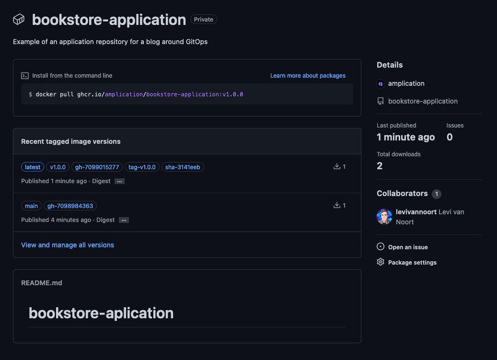
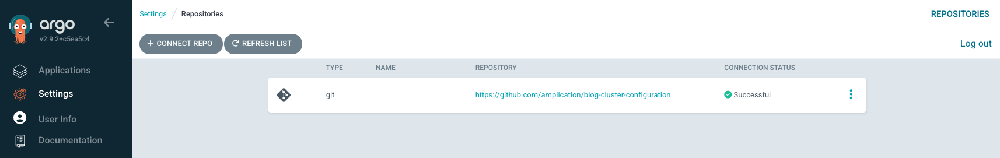
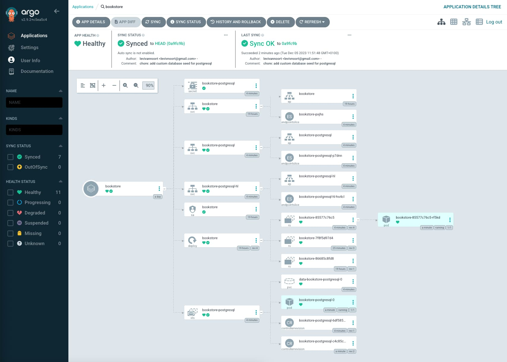
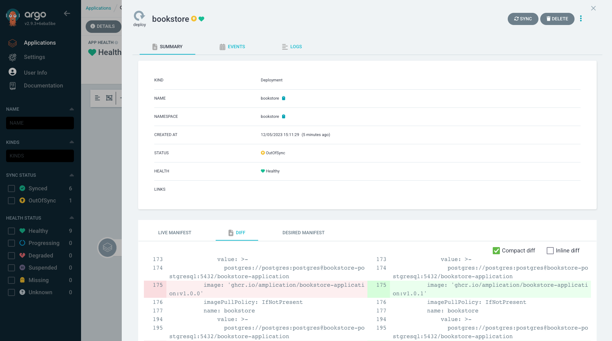
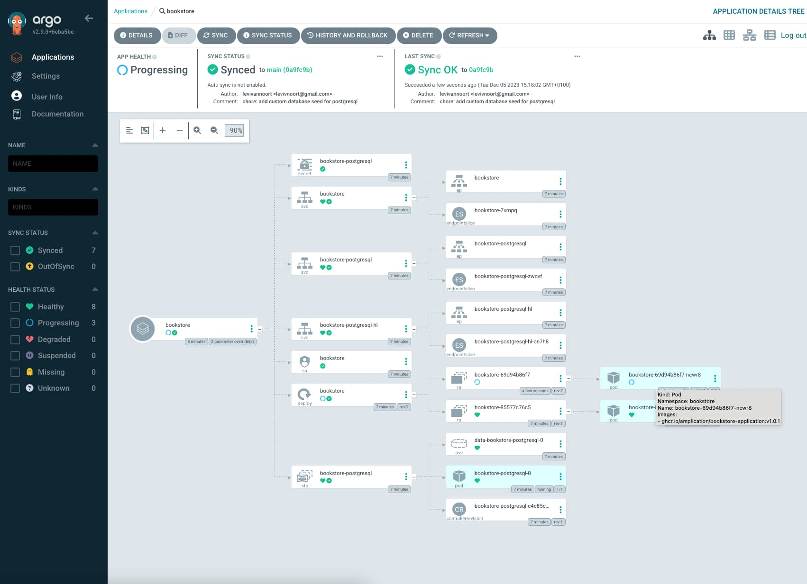
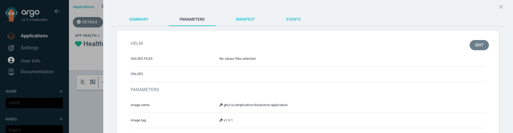

## 介绍

在过去的十年里，源代码交付过程发生了显著变化。在这个过程的部署方面，最近的适应是采用了一种声明式和版本控制的方法来定义应用程序所需的基础设施状态和配置，通常称为 "GitOps"。这种方法在云原生应用程序和容器编排平台（如 Kubernetes）的背景下变得流行起来，因为在这些环境中管理复杂的分布式系统可能会很具挑战性。

由于这种所需的状态具有声明性质，它指向了特定/静态版本的应用程序。这带来了显著的好处，特别是可以在进行更改之前审计更改、回滚到先前状态并保持可重复的设置。然而，在不需要管道来更改应用程序的状态/配置的情况下，我们如何迁移到更新的应用程序版本而避免手动版本调整呢？

这就是 Argo CD Image Updater 的作用所在；它验证容器镜像的更近版本是否可用，随后触发应用程序的 Kubernetes 资源的必要更新，或者可选择更新关联的版本控制。

## 概述

在深入研究技术实现之前，让我们先了解 GitOps 过程的概述，并强调 Argo CD Image Updater 在此过程中的角色。

#### 默认 GitOps

该过程的第一部分始于开发人员修改应用程序的源代码并将更改推送回版本控制系统。随后，此操作会启动一个工作流或管道，用于构建和评估应用程序。结果是一个容器镜像的形式的构件，随后将其推送到镜像注册表。

在过程的第二部分中，集群配置存储库是有关应用程序配置所需状态的单一真相源。Argo CD 定期监视 Kubernetes 集群，以查看 "实际状态" 是否与 "所需状态" 不同。当存在差异时，根据同步策略的不同，Argo CD 会尝试恢复到 "所需状态"。


#### 扩展 GitOps

与默认过程相比，在此扩展变体中，将另一个 Argo CD 组件添加到 Kubernetes 集群中。Argo CD Image Updater 组件会验证镜像注册表中是否存在更新的容器镜像版本。如果识别到这种版本，该组件会直接或间接更新正在运行的应用程序。在接下来的部分中，我们将深入探讨 Argo CD Image Updater 的配置选项以及该组件的实现。


## 配置

在深入技术实现之前，让我们首先了解 Argo CD Image Updater 提供的配置选项。此配置分为两个关键概念："写回方法" 和 "更新策略"。每个概念都具有针对特定情况量身定制的特定选项，因此了解这些选项及其对技术实现的影响至关重要。

在此配置/演示中，可以参考以下存储库：

- [bookstore-application](https://github.com/amplication/bookstore-application)
- [bookstore-cluster-configuration](https://github.com/amplication/bookstore-cluster-configuration)

#### 写回方法

在撰写本文时，Argo CD Image Updater 支持两种方法

来将新的镜像版本传播给 Argo CD，也称为 "写回" 方法："argocd" 和 "git"。

- 'argocd'：这种默认的 "写回" 方法是伪持久的，这意味着通过 Argo CD Image Updater 对应用程序进行的任何更改在删除应用程序或同步版本控制中的配置时都会丢失。它最适合于以命令方式创建的资源，不需要额外的配置。
- 'git'：另一种 "写回" 方法是持久性/声明性选项，当识别到更新的容器镜像版本时，Argo CD Image Updater 会将参数覆盖存储在应用程序的资源清单旁边。它将覆盖存储在名为 `.argocd-source-<application-name>.yaml` 的文件中，减少了应用程序资源清单中的合并冲突风险。要更改 "写回" 方法，需要在 Argo CD "Application" 资源上设置一个注释。此外，还可以选择更改应用程序的默认值 `.spec.source.targetRevision`。从审计追踪和可重复性的角度来看，这是首选选项，因为它在保持 GitOps 原则的同时允许自动持续部署。


当使用 "git" 写回方法时，将重复使用为 Argo CD 配置的凭据。可以提供一组专用凭据，有关更多配置详细信息，请参阅[文档](https://argocd-image-updater.readthedocs.io/en/stable/basics/update-methods)。



#### 更新策略

除了选择写回方法外，还需要决定更新策略。此策略确定 Argo CD Image Updater 如何识别要更新的新镜像版本。目前支持四种方法：'semver'、'latest'、'digest' 和 'name'。

在查看它们之前，了解 "可变" 和 "不可变" 镜像标记的含义很重要。可变存储库具有可以被新镜像覆盖的标记，而当存储库配置规定标记必须不可被新镜像覆盖时，标记就是不可变的。以下选项假定使用 "不可变" 标记。如果使用了可变标记，则应使用 "digest" 策略。

- 'semver'：此策略将应用程序更新到镜像注册表中的最新镜像版本，同时考虑语义版本控制约束（例如，`X.Y.Z` 格式，其中 `X` 为主版本、`Y` 为次版本，`Z` 为修补版本）。该选项可配置为仅升级到新的次要或修补版本，还支持通过附加配置支持预发布版本。在下面的示例中，应用程序将使用较新的修补版本进行更新，但不会升级到新的次要或主要版本。
- 'latest'：此策略将应用程序更新为具有最新构建日期的镜像。当特定构建具有多个标记时，Argo CD Image Updater 会选择列表中以字母顺序降序排序的最后一个标记。如果只想考虑特定标记，可以使用带有正则表达式的注释。类似地，可以使用注释来忽略标记列表。
- 'digest'：此策略基于注册表中可变标签的更改来更新应用程序。当使用此策略时，将使用镜像摘要来更新应用程序，因此集群上的镜像将显示为 `<repository-name>/<image-name>@sha256:<hash>`。
- 'name'：此策略根据镜像标签的字母排序并使用列表中排序的最后一个标签来更新应用程序。当使用日期/时间为镜像标记时，可以使用此方法。类似于 "latest" 策略，可以使用正则表达式来考虑特定标记。

## 实施

我们将从创建两个仓库开始，如概述中所示，一个是 `源代码` 仓库，另一个是 `集群配置` 仓库。理论上，两者都可以存放在同一个仓库中，但建议分开处理以便关注点分离。

接下来的步骤是设置持续集成管道以创建构件，即容器镜像，这些构件将用作持续部署过程的起点。在本教程中，我们将在 GitHub 上使用我们的仓库以及 GitHub Actions 来设置我们的管道。然而，这个设置可以在大多数流行的版本控制/流水线选项中完成。

#### 持续集成工作流

在源代码仓库的 `.github/worksflows/` 目录下，我们将创建一个 GitHub actions 工作流，命名为 `continuous-integration.yaml`。该工作流包括检查源代码、构建容器镜像并将其推送到 GitHub Packages 镜像注册表。

```yaml
name: continuous-integration

on:
  push:
    branches: ["main"]
    tags: ["*"]
  pull_request:
    branches: ["main"]

env:
  REGISTRY: ghcr.io
  IMAGE_NAME: ${{ github.repository }}

jobs:
  build-and-push:
    name: build and push container image
    runs-on: ubuntu-latest

    permissions:
      contents: read
      packages: write

    steps:
      - name: checkout source code
        uses: actions/checkout@v4

      - name: authenticate with repository
        uses: docker/login-action@v3
        with:
          registry: ghcr.io
          username: ${{ github.actor }}
          password: ${{ secrets.GITHUB_TOKEN }}

      - name: image metadata
        uses: docker/metadata-action@v4
        id: meta
        with:
          images: "${{ env.REGISTRY }}/${{ env.IMAGE_NAME }}"
          tags: |
            type=sha,prefix=sha-
            type=ref,event=pr,prefix=pr-
            type=ref,event=tag,prefix=tag-
            type=raw,value=${{ github.run_id }},prefix=gh-
            type=raw,value=${{ github.ref_name }}
            type=raw,value=latest,enable=${{ github.ref_name == 'main' }}

      - name: build and push
        uses: docker/build-push-action@v5
        with:
          context: .
          push: true
          tags: ${{ steps.meta.outputs.tags }}
          labels: ${{ steps.meta.outputs.labels }}
```

为了简化，镜像注册表是公开的，因此不需要在集群内部进行额外的身份验证。你可以在[这里](https://docs.github.com/en/repositories/managing-your-repositorys-settings-and-features/managing-repository-settings/setting-repository-visibility)找到有关如何将 GitHub 包设置为公开的详细教程。如果你更喜欢使用私有仓库，请参考[此](https://kubernetes.io/docs/tasks/configure-pod-container/pull-image-private-registry/)指南以在集群内从私有仓库中拉取镜像。

我们可以看到，当我们提交到 `main` 分支后，包会自动推送到我们的 GitHub Packages 镜像注册表。


如果我们现在发布主分支中的所有内容，版本号为 `v1.0.0`，我们可以看到应用程序镜像的新版本，其中 `sha-<number>` 也放在新镜像上，因为在上次推送到 `main` 分支和标记之间没有进行新的提交。



#### 集群配置

对于我们应用程序的 Kubernetes 资源，我们将创建一个 Helm Chart。在集群配置仓库中，运行以下命令以在 charts 目录下创建 Helm Chart：

```shell
helm create &lt;application-name&gt;
```

```
  charts/&lt;application-name&gt;
    ├── .helmignore   # 打包 Helm Chart时要忽略的模式。
    ├── Chart.yaml    # 有关你的Chart的信息
    ├── values.yaml   # 模板的默认值
    ├── charts/       # Chart依赖项
    └── templates/    # 模板文件
        └── tests/    # 测试文件
```

#### 安装 Argo CD 和 Argo CD Image Updater

首先设置一个 Kubernetes 集群，在这个演示中将使用本地集群，通过 minikube 创建 - 也可以使用其他工具如 `kind` 或 `k3s`。安装 minikube 后，可以运行以下命令启动集群：

```shell
minikube start
```

接下来的步骤是在集群中设置 Argo CD，可以通过运行以下命令完成：

```shell
kubectl create namespace argocd
```

```shell
kubectl apply -n argocd -f https://raw.githubusercontent.com/argoproj/argo-cd/stable/manifests/install.yaml
```

为了访问运行中的 Argo CD 实例，我们可以使用端口转发来连接到 API 服务器，无需暴露服务：

```shell
kubectl port-forward svc/argocd-server -n argocd 8080:443
```

生成一个初始密码以用于管理员帐户，并将其存储在名为 `argocd-initial-admin-secret` 的密钥中的 `password` 字段下。使用该密码以 `username` 值 `admin` 登录，并在 "用户信息" 中更改用户的密码。另一个更安全的选项是使用单点登录（SSO）。

```shell
kubectl -n argocd get secret argocd-initial-admin-secret -o jsonpath="{.data.password}" | base64 -d
```

此外，我们还需要安装 Argo CD Image Updater 到集群中，这也可以在接下来的段落中以声明方式完成。

```shell
kubectl apply -n argocd -f https://raw.githubusercontent.com/argoproj-l

abs/argocd-image-updater/stable/manifests/install.yaml
```

现在我们可以访问 Argo CD 用户界面，查看 Argo CD 应用程序的配置。

#### Argo CD 身份验证

在我们配置 Argo CD 开始管理应用程序的 Kubernetes 资源之前，我们需要确保 Argo CD 能够访问集群配置仓库。仓库详细信息存储在秘密资源中。可以使用不同的方式处理身份验证，但在本演示中，我们将使用 HTTPS。

```yaml
apiVersion: v1
kind: Secret
metadata:
  name: &lt;repository-name&gt;
  namespace: argocd
  labels:
    argocd.argoproj.io/secret-type: repository
stringData:
  type: git
  url: https://github.com/&lt;organization-or-username&gt;/&lt;repository-name&gt;
  password: &lt;github-pat&gt;
  username: &lt;github-username&gt;
```

在我们可以以声明方式创建用于身份验证的秘密之前，我们需要创建 GitHub 个人访问令牌（PAT），该令牌用于秘密的 `password` 字段中。导航到个人资料导航栏上的 `设置`。单击 `开发人员设置` > `个人访问令牌` > `细粒度令牌` & `生成新令牌`。设置一个 `令牌名称`，例如 `argocd-repository-cluster-configuration`，并设置 `过期时间`，我建议设置为一年。

将 `资源所有者` 设置为集群配置仓库所在的用户或组织。将 `存储库访问` 设置为 'only select repositories' 并设置为仅访问集群配置仓库。最后，我们需要为令牌设置权限，为了使集成工作，我们需要以下权限：`Contents - 访问：读取和写入` & `Metadata - 访问：只读`。

`./secret/cluster-configuration-repository.yaml`

```yaml
apiVersion: v1
kind: Secret
metadata:
  name: blog-cluster-configuration
  namespace: argocd
  labels:
    argocd.argoproj.io/secret-type: repository
stringData:
  type: git
  url: https://github.com/amplication/bookstore-cluster-configuration
  password: &lt;github-pat&gt;
  username: levivannoort
```

使用以下命令将此密钥应用于集群：

```shell
kubectl apply -f ./secret/cluster-configuration-repository.yaml
```

在查看 Argo CD 用户界面时，我们可以在设置 > 仓库下看到是否成功对接 GitHub 仓库进行身份验证。现在，我们应该能够在我们的 Argo CD 应用程序中开始使用仓库定义。



#### Argo CD 配置

现在，我们能够通过 GitHub 进行身份验证以从集群配置仓库获取内容。我们可以开始定义我们的 Argo CD 应用程序并开始管理应用程序的 Kubernetes 资源。这可以以命令式或声明式方式完成。在本演示中，我们将以声明方式配置 Argo CD 应用程序。让我们来看看以下清单：

`syntax`

```yaml
apiVersion: argoproj.io/v1alpha1
kind: Application
metadata:
  name: &lt;application-name&gt;
  namespace: argocd
  finalizers:
    - resources-finalizer.argocd.argoproj.io
spec:
  project: default
  source:
    repoURL: https://github.com/&lt;organization-name&gt;/&lt;repository-name&gt;.git
    targetRevision: main
    path: charts/&lt;application-name&gt;
  destination:
    server: https://kubernetes.default.svc
    namespace: &lt;application-name&gt;
  syncPolicy:
    automated:
      prune: true
      selfHeal: true
      allowEmpty: false
    syncOptions:
      - CreateNamespace=true
```

为了配置 Argo CD Image Updater，我们需要添加先前提到的注释。我们选择的更新策略是 `semver`，带有 `argocd` 回写。由于所选的更新策略和回写方法都是默认值，我们不需要指定这些注释。

添加以下注释：

```
argocd-image-updater.argoproj.io/image-list: bookstore=ghcr.io/amplication/bookstore-application
```

`example-application.yaml`

```yaml
apiVersion: argoproj.io/v1alpha1
kind: Application
metadata:
  name: bookstore
  namespace: argocd
  annotations:
    argocd-image-updater.argoproj.io/write-back-method: argocd
    argocd-image-updater.argoproj.io/bookstore.update-strategy: semver
    argocd-image-updater.argoproj.io/image-list: bookstore=ghcr.io/amplication/bookstore-application
  finalizers:
    - resources-finalizer.argocd.argoproj.io
spec:
  project: default
  source:
    repoURL: https://github.com/amplication/bookstore-cluster-configuration.git
    targetRevision: main
    path: charts/bookstore
  destination:
    server: https://kubernetes.default.svc
    namespace: bookstore
  syncPolicy:
    automated:
      prune: true
      selfHeal: true
      allowEmpty: false
    syncOptions:
      - CreateNamespace=true
```

使用以下命令将此配置应用于集群：

```
kubectl apply -f &lt;manifest-name&gt;.yaml
```

## 演示

创建 Argo CD 应用程序后，我们可以看到应用程序在集群中正常运行。由于我们的应用程序需要一个数据库才能运行，我们为在集群中运行数据库添加了一个依赖关系，因此在默认 Helm Chart 的 Kubernetes 资源旁边可以看到其他资源。



如果我们深入查看 `deployment` 对象，我们将看到部署当前使用的镜像标签，这是仓库中的当前最新版本 - `v1.0.0`。


在查看 Argo CD Image Updater 的日志时，我们可以看到它已经注意到我们想要持续更新到最新的语义版本。通过将 `log.level` 设置为 `debug` 而不是默认的 `info`，我们可以获取更多关于哪些镜像正在考虑以及哪些不符合约束的信息。


接下来，我们将应用程序进行了一些更改并再次发布组件，版本号增加到 `1.0.1`：


工作流程结束后，这个更新版本应该出现在镜像注册表中：


ArgoCD 镜像更新程序会定期检查镜像注册表以查找符合约束的更新版本，并找到 `v1.0.1` 镜像。


为了演示，我决定禁用自动同步策略。正如你所看到的，Argo CD Image Updater 将镜像标签从 `v1.0.0` 更改为 `v1.0.1`。







## 结论

我们成功地配置了扩展的 GitOps 设置。对应用程序进行的任何更改都应该通过将容器镜像输出到构件注册表来反映，成功完成持续集成部分。然后，在分离的方式下，Argo CD Image Updater 启动了持续部署流程，它从镜像注册表中找到了更新的容器镜像，并更新

了应用程序的声明式定义镜像标签。从而通过使用新的镜像标签更新部署来提供应用程序的新版本。

对于所演示的设置，可能的改进是切换到 `git` 回写方法，通过更可重复性以及具有清晰审计跟踪的设置来提高设置。

本演示中使用的应用程序是通过 [Amplication](https://amplication.com/) 生成的，它允许你生成可靠、安全和一致的生产就绪后端服务。



在撰写本博客时，Argo CD Image Updater 项目不支持 Argo CD 的回滚功能，因此会自动更新应用程序回到镜像注册表中找到的最新版本。解决此问题的方法是临时禁用 Argo CD Image Updater 对应用程序的索引，并将 Helm Chart 中的 `image.tag` 设置为所需的版本。


