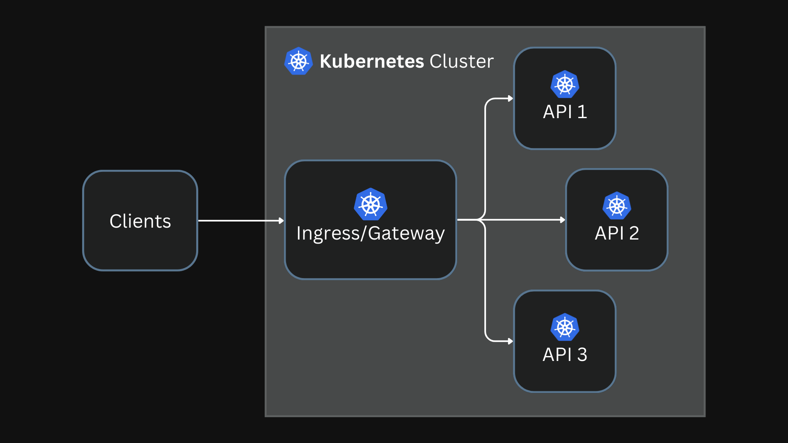
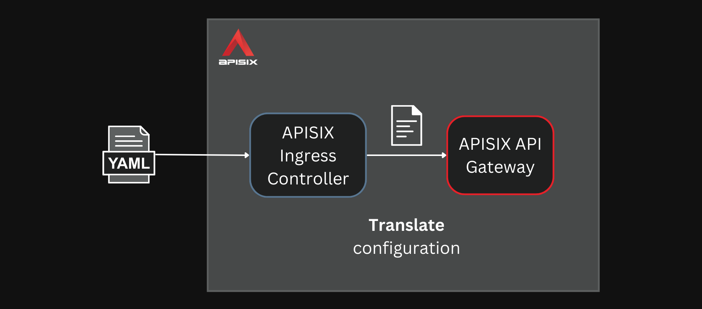
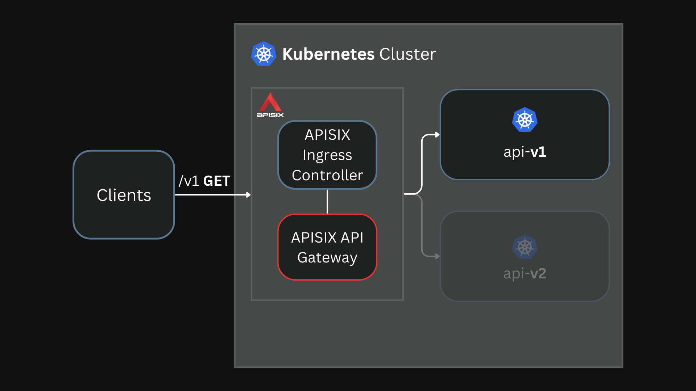
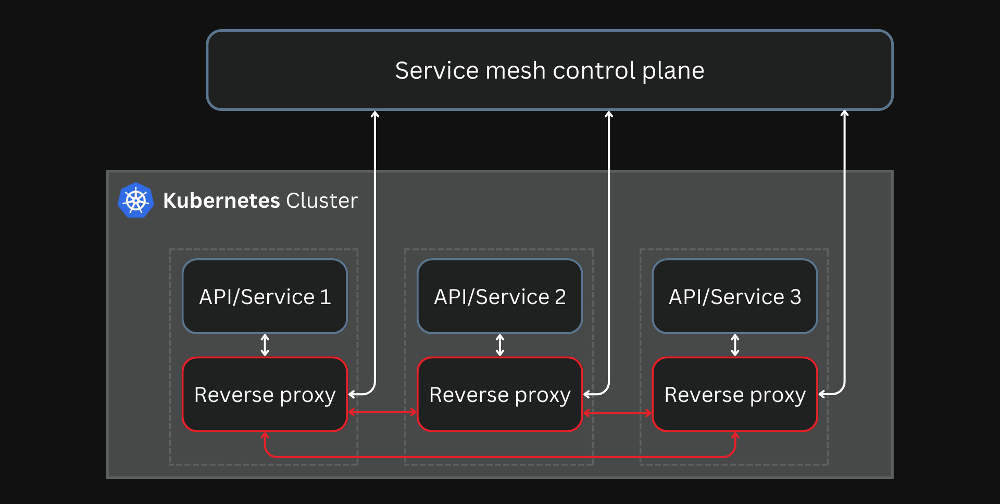
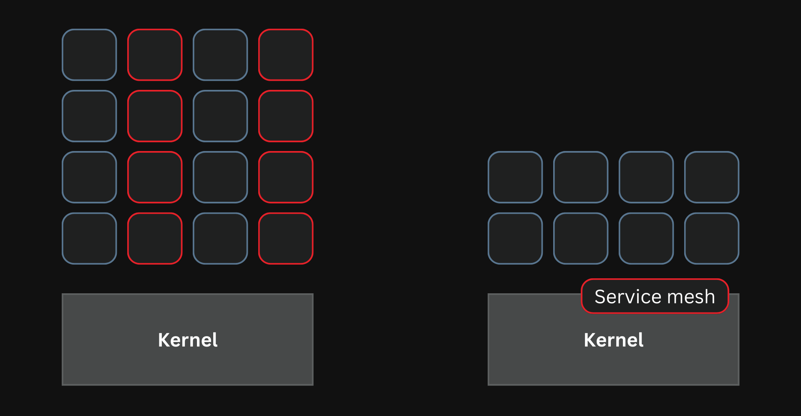
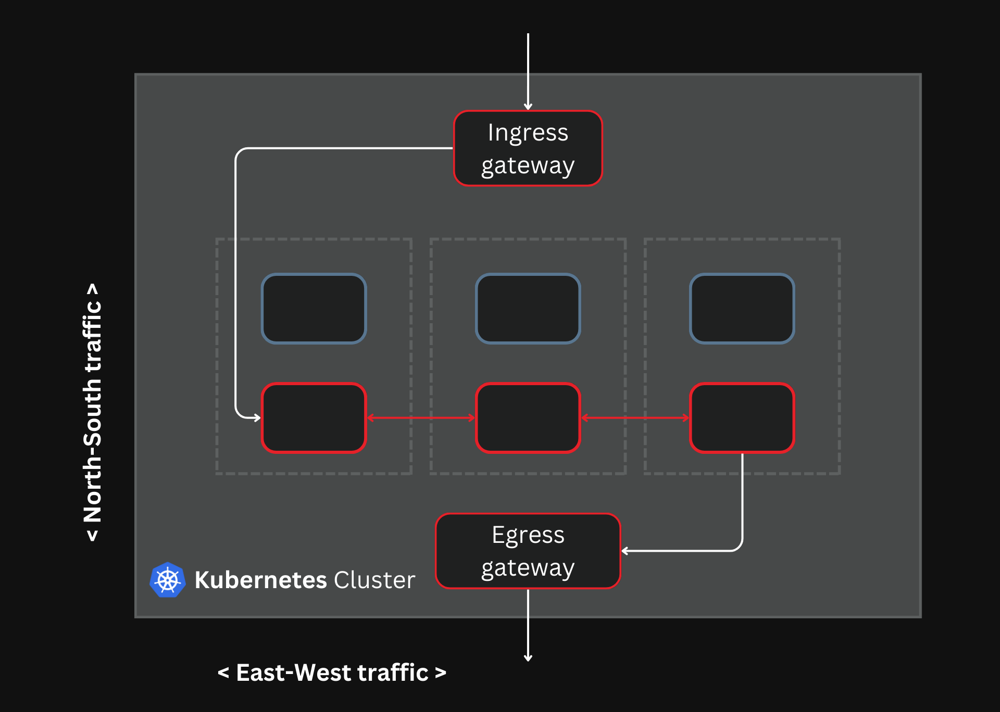
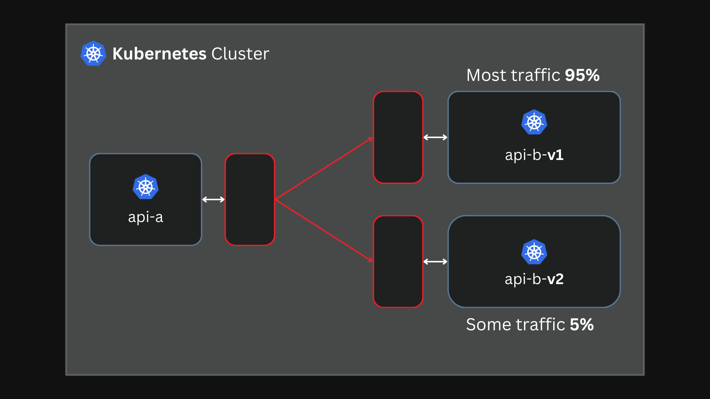

本文译自 [A Comprehensive Guide to API Gateways, Kubernetes Gateways, and Service Meshes](https://navendu.me/posts/gateway-and-mesh/)。

摘要：本文介绍了 API 网关、Kubernetes 网关和服务网格的综合指南。API 网关和 Kubernetes 网关解决了边缘问题和 API 抽象化，而服务网格解决了服务之间的通信挑战。文章还介绍了如何在不同的网关中配置金丝雀部署，并讨论了 Kubernetes Gateway API 的发展和服务网格接口（SMI）规范。最后，文章提供了一些关于何时使用哪种网关的建议。

## 简介

本文将介绍三种技术，它们分别是 API 网关、Kubernetes 网关和 Service Mesh，以及它们之间的区别，以及如何应用它们。

## API 网关

API 网关是一个连接客户端和 API 的中介，它接收所有客户端请求，将它们转发到所需的 API，并将响应返回给客户端。

它基本上是一个具有许多功能的反向代理。

除此之外，API 网关还可以具有诸如身份验证、安全性、细粒度流量控制和监控等功能，使 API 开发人员只需专注于业务需求。

有许多 API 网关解决方案可供选择。一些受欢迎的免费和开源解决方案包括：

- **[Apache APISIX](https://github.com/apache/apisix)**：一个高性能、可扩展、云原生 API 网关，构建于 Nginx 之上。
- **[Gloo Edge](https://github.com/solo-io/gloo)**：一个基于 Envoy 代理构建的 API 网关。
- **[Kong](https://github.com/kong/kong)**：一个可插拔的 API 网关，也是基于 Nginx 构建的。
- **[Tyk](https://github.com/TykTechnologies/tyk)**：一个使用 Go 编写的 API 网关，支持 REST、GraphQL、TCP 和 gRPC 协议。
- **[Envoy Gateway](https://github.com/envoyproxy/gateway)**：一个基于 Envoy 代理构建的 API 网关。

云平台如 [GCP](https://cloud.google.com/api-gateway)，[AWS](https://aws.amazon.com/api-gateway/) 和 [Azure](https://learn.microsoft.com/en-us/azure/api-management/) 也有其自己的专有 API 网关。

API 网关、Kubernetes 网关和 Service Mesh 支持金丝雀部署，即在向大多数用户推出新软件版本之前，逐渐将其推向一小部分用户。

以下示例显示如何在 Apache APISIX 中配置金丝雀部署。

### 使用 API 网关进行金丝雀部署

您可以使用以下配置向 [APISIX 管理 API](https://apisix.apache.org/docs/apisix/admin-api/) 发送请求：

```bash
curl <http://127.0.0.1:9180/apisix/admin/routes/1> \\
-H 'X-API-KEY: edd1c9f034335f136f87ad84b625c8f1' -X PUT -d '
{
  "uri":"/*",
  "plugins":{
    "traffic-split":{
      "rules":[
        {
          "weighted_upstreams":[
            {
              "upstream":{
                "name":"api-v1",
                "type":"roundrobin",
                "nodes":{
                  "api-v1:8080":1
                }
              },
              "weight":95
            },
            {
              "weight":5
            }
          ]
        }
      ]
    }
  },
  "upstream":{
    "type":"roundrobin",
    "nodes":{
      "api-v2:8080":1
    }
  }
}'
```

APISIX 将把 95% 的流量路由到 api-v1 服务，5% 的流量路由到 api-v2 服务。

## Kubernetes Gateway

在 Kubernetes 中，您的 API 是在集群中部署的 pod 和 service。然后您使用 Kubernetes 网关将外部流量定向到您的集群。

Kubernetes 为此提供了两个 API，即 [Ingress API](https://kubernetes.io/docs/concepts/services-networking/ingress/) 和 [Gateway API](https://gateway-api.sigs.k8s.io/)。



### Kubernetes Ingress API

Ingress API 的创建是为了克服默认服务类型（[NodePort](https://kubernetes.io/docs/concepts/services-networking/service/#type-nodeport) 和 [LoadBalancer](https://kubernetes.io/docs/concepts/services-networking/service/#loadbalancer)）的限制，引入了路由和 SSL 终止等功能。它还标准化了如何将 Kubernetes 服务公开给外部流量。

它由 [Ingress](https://kubernetes.io/docs/concepts/services-networking/ingress/#the-ingress-resource) 和 [Ingress 控制器](https://kubernetes.io/docs/concepts/services-networking/ingress-controllers/) 两个组件组成。

Ingress Kubernetes 本地对象定义了一组规则，用于外部流量访问您的服务。

以下示例配置演示了如何在 Kubernetes Ingress 对象中基于 URI 路径路由流量：

```yaml
apiVersion: networking.k8s.io/v1
kind: Ingress
metadata:
  name: api-routes
spec:
  ingressClassName: apisix
  rules:
    - http:
        paths:
          - backend:
              service:
                name: api-v1
                port:
                  number: 8080
            path: /v1
            pathType: Exact
          - backend:
              service:
                name: api-v2
                port:
                  number: 8080
            path: /v2
            pathType: Exact
```

Ingress 控制器实现这些规则，并使用反向代理将流量路由到集群中。

有超过 [20 个 Ingress 控制器实现](https://kubernetes.io/docs/concepts/services-networking/ingress-controllers/#additional-controllers)。APISIX 有一个 [Ingress 控制器](https://apisix.apache.org/docs/ingress-controller/next/getting-started/)，它包装在 APISIX API 网关周围，作为 Kubernetes Ingress 工作。


APISIX Ingress 控制器将 Kubernetes Ingress 对象转换为 APISIX 配置。



然后，APISIX 实现此配置。



您可以将 APISIX 与任何其他 Ingress 控制器交换，因为 Ingress API 与任何特定实现无关。这种厂商中立性对于简单的配置非常有效。但是，如果您想要进行像金丝雀部署之类的复杂路由，则必须依赖厂商特定的注释。

以下示例显示了如何使用 [Nginx Ingress](https://docs.nginx.com/nginx-ingress-controller/) 配置金丝雀部署。此处使用的 [自定义注释](https://github.com/kubernetes/ingress-nginx/blob/main/docs/user-guide/nginx-configuration/annotations.md#canary) 是特定于 Nginx 的：

```yaml
apiVersion: networking.k8s.io/v1
kind: Ingress
metadata:
  annotations:
    nginx.ingress.kubernetes.io/canary: "true"
    nginx.ingress.kubernetes.io/canary-weight: "5"
  name: api-canary
spec:
  rules:
  - http:
      paths:
      - backend:
          serviceName: api-v2
          servicePort: 8080
        path: /
```

以上配置将 5% 的流量路由到 api-v2 服务。

除了注释之外，像 APISIX 这样的 Ingress 控制器还具有自定义的 Kubernetes CRD，以克服 Ingress API 的限制。

以下示例使用 APISIX CRD [ApisixRoute](https://apisix.apache.org/docs/ingress-controller/concepts/apisix_route/) 配置金丝雀部署：

```yaml
apiVersion: apisix.apache.org/v2
kind: ApisixRoute
metadata:
  name: api-canary
spec:
  http:
    - name: route
      match:
        paths:
          - /*
      backends:
        - serviceName: api-v1
          servicePort: 8080
          weight: 95
        - serviceName: api-v2
          servicePort: 8080
          weight: 5
```

这些自定义 CRD 使配置 Ingress 更容易，并利用了 API 网关底层的全部功能，但代价是可移植性。

### Kubernetes Gateway API

Gateway API 是一个新的 Kubernetes 对象，旨在“修复”Ingress API。

它借鉴了 Ingress 控制器开发的自定义 CRD，以添加基于 HTTP 标头的匹配、加权流量拆分和[其他功能](https://gateway-api.sigs.k8s.io/#gateway-api-concepts)，这些功能需要使用 Ingress API 的自定义专有注释。

以下示例显示了如何使用 Kubernetes Gateway API 配置金丝雀部署：

```yaml
apiVersion: gateway.networking.k8s.io/v1alpha2
kind: HTTPRoute
metadata:
  name: api-canary
spec:
  rules:
  - backendRefs:
    - name: api-v1
      port: 8080
      weight: 95
    - name: api-v2
      port: 8080
      weight: 5
```

现在，任何 Ingress 控制器（实现了 Gateway API）都可以实现此配置。

Gateway API 还对 Ingress API 进行了[许多改进](https://navendu.me/posts/gateway-vs-ingress-api/)，但它仍处于 alpha 阶段，Gateway API 实现经常会出现问题。

## 服务网格

API 网关和 Kubernetes 网关在解决边缘问题并抽象化您的 API 时跨应用程序边界工作。

服务网格解决了不同的挑战。

服务网格更关注服务之间的通信（东西流量），而不是服务 - 客户端通信（南北流量）。

通常，这是通过使用 API/服务的 sidecar 代理来实现的。



在这里，sidecar 代理处理服务之间的通信，而不是开发人员必须将网络逻辑编码到服务中。

有很多服务网格可用。一些流行的如下：

- **[Istio](https://istio.io/)**：迄今为止最受欢迎的服务网格。它构建在 [Envoy proxy](https://www.envoyproxy.io/) 之上，许多服务网格使用它。
- **[Linkerd](https://linkerd.io/)**：一种轻量级的服务网格，使用专门为 Linkerd 编写的 Rust 的 linkerd2-proxy。
- **[Consul Connect](https://developer.hashicorp.com/consul/docs/connect)**：强调安全性和可观察性的服务网格。它可以使用内置代理或 Envoy。

新的服务网格提供了与通过 [eBPF](https://ebpf.io/) 直接使用内核的网络功能的 sidecar-based 服务网格的替代方案，如 [Cilium](https://isovalent.com/blog/post/introducing-cilium-mesh/)。



服务网格还具有基本的入口/出口网关，用于处理与服务之间的南北流量。入口网关是外部流量进入服务网格的入口点，出口网关允许网格内的服务访问外部服务。



Apache APISIX 也有一个名为 [Amesh](https://github.com/api7/Amesh) 的服务网格实现。它与 Istio 的控制平面一起使用 xDS 协议，替换 Sidecar 中的默认 Envoy 代理。

服务网格使您可以配置金丝雀部署。例如，您可以将来自一个服务的请求拆分为另一个服务的两个版本。



以下示例显示了如何[在 Istio 服务网格中配置金丝雀部署](https://istio.io/latest/docs/concepts/traffic-management/)：

```yaml
apiVersion: networking.istio.io/v1alpha3
kind: VirtualService
metadata:
  name: api-virtual-service
spec:
  hosts:
    - api
  http:
    - route:
        - destination:
            host: api
            subset: v1
          weight: 80
        - destination:
            host: api
            subset: v2
          weight: 20
```

```yaml
apiVersion: networking.istio.io/v1alpha3
kind: DestinationRule
metadata:
  name: api-destination-rule
spec:
  host: api
  subsets:
    - name: v1
      labels:
        version: "1.0"
    - name: v2
      labels:
        version: "2.0"
```

这些配置是特定于 Istio 的。要切换到不同的服务网格，您必须创建一个不同但类似于供应商依赖的配置。

[服务网格接口](https://smi-spec.io/)（SMI）规范是为解决此可移植性问题而创建的。

SMI [规范](https://github.com/servicemeshinterface/smi-spec)是一组 Kubernetes CRD，服务网格用户可以使用它来定义应用程序，而无需绑定到服务网格实现。

标准化尝试只有当所有项目都参与其中时才能起作用。但是，SMI 规范没有发生这种情况，[只有少数项目积极参与](https://layer5.io/service-mesh-landscape#smi)。

最近，[Kubernetes SIG Network](https://github.com/kubernetes/community/tree/master/sig-network)一直在发展 Gateway API 以支持服务网格。

[GAMMA（网关 API 用于网格管理和监管）倡议](https://gateway-api.sigs.k8s.io/contributing/gamma/)是一个专门的团队，拥有 Gateway API 项目的目标是“调查，设计和跟踪与服务网格技术和用例相关的网关 API 资源，语义和其他工件。”

Gateway API 是 Ingress API 的自然下一步，但我们必须等待看看它如何适用于服务网格。Istio [已宣布](https://istio.io/latest/blog/2022/gateway-api-beta/)其打算将 Gateway API 用作所有流量管理的默认 API，并继续推动该项目的发展。

下面的示例显示了[如何使用 Gateway API 在 Istio 中配置金丝雀部署](https://istio.io/latest/docs/tasks/traffic-management/traffic-shifting/)。其基本思想是使用[parentRefs](https://gateway-api.sigs.k8s.io/v1alpha2/references/spec/#gateway.networking.k8s.io%2fv1beta1.ParentReference)附加到其他服务而不是网关：

```yaml
apiVersion: gateway.networking.k8s.io/v1beta1
kind: HTTPRoute
metadata:
  name: api-canary
spec:
  parentRefs:
  - kind: Service
    name: api-a
    port: 8080
  rules:
  - backendRefs:
    - name: api-b-v1
      port: 8080
      weight: 95
    - name: api-b-v2
      port: 8080
      weight: 5
```

有[一些担忧](https://thenewstack.io/the-gateway-api-is-in-the-firing-line-of-the-service-mesh-wars/)，即 GAMMA 项目可能会变得偏向于为一个特定项目的需求服务，而不是更大的社区，最终会导致其他项目使用自己的 API，类似于 Kubernetes Ingress API 之后的[自定义 CRD 场景](https://navendu.me/posts/gateway-vs-ingress-api/#custom-crds--ingress-api)。

但是，Gateway API 项目是标准化服务网格流量管理的最佳尝试。[SMI 项目也加入了 GAMMA 倡议](https://smi-spec.io/blog/announcing-smi-gateway-api-gamma/)，具有共享愿景，并将帮助倡导服务网格项目对 Gateway API 的一致实现。

其他项目，例如[Flagger](https://docs.flagger.app/tutorials/gatewayapi-progressive-delivery)和[Argo Rollouts](https://github.com/argoproj-labs/rollouts-plugin-trafficrouter-gatewayapi)也已与 Gateway API 集成。

## 应该使用什么？

这个问题只有一个正确的答案，“看你自己”。

如果您正在开发 API 并需要身份验证、安全、路由或度量标准，那么最好使用 API 网关，而不是在您的 API 中自己构建。

如果您想在 Kubernetes 环境中进行类似操作，那么您应该使用 Kubernetes 网关，而不是尝试在 Kubernetes 上使用 API 网关。值得庆幸的是，许多 API 网关也可以使用 Kubernetes 原生配置。

但有时，API 网关+Ingress 控制器提供的功能可能对于 Kubernetes 环境来说过于复杂，您可能希望切换回简单的流量管理。

另一方面，服务网格解决了完全不同的一组问题。它们还带有自己的网关来处理南北流量（通常足够），但还可以让您使用具有更多功能的自己的网关。

通过 Kubernetes Gateway API 将 API 网关和服务网格的融合应该使应用程序开发人员更容易专注于解决问题，而不必担心底层实现。

像 Apache APISIX 这样的项目使用相同的技术来构建 API 网关和服务网格，与这些规范很好地集成，激励厂商中立选择。

您也可能不需要这些。您甚至可能[不需要微服务](https://blog.frankel.ch/chopping-monolith/)或分布式架构，但是当您需要它们时，网关和网格可以使您的生活变得更加轻松。

## 另请参阅

- [比较 Kubernetes 网关和 Ingress API](https://navendu.me/posts/gateway-vs-ingress-api/)
- [APISIX Ingress 中的自定义插件](https://navendu.me/posts/custom-plugins-in-apisix-ingress/)
- [Kubernetes Gateway API 和 APISIX Ingress](https://navendu.me/posts/kubernetes-gateway-with-apisix/)