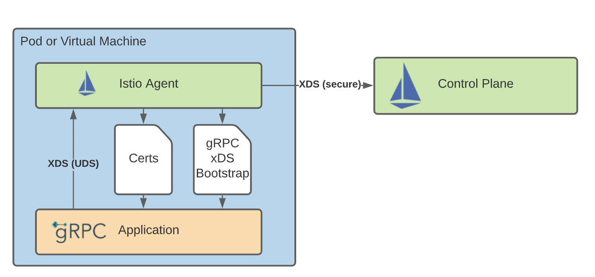
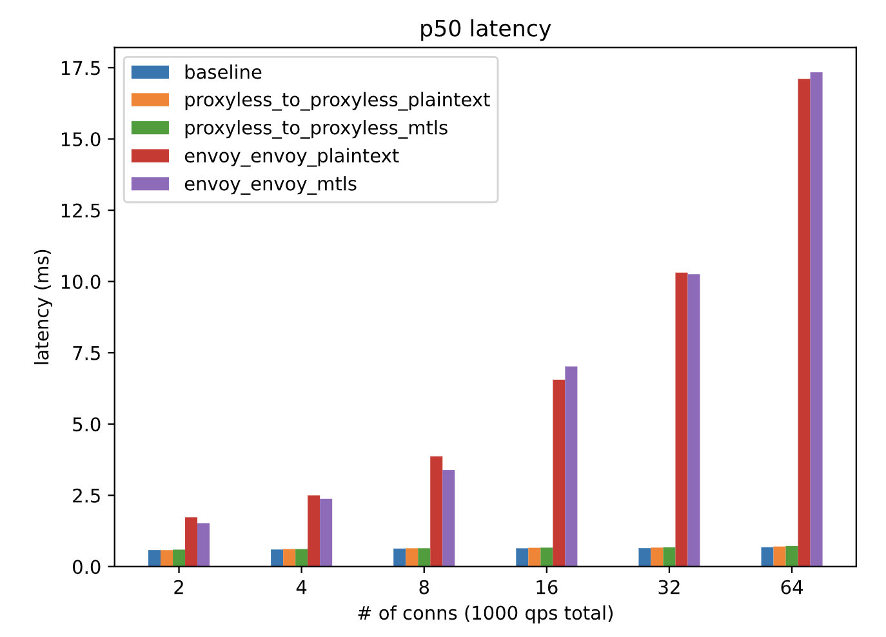

## 编者的话

本文译自 Istio 官方博客，博客原标题 [gRPC Proxyless Service Mesh](https://istio.io/latest/blog/2021/proxyless-grpc/)，其实是 Istio 1.11 版本中支持的实验特性，可以直接将 gRPC 服务添加到 Istio 中，而不需要再向 Pod 中注入 Envoy 代理。本文中还给出了一个 Demo 性能测试数据，这种做法可以极大的提升应用性能，降低网络延迟。	

Istio 使用一组发现 API（统称为 [xDS API](https://www.envoyproxy.io/docs/envoy/latest/intro/arch_overview/operations/dynamic_configuration) 来动态配置其 Envoy sidecar 代理。这些 API 的目标是成为一个 [通用的数据平面 API](https://blog.envoyproxy.io/the-universal-data-plane-api-d15cec7a?gi=64aa2eea0283)。gRPC 项目对 xDS API 有很好的支持，也就是说你可以管理 gRPC 工作负载，而不需要同时部署 Envoy sidecar。你可以在 [Megan Yahya 的 KubeCon EU 2021 演讲](https://www.youtube.com/watch?v=cGJXkZ7jiDk)中了解更多关于该集成的信息。关于 gRPC 支持的最新情况，可以在他们的[提案](https://github.com/grpc/proposal/search?q=xds)中找到，还有实现状态。

Istio 1.11 增加了实验性支持，可以直接将 gRPC 服务添加到网格中。我们支持基本的服务发现，一些基于 VirtualService 的流量策略，以及双向 TLS。

## 支持的功能

与 Envoy 相比，目前 gRPC 内的 xDS API 的实现在某些方面是有限的。以下功能应该可以使用，尽管这不是一个详尽的列表，其他功能可能部分可用。

- 基本的服务发现。你的 gRPC 服务可以接触到在网格中注册的其他 pod 和虚拟机。
- `DestinationRule`
  - `Subset`：你的 gRPC 服务可以根据标签选择器将流量分割到不同的实例组。
  - 目前唯一支持的 Istio `loadBalancer` 是 `ROUND_ROBIN`，`consistentHash` 将在未来的 Istio 版本中加入（支持 gRPC）。
  - `tls` 设置被限制为 `DISABLE` 或 `ISTIO_MUTUAL`。其他模式将被视为 `DISABLE`。
- `VirtualService`
  - Header 匹配和 URI 匹配的格式为 `/ServiceName/RPCName`。
  - 覆盖目标主机和子集。
  - 加权的流量转移。
- `PeerAuthentication`
  - 只支持 `DISABLE` 和 `STRICT`。其他模式将被视为 `DISABLE`。
  - 在未来的版本中可能会有对 auto-mTLS 的支持。

其他功能包括故障、重试、超时、镜像和重写规则，可能会在未来的版本中支持。其中一些功能正等待在 gRPC 中实现，而其他功能则需要在 Istio 中支持。gRPC 中 xDS 功能的状态可以[在这里](https://github.com/grpc/grpc/blob/master/doc/grpc_xds_features.md)找到。Istio 的支持状况将存在于未来的官方文档中。

这个功能是[实验性的](https://istio.io/latest/docs/releases/feature-stages/)。标准的 Istio 功能将随着时间的推移和整体设计的改进而得到支持。

## 架构概述



虽然不使用 proxy 进行数据面通信，但它仍然需要一个 agent 来进行初始化和与控制面的通信。首先，agent 在启动时生成一个[引导文件](https://github.com/grpc/proposal/blob/master/A27-xds-global-load-balancing.md#xdsclient-and-bootstrap-file)，与为 Envoy 生成引导文件的方式相同。这告诉 gRPC 库如何连接到 istiod，在哪里可以找到数据面通信的证书，以及向控制面发送什么元数据。接下来，agent 作为一个 xDS proxy，代表应用程序与 istiod 进行连接和认证。最后，agent 获取并轮换数据平面通信中使用的证书。

## 对应用程序代码的修改

本节介绍了 gRPC 在 Go 中的 xDS 支持。其他语言也有类似的 API。

为了启用 gRPC 中的 xDS 功能，你的应用程序必须做一些必要的修改。你的 gRPC 版本应该至少是 1.39.0。

### 客户端

下面的导入将在 gRPC 中注册 xDS 解析器和均衡器。它应该被添加到你的主包或调用 `grpc.Dial` 的同一个包中。

```go
import _ "google.golang.org/grpc/xds"
```

当创建一个 gRPC 连接时，URL 必须使用 `xds:///` scheme。

```go
conn, err := grpc.DialContext(ctx, "xds:///foo.ns.svc.cluster.local:7070")
```

此外，为了支持（m）TLS，必须向 `DialContext` 传递一个特殊的 `TransportCredentials` 选项。`FallbackCreds` 允许我们在 istiod 不发送安全配置时成功。

```go
import "google.golang.org/grpc/credentials/xds"

...

creds, err := xds.NewClientCredentials(xds.ClientOptions{
FallbackCreds: insecure.NewCredentials()
})
// handle err
conn, err := grpc.DialContext(
ctx,
"xds:///foo.ns.svc.cluster.local:7070",
grpc.WithTransportCredentials(creds),
)
```

### 服务端

为了支持服务器端的配置，如 mTLS，必须做一些修改。

首先，我们使用一个特殊的构造函数来创建 `GRPCServer`。

```go
import "google.golang.org/grpc/xds"

...

server = xds.NewGRPCServer()
RegisterFooServer(server, &fooServerImpl)
```

如果你的 `protoc` 生成的 Go 代码已经过期，你可能需要重新生成，以便与 xDS 服务器兼容。你生成的 `RegisterFooServer` 函数应该像下面这样。

```go
func RegisterFooServer(s grpc.ServiceRegistrar, srv FooServer) {
s.RegisterService(&FooServer_ServiceDesc, srv)
}
```

最后，与客户端的变化一样，我们必须启用安全支持。

```go
creds, err := xds.NewServerCredentials(xdscreds.ServerOptions{FallbackCreds: insecure.NewCredentials()})
// handle err
server = xds.NewGRPCServer(grpc.Creds(creds))
```

### 在你的 Kubernetes 部署中

假设你的应用代码是兼容的，Pod 只需要注释 `inject.istio.io/templates：grpc-agent`。这增加了一个运行上述代理的 sidecar 容器，以及一些环境变量，gRPC 使用这些变量来寻找引导文件并启用某些功能。

对于 gRPC 服务端，你的 Pod 也应该用 `proxy.istio.io/config: '{"holdApplicationUntilProxyStarts": true}'` 来注释，以确保在你的 gRPC 服务端初始化之前，代理中的 xDS 代理和引导文件已经准备就绪。

## 例子

在本指南中，你将部署 echo，一个已经支持服务器端和客户端无代理的 gRPC 的应用。通过这个应用程序，你可以尝试一些支持的流量策略，启用 mTLS。

### 先决条件

本指南要求在进行之前[安装](https://istio.io/latest/docs/setup/install/) Istio（1.11+）控制平面。

### 部署应用程序

创建一个支持注入的命名空间 `echo-grpc`。接下来部署两个 `echo` 应用程序的实例以及服务。

```sh
$ kubectl create namespace echo-grpc
$ kubectl label namespace echo-grpc istio-injection=enabled
$ kubectl -n echo-grpc apply -f samples/grpc-echo/grpc-echo.yaml
```

确保两个 Pod 正在运行。

```sh
$ kubectl -n echo-grpc get pods

NAME                       READY   STATUS    RESTARTS   AGE
echo-v1-69d6d96cb7-gpcpd   2/2     Running   0          58s
echo-v2-5c6cbf6dc7-dfhcb   2/2     Running   0          58s
```

### 测试 gRPC 解析器

首先，将 17171 端口转发到其中一个 Pod 上。这个端口是一个非 xDS 支持的 gRPC 服务端，允许从端口转发的 Pod 发出请求。

```sh
$ kubectl -n echo-grpc port-forward $(kubectl -n echo-grpc get pods -l version=v1 -ojsonpath='{.items[0].metadata.name}') 17171 &
```

接下来，我们可以发送一批 5 个请求。

```sh
$ grpcurl -plaintext -d '{"url": "xds:///echo.echo-grpc.svc.cluster.local:7070", "count": 5}' :17171 proto.EchoTestService/ForwardEcho | jq -r '.output | join("")'  | grep Hostname

Handling connection for 17171
[0 body] Hostname=echo-v1-7cf5b76586-bgn6t
[1 body] Hostname=echo-v2-cf97bd94d-qf628
[2 body] Hostname=echo-v1-7cf5b76586-bgn6t
[3 body] Hostname=echo-v2-cf97bd94d-qf628
[4 body] Hostname=echo-v1-7cf5b76586-bgn6t
```

你也可以使用类似 Kubernetes 名称解析的短名称。

```sh
$ grpcurl -plaintext -d '{"url": "xds:///echo:7070"}' :17171 proto.EchoTestService/ForwardEcho | jq -r '.output | join
("")'  | grep Hostname
[0 body] Hostname=echo-v1-7cf5b76586-ltr8q
$ grpcurl -plaintext -d '{"url": "xds:///echo.echo-grpc:7070"}' :17171 proto.EchoTestService/ForwardEcho | jq -r
'.output | join("")'  | grep Hostname
[0 body] Hostname=echo-v1-7cf5b76586-ltr8q
$ grpcurl -plaintext -d '{"url": "xds:///echo.echo-grpc.svc:7070"}' :17171 proto.EchoTestService/ForwardEcho | jq -r
'.output | join("")'  | grep Hostname
[0 body] Hostname=echo-v2-cf97bd94d-jt5mf
```

### 用目的地规则创建子集

首先，为每个版本的工作负载创建一个子集。

```sh
$ cat <<EOF | kubectl apply -f -
apiVersion: networking.istio.io/v1alpha3
kind: DestinationRule
metadata:
  name: echo-versions
  namespace: echo-grpc
spec:
  host: echo.echo-grpc.svc.cluster.local
  subsets:
  - name: v1
    labels:
      version: v1
  - name: v2
    labels:
      version: v2
EOF
```

### 流量转移

使用上面定义的子集，你可以把 80% 的流量发送到一个特定的版本。

```sh
$ cat <<EOF | kubectl apply -f -
apiVersion: networking.istio.io/v1beta1
kind: VirtualService
metadata:
  name: echo-weights
  namespace: echo-grpc
spec:
  hosts:
  - echo.echo-grpc.svc.cluster.local
  http:
  - route:
    - destination:
        host: echo.echo-grpc.svc.cluster.local
        subset: v1
      weight: 20
    - destination:
        host: echo.echo-grpc.svc.cluster.local
        subset: v2
      weight: 80
EOF
```

现在，发送一组 10 个请求。

```sh
grpcurl -plaintext -d '{"url": "xds:///echo.echo-grpc.svc.cluster.local:7070", "count": 10}' :17171 proto.EchoTestService/ForwardEcho | jq -r '.output | join("")'  | grep ServiceVersion
```

响应应主要包含 v2 响应。

```plain
[0 body] ServiceVersion=v2
[1 body] ServiceVersion=v2
[2 body] ServiceVersion=v1
[3 body] ServiceVersion=v2
[4 body] ServiceVersion=v1
[5 body] ServiceVersion=v2
[6 body] ServiceVersion=v2
[7 body] ServiceVersion=v2
[8 body] ServiceVersion=v2
[9 body] ServiceVersion=v2
```

### 启用 mTLS

由于在 gRPC 中启用安全所需的应用程序本身的变化，Istio 的自动检测 mTLS 支持的传统方法是不可靠的。出于这个原因，初始版本需要在客户端和服务端上明确启用 mTLS。

要启用客户端的 mTLS，请应用带有 `tls` 设置的 `DestinationRule`。

```sh
$ cat <<EOF | kubectl apply -f -
apiVersion: networking.istio.io/v1alpha3
kind: DestinationRule
metadata:
  name: echo-mtls
  namespace: echo-grpc
spec:
  host: echo.echo-grpc.svc.cluster.local
  trafficPolicy:
    tls:
      mode: ISTIO_MUTUAL
EOF
```

现在，试图调用尚未配置 mTLS 的服务器将会失败。

```sh
$ grpcurl -plaintext -d '{"url": "xds:///echo.echo-grpc.svc.cluster.local:7070"}' :17171 proto.EchoTestService/ForwardEcho | jq -r '.output | join("")'

Handling connection for 17171
ERROR:
Code: Unknown
Message: 1/1 requests had errors; first error: rpc error: code = Unavailable desc = all SubConns are in TransientFailure
```

为了启用服务器端的 mTLS，应用一个 `PeerAuthentication`。

以下策略对整个命名空间强制采用 STRICT mTLS。

```sh
$ cat <<EOF | kubectl apply -f -
apiVersion: security.istio.io/v1beta1
kind: PeerAuthentication
metadata:
  name: echo-mtls
  namespace: echo-grpc
spec:
  mtls:
    mode: STRICT
EOF
```

应用该政策后，请求将开始成功。

```sh
$ grpcurl -plaintext -d '{"url": "xds:///echo.echo-grpc.svc.cluster.local:7070"}' :17171 proto.EchoTestService/ForwardEcho | jq -r '.output | join("")'

Handling connection for 17171
[0] grpcecho.Echo(&{xds:///echo.echo-grpc.svc.cluster.local:7070 map[] 0  5s false })
[0 body] x-request-id=0
[0 body] Host=echo.echo-grpc.svc.cluster.local:7070
[0 body] content-type=application/grpc
[0 body] user-agent=grpc-go/1.39.1
[0 body] StatusCode=200
[0 body] ServiceVersion=v1
[0 body] ServicePort=17070
[0 body] Cluster=
[0 body] IP=10.68.1.18
[0 body] IstioVersion=
[0 body] Echo=
[0 body] Hostname=echo-v1-7cf5b76586-z5p8l
```

## 限制条件

最初的版本有几个限制，可能会在未来的版本中修复。

- 不支持自动 mTLS，也不支持许可模式。相反，我们需要在服务器上使用 `STRICT`，在客户端使用 `ISTIO_MUTUAL` 的明确 mTLS 配置。在迁移到 `STRICT` 的过程中，可以使用 Envoy。
- `grpc.Serve(listener)` 或 `grpc.Dial("xds://...")` 在 bootstrap 被写入或 xDS 代理准备好之前被调用会导致失败。 `holdApplicationUntilProxyStarts` 可以用来解决这个问题，或者应用程序可以对这些失败更加稳健。
- 如果支持 xDS 的 gRPC 服务器使用 mTLS，那么你将需要确保你的健康检查可以绕过这个问题。要么使用一个单独的端口，要么你的健康检查客户端需要一种方法来获得适当的客户端证书。
- gRPC 中 xDS 的实现与 Envoy 不一致。某些行为可能不同，某些功能可能缺失。[gRPC 的功能状态](https://github.com/grpc/grpc/blob/master/doc/grpc_xds_features.md)提供了更多细节。请确保测试任何 Istio 配置是否真正适用于你的无代理的 gRPC 应用程序。

## 性能

### 实验设置

- 使用 Fortio，一个基于 Go 的负载测试应用程序
  - 稍作修改，以支持 gRPC 的 XDS 功能 (PR)
- 资源：
  - GKE 1.20 集群有 3 个 `e2-standard-16` 节点（每个节点有 16 个 CPU+64GB 内存）
  - Fortio 客户端和服务器应用程序：1.5 vCPU，1000 MiB 内存
  - Sidecar（istio-agent 和可能的 Envoy 代理）：1 vCPU，512 MiB 内存
- 测试的工作负载类型：
  - 基线：常规的 gRPC，没有使用 Envoy 代理或 Proxyless xDS
  - Envoy：标准的 istio-agent + Envoy proxy sidecar
  - 无代理：使用 xDS gRPC 服务器实现的 gRPC 和客户端的 `xds:///` 解析器。
  - 通过 `PeerAuthentication` 和 `DestinationRule` 启用 / 停用 mTLS

### 延迟




在使用无代理的 gRPC 解析器时，延迟会有微小的增加。与 Envoy 相比，这是一个巨大的改进，仍然可以实现先进的流量管理功能和 mTLS。

### istio-proxy 容器的资源使用情况

| 类别        | 客户端 mCPU | 客户端内存 (MiB) | 服务端 mCPU | 服务端内存 (MiB) |
| ----------- | ----------- | ---------------- | ----------- | ---------------- |
| Envoy 明文  | 320.44      | 66.93            | 243.78      | 64.91            |
| Envoy mTLS  | 340.87      | 66.76            | 309.82      | 64.82            |
| 无代理明文  | 0.72        | 23.54            | 0.84        | 24.31            |
| 无代理 mTLS | 0.73        | 25.05            | 0.78        | 25.43            |

尽管我们仍然需要一个代理，但代理使用的内存不到完整 vCPU 的 0.1%，而且只有 25 MiB，这还不到运行 Envoy 所需内存的一半。

这些指标不包括应用容器中 gRPC 的额外资源使用量，但有助于展示 istio-agent 在此模式下运行时的资源使用影响。
