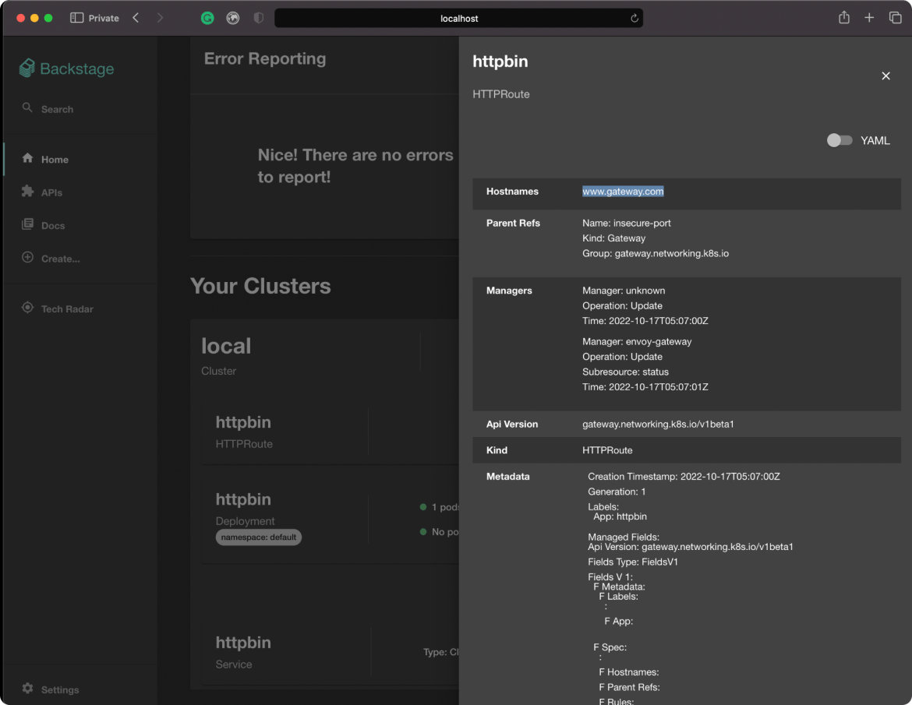

在这篇文章中，我们将亲身体验 [Envoy Gateway](https://github.com/envoyproxy/gateway) 和 [Gateway API](https://gateway-api.sigs.k8s.io/)。以下是逐步指导你安装 Envoy Gateway 的说明，以及通过 Envoy 代理在集群外公开 HTTP 应用程序的简单用例。

如果你不方便运行，我在本文中包含了每个命令的输出，即使你没有 Kubernetes 集群也可以看到它是如何工作的。

如果你是 GUI 的粉丝，在文章的最后我会附上 Tetrate 基于 [Backstage](https://backstage.io/) 的概念验证 [Envoy Gateway GUI](https://github.com/tetratelabs/eg-backstage-demo) 的屏幕截图和详细信息，以展示针对 Gateway API 构建此类东西是多么容易。

## 创建 Kubernetes 集群

首先运行 Envoy Gateway 和 Kubernetes 集群。最简单、最安全的方法是使用 [minikube](https://minikube.sigs.k8s.io/docs/start/) 在本地机器上启动集群。

```bash
$ minikube start –driver=docker --cpus=2 --memory=2g

😄  minikube v1.27.0 on Arch 22.0.0 (x86_64)
	▪ KUBECONFIG=...
❗  For more information, see: https://github.com/kubernetes/kubernetes/issues/112135
📌  Using Docker Desktop driver with root privileges
👍  Starting control plane node minikube in cluster minikube
🚜  Pulling base image ...
🔥  Creating docker container (CPUs=2, Memory=2048MB) ...
🐳  Preparing Kubernetes v1.25.2 on Docker 20.10.17 ...
	▪ Generating certificates and keys ...
	▪ Booting up control plane ...
	▪ Configuring RBAC rules ...
🔎  Verifying Kubernetes components...
	▪ Using image gcr.io/k8s-minikube/storage-provisioner:v5
🌟  Enabled addons: storage-provisioner
🏄  Done! kubectl is now configured to use "minikube" cluster and "default" namespace by default
```

## 安装 Envoy Gateway

回想一下，Envoy Gateway 是由新的 Gateway API 配置的，而不是旧的 Ingress API。Gateway API 尚未合并到上游 Kubernetes，因此我们的集群将无法使用它。我们通过为其部署 CRD 来安装该 API。Envoy Gateway 项目提供了一个文件，用于安装 Gateway API 和部署 Envoy Gateway。

```bash
$ kubectl apply -f https://github.com/envoyproxy/gateway/releases/download/v0.2.0/install.yaml
```

这会产生大量资源，我将分几个部分中讨论它们。首先是 Gateway API：

```bash
customresourcedefinition.apiextensions.k8s.io/gatewayclasses.gateway.networking.k8s.io created
customresourcedefinition.apiextensions.k8s.io/gateways.gateway.networking.k8s.io created
customresourcedefinition.apiextensions.k8s.io/httproutes.gateway.networking.k8s.io created
customresourcedefinition.apiextensions.k8s.io/referencegrants.gateway.networking.k8s.io created
customresourcedefinition.apiextensions.k8s.io/referencepolicies.gateway.networking.k8s.io created
customresourcedefinition.apiextensions.k8s.io/tcproutes.gateway.networking.k8s.io created
customresourcedefinition.apiextensions.k8s.io/tlsroutes.gateway.networking.k8s.io created
customresourcedefinition.apiextensions.k8s.io/udproutes.gateway.networking.k8s.io created
namespace/gateway-system created
validatingwebhookconfiguration.admissionregistration.k8s.io/gateway-api-admission created
service/gateway-api-admission-server created
deployment.apps/gateway-api-admission-server created
serviceaccount/gateway-api-admission created
clusterrole.rbac.authorization.k8s.io/gateway-api-admission created
clusterrolebinding.rbac.authorization.k8s.io/gateway-api-admission created
role.rbac.authorization.k8s.io/gateway-api-admission created
rolebinding.rbac.authorization.k8s.io/gateway-api-admission created
job.batch/gateway-api-admission created
job.batch/gateway-api-admission-patch created
```

如你所见，主要是 CRD。但请注意，安装 Gateway API 还部署了一些工作负载资源，包括 Deployment 等 ——Gateway API 带有一个 webhook 准入控制器来验证我们部署的资源，可以使用以下命令查看：

```bash
$ kubectl get pods --namespace gateway-system
NAME                                        	READY   STATUS  	RESTARTS   AGE
gateway-api-admission-2dhk5                 	0/1 	Completed   0      	70s
gateway-api-admission-patch-dbdbc           	0/1 	Completed   1      	70s
gateway-api-admission-server-68485ffc97-gt8v4   1/1 	Running 	0      	70s
```

添加到集群 API 中的新 CRD：

```bash
$ kubectl api-resources | grep gateway.networking

gatewayclasses                	gc       	gateway.networking.k8s.io/v1beta1  	false    	GatewayClass
gateways                      	gtw      	gateway.networking.k8s.io/v1beta1  	true     	Gateway
httproutes                                 	gateway.networking.k8s.io/v1beta1  	true     	HTTPRoute
referencegrants               	refgrant 	gateway.networking.k8s.io/v1alpha2 	true     	ReferenceGrant
referencepolicies             	refpol   	gateway.networking.k8s.io/v1alpha2 	true     	ReferencePolicy
tcproutes                                  	gateway.networking.k8s.io/v1alpha2 	true     	TCPRoute
tlsroutes                                  	gateway.networking.k8s.io/v1alpha2 	true     	TLSRoute
udproutes                                  	gateway.networking.k8s.io/v1alpha2 	true     	UDPRoute
```

下面是 Envoy Gateway 本身。

```
namespace/envoy-gateway-system created
customresourcedefinition.apiextensions.k8s.io/envoyproxies.config.gateway.envoyproxy.io created
serviceaccount/envoy-gateway created
role.rbac.authorization.k8s.io/leader-election-role created
clusterrole.rbac.authorization.k8s.io/envoy-gateway-role created
clusterrole.rbac.authorization.k8s.io/metrics-reader created
clusterrole.rbac.authorization.k8s.io/proxy-role created
rolebinding.rbac.authorization.k8s.io/leader-election-rolebinding created
clusterrolebinding.rbac.authorization.k8s.io/envoy-gateway-rolebinding created
clusterrolebinding.rbac.authorization.k8s.io/proxy-rolebinding created
configmap/envoy-gateway-config created
service/envoy-gateway created
service/envoy-gateway-metrics-service created
deployment.apps/envoy-gateway created
```

这些是工作负载资源以及相关的安全和网络。片刻之后，我们可以看到正在运行的控制器：

```bash
$ kubectl get pods --namespace envoy-gateway-system
NAME                        	READY   STATUS	RESTARTS   AGE
envoy-gateway-dc74c4d97-pntbj   2/2 	Running   0      	35s
```

## 安装测试应用

我们还需要一些东西让网关真正将流量转发到 —— 就像我们的一个应用程序一样的东西。我们可以使用 httpbin，Envoy Gateway 项目提供了方便的清单。

```bash
$ kubectl apply -f https://raw.githubusercontent.com/istio/istio/master/samples/httpbin/httpbin.yaml

serviceaccount/httpbin created
service/httpbin created
deployment.apps/httpbin created
```

这将在默认命名空间中运行：

```bash
$ kubectl get pods -n default
NAME                    	READY   STATUS	RESTARTS   AGE
httpbin-9dbd644c7-fhtw5 	1/1 	Running   0      	4m16s
```

## 配置 Envoy Gateway

现在我们可以继续配置 Envoy Gateway 以执行一些请求路由。我们需要做的第一件事是注册我们刚刚部署的 Envoy Gateway 控制器，以便其他资源可以引用它来识别配置的网关，以防你在一个集群中部署多个网关。 `controllerName` 字段匹配控制器向其运行的 Kubernetes 集群注册的值。

```bash
$ kubectl apply -f - <<EOF
apiVersion: gateway.networking.k8s.io/v1beta1
kind: GatewayClass
metadata:
  name: my-envoy-gateway
spec:
  controllerName: gateway.envoyproxy.io/gatewayclass-controller
EOF

gatewayclass.gateway.networking.k8s.io/eg created
```

我们可以看到关于这个新实例的一些有限信息，假设我们的描述是有效的，我们将看到 `ACCEPTED: True`。

```bash
$ kubectl get gatewayclass -o wide
NAME   CONTROLLER                                  	ACCEPTED   AGE 	DESCRIPTION
eg 	gateway.envoyproxy.io/gatewayclass-controller   True   	2m38s  
```

接下来，让我们配置一个 Gateway 对象 —— 这将打开我们希望 Envoy 代理监听的网络端口。对于这个简单的演示，我们将绑定到一个端口而不使用 TLS，因此我将其称为 “不安全端口”。

```bash
$ kubectl apply -f - <<EOF
apiVersion: gateway.networking.k8s.io/v1beta1
kind: Gateway
metadata:
  name: insecure-port
spec:
  gatewayClassName: my-envoy-gateway
  listeners:
    - name: http
      protocol: HTTP
      port: 8080
EOF
```

当我们检查它时，我们会发现它并没有就绪。由于我们使用的本地开发集群无法使这种云负载均衡器成为 “真正的” 负载均衡器（因此地址字段也是空的），因此该批准被搁置。不用担心这个，它仍然可以正常工作。

```bash
$ kubectl -n default get gateway -o wide
NAME        	CLASS             ADDRESS   READY   AGE
insecure-port   my-envoy-gateway                     2m54s
```

最后，我们可以为一些 HTTP 流量设置路由。在这个简单的示例中，我们匹配任何路径上对 vhost `www.example.com` 的任何请求，并将其发送到我们之前部署的 httpbin 实例。

```bash
$ kubectl apply -f - <<EOF
apiVersion: gateway.networking.k8s.io/v1beta1
kind: HTTPRoute
metadata:
  name: httpbin
spec:
  parentRefs: [ {name: insecure-port} ]
  hostnames: ["www.example.com"]
  rules:
    - matches:
        - path: {type: PathPrefix, value: /}
      backendRefs:
        - {group: "", kind: Service, name: httpbin, port: 8000, weight: 1}
EOF

httproute.gateway.networking.k8s.io/httpbin created
```

检查这种资源目前并没有向我们展示太多东西，但我们可以看到它至少已部署成功。

```bash
$ kubectl get httproute -n default -o wide
NAME   	HOSTNAMES         	AGE
httpbin	["www.example.com"]   58s
```

最后要注意的一件事是，直到现在才真正启动了 Envoy 的实例（之前它只是控制器，它本身并不处理流量）。这是代表 Envoy Gateway 的优化：代理的懒创建。检查系统上的 `age` 字段，看看它的创建时间。

```
$ kubectl get pods -n envoy-gateway-system
NAME                        	READY   STATUS	RESTARTS   AGE
envoy-default-insecure-port-5879556bd4-r5ggw   	1/1 	Running   0      	90s
envoy-gateway-dc74c4d97-pntbj   2/2 	Running   0      	13m
```

## 启动测试流量

就像我之前说的，我们无法获得真正的云负载均衡器，因为我们使用的是本地开发集群。但是 minikube 有一个简洁的特性，它将集群的服务暴露给我们的本地机器 —— 包括 Envoy Gateway 启动的代理。我们打开的 8080 端口将在回环中可用。

```bash
$ minikube tunnel
```

该命令会阻塞，因此根据我们部署的规则，打开一个新终端以发送将被路由到 httpbin 的请求。

```bash
$ curl --header "Host: www.example.com" 127.0.0.1:8080/headers

HTTP/1.1 200 OK
server: envoy
date: Fri, 07 Oct 2022 12:41:32 GMT
content-type: application/json
content-length: 175
access-control-allow-origin: *
access-control-allow-credentials: true
x-envoy-upstream-service-time: 14

{
	"headers": {
    	"Accept": "application/json, */*",
    	"Host": "www.example.com",
    	"User-Agent": "curl/7.79.1",
    	"X-Envoy-Expected-Rq-Timeout-Ms": "15000"
	}
}
```

这只是一个简单的演示，但你可以探索 Gateway API 的其余部分并开始使用更多功能 ——Envoy Gateway 的文档将是一个很好的指南。

## 示例 GUI

我给出的说明是针对命令行的，但是好的 GUI 是与任何系统交互的好方法。Envoy Gateway 对标准 Gateway API 的实施提供了交互操作接口生态系统。Tetrate 使用 [Backstage](https://backstage.io/)（开发者接口的新兴标准）为 Envoy Gateway 构建了一个概念验证 UI。下面我将展示几个从上面检查演示设置的屏幕截图。

如果你想玩这个，或者fork它，[我们已经发布了代码](https://github.com/tetratelabs/eg-backstage-demo)—— 目前还是 alpha 版本，并且只是一个可以在一周内构建的示例！如果你在 KubeCon Detroit，请到我们的展位，我们可以亲自向你展示！




如果你正在开始使用 Istio 和 Envoy，请[查看 Tetrate 学院](https://academy.tetrate.io/)，你会发现大量的免费课程、研讨会，以及 Tetrate 的 Istio 管理员认证考试。

要想以最简单的方式安装、管理和升级 Istio，请查看[我们的开源 Tetrate Istio 发行版（TID）](https://istio.tetratelabs.io/)。TID 是一个经过审查的 Istio 的上游发行版 ——Istio 的加固镜像，具有持续的支持，更容易安装、管理和升级。
