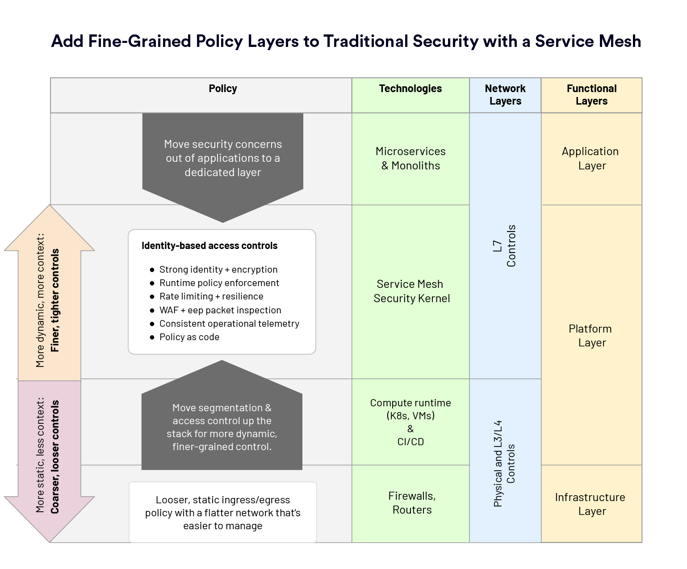

本文是 Tetrate 即将出版的《Istio in Production》一书中摘录的服务网格最佳实践系列的第一篇，作者是 Tetrate 创始工程师 Zack Butcher。

我们接到许多实施网格的企业的问题，其中之一是 “我还需要哪些控制，而网格提供哪些控制？” 换句话说，他们想知道网格如何适应现有的安全模型。我们发现，网格最适合作为一组安全控制的内圈，这些控制从物理网络到应用本身的每一层都被实施。

## 服务网格作为通用策略执行点

我们看到网格的 Sidecar 作为通用策略执行点（[NIST SP 800-204B：使用服务网格的基于属性的访问控制](https://csrc.nist.gov/publications/detail/sp/800-204b/final)）。由于它拦截了所有进出应用程序的流量，Sidecar 为我们提供了一个强大的位置来实现各种策略。我们可以实现传统的安全策略，如基于应用程序标识而非网络位置的更高保证的应用程序之间的授权。但我们也可以实施之前不切实际或需要与应用程序深度参与的策略。例如，网格允许您编写以下策略：“后端可以从数据库读取（使用应用级身份进行身份验证和授权），但前提是请求具有有效的最终用户凭证并具有读取范围（使用最终用户身份进行身份验证和授权）。”

虽然服务网格提供了一个强大，动态和一致的安全基线，您可以在其上构建应用程序安全模型，但网格本身永远无法提供应用程序所需的 100% 运行时安全。例如，由于 Sidecar 位于用户空间中，网格在减轻许多类型的网络拒绝服务攻击方面不如传统防火墙机制。另一方面，由于同样的原因，网格在减轻许多应用级拒绝服务攻击方面比传统基础设施更有效。

## 作为一个强大的中间层

网格作为基础架构的强大中间层：位于物理网络和所实施的 L3/L4 控制之上，但位于应用程序之下。这允许更脆弱和更难以改变的松散配置 —— 允许更高层的更大敏捷性 —— 因为控制体系在更高层被考虑。

网格提供的主要安全功能是：

- 作为 X.509 证书的**运行时身份**，用于在传输期间加密，以及服务之间通信的身份验证和授权。
- **策略执行点**，用于在网格中的所有应用程序上实施一致的最终用户身份验证和授权。
- 服务身份和最终用户身份的**运行时策略执行**（例如，“A 只能使用具有读取范围的有效最终用户凭证与 B 进行通信”）。
- **速率限制和弹性功能**，用于减轻常见的应用级拒绝服务攻击，并保护免受常见的级联故障模式的影响。
- **WAF** 和其他**深层包检测**功能，用于内部流量，而不仅仅是在边缘。
- 来自网格中所有应用程序的**一致的操作遥测**，可用于理解、实施和审核安全策略。
- 具有动态运行时更新的**策略即代码**（Policy-as-code）模型，独立于应用程序生命周期。

## 服务网格作为分层防御的一部分

考虑到网格的安全功能，我们认为，组织采用它作为分层防御方法的一部分是最合理的。

## L3 层的敏捷性：粗粒度的入口和出口策略以及 L7 的细粒度控制

在边缘的 L3 控制（如防火墙）在粗粒度的入口和出口策略方面仍然有效，但通常会减慢应用程序开发敏捷性。由于网格提供了细粒度的服务间授权，所以可以在 L3 上设置更广泛的策略，为平台、安全和应用程序团队提供更多敏捷性。

**实施对外部服务的访问控制**。网格的出口代理特别适用于实施应用程序到外部服务的控制，而只有出口代理本身被外出防火墙 allow-listed：这为平台或安全团队在管理哪些应用程序允许与企业基础架构之外的通信提供了很多敏捷性，同时保持现有的基于周界的模型。

**使用加密和动态访问控制代替 “可达性即授权”**。网格可以开始有效地取代 VPN 和基于 IPSec 的网络“可达性即授权”模式，提供传输中的加密，以及每个应用而不是每个主机的认证和授权。

## L4 层的改进：更扁平和易于管理的网络微分段

微分段之类的控制可以通过网格进一步改进：尽管我们可能允许整个（小）子网在基于分段的策略中进行通信，但我们可以使用网格按方法和动词对单独的服务间通信进行控制。

**补充现有的微分段同时展平网络**。通过提供细粒度的服务间控制，网格往往会补充现有的微分段策略，同时使得组织更容易管理的较平的网络得以采用（例如，在云环境中）。

**使用工作负载身份启用传输期间的加密（mTLS）和服务级别访问控制**。传输层几乎总是处理加密传输，网格通过根据 SPIFFE 规范发布和轮换短期（<24 小时）工作负载身份证书来为应用程序实现此功能，从而允许传输期间的加密以及服务级别的身份验证和授权。

## L7 层的增强：无处不在的边缘和访问控制

**为所有流量提供边缘控制**。L7 控制，如 Web 应用程序防火墙（WAF）以及 “API 网关功能”（如流量限制）几乎总是在边缘实施。网格可以通过为网格中所有流量（包括内部的 “东西” 通信）启用相同的功能来增强这些现有部署。

**简化应用程序的访问控制**。除了使边缘控制无处不在之外，网格还可以在应用程序看到请求之前执行端用户身份验证和粗粒度授权，从而大大简化应用程序本身必须执行的访问控制。在未来，我们将看到越来越多的访问控制功能从应用程序迁移到网格中。

## 总结和展望

我们认为，服务网格最适合作为现有安全模型的一部分，通过在传统安全控制之上添加更细粒度的安全策略来实现。作为一个通用策略执行点，网格在更改最困难的较低层提供了更松散的策略，将敏捷性推向堆栈的顶部，其中更多的上下文允许在更高层实现更特定的控制。这种强大的安全层对于大多数组织来说都是采用分层防御深度方法的最佳选择。

## 接下来：服务网格部署最佳实践

我们服务网格最佳实践系列博客文章的下一篇将讨论部署拓扑。在多个集群的真实基础架构中部署服务网格时存在一些移动部分。在下一篇文章中，我们将更详细地研究：

- 控制平面应如何部署在应用程序附近。 
- 应该如何部署入口，以促进安全和敏捷性。
- 如何使用Envoy促进跨集群的负载平衡。
- 证书在网格中应该是什么样子的。

---

如果您不熟悉服务网格和 Kubernetes 安全性，我们在 [Tetrate Academy](https://tetr8.io/academy) 提供了一系列免费在线课程，可以让您快速了解 Istio 和 Envoy。

如果您正在寻找一种快速将 Istio 投入生产的方法，请查看 [Tetrate Istio Distribution (TID)](https://tetr8.io/tid)。TID 是 Tetrate 的强化、完全上游的 Istio 发行版，具有经过 FIPS 验证的构建和支持。这是开始使用 Istio 的好方法，因为您知道您有一个值得信赖的发行版，有一个支持您的专家团队，并且如果需要，还可以选择快速获得 FIPS 合规性。

一旦启动并运行 Istio，您可能需要更简单的方法来管理和保护您的服务，而不仅仅是 Istio 中可用的方法，这就是 Tetrate Service Bridge 的用武之地。您可以[在这里](https://tetr8.io/tsb)详细了解 Tetrate Service Bridge 如何使服务网格更安全、更易于管理和弹性，或[联系我们进行快速演示](https://tetr8.io/contact)。 
