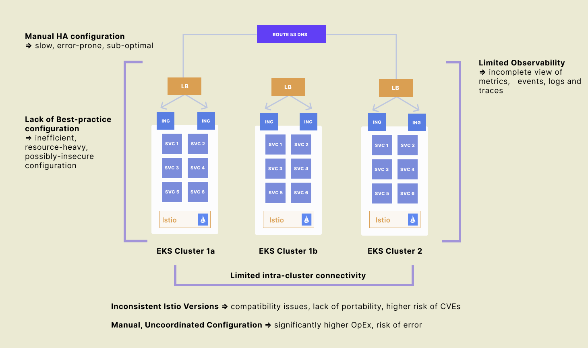
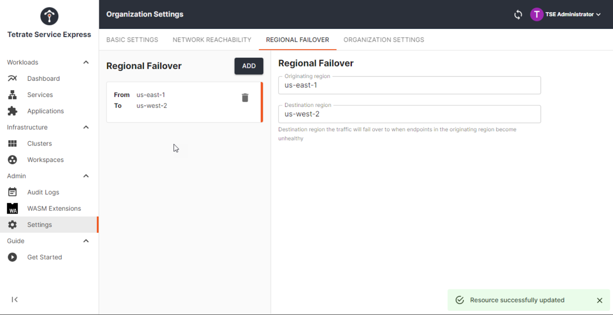

Tetrate Service Express (TSE) 是一款基于开源软件的服务连接、安全和弹性自动化解决方案，专为 Amazon EKS 设计。

本文译自：[Tetrate Service Express 介绍](https://tetrate.io/blog/introducing-tetrate-service-express/)

## 快速实现 Amazon EKS 上安全和弹性的服务网格

今天我们很高兴地宣布 Tetrate Service Express (TSE)，这是一款针对 Amazon EKS 的服务连接、安全和弹性自动化解决方案。我们基于 Istio 和 Envoy 等开源服务网格组件构建了 TSE，并针对 AWS 对 TSE 进行了简化安装、配置和操作的优化。如果您的团队正在 AWS 上进行服务网格实验，并且需要快速证明投资回报率，而无需掌握复杂的 Istio 和 AWS 基元，那么 TSE 就是适合您的选择！如果您的团队已经在单个集群上拥有了服务网格，但希望将网格扩展到多个集群甚至区域，那么 TSE 也可以帮助您。事实上，TSE 是唯一一款基于开源软件并针对 AWS 进行优化的产品，预先集成了最受欢迎的 AWS 服务，可在几分钟内让您上手。

如果您想快速了解 Tetrate Service Express 的功能，在[此处](https://tetr8.io/tse)加入等待列表以获取您的评估副本。

如果您想深入了解 Tetrate Service Express 的新功能，请继续阅读。

## 为什么选择 Tetrate Service Express

如果您的组织想要创造更好的客户体验、提高运营效率或保护知识产权，那么很可能必须构建和运行软件——更高质量、更快速的发布、更好的正常运行时间。而且很可能，应用程序开发团队、运营团队和平台团队正在借助两种创新趋势来实现这些目标：云基础设施的灵活性和微服务。

在云中构建微服务时，许多团队选择 Amazon EKS 的便利性。然而，随着他们扩展 EKS 工作负载，他们会发现自己面临以下问题：

- 如何保护分布在 AWS 上的微服务组件？
- 如何在更新或负载下单个组件失败时保持可靠性？
- 当一切都是动态的，手动配置不再起作用时，如何管理服务之间的流量？

越来越多的平台运营团队会在微服务之上创建一个专用的基础设施层——服务网格——它提供了跨微服务组件的服务发现、安全性、认证和可观测性。Istio 和 Envoy 是服务网格控制平面和数据平面的开源标准，但 Istio 和 Envoy 只是部分解决方案，因为它们为运行 Amazon EKS 的团队添加了新的操作复杂性。

Tetrate Service Express 为平台团队提供了 Istio 和 Envoy 之上的服务网格自动化。它处理在 Amazon EKS 上安装和配置开源组件，与 AWS 服务集成，并为平台运营商提供管理控制台，以快速配置服务网格以实现安全、弹性和可观察性。

## 快速安装 Amazon EKS 和集成 AWS 服务

让 Istio 在 EKS 上运行可能变得更加容易（例如使用[Tetrate Istio Distro EKS add-on](https://tetrate.io/blog/tid-add-on-for-eks/)），但在您可以操作功能性服务网格之前，还需要完成更多的工作：

- 如何确保所有服务网格组件都已正确安装和配置？
- 如何定义 Istio 和 Envoy 周围的网络基础架构，以实现安全的跨集群连接和可用性？
- 如何观察和排查网格上的服务，以协助扩展和优化？

TSE 可以使用 Helm chart 轻松安装在 EKS 上，并与 Route 53 和 NLB（或其他 AWS 负载平衡器类型）轻松集成，以便您可以快速：

- 定位服务的边缘和入口网关，以管理和安全地控制入口和出口流量。
- 通过内置身份验证、速率限制、HA 和安全性提供应用程序的 API。
- 获取服务和应用程序的 MELT（度量、事件、日志、跟踪）。

## 一步式服务间的 mTLS 加密

服务网格的第一个用例之一是使用 mTLS 启用服务间加密，但一旦你扩展到多个集群，事情就会很快变得复杂：

- 如何在各个集群之间建立和管理单个信任根？
- 如何在全面支持零信任姿态的情况下，强制执行 mTLS？
- 如何定期轮换证书，并在泄漏或损坏证书的情况下做出响应？

Tetrate Service Express 通过提供以下内容使服务易于加密并应用零信任姿态：

- 内置的易于使用的证书颁发机构，可在所有群集中轮换和管理证书。
- 在管理级别上定义对所有服务的 mTLS 需求。
- 从默认的拒绝所有姿态开始创建细粒度的访问策略。

## 集群和区域之间的易于故障转移设置

在定义应用程序基础架构时，设置服务的内部高可用性可能是比较复杂的事情，特别是在不同的区域内。一些可能遇到的问题包括：

- 如何配置 Route53、Amazon 负载均衡和其他负载均衡服务，以在不同的集群之间实现可靠的 HA？
- 如何在没有 Hairpinning 的情况下设置跨集群通信和内部高可用性？
- 当服务失败时如何自动化网络配置更改？

Tetrate Service Express 通过提供以下功能使获取服务 HA 易于实现：

- 对服务发布进行自动配置的入口、Amazon 负载均衡和 Route 53。
- 为内部高可用性自动配置内部和东/西网关。
- 动态重新配置网络规则，以在最小中断的情况下在集群之间和之间传输流量。

## 接下来

这只是我们要从 Tetrate Service Express 中突出显示的一些功能。Tetrate Service Express 将在本月晚些时候发布技术预览版，但是您现在可以加入等待列表，以在发布时获取评估副本。一旦您加入等待列表，我们将与您联系，向您提供访问评估软件、新文档门户网站和 Slack 社区频道的信息。

我们还计划推出一系列额外的博客、视频和网络研讨会，以展示更多 TSE 的功能。下一场网络研讨会定于 5 月举行，请[立即注册](https://app.livestorm.co/p/06a20bee-58b0-4976-977d-c2e4b16dbe68)。最后，请不要忘记在[Twitter](https://twitter.com/Tetrateio)或[LinkedIn](https://www.linkedin.com/company/tetrate)上关注 Tetrate，以便在新的 TSE 内容可用时获得即时更新！
