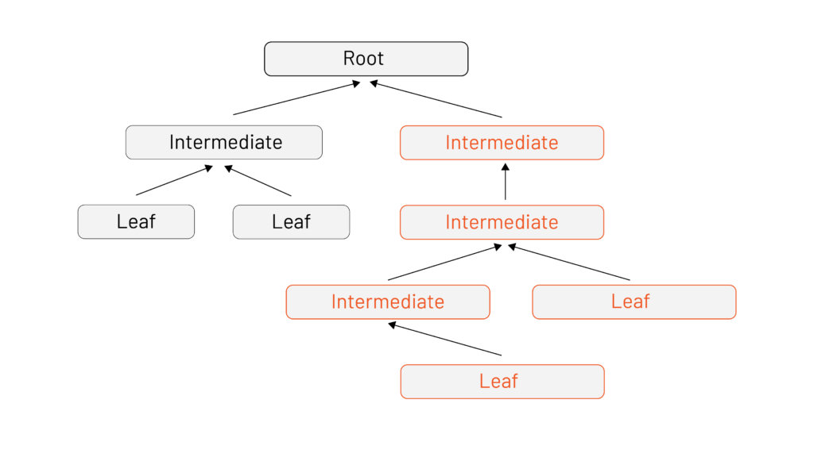
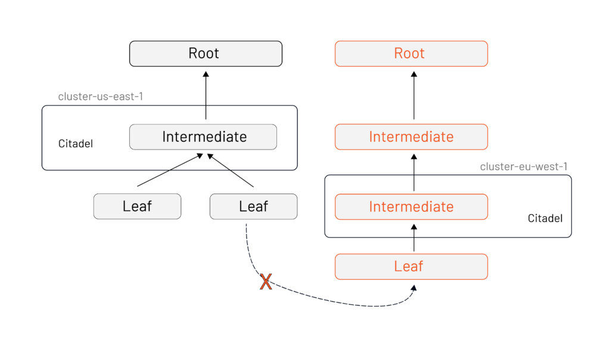
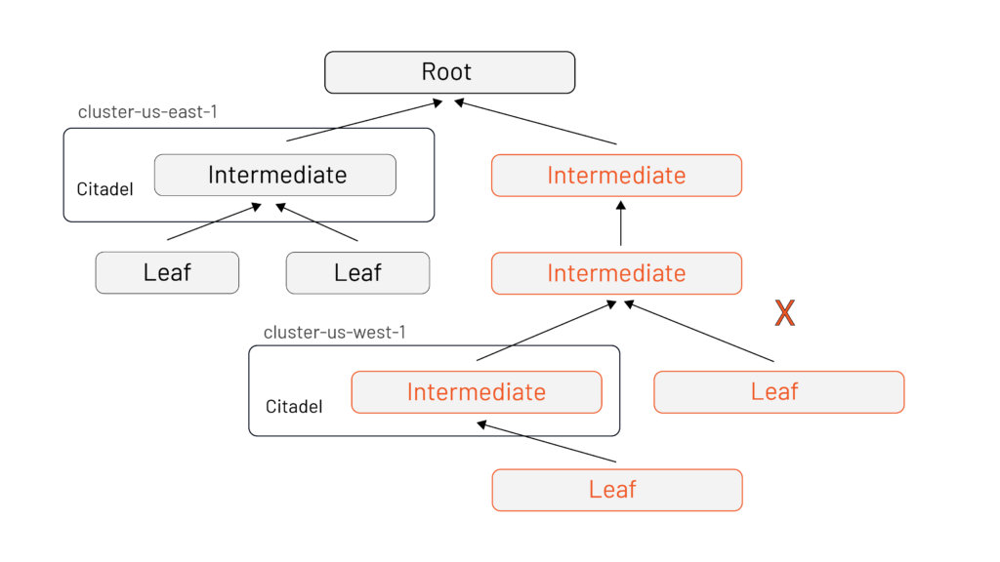
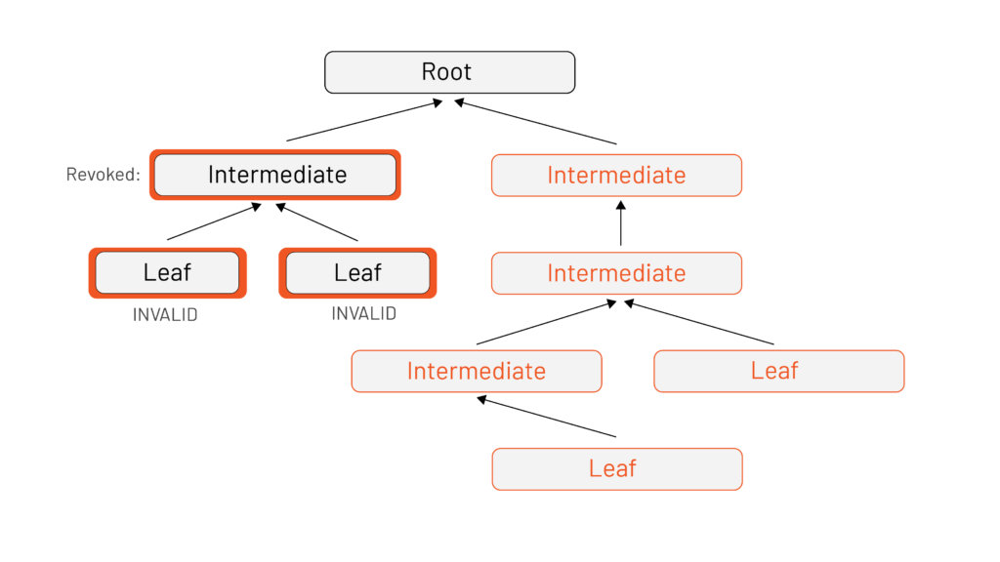

当我们与想要使用 Istio 的客户或用户甲流时，这一个问题时长会出现——Istio 中的证书信任任何运行？Istio 有自己的证书颁发机构，而我们自己也有证书颁发机构，如何确保它们相互信任？ 

简而言之，它的工作原理是通过中间签名证书将 Istio 带入您现有的信任根。 

如果您将 Istio 作为演示运行或开箱即用，它将拥有自己的自签名证书 —— 它是自己的根证书。对于在多个集群中运行 Istio 的用户来说，这是一个常见的痛点：他们无意中创建了两个不信任的孤岛，因此没有安全通信。

以下是如何通过让 Istio 信任您现有的 PKI 的步骤。

### 简述

这是简短的版本：您应该通过为每个 Istio 部署创建一个中间签名证书来让 Istio 信任您现有的 PKI（并且每个集群应该有一个 Istio 部署）。然后你会：

1. 启用跨 Istio 部署的通信
2. 允许细粒度的证书撤销，而无需同时在整个基础架构中强制使用新证书（如果这听起来像是等待发生的重大中断，那么您是对的）。 
3. 启用签名证书的轻松轮换。您需要做的就是创建一个新的中间件并使用新证书重新启动 Istio。因为它在同一个信任根中，所以一切都继续工作。 

Istio 必须适应您现有的架构，以在组织内实现增量采用 —— 使网格适应您的组织，而不是反过来。从了解对中间证书签名密钥的需求开始，将为您的成功做好准备，并使任何基础架构或环境更改更加顺利。

### 详述

我们先来了解一下证书验证的过程。在基本证书中，证书检查从信任根开始，向下延伸到特定身份（叶）。证书路径验证算法是我们确保证书可信的方式。当我们使用 TLS 等安全协议连接到另一台机器时，服务器会向我们提供部分或全部证书链以证明其身份。如果链中的证书被确定为无效，则证书链将被拒绝并且不会建立信任。如果我们顺利到达链的末端，则路径（以及证书）是有效的。成功！我们可以信任服务器！

当 TLS 握手发生时，路径验证算法不关心有多少证书链驻留在我们的信任包中。基于我们带来的和他们提供的，它只关心我们能否构建一条从服务器的叶节点到我们的捆绑包中的信任根的链。上面的示例显示验证发生在证书交换中，这足以让叶子在证书颁发机构中找到它的位置。 

当您在生产环境中运行 Istio 时，您将拥有多个叶节点和中间节点，但**只有一个根节点。**

这就是为什么在现有 PKI 中建立信任，因为有以下三个主要好处：

1. 在 Istio 部署之间的交叉通信
2. 细粒度证书撤销
3. 轻松轮换证书

### **跨 Istio 部署的通信** 

对于 Istio，有两种方法可以确保跨部署的通信 —— 简单的方法和困难的方法。 

困难的方法涉及 Istio 运维人员采取耗时、复杂且昂贵的步骤来确保两个根同时在另一个的证书颁发机构 (CA) 捆绑包中。

简单的方法是为每个部署使用单独的中间签名证书部署 Istio，所有这些证书都共享相同的根。

当涉及到细粒度撤销和证书的轻松轮换时，这一决定的连锁反应是巨大的。

### 细粒度证书撤销

撤销证书会将证书标记为不再受信任。当证书路径验证算法从叶节点走到根节点时，会对每个证书进行吊销状态检查。这使您能够撤销对单个组件或整个部署部分的信任。

这很重要，因为如果签名密钥被泄露，恶意行为者可能会通过出示您的客户认为是有效证书的内容来冒充您的服务器。这在 Istio 中更为重要，因为我们使用证书来识别彼此的工作负载 —— 攻击者可以伪装成您网格中的任何服务！ 

通常，处理撤销是管理任何 PKI 中最困难的部分。Istio 帮助降低这种风险的方法之一是颁发非常短暂的证书。典型的吊销列表最多可能需要 24 小时才能在整个组织中传播。Istio 颁发的证书有效期少于 12 小时，因此几乎不需要撤销 Istio 颁发的身份证书。您只需要担心为每个 Istio 部署创建的签名证书。

### 轻松轮换证书

与吊销一样，中间证书的轮换更容易。优点包括，如果您能够按集群轮换证书而不是在根节点轮换证书，您将体验到更少的停机时间（以及相关的复杂性，即在任何地方发布一个带有新根的更新的 CA 包）。而且，就像任何好的 PKI 一样，这可以让您使根离线并安全地存储起来。

## 总结

用简单的方法来做！将 Istio 引入您现有的信任根中，以避免痛苦和心痛。中间签名证书的存在是为了让采用 Istio 更容易、更安全。 
