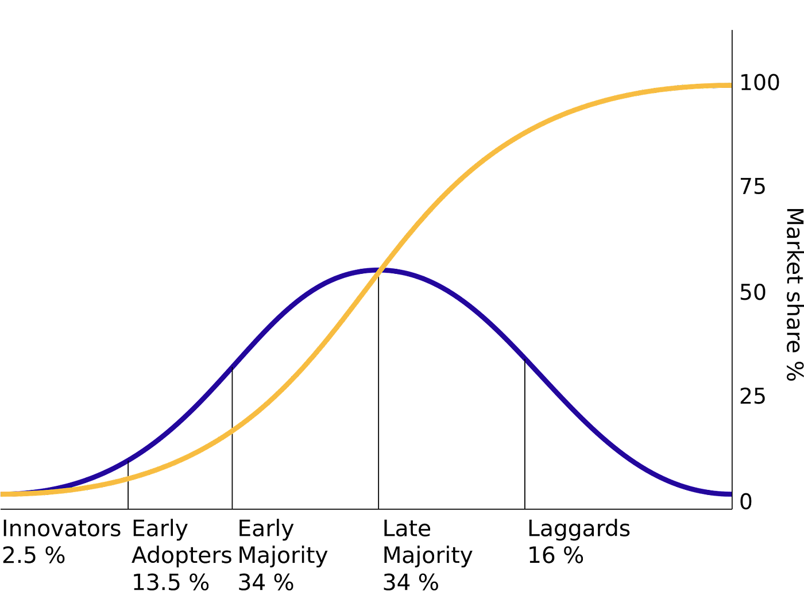

本文译自：<https://danielbryantuk.medium.com/kubecon-chicago-key-takeaways-3de5ca13b375>

摘要：本文讨论了 KubeCon 的主要议题，包括平台工程、Kubernetes 的不断发展、开发者体验的重要性、对应用开发和集成的关注、云原生通信的捆绑问题、安全问题的重要性、对可持续性的关注，以及社区的力量。文章强调了在标准化和创新之间取得平衡的重要性，并预测云原生的未来将看到更多的 AI/LLMs。

---

这次 KubeCon NA 对我来说是一次非常不同的体验，因为我不是代表公司或办展位。然而，我仍然度过了一段愉快的时光，与云原生社区的许多人见面真是太棒了。回到芝加哥也很不错，这座城市对我们很好 —— 我几乎忘记了我有多喜欢芝加哥式深盘披萨！

以下是我从 KubeCon NA 2023 中得出的主要收获：

1. 云原生社区正在缓慢接受AI/LLM
2. DevOps 已经过时：平台工程万物
3. 山中有金！在平台激战中销售镐和铲子
4. Kubernetes 应该保持不完整（并不断发展）
5. 别忘了开发者体验！
6. 增加对应用程序开发和集成的关注
7. 云原生通信：打包获胜？
8. 安全是大生意
9. 更加关注可持续性：可观察性、扩展性和 FinOps
10. 社区，社区，社区

## 背景设定：迎来了后期采用者

我从参加 KubeCon 芝加哥得到的总体感觉是，我们已经完全进入了[创新扩散](https://en.wikipedia.org/wiki/Diffusion_of_innovations)的后期采用者阶段。

当然，像 KubeCon 这样的会议存在一个危险，即陷入（云原生）泡沫，走出会议时很容易认为整个世界都在运行 Kubernetes。这并不是真的，而且“[Gartner 表示到 2027 年，50% 的关键企业应用将存储在集中的公共云位置之外](https://www.gartner.com/en/newsroom/press-releases/2023-10-30-gartner-says-50-percent-of-critical-enterprise-applications-will-reside-outside-of-centralized-public-cloud-locations-through-2027)”。然而，如果你睁大眼睛看，几乎 50% 的工作负载正在云中运行（或将要运行），这标志着后期采用者的到来。

我从活动的主题演讲和厂商展厅中感受到了这种转变。更多的强调放在了可靠性和值得信赖性上，而不是创新，产品套件和易于集成而不是“最佳解决方案”，以及伙伴关系和合作而不是个别组织的开创性。

有了这个背景，让我们更深入地了解这些主要收获！

## 云原生社区正在缓慢接受AI/LLM

与同一天举行的 KubeCon NA 同期活动的 [OpenAI DevDay](https://devday.openai.com/) 形成鲜明对比，KubeCon 上几乎没有关于人工智能的内容。如果你还没有观看 [OpenAI DevDay 的主题演讲](https://www.youtube.com/watch?v=U9mJuUkhUzk)，我鼓励你看看。Ed Sim 在他的每周 [企业IT/VC快讯](https://www.whatshotit.vc/p/whats-in-enterprise-itvc-367) 中也提供了一个很好的总结。

当然，KubeCon 的第一天主题演讲以人工智能为主题，但这似乎有点“外挂”，更侧重于为 AI/LLM 提供基础设施，而不是在开发或运营工作流中使用。在这里我不想过于判断，因为像 KubeCon 这样的活动需要数月的策划，而 AI 的发展是以每天的速度发生的。

一些厂商的展位专注于“云端的 ChatGPT”，但我与赞助商的大多数交谈都集中在构建平台的现有问题上。如果你对在平台空间中使用 AI 的潜力感兴趣，我建议你在最近的 [InfoQ 云和 DevOps 趋势报告播客](https://www.infoq.com/podcasts/cloud-devops-trends-2023/) 中与几位云原生和 DevOps 领导人，包括 Helen Beal、Abby Bangser、Matt Campbell 和 Steef-Jan Wiggers 一起聊一聊。

## DevOps 已经过时：平台工程万物！

我相信我们都看过 Minions/Gru 平台工程和 DevOps 的表情包（如果没有，在我 [KubeCon EU 2023 摘要](https://blog.getambassador.io/kubecon-eu-cloudnativecon-2023-summary-devex-debugging-and-doubling-down-on-community-82abee5853b3#acc6) 中提到过），而在 KubeCon 上每个人都在强调这一点。如果你搜索 [程序日程](https://events.linuxfoundation.org/kubecon-cloudnativecon-north-america/program/schedule/)，你会发现至少有两倍于提到 DevOps 的演讲数量的演讲提到了平台工程，而几乎没有一个演讲是以 DevOps 为标题的。

这是这个领域的自然演变，伴随着这种变化的好与坏。

“好”的是，我们正在围绕这个主题形成一个社区，并在行业内形成最佳实践。我要向云原生计算基金会（CNCF）TAG App 交付团队致以崇高的赞扬，因为他们发布了他们的“[平台工程成熟度模型](https://tag-app-delivery.cncf.io/whitepapers/platform-eng-maturity-model/)”（以及向云原生猫的 Abby Bangser 致以特别的赞扬）

在 KubeCon EU 2024 中还将举办 [平台工程日同期活动](https://events.linuxfoundation.org/kubecon-cloudnativecon-europe/co-located-events/platform-engineering-day/#call-for-proposals)。自从我整理了一堆关于社区中出现的平台工程思想，并在 KubeCon 2022 上呈现了“[从 Kubernetes 到 PaaS 再到…嗯，下一步是什么？](https://www.youtube.com/watch?v=btUYeOa7JPI)”的想法后，我们走了很长的路。

## 山中有金！在平台激战中销售镐和铲子

每个人都采用平台工程的坏处是，许多供应商面临“平台洗牌”的危险。当然，许多现有的 CNCF 景观灵感来自的产品在官方成为一个事物之前就帮助人们构建了平台。但是我不确定我在 KubeCon 上看到的一切都被市场营销为与平台工程友好。这意味着最终用户在购买产品时必须更仔细地查看，以确保它们符合他们的需求。

如果一个工具与现有的云原生堆栈集成不良，没有被构建来解决明确的用例（即“工作要完成的任务”），并且不能以自助服务的方式使用，那么它可能没有考虑到平台工程的概念。

当然，在任何（平台工程）淘金热中，总是有机会卖镐和铲子。

## Kubernetes 应该保持不完整（并不断发展）

我非常喜欢 Tim Hockins 在最后一天的主题演讲，““愿景的愿景 — Kubernetes 在其第二个十年的表现”，他在演讲中谈到了在短期内做出妥协以获得长期愿景的价值。

社区本可以尝试解决所有云原生挑战，并将所有平台工具集成到 Kubernetes 中。然而，Tim 强调了这在 OpenStack 中已经尝试过了…并且结果存疑。

这个概念在 Tim Bannister 的一条推文中得到了很好的总结，Tim 在大屏幕上分享了这条推文：“Kubernetes 应该保持不完整。”引用我最喜欢的漫画/电影系列之一，Kubernetes 也许是“[Gotham 需要的英雄，但现在此刻理应拥有的英雄](https://batmanfactor.com/not-the-hero-we-deserve-why-the-quote-is-significant/)”。

## 别忘了开发者体验！

很高兴在 KubeCon NA 的主题演讲中看到几次提到开发者体验和重要性。KubeCon 历来是一个基础设施和运维焦点的事件，但我们不能忘记我们的主要（平台）客户：开发者。

如果你不知道你的用户是谁以及他们最大的痛点是什么，你无法成功地定位你的产品。开发者是一群聪明的人，喜欢解决自己的问题，而且往往你的产品将与使用胶带和包线但能够“足够好地”完成工作的现状解决方案正面对决。

## 加大对应用开发和集成的关注

长期以来，我一直对 [Dapr](https://dapr.io/) 社区的工作印象深刻，可以说他们在突显云原生社区内应用开发者需求方面处于领先地位。对于不熟悉 CNCF 项目的人来说，Dapr 提供了用于通信、状态和工作流的集成 API。对于一些拥有一些灰发的人来说，可以将其视为云时代企业中间件（做得很好）。

即使在云原生空间迅速采用 AI/LLMs，我们仍然需要关注定义正确抽象的问题；否则，我们将能够生成大量难以理解的代码！

在我看来，Dapr 提供了构建分布式应用所需的几个非常有用的抽象，如发布 - 订阅、状态管理、分布式锁等。

我参加了几次 Dapr 的讲座并留下了深刻印象。如果我要构建一个全新的云原生应用（甚至是演变中的旧应用），我会首先考虑这个项目：

开源社区非常强大，Diagrid 的团队提供了几个出色的商业解决方案，减少了管理后端基础设施的摩擦和运营负担。我与 [Mark Fussell](https://twitter.com/mfussell) 和 [Bilgin Ibryam](https://twitter.com/bibryam) 进行了几次很好的交流，我鼓励你在 X 上关注他们。我的 InfoQ 朋友 Thomas Betts 还撰写了对最新的 Diagrid 商业发布的摘要：“[Diagrid 推出 Catalyst，一个无服务器、全托管的 Dapr 产品](https://www.infoq.com/news/2023/11/diagrid-managed-dapr/)。”

## 云原生通信：捆绑是否王道？

正如 Netscape 的前首席执行官 Jim Barksdale 曾经著名地说过的，创造利润的方式只有两种：一种是捆绑，另一种是解绑。而在云原生生态系统中，我们看到了很多捆绑！

这种观察在云原生通信栈领域尤为突出。

我多次讨论过这一点，包括最近的演讲：“[忙碌的平台工程师指南：API 网关](https://speakerdeck.com/danielbryantuk/devopscon-the-busy-platform-engineers-guide-to-api-gateways)” 。在这个栈中，大多数平台构建者将需要三个组件：API 网关（用于南北流量管理）、服务网格（用于东西流量）和容器本地接口或 CNI（用于所有底层软件定义网络）。

我会坦言我的偏见——曾在 Ambassador Labs 工作，制造 [Edge Stack](https://www.getambassador.io/products/edge-stack/api-gateway)，并且是 [Linkerd](https://linkerd.io/) 团队的大支持者——我喜欢选择“最佳解决方案”并进行集成。

然而，商业趋势正在朝着捆绑方向发展。我看到该领域的各种供应商在其最新产品中上下移动，例如 Isovalent（Cilium CNI 的创建者）通过拥抱服务网格和 API 网关而向上移动。Solo 通过将 CNI（Cilium）纳入其 Istio 服务网格和 API 网关产品中而向下移动。Tetrate、Kong、Tyk、Traefik 等公司也在进行类似的尝试。

如果你追踪（和关注）这个循环（和资金），明智的做法似乎是倾向于捆绑。

我相信这种学习不仅适用于云原生通信领域。总的来说，企业正在寻求整合供应商，减少自己动手解决方案的总体拥有成本（TCO），并将云支出承诺转移到云市场内提供的端到端解决方案上。

在相关的讨论中，由 [Keith Mattix](https://twitter.com/danielbryantuk/status/1722034551650648507) 主持的服务网格辩论小组是我在会议上最喜欢的会话之一。与通常的所有人都同意的形式不同，参与者没有保留，导致了一场有趣而富有信息的讨论！

## 安全是大生意

我将最后的三个要点保持简短，但我想提到展厅里满是安全解决方案，从安全的供应链解决方案到网络入侵检测和权限管理。这个领域有很多兴趣（和资金）。

演讲还很好地涵盖了这些主题，KubeCon 共同主席 [Frederick Kautz](https://twitter.com/ffkiv) 和 CNCF 的成员们强调了安全（以及相关的 CNCF 项目）在主题演讲中的重要性。

## 更加关注可持续性：可观测性、扩展性和 FinOps

关键演讲中突出的另一个话题是可持续性。有一个有趣的小组讨论：“[云中的环境可持续性并非神话](https://sched.co/1R4Tl)” ，甚至 AWS 赞助的主题演讲也侧重于这一点。

这是一个重要的话题，通过可观测性、自动扩展和 FinOps 来探讨理解和监控你的云（碳）足迹的基本驱动因素是很好的。

对于对 FinOps 这个主题不熟悉的人，我从 Roi Ravhon 那里学到了很多，他在我最近与他录制的 InfoQ 播客中分享了一些内容：“[Roi Ravhon 谈 FinOps、应用单元经济学和云成本优化](https://www.infoq.com/podcasts/finops-cloud-cost-optimization/)。”

## 社区，社区，社区

我不能写一篇 KubeCon 总结而不提到社区的力量。在主题演讲中看到了许多成功故事和奖项真是太棒了。

我参加这些活动的主要原因之一就是与社区的成员见面和交流。走向云原生的道路并不总是容易，我喜欢与同行交流故事。今年我有点懒，照片没拍多少，但我的 devrel 朋友 Marino Wijay 和 Daniel Oh 帮我拍了一些。

我还有机会与我想见的每个人交流（KubeCon 很忙！），所以如果你想安排一个 Zoom 会话，可以通过社交媒体与我联系。否则，希望我们很快在会议上见面！

## 总结

正如我在文章开头提到的，参加这次 KubeCon 让我感到非常愉快。社区和周围的支持体系显然正在不断发展，现在我们面临的困难任务是在标准化和创新之间取得平衡。

我相信云原生的未来光明无限。然而，我认为我们将在未来看到更多种类的 AI/LLMs 🙂
