摘要：本文回顾了 KubeCon NA 2023 五个引人入胜的主题演讲，涵盖微型容器、Kubernetes LTS、Kubernetes 未来愿景、优化 Kubernetes 资源使用、生成式 AI 在平台工程的应用。讨论了微型容器的尺寸对可持续性的影响，稳定性与创新的平衡，Kubernetes 未来发展方向，以及 AI 和资源优化在云原生环境中的重要性。整体看，Kubernetes 作为云原生平台在稳定性、安全性、简易性方面迎来了新的发展阶段。

---

KubeCon + CloudNativeCon North America 2023，云原生的旗舰会议，已于几天前正式结束。本文包含了这三天中最有趣的演讲和公告。废话不多说，让我们进入回顾吧。✌️

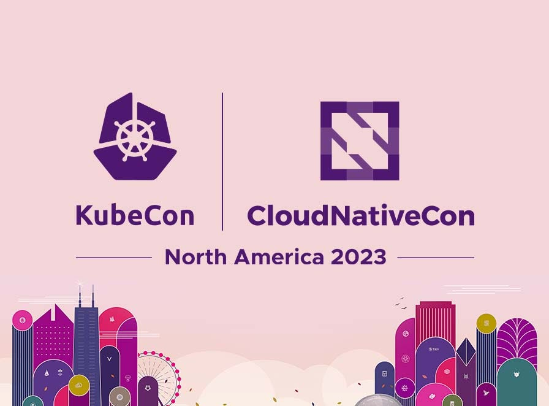

## 微型容器的微型讨论 — Eric Gregory，Mirantis

镜像大小的问题对可持续性、存储和网络效率等方面产生了重要影响。这就是为什么我们将首先讨论的话题是 Eric Gregory 的“微型容器的微型讨论”。这个话题对我个人也很有兴趣，我尝试过使用 Docker Slim 来减小镜像大小（包括集成到 CI/CD 流水线中），结果确实令人印象深刻。然而，我们还看到了更进一步的示例，例如使用 WebAssembly，如下图所示。

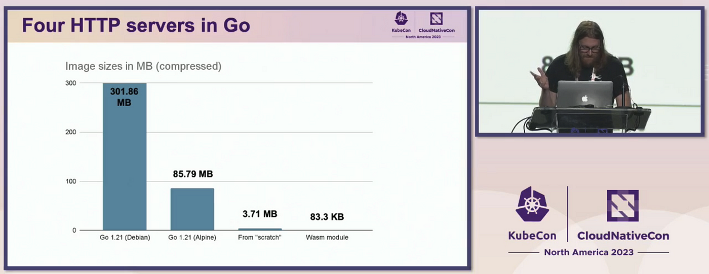

因此，下面的截图显示了一个相当简单的 Go 应用程序的 Dockerfile，以及相同的示例，但基于更轻量的 Alpine Linux 基础镜像。这相当有趣，因为在保存所有功能的情况下，最终镜像大小的差异（85.79 MB vs. 301.86 MB）超过了 3 倍。

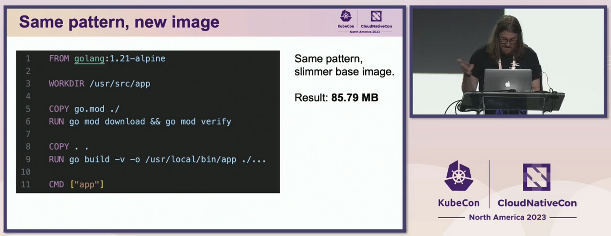

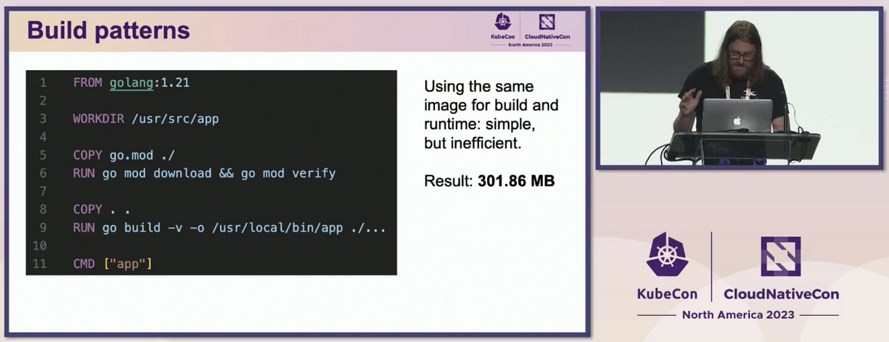

实际上，Dockerfile 中唯一改变的是基础镜像，但大小显著减小。事实上，这是一个良好的实践和应该考虑的事项 — 总是选择最小必要的基础镜像和一套工具。对于单一二进制文件，手头的选择甚至更多。

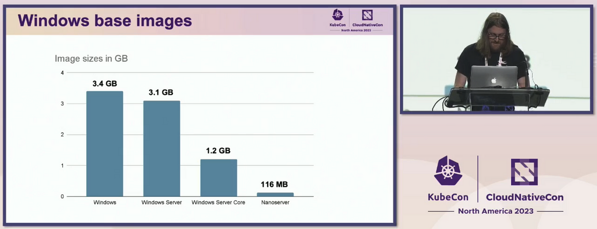

对于基于 Windows 的镜像，你还可以优化大小 — 例如，使用 Windows Nanoserver 基础镜像，其大小为 116 MB，并从中构建容器化软件。一些可能将这一步提升到一个新水平的新方法是在 Kubernetes 上使用 WebAssembly，这需要更多的研究，但将允许更令人印象深刻的镜像优化。

## 由社区支持的 Kubernetes LTS: 确保稳定性和兼容性同时推动创新 — Jeremy Rickard，微软 Azure 首席软件工程师

尽管 KubeCon 在很大程度上致力于云原生平台的创新，但关于与创新紧密相连的稳定性和兼容性的主题并没有被忽视。这是由微软 Azure 首席软件工程师 Jeremy Rickard 告诉我们的。

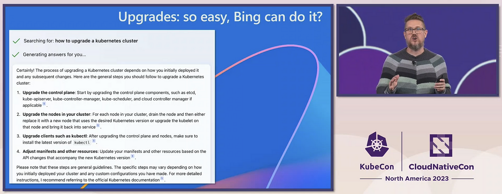

在这个主题中听到有关 AI 的讲解，或者更直接地说是关于 ChatGPT，是相当预料之中的，考虑到微软与 OpenAI 之间的密切联系。我们被展示了“kubectl ai”工具，它允许您根据您的请求轻松生成 YAML，但立即强调 AI 不能做到一切 — 例如，集群升级过程。随后在演示过程中，多次展示了 Bing 回答有关 Kubernetes 的各种问题的能力。

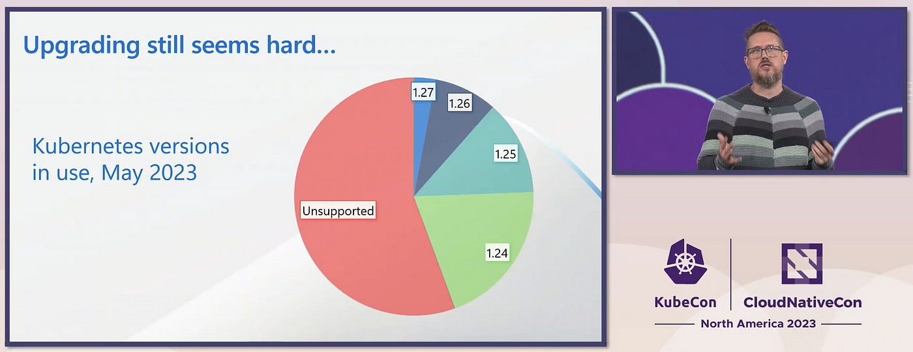

多年来，Kubernetes 的发布频率变得更低，但更稳定 — 是的，现在默认只发布稳定的 API，有关弃用的警告等等。然而，升级过程（通常意味着从一个几乎不再受支持的版本顺序升级到最新版本之一）经常让用户头疼。此外，从 2023 年 5 月的调查数据显示，大多数用户仍在他们的集群中使用已经不再受支持的 Kubernetes 版本，这令人印象深刻。

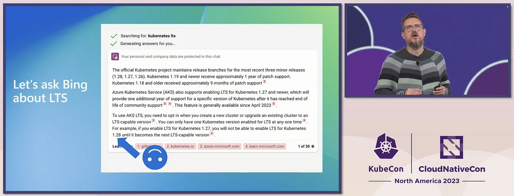

解决方案是相当明显的 — 长期支持 (LTS)，但关于支持应该持续多长时间，选择哪些版本等问题存在很多疑问。微软已经从版本 1.27 开始提供 LTS — 提供两年的支持和安全更新，该 GA 日期是传统一年的两倍。目前，来自最流行的云供应商代表组成的团队正在研究这些问题，以帮助确定 Kubernetes LTS 的共同路径。因此，这将是推广 Kubernetes 并使其成为更稳定且易于维护的平台的又一步。

## 视觉的愿景 — Kubernetes 在其第二个十年的发展 — Tim Hockin，Google 杰出工程师

我们回顾中的下一个主题是由 Google 杰出工程师 Tim Hockin 介绍的 Kubernetes 过去十年的发展路径。基本上，第一个十年已经过去，现在我们准备看看 Kubernetes 作为一个平台在下一个十年可能会发生什么，因为它已经发展了很多，但仍有很多要来。

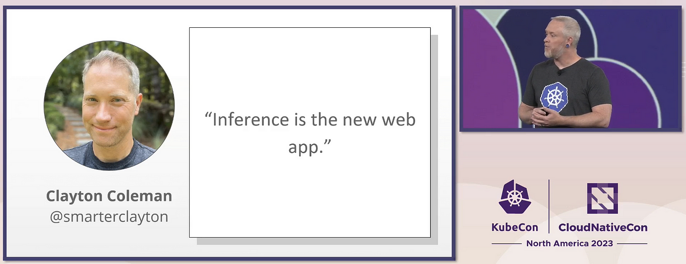

由于AI/ML是“大事物”之一（就像互联网、智能手机、电动汽车、云等的出现一样），计算资源的使用将增加，因此需要从更高效的角度来解决这个问题。是的，推断（基于他人的AI解决方案而不是自己进行训练的AI应用程序）是新的Web应用程序。Kubernetes有可能成为AI/ML应用程序的首选选择，但仍需要进行调查、问题和答案以及进一步的改进。

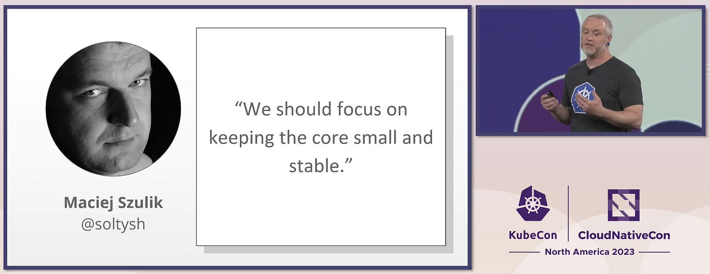

接下来肯定会处理的一个问题是多集群工作负载。目前，这个过程仍然相当复杂，未来的发展将致力于使这个过程变得更无缝和 less 复杂。此外，将专注于减少最终用户的复杂性。很可能，由于受众的扩大，下一代 Kubernetes 用户将更加关注可靠性和安全性，而不是新功能（这与受众需求的 LTS 的动机相呼应）。

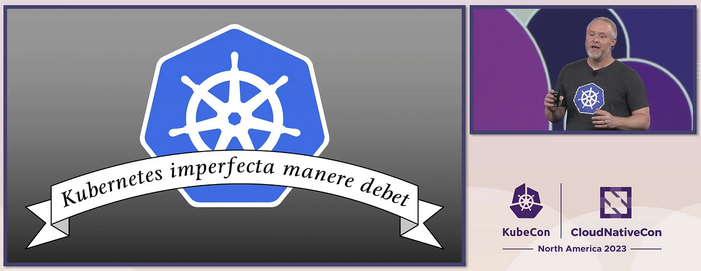

主题演讲的主要思想是，Kubernetes 不应过分关注生态系统的增长和广泛的机会，而应专注于为终端用户优化、提高安全性、稳定性和简易性。

## 减少、重复使用、循环利用 — Nathan Taber，AWS Kubernetes 产品负责人

我们列表中的下一个主题来自 AWS Kubernetes 产品负责人 Nathan Taber。AWS 代表已将过去十年的 Kubernetes 与之前的 CPU 技术流程缩小（晶体管尺寸）相比，以提高能效和性能。效率应该是第一优先级，因为这可以节省时间、资源和金钱。

主要推动因素包括识别成本驱动因素、优化最有效的优化以及使用共享和动态资源。开源已经提供了在这些目标上工作的相当成熟的项目 — 用于在云原生环境中监控资金的 OpenCost，用于节点自动缩放的 Karpenter 等。

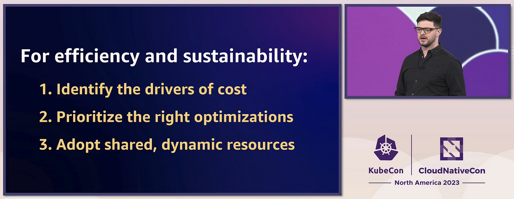

此外，任何平台上使用 Kubernetes 都会影响能源足迹，因为它提供了按需共享的资源，可以轻松进行水平和垂直扩展。尽管代表当然首先提到了 AWS，但他指出我们谈论的是所有遵循这种方法的云平台 — 在这里，选择权在用户手中。

## 用于平台工程的生成式 AI — Jeremy Lewi，Sailplane AI

最后，在我们的列表中仍然在所有头条新闻中保留的是 AI，AI，AI（特别是生成式 AI）。生成式 AI 可以解决的两个潜在目标是平台的创建及其运营，包括自主诊断和问题解决。

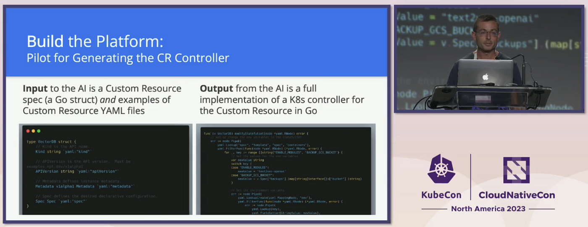

作为在平台工程中使用生成式 AI 的一个例子，我们看到了创建 Custom Resource VectorDB 的过程 — 这是现代 LLMs 的关键组件。将期望的 YAML 提供给 AI 作为输入，输出是用 Go 编写的 Custom Resource 的 Kubernetes 控制器的完整实现。这样，使用生成式 AI，计划消除控制器和 CRD 创建之间的差距，从而加速和简化平台工程的过程。

如果我们谈论在操作平台时，使用生成式 AI 进行故障排除、诊断和问题解决，这个过程涉及使用 LLM 科学调试。这是一个迭代的过程，涉及提供有关问题的输出，执行建议的命令，并提供新信息，循环往复直到问题解决。您可以在上图中看到这个过程的视觉示例。

## 总结

在过去的十年里，Kubernetes 取得了长足的发展，拥有了庞大的用户群体。KubeCon 作为一个聚集来自不同行业的不同人士演讲的大会，充分展示了这一点。想要了解所有演讲和主题演讲，需要花费很多天甚至周来深入了解。因此，我尝试汇总了我最喜欢的内容，希望这些主题演讲的摘要能够让您获得一些有趣的行业见解。 

## 引用

- [微型容器的微型讨论 — Eric Gregory, Mirantis](https://www.accelevents.com/e/kubecon-cloudnativecon-north-america-2023/portal/stage/311604)
- [社区支持的 Kubernetes LTS：确保稳定性和兼容性，同时推动创新 — Jeremy Rickard, 微软 Azure 首席软件工程师](https://www.accelevents.com/e/kubecon-cloudnativecon-north-america-2023/portal/stage/311759)
- [视觉的愿景 — Kubernetes 在其第二个十年的展望 — Tim Hockin, 谷歌杰出工程师](https://www.accelevents.com/e/kubecon-cloudnativecon-north-america-2023/portal/stage/311607)
- [减少、重复利用、回收 — Nathan Taber, 亚马逊 Web Services Kubernetes 产品负责人](https://www.accelevents.com/e/kubecon-cloudnativecon-north-america-2023/portal/stage/311607)
- [用于平台工程的生成式人工智能 — Jeremy Lewi, Sailplane AI](https://www.accelevents.com/e/kubecon-cloudnativecon-north-america-2023/portal/stage/311604)
