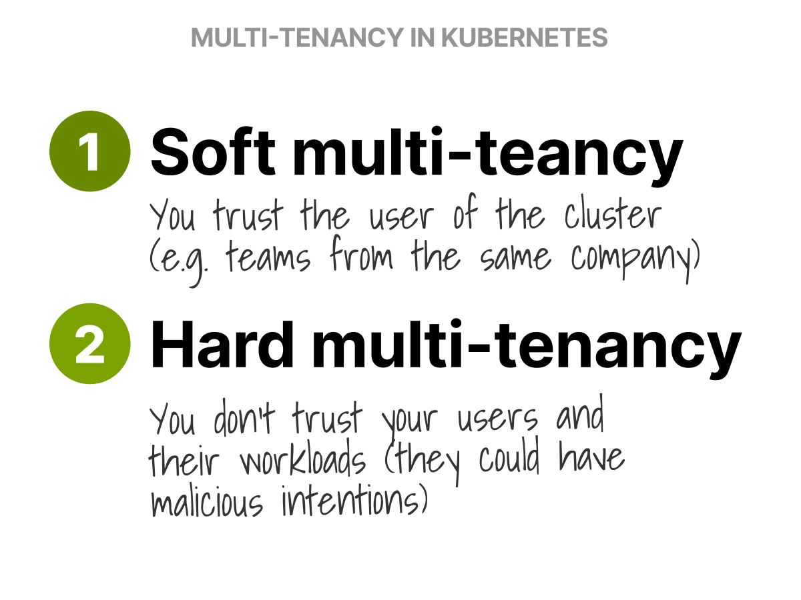
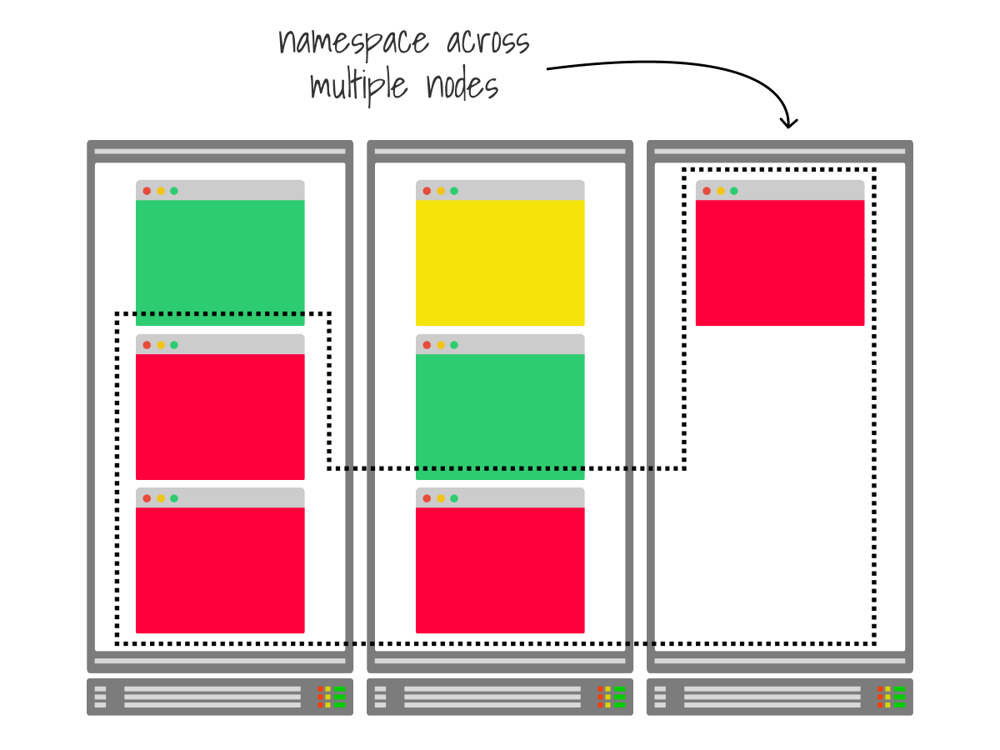
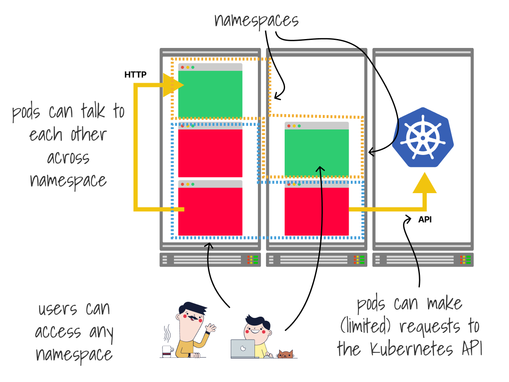
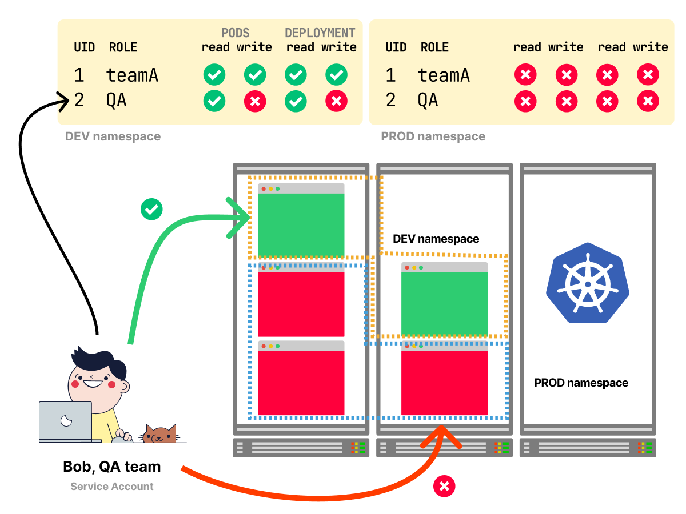
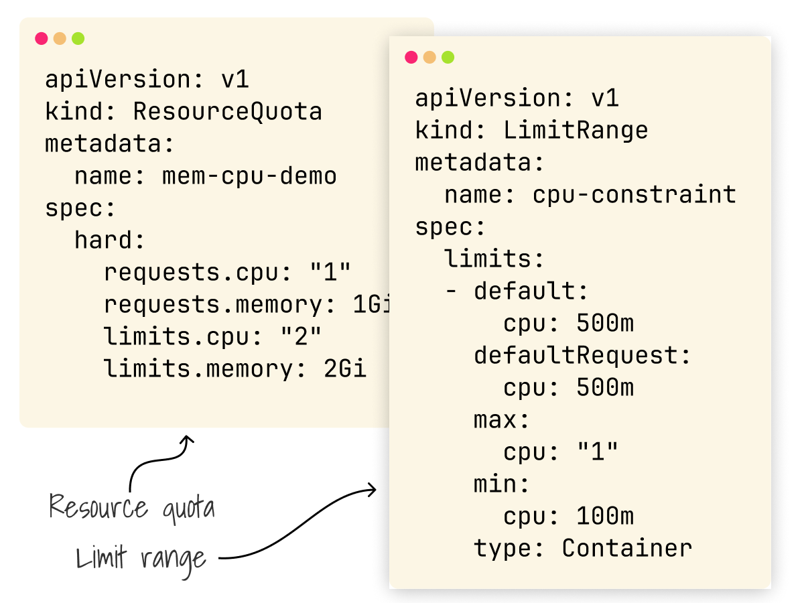
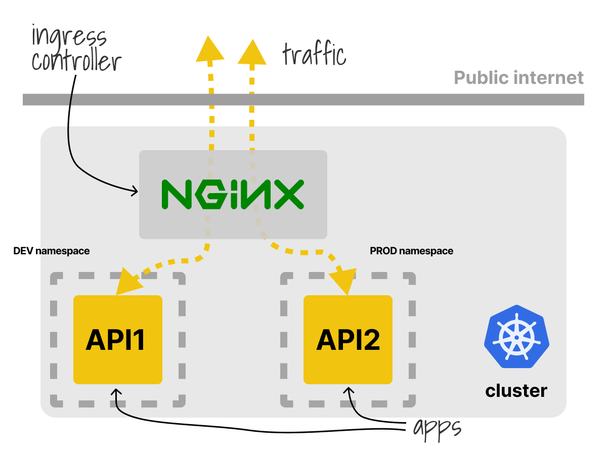
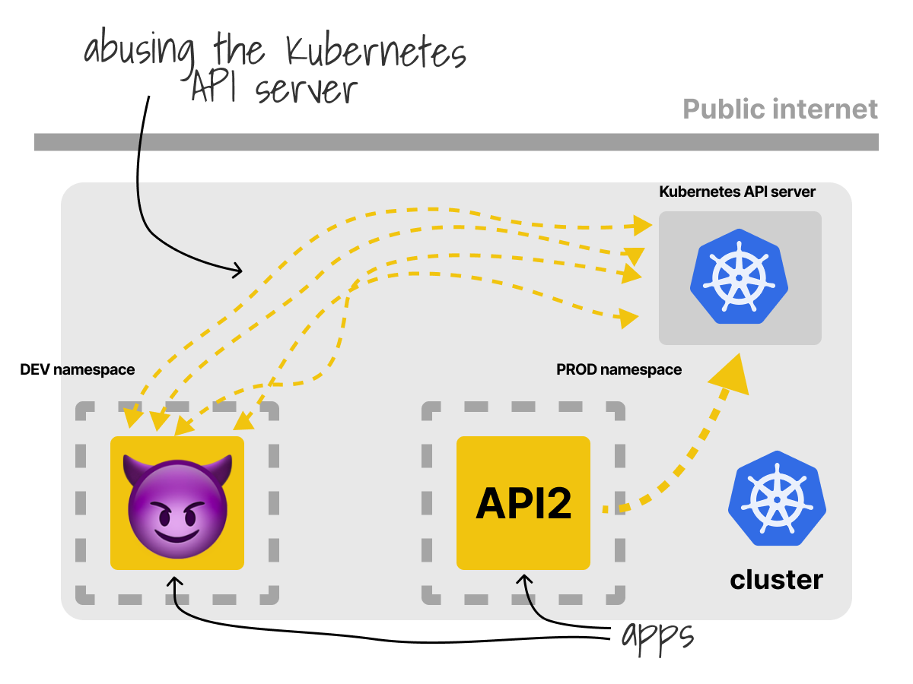
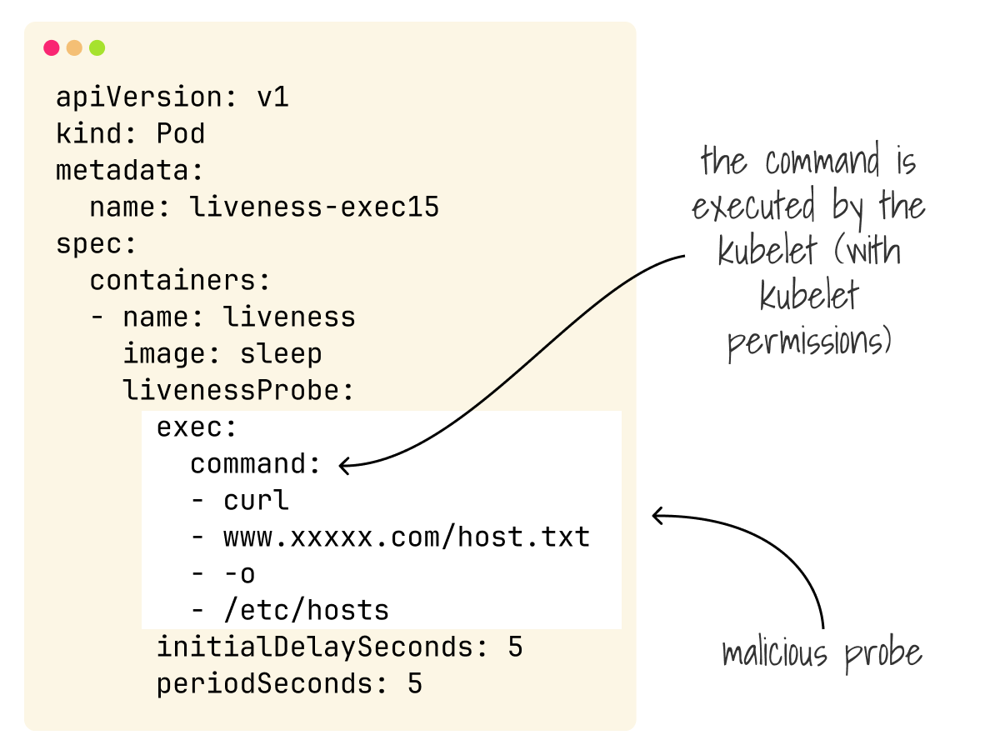
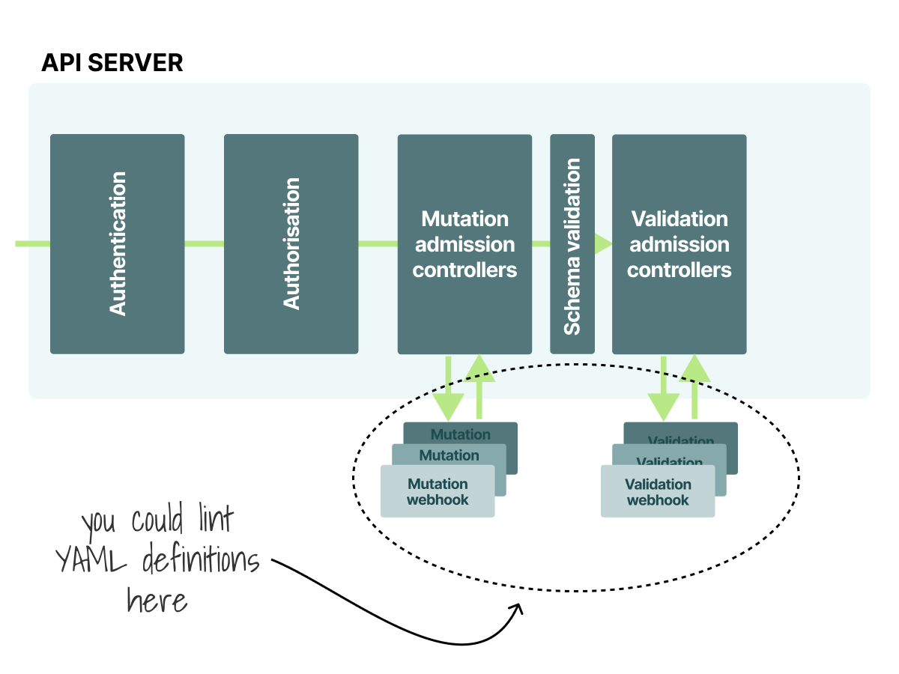
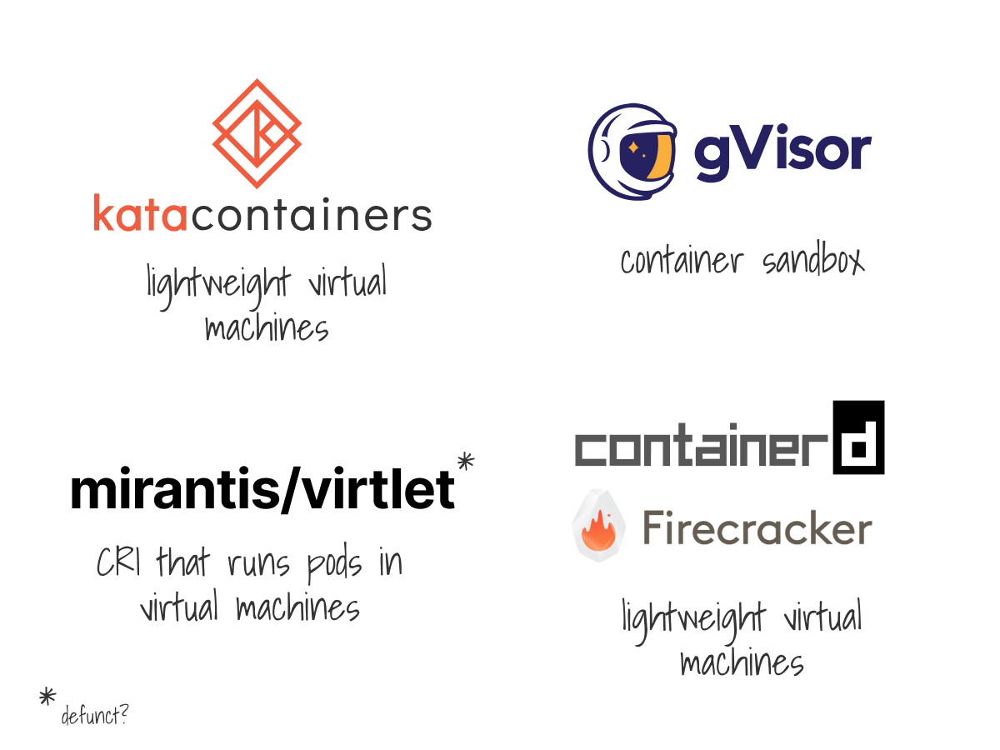

您是否应该让多个团队使用同一个 Kubernetes 集群？

您是否可以安全地运行来自不信任用户的不信任工作负载？

Kubernetes 是否具备多租户功能？

本文将探讨在运行具有多个租户的集群时面临的挑战。

多租户可分为：

1. **软多租户**，适用于信任您的租户 - 比如与同一家公司的团队共享集群时。
2. **硬多租户**，适用于您不信任的租户。

您还可以混合使用！

**在租户之间共享集群的基本构建块是命名空间。**

命名空间在逻辑上对资源进行分组，它们不提供任何安全机制，也不能保证所有资源都部署在同一节点上。

**命名空间中的 Pod 仍然可以与集群中的所有其他 Pod 通信，向 API 发出请求并使用它们想要的任何资源。**

默认情况下，任何用户都可以访问任何命名空间。

那应该怎么阻止它？

[通过 RBAC，您可以限制用户和应用程序对命名空间内和命名空间中的内容所能做的事情。](https://learnk8s.io/rbac-kubernetes)

常见的操作是授予有限用户权限。

[使用 Quotas 和 LimitRanges，您可以限制命名空间中部署的资源以及可以使用的内存、CPU 等。](https://kubernetes.io/docs/concepts/policy/resource-quotas/)

**如果您想限制租户对其命名空间所能做的事情，这是一个绝妙的想法。**

**默认情况下，所有 Pod 都可以与 Kubernetes 中的任何 Pod 通信。**

对于多租户来说这不是很好，但您可以使用 [Network Policies](https://github.com/ahmetb/kubernetes-network-policy-recipes) 来更正。

网络策略类似于防火墙规则，可让您隔离出站和入站流量。

太好了，命名空间现在安全了吗？

不要这么快。

虽然 RBAC、Network Policies、Quotas 等为多租户提供了基本构建块，但这还不够。

**Kubernetes 有几个共享组件。**

一个很好的例子是 Ingress 控制器，通常每个集群部署一个。

**如果您提交了一个具有相同路径的 Ingress 模板，则最后一个会覆盖定义，只有一个会起作用。**

最好的方法是在每个命名空间中部署一个控制器。

另一个有趣的挑战是 CoreDNS。

如果其中一个租户滥用 DNS 怎么办？

整个集群也会受到影响。

您可以使用额外的插件 [https://github.com/coredns/policy](https://github.com/coredns/policy) 限制请求。

同样的挑战也适用于 Kubernetes API 服务器。

**Kubernetes 不知道租户，如果 API 收到太多请求，将对所有人进行限流。**

我不知道是否有解决方法！

假设您成功解决了共享资源的问题，还有 kubelet 和工作负载的挑战。

正如 Philippe Bogaerts 在[这篇文章](https://xxradar.medium.com/exploiting-applications-using-livenessprobes-in-kubernetes-cdff6329d320)中所解释的那样，一个租户可以通过 (滥) 使用活动探针来接管集群中的节点。

修复不是微不足道的。

您可以将代码质量检查器作为 CI/CD 过程的一部分，或使用准入控制器验证提交到集群的资源是否安全。

[这里是 Open Policy Agent 的规则库。](https://github.com/open-policy-agent/gatekeeper-library)

**容器也提供了比虚拟机更弱的隔离机制。**

[Lewis Denham-Parry 在这个视频中展示了如何从容器中逃脱。](https://www.youtube.com/watch?v=JaMJJTb_bEE)

该怎么办？

您可以使用容器沙箱，例如 [gVisor](https://gvisor.dev/)、轻量级虚拟机作为容器 ([Kata containers](https://katacontainers.io/)、[firecracker + containerd](https://github.com/firecracker-microvm/firecracker-containerd)) 或全虚拟机 ([virtlet 作为 CRI](https://github.com/Mirantis/virtlet))。

希望您已经意识到了这个主题的复杂性以及在 Kubernetes 中提供严格的网络、工作负载和控制器之间的分隔边界的难度。

[这就是为什么不建议在 Kubernetes 中提供硬多租户。](https://blog.jessfraz.com/post/hard-multi-tenancy-in-kubernetes/)

如果您需要硬多租户，则建议使用多个集群或 Cluster-as-a-Service 工具。

- [Cluster API](https://github.com/kubernetes-sigs/cluster-api)
- [HyperShift](https://github.com/openshift/hypershift)
- [Kamaji](https://github.com/clastix/kamaji)
- [Gardener](https://gardener.cloud/)

如果您可以容忍较弱的多租户模型，以换取简单和便利，则可以推出您的 RBAC、Quotas 等规则。

但是，有一些工具可以为您抽象出这些问题：

- [Virtual Cluster (wg-multitenancy)](https://github.com/kubernetes-sigs/cluster-api-provider-nested/tree/main/virtualcluster)
- [Vcluster](https://www.vcluster.com/)
- [Capsule](https://github.com/clastix/capsule)
- [Kiosk](https://github.com/loft-sh/kiosk)

最后，如果您喜欢这个主题，您可能还会喜欢：

- Learnk8s 在运行的 Kubernetes 工作坊 [https://learnk8s.io/training](https://learnk8s.io/training)
- 过去的主题集合 [https://twitter.com/danielepolencic/status/1298543151901155330](https://twitter.com/danielepolencic/status/1298543151901155330)
- 我每周发布的 Kubernetes 通讯 [https://learnk8s.io/learn-kubernetes-weekly](https://learnk8s.io/learn-kubernetes-weekly)