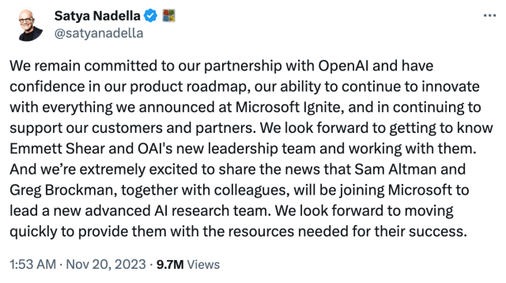

上个周末的 OpenAI“宫斗”大戏相信大家都知晓了，今天正巧看到 Ben Thompson 的这篇总结文章，感觉不错，分享给大家。

关于作者：Ben Thompson（本·汤普森）是一位知名的科技和商业评论家，他是 Stratechery（《战略》）博客的创始人和作者。Stratechery 是一家专注于科技产业和商业策略分析的网站，汤普森在博客中深入剖析科技公司、产品、行业趋势和商业模式。他的文章通常涵盖了互联网、数字媒体、云计算、人工智能等领域的重要话题。

Ben Thompson 因其深刻的洞察力和独特的分析方法而闻名，他的文章常常引发行业内外的广泛讨论。他的分析不仅关注技术本身，还关注技术如何塑造和影响商业和社会。由于其博客的高质量内容，他已经建立了一支忠实的读者群，并成为了科技产业和商业领域的重要声音之一。

---

下文译自：<https://stratechery.com/2023/openais-misalignment-and-microsofts-gain/>

摘要：
这篇文章分析了 OpenAI 的使命与商业模式之间的不一致，以及 Microsoft 如何从中受益。文章认为，OpenAI 的 GPT-3 模型是一种强大的通用人工智能，但是它的许可协议限制了它的应用范围。Microsoft 作为 OpenAI 的合作伙伴和投资者，拥有 GPT-3 的独家许可权，可以将其用于自己的产品和服务，从而获得竞争优势。

正如您所预期的那样，我已经在脑海中和页面上撰写了几个版本的这篇文章，因为[我职业生涯中最不同寻常的周末](https://twitter.com/benthompson/status/1726514608234746003)已经开始。简要总结如下：

- 周五，时任 CEO Sam Altman 被 OpenAI 的董事会解雇；接着，OpenAI 总裁 Greg Brockman 被免去董事会职务，并随后辞职。
- 周末期间，有传闻称 Altman 正在谈判回归，然后 OpenAI 聘请了前 Twitch CEO Emmett Shear 担任 CEO。
- 最后，在周日深夜，[Satya Nadella 通过推文宣布](https://twitter.com/satyanadella/status/1726509045803336122)，Altman 和 Brockman 以及他们的“同事”将加入 Microsoft。

很显然，对于 Microsoft 来说，这是一个非凡的成果。该公司已经获得了[所有 OpenAI 知识产权的永久许可证](https://www.wsj.com/articles/microsoft-and-openai-forge-awkward-partnership-as-techs-new-power-couple-3092de51)（[除通用人工智能之外](https://openai.com/our-structure#:~:text=the%20board%20determines%20when%20we%27ve%20attained%20AGI.%20Again%2C%20by%20AGI%20we%20mean%20a%20highly%20autonomous%20system%20that%20outperforms%20humans%20at%20most%20economically%20valuable%20work.%20Such%20a%20system%20is%20excluded%20from%20IP%20licenses%20and%20other%20commercial%20terms%20with%20Microsoft%2C%20which%20only%20apply%20to%20pre%2DAGI%20technology.))，包括源代码和模型权重；问题是，如果 OpenAI 遭受了人才流失的威胁，Altman 和 Brockman 被解雇，它是否有足够的才能来利用那些知识产权。实际上，他们将拥有足够多的人才，似乎很有可能流向 Microsoft；你可以这样说，Microsoft 刚刚以零风险和零成本收购了 OpenAI。

注：微软与 OpenAI 的最初协议还禁止微软基于 OpenAI 技术单独开发通用人工智能（AGI）；据我了解，这一条款已在最近的协议中被删除

与此同时，对于 OpenAI 来说，这是一个损失，因为它在金钱和计算资源上依赖于总部位于雷德蒙德的 Microsoft 公司：OpenAI 员工在人工智能方面的工作要么因为永久许可证属于 Microsoft，要么因为员工加入了 Altman 的团队而成为 Microsoft 的直接财产。OpenAI 的王牌是 ChatGPT，它正在朝着技术的至高境界迈进——一个大规模的消费者平台——但是如果周末的报道可信，OpenAI 的董事会可能已经对 ChapGPT 给公司带来的激励产生了疑虑（后文详述）。

然而，最大的损失是一个必然的损失：即除了盈利公司，任何其他组织形式都不是正确的公司组织方式。

## OpenAI 的非营利模式

OpenAI 成立于 2015 年，是一家被称为“非营利智能研究公司”的组织。从他们的[最初博客文章](https://openai.com/blog/introducing-openai)中可以得知：

> OpenAI 是一家非营利人工智能研究公司。我们的目标是以最有可能造福整个人类的方式推进数字智能，不受需要产生财务回报的限制。由于我们的研究不受财务义务的制约，我们可以更好地专注于对人类产生积极影响。我们认为人工智能应该是个体人类意愿的延伸，在自由的精神中尽可能广泛和均匀地分布。这个冒险的结果是不确定的，工作是困难的，但我们认为目标和结构是正确的。我们希望这对领域最优秀的人来说是最重要的。

对于 OpenAI 的创始人，特别是 Altman 和 Elon Musk 的动机，我曾经有过相当怀疑；我在一篇[每日更新](https://stratechery.com/2015/openai-artificial-intelligence-and-data-data-and-recruiting/)中写到：

> Elon Musk 和 Sam Altman 分别领导着特斯拉和 YCombinator 等组织，这些组织看起来很像我刚刚描述的那两个受到 Google 和 Facebook 数据优势威胁的公司的例子，他们与 OpenAI 做到了这一点，还有使整个事情成为非营利性组织的额外动机；我说“动机”是因为成为非营利性组织几乎肯定更多地与我在开头强调的那句话有关：“我们希望这对领域中最优秀的人来说最重要。”换句话说，OpenAI 也许没有最好的数据，但至少它有一个可能帮助理想主义研究人员晚上睡得更香的使命结构。OpenAI 可能有助于平衡特斯拉和 YCombinator 的竞争局势，我猜我们应该相信这是一个愉快的巧合。

无论 Altman 和 Musk 的动机如何，将 OpenAI 建立为非营利性组织的决定并不仅仅是口头上的；该公司是一个 501(c)(3) 组织；您可以在[这里](https://projects.propublica.org/nonprofits/organizations/810861541)查看他们的年度 IRS 申报。Form 990 上的第一个问题要求组织“简要描述组织的使命或最重要的活动”；[2016 年的第一份申报](https://projects.propublica.org/nonprofits/organizations/810861541/201703459349300445/full)中写道：

> OpenAI 的目标是以最有可能使整个人类受益的方式推进数字智能，不受产生财务回报的需求限制。我们认为人工智能技术将有助于塑造 21 世纪，我们希望帮助世界构建安全的人工智能技术，并确保人工智能的利益尽可能广泛均衡地分布。我们试图作为更大社区的一部分构建人工智能，并希望在此过程中公开分享我们的计划和能力。

两年后，“公开分享我们的计划和能力”的承诺消失了；三年后，“推进数字智能”的目标被替换为“构建通用人工智能”。

2018 年，根据今年早些时候的一份 Semafor 报告，马斯克试图接管该公司，但被拒绝了；他离开了董事会，并且更为关键的是，停止了对 OpenAI 的运营支持。这导致了第二个关键背景信息：面对需要支付大量计算资源的需求，现在坚决掌控 OpenAI 的 Altman 创建了 OpenAI Global, LLC，这是一家有上限的营利性公司，微软是少数股东。这是 OpenAI 当前结构的图像来自[他们的网站](https://openai.com/our-structure)：

OpenAI Global 可以筹集资金，而且对于其投资者来说至关重要的是，它可以盈利，但它仍然在非营利性组织和其使命的监督下运营；OpenAI Global 的经营协议规定：

> 该公司的存在是为了推进 OpenAI, Inc.确保开发安全的人工通用智能并使其造福全人类的使命。该公司对这一使命以及 OpenAI, Inc.宪章中提出的原则的责任优先于产生利润的任何义务。该公司可能永远不会盈利，也没有义务这样做。该公司可以自由重新投资公司的全部或部分现金流于研究和开发活动和/或相关费用，而无需向成员承担任何义务。

### ChatGPT 族群

第三个关键背景信息是最为人熟知的，也推动了这些雄心壮志达到了新的高度：ChatGPT 在 2022 年 11 月底发布，震撼了整个世界。如今，ChatGPT 拥有超过 1 亿的每周用户和超过 10 亿美元的收入；它还从根本上改变了几乎每个大公司和政府关于人工智能的讨论。

但对我来说，最引人注目的是我上面提到的可能性，即 ChatGPT 成为一个新的重要消费者科技公司的基础，这是最有价值和最难建立的公司类型。我在今年早些时候在[《偶然的消费者科技公司》](https://stratechery.com/2023/the-accidental-consumer-tech-company-chatgpt-meta-and-product-market-fit-aggregation-and-apis/)中写道：

> 在涉及有意义的消费者科技公司时，实际上产品是最重要的。消费者产品的关键在于高效的客户获取，这意味着口碑和/或网络效应；ChatGPT 实际上没有后者（是的，它会收到反馈），但它拥有大量的前者。事实上，ChatGPT 的出现最让我想到的产品是谷歌：它简直比市场上任何其他产品都要好，这意味着它来自一对大学生并不重要（起源故事有些相似！）。此外，就像谷歌一样，与扎克伯格对硬件的痴迷相反，ChatGPT 非常出色，人们会想方设法使用它。甚至没有一个应用程序！然而，仅仅四个月过去，已经有一个平台了。

我所指的平台是[ChatGPT 插件](https://stratechery.com/2023/chatgpt-learns-computing/)；这是一个令人着迷的概念，其用户界面不太完善，而在八个月后的[OpenAI 首个开发者日](https://stratechery.com/2023/the-openai-keynote/)上，公司宣布了 GPTs，这是他们试图成为一个平台的第二次尝试。与此同时，据报道，Altman 正在探索 OpenAI 监管范围之外的新公司，以构建芯片和硬件，显然没有向董事会报备。这些因素的某种组合，或者可能尚未报道的其他因素，是董事会的最后一根稻草，由首席科学家 Ilya Sutskever 领导，他们在周末罢免了 Altman。[The Atlantic 报道](https://www.theatlantic.com/technology/archive/2023/11/sam-altman-open-ai-chatgpt-chaos/676050/)：

> Altman 在上周五被 OpenAI 董事会解雇，这是公司两派意识形态的权力斗争的顶点，一派来自硅谷的技术乐观主义，充满了快速商业化的活力；另一方则深受人工智能代表对人类构成存在威胁的担忧，认为必须极度谨慎地控制。多年来，这两派成功地共存，虽然也出现了一些波折。
>
> 根据现任和前员工的说法，几乎一年前的今天，正是 ChatGPT 的发布导致了 OpenAI 陷入全球关注的关键时刻。从外部看，ChatGPT 看起来像有史以来最成功的产品推出之一。它比历史上任何其他消费者应用程序都增长得更快，似乎单凭一己之力重新定义了数百万人对自动化的威胁和机遇的理解。但它使 OpenAI 朝着截然相反的方向发展，加剧了已经存在的意识形态分歧。ChatGPT 为盈利而创造产品的竞争加速了，同时给公司的基础设施和专注于评估和减轻技术风险的员工带来了前所未有的压力。这加剧了 OpenAI 派系之间已经紧张的关系，Altman 在 2019 年的员工电子邮件中称之为“族群”。

Altman 的“族群”——将 OpenAI 变得更像传统科技公司的一方——对于科技界的人们，包括我自己，肯定更加熟悉。我甚至在我的文章中关于开发者日演讲的段落中谈到了 OpenAI 的过渡，但不幸的是，我编辑掉了。以下是我写的内容：

> 大约在这个时候，我再次开始哀叹[OpenAI 奇怪的公司结构](https://stratechery.com/2022/dall-e-open-to-all-openai-and-openness-openai-opportunities-and-threats/)。作为长期关注硅谷的观察者，看到 OpenAI 追随传统的创业公司道路是令人愉快的：公司显然处于迅速扩张阶段，产品经理突然被认为是有用的，因为他们处于找到并交付低悬果实的甜蜜点，而这对于一个尚未拥有时间或壕沟来容忍王国建设和功能蔓延的实体来说是有益的。
>
> 让我犹豫不决的是，目标不是上市，然后退休到游艇上，并向那些在消除极度富有的内疚感方面做得更好的事业提供资金。赚钱并回应股东的要求会控制更多救世主的冲动；当我听说 Altman 不拥有 OpenAI 的任何股权时，这使我更加紧张而不是宽慰。或者也许是因为我不会有 S-1 或 10-K 要分析。

### 微软与董事会的对立

在整个周末，科技界 Twitter 上的讨论大部分集中在董事会为何会烧掉如此多的价值上感到震惊。首先，Altman 是硅谷最有关联的高管之一，是一位多产的筹款人和交易谈判者；其次，一些 OpenAI 员工已经辞职，预计未来几天会有更多人辞职。OpenAI 以前可能有两个派系；可以合理地假设未来只会有一个，由新任 CEO Shear 领导，他将人工智能末日的概率定为[5% 至 50% 之间](https://twitter.com/rowancheung/status/1726473420299534491)，并提倡[大幅减缓发展](https://twitter.com/eshear/status/1703178063306203397)。

然而，事实上是这样的：无论您是否同意 Sutskever/Shear 派的观点，董事会的宪章和责任不是为了赚钱。这不是一家受益人公司，其对股东具有信托责任；事实上，正如我上面所述，OpenAI 的宪章明确规定了它是“无需生成财务回报”。从这个角度来看，董事会实际上正在履行其职责，尽管这似乎有些违反直觉：在董事会认为 Altman 及其派别并没有“构建造福于人类的通用人工智能”的情况下，他们有权解雇他；他们这么做了。

这涉及到了我对该公司非营利性地位的担忧的讽刺之处：我曾担心 Altman 没有受到赚钱的需要的限制，或者担心由某人负责，而他没有对结果有财务利益，而事实上正是这些因素让他失去了工作。更广泛地说，我的批评不够全面，因为在商业分析的案例中，对无约束权力的哲学关切相形见绌——至少在 OpenAI 成为与之进行交易的根本不稳定的实体方面如此。当然，这涉及到了微软，作为一直支持 Satya Nadella 领导的人，我不得不承认我对公司与 OpenAI 合作的分析存在不足之处。

微软已经押注了其未来的大部分，这超越了金钱，微软拥有大量的金钱，其中很多尚未支付（或以 Azure 积分形式授予）；OpenAI 的技术已经内建到了微软的许多产品中，从 Windows 到 Office，甚至有些大多数人从未听说过的产品（我看到了你，Dynamics CRM 迷！）。微软还在为 OpenAI 量身定制的基础设施上进行大规模投资，纳德拉一直在宣传专业化的财务优势，而且刚刚发布了一款专门用于运行 OpenAI 模型的定制芯片。现在看来，微软将大量的承诺交给了一个非追求利润的实体，因此不受微软作为投资者和收入驱动因素的约束，这似乎是荒谬的。

或者说，直到纳德拉在太平洋时间晚上 11:53 发推文如下：

对我刚才提出的关于微软错误决定与非营利组织合作的论点的反驳是关于人工智能开发的现实，特别是对大量计算资源的需求。正是对这种计算资源的需求导致 OpenAI，其自身禁止进行传统的风险投资交易，向微软交出了知识产权。换句话说，尽管董事会可能拥有非营利公司的宪章，以及一种令人钦佩的愿意行动并坚守信念，但他们最终没有筹码，因为他们不是一家拥有资本以真正独立的公司。最终的结果是，一个以安全开发人工智能为宗旨的实体基本上已经将其所有工作，以及可能很快的时间内的一大部分人才，移交给了地球上最大的盈利实体之一。或者用与人工智能相关的框架来说，OpenAI 的结构最终与实现其所述使命不符。试图通过命令组织激励措施根本无法考虑在动态情况下可能发挥作用的所有可能情况和变量；出于良好的原因，收获自身利益一直是对齐个人和公司的最佳方式。

### 关于 Altman 的疑问

董事会的行动还有一个角度值得承认：这很可能是有正当理由的。我支持[Eric Newcomer 在他的同名 Substack 上发表的深思熟虑的专栏文章](https://www.newcomer.co/p/give-openais-board-some-time-the)：

> 在其[声明](https://openai.com/blog/openai-announces-leadership-transition)中，董事会表示他们得出了结论，认为 Altman“在与董事会的沟通中没有始终坦诚”。我们不应该因为糟糕的公开信息传递让我们忽视一个事实，那就是 Altman 失去了董事会的信任，而董事会本应该证明 OpenAI 的诚信......
>
> 据我了解，一些董事会成员真诚地认为 Altman 在与他们的沟通中不诚实，不可靠，消息来源告诉我。董事会的一些成员认为他们无法监督公司，因为他们无法相信 Altman 所说的话。然而，非营利董事会的存在是 OpenAI 的[信誉](https://x.com/martin_casado/status/1723112508234539270?s=20)的一个关键理由。

Newcomer 指出了我上面提到的董事会的宪章，Anthropic 的创始人觉得有必要首先离开 OpenAI，Musk 对 Altman 的敌意，以及 Altman 在离开 YCombinator 时仍然[有些模糊和未解释清楚的离职](https://www.newcomer.co/p/odds-and-ends?nthPub=1251)。Newcomer 总结道：

> 我相信写这封警示信不会让我在硅谷的许多角落受欢迎。但我认为我们应该放慢脚步，获取更多的事实。如果 OpenAI 将我们引向人工通用智能或接近的领域，我们将希望花更多的时间来思考我们想要由谁引领我们去那里......
>
> Altman 拥有很大的权力，以及非营利组织的外衣，以及超过他更混杂的私人声誉的公开形象。他失去了董事会的信任。我们应该认真对待这一点。

也许我因为上面提到的对微软分析的疏忽而感到有些谦卑，更不用说对周末深夜的命运逆转感到震惊了，但我要指出，[我已经明确了立场](https://stratechery.com/2023/attenuating-innovation-ai/)，反对 AI 末日论者和呼吁监管的呼声；为此，我对确认本周末事件背后驱动力的假设性叙述感到警惕。并且，我要指出，我仍然担心那些试图在没有自己切身利益的情况下控制令人难以置信的能力的高管的哲学问题。

为此，像 Altman 这样的初创生态系统固定成员加入微软当然令人惊讶：微软是唯一保留对 OpenAI 知识产权的地方，可以将其与有效无限的资金和 GPU 访问相结合，这无疑增加了权力控制人工智能是 Altman 主要动机的叙述的可信度。

### 改变后的格局

显然，Altman 和 Microsoft 掌握了人工智能的主导权。微软拥有知识产权，并很快将拥有足够的团队，可以将其与资金和基础设施相结合，同时摆脱了他们与 OpenAI 之前合作中固有的协调问题（当然，他们仍然是 OpenAI 的合作伙伴！）。

我也辩论了一段时间，外部公司建立在 Azure 的 API 上比建立在 OpenAI 的 API 上更有意义；微软天生就是一个开发平台，而 OpenAI 虽然有趣和令人兴奋，但很可能会克隆您的功能或淘汰旧的 API。现在，选择更加明显了。从微软的角度来看，这消除了企业客户避免使用 Azure 的主要原因之一，因为他们依赖 OpenAI；微软现在拥有完整的技术栈。

与此同时，谷歌可能需要进行一些重大变革；公司的最新模型 Gemini 已经延迟推出，其云业务因支出转向人工智能而放缓，这正是公司所希望的完全相反的结果。公司的创始人和股东还能容忍公司进展太慢的看法多久，特别是与微软展示的灵活性和愿意承担风险的态度相比？

这留给了 Anthropic，12 小时前看起来像是大赢家，现在作为一个独立实体感觉越来越脆弱。该公司已经与谷歌和亚马逊达成了合作协议，但现在面临着一个竞争对手微软，其拥有实际上无限的资金和 GPU 访问权限；很难摆脱这样一种感觉，即将其作为 AWS 的一部分是有道理的（是的，B 公司可以被收购，比非营利组织更容易）。

然而，最终，可以提出这样的论点，即实际上并没有发生太大变化：很长一段时间以来，已经明显[AI 至少在短期和中期内](https://stratechery.com/2023/ai-and-the-big-five/)是一种持续的创新，而不是一种颠覆性的创新，也就是说，它主要会使最大的公司受益并部署。成本如此之高，以至于其他人很难获得资金，甚至在考虑渠道和客户获取问题之前。如果有一家公司有望加入 Big Five 的行列，那就是 OpenAI，多亏了 ChatGPT，但现在似乎不太可能了（但不是不可能）。最终，这是纳德拉的洞察力：如果您很大，赢得胜利的关键不是像初创公司那样发明，而是利用自己的规模来收购或快速跟随它们；如果您可以以 0 美元的低价格做到这一点，那就更好了。
