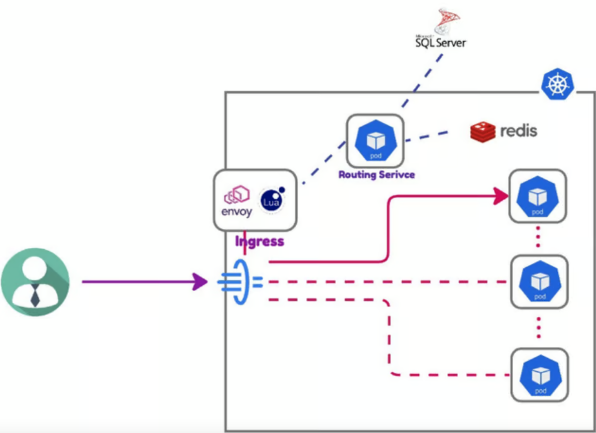
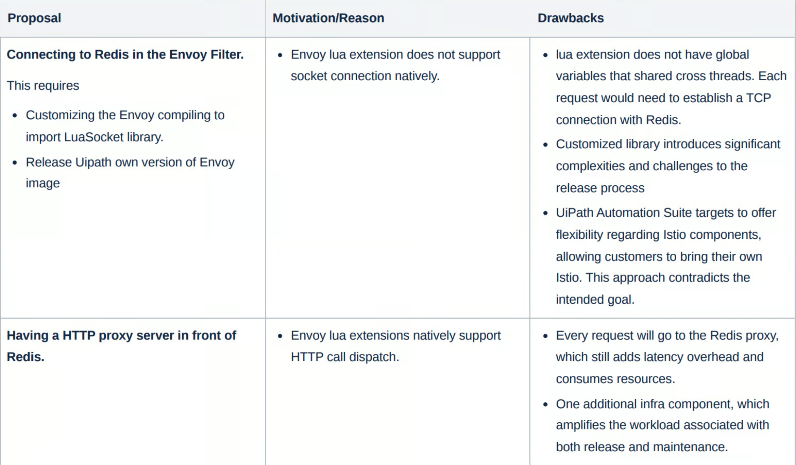
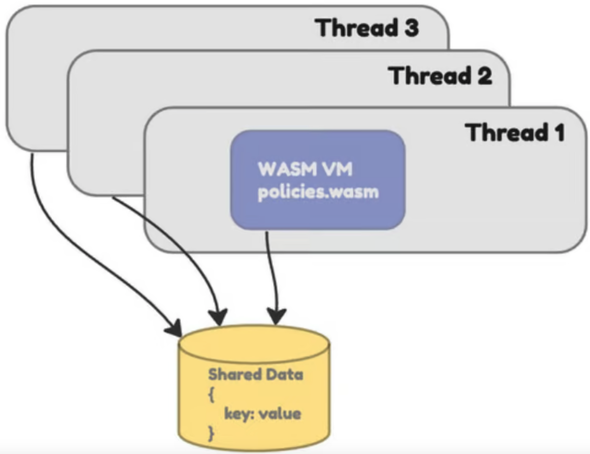
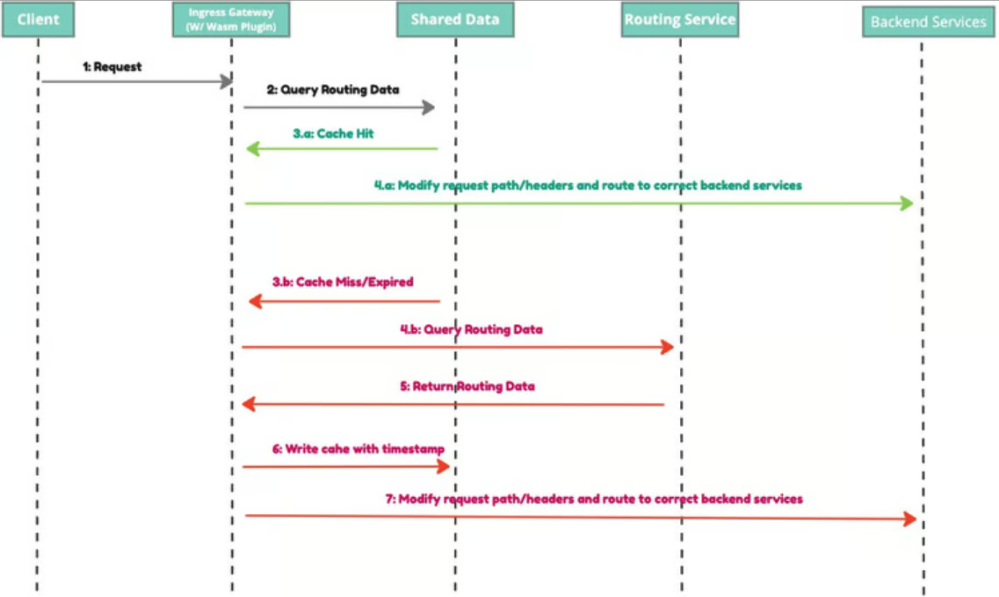

本文译自：<https://www.uipath.com/inside-the-rocketship/tech-stories/optimizing-traffic-routing-uipath-automation-suite-envoy-wasm>

*在这篇博文中，我们将深入探讨 UiPath Automation Suite 的路由基础设施，揭示关键见解和创新方法以提升性能。*

### **UiPath Automation Suite 内部的流量路由**

[UiPath Automation Suite](https://www.uipath.com/product/automation-suite)使您能够在 Linux 上部署完整的[UiPath Business Automation Platform](https://www.uipath.com/product)，该平台由 40 多个微服务组成的 Kubernetes 集群。它有一个 API 网关位于所有微服务之前，具有自定义的路由业务逻辑，例如服务发现、请求拦截、请求操作和错误处理等。

我们使用 Istio 和 Envoy 这个流行的组合作为路由基础设施，路由业务逻辑通过 Envoy 过滤器内的 Lua 脚本实现。除了以下几个痛点外，此解决方案运作良好：

1. **无法直接连接 Redis：** 我们的路由层大量使用 Redis 来缓存完成请求路由所需的业务数据，例如服务元数据和租户到后端的映射等。然而，Envoy 过滤器不支持直接连接到 Redis。为了解决这个问题，我们让路由层通过一个后端服务（上图中的 Routing Service）来检索所需的数据，该服务与 Redis 连接。问题在于在负载下，后端（[在.Net](http://xn--3ds.net/) Core 中）会消耗不必要的资源，并增加不必要的延迟开销。
2. **难以扩展、测试和维护：** 使用 YAML 文件内的 Lua 脚本存在扩展、维护和测试方面的挑战。

### **目标**

我们的主要目标是最小化完整路由层的资源消耗，从而提升性能并增加可扩展性。

### **解决方案**

团队已经评估了各种解决方案。然而，每个解决方案都存在明显的缺点，因此我们决定不继续追求这些选项。

最终，我们构想了在 Envoy 中使用 WebAssembly（WASM）扩展的概念，利用其共享数据功能来实现内存缓存策略。WASM 的优势在于使我们能够灵活选择编程语言，这有助于开发和测试，并保持类似于 Lua 的性能特征。更重要的是，WASM 在 Envoy 中的使用（[proxy-wasm](https://github.com/proxy-wasm)）引入了可供每个 HTTP 流访问的共享数据（键值存储）。这种能力对于内存缓存策略至关重要，可以显著减少后端路由服务的 CPU 使用率。

### **实施细节**

路由层内部没有进行重大的架构修改。转变主要涉及用 WASM 插件替换基于 Lua 的 Envoy 过滤器。考虑到缓存路由数据的特性，我们认识到这些数据很少发生更改，过时的数据不会对客户的主要工作流程产生重大影响。因此，我们选择使用基于时间的（TTL）过期来简化缓存失效策略。

WASM 插件首先从内存缓存中查询路由数据。如果发生缓存命中，则插件会相应地修改原始请求的路径和标头，以将其路由到后端服务。如果发生缓存未命中，则它会从路由服务中查询路由数据，将路由数据加载到缓存中，并最终修改原始请求进行路由。

### **结果**

通过与 proxy-WASM 社区的合作努力，我们已成功解决了 TinyGo 的垃圾回收引起的内存泄漏问题。这些改进已经纳入最新发布版中。

### **资源利用率改善**

以下是涵盖 100K [UiPath 机器人](https://www.uipath.com/product/robots)的环境中的资源利用率数据。

在路由服务中，CPU 使用率明显下降，Istio 入口网关控制器的 CPU 使用率略微降低。这种权衡伴随着 Istio 入口网关控制器内存消耗的增加。然而，这种上升是可以预料的，并且在考虑 CPU 资源的情况下仍然具有成本效益。

### **可测试性改进**

以前，我们的测试覆盖范围仅限于 Lua 中的辅助函数，因为在 Envoy 过滤器的 YAML 中测试 Lua 脚本是不可行的。然而，由于[proxy-wasm-go-sdk](https://github.com/tetratelabs/proxy-wasm-go-sdk)提供的[proxytest](https://github.com/tetratelabs/proxy-wasm-go-sdk/tree/main/proxywasm/proxytest)框架，我们现在可以利用 Envoy 主机模拟器实现全面的单元测试覆盖。

### **延迟**

在进行性能测试后，我们观察到每个请求的延迟保持一致且不变。

### **下一步计划**

展望未来，我们的目标是通过使用 WASM 在[UiPath Automation Suite](https://www.uipath.com/product/automation-suite)和[UiPath Automation Cloud](https://www.uipath.com/product/automation-cloud)之间建立统一的路由层。这种战略方法旨在提升性能，并通过消除维护两套独立解决方案和代码的需求，减轻工程师的负担。此外，我们打算实施主动的缓存失效机制，以解决特定边缘情况中的脏数据挑战。这种主动的方法旨在提升用户体验并提供更流畅的交互。
