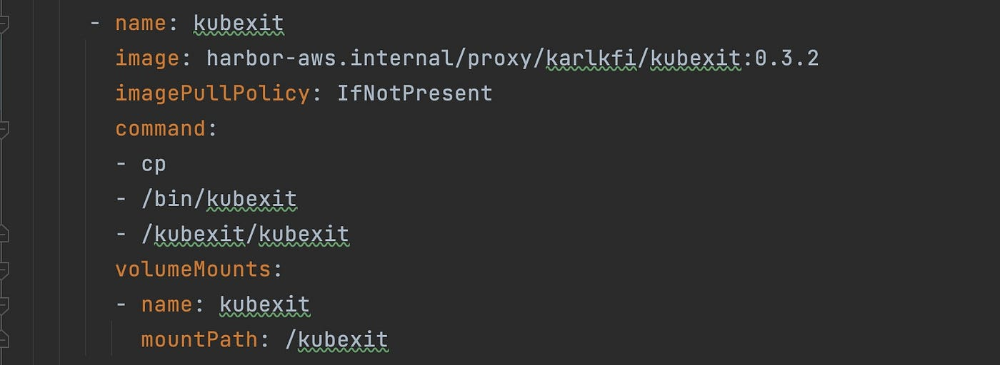
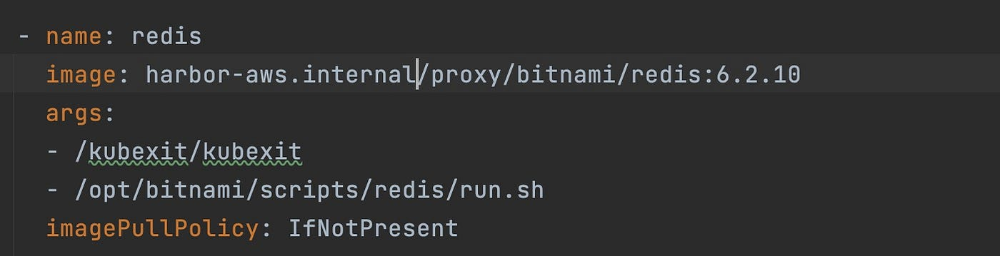
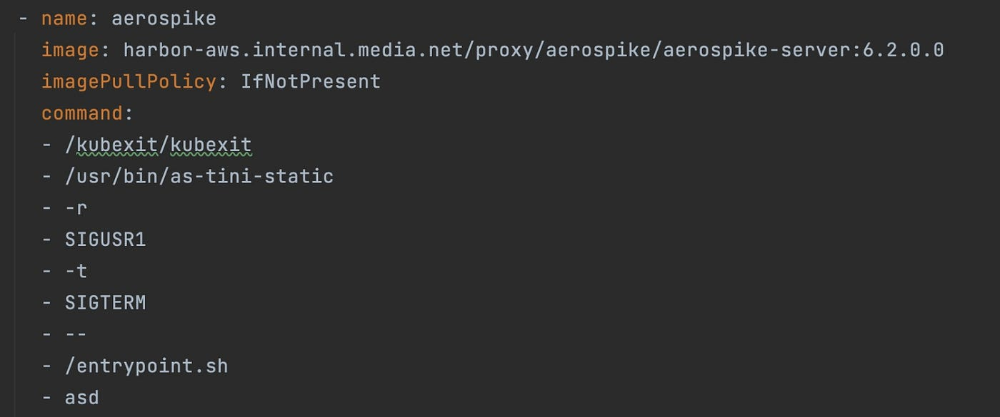

本文译自：<https://medium.com/@aditya.barik32/ordering-of-container-within-pod-a423d2e5ba52>

摘要：讨论了在 Kubernetes Pod 中排序容器的需求，介绍了开源工具 Kubexit 实现容器的有序启动和终止，提高工作流灵活性。

---

## 为什么要在 Pod 中对容器进行排序？

在某些情况下，Pod 的排序可能是一个使用案例，我们需要确保某些容器在启动应用程序代码之前已经正常运行。假设我们有一个 Java 应用程序，需要一个数据库（Mysql）、缓存（Aerospike/Redis）和 Kafka 来提供流量。与此同时，我们还需要这些依赖关系是特定于实例或与应用程序堆栈本地关联的。在这种情况下，在 v1.28 版本之前，Kubernetes 没有提供一个开箱即用的解决方案。对于版本小于 1.28 的集群，没有正式的解决方法。为了缓解这个问题，我们有另一种不太知名的开源解决方法，叫做 Kubexit。

## 什么是 Kubexit？

Kubexit 是一个开源项目，旨在提供一种协调的方式来启动和终止 Pod 内的容器。

无法在这里使用*InitContainer*，因为在 initContainers 中声明的容器需要在通常容器（在*Container*部分声明的容器）开始之前完成（容器状态应为完成）。例如，如果在*initContainer*部分声明一个 MySQL 容器，那么 Pod 将卡在 Pod 初始化状态，因为在*Container*部分声明的其他容器将永远等待 initContainers 完成。

Kubexit 是一个二进制文件，我们需要在*deployment.yaml*的*initContainer*部分声明它，以用于内部容器排序。为了使 Kubexit 按预期工作，我们需要了解它是如何做到的。

Kubexit 允许您声明两种类型的依赖关系：

1. *Birth Dependency*：这种依赖关系允许您声明容器的出生顺序。
2. *Death Dependency*：这种依赖关系允许您声明容器的死亡顺序。

## 如何将 Kubexit 与 Deployment 集成？

为了在 Pod 内使用 Kubexit，我们需要配置一些东西。

- 在*initContainer*中声明 kubexit，以便它将二进制文件下载到 Pod 中。 */kubexit*目录是我们在 Pod 内下载和存储二进制文件的地方。

- 我们还需要覆盖所有需要排序的容器的镜像 Pod 的 entrypoint 和/或 args。在 entrypoint 或 args 之前附加关键字 kubexit。

- 我们需要在所有需要排序的容器上创建并挂载一个共享卷。 */graveyard*是需要在参与排序的所有容器之间共享的目录。

- 还要定义其他配置，例如：
  - *KUBEXIT_NAME*：Kubexit 的容器名称。
  - *KUBEXIT_BIRTH_DEPS*：在当前容器启动之前需要正常运行的容器的名称（这可以是逗号分隔的列表）。在此声明的名称是在容器的*KUBEXIT_NAME*中声明的名称。

## Kubexit 的工作原理

Kubexit 需要一个 ServiceAccount 和 Role 来监视 Pod 容器和共享卷。它监视 Pod 内的共享卷，使其能够确定容器的状态并通知其他容器是否存在依赖关系。为了实现这一点，必须在所有需要彼此协调的容器中挂载共享卷。此配置允许 Kubexit 使用就绪探针监视容器状态。它通过将*/kubexit/kubexit（*二进制文件的路径）附加到容器的 entrypoint/args 中来完成这一点。当在启动时执行 entrypoint 时，Kubexit 开始通过就绪探针监视容器。一旦就绪探针确认容器已启动，Kubexit 通过在共享卷中放置一个墓碑（例如，在给定示例中的/graveyard 中）来标记相关容器的诞生。同样，当一个容器不存在时，Kubexit 添加一个墓碑以指示容器的消亡。其他容器然后可以监视共享卷，检查它们的依赖关系是否已启动，从而启动它们的启动过程。

注意：Kubernetes 已经为这样的用例提供了支持，在 v1.28 中我们可以将*initContainer*保持为*SideCarContainers*([链接](https://kubernetes.io/blog/2023/08/25/native-sidecar-containers/))。

## 参考

- [Kubexit GitHub 仓库](https://github.com/karlkfi/kubexit)
- [Kubernetes 官方博客文章](https://kubernetes.io/blog/2023/08/25/native-sidecar-containers)
