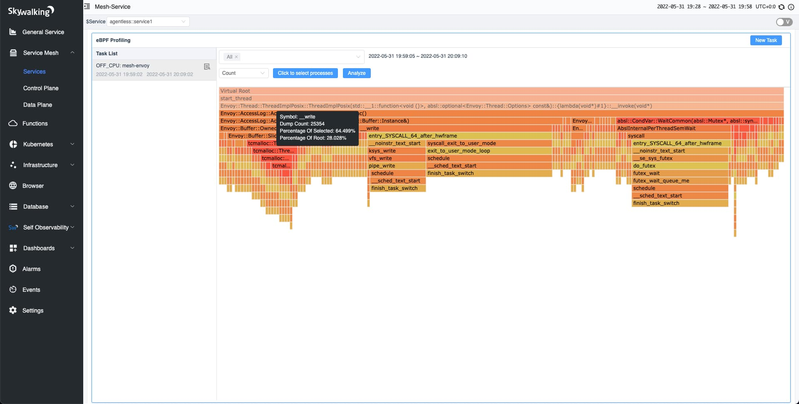

## 背景介绍 {#background}

Apache SkyWalking 观察部署在服务网格中的服务的度量、日志、追踪和事件。在进行故障排除时，SkyWalking 错误分析是一个宝贵的工具，可以帮助确定错误发生的位置。然而，确定性能问题更加困难：利用预先存在的观察数据往往不可能找到性能问题的根本原因。为此，动态调试和故障排除在进行服务性能剖析时就必不可少。在这篇文章中，我们将讨论如何使用 eBPF 技术来改进 SkyWalking 中的剖析功能，并用于分析服务网格中的性能影响。

## SkyWalking 中的追踪剖析 {#trace-profiling-in-skywalking}

自 SkyWalking 7.0.0 以来，Trace Profiling 通过定期对线程堆栈进行采样，让开发者知道运行哪行代码花费更多时间，从而帮助开发者发现性能问题。然而，Trace Profiling 不适合以下情况：

- **线程模型**：Trace Profiling 对于剖析在单线程中执行的代码最有用。它对严重依赖异步执行模式的中间件不太有用。例如，Go 中的 Goroutines 或 Kotlin Coroutines。
- **语言**：目前，Trace Profiling 只支持 Java 和 Python，因为在 Go 和 Node.js 等一些语言的运行时中不容易获得线程栈。
- **Agent 绑定**：Trace Profiling 需要安装 Agent，根据语言的不同，这可能很麻烦（例如，PHP 必须依赖其 C 内核；Rust 和 C/C++ 需要的仪器需要手动安装）。
- **关联性**：由于追踪剖析只与单个请求相关，所以当无法确认哪个请求产生问题时则变得难已处理。
- **生命周期短的服务**：由于（至少）两个原因，Trace Profiling 不支持短声明周期的服务：
  - 在启动阶段，很难区分系统性能和类代码操作。
  - Trace Profiling 与一个端点相连，以识别性能影响，但没有端点来匹配这些短生命周期的服务。

幸运的是，有一些技术比 Trace Profiling 更实用。

## eBPF 简介{#introduce-ebpf}

我们发现，eBPF —— 一种可以在操作系统内核中运行沙盒程序的技术，从而安全有效地扩展内核的功能，而不需要修改内核或加载内核模块，可以帮助我们填补 Trace Profiling 留下的空白。eBPF 技术正在流行，因为它打破了传统上的用户和内核空间之间的障碍。现在我们可以将程序作为字节码注入到内核中运行，而不需要定制和重新编译内核。可观测可以很好地利用这一点。

在下图中，我们可以看到，当系统执行 `execve` 系统调用时，eBPF 程序被触发，通过使用函数调用获得当前进程的运行时信息。


使用 eBPF 技术，可以将 SkyWalking 的剖析能力范围扩大到：

- **全局性能剖析**：在 eBPF 之前，数据收集被限制在代理可以观察的范围内。由于 eBPF 程序在内核中运行，它们可以观察到所有的线程。当你不确定某个性能问题是否是由一个特定的请求引起的，这一点特别有用。
- **数据内容**：eBPF 可以转储用户和内核空间的线程栈，所以如果性能问题发生在内核空间就更容易被发现。
- **代理绑定**：所有现代 Linux 内核都支持 eBPF，所以不需要安装任何东西。这意味着它是一个免编排与代理的模型。这减少了由内置软件引起的摩擦，这些软件可能没有安装正确的代理，如服务网格中的 Envoy。
- **采样类型**：与追踪剖析不同，eBPF 是事件驱动的，因此，不受间隔轮询的限制。例如，eBPF 可以触发事件，并根据传输大小的阈值收集更多的数据。这可以让系统在极端负载下分流和优先收集数据。

### eBPF 的局限性 {#ebpf-limitations}

虽然 eBPF 为发掘性能瓶颈提供了显著的优势，但没有任何技术是完美的。eBPF 有一些限制，如下所述（幸运的是，由于 SkyWalking 不依赖 eBPF，其影响是有限的）：

- **Linux 版本要求**：eBPF 程序需要的 Linux 内核版本要 4.4 以上，更新的内核版本可以提供更多的数据收集。BCC 记录了 [不同 Linux 内核版本所支持的功能](https://github.com/iovisor/bcc/blob/13b5563c11f7722a61a17c6ca0a1a387d2fa7788/docs/kernel-versions.md#main-features)，不同版本之间的差异在于 eBPF 收集的数据集。
- **需要特权权限**：所有打算将 eBPF 程序加载到 Linux 内核的进程必须在特权模式下运行。因此，代码中的错误或其他问题可能对安全有很大的影响。
- **对动态语言的支持较弱**：eBPF 对基于 JIT 的动态语言，如 Java，支持较弱。这也取决于你想收集什么数据。对于 Profiling，eBPF 不支持解析程序的字符表（symbol），这就是为什么大多数基于 eBPF 的剖析技术只支持静态语言如 C、C++、Go 和 Rust。然而，字符表映射有时可以通过语言所提供的工具来解决。例如，在 Java 中，可以使用 [perf-map-agent](https://github.com/jvm-profiling-tools/perf-map-agent#architecture) 来生成字符表映射。然而，动态语言不支持附加（`uprobe`）功能，而这种功能可以让我们通过符号追踪执行事件。

### SkyWalking Rover 简介 {#introducing-skywalking-rover}

SkyWalking Rover 是 SkyWalking 生态系统中引入的 eBPF 剖析功能。下图显示了 SkyWalking Rover 的整体架构。SkyWalking Rover 目前支持 Kubernetes 环境，必须部署在 Kubernetes 集群内。与 SkyWalking 后端服务器建立连接后，它将当前机器上的进程信息保存到 SkyWalking。当用户通过用户界面创建 eBPF 剖析任务时，SkyWalking Rover 会接收任务并在相关的基于 C、C++、Golang 和 Rust 语言的程序中执行。

除了需要具有 eBPF 功能的内核外，部署 SkyWalking Rover 没有其他先决条件。


### 使用 Rover 进行 CPU 剖析 {#cpu-profiling-with-rover}

CPU 剖析是显示服务性能的最直观方式。受 [Brendan Gregg 的博客文章](https://www.brendangregg.com/offcpuanalysis.html) 的启发，我们将 CPU 剖析分为两种类型，并在 Rover 中加以实施：

1. **CPU 剖析**：线程在 CPU 上的运行时间。

2. **off-CPU 剖析**：线程在 I/O、锁、定时器、分页 / 交换等方面被阻塞时的等待时间。

##  用 eBPF 对 Envoy 进行剖析 {#profiling-envoy-with-ebpf}

Envoy 是一个流行的代理，在 Istio 服务网格中被用作为数据平面。在 Kubernetes 集群中，Istio 将 Envoy 作为 sidecar 注入到每个服务的 pod 中，在那里透明地拦截和处理传入和传出的流量。作为数据平面，Envoy 的任何性能问题都会影响到网格中的所有服务流量。在这种情况下，使用 eBPF 剖析来分析生产中由服务网格引起的问题是比较有力的。

### 演示环境 {#demo-environment}

如果你想看到详细过程，我们已经建立了一个演示环境，在那里我们部署了一个 Nginx 服务进行压力测试。流量被 Envoy 拦截并转发到 Nginx。安装整个环境的命令可以在 [GitHub](https://github.com/mrproliu/skywalking-rover-profiling-demo) 上获取。

## CPU 剖析 {#on-cpu-profiling}

当服务的 CPU 使用率很高时，CPU 剖析适用于分析线程堆栈。如果堆栈被转储的次数较多，意味着线程堆栈占据了更多的 CPU 资源。

在使用演示配置文件安装 Istio 时，我们发现有两个地方的性能可以优化：

- **Zipkin 追踪**：不同的 Zipkin 采样百分比对 QPS 有直接影响。
- **访问日志格式**：减少 Envoy 访问日志的字段可以提高 QPS。

### Zipkin 追踪

### Zipkin 100% 采样

在默认的演示配置文件中，Envoy 使用 100% 采样作为默认的追踪策略。这对性能有什么影响？

如下图所示，使用 CPU 剖析，我们发现它大约需要 **16%** 的 CPU 开销。在固定消耗 **2 个 CPU** 的情况下，其 QPS 可以达到 **5.7K**。


### 禁用 Zipkin 追踪

此时，我们发现，如果没有必要，可以降低 Zipkin 采样比例，甚至可以禁用追踪。根据 [Istio 文档](https://istio.io/latest/docs/reference/config/istio.mesh.v1alpha1/#Tracing)，我们可以在安装 Istio 时使用以下命令禁用追踪。

```bash
istioctl install -y --set profile=demo \
   --set 'meshConfig.enableTracing=false' \
   --set 'meshConfig.defaultConfig.tracing.sampling=0.0'
```

禁用追踪后，我们再次进行 CPU 剖析。根据下图，我们发现 Zipkin 已经从火焰图中消失了。在与前面的例子相同的 **2 个 CPU** 消耗下，QPS 达到 **9K**，几乎增加了 **60%**。


### 追踪吞吐量 {#tracing-with-throughput}

在 CPU 使用率相同的情况下，我们发现，当追踪功能被禁用时，Envoy 的性能会大大提升。当然，这需要我们在 Zipkin 收集的样本数量和 Envoy 的预期性能（QPS）之间做出权衡。

下表说明了在相同的 CPU 使用率下，不同的 Zipkin 采样比例对 QPS 的影响。

| Zipkin 采样比例   | QPS  | CPU  | 备注             |
| ----------------- | ---- | ---- | ---------------- |
| 100% **（默认）** | 5.7K | 2    | Zipkin 占用 16%  |
| 1%                | 8.1K | 2    | Zipkin 占用 0.3% |
| 禁用              | 9.2K | 2    | Zipkin 占用 0%   |

## 访问日志格式 {#access-log-format}

### 默认访问日志格式 {#default-log-format}

在默认的演示配置文件中，默认的访问日志格式包含大量的数据。下面的火焰图显示了在解析数据时涉及的各种功能，如请求头、响应头和流媒体主体。


### 简化访问日志格式 {#simplifying-access-log-format}

通常情况下，我们不需要访问日志中的所有信息，所以我们通常可以简化它来获得我们需要的信息。下面的命令简化了访问日志的格式，只显示基本信息。

```bash
istioctl install -y --set profile=demo \
   --set meshConfig.accessLogFormat="[% START_TIME%] \"% REQ (:METHOD)% % REQ (X-ENVOY-ORIGINAL-PATH?:PATH)% % PROTOCOL%\"% RESPONSE_CODE%\n"
```

简化访问日志格式后，我们发现 QPS 从 **5.7K** 增加到 **5.9K**。当再次执行 CPU 剖析时，日志格式化的 CPU 使用率从 **2.4%** 下降到 **0.7%**。

简化日志格式帮助我们提高了性能。

## Off-CPU 剖析

Off-CPU 剖析适用于由非高 CPU 使用率引起的性能问题。例如，当一个服务中有太多的线程时，使用 off-CPU 剖析可以揭示出哪些线程花费了更多的时间进行上下文切换。

我们提供两个维度的数据汇总。

1. **切换次数**：一个线程切换上下文的次数。当线程返回到 CPU 时，它完成了一次上下文切换。开关次数较多的线程栈会花费更多时间进行上下文切换。
2. **切换持续时间**：一个线程切换上下文所需的时间。切换持续时间较长的线程栈在 off-CPU 花费的时间较多。

### 写入访问日志 {#write-access-log}

#### 启用写入 {#enable-write}

使用与之前 CPU 测试相同的环境和设置，我们进行了 off-CPU 剖析。如下图所示，我们发现访问日志的写入占总上下文切换的 **28%** 左右。下图中的 `__write` 也表明这是 Linux 内核中的方法。



#### 禁用写入

SkyWalking 实现了 Envoy 的访问日志服务（ALS）功能，允许我们使用 gRPC 协议将访问日志发送到 SkyWalking 可观察性分析平台（OAP）。即使禁用访问日志，我们仍然可以使用 ALS 来捕获 / 汇总日志。我们使用以下命令禁用了对访问日志的写入。

```bash
istioctl install -y --set profile=demo --set meshConfig.accessLogFile=""
```

禁用访问日志功能后，我们进行了 off-CPU 剖析。如下图所示，文件写入条目已经消失了。Envoy 的吞吐量也从 **5.7K** 增加到 **5.9K**。


## 总结

在这篇文章中，我们研究了 Apache SkyWalking 的 Trace Profiling 可以给我们带来的启示，以及使用 eBPF 剖析可以实现的更多功能。所有这些功能都在 [skywalking-rover](https://github.com/apache/skywalking-rover) 中实现。除了 CPU 和 off-CPU 剖析之外，你还会发现以下功能：

- **连续剖析**，帮助你自动剖析，无需人工干预。例如，当 Rover 检测到 CPU 超过一个可配置的阈值时，它会自动执行 CPU 剖析任务。
- 更多的剖析类型，以丰富使用场景，如网络和内存剖析。
