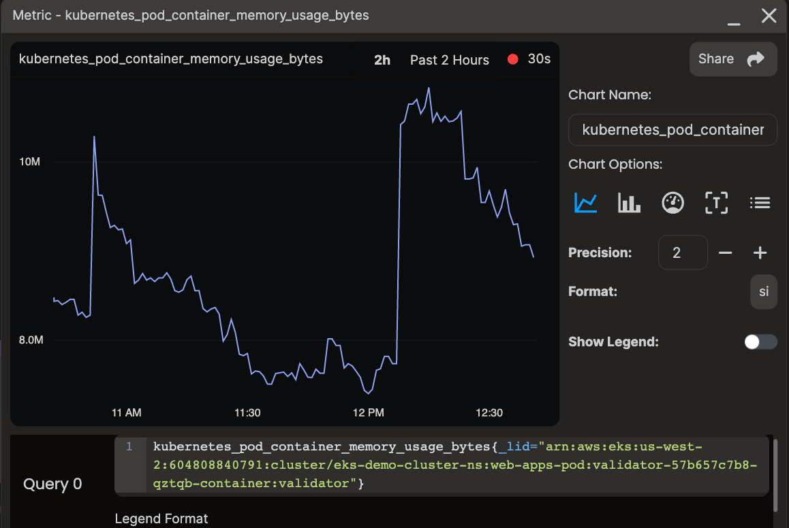

本文译自 [Reframing Kubernetes Observability with a Graph](https://thenewstack.io/reframing-kubernetes-observability-with-a-graph/)。

摘要：本文介绍了将 DevOps 和 Kubernetes 视为图形的方法，以提高效率和弹性。通过将 Kubernetes 部署中的不同组件建模为图中的节点，组织可以更好地了解不同组件的交互方式以及一个区域的更改如何影响整个系统。这可以帮助组织采取更为主动、战略性的 DevOps 方法，而不仅仅是在问题出现时做出反应。

Kubernetes 可以跨多个主机部署应用程序，同时让团队将它们作为单个逻辑单元进行管理。它抽象了底层基础架构，并提供了一个用于与集群交互的统一 API，以及用于简化工作流程的自动化。它是现代开发实践的完美系统。

但在这些以云为先的生态系统中确保效率和弹性并不容易。微服务架构使得无法跟上正在不断发生的所有软件和基础架构变化。这个问题只会因分裂的监视和可观测工具以及团队和个人之间的隔离信息而变得更加严重。

为了跟上，组织必须以一种新的方式考虑 DevOps 和 Kubernetes - 作为一个图形。

## 将 DevOps 视为图形

DevOps 通常专注于自动化和集成，而不考虑底层工具和流程之间的关系和依赖关系。另一方面，将 [DevOps 视为图形](https://thenewstack.io/devops-as-a-graph-for-real-time-troubleshooting/) 更加注重这些连接，以提供更好的上下文，从而导致更有效的操作。传统的 DevOps 方法通常依赖于线性、顺序工作流，而将 DevOps 视为图形有助于组织采用更全面、基于系统的方法。

通过将 DevOps 流水线的不同组件建模为图中的节点，组织可以更好地了解不同组件的交互方式以及一个区域的更改如何影响整个系统。这可以帮助组织采取更为主动、战略性的 DevOps 方法，而不仅仅是在问题出现时做出反应。

以这种方式考虑 DevOps 需要从以工具为中心的方法转向更为系统化的方法，需要思维方式和实践方法上的转变。

这并不容易，但最终使团队和组织更加数据驱动和主动。

## 图形和 Kubernetes

在基于 Kubernetes 的 DevOps 流水线中，可以使用基于图形的方法对许多组件进行建模和分析。例如，Kubernetes 集群中不同容器、服务和 Pod 之间的关系可以表示为图中的节点，它们之间的交互可以表示为边。通过分析这个图，组织可以获得有关其基于 Kubernetes 的 DevOps 流水线性能的见解，包括识别瓶颈、故障排除和优化工作流程。

更具体地说，应用于 Kubernetes 部署的图形方法允许：

### 知识捕获和保留

通过将 Kubernetes 部署中的不同组件可视化为图形，组织可以更好地了解不同组件的交互方式，以及一个区域的更改如何影响其他区域。例如，它可以显示特定服务是否被其他组件广泛依赖。或者在处理像 Amazon 关系型数据库服务 (RDS) 或 DynamoDB 这样的外部资源时，组织可以注意到哪个 Pod 依赖于哪个数据库，以获得清晰的依赖关系和风险。

以下是实际实现的方法：

在 DevOps 可观测性平台中，我们为 Kubernetes/Amazon Elastic Kubernetes Service (EKS) 设置了一个场景。场景提供了 Kubernetes 架构的拓扑视图。在这种情况下，我们创建了一个简单的 Kubernetes 基础设施图，它可以自动发现和可视化所有 Kubernetes 依赖项，以帮助跟踪更改。依赖关系图包括来自群集和服务到 Pod、容器和进程的资源。

场景可以包括度量指标，允许用户学习 Pod、节点和命名空间之间的关系以及与它们相关的指标。如果所选实体有任何关联的指标，那么它们将出现在上下文菜单中的指标选项卡下。

单击列出的任何指标将生成一个图表窗口。

然后，您可以将图表添加到仪表板中，以帮助确定问题并建立问题的根本原因。

### 优化和故障排除

通过分析 Kubernetes 部署的图形，组织还可以识别瓶颈并优化工作流程的流程。如果基于图形的分析显示特定的 Pod 经常导致超时或错误，组织可以调查原因并采取措施予以纠正。更好的是，团队可以看到与异常行为相关的相关更改的时间轴，并实时揭示根本原因。曾经故障排除需要太长时间，因为团队未能意识到其环境中所有持续变化，现在他们可以在共享的、上下文驱动的空间中连接因果关系。

### 资源分配

优化资源分配也变得更简单。通过分析组件和需求之间的关系，组织可以识别优化资源使用和降低成本的机会。例如，基于图形的分析可能显示特定的 Pod 进行了过度配置，需要缩减规模，而如果没有它，可能很难确定部署的哪个离散方面是问题。

## 更好的 DevOps

最终，将 DevOps 视为图形具有不可否认的好处。通过关系和工作流程映射，它提供了对复杂系统更好、更细粒度的了解。它提高了离散组件的可视化，以便快速识别和解决整个环境中的问题。

决策可以通过从图中揭示的模式和关系获得数据驱动的洞见来得到加强。简单地说，这是增加效率并持续改进 DevOps 过程的最佳方法，即使在处理 Kubernetes 和其他以云为先的技术的复杂性时也是如此。

要达到这种运营效率水平，DevOps 团队需要使用提供统一的或易于连接的更改时间轴的依赖图的工具。团队必须全面查看部署中所有不同的组件，同时能够注意到它们所有的关系和依赖关系。

由于云为先的体系结构（如 Kubernetes）存在的知识差距和复杂性问题，这不能通过手动或逐案例完成。只有现代的变更智能工具，可以在生成实时、准确的拓扑视图的同时，通过相关指标添加上下文，才能有效地实现这一点。

想象一下团队通过不必手动构建、维护和管理图形，就能节省多少时间和头痛。幸运的是，您不必想象太久。