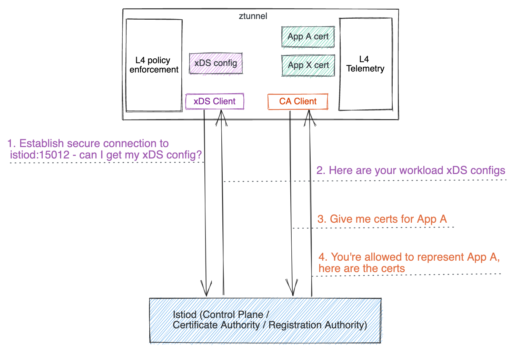
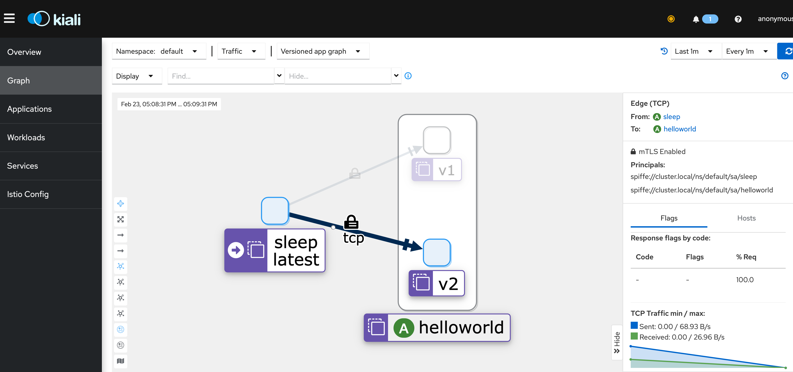

> 译者注：这篇文章介绍了 Istio 的 Rust-Based Ztunnel，它是一种基于 Rust 语言的轻量级代理，用于 Istio 的 ambient mesh。在文章中，作者解释了为什么需要一种新的代理，以及 Rust 语言是如何成为最佳选择的。文章还讨论了如何使用 workload xDS 配置来管理工作负载，以及如何查看 ztunnel 日志和 L4 指标。作者表示，Rust-Based Ztunnel 显著简化了 Istio 的 ambient mesh，并提高了性能。此外，Istio ambient mesh 已经合并到了上游主干，可以通过遵循入门指南来尝试 Rust-Based Ztunnel。

Ztunnel（零信任隧道）组件是为 Istio Ambient Mesh 专门构建的每节点代理。它负责安全地连接和验证 Ambient Mesh 中的工作负载。Ztunnel 旨在专注于 Ambient Mesh 中工作负载的一小组功能，例如 mTLS、身份验证、L4 授权和遥测，而无需终止工作负载 HTTP 流量或解析工作负载 HTTP 标头。Ztunnel 确保流量高效、安全地传输到 Waypoint Proxy，Istio 的全套功能（如 HTTP 遥测和负载平衡）在这里实现。

由于 ztunnel 设计为在所有 Kubernetes 工作节点上运行，因此保持其资源足迹较小至关重要。Ztunnel 被设计为服务网格的不可见（或“Ambient”）部分，对你的工作负载的影响最小。

## Ztunnel 架构

与 sidecar 类似，ztunnel 也充当 xDS 客户端和 CA 客户端：

1. 在启动期间，它使用其服务帐户令牌安全地连接到 Istiod 控制平面。一旦使用 TLS 安全地建立了从 ztunnel 到 Istiod 的连接，它就会开始作为 xDS 客户端获取 xDS 配置。这类似于 sidecar、网关或路点代理的工作方式，不同之处在于 Istiod 识别来自 ztunnel 的请求并发送专为 ztunnel 构建的 xDS 配置，稍后你将了解更多信息。
2. 它还充当 CA 客户端，代表其管理的所有并置工作负载管理和提供 mTLS 证书。
3. 当流量传入或传出时，它充当核心代理，为其管理的所有并置工作负载处理入站和出站流量（纯文本网格外或 HBONE 网格内）。
4. 它提供 L4 遥测（指标和日志）和带有调试信息的管理服务器，以帮助你在需要时调试 ztunnel。



## 为什么不重用 Envoy？

当 Istio Ambient Mesh 于 2022 年 9 月 7 日发布时，ztunnel 是使用 Envoy 代理实现的。鉴于我们将 Envoy 用于 Istio 的其余部分——sidecar、网关和 Waypoint Proxy——我们开始使用 Envoy 实施 ztunnel 是很自然的选择。

然而，我们发现虽然 Envoy 非常适合其他用例，但在 Envoy 中实现 ztunnel 具有挑战性，因为许多权衡、要求和用例与 sidecar 代理或入口网关有很大不同。此外，大多数使 Envoy 非常适合其他用例的东西，例如其丰富的 L7 功能集和可扩展性，都浪费在不需要这些功能的 ztunnel 中。

## 专门构建的 ztunnel

在 Envoy 因我们的需求而失败后，我们开始考虑构建 ztunnel 的专用实现。我们的假设是，通过从一开始就考虑一个单一的重点用例进行设计，我们可以开发一个比将通用项目塑造成自定义用例更简单、性能更高的解决方案。使 ztunnel 简单化的明确决定是这一假设的关键；例如，类似的逻辑不适用于具有大量支持功能和集成的重写网关。

这个专门建造的 ztunnel 涉及两个关键领域：

- ztunnel 与其 Istiod 之间的配置协议
- ztunnel 的运行时实现

### 配置协议

Envoy 代理使用 [xDS 协议](https://www.envoyproxy.io/docs/envoy/latest/api-docs/xds_protocol) 配置。这是使 Istio 良好运行的关键部分，提供丰富且动态的配置更新。然而，随着规模的扩大，配置变得越来越定制化，这意味着生成它更大、更昂贵。在 sidecar 中，具有 1 个 pod 的单个服务会生成大约 350 行 xDS（在 YAML 中），这已经很难扩展。基于 Envoy 的 ztunnel 甚至更糟，并且在某些区域具有 N^2 缩放属性。

为了使 ztunnel 配置尽可能小，我们研究了使用一种专门构建的配置协议，该协议以一种有效的格式准确包含我们需要的信息（仅此而已）。例如，可以简洁地表示单个 pod：

```yaml
name: helloworld-v1-55446d46d8-ntdbk
namespace: default
serviceAccount: helloworld
node: ambient-worker2
protocol: TCP
status: Healthy
waypointAddresses: []
workloadIp: 10.244.2.8
canonicalName: helloworld
canonicalRevision: v1
workloadName: helloworld-v1
workloadType: deployment
```

此信息通过 xDS 传输 API 传输，但使用特定于环境的自定义类型。请参阅[工作负载 xDS 配置部分](https://preliminary.istio.io/latest/blog/2023/rust-based-ztunnel/#workload-xds-configuration) 以了解有关配置详细信息的更多信息。

使用专门构建的 API，我们可以将逻辑推送到代理中，而不是在 Envoy 配置中。例如，要在 Envoy 中配置 mTLS，我们需要添加相同的大型配置集来调整每个服务的精确 TLS 设置；使用 ztunnel，我们只需要一个枚举来声明是否应该使用 mTLS。其余的复杂逻辑直接嵌入到 ztunnel 代码中。

借助 Istiod 和 ztunnel 之间的这种高效 API，我们发现我们可以使用有关大型网格（例如具有 100,000 个 pod 的网格）的信息来配置 ztunnel，配置数量减少几个数量级，这意味着 CPU、内存和网络成本更低。

### 运行时实现

顾名思义，ztunnel 使用 [HTTPS 隧道](https://preliminary.istio.io/latest/blog/2022/introducing-ambient-mesh/#building-an-ambient-mesh) 承载用户请求。虽然 Envoy 支持这种隧道，但我们发现配置模型限制了我们的需求。简单地说，Envoy 的工作方式是通过一系列“过滤器”发送请求，从接受请求开始到发送结束。根据我们的要求，它有多层请求（隧道本身和用户的请求），以及负载均衡后需要应用 per-pod 策略，我们发现每个连接需要循环通过这些过滤器 4 次才能实现我们的基于在 Envoy 上当 ztunnel。虽然 Envoy 对内存中的“向自身发送请求”进行了 [一些优化 ](https://www.envoyproxy.io/docs/envoy/latest/configuration/other_features/internal_listener)，但这仍然非常复杂且昂贵。

通过构建我们自己的实现，我们可以从头开始围绕这些约束进行设计。此外，我们在设计的各个方面都有更大的灵活性。例如，我们可以选择跨线程共享连接或围绕服务账户之间的隔离实现更多自定义需求。在确定专用代理可行后，我们开始选择实现细节。

#### 基于 Rust 的 ztunnel

为了使 ztunnel 快速、安全和轻量级，[Rust](https://www.rust-lang.org/) 是一个显而易见的选择。然而，这不是我们第一次。鉴于 Istio 目前对 Go 的广泛使用，我们曾希望我们可以使基于 Go 的实现满足这些目标。在最初的原型中，我们构建了一些基于 Go 的实现和一个简单版本的基于 Rust 的实现。从我们的测试中，我们发现基于 Go 的版本不满足我们的性能和占用空间要求。虽然我们可能会进一步优化它，但我们认为基于 Rust 的代理从长远来看将为我们提供最佳实现。

还考虑了 C++ 实现——可能会重用 Envoy 的部分内容。但是，由于缺乏内存安全、开发人员体验问题以及 Rust 的一般行业趋势，此选项未被采用。

这个淘汰过程给我们留下了 Rust，这是一个完美的选择。Rust 在高性能、低资源利用率的应用程序方面有着悠久的成功历史，尤其是网络应用程序，包括服务网格。我们选择在 [Tokio](https://tokio.rs/) 和 [Hyper](https://hyper.rs/) 库之上构建，这两个生态系统中的事实标准已经经历了广泛的验证——经过测试且易于编写高性能异步代码。

## 快速了解基于 Rust 的 ztunnel 

### 工作负载 xDS 配置

工作负载 xDS 配置非常易于理解和调试。你可以通过从你的一个 ztunnel pod 发送请求 `localhost:15000/config_dump` 或使用方便的 `istioctl pc workload` 命令来查看它们。有两个关键的工作负载 xDS 配置：工作负载和策略。

在你的工作负载包含在 Ambient Mesh 中之前，你仍然可以在 ztunnel 的配置转储中看到它们，因为 ztunnel 知道所有工作负载，无论它们是否启用了 Ambient Mesh。例如，以下包含新部署的 helloworld v1 pod 的示例工作负载配置，由 `protocol: TCP` 指示：

```json
{
  "workloads": {
    "10.244.2.8": {
      "workloadIp": "10.244.2.8",
      "protocol": "TCP",
      "name": "helloworld-v1-cross-node-55446d46d8-ntdbk",
      "namespace": "default",
      "serviceAccount": "helloworld",
      "workloadName": "helloworld-v1-cross-node",
      "workloadType": "deployment",
      "canonicalName": "helloworld",
      "canonicalRevision": "v1",
      "node": "ambient-worker2",
      "authorizationPolicies": [],
      "status": "Healthy"
    }
  }
}
```

Pod 被包含在 ambient 中后（默认将命名空间标记为 `istio.io/dataplane-mode=ambient` ），protocol 值将被替换为 HBONE，表示 ztunnel 将来自所有 helloworld -v1 pod 传入和传出通信升级到 HBONE。

```json
{
  "workloads": {
    "10.244.2.8": {
      "workloadIp": "10.244.2.8",
      "protocol": "HBONE",
      ...
}
```

在部署任何工作负载级别的授权策略后，策略配置作为 xDS 配置从 Istiod 推送到 ztunnel，并出现在 `policies` 中：

```json
{
  "policies": {
    "default/hw-viewer": {
      "name": "hw-viewer",
      "namespace": "default",
      "scope": "WorkloadSelector",
      "action": "Allow",
      "groups": [[[{
        "principals": [{"Exact": "cluster.local/ns/default/sa/sleep"}]
      }]]]
    }
  }
  ...
}
```

工作负载的配置已参考授权策略进行了更新：

```json
{
  "workloads": {
    "10.244.2.8": {
    "workloadIp": "10.244.2.8",
    ...
    "authorizationPolicies": [
        "default/hw-viewer"
    ],
  }
  ...
}
```

### ztunnel 提供的 L4 遥测

你可能会惊喜地发现 ztunnel 日志很容易理解。例如，你将在目标 ztunnel 上看到一个 HTTP 连接请求，指示源 pod IP (`peer_ip`) 和目标 pod IP。

```
2023-02-15T20:40:48.628251Z  INFO inbound{id=4399fa68cf25b8ebccd472d320ba733f peer_ip=10.244.2.5 peer_id=spiffe://cluster.local/ns/default/sa/sleep}: ztunnel::proxy::inbound: got CONNECT request to 10.244.2.8:5000
```

你可以通过访问位于“localhost:15020/metrics”的 API 查看工作负载的 L4 指标，它提供了全套 TCP [标准指标](https://istio.io/latest/docs/reference/config/metrics/) 集，具有与 sidecar 暴露的相同标签。例如：

```
istio_tcp_connections_opened_total{
  reporter="source",
  source_workload="sleep",
  source_workload_namespace="default",
  source_principal="spiffe://cluster.local/ns/default/sa/sleep",
  destination_workload="helloworld-v1",
  destination_workload_namespace="default",
  destination_principal="spiffe://cluster.local/ns/default/sa/helloworld",
  request_protocol="tcp",
  connection_security_policy="mutual_tls"
  ...
} 1
```

如果你安装了 Prometheus 和 Kiali，你可以从 Kiali 的 UI 轻松查看这些指标。



## 总结

我们感到非常兴奋的是，新的 [基于 Rust 的 ztunnel](https://github.com/istio/ztunnel/) 比之前基于 Envoy 的 ztunnel 更简单、重量更轻且性能更高。借助专门为基于 Rust 的 ztunnel 设计的工作负载 xDS，你不仅可以更轻松地了解 xDS 配置，还可以大大降低 Istiod 控制平面和 ztunnel 之间的网络流量和成本。随着 Istio ambient 现在合并到上游 master，你可以按照我们的[入门指南](http://istio.io/latest/docs/ops/ambient/getting-started/) 尝试新的基于 Rust 的 ztunnel。
