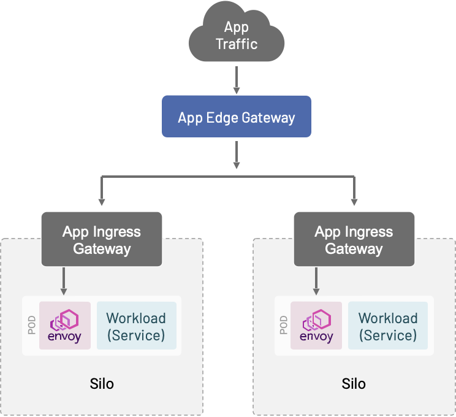
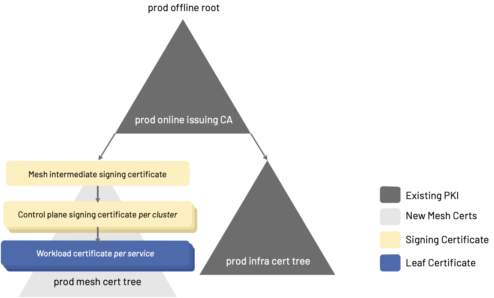

这是 [服务网格最佳实践系列文章](https://tetrate.io/blog/how-service-mesh-layers-microservices-security-with-traditional-security-to-move-fast-safely/) 中的第二篇，摘自 Tetrate 创始工程师 Zack Butcher 即将出版的书籍 Istio in Production。

当涉及到在多集群的基础设施中部署服务网格时，有一些可移动的部分。这里主要想强调的是控制平面应该如何部署在应用程序附近，入口应该如何部署以促进安全性和敏捷性，如何使用 Envoy 促进跨集群负载均衡，以及网格内部如何使用证书。

## 使服务网格控制平面与故障域保持一致

**建议：围绕故障域部署松散耦合的控制平面以实现高可用性。**

构建高可用性系统可能具有挑战性，而且通常成本很高。我们知道的一种经过验证的技术是围绕故障域构建。故障域是当关键系统发生故障时受影响的基础架构部分。我们构建可靠系统的基本方法是将系统跨越的故障域分组为多个独立的孤岛。最终系统的整体可靠性取决于我们可以使孤岛的独立程度。实际上，总是存在一些相互依赖性，将其最小化总是成本与可用性的权衡。

在没有耦合故障域的情况下创建隔离孤岛的最简单方法是在每个孤岛中运行关键服务的独立副本。我们可以说这些副本是筒仓的本地副本 —— 它们共享相同的故障域。在云原生架构中，Kubernetes 集群形成了最自然的筒仓边界。Istio 是一项关键服务，因此我们在每个应用程序集群中运行一个 Istio 控制平面实例。换句话说，我们部署 Istio 使其故障域与您的应用程序的故障域保持一致。

此外，我们确保 Istio 控制平面实例是松散耦合的，不需要直接与其他集群通信，从而最大限度地减少其与孤岛外部的通信。有关如何实现此目的的详细信息，请参阅下面的多集群部分。

## 使用应用程序入口网关隔离每个应用程序的流量

**建议：从每个应用程序或应用程序团队的网关（应用程序入口网关）开始，以帮助缓解共享中断。随着时间的推移您操作经验的增加，将应用程序入口合并到共享网关以优化成本。**

虽然 Istio 默认附带共享 `istio-ingressgateway`，但我们不建议使用共享网关。大多数采用网格的团队都需要时间来构建实施共享网关模型所需的审查实践和操作，而没有共享中断的风险。特别是在 Istio 实施的早期，我们建议每个团队部署一个 Envoy 网关。我们称这些为应用程序入口网关。随着您获得操作经验，您可以开始将应用程序合并到共享网关上以优化成本。

使用共享网关模型实现每个团队隔离的捷径是为每个团队分配一个单独的主机名。按主机名隔离的团队可以更安全地配置共享网关实例。然而，其他共同命运的中断风险仍然存在，例如入口代理部署的错误配置、嘈杂的邻居消耗资源和增加所有应用程序的延迟等。根据我们的经验，每个团队一个网关的方法会产生最快的影响，并且失败的机会最少，并且总体成本相对较低。

我们期望成熟部署的最终状态是 80-20 的比例：大多数应用程序将通过共享网关接收流量，而一小部分高度关键或敏感的应用程序将保留专用网关。

## 使用应用程序边缘网关在多个集群之间分配入口流量

**建议：使用应用程序边缘网关为客户端提供单一地址，以供客户端使用并将流量分配到跨多个集群的应用程序入口网关。**

我们经常看到客户需要跨多个集群分配入口流量。例如，他们可能希望启用蓝 / 绿基础设施升级，以促进跨区域故障转移，或者通过使用 Envoy 的 L7 功能将流量从单体迁移到微服务来实现扼杀模式。我们称这些为应用程序边缘网关。

为了实现这个用例，我们将部署 Envoy—— 在专用的 Kubernetes 集群中或作为一组虚拟机 —— 来接收外部流量。这些 Envoy 实例将通过其 Kubernetes 入口或 VM VIP 将流量转发到您的应用程序。这与 ingress-per-team 方法协同工作：多集群网关为客户端提供一个单一地址以供使用，根据您的基础设施需要提供尽可能多的应用程序网关和集群。

虽然此网关确实存在共享故障域，但其配置远比每个应用程序一个入口网关的配置简单。因此，作为共享基础架构运行起来更容易，也更安全。每个集群都有一个应用程序入口网关的共享应用程序边缘网关是一种强大而灵活的模型，用于在网格上部署和操作应用程序，还可以更轻松地操作底层基础设施。

## 证书和公钥基础设施 (PKI) 的建议

**建议：从您现有的企业根目录为网格 mTLS 创建一个中间签名证书。**

Istio 使用常规 X.509 证书进行身份验证并在网格中启用传输加密。我们建议为现有企业根目录中的所有网格 mTLS 创建一个网格中间签名证书。如果每个环境都有一个根，请为每个环境创建一个网格中间签名证书。使用该网格中间颁发证书为每个 Istio 安装创建一个签名证书。我们建议创建一个网格中间签名证书，以便在任何特定环境中网格的整个 PKI 是一棵树，如果需要可以一起失效。成本是一些额外的证书管理，与控制平面签名证书相比，在管理网格中间签名证书的生命周期时需要更加小心。

Istio 监视文件系统，并在检测到文件更改时重新加载其签名证书。因此，只要你有一个批准的机制来将秘密加载到 *istiod* pod 的文件系统中 —— 比如 *cert-manager*、Vault 的 *init-agent* 或 sidecar，或者只是存储在加密 *etcd* 中的普通旧 Kubernetes Secret—— 集成 Istio 进入您的 PKI 应该很容易。控制平面签名证书的轮换应由您的 PKI 自动执行。

Istio 使用众所周知的密码学库：Istio 的内部 CA 使用 Golang 的密码学套件，Envoy（sidecar 和 ingress）使用 BoringSSL 进行证书验证和传输中的加密。通过 Tetrate 的开源 Istio 发行版 [Tetrate Istio Distro](https://tetr8.io/tid) ，经过 FIPS 验证的控制平面和数据平面构建也作为 [Tetrate Istio 订阅](https://tetr8.io/tis) 的一部分提供，因此您可能期望的所有 X.509 约束（基本约束，如 CA 和深度，开箱即用地支持和强制执行命名约束、策略约束等）。

### 使用极短寿命的工作负载证书以轻松吊销

**建议：使用 Istio 来自动化证书管理，以便设置极短的工作负载证书 TTL 变得切实可行，从而使 [证书撤销列表（CRL）](https://csrc.nist.gov/glossary/term/certificate_revocation_list) 保持简短且易于管理。**

在证书颁发和轮换（Istio 为您自动执行）之后，PKI 中最大的挑战是证书吊销。证书吊销是通过证书吊销列表实现的，通常 CRL 具有 24 小时的强制执行 SLA：添加到列表中的证书在吊销后最多 24 小时内可能会被基础设施视为有效。此外，由于吊销的证书必须在其整个生命周期 (TTL) 内保留在列表中，因此吊销列表会变得庞大而笨拙。

Istio 提供的一个更好的解决方案是自动化证书管理，以便设置极短的工作负载证书 TTL 是切实可行的。默认情况下，Istio 附带 24 小时的工作负载证书 TTL。这足够短，大多数安全组织可以选择让受损的证书过期，而不是明确地撤销它们。而且，当您向 CRL 添加证书时，它只需要在那里停留很短的时间（因为我们不需要在 CRL 上保留过期的证书）。通过这种方式，网格有助于解决大多数组织面临的最痛苦的 PKI 问题：它颁发和吊销短期证书，这意味着吊销列表可以在需要时保持简短且易于管理。

**注意**：由于网格使用 mTLS 证书作为身份，Istio 将 Envoy 配置为自动丢弃已建立的连接，以强制客户端和服务器在任何一方轮换证书时重新验证彼此。这是 Istio 实现中的设计决策，通常通过 Istio 的弹性功能对应用程序隐藏：对应用程序透明的自动重试重新建立连接。在网格中设置较短的证书 TTL 会强制这些重新连接更频繁地发生。值得注意的是，这种行为偶尔会中断一些期望长期 TCP 连接的应用程序。

### 进一步的证书推荐

您应该与您的安全团队协调，为您的网格颁发的证书建立适当的约束。我们推荐的一些常见约束如下。

**证书生命周期 (TTL)**。请注意，只要证书是从同一个根颁发的，Istio 就支持控制平面签名证书和工作负载证书的零停机轮换。我们建议每个级别的证书生命周期如下：

- 网格中间签名证书 1-3 年
- 控制平面签名证书 3 个月
- 工作负载证书需要 12-24 小时

Istio 自动处理工作负载证书的轮换。这些证书上的短 TTL（少于 24 小时）有助于限制可能被盗的凭据进行时间限制攻击，还可以减少对 CRL 的需求。控制平面证书应按一个月的偏移轮换以确保平稳过渡 —— 换句话说，在 3 个月的 TTL 到期前 1 个月轮换控制平面签名证书。类似地，当网格中间签名证书还剩一半到三分之一的生命周期时轮换（一年 TTL 提前 3-4 个月，三年 TTL 提前 6-8 个月）。

**基础（CA 和深度）**。控制平面签名证书应该只能颁发叶证书：用于工作负载识别的非签名证书。因此，应配置深度限制以防止控制平面签名证书颁发任何其他签名证书。

网格中间签名证书需要创建控制平面签名证书，因此它应该配置一个深度，以便能够**在它下面创建一个级别的签名证书，而不是更多**。

**名称约束**。Istio 颁发的工作负载证书不会填充 X.509 主体名称 (SN) 字段；网格身份验证依赖于作为主体备用名称 (SAN) 字段携带的 SPIFFE 身份。阅读 [SPIFFE 规范以获取有关验证和身份验证工作的信息](https://github.com/spiffe/spiffe/blob/main/standards/X509-SVID.md#4-constraints-and-usage)，以及 Istio 的 [文档](https://istio.io/latest/docs/concepts/security/#istio-identity) 以了解 Istio 如何根据 SPIFFE 对身份进行编码。在为网格中间和控制平面签名证书编写名称约束时，请记住这一点。

**密钥用法**。 `keyCertSign` 必须为网格中间签名证书和控制平面签名证书设置，但应为工作负载证书禁用。换句话说，网格中间和控制平面证书是签名证书，而工作负载证书不是。

根据 SPIFFE 的建议，不应将签名证书用于传输中的加密，并且应配置密钥使用以防止它（通过加密约束）。

**扩展密钥用法**。虽然此处没有具体要求，但 SPIFFE X.509 SVID 规范说明 `id-kp-serverAuth` 和 `id-kp-clientAuth` 应针对叶（工作负载）证书进行配置。

SPIFFE 规范还推荐了 [各种证书约束](https://github.com/spiffe/spiffe/blob/main/standards/X509-SVID.md#4-constraints-and-usage)，尽管其中大部分上面已经约束了。

## 下一步

我们希望从多年帮助我们的客户充分利用服务网格的经验中收集的这些最佳实践将有助于促进您的部署。如果您还没有，请查看 [如何将服务网格作为安全模型的一部分，以分层形式将微服务安全与传统安全结合起来](/blog/how-service-mesh-layers-microservices-security-with-traditional-security-to-move-fast-safely/) 这篇文章。

接下来：服务网格运行时配置建议。在我们的下一篇文章中，我们将谈论：

- 命名约定
- 全局设置
- 流量管理
- 安全
- 遥测

敬请关注。
