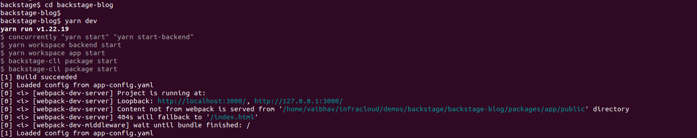
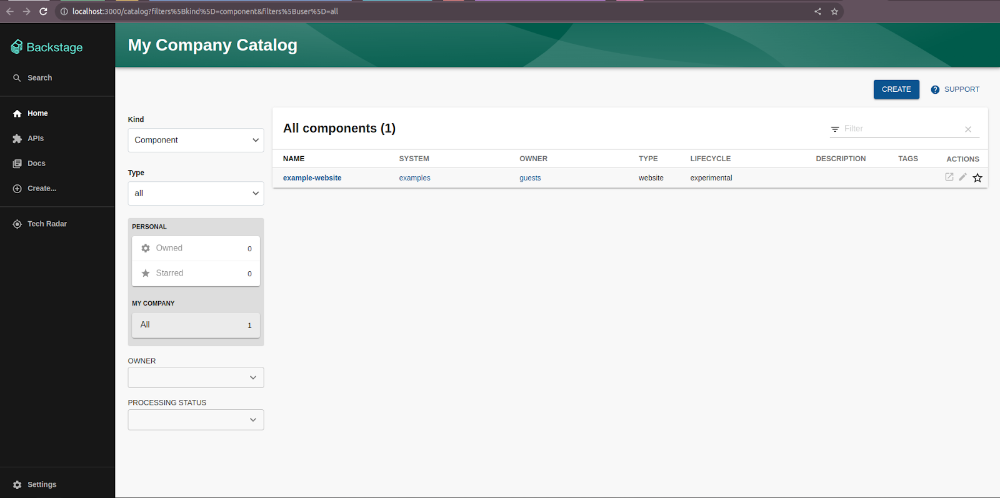
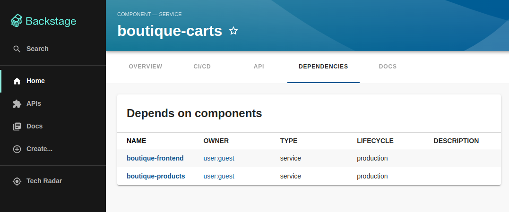

本文译自：<https://www.infracloud.io/blogs/starting-platform-engineering-journey-backstage/>

摘要：这篇文章介绍了 Backstage 这个开源工具，它可以帮助你创建和管理一个内部开发平台，以提高开发团队的效率和协作。文章还展示了如何使用 Backstage 的模板和插件来构建和部署你的应用和服务。

---

在不断增长的[平台工程领域，它起源于 DevOps 实践](https://www.infracloud.io/blogs/devops-to-platform-engineering-how-we-got-here/)，为软件开发团队提供自助服务功能，内部开发者门户或 IDP（Internal Developer Portals）正发挥着越来越重要的作用。通过提高协作、增加可见性和控制，内部开发者门户帮助组织快速高效地交付优质软件。

在众多不同的内部开发者门户工具中，Backstage 是一个受欢迎的工具之一。Backstage 旨在通过为开发人员提供一个集中的地方来发现和使用服务，显著增强开发体验。本文探讨了其关键功能和优势，揭示了它如何在开发过程中发挥作用。但首先，让我们简要了解什么是内部开发者门户，以及它们为何在软件行业至关重要。

## 什么是内部开发者门户（IDP）？

内部开发者门户是一个网站或 Web 应用程序，为正在构建基于公司平台的应用程序的开发人员提供信息和工具。[平台工程](https://www.infracloud.io/blogs/platform-engineering-101/)侧重于赋予开发人员快速高效地构建和部署软件的能力。内部开发者门户是实现平台工程目标的重要工具。它们为开发人员提供了访问所有资源的单一入口，包括 API、文档、工具和服务。

### 软件行业需要内部开发者门户

在传统软件开发过程中，开发团队通常会面临一些挑战，比如缺乏文档、需要导航到多个仪表板以满足各种需求等，这使得难以理解和实施技术。缺乏集中工具会导致混乱，增加开发时间，并增加错误的可能性。内部开发者门户简化了这个过程，提供了一个集中的文档、API 详细信息和工具的地方。它们弥合了开发人员和技术之间的差距，减少了摩擦，增强了软件开发过程的整体效率。

由于以下几个原因，内部开发者门户已经成为必需品：

- **流程的便捷访问性**：随着 API 和服务的数量增加，开发人员需要一个集中的地方，汇总这些资源，使它们易于访问和搜索。内部开发者门户充当了一个一站式目的地，开发人员可以在其中探索并选择适合其项目的正确工具。
- **有效的文档**：清晰而简洁的文档对于无缝的 API 集成和产品开发非常重要。内部开发者门户托管了全面的指南、教程和示例，帮助开发人员理解每个 API 的功能、方法和最佳实践。
- **增强的协作**：开发人员通常在团队中工作，或者与其他人合作，因此有效的沟通和知识共享很重要。内部开发者门户鼓励社区意识，开发人员可以分享经验、寻求建议，并共同解决问题。
- **加速开发**：将预构建的代码示例和 SDK 集成到内部开发者门户可以加快开发过程。开发人员可以利用这些样板资源来启动他们的项目，节省宝贵的时间和精力。

市场上还有许多其他内部开发者门户可用，例如 Port、Kratix 和 Cortex。这些门户提供了各种功能，如软件目录、文档管理和用户管理。但在本文中，我们将关注 Backstage，这是一个开源的内部开发者门户平台，由 Spotify 和 Netflix 等公司使用。

## 什么是 Backstage？

[Backstage](https://github.com/backstage/backstage) 是由 Spotify 开发的开源平台，随后于 2020 年[捐赠给了云原生计算基金会（CNCF）](https://backstage.io/blog/2020/09/23/backstage-cncf-sandbox/)。它旨在作为一个“内部开发者门户”，通过提供一个统一和集中的平台来管理软件开发生命周期的各个方面，从而显著增强开发体验。

### Backstage 的关键组件

Backstage 的一些关键组件包括：

#### 软件目录

软件目录是 Backstage 的基础功能之一。它充当了一个集中的存储库，提供了组织软件生态系统内所有服务、API 和组件的全面概述。目录中的每个服务条目都包括关键信息，如用途、所有者、文档、依赖关系和健康指标。

#### 软件模板

Backstage 提供了用于加快创建新服务和项目过程的软件模板。这些模板为各种类型的应用程序提供了标准化的起点，确保了从一开始就遵循一致的最佳实践、编码约定和集成。这个功能不仅加速了开发，还强制执行了项目之间的一致性，从而提高了代码质量。

#### CI/CD 集成

持续集成和持续交付（CI/CD）是现代软件开发中的重要实践。Backstage 与 CI/CD 流水线无缝集成，允许开发人员直接从平台触发构建、运行测试并部署代码。这种集成简化了开发工作流程，减少了手动干预，提高了[交付软件更新](https://www.infracloud.io/progressive-delivery-consulting/)的速度和可靠性。

#### 文档管理

高效的文档管理对于有效的软件开发至关重要。Backstage 提供了管理、版本和发布与服务和 API 相关的文档的工具。这确保开发人员始终能够访问最新和相关的文档，减少混乱，促进准确实施。

#### 分析和指标

了解服务的性能对于维护健康的软件生态系统至关重要。Backstage 可以扩展以包括与服务健康、性能和使用相关的分析和指标。这些数据使团队能够做出明智的决策，优化资源分配，并主动解决问题。

### Backstage 的好处

使用 Backstage 的一些关键优势包括：

- **开源**：Backstage 是一个开源项目，这意味着它是免费使用和修改的。这为组织提供了更多灵活性和对其内部开发者门户的控制。
- **可扩展性**：由于其庞大的插件生态系统，Backstage 非常可扩展，这意味着它可以轻松集成到组织已经使用的其他工具和服务中。这有助于减少孤立，并创建更流畅的开发体验。
- **社区支持**：Backstage 拥有庞大且活跃的用户和贡献者社区。这意味着在线有大量的信息和支持可用。
- **增强的协作**：通过提供一个集中平台，Backstage 鼓励开发人员、基础架构团队和其他利益相关者更好地协作。它将不同的团队汇聚在一起，培养了社区感和共同责任感。
- **提高开发人员的生产力**：Backstage 通过提供一个统一的界面来访问各种工具和资源，简化了开发体验。开发人员花费更少的时间搜索信息，更多时间编码，最终提高了他们的生产力。
- **一致的开发实践**：使用 Backstage，团队可以在项目之间强制执行标准化的开发实践。这种一致性确保了代码质量、安全性和合规性，从而产生更强大和可靠的软件。
- **高效的入职过程**：入职新团队成员可能具有挑战性，但 Backstage 通过提供清晰和易于访问的文档来简化此过程。新成员可以快速掌握项目的要点并开始有效地贡献。

## 使用 Backstage 入门

[官方 Backstage 文档](https://backstage.io/)是入门 Backstage 的最佳资源。它全面、及时并易于遵循。文档涵盖了从安装和配置 Backstage 到创建和管理软件组件的所有内容。它还包括教程和示例，以帮助您快速入门。

Backstage 可以作为独立应用程序在本地或远程服务器上安装和运行，您可以使用其庞大的插件生态系统来自定义和构建门户，以满足您的开发团队的需求。我们将在以下部分安装 Backstage 应用程序。

### Backstage 安装步骤

#### 先决条件

在开始使用 Backstage 之前，让我们确保已经具备了[必要的先决条件](https://backstage.io/docs/getting-started/#prerequisites)，以确保顺利完成安装过程。以下是我们需要开始的工具清单：

- 基于 Unix 的操作系统（Linux、macOS、WSL）
- 带有 NVM 的 Node.js
- Yarn
- Git
- 像 curl 或 wget 这样的系统二进制文件

#### 安装 Backstage 应用程序

我们使用 [npx](https://www.npmjs.com/package/npx)，这是一个直接从注册表运行 Node 可执行文件的工具，来安装 Backstage 独立应用程序。这个工具包含在 Node.js 安装中。以下命令将安装 Backstage：

```
npx @backstage/create-app@latest
```

向导将要求输入应用程序的名称，该名称也将是目录的名称

```
需要安装以下包:
  @backstage/create-app@0.5.5
确定要继续吗？(y) y
? 输入应用程序的名称 [required] backstage-blog
```

#### 运行 Backstage 应用程序

安装完成后，将创建一个具有在安装过程中选择的应用程序名称的目录。切换到该目录并启动 Backstage 应用程序。

```
cd backstage-blog
yarn dev
```



Backstage 应用程序将在端口 3000 上启动。转到本地浏览器并键入 `http://localhost:3000` 以打开 Backstage 应用程序。



(Backstage 用户界面运行在 localhost 上)

#### 创建 config.yaml

要将任何服务导入到软件目录中，让我们在 GitHub 存储库的根目录中创建一个名为 **config.yaml** 的文件，内容如下：

```
apiVersion: backstage.io/v1alpha1
kind: Component
metadata:
  name: boutique-carts
  annotations:
    github.com/project-slug: infracloudio/backstage-msvc-app/src/cartservice     
spec:
  type: service
  lifecycle: production
  owner: user:guest
  dependsOn:
    - component:boutique-frontend
    - component:boutique-products
  providesApis:
    - boutique-carts-api
```

上面的 config.yaml 对应于位于以下 GitHub 位置的 **boutique-carts** 服务：infracloudio/backstage-msvc-app/src/cartservice **dependsOn** 和 **providesApi** 规范有助于可视化各种服务之间的关系。所有在此提到的组件都可以类似于 boutique-carts 服务创建。

#### 将 config.yaml 导入到软件目录

1. 在浏览器中打开 Backstage 用户界面，转到 **Home** 并选择 **Create**。

   

2. 选择 **Register existing components**。

   

3. 添加服务的 config.yaml 文件的绝对路径。选择 **Analyze** 并 **Import** 它到目录中。

   

#### 在软件目录中导航服务

1. **Overview** 选项卡下可用的选项

   

2. **CI/CD** 选项卡会自动导入导入的存储库中的所有 Github Actions 工作流程

   

3. **API** 和 **Dependencies** 可以在各自的选项卡下可视化

   

   

总之，在上面的简短演示中，我们学习了如何将服务添加到我们的目录并可视化它们之间的关系。这有助于创建一个高效和用户友好的目录。您可以使用 Backstage 探索许多其他用例，以满足您的开发人员的需求。

## 结论

总之，技术的发展和对互连数字服务日益增长的需求突显了内部开发者门户的关键需求。在这个领域，Backstage 提供了一个全面的解决方案，不仅满足了现代软件开发的要求，还提供了许多优势。

Backstage 将简化的开发体验与丰富的组件和工具相结合，使其成为内部开发者门户生态系统的前沿。它通过提供清晰的文档、API 和自助服务能力，赋予开发人员能力，减少摩擦并加速创新。
