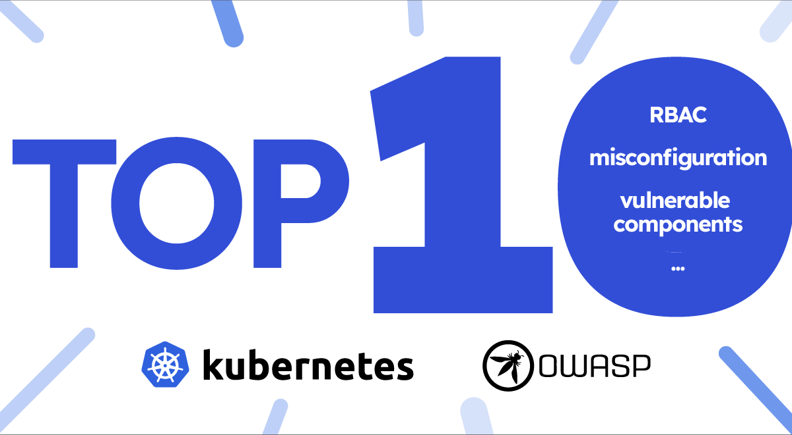
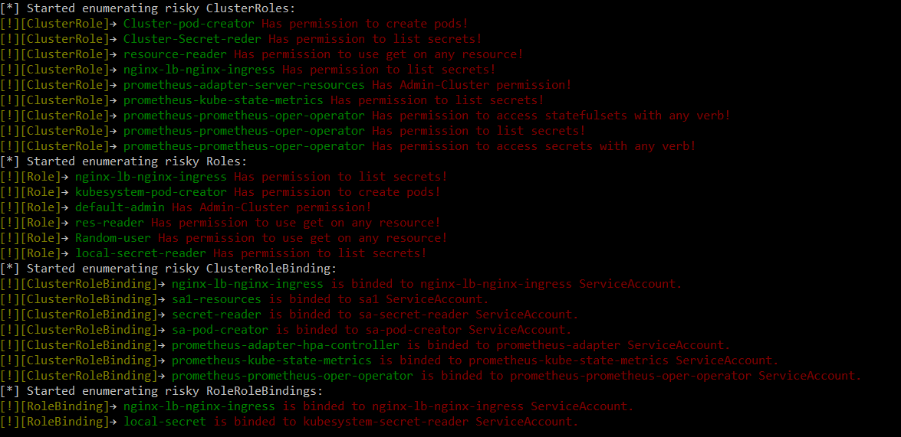
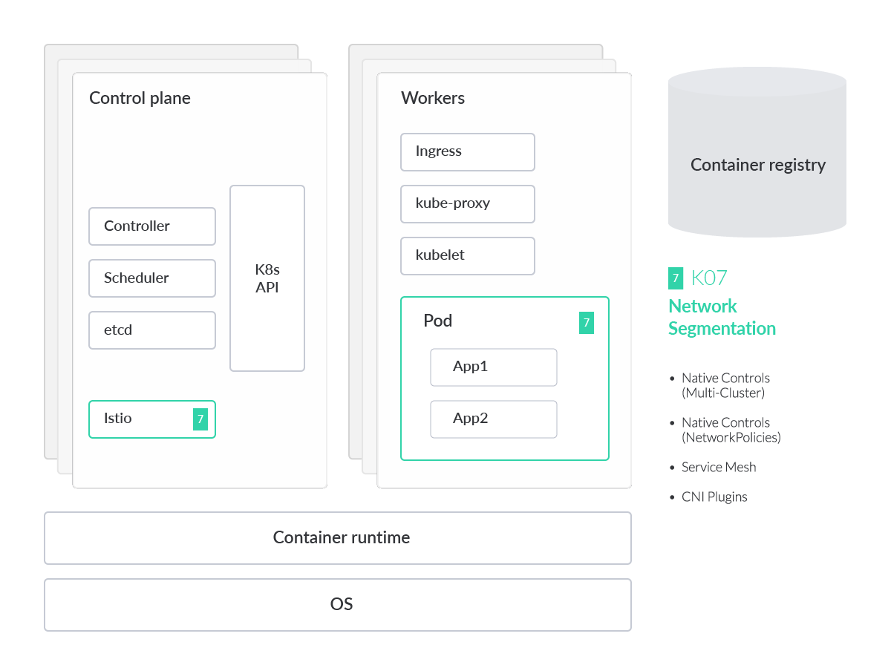
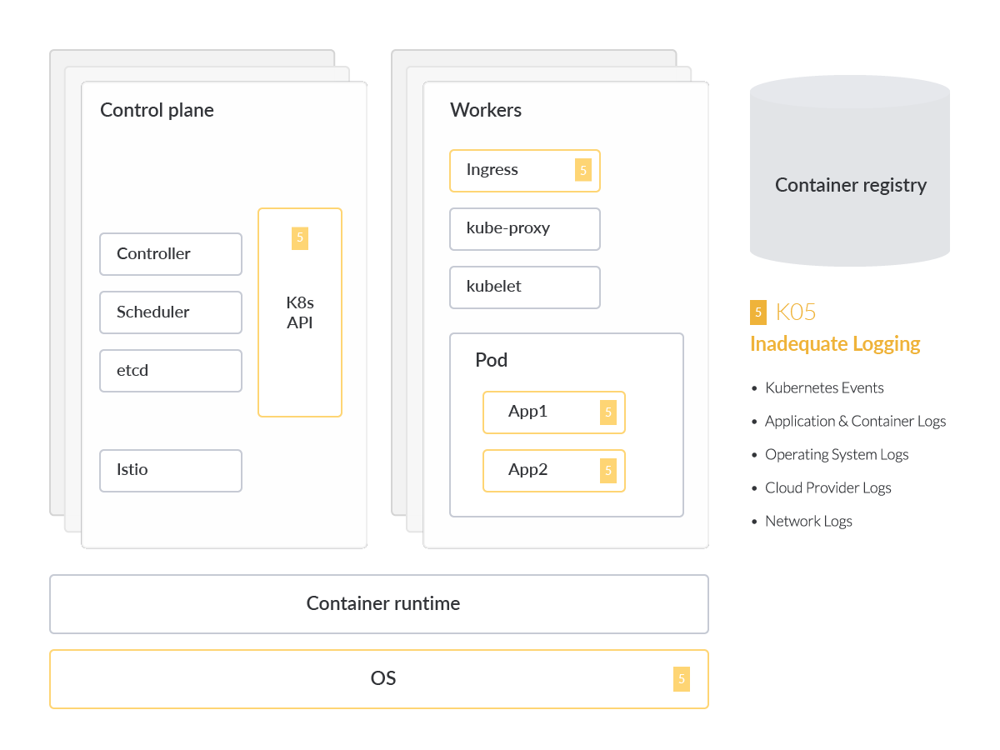
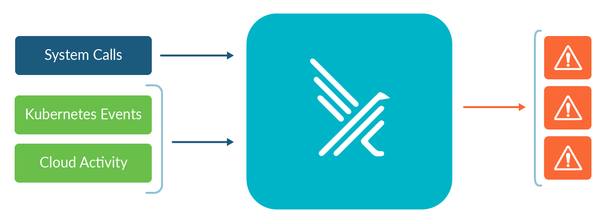
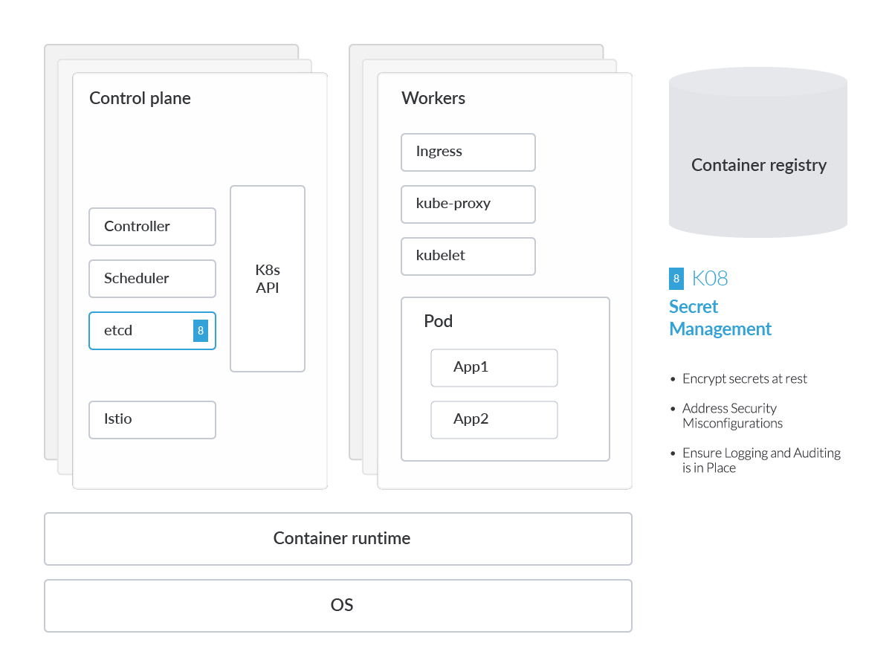
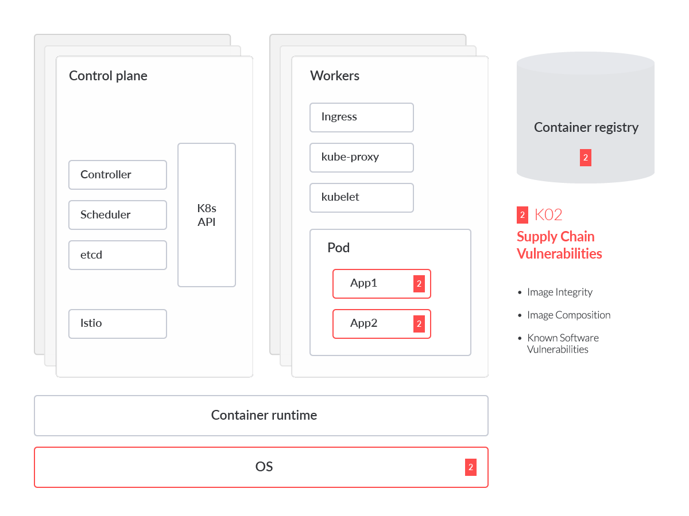
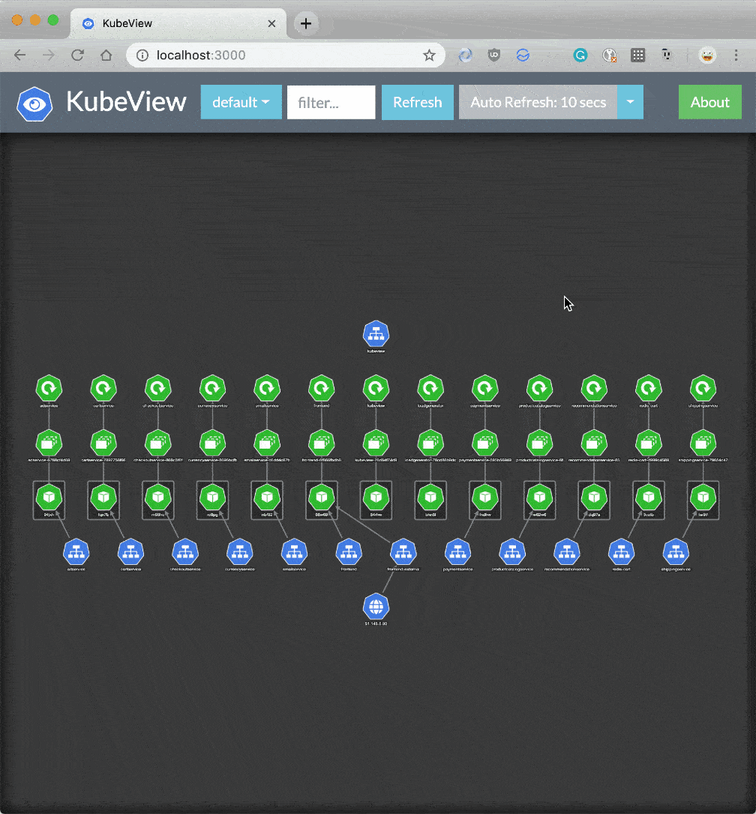

本文译自：<https://sysdig.com/blog/top-owasp-kubernetes/>

> 摘要：OWASP Kubernetes Top 10 强调了 Kubernetes 生态系统中的关键风险和漏洞。它涵盖了诸如准入控制器中的配置错误，密钥管理故障，漏洞管理，身份验证机制失效以及过时和易受攻击的 Kubernetes 组件等主题。建议包括使用像 Falco 这样的工具来检测安全问题，对静态密钥进行加密，解决安全配置问题，确保日志记录和审计，扫描容器镜像以检测漏洞，管理依赖关系，保护对 Kubernetes 的访问以及及时了解 CVE 情况。

---

使用 Kubernetes 时最大的关切之一是是否符合安全态势，并考虑到所有可能的威胁。因此，OWASP 创造了 OWASP Kubernetes Top 10，以帮助识别最可能的风险。

OWASP Top 10 项目是对安全从业人员和工程师非常有用的认知和指导资源。它们也可以映射到其他安全框架，帮助事件响应工程师了解 Kubernetes 的威胁。MITRE ATT&CK 技术也常用于记录攻击者的技术，并帮助蓝队了解保护环境的最佳方法。此外，我们可以检查 Kubernetes 的威胁模型，了解所有的攻击面和主要的攻击向量。

OWASP Kubernetes Top 10 将所有可能的风险按照总体普遍性或可能性排序。在这项研究中，我们略微修改了顺序。我们将其中一些风险分组到同一类别中，如配置错误、监控或漏洞。我们还推荐一些工具或技术来审计您的配置，并确保您的安全态势是最合适的。

## 什么是 OWASP Kubernetes？

OWASP（Open Web Application Security Project）是一个致力于改善软件安全的非营利基金会。OWASP 侧重于 Web 应用程序安全（故其名称），但随着现代系统设计的特性，它的范围已经扩大。

随着应用程序开发从传统运行在虚拟机后面的单片架构转向在云基础设施上运行的现代微服务工作负载，重要的是为每个应用程序环境更新安全要求。

这就是为什么 OWASP 基金会创建了 OWASP Kubernetes Top 10 - 专为 Kubernetes 环境设计的十大最常见攻击向量列表。


在上图中，我们突出显示了 OWASP Kubernetes 中的每个风险影响的组件或部分，映射到一个通用的 Kubernetes 威胁模型以帮助理解。这项分析还深入研究了每个 OWASP 风险，提供了关于为何该威胁突出的技术细节，以及常见的缓解措施。将风险分组成三类并按可能性排序也很有帮助。风险类别包括：

### 配置错误

- K01:2022 不安全的工作负载配置
- K09:2022 集群组件配置错误
- K03:2022 过于宽松的 RBAC 配置
- K07:2022 缺失网络分割控制

### 缺乏可见性

- K05:2022 日志和监控不足
- K04:2022 缺乏集中策略强制执行
- K08:2022 机密管理故障

### 漏洞管理

- K02:2022 供应链漏洞
- K06:2022 身份验证机制失效
- K10:2022 过时且容易受攻击的 Kubernetes 组件

### 配置错误

### 不安全的工作负载配置

安全始终是云服务提供商提供的所有服务的首要考虑因素。像 AWS、GCP 和 Azure 这样的云服务提供商实施了一系列沙盒功能、虚拟防火墙功能以及对底层服务的自动更新，以确保您的业务在任何时间和地点都保持安全。这些措施也减轻了在本地环境中传统安全负担的一些压力。然而，云环境应用了所谓的共享安全模型，这意味着部分责任在云服务的消费者身上，需要在其响应环境中实施这些安全防护措施。责任也会根据云消费模型和提供类型而变化。


租户的管理员最终必须确保工作负载使用安全镜像，在已打补丁/更新的操作系统（OS）上运行，并确保基础设施配置持续进行审核和补救。云原生工作负载中的配置错误是对敌手获取访问您环境的最常见途径之一。

操作系统

容器化工作负载的好处之一是您选择的镜像通常已预先加载了与您的应用程序基础镜像功能相匹配的依赖关系。这些镜像预先打包了一些通用系统库和其他第三方组件，这些组件对于工作负载并非必需。在某些情况下，例如在微服务体系结构（MSA）中，给定的容器镜像可能太臃肿，无法提供性能良好的操作该微服务的容器。

我们建议在容器化工作负载中使用最小化、精简的镜像，例如文件大小要小得多的 Alpine Linux 镜像。这些轻量级镜像在大多数情况下都非常理想。由于其中打包的组件较少，也就

减少了被攻击的可能性。如果需要额外的软件包或库，可以考虑从基本的 Alpine 镜像开始，并逐渐添加所需的软件包/库，以保持预期的行为/性能。

审核工作负载

CIS Kubernetes Benchmark 可以作为发现配置错误的起点。比如，开源项目 kube-bench 可以使用 YAML 文件设置测试来检查您的集群是否符合 CIS Kubernetes Benchmark。

示例 CIS Benchmark 控制

最小化 root 容器的准入（5.2.6）

Linux 容器工作负载可以作为任何 Linux 用户运行。然而，作为 root 用户运行的容器会增加容器逃逸（特权升级，然后在 Linux 主机中进行侧向移动）的可能性。CIS 基准建议所有容器应作为定义的非 UID 0 用户运行。

减少 root 容器准入的 Kubernetes 审核工具之一是 kube-admission-webhook。这是一个 Kubernetes 准入控制器 Webhook，允许您验证和变更传入的 Kubernetes API 请求。您可以使用它来强制执行安全策略，例如禁止在您的集群中创建 root 容器。

如何使用 OPA 防止工作负载配置错误

诸如 Open Policy Agent（OPA）之类的工具可用作策略引擎，用于检测这些常见的配置错误。OPA 准入控制器为您提供了高级别的声明性语言，以在整个堆栈上编写和强制执行策略。

假设您想为前面提到的 Alpine 镜像构建一个准入控制器。但是，Kubernetes 的某些用户想将 securityContext 设置为 privileged=true。

```yaml
apiVersion: v1
kind: Pod
metadata:
  name: alpine
  namespace: default
spec:
  containers:
  - image: alpine:3.2
    command:
      - /bin/sh
      - "-c"
      - "sleep 60m"
    imagePullPolicy: IfNotPresent
    name: alpine
    securityContext:
      privileged: true
  restartPolicy: Always
```

这是 Kubernetes 中的一个特权 pod 的示例。在特权模式下运行 pod 意味着该 pod 可以访问主机的资源和内核功能。为了防止特权 pod，OPA Gatekeeper 准入控制器的 .rego 文件应该看起来类似于：

```rego
package kubernetes.admission
deny[msg] {
    c := input.containers[_]
    c.securityContext.privileged
    msg := sprintf("Privileged container is not allowed: %v, securityContext: %v", [c.name, c.securityContext])
}
```

在这种情况下，输出应该类似于以下内容：

```
Error from server (Privileged container is not allowed: alpine, securityContext: {"privileged": true}): error when creating "STDIN": admission webhook "validating-webhook.openpolicyagent.org"
```

### 集群组件配置错误

核心 Kubernetes 组件中的配置错误比预期的要常见得多。为了防止这种情况，持续和自动审核基础设施即代码（IaC）和 K8s（YAML）清单，而不是手动检查它们，将减少配置错误。


最危险的配置错误之一是 Kubelet 中的匿名认证设置，它允许非经过身份验证的请求发送到 Kubelet。强烈建议检查您的 Kubelet 配置，并确保以下标志设置为 false。

在审核工作负载时，重要的是要记住有多种部署应用程序的方式。使用各种集群组件的配置文件，可以为这些组件授权特定的读取/写入权限。对于 Kubelet，通常情况下，对于 kubelet 的 HTTPS 端点的所有请求，如果没有被其他配置的身份验证方法拒绝，则被视为匿名请求，并被赋予用户名 system:anonymous 和组 system:unauthenticated。

要禁用这些未经身份验证的请求的匿名访问，只需在启动 kubelet 时使用特性标志 --anonymous-auth=false。在审核诸如 kubelet 之类的集群组件时，我们可以看到 kubelet 使用与 API 服务器相同的请求属性方法授权 API 请求。因此，我们可以定义权限，如：

- POST
- GET
- PUT
- PATCH
- DELETE

但是，还有许多其他集群组件需要关注，不仅仅是 kubelet。例如，kubectl 插件以与 kubectl 命令本身相同的权限运行，因此如果插件受到威胁，可能会用于升级权限并访问集群中的敏感资源。

根据 Kubernetes 的 CIS 基准报告，我们建议为所有集群组件启用以下设置。

### etcd

etcd 数据库提供了一个高可用的键值存储，Kubernetes 使用它来集中存储所有集群数据。保持 etcd 安全很重要，因为它存储配置数据以及 K8s Secrets。我们强烈建议定期备份 etcd 数据，以避免数据丢失。

幸运的是，etcd 支持一个内置的快照功能。可以使用 etcdctl snapshot save 命令从活动集群成员中获取快照。获取快照不会对性能产生影响。以下是将 keyspace 从 $ENDPOINT 服务到文件 snapshotdb 中获取快照的示例：

```perl
ETCDCTL_API=3 etcdctl --endpoints $ENDPOINT snapshot save snapshotdb
```

### kube-apiserver

[Kubernetes API 服务器](https://sysdig.com/learn-cloud-native/kubernetes-101/kubernetes-api-overview/) 用于验证和配置 API 对象的数据，包括 pods、services、ReplicationControllers 等。API 服务器提供 REST 操作服务，并提供了集群共享状态的前端，通过它，所有其他组件进行交互。它对集群的运行至关重要，具有极高的价值，因为攻击目标的重要性不可低估。从安全的角度来看，所有连接到 API 服务器的连接、控制平面内的通信以及控制平面与 kubelet 组件之间的通信都应只能通过 TLS 连接进行访问。

默认情况下，kube-apiserver 的 TLS 是未配置的。如果在 Kube-bench 的结果中标记了这一点，只需在 kube-apiserver 中使用特性标志 `--tls-cert-file=[file]` 和 `--tls-private-key-file=[file]` 启用 TLS。由于 Kubernetes 集群往往会定期扩展和缩减，我们建议使用 Kubernetes 的 [TLS 引导功能](https://kubernetes.io/docs/reference/access-authn-authz/kubelet-tls-bootstrapping/)。这允许在 Kubernetes 集群内自动进行证书签名和 TLS 配置，而不是遵循上述手动工作流程。

定期旋转这些证书也非常重要，特别是对于寿命较长的 Kubernetes 集群。

幸运的是，在 Kubernetes v.1.8 或更高版本中，有[自动化工具可以帮助旋转这些证书](https://kubernetes.io/docs/reference/access-authn-authz/kubelet-tls-bootstrapping/#certificate-rotation)。API 服务器请求也应该进行身份验证，我们将在“破碎的身份验证机制”部分中介绍。

### CoreDNS

[CoreDNS](https://coredns.io/) 是一种 DNS 服务器技术，可以作为 Kubernetes 集群的 DNS，由[CNCF](https://www.cncf.io/projects/coredns/) 托管。自 Kubernetes 版本 v.1.11 开始，CoreDNS 取代了 kube-dns。在集群内部进行名称解析对于定位 K8s 中的编排和临时工作负载以及固有的服务至关重要。

CoreDNS 解决了在 kube-dns 中发现的许多安全漏洞，特别是在 dnsmasq（DNS 解析器）中。这个 DNS 解析器负责缓存来自 SkyDNS 的响应，后者负责执行最终的 DNS 解析服务。

除了解决 kube-dns 中 dnsmasq 功能的安全漏洞之外，CoreDNS 还解决了 SkyDNS 中的性能问题。使用 kube-dns 还涉及到一个旁路代理，用于监控健康状况并处理 DNS 服务的指标报告。

CoreDNS 通过在一个容器内提供 kube-dns 的所有功能来解决许多与安全和性能相关的问题。然而，它仍然可能会受到威胁。因此，我们建议再次使用 kube-bench 来进行对 CoreDNS 的合规性检查。

## 过于宽松的 RBAC 配置

[基于角色的访问控制](https://sysdig.com/learn-cloud-native/kubernetes-security/kubernetes-rbac/)（RBAC）是一种根据组织内个别用户的角色来调节对计算机或网络资源的访问的方法。RBAC 配置错误可能会允许攻击者提升权限并完全控制整个集群。


创建 RBAC 规则相当简单。例如，要创建一个宽松策略以允许对 Kubernetes 集群的“default”网络命名空间中的 pods 进行只读的 CRUD 操作（即获取、监视、列举），但阻止对这些 pods 进行创建、更新或删除操作，策略会类似于以下示例：

```yaml
apiVersion: rbac.authorization.k8s.io/v1
kind: Role
Metadata:
  namespace: default
  name: pod-reader
Rules:
- apiGroups: [""] # "" 表示核心 API 组
  resources: ["pods"]
  verbs: ["get", "watch", "list"]
```

在长期管理这些 RBAC 规则时会出现问题。管理员可能需要管理 **ClusterRole** 资源，以避免在每个网络命名空间上构建单独的角色，如上所示。ClusterRoles 允许我们为这些工作负载构建集群范围的规则以授予访问权限。

然后可以使用 RoleBindings 将上述角色绑定到用户。

与其他身份验证和访问管理（IAM）实践类似，我们需要确保每个用户在 Kubernetes 中对资源具有正确的访问权限，而不会对单个资源授予过多权限。下面的示例清单应该显示了我们建议在 Kubernetes 中将角色绑定到服务帐户或用户。

```yaml
apiVersion: rbac.authorization.k8s.io/v1
kind: RoleBinding
Metadata:
  name: read-pods
  namespace: default
Subjects:
- kind: User
  name: nigeldouglas
  apiGroup: rbac.authorization.k8s.io
roleRef:
  kind: Role
  name: pod-reader
  apiGroup: rbac.authorization.k8s.io
```

通过扫描 RBAC 配置错误，我们可以积极加强集群的安全姿态，同时简化授权流程。云原生团队授予权限过多的主要原因之一是由于在生产环境中管理单个 RBAC 策略的复杂性。换句话说，集群内可能有太多用户和角色需要通过手动审查清单代码来进行管理。这就是为什么有专门的工具来处理 RBAC 的管理、审计和合规性检查的原因。

### 审计 RBAC

[RBAC 审计](https://github.com/cyberark/kubernetes-rbac-audit) 是由 CyberArk 团队创建的工具。该工具旨在扫描 Kubernetes 集群中存在的 RBAC 中的风险角色，需要 python3。可以通过以下单个命令运行这个 Python 工具：

```perl
ExtensiveRoleCheck.py --clusterRole clusterroles.json  --role Roles.json --rolebindings rolebindings.json --cluseterolebindings clusterrolebindings.json
```

输出应该类似于：



### Kubiscan

[Kubiscan](https://github.com/cyberark/KubiScan) 是由 CyberArk 团队构建的另一个工具。与 RBAC 审计不同，此工具旨在扫描 Kubernetes 集群中的风险权限，而不是 RBAC 角色。同样，此工具需要 Python v.3.6 或更高版本才能运行。

要查看所有示例，请运行 `python3 KubiScan.py -e` 或在容器内运行 `kubiscan -e`。


### Krane

[Krane](https://github.com/appvia/krane) 是用于 Kubernetes RBAC 的静态分析工具。与 Kubiscan 类似，它识别 K8s RBAC 设计中可能存在的安全风险，并提出了如何缓解这些风险的建议。

这些工具之间的主要区别在于 Krane 提供了集群当前 RBAC 安全姿态的仪表板，并允许您浏览其定义。


如果您想对正在运行的集群运行 RBAC 报告，您必须提供一个 kubectl 上下文，如下所示：

```perl
krane report -k <kubectl-context>
```

如果您希望在上述树状设计中查看您的 RBAC 设计，并带有网络拓扑图以及最新的报告发现，您需要通过以下命令启动仪表板服务器：

```perl
krane dashboard -c nigel-eks-cluster
```

`-c` 特性标志指向您环境中的一个集群名称。如果您想要所有集群的仪表板，请从上述命令中删除 `-c` 的引用。

## 缺失的网络分割控制

Kubernetes 默认定义了所谓的“[扁平网络](https://en.wikipedia.org/wiki/Flat_network)”设计。

这允许工作负载在没有任何先前配置的情况下自由相互通信。然而，他们可以在没有任何限制的情况下执行此操作。如果攻击者能够利用正在运行的工作负载，他们实质上将可以访问对集群中所有其他 pod 进行数据外泄。



在其组织中专注于零信任架构的集群运营商将希望更仔细地查看 Kubernetes 网络策略，以确保服务得到适当限制。

Kubernetes 提供了解决正确配置网络分割控制的解决方案。在这里，我们向您展示了其中的两个。
### 使用 Istio 的服务网格

[Istio](https://github.com/istio/istio) 提供了一种服务网格解决方案。这使得安全和网络团队能够管理跨微服务的流量流向，执行策略，并聚合遥测数据，以便对进出微服务的网络流量进行微分割。

在撰写本文时，该服务依赖于在集群中的每个微服务实现一组旁路代理。然而，Istio 项目计划在今年某个时候[转向无旁路代理方法](https://istio.io/latest/blog/2022/introducing-ambient-mesh/)。

旁路技术称为“Envoy”。我们依赖 Envoy 来处理集群内服务之间的入口/出口流量，以及从服务到服务网格架构中的外部服务的流量。使用代理的明显优势在于它们提供了一个安全的微服务网格，提供流量镜像、发现、丰富的第7层流量路由、熔断器、策略执行、遥测记录/报告功能，以及最重要的是，所有通信都自动使用自动证书轮换的 mTLS！

```yaml
apiVersion: security.istio.io/v1beta1
kind: AuthorizationPolicy
Metadata:
  name: httpbin
  namespace: default
Spec:
  action: DENY
  Rules:
  - from:
    - source:
        namespaces: ["prod"]
    To:
    - operation:
        methods: ["POST"]
```

上述的 **Istio AuthorizationPolicy** 将所有来自“prod”生产命名空间的请求的动作设置为“DENY”，并将其应用于“default”命名空间中所有工作负载上的“POST”方法。

这个策略非常有用。与只能在 L3/L4（网络层）基于 IP 地址和端口丢弃流量的 Calico 网络策略不同，授权策略会根据 HTTP/S 动词（如 POST/GET）在 L7（应用层）拒绝流量。这在实施 Web 应用程序防火墙（WAF）时非常重要。

了解更多关于 [Istio 监控如何帮助您](https://sysdig.com/blog/monitor-istio/) 保证您的 Istio 服务处于良好状态的信息。

### CNI

值得注意的是，虽然服务网格有许多优点，比如通过相互 TLS（mTLS）对工作负载之间的流量进行加密以及 HTTP/s 流量控制，但也存在一些管理服务网格的复杂性。在集群中每个工作负载旁边使用旁路代理会给您的集群增加额外的负担，以及在生产环境中遇到问题时解决这些旁路代理会带来不必要的问题。

许多组织选择默认仅实施容器网络接口（CNI）。正如其名字所示，CNI 是集群的网络接口。像 [Project Calico](https://github.com/projectcalico) 和 [Cilium](https://github.com/cilium) 这样的 CNI 都带有自己的策略实施。而 Istio 则在 L7 流量上执行流量控制，CNI 更倾向于关注网络层流量（L3/L4）。

下面的 **CiliumNetworkPolicy** 示例将所有带有标签 app=frontend 的端点限制为仅能够在端口 80 上使用 TCP 发送数据包，发送到任何第三层目的地：

```yaml
apiVersion: "cilium.io/v2"
kind: CiliumNetworkPolicy
Metadata:
  name: "l4-rule"
Spec:
  endpointSelector:
    matchLabels:
      app: frontend
  Egress:
    - toPorts:
      - ports:
        - port: "80"
          protocol: TCP
```

我们提到了使用 Istio AuthorizationPolicy 在 L7/应用层提供类似 WAF 的功能。然而，如果对手向 pod/端点发送大量的 TCP/UDP 流量，网络层仍然可能发生[分布式拒绝服务](https://sysdig.com/learn-cloud-native/cloud-security/what-is-a-dos-attack/)（DDoS）攻击。类似地，它可以用于防止受损的工作负载与已知/恶意的 C2 服务器通信，这些服务器基于固定的 IP 和端口。

您想深入了解吗？了解有关 [如何在 Kubernetes 中使用 Calico 和 Falco 防止 DDoS 攻击](https://sysdig.com/blog/denial-of-service-kubernetes-calico-falco/) 的更多信息。

## 缺乏可见性

## 日志和监控不足

Kubernetes 默认提供了审计日志记录功能。[审计日志记录](https://kubernetes.io/docs/tasks/debug/debug-cluster/audit/)以时间顺序显示各种与安全相关的事件。这些活动可能是由用户、使用 Kubernetes API 的应用程序或控制平面本身生成的。



然而，还有其他日志来源需要关注——不仅限于 Kubernetes 审计日志。它们可以包括特定于主机的操作系统日志、网络活动日志（如 DNS，您可以[监视 Kubernetes 附加组件 CoreDNS](https://sysdig.com/blog/how-to-monitor-coredns/)），以及还充当 Kubernetes 云基础的云提供商。

如果没有一个集中的工具来存储所有这些零星的日志来源，我们在发生违规案例时会很难使用它们。这就是像 Prometheus、Grafana 和 Falco 这样的工具有用的地方。

### Prometheus

[Prometheus](https://github.com/prometheus/prometheus) 是一个开源、社区驱动的项目，用于监控现代云原生应用程序和 Kubernetes。它是 CNCF 的一员，并拥有活跃的开发者和用户社区。

### Grafana

与 Prometheus 类似，[Grafana](https://github.com/grafana/grafana) 是一个拥有庞大社区支持的开源工具。Grafana 允许您查询、可视化、警报和理解您的指标，无论它们存储在何处。用户可以创建、探索并与团队共享仪表板。

### Falco（运行时检测）

Falco 是一个云原生的运行时安全项目，是 Kubernetes 威胁检测的事实标准。Falco 通过观察您的应用程序和容器的行为在运行时检测威胁。Falco 通过 Falco 插件将威胁检测扩展到云环境中。



Falco 是第一个作为 CNCF 孵化级项目加入的运行时安全项目。Falco 充当安全摄像头，实时检测所有 Kubernetes 环境中的意外行为、入侵和数据盗窃。Falco v.0.13 添加了对 [Kubernetes 审计事件](https://falco.org/docs/event-sources/kubernetes-audit/) 的支持，这是对对系统调用事件的现有支持的补充。Kubernetes v1.11 引入了审计事件的改进实现，并提供了对 kube-apiserver 请求和响应的日志记录。

由于几乎所有的集群管理任务都是通过 API 服务器执行的，审计日志可以有效地跟踪对集群所做的更改。

示例包括：

- 创建和销毁 pod、服务、部署、守护进程等。
- 创建、更新和删除 ConfigMap 或 secrets。
- 订阅对任何端点所做的更改。

## 缺乏集中策略执行

在需要跨多个集群和多云环境执行规则时，强制执行安全策略变得困难。默认情况下，安全团队需要分别在每个异构环境中管理风险。


没有默认的方法可以从集中位置检测、纠正和防止配置错误，这意味着集群可能会潜在地面临威胁。

### 准入控制器

一个[准入控制器](https://sysdig.com/blog/kubernetes-admission-controllers/)会在请求持久化到 Kubernetes API 服务器之前拦截它。请求必须先经过身份验证和授权，然后才能决定是否允许执行该请求。例如，您可以创建以下准入控制器配置：

```yaml
apiVersion: apiserver.config.k8s.io/v1
kind: AdmissionConfiguration
plugins:
  - name: ImagePolicyWebhook
    configuration:
      imagePolicy:
        kubeConfigFile: <path-to-kubeconfig-file>
        allowTTL: 50
        denyTTL: 50
        retryBackoff: 500
        defaultAllow: true
```

ImagePolicyWebhook 配置引用了一个 kubeconfig 格式的文件，该文件设置了与后端的连接。此准入控制器的目的是确保后端通过 TLS 进行通信。

allowTTL: 50 设置了以秒为单位缓存批准的时间，同样，denyTTL: 50 设置了以秒为单位缓存拒绝的时间。准入控制器可以用于限制创建、删除、修改对象或连接到代理的请求。

不幸的是，AdmissionConfiguration 资源仍然需要在每个集群中单独管理。如果我们忘记在其中一个集群上应用此文件，它将失去此策略条件。幸运的是，像 Open Policy Agent（OPA）的 [Kube-Mgmt](https://github.com/open-policy-agent/kube-mgmt) 工具可以帮助在 Kubernetes 中管理 OPA 实例的策略和数据，而不是单独管理准入控制器。

kube-mgmt 工具会自动发现存储在 Kubernetes 中 ConfigMaps 中的策略和 JSON 数据，并将它们加载到 OPA 中。可以使用特性标志 `--enable-policy=false` 禁用策略，或者同样可以通过单个标志禁用数据：`--enable-data=false`。

准入控制是执行需要 Kubernetes 上下文的策略的容器安全策略的重要组成部分，它为您的集群创建了最后一道防线。我们稍后会提及图像扫描，但请知道 [也可以通过 Kubernetes 准入控制器来强制执行图像扫描。](https://sysdig.com/blog/image-scanning-admission-controller/)

### 运行时检测

如果它们镜像相同的配置，我们需要将安全策略配置的部署标准化到所有集群中。在根本不同的集群配置的情况下，它们可能需要设计独特的安全策略。无论哪种情况，我们如何知道在每个集群环境中部署了哪些安全策略？这就是 Falco 发挥作用的地方。

假设集群没有使用 kube-mgmt，并且没有集中的方式来管理这些准入控制器。用户意外地创建了一个在 ConfigMap 清单中公开了私密凭据的 ConfigMap。不幸的是，新创建的集群中未配置任何准入控制器来阻止此行为。在单个规则中，当发生此行为时，Falco 可以向管理员发出警报：

```yaml
- rule: Create/Modify Configmap With Private Credentials
  desc: >
    Detect creating/modifying a configmap containing a private credential
  condition: kevt and configmap and kmodify and contains_private_credentials
  output: >-
    K8s configmap with private credential (user=%ka.user.name verb=%ka.verb
    configmap=%ka.req.configmap.name namespace=%ka.target.namespace)
  priority: warning
  source: k8s_audit
  append: false
  exceptions:
  - name: configmaps
    fields:
    - ka.target.namespace
    - ka.req.configmap.name
```

在上述 Falco 规则中，我们使用 Kubernetes 审计日志来显示在任何 Namespace 中可能在 ConfigMaps 中暴露的私密凭据的示例。将私密凭据定义为以下任何条件：

```
condition: (ka.req.configmap.obj contains "aws_access_key_id" or
ka.req.configmap.obj contains "aws-access-key-id" or
ka.req.configmap.obj contains "aws_s3_access_key_id" or
ka.req.configmap.obj contains "aws-s3-access-key-id" or
ka.req.configmap.obj contains "password" or
ka.req.configmap.obj contains "passphrase")
```

## 机密管理失败

在 Kubernetes 中，[Secret](https://kubernetes.io/docs/concepts/configuration/secret/) 是一个旨在保存敏感数据（如密码或令牌）的对象。为了避免将这类敏感数据放在您的应用程序代码中，我们可以在 Pod 规范中简单地引用 K8s 密钥。这使得工程师们可以避免直接在 Pod 清单或容器镜像中硬编码凭据和敏感数据。



尽管存在这种设计，K8s Secrets 仍然可能会受到威胁。本地 K8s 密钥机制实质上是一个抽象层 - 数据仍然存储在前述的 etcd 数据库中，从而构建了一种完整的安全性。因此，对于企业来说，评

### 在静态环境中加密秘密

Kubernetes 使用的 etcd 数据库存在一个主要弱点，即它包含通过 Kubernetes API 可访问的所有数据，因此可能允许攻击者更长时间地查看秘密信息。这就是为什么在静态环境中加密秘密信息非常重要的原因。

从版本 v.1.7 开始，[Kubernetes 支持在静态环境中加密](https://kubernetes.io/docs/tasks/administer-cluster/encrypt-data/)。此选项将在 etcd 中加密 Secret 资源，防止获取 etcd 备份访问权限的方当查看这些秘密内容。虽然此功能目前处于测试阶段并且默认情况下未启用，但在备份未加密或攻击者获得对 etcd 的读取权限时，它提供了额外的防御层。

以下是创建 EncryptionConfiguration 自定义资源的示例：

```yaml
apiVersion: apiserver.config.k8s.io/v1
kind: EncryptionConfiguration
resources:
  - resources:
      - secrets
    providers:
      - aescbc:
          Keys:
            - name: key1
              secret: <BASE 64 ENCODED SECRET>
      - identity: {}
```

### 解决安全配置错误

除了确保秘密在静态环境中加密之外，我们还需要防止秘密落入错误的手中。我们讨论了漏洞管理、镜像扫描和网络策略强制执行如何保护应用程序免受威胁。然而，为了防止秘密（敏感凭据）泄漏，我们应该尽可能地锁定 RBAC。

将所有服务账户和用户访问权限保持在[最小特权](https://sysdig.com/blog/cspm-least-privilege-principle/)水平。不应该出现用户“共享凭据”的情况 - 本质上使用诸如“admin”或“default”之类的服务账户。每个用户都应该有明确定义的服务账户名称，例如‘Nigel’，‘William’或‘Douglas’。在这种情况下，如果服务账户执行了不应该执行的操作，我们可以轻松审计账户活动和/或审计集群中安装的第三方插件和软件的 RBAC 配置，以确保对像‘Nigel’这样的用户不必要地授予对 Kubernetes 秘密的完全提升的管理员权限。

在下面的场景中，我们将创建一个用于授予对“test”命名空间中的秘密进行读取访问权限的 ClusterRole。在这种情况下，分配给此集群角色的用户将无法访问此奇异特定命名空间之外的秘密。

```yaml
apiVersion: rbac.authorization.k8s.io/v1
kind: ClusterRole
Metadata:
  name: secret-reader
  namespace: test
Rules:
- apiGroups: [""]
  resources: ["secrets"]
  verbs: ["get", "watch", "list"]
```

### 确保已部署日志记录和审计

应用程序日志帮助开发人员和安全团队更好地了解应用程序内部发生了什么。对于开发人员来说，主要用例是帮助调试影响其应用程序性能的问题。在许多情况下，日志会被发送到监控解决方案（如 Grafana 或 Prometheus）中，以改进响应群集事件（例如可用性或性能问题）的时间。大多数现代应用程序，包括容器引擎，在默认情况下都支持某种日志记录机制。

容器化应用程序最容易且最常采用的日志记录方法是写入标准输出（*stdout*）和标准错误流。在以下针对[Falco](https://falco.org/)的示例中，每个警报都会打印一行。

```yaml
stdout_output:
  enabled: true
```

为了识别由事件引发的潜在安全问题，Kubernetes 管理员可以简单地将事件数据（如云审计日志或一般主机系统调用）流式传输到 Falco 威胁检测引擎中。

通过将来自 Falco 安全引擎的标准输出（*stdout*）流式传输到[Fluentd](https://www.fluentd.org/)或[Logstash](https://www.elastic.co/logstash/)，平台工程或安全运维等其他团队可以轻松从云和容器环境中捕获事件数据。组织可以将更有用的安全信号存储在[Elasticsearch](https://www.elastic.co/elasticsearch/)或其他 SIEM 解决方案中，而不仅仅是在原始事件数据中。

还可以创建仪表板以可视化安全事件并向警报应急响应团队发出警报：

```bash
10:20:22.408091526: File created below /dev by untrusted program (user=nigel.douglas command=%proc.cmdline file=%fd.name)
```

## 漏洞管理

## 供应链漏洞

在详述由配置错误引起的四个风险之后，我们现在将详细说明与漏洞相关的风险。



[供应链攻击](https://sysdig.com/blog/software-supply-chain-security/)正在上升，就像[太阳风暴](https://www.sans.org/blog/what-you-need-to-know-about-the-solarwinds-supply-chain-attack/)事件所示。太阳风暴软件解决方案 'Orion' 受到了俄罗斯威胁组织[APT29](https://attack.mitre.org/groups/G0016/)（通常称为 Cozy Bear）的威胁。这是一次持续很长时间的[零日](https://en.wikipedia.org/wiki/Zero-day_(computing))攻击，这意味着在其环境中运行 Orion 的太阳风暴客户不知道受到了威胁。APT29 的对手可能通过这种太阳风暴漏洞访问非隔离的 Orion 实例。

太阳风暴只是企业安全堆栈中受到威胁解决方案的一个例子。在 Kubernetes 的情况下，单个容器化工作负载可能依赖于数百个第三方组件和依赖项，使得在每个阶段信任来源变得极其困难。这些挑战包括但不限于图像完整性、图像组成和已知的软件漏洞。

让我们更深入地了解每个方面。

### 镜像

[容器镜像](https://www.youtube.com/watch?v=wr4gpKBO3ug)代表了封装了应用程序及其所有软件依赖项的二进制数据。容器镜像是可执行的软件包，可以独立运行（一旦实例化为运行中的容器）并对其运行时环境做出非常明确的假设。

Sysdig 威胁研究团队对超过 250,000 个 Linux 镜像进行了[分析](https://sysdig.com/blog/analysis-of-supply-chain-attacks-through-public-docker-images/)，以了解在 Docker Hub 上的容器镜像中隐藏着哪些恶意载荷。


Sysdig TRT 根据几个类别收集了恶意镜像，如上所示。分析重点放在两个主要类别上：恶意 IP 地址或域名以及机密信息。这两者都对下载和部署在公共注册表（如 Docker Hub）中可用的镜像的人构成威胁，使其环境面临较高风险。

可以在[12 个镜像扫描最佳实践](https://sysdig.com/blog/image-scanning-best-practices/)的研究中找到有关图像扫描的其他指导。无论您是刚开始在生产环境中运行容器和 Kubernetes，还是想要在当前的 DevOps 工作流程中嵌入更多安全性，都可以使用此建议。

### 依赖关系

当您的集群中有大量资源时，您可能会很容易失去了解它们之间所有关系的能力。即使是“小”集群也可能由于容器化和编排而拥有比预期更多的服务。在管理分布式团队跨多集群或多云环境时，跟踪所有服务、资源和依赖关系会更具挑战性。

Kubernetes 默认情况下不提供可视化显示部署、服务、持久卷索赔（PVC）等之间依赖关系的机制。[KubeView](https://github.com/benc-uk/kubeview)是一个出色的开源工具，用于查看和审计集群内部的依赖关系。它绘制了 API 对象及其相互连接的方式。数据实时从 Kubernetes API 中获取。某些对象（Pods、ReplicaSets、部署）的状态以红/绿色进行编码，以表示它们的状态和健康状况。



### 注册表

注册表是一个无状态、可扩展的服务器端应用程序，用于存储和分发容器镜像。

实现镜像的 Kubernetes 资源（如 pod、部署等）将使用 imagePull 密钥来保存身份验证所需的凭据，以便对各种镜像注册表进行身份验证。与我们在本节讨论的许多问题一样，在标准的 Kubernetes 部署中，没有固有的方式来扫描镜像以检测漏洞。

但即使在专用的私有镜像注册表上，您也应该扫描镜像以检测漏洞。但 Kubernetes 默认情况下不提供此功能。您应该在用于构建它们的 CI/CD 流水线中扫描镜像，作为一种“向左移动”的安全方法的一部分。有关更多详细信息，请参阅研究[“向左移动：开发者驱动的安全”](https://sysdig.com/blog/strengthen-cybersecurity-with-shift-left-and-shield-right-practices/#:~:text=your cybersecurity strategy.-,Shift left%3A Developer-driven security,-An exploitable vulnerability)。

Sysdig 提供了有关如何在常见的 CI/CD 服务中执行此操作的详细技术指导和示例，为防止流水线中的漏洞提供了另一层安全：

- [GitHub actions](https://sysdig.com/blog/image-scanning-github-actions/)
- [Gitlab pipelines](https://sysdig.com/blog/gitlab-ci-cd-image-scanning/)
- [Azure pipelines](https://sysdig.com/blog/container-image-scanning-for-azure-pipelines-with-sysdig/)
- [Jenkins](https://sysdig.com/blog/docker-scanning-jenkins/)

我们可以添加的另一层安全措施是对发送到我们的注册表或仓库中的镜像进行[签名和验证](https://sysdig.com/blog/secure-kubernetes-deployment-signature-verification/)的过程。这通过确保真实性和完整性来减少供应链攻击。它保护了我们的 Kubernetes 开发和部署，并提供了更好的控制，以便随时运行我们正在运行的容器的清单。

## 破损的认证机制

安全地访问您的 Kubernetes 集群应该是一项优先任务，而在 Kubernetes 中进行适当的身份验证对于避免在初始攻击阶段面临大多数威胁至关重要。K8s 管理员可以直接通过 K8s API 或通过 K8s 仪表板与集群交互。从技术上讲，K8s 仪表板反过来会与这些 API 进行通信，例如 API 服务器或 Kubelet API。普遍强制执行身份验证是一项关键的安全最佳实践。

正如[2019 年特斯拉加密挖矿事件](https://sysdig.com/blog/detecting-cryptomining-attacks-in-the-wild/)所示，攻击者渗透了未受密码保护的 Kubernetes 仪表板。由于 Kubernetes 是高度可配置的，许多组件最终未被启用，或者使用基本身份验证以便在许多不同的环境中工作。这在集群和云安全姿态方面存在挑战。


如果一个人想要对我们的集群进行身份验证，主要关注的区域将是凭证管理。最可能的情况是它们会因偶然错误而暴露，例如在 *.kubeconfig* 等配置文件中泄露。

在您的 Kubernetes 集群内部，服务和机器之间的[身份验证](https://kubernetes.io/docs/reference/access-authn-authz/authentication)基于服务账户。避免使用证书进行最终用户身份验证或集群外部的服务账户令牌是很重要的，因为这会增加风险。因此，建议定期扫描可能因错误而暴露的密钥或证书。

OWASP 建议，无论选择哪种身份验证机制，**我们都应该强制人们提供第二种身份验证方法**。例如，如果您使用云 IAM 功能而未启用 2FA，我们应该能够在运行时在您的云或 Kubernetes 环境中检测它，以加快检测和响应速度。为此，我们可以使用[Falco](https://falco.org/)，这是一个开源的威胁检测引擎，它根据一组 YAML 格式的规则在运行时触发警报。

```yaml
- rule: Console Login Without Multi Factor Authentication
  desc: Detects a console login without using MFA.
  condition: >-
    aws.eventName="ConsoleLogin" and not aws.errorCode exists and
    jevt.value[/userIdentity/type]!="AssumedRole" and
    jevt.value[/responseElements/ConsoleLogin]="Success" and
    jevt.value[/additionalEventData/MFAUsed]="No"
  output: >-
    Detected a console login without MFA (requesting user=%aws.user, requesting
    IP=%aws.sourceIP, AWS region=%aws.region)
  priority: critical
  source: aws_cloudtrail
  append: false
  exceptions: []
```

## 过时和易受攻击的 Kubernetes 组件

在 Kubernetes 中进行有效的漏洞管理是困难的。然而，有一组[最佳实践要遵循](https://sysdig.com/blog/vulnerability-assessment/)。


Kubernetes 管理员必须遵循最新的 CVE 数据库，监视漏洞披露，并在适用的情况下应用相关的补丁。否则，Kubernetes 集群可能会受到这些已知漏洞的影响，使得攻击者更容易执行技术以完全控制您的基础设施，并有可能向您部署集群的云租户进行攻击。

Kubernetes 中开源组件的大量存在，以及项目发布的节奏，使得 CVE 管理特别困难。在版本[1.25 的 Kubernetes](https://sysdig.com/blog/kubernetes-1-25-whats-new/#3203)中，推出了一个新的安全 Feed 到 Alpha 阶段，其中对影响 Kubernetes 组件的 CVE 列表进行了分组和更新，详见[（官方 CVE Feed）](https://kubernetes.io/docs/reference/issues-security/official-cve-feed/)。

以下是一些著名的漏洞：

- [CVE-2021-25735](https://sysdig.com/blog/cve-2021-25735-kubernetes-admission-bypass/) – Kubernetes 验证入场网络钩子绕过
- [CVE-2020-8554](https://sysdig.com/blog/detect-cve-2020-8554-using-falco/) – Kubernetes 中未修补的中间人攻击（MITM）
- [CVE-2019-11246](https://sysdig.com/blog/how-to-detect-kubernetes-vulnerability-cve-2019-11246-using-falco/) – 影响 kubectl 工具的高严重性漏洞。如果利用，可能导致目录遍历。
- [CVE-2018-18264](https://sysdig.com/blog/privilege-escalation-kubernetes-dashboard/) – 通过 Kubernetes 仪表板进行特权升级

要检测这些易受攻击的组件，您应该使用检查或扫描 Kubernetes 集群的工具，例如 [kubescape](https://github.com/kubescape/kubescape) 或 [kubeclarity](https://github.com/openclarity/kubeclarity) – 或者考虑使用商业平台，例如 [Sysdig Secure](https://sysdig.com/products/secure/)。

今天，发布的漏洞直接针对 Linux Kernel，影响运行在我们集群上的容器，而不是 Kubernetes 组件本身。即便如此，我们必须密切关注每一个新发现的漏洞，并制定尽快减轻风险的计划。

## 结论

OWASP Kubernetes 前 10 名旨在帮助安全从业者、系统管理员和软件开发人员在 Kubernetes 生态系统周围优先考虑风险。前 10 名是一个根据从不同成熟度和复杂性的组织收集的数据支持的常见风险的优先级排序列表。

我们涵盖了许多可以帮助解决 OWASP Kubernetes 前 10 名中概述的差距的开源项目。然而，部署和操作这些零散的工具需要大量的人力和广泛的技能集来进行有效的管理。虽然没有单一的解决方案可以解决上述所有功能，但 Sysdig Secure 提供了一种统一的平台方法，用于检测和防止在构建、交付和运行时出现的威胁。

- 检测镜像、容器注册表或 Kubernetes 依赖项中已知的漏洞。
- 在 Sysdig Secure 平台中集成了 Kubernetes 入场控制器，用户可以接受或阻止容器工作负载中的易受攻击的部分进入运行时。
- 通过自动生成网络策略来自动修复与网络相关的威胁。
- 最后，通过一个托管的 Prometheus 实例提供了对所有集群活动的深度可见性。
