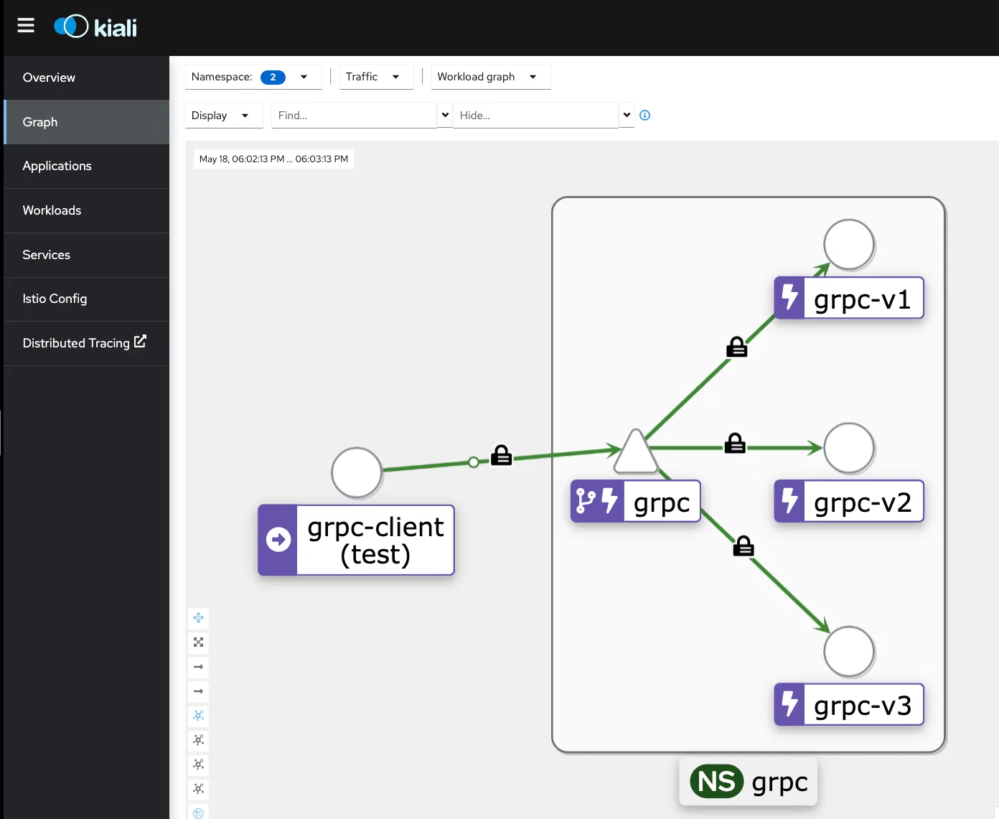
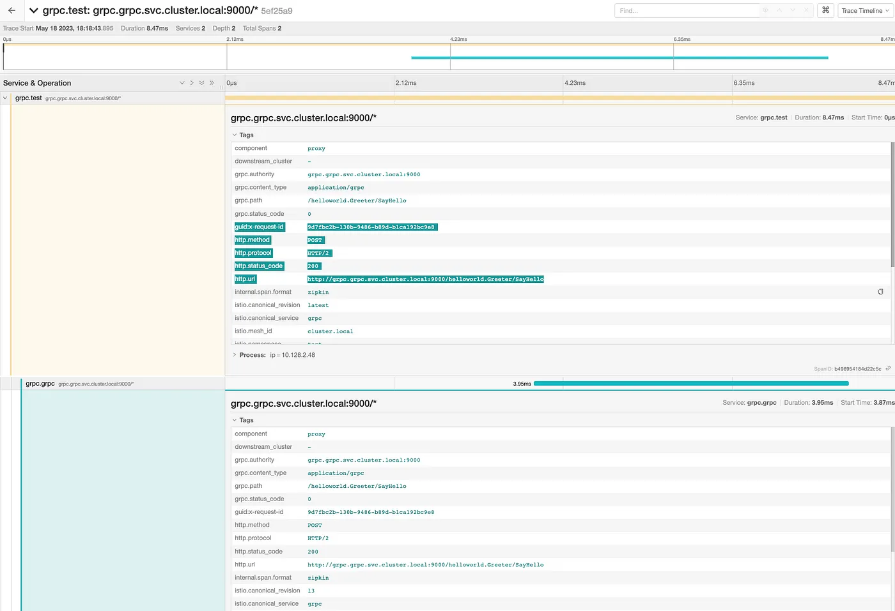
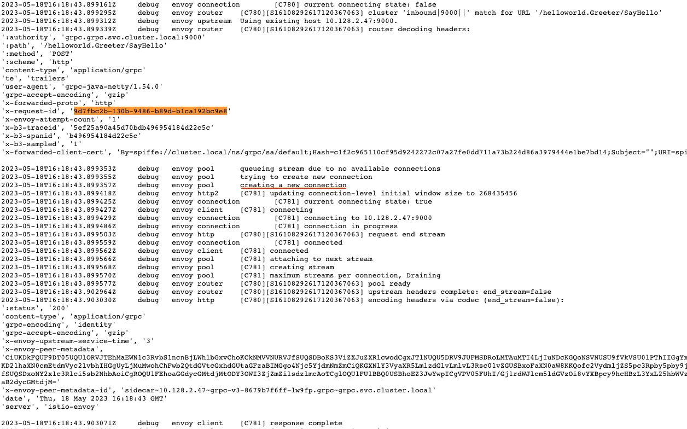
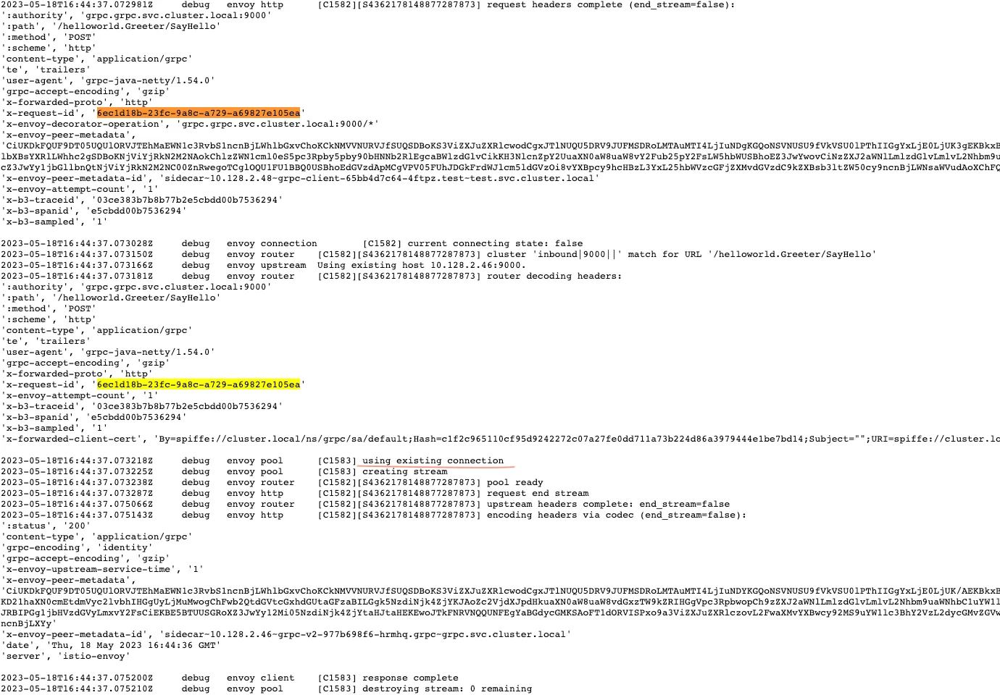

本文译自：<https://medium.com/@shrishs/understanding-grpc-load-balancing-in-kubernetes-with-istio-c6e71634724c>

> 摘要：本文介绍了在 Kubernetes 和 Istio 中使用 gRPC 负载均衡的行为。首先，通过创建命名空间、部署资源和配置文件来准备环境。然后，介绍了没有 Istio 的情况下，gRPC 服务的负载均衡行为。接下来，介绍了如何使用 Istio 创建虚拟服务和目标规则来实现负载均衡。还讨论了 ConnectionPoolSetting 对负载均衡行为的影响。最后，介绍了如何通过入口网关访问 gRPC 服务，并提供了验证步骤。

**[gRPC](https://en.wikipedia.org/wiki/GRPC)**（gRPC 远程过程调用）是一个跨平台的开源高性能远程过程调用（RPC）框架，使用 HTTP/2 进行传输。gRPC 相对于传统的 HTTP 机制具有诸多优势，例如在一个连接上多路复用多个请求（HTTP/2）。本文将解释在 Kubernetes（RedHat Openshift）和（Redhat Openshift Service Mesh）中结合使用时的行为。

## 环境准备

- 创建两个新的命名空间

```
oc new-project grpc
oc new-project test
```

- 在 grpc 命名空间部署所有与服务器相关的资源。本示例基于 Quarkus 的[gRPC 快速入门](https://quarkus.io/guides/grpc-getting-started)。
- 创建一个 ConfigMap。

```yaml
kind: ConfigMap
apiVersion: v1
metadata:
  name: grpcconfig
  namespace: grpc
data:
  application.properties: |
    numrequest: 25
    quarkus.grpc.clients.hello.host: grpc.grpc.svc.cluster.local
    teststring: prom
```

- 基于以下内容创建一个新的部署。

```yaml
kind: Deployment
apiVersion: apps/v1
metadata:
  name: grpc-v1
  namespace: grpc
  labels:
    app: grpc
spec:
  replicas: 1
  selector:
    matchLabels:
      app: grpc
  template:
    metadata:
      labels:
        app: grpc
        app.kubernetes.io/version: l1
      annotations:
        sidecar.istio.io/inject: 'true'
        sidecar.istio.io/logLevel: debug
    spec:
      volumes:
        - name: quarkus-config-volume
          configMap:
            name: grpcconfig
            defaultMode: 420
      containers:
        - name: custom-grpc-hello
          image: 'quay.io/shrishs/grpc-plain-text-quickstart-jvm'
          ports:
            - name: grpc
              containerPort: 9000
              protocol: TCP
          volumeMounts:
            - name: quarkus-config-volume
              mountPath: /deployments/config
      restartPolicy: Always
```

- 使用相同的配置创建另外两个部署 grpc-v2 和 grpc-v3，只需提供不同的版本。

```
app.kubernetes.io/version: l2
&
app.kubernetes.io/version: l3
```

- 基于上述部署创建一个 Kubernetes 服务。

```yaml
kind: Service
apiVersion: v1
metadata:
  name: grpc
  namespace: grpc
  labels:
    app: grpc
spec:
  ports:
    - name: grpc
      protocol: TCP
      port: 9000
      targetPort: 9000
  selector:
    app: grpc
```

- 在 test 命名空间中创建另一个 ConfigMap（如上所述）和名为 grpc-client 的部署（使用上述相同的定义）。它将用于调用名为 testString 的 gRPC 服务和 numRequest 在 ConfigMap 中定义。

```java
    @GET
    @Path("/grpc")
    public String testGRPC() throws InterruptedException
    {
            MyClient client = new MyClient(host, 9000);
            try {
                client.makeMultipleRequests(testString, numRequest);
            } finally {
                client.shutdown();
            }
            return "Hello";
        }
    public class MyClient {
        private final ManagedChannel channel;
        private final GreeterGrpc.GreeterBlockingStub blockingStub;

    public MyClient(String host, int port) {
        this(ManagedChannelBuilder.forAddress(host, port).usePlaintext().build());
    }

    private MyClient(ManagedChannel channel) {
        this.channel = channel;
        this.blockingStub = GreeterGrpc.newBlockingStub(channel);
    }

    public void shutdown() throws InterruptedException {
        channel.shutdown().awaitTermination(5, TimeUnit.SECONDS);
    }

    public void makeMultipleRequests(String name, int numRequests) {
        for (int i = 0; i < numRequests; i++) {
            HelloRequest request = HelloRequest.newBuilder().setName(name + i).build();
            HelloReply response = blockingStub.sayHello(request);
            System.out.println(response.getMessage());
        }
    }
```

## 没有 Istio 的 Kubernetes gRPC 服务

- 验证应用程序是否在 grpc 命名空间中运行。

```bash
bash-3.2$ oc -n grpc get pods -l app=grpc
NAME                       READY   STATUS    RESTARTS   AGE
grpc-v1-7cc77c5cfc-tfbhf   1/1     Running   0          9m15s
grpc-v2-977b698f6-rb9z6    1/1     Running   0          9m14s
grpc-v3-8679b7f6ff-hxx9c   1/1     Running   0          9m14s
```

- 从测试命名空间测试请求。

```
oc -n test exec deploy/grpc-client -- curl http://localhost:8080/hello/grpc
```

- 检查所有 Pod 的日志，可以观察到只有一个 Pod 收到了所有的请求。


上述行为的原因是gRPC构建在HTTP/2之上，而HTTP/2设计为具有单个持久的TCP连接，在该连接上所有请求都被*多路复用*，这意味着多个请求可以同时在同一个连接上进行。通常情况下，这是很好的，因为它减少了连接管理的开销。然而，这也意味着（可以想象）连接级别的负载均衡并不是非常有用。一旦连接建立完成，就没有更多的负载均衡可做了。所有请求将被固定到单个目标 Pod。

## 带有 Istio 的 Kubernetes gRPC 服务

- 创建虚拟服务。

```yaml
apiVersion: networking.istio.io/v1alpha3
kind: VirtualService
metadata:
  name: grpc-vs
  namespace: grpc
spec:
  hosts:
    - grpc.grpc.svc.cluster.local
  http:
    - route:
        - destination:
            host: grpc
            port:
              number: 9000
```

- 创建目标规则。

```yaml
apiVersion: networking.istio.io/v1alpha3
kind: DestinationRule
metadata:
  name: grpc-dr
  namespace: grpc
spec:
  host: grpc
  trafficPolicy:
    tls:
      mode: ISTIO_MUTUAL
    connectionPool:
      http:
        http1MaxPendingRequests: 1
        http2MaxRequests: 1
        maxRequestsPerConnection: 1
      tcp:
        maxConnections: 1
  subsets:
  - name: v1
    labels:
      app.kubernetes.io/version: l1
  - name: v2
    labels:
      app.kubernetes.io/version: l2
  - name: v3
    labels:
      app.kubernetes.io/version: l3
```

- 在 ServiceMeshMemberRoll 中添加 grpc 和 test 命名空间。

```yaml
apiVersion: maistra.io/v1
kind: ServiceMeshMemberRoll
metadata:
  name: default
  namespace: istio-system
spec:
  members:
    - grpc
    - test
```

- 重启 grpc 和 test 命名空间中的 Pod。现在 Envoy 代理作为 sidecar 附加。

```
bash-3.2$ oc -n grpc get pods -l app=grpc
NAME                       READY   STATUS    RESTARTS   AGE
grpc-v1-7cc77c5cfc-fm9m4   2/2     Running   0          33s
grpc-v2-977b698f6-hrmhq    2/2     Running   0          33s
grpc-v3-8679b7f6ff-lw9fp   2/2     Running   0          32s
bash-3.2$ oc -n test get pods -l app=grpc
NAME                           READY   STATUS    RESTARTS   AGE
grpc-client-65bb4d7c64-4ftpz   2/2     Running   0          37s
```

- 再次测试服务。

```
oc -n test exec deploy/grpc-client -- curl http://localhost:8080/hello/grpc
```

- 在 Kiali 中验证图表。现在可以观察到负载均衡在所有 3 个 Pod 之间进行。



上述行为的原因是，Istio（Envoy 代理）会对每个目标（所有 3 个 Pod）打开一个 HTTP/2 连接，并将请求*分流*到这些连接上。

- 在 Jaeger 中进行验证。



## ConnectionPoolSetting

可以使用 DestinationRule ConnectionPool 设置来改变负载均衡的行为。

- 从上述跟踪中获取请求 ID，并在 Istio 代理日志中查找。



观察上面的行（创建新连接）。这是因为在 DestinationRule ConnectionPool 设置中 (**http2MaxRequests**和**maxRequestPerConnection**被定义为 1)。每个请求都会创建一个新的连接，并在请求完成后关闭连接。

- 更改 DestinationRule ConnectionPool 设置 (**http2MaxRequests: 50, maxRequestsPerConnection: 100**)

```yaml
spec:
  host: grpc
  trafficPolicy:
    tls:
      mode: ISTIO_MUTUAL
    connectionPool:
      http:
        http1MaxPendingRequests: 1
        http2MaxRequests: 50
        maxRequestsPerConnection: 100
      tcp:
        maxConnections: 1
```

- 再次测试服务

```
oc -n test exec deploy/grpc-client -- curl http://localhost:8080/hello/grpc
```

- 从 Jaeger 中获取请求 ID，并查看 Envoy 代理日志。现在，我们每个连接的请求数大于 1，它将使用**现有连接**来处理请求。



## 通过入口网关访问 gRPC 服务

Openshift 使用 HAProxy 作为入口控制器，默认情况下未启用 HTTP2。可以按如下方式[启用](https://docs.openshift.com/container-platform/4.12/networking/ingress-operator.html#nw-http2-haproxy_configuring-ingress)。

```
oc annotate ingresses.config/cluster ingress.operator.openshift.io/default-enable-http2=true
```

- 启用HAProxy的HTTP/2后，使用[互相 TLS](https://istio.io/latest/docs/tasks/traffic-management/ingress/secure-ingress/#configure-a-mutual-tls-ingress-gateway)创建一个网关定义。

```yaml
apiVersion: networking.istio.io/v1alpha3
kind: Gateway
metadata:
  name: grpc-gateway
  namespace: grpc
spec:
  selector:
    istio: ingressgateway
  servers:
  - hosts:
    - grpc-istio-system.apps.ocp-XXX.com
    port:
      number: 443
      protocol: https
      name: HTTPS
    tls:
      mode: MUTUAL
      credentialName: istio-ingressgateway-certs
```

- Openshift Service Mesh 会自动创建一个经过路由定义。

```yaml
kind: Route
apiVersion: route.openshift.io/v1
metadata:
  name: grpc-grpc-gateway
  namespace: istio-system
  labels:
    maistra.io/gateway-name: grpc-gateway
    maistra.io/gateway-namespace: grpc
    maistra.io/generated-by: ior
  annotations:
    maistra.io/original-host: grpc-istio-system.apps.ocp-XXX.com
spec:
  host: grpc-istio-system.apps.ocp-XXX.com
  to:
    kind: Service
    name: istio-ingressgateway
    weight: 100
  port:
    targetPort: https
  tls:
    termination: passthrough
  wildcardPolicy: None
```

- 验证 gRPC 服务是否正常工作。

```bash
$ grpcurl --proto helloworld.proto -v  --insecure --cert istio/files/cert/client.example.com.crt --key istio/files/cert/client.example.com.key -d '{"name": "test"}' grpc-istio-system.apps.ocp-XXX.com:443 helloworld.Greeter/SayHello

Resolved method descriptor:
// Sends a greeting
rpc SayHello ( .helloworld.HelloRequest ) returns ( .helloworld.HelloReply );

Request metadata to send:
(empty)

Response headers received:
content-type: application/grpc
date: Fri, 19 May 2023 15:40:14 GMT
grpc-accept-encoding: gzip
server: istio-envoy
x-envoy-upstream-service-time: 12

Response contents:
{
  "message": "Hello test"
}

Response trailers received:
(empty)
Sent 1 request and received 1 response
```

**注意**：有时由于定义未在 envoy 代理中同步，可能无法正常工作。在这种情况下，请重新启动入口网关。

```
oc -n istio-system delete pod -l app=istio-ingressgateway
```

- 在 Kiali 中进行验证。


