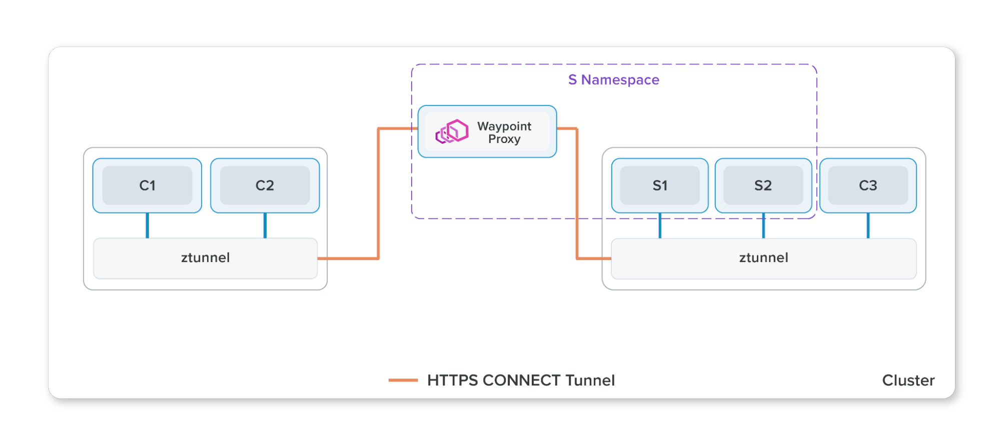
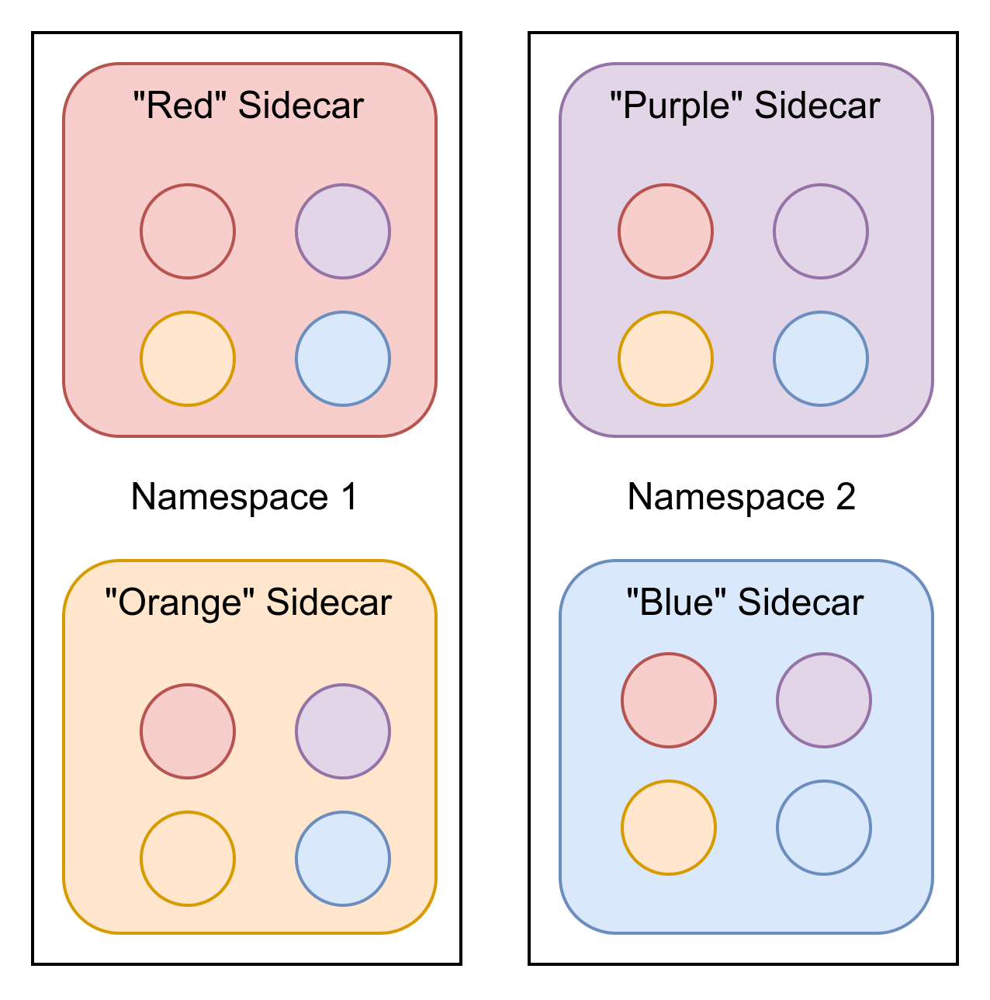
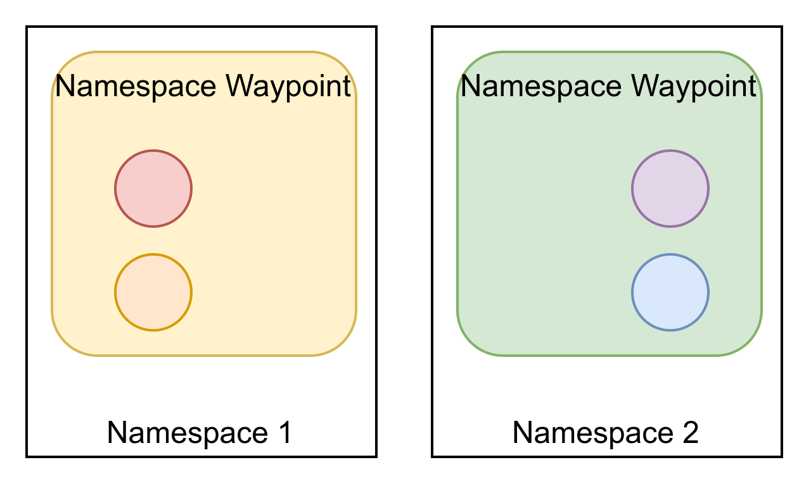

> 译者注：本文介绍了 Istio 的新的目的地导向的 waypoint 代理，它可以简化和扩展 Istio 的功能。文章介绍了 waypoint 代理的架构，部署方式，以及如何将源代理的配置转移到目的地代理，从而提高可扩展性，可调试性，一致性和安全性。文章还展示了如何使用 Istio 的策略和遥测来管理和监控 waypoint 代理。文章的来源是 Istio 官方博客。

Ambient 将 Istio 的功能分为两个不同的层，一个安全覆盖层和一个七层流量处理层。Waypoint 代理是一个可选组件，它基于 Envoy 并为其管理的工作负载进行七层流量处理。自 2022 年[首次启动 Ambient](https://istio.io/latest/blog/2022/introducing-ambient-mesh/) 以来，我们进行了重大更改以简化路点配置、可调试性和可扩展性。

## Waypoint 代理的架构

与 sidecar 类似，waypoint 代理也是基于 Envoy 的，由 Istio 动态配置以服务于您的应用程序。Waypoint 代理的独特之处在于它运行每个命名空间（默认）或每个服务账户。通过在应用程序 pod 之外运行，waypoint 代理可以独立于应用程序安装、升级和扩展，并降低运营成本。



使用 Kubernetes Gateway 资源或 `istioctl` 命令以声明方式部署 waypoint 代理：

```bash
$ istioctl experimental waypoint generate

apiVersion: gateway.networking.k8s.io/v1beta1
kind: Gateway
metadata:
  name: namespace
spec:
  gatewayClassName: istio-waypoint
  listeners:
  - name: mesh
    port: 15008
    protocol: HBONE
```

Istiod 将监控这些资源并自动为用户部署和管理相应的 waypoint 部署。

## 将源代理配置转移到目标代理

在现有的 sidecar 架构中，大多数流量整形（例如[请求路由](https://istio.io/latest/docs/tasks/traffic-management/request-routing/)或[流量转移](https://istio.io/latest/docs/tasks/traffic-management/traffic-shifting/)或[故障注入](https://istio.io/latest/docs/tasks/traffic-management/fault-injection/)）策略由源（客户端）代理实现，而大多数安全策略由目标（服务器）代理实现。这导致了一些担忧：

- 缩放 —— 每个源 sidecar 都需要知道关于网格中每个其他目的地的信息。这是一个多项式缩放问题。更糟糕的是，如果任何目标配置发生变化，我们需要立即通知所有 sidecar。
- 调试 —— 因为策略执行在客户端和服务器 sidecar 之间分开，所以在故障排除时很难理解系统的行为。
- 混合环境 —— 如果我们的系统不是所有客户端都是网格的一部分，我们就会得到不一致的行为。例如，非网格客户端不会遵守金丝雀部署策略，从而导致意外的流量分配。
- 所有权和归属 —— 理想情况下，在一个命名空间中编写的策略应该只影响在同一命名空间中运行的代理。然而，在这个模型中，它是由每个 sidecar 分发和执行的。尽管 Istio 已围绕此约束进行设计以确保其安全，但它仍然不是最佳选择。

在 Ambient 中，所有策略都由目的地 waypoint 代理强制执行。在许多方面，waypoint 充当进入命名空间（默认范围）或服务账户的网关。Istio 强制所有进入命名空间的流量都经过 waypoint，然后该 waypoint 执行该命名空间的所有策略。因此，每个 waypoint 只需要了解其自己命名空间的配置。

可扩展性问题对于在大型集群中运行的用户来说尤其麻烦。如果我们将其可视化，我们可以看到新架构的改进有多大。

考虑一个简单的部署，我们有 2 个命名空间，每个命名空间有 2 个（颜色编码）部署。对 sidecar 进行编程所需的 Envoy (XDS) 配置显示为圆圈：



在 sidecar 模型中，我们有 4 个工作负载，每个工作负载有 4 组配置。如果这些配置中的任何一个发生更改，则所有这些配置都需要更新。总共有 16 个配置分布。

然而，在 waypoint 架构中，配置得到了极大的简化：



在这里，我们看到了一个截然不同的故事。我们只有 2 个 waypoint 代理，因为每个代理都能够为整个命名空间提供服务，并且每个代理只需要为自己的命名空间进行配置。总的来说，我们发送了 25% 的配置，即使是一个简单的例子。

如果我们将每个命名空间扩展到最多 25 个部署，每个部署有 10 个 pod，每个 waypoint 部署有 2 个 pod 以实现高可用性，这些数字会更令人印象深刻 —— waypoint 配置分布只需要 sidecar 配置分布的 0.8%，如表下面说明！

| 配置分发         | 命名空间 1                 | 命名空间 2                 | 总数  |
| ---------------- | -------------------------- | -------------------------- | ----- |
| Sidecar          | 25 种配置 * 250 个 sidecar | 25 种配置 * 250 个 sidecar | 12500 |
| Waypoint         | 25 种配置 * 2 个 waypoint  | 25 种配置 * 2 个 waypoint  | 100   |
| Waypoint/Sidecar | 0.8%                       | 0.8%                       | 0.8%  |

虽然我们使用命名空间范围的 waypoint 代理来说明上面的简化，但当您将其应用于服务账户 waypoint 代理时，简化是相似的。

这种减少的配置意味着控制平面和数据平面的资源使用率（CPU、RAM 和网络带宽）较低。虽然今天的用户可以通过谨慎使用 `exportTo` Istio 网络资源或 [Sidecar](https://istio.io/latest/docs/reference/config/networking/sidecar/) API 看到类似的改进，但在 Ambient 模式下不再需要这样做，从而使扩展变得轻而易举。

## 如果我的目的地没有 waypoint 代理怎么办？

Ambient 模式的设计围绕这样一个假设，即大多数配置最好由服务生产者而不是服务消费者实施。然而，情况并非总是如此 —— 有时我们需要为我们无法控制的目的地配置流量管理。一个常见的例子是连接到具有更高弹性的外部服务，以处理偶尔的连接问题（例如，为 `example.com` 调用添加超时）。

这是社区中正在积极开发的一个领域，我们在其中设计如何将流量路由到您的出口网关，以及您如何使用所需的策略配置出口网关。留意这方面的未来博客文章！

## 深入了解 waypoint 代理配置

假设您已遵循 [Ambient 入门指南](http://preliminary.istio.io/latest/docs/ops/ambient/getting-started/)直至并包括[控制流量部分](http://preliminary.istio.io/latest/docs/ops/ambient/getting-started/#control)，您已经为 bookinfo-reviews 服务账户部署了一个 waypoint 代理，以将 90% 的流量引导至 reviews v1，将 10% 的流量引导至 reviews v2。

使用 `istioctl`检索 `reviews` waypoint 代理的监听器：

```bash
$ istioctl proxy-config listener deploy/bookinfo-reviews-istio-waypoint --waypoint

LISTENER              CHAIN                                                 MATCH                                         DESTINATION
envoy://connect_originate                                                       ALL                                           Cluster: connect_originate
envoy://main_internal inbound-vip|9080||reviews.default.svc.cluster.local-http  ip=10.96.104.108 -> port=9080                 Inline Route: /*
envoy://main_internal direct-tcp                                            ip=10.244.2.14 -> ANY                         Cluster: encap
envoy://main_internal direct-tcp                                            ip=10.244.1.6 -> ANY                          Cluster: encap
envoy://main_internal direct-tcp                                            ip=10.244.2.11 -> ANY                         Cluster: encap
envoy://main_internal direct-http                                           ip=10.244.2.11 -> application-protocol='h2c'  Cluster: encap
envoy://main_internal direct-http                                           ip=10.244.2.11 -> application-protocol='http/1.1' Cluster: encap
envoy://main_internal direct-http                                           ip=10.244.2.14 -> application-protocol='http/1.1' Cluster: encap
envoy://main_internal direct-http                                           ip=10.244.2.14 -> application-protocol='h2c'  Cluster: encap
envoy://main_internal direct-http                                           ip=10.244.1.6 -> application-protocol='h2c'   Cluster: encap
envoy://main_internal direct-http                                           ip=10.244.1.6 -> application-protocol='http/1.1'  Cluster: encap
envoy://connect_terminate default                                               ALL                                           Inline Route:
```

对于到达端口 `15008` 的请求，默认为 Istio 的入站 HBONE 端口，waypoint 代理终止 HBONE 连接并将请求转发到 `main_internal` 监听器以执行任何工作负载策略，如 AuthorizationPolicy。如果您不熟悉[内部监听器](https://www.envoyproxy.io/docs/envoy/latest/configuration/other_features/internal_listener)，它们是 Envoy 监听器，可以接受用户空间连接，而不使用系统网络 API。以上添加到 `istioctl proxy-config` 命令的 `--waypoint` 标志指示它显示 `main_internal` 监听器的详细信息、其过滤器链、链匹配和目标。

注意 `10.96.104.108` 是 reviews 服务 VIP，而 `10.244.x.x` 是 reviews v1/v2/v3 pod IP，您可以使用 `kubectl get svc,pod -o wide` 命令查看集群。对于纯文本或 HBONE 终止的入站流量，它将匹配服务 VIP 和端口 9080 以供 reviews 使用，或者通过 pod IP 地址和应用程序协议（ANY、h2c 或 http/1.1）。

检查 reviews waypoint 代理的集群，您会得到 `main_internal` 集群以及一些入站集群。除了基础架构的集群之外，创建的唯一 Envoy 集群是运行在同一服务账户中的服务和 pod 的集群。没有为其他地方运行的服务或 pod 创建集群。

```bash
$ istioctl proxy-config clusters deploy/bookinfo-reviews-istio-waypoint

SERVICE FQDN                         PORT SUBSET  DIRECTION   TYPE         DESTINATION RULE
agent                                -    -       -           STATIC
connect_originate                    -    -       -           ORIGINAL_DST
encap                                -    -       -           STATIC
kubernetes.default.svc.cluster.local 443  tcp     inbound-vip EDS
main_internal                        -    -       -           STATIC
prometheus_stats                     -    -       -           STATIC
reviews.default.svc.cluster.local    9080 http    inbound-vip EDS
reviews.default.svc.cluster.local    9080 http/v1 inbound-vip EDS
reviews.default.svc.cluster.local    9080 http/v2 inbound-vip EDS
reviews.default.svc.cluster.local    9080 http/v3 inbound-vip EDS
sds-grpc                             -    -       -           STATIC
xds-grpc                             -    -       -           STATIC
zipkin                               -    -       -           STRICT_DNS
```

请注意列表中没有 `outbound` 集群，您可以使用 `istioctl proxy-config cluster deploy/bookinfo-reviews-istio-waypoint --direction outbound` 进行确认！很好的一点是，您不需要在任何其他 bookinfo 服务（例如`productpage` 或 `ratings` 服务）上配置 `exportTo`。换句话说，`reviews` waypoint 不会意识到任何不必要的集群，而您不需要进行任何额外的手动配置。

显示 `reviews` waypoint 代理的路由列表：

```bash
$ istioctl proxy-config routes deploy/bookinfo-reviews-istio-waypoint

NAME                                                    DOMAINS MATCH              VIRTUAL SERVICE
encap                                                   *       /*
inbound-vip|9080|http|reviews.default.svc.cluster.local *       /*                 reviews.default
default
```

回顾下，您没有配置任何 sidecar 资源或 Istio 网络资源上的 `exportTo` 配置。但是，您部署了 `bookinfo-productpage` 路由来配置入口网关以路由到 productpage，但 reviews waypoint 没有意识到任何此类不相关的路由。

显示 `inbound-vip|9080|http|reviews.default.svc.cluster.local` 路由的详细信息，您会看到基于权重的路由配置将 90％的流量定向到 `reviews` v1，将 10％的流量定向到 `reviews` v2，以及一些 Istio 的默认重试和超时配置。这证实了之前讨论的流量和弹性策略从源头转移到目标导向的 waypoint。

```bash
$ istioctl proxy-config routes deploy/bookinfo-reviews-istio-waypoint --name "inbound-vip|9080|http|reviews.default.svc.cluster.local" -o yaml

- name: inbound-vip|9080|http|reviews.default.svc.cluster.local
 validateClusters: false
 virtualHosts:
 - domains:
   - '*'
   name: inbound|http|9080
   routes:
   - decorator:
       operation: reviews:9080/*
     match:
       prefix: /
     metadata:
       filterMetadata:
         istio:
           config: /apis/networking.istio.io/v1alpha3/namespaces/default/virtual-service/reviews
     route:
       maxGrpcTimeout: 0s
       retryPolicy:
         hostSelectionRetryMaxAttempts: "5"
         numRetries: 2
         retriableStatusCodes:
         - 503
         retryHostPredicate:
         - name: envoy.retry_host_predicates.previous_hosts
           typedConfig:
             '@type': type.googleapis.com/envoy.extensions.retry.host.previous_hosts.v3.PreviousHostsPredicate
         retryOn: connect-failure,refused-stream,unavailable,cancelled,retriable-status-codes
       timeout: 0s
       weightedClusters:
         clusters:
         - name: inbound-vip|9080|http/v1|reviews.default.svc.cluster.local
           weight: 90
         - name: inbound-vip|9080|http/v2|reviews.default.svc.cluster.local
           weight: 10
```

检查`reviews` waypoint 代理的端点：

```bash
$ istioctl proxy-config endpoints deploy/bookinfo-reviews-istio-waypoint

ENDPOINT                                            STATUS  OUTLIER CHECK CLUSTER
127.0.0.1:15000                                     HEALTHY OK            prometheus_stats
127.0.0.1:15020                                     HEALTHY OK            agent
envoy://connect_originate/                          HEALTHY OK            encap
envoy://connect_originate/10.244.1.6:9080           HEALTHY OK            inbound-vip|9080|http/v2|reviews.default.svc.cluster.local
envoy://connect_originate/10.244.1.6:9080           HEALTHY OK            inbound-vip|9080|http|reviews.default.svc.cluster.local
envoy://connect_originate/10.244.2.11:9080          HEALTHY OK            inbound-vip|9080|http/v1|reviews.default.svc.cluster.local
envoy://connect_originate/10.244.2.11:9080          HEALTHY OK            inbound-vip|9080|http|reviews.default.svc.cluster.local
envoy://connect_originate/10.244.2.14:9080          HEALTHY OK            inbound-vip|9080|http/v3|reviews.default.svc.cluster.local
envoy://connect_originate/10.244.2.14:9080          HEALTHY OK            inbound-vip|9080|http|reviews.default.svc.cluster.local
envoy://main_internal/                              HEALTHY OK            main_internal
unix://./etc/istio/proxy/XDS                        HEALTHY OK            xds-grpc
unix://./var/run/secrets/workload-spiffe-uds/socket HEALTHY OK            sds-grpc
```

请注意，您不会获得与 reviews 以外的任何服务相关的任何端点，即使您在 `default` 和 `istio-system` 命名空间中还有一些其他服务。

## 总结

我们对专注于面向目的地的 waypoint 代理的简化感到非常兴奋。这是朝着简化 Istio 的可用性、可扩展性和可调试性迈出的又一重要步骤，这些是 Istio 路线图上的重中之重。按照我们的[入门指南](http://preliminary.istio.io/latest/docs/ops/ambient/getting-started/)立即尝试环境 alpha 构建并体验简化的 waypoint 代理！
