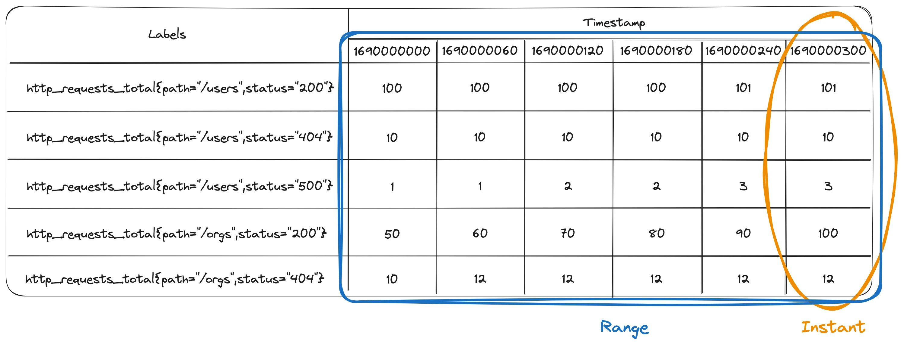
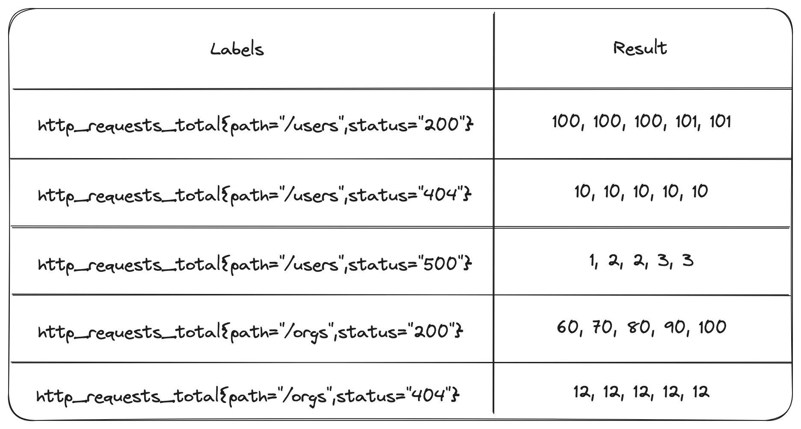
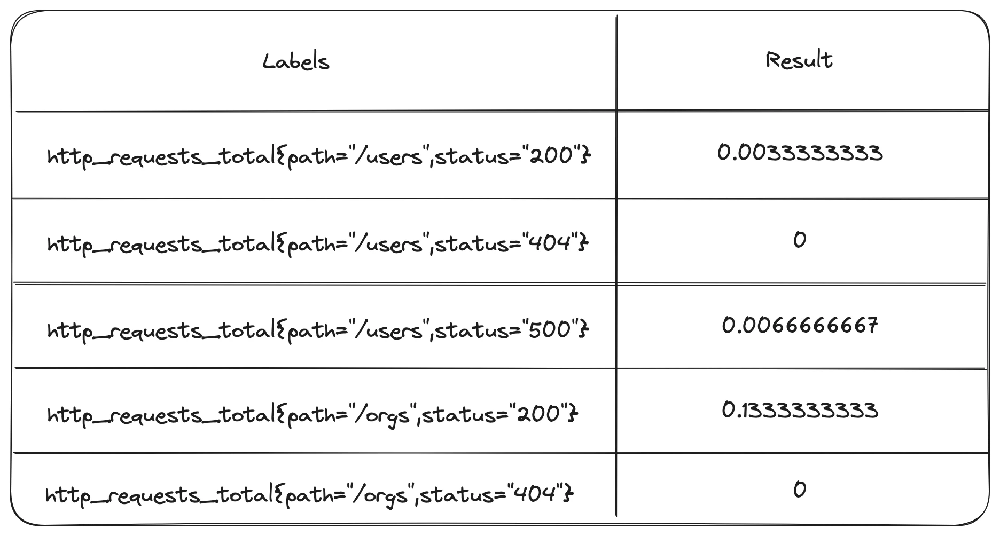
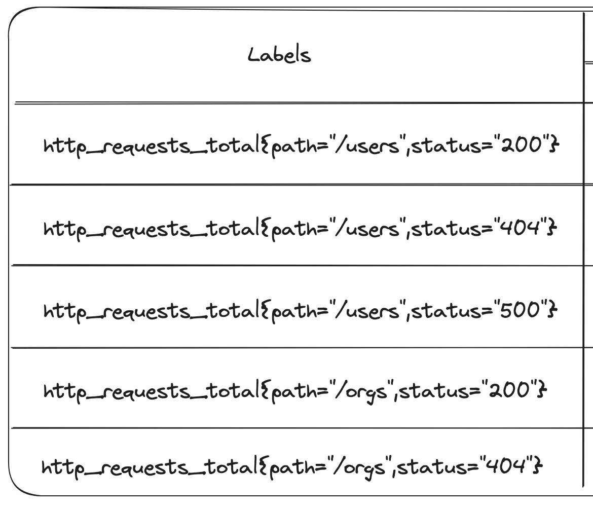
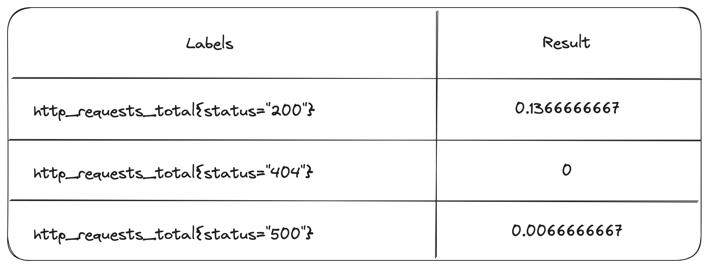

本文译自：<https://fiberplane.com/blog/why-are-prometheus-queries-hard>

Prometheus 是一个强大的开源可观测性工具。但是许多人，包括我自己，都很难理解其查询语言。在这篇文章中，我将从头开始建立一个基本的查询，并使用每个步骤来解释 PromQL 中一些较难理解的方面。希望这能更直观地展示 Prometheus 的工作原理，帮助你编写查询并理解数据。

**关于[Autometrics](https://autometrics.dev/)项目的一个快速介绍：它是一个开源微型框架，使你可以轻松地为代码添加最有用的指标，并为你编写 Prometheus 查询。无需手动编写查询，即可在生产环境中识别和调试问题！**

## 用“简单”的查询回答问题

假设我们正在运行一个 HTTP API，并且我们想了解用户遇到错误的频率。这似乎是一个简单的问题，对吧？

为了从 Prometheus 中获取这个答案，我们需要进行类似以下的查询，其中已经涉及了很多内容：

```
sum by (status) (rate(http_requests_total[5m]))
```

为了理解为什么这个查询有效，以及为什么我们需要这个查询，我们需要深入了解 Prometheus 如何存储数据以及一些关键的 PromQL 功能。在接下来的几节中，我们将逐步构建这个查询，同时花时间理解每个部分的作用以及为什么它是必要的。

## 计数器主要是递增的

Prometheus 最重要且最令人困惑的一个方面是，它跟踪的大多数值都是递增的。Prometheus 不会存储每个小时间段发生的事件数量。相反，它跟踪的是随着时间累积的总数。这既是 Prometheus 效率的来源，也是在编写查询时造成困惑的主要原因之一。

当你在应用程序中创建一个计数器时，它将使用内存中存储的一个简单数字来跟踪事件发生的总次数。Prometheus 每隔几秒钟抓取这些数据并存储它所观察到的总数。如果你想要计算在特定时间段内事件发生的次数，你需要编写一个查询，从 Prometheus 实际存储的累积总数中提取这些信息（我们将在下面详细介绍）。

为了说明这一点和后续的内容，有一个有关 Prometheus 内部数据的心智模型是很有用的。下面是一个简化的图片，显示了一个跟踪服务的 HTTP 请求总数的计数器。请注意，每个计数器的值在不同的时间段内要么增加，要么保持不变。


每个时间点上，我们看到的是自开始以来到该时间点的 HTTP 请求的*总数*，而不是自上次观察以来的请求数量。

为什么我们说计数器“主要”是递增的，而不是总是递增的？因为有重新启动和崩溃的情况。如果你的服务由于任何原因重新启动，它在内存中存储的计数器值将被重置为零，并重新开始计数。PromQL 具有处理计数器重置的特殊函数，因此你的派生统计数据是正确的。

现在我们知道计数器主要是递增的，我们可以开始查询数据并利用它。

## 即时向量和范围向量

PromQL 有两种主要类型的数据：即时向量和范围向量 - 这两个术语让我的眼睛立刻变得模糊。

下面是即时向量和范围向量之间的区别的示例。即时向量以橙色显示，是一个时间点上的值的快照。范围向量以蓝色显示，每个系列的每个时间点都有一个值。



为什么我们有两种类型的向量呢？如果要绘制图形，你需要一个即时向量，因为图形每个时间点只能显示一个值。然而，你很少想绘制随时间累积的事件总数。相反，你经常希望绘制随时间变化的事件速率，为此需要将统计函数应用于一系列数据，以计算每个时间点要显示的值。这就是范围向量的用途。

让我们看一下如何开始构建一个查询，这也展示了查询中微小差异如何改变我们是在使用即时向量还是范围向量。

如果我们将以下查询发送到 Prometheus，我们将获得以下即时向量。请注意，它只是上面表格中的最后一列数据。

```
http_requests_total
```


此查询返回一个范围向量，显示每个系列的最后 5 分钟数据：

```
http_requests_total[5m]
```



这些数据有什么用？这就引出了我们的下一个主题。

## 为什么通常需要使用`rate`

我们之前提到，计数器会跟踪随时间累积的总数，但我们经常希望看到显示特定时间点上发生了多少事件的图形。这就是速率的用途。

速率函数显示在一定时间范围内计算出的每秒平均事件数量。`一定时间范围`就是范围向量的用途。

```
rate(http_requests_total[5m])
```



这些数字看起来突然变得更加复杂，但第一个值只是表示在 5 分钟窗口内发生了一个事件：


现在，如果我们将此查询绘制成图表而不是查看表格视图，图表上的每个点将是给定时间点每秒发生的请求数。这更接近我们实际关心的内容。

`rate`函数还处理计数器重置。因此，如果你的服务崩溃，Prometheus 观察到计数器从 1000 变为 5，它将使用在这些抓取之间发生了 5 个事件的事实来计算速率。

## 标签集和通常需要使用`sum by`

在继续构建我们的查询之前，重要的是花一点时间了解 Prometheus 标签。Prometheus 为每个唯一的标签值组合存储一个单独的时间序列。

在我们的示例表中，我们有带有`path`和`status`标签的计数器`http_requests_total`。对于每个`path`和`status`的组合，我们为每个时间戳存储一个计数器值。



（这也是为什么人们经常谈论“标签基数问题”或[“基数爆炸”](https://blog.cloudflare.com/how-cloudflare-runs-prometheus-at-scale/#metrics-cardinality)。你对给定标签的每个新值都需要存储一个新的时间序列。如果存储的标签变化太大，例如用户 ID，你将创建过多的时间序列并导致 Prometheus 数据库膨胀。）

在查询数据时，我们通常关心其中一些标签维度，而不关心其他标签。在 PromQL 中，`sum by (label1, label2，…)`按你指定的标签对时间序列进行分组，并使用`sum`函数将系列合并在一起（类似于 SQL 中的`GROUP BY`）。

回到我们的示例表，我们只有两个标签：`path`和`status`。如果我们想查看每个`path`的每秒请求数，而忽略`status`，我们将使用以下查询：

```
sum by (path) (rate(http_requests_total[5m]))
```

在实际的 Prometheus 部署中，我们通常有更多的标签。例如，Prometheus 会自动添加作业（job）和实例（instance）标签来标识它正在抓取的每个唯一目标。然而，我们可能不关心针对服务的每个实例单独查看指标，因此我们需要使用我们关心的标签进行求和，让 Prometheus 对其余部分进行求和。

最后，这使我们回到了最初的查询。如果我们想查看返回不同 HTTP 状态代码的请求数，而与路径无关，我们可以使用此查询，并会看到以下结果：

```
sum by (status) (rate(http_requests_total[5m]))
```



`sum by (labels) (rate(metric[5m]))`这种构造方式非常有用，值得记住。

不幸的是，除了与 PromQL 相关的特定问题之外，还有许多重要问题需要注意。

## 我是否在查看正确的数据？

工程师经常遇到的另外两个挑战与查询语言本身无关。

首先，应该使用哪些指标来回答特定的问题？组织可能有数千个指标，如果没有经验，很难知道有哪些可用，并且哪些可能有助于调查特定类型的问题。预先构建的仪表板和查询可能会在一定程度上帮助，但许多组织也面临一个问题，即有太多的仪表板，人们不知道该看哪个。

第二个甚至更为严重的问题是，你编写的查询是否显示了你认为它显示的内容。你可能会花费很多时间编写查询，并最终得到正确的语法。但它是否在统计上是正确的？从根本上说，Prometheus 不知道。这些时间序列只是一堆附带字符串标签的数字。Prometheus 不知道不同指标的含义，因此无法帮助你编写好的查询或告诉你所查看的图形是否回答了你的实际问题。这尤其危险，因为错误的查询可能会让你在调试事故时陷入无用的路径，或者可能会建议一种实际上无法解决问题的修复方法。

## 结论：PromQL 查询很难

编写好的查询需要对系统的了解，对查询语言语法的理解，甚至还需要一些统计知识。在本文中，我们只是浅尝辄止！所有这些都很难掌握，绝对不是你希望在服务崩溃并且用户在抱怨时学习的内容。在任何查询语言中编写查询都很困难，PromQL 也不例外。

## Autometrics 为你编写 PromQL

在 Fiberplane 为 DevOps 和站点可靠性工程师制作协作笔记本时，我们一直听到工程师说“查询很难”。这就是我们创建开源项目 Autometrics 的动机。

[Autometrics](https://autometrics.dev/)基于现有的 Prometheus 和 OpenTelemetry 客户端库，并使你的代码中的函数使用最有用的指标（请求速率、错误率和延迟）非常简单。它[标准化这些指标](https://fiberplane.com/blog/the-case-for-function-level-metrics)，然后根据函数详细信息为你构建强大的 PromQL 查询。这改进了对代码的仪表化体验，并极大地简化了在生产环境中识别和调试问题的过程。

如果你正在使用 Prometheus，但不喜欢手动编写查询，请尝试将其添加到你的项目之一！它现在可用于 Rust、Go、Python、TypeScript 和 C#。
