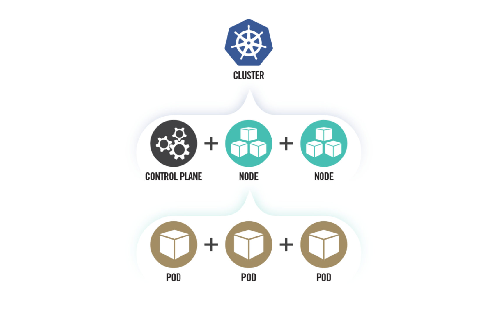
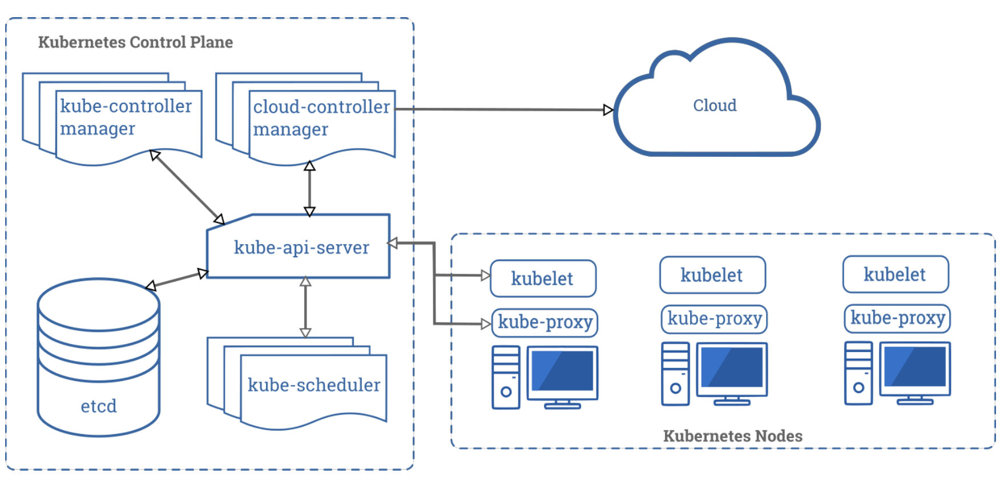
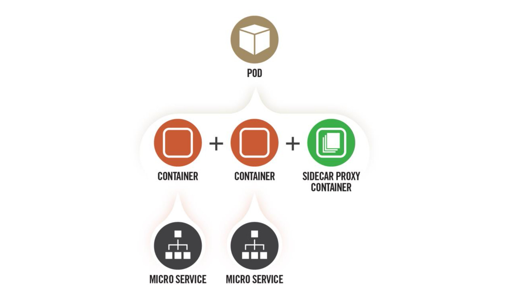
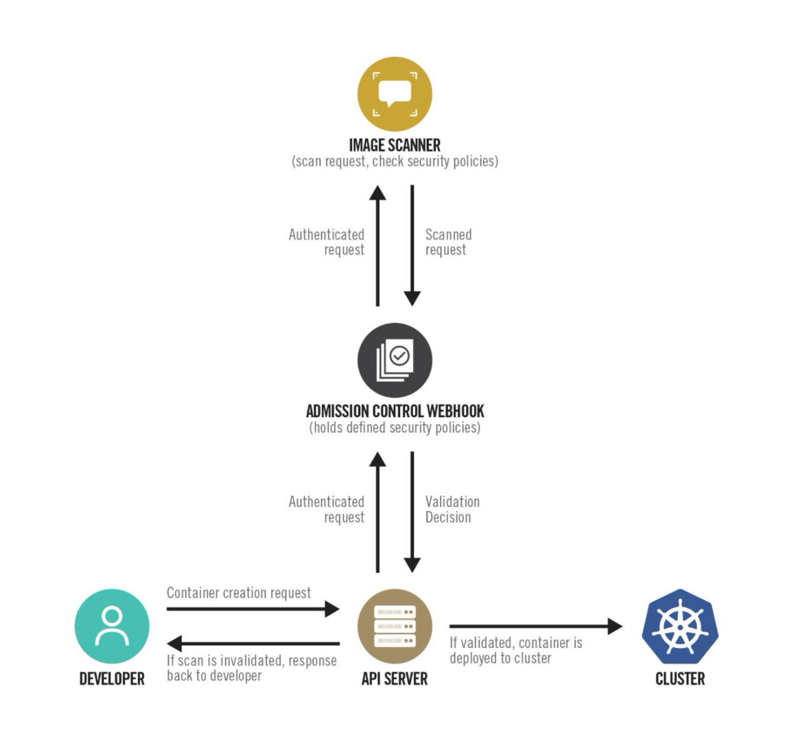
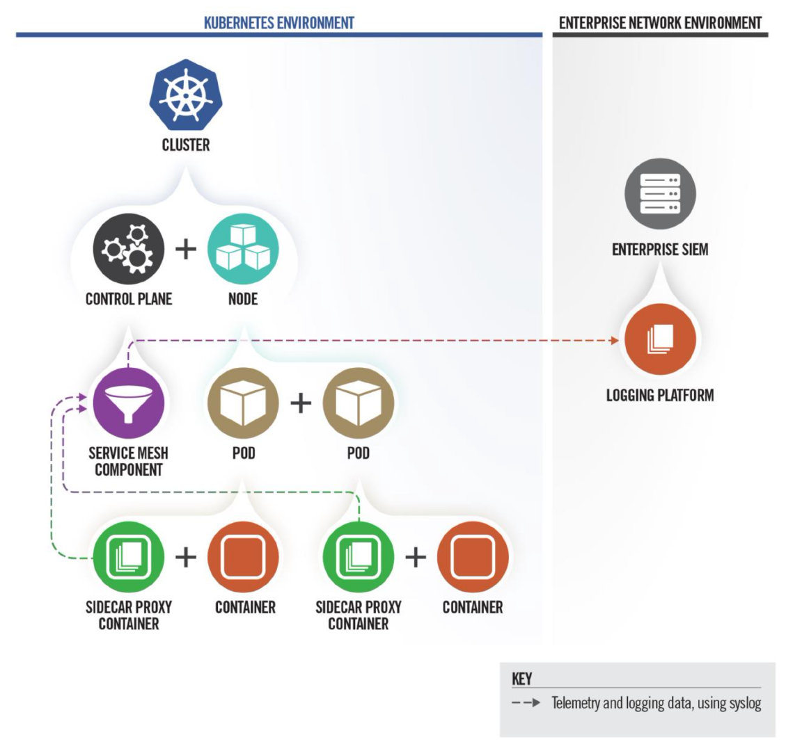

# Kubernetes Hardening Guidance

National Security Agency Cybersecurity and Infrastructure Security Agency

Cybersecurity Technical Report

## Notices and history

**Document change history**

August 2021 1.0 Initial release

**Disclaimer of warranties and endorsement**

The information and opinions contained in this document are provided "as is" and without any warranties or guarantees. Reference herein to any specific commercial products, process, or service by trade name, trademark, manufacturer, or otherwise, does not necessarily constitute or imply its endorsement, recommendation, or favoring by the United States Government, and this guidance shall not be used for advertising or product endorsement purposes.

**Trademark recognition**

Kubernetes is a registered trademark of The Linux Foundation. ▪ SELinux is a registered trademark of the National Security Agency. ▪ AppArmor is a registered trademark of SUSE LLC. ▪ Windows and Hyper-V are registered trademarks of Microsoft Corporation. ▪ ETCD is a registered trademark of CoreOS, Inc. ▪ Syslog-ng is a registered trademark of One Identity Software International Designated Activity Company. ▪ Prometheus is a registered trademark of The Linux Foundation. ▪ Grafana is a registered trademark of Raintank, Inc. dba Grafana Labs ▪ Elasticsearch and ELK Stack are registered trademarks of Elasticsearch B.V.

**Copyright recognition**

Information, examples, and figures in this document are based on Kubernetes Documentation by The Kubernetes Authors, published under a Creative Commons Attribution 4.0 license.

## Publication information

**Author(s)**

National Security Agency (NSA) Cybersecurity Directorate Endpoint Security

Cybersecurity and Infrastructure Security Agency (CISA)

**Contact information**

Client Requirements / General Cybersecurity Inquiries:
Cybersecurity Requirements Center, 410-854-4200, Cybersecurity_Requests@nsa.gov

Media inquiries / Press Desk:
 Media Relations, 443-634-0721, MediaRelations@nsa.gov

For incident response resources, contact CISA at CISAServiceDesk@cisa.dhs.gov.

**Purpose**

NSA and CISA developed this document in furtherance of their respective cybersecurity missions, including their responsibilities to develop and issue cybersecurity specifications and mitigations. This information may be shared broadly to reach all appropriate stakeholders.

## Executive summary

Kubernetes® is an open-source system that automates the deployment, scaling, and management of applications run in containers, and is often hosted in a cloud environment. Using this type of virtualized infrastructure can provide several flexibility and security benefits compared to traditional, monolithic software platforms. However, securely managing everything from microservices to the underlying infrastructure introduces other complexities. The hardening guidance detailed in this report is designed to help organizations handle associated risks and enjoy the benefits of using this technology.

Three common sources of compromise in Kubernetes are supply chain risks, malicious threat actors, and insider threats.

Supply chain risks are often challenging to mitigate and can arise in the container build cycle or infrastructure acquisition. Malicious threat actors can exploit vulnerabilities and misconfigurations in components of the Kubernetes architecture, such as the control plane, worker nodes, or containerized applications. Insider threats can be administrators, users, or cloud service providers. Insiders with special access to an organization’s Kubernetes infrastructure may be able to abuse these privileges.

This guidance describes the security challenges associated with setting up and securing a Kubernetes cluster. It includes hardening strategies to avoid common misconfigurations and guide system administrators and developers of National Security Systems on how to deploy Kubernetes with example configurations for the recommended hardening measures and mitigations. This guidance details the following mitigations:

- Scan containers and Pods for vulnerabilities or misconfigurations.
- Sun containers and Pods with the least privileges possible.
- Use network separation to control the amount of damage a compromise can cause.
- Use firewalls to limit unneeded network connectivity and encryption to protect confidentiality.
- Use strong authentication and authorization to limit user and administrator access as well as to limit the attack surface.
- Use log auditing so that administrators can monitor activity and be alerted to potential malicious activity.
- Periodically review all Kubernetes settings and use vulnerability scans to help ensure risks are appropriately accounted for and security patches are applied.

For additional security hardening guidance, see the Center for Internet Security Kubernetes benchmarks, the Docker and Kubernetes Security Technical Implementation Guides, the Cybersecurity and Infrastructure Security Agency (CISA) analysis report, and Kubernetes documentation [1], [2], [3], [6].

## Introduction

Kubernetes, frequently abbreviated "K8s", is an open-source container-orchestration system used to automate deploying, scaling, and managing containerized applications. It manages all elements that make up a cluster, from each microservice in an application to entire clusters. Using containerized applications as microservices can provide more flexibility and security benefits compared to monolithic software platforms, but also can introduce other complexities.



This guidance focuses on security challenges and suggests hardening strategies where possible that are applicable to administrators of National Security Systems and critical infrastructure. Although this guidance is tailored to National Security Systems and critical infrastructure organizations, administrators of federal and state, local, tribal, and territorial (SLTT) government networks are also encouraged to implement the recommendations provided. Kubernetes clusters can be complex to secure and are often abused in compromises that exploit their misconfigurations. The following guidance offers specific security configurations that can help build more secure Kubernetes clusters.

### Recommendations

A summary of the key recommendations from each section are:

- Kubernetes Pod security
  - Use containers built to run applications as non-root users
  - Where possible, run containers with immutable file systems
  - Scan container images for possible vulnerabilities or misconfigurations
  - Use a Pod Security Policy to enforce a minimum level of security including:
    -  Preventing privileged containers
    -  Denying container features frequently exploited to breakout, such as hostPID, hostIPC, hostNetwork, allowedHostPath
    -  Rejecting containers that execute as the root user or allow elevation to root
    -  Hardening applications against exploitation using security services such as SELinux®, AppArmor®, and seccomp
- Network separation and hardening
  - Lock down access to control plane nodes using a firewall and role-based access control (RBAC)
  - Further limit access to the Kubernetes etcd server
  - Configure control plane components to use authenticated, encrypted communications using Transport Layer Security (TLS) certificates
  - Set up network policies to isolate resources. Pods and services in different namespaces can still communicate with each other unless additional separation is enforced, such as network policies
  - Place all credentials and sensitive information in Kubernetes Secrets rather than in configuration files. Encrypt Secrets using a strong encryption method
- Authentication and authorization
  - Disable anonymous login (enabled by default)
  - Use strong user authentication
  - Create RBAC policies to limit administrator, user, and service account activity
- Log auditing
  - Enable audit logging (disabled by default)
  - Persist logs to ensure availability in the case of node, Pod, or container level failure
  - Configure a metrics logger
- Upgrading and application security practices
  - Immediately apply security patches and updates
  - Perform periodic vulnerability scans and penetration tests
  - Remove components from the environment when they are no longer needed

### Architectural overview

Kubernetes uses a cluster architecture. A Kubernetes cluster is comprised of a number of control planes and one or more physical or virtual machines called worker nodes. The worker nodes host Pods, which contain one or more containers. The container is the executable image that contains a software package and all its dependencies. See **Figure 2: Kubernetes architecture.**



The control plane makes decisions about the cluster. This includes scheduling containers to run, detecting/responding to failures, and starting new Pods when the number of replicas listed in a deployment file is unsatisfied. The following logical components are all part of the control plane:

- **Controller manager (Default Port: 10252)** - monitors the Kubernetes cluster to detect and maintain several aspects of the Kubernetes environment including joining Pods to services, maintaining the correct number of Pods in a set, and responding to the loss of nodes.
- **Cloud controller manager (Default Port: 10258**) - an optional component used for cloud-based deployments. The cloud controller interfaces with the Cloud Service Provider to manage load balancers and virtual networking for the cluster.
- **Kubernetes Application Programing Interface (API) Server (Default Port: 6443 or 8080)** - the interface through which administrators direct Kubernetes. As such, the API server is typically exposed outside of the control plane. The API Server is designed to scale and may exist on multiple control plane nodes.
- **Etcd****®** **(Default Port Range: 2379-2380)** - the persistent backing store where all information regarding the state of the cluster is kept. Etcd is not intended to be manipulated directly but should be managed through the API Server.
- **Scheduler (Default Port: 10251)** - tracks the status of worker nodes and determines where to run Pods. Kube-scheduler is intended to be accessible only from nodes within the control plane. 

Kubernetes worker nodes are physical or virtual machines dedicated to running containerized applications for the cluster. In addition to running a container engine, worker nodes host the following two services that allow orchestration from the control plane:
- **Kubelet (Default Port: 10251)** - runs on each worker node to orchestrate and verify Pod execution.
- **Kube-proxy** - a network proxy that uses the host’s packet filtering capability to ensure correct packet routing in the Kubernetes cluster.

Clusters are commonly hosted using a cloud service provider (CSP) Kubernetes service or on-premises. When designing a Kubernetes environment, organizations should understand their responsibilities in securely maintaining the cluster. CSPs administer most aspects of managed Kubernetes services, but the organization may need to handle some aspects, such as authentication and authorization.

## Threat model

Kubernetes can be a valuable target for data and/or compute power theft. While data theft is traditionally the primary motivation, cyber actors seeking computational power (often for cryptocurrency mining) are also drawn to Kubernetes to harness the underlying infrastructure. In addition to resource theft, cyber actors may also target Kubernetes to cause a denial of service. The following threats represent some of the most likely sources of compromise for a Kubernetes cluster:

- **Supply Chain Risk** - Attack vectors to the supply chain are diverse and challenging to mitigate. Supply chain risk is the risk that an adversary may subvert any element that makes up a system, including product components, services, or personnel that help supply the end product. This can include third- party software and vendors used to create and manage the Kubernetes cluster. Supply chain compromises can affect Kubernetes at multiple levels including:
  - Container/Application level - The security of applications running in Kubernetes and their third-party dependencies relies on the trustworthiness of the developers and the defense of the development infrastructure. A malicious container or application from a third party could provide cyber actors with a foothold in the cluster.
  - Infrastructure - The underlying systems hosting Kubernetes have their own software and hardware dependencies. Any compromise of systems used as worker nodes or as part of the control plane could provide cyber actors with a foothold in the cluster.
- **Malicious Threat Actor** - Malicious actors often exploit vulnerabilities to gain access from a remote location. Kubernetes architecture exposes several APIs that cyber actors could potentially leverage for remote exploitation.
  - Control plane - The Kubernetes control plane has a variety of components that communicate to track and manage the cluster. Cyber actors frequently take advantage of exposed control plane components lacking appropriate access controls.
  - Worker nodes - In addition to running a container engine, worker nodes host the kubelet and kube-proxy service, which are potentially exploitable by cyber actors. Additionally, worker nodes exist outside of the locked- down control plane and may be more accessible to cyber actors.
  - Containerized applications - Applications running inside the cluster are common targets. Applications are frequently accessible outside of the cluster, making them reachable by remote cyber actors. An actor can then pivot from an already compromised Pod or escalate privileges within the cluster using an exposed application’s internally accessible resources.
- **Insider Threat** - Threat actors can exploit vulnerabilities or use privileges given to the individual while working within the organization. Individuals from within the organization are given special knowledge and privileges that can be used against Kubernetes clusters.
  - Administrator - Kubernetes administrators have control over running containers, including the ability to execute arbitrary commands inside containerized environments. Kubernetes-enforced RBAC authorization can help reduce the risk by restricting access to sensitive capabilities. However, because Kubernetes lacks two-person integrity controls, there must be at least one administrative account capable of gaining control of the cluster. Administrators often have physical access to the systems or hypervisors, which could also be used to compromise the Kubernetes environment.
  - User - Containerized application users may have knowledge and credentials to access containerized services in the Kubernetes cluster. This level of access could provide sufficient means to exploit either the application itself or other cluster components.
  - Cloud Service or Infrastructure Provider - Access to physical systems or hypervisors managing Kubernetes nodes could be used to compromise a Kubernetes environment. Cloud Service Providers often have layers of technical and administrative controls to protect systems from privileged administrators.

## Kubernetes Pod security

Pods are the smallest deployable Kubernetes unit and consist of one or more containers. Pods are often a cyber actor’s initial execution environment upon exploiting a container. For this reason, Pods should be hardened to make exploitation more difficult and to limit the impact of a successful compromise.



### "Non-root" containers and "rootless" container engines

By default, many container services run as the privileged root user, and applications execute inside the container as root despite not requiring privileged execution. Preventing root execution by using non-root containers or a rootless container engine limits the impact of a container compromise. Both of these methods affect the runtime environment significantly, so applications should be thoroughly tested to ensure compatibility.

**Non-root containers**: container engines allow containers to run applications as a non-root user with non-root group membership. Typically, this non-default setting is configured when the container image is built. **Appendix A: Example Dockerfile for non-root application** shows an example Dockerfile that runs an application as a non-root user. Alternatively, Kubernetes can load containers into a Pod with SecurityContext:runAsUser specifying a non-zero user. While the runAsUser directive effectively forces non-root execution at deployment, NSA and CISA encourage developers to build container applications to execute as a non-root user. Having non-root execution integrated at build time provides better assurance that applications will function correctly without root privileges.

**Rootless container engines**: some container engines can run in an unprivileged context rather than using a daemon running as root. In this scenario, execution would appear to use the root user from the containerized application’s perspective, but execution is remapped to the engine’s user context on the host. While rootless container engines add an effective layer of security, many are currently released as experimental and should not be used in a production environment. Administrators should be aware of this emerging technology and seek adoption of rootless container engines when vendors release a stable version compatible with Kubernetes.

### Immutable container file systems

By default, containers are permitted mostly unrestricted execution within their own context. A cyber actor who has gained execution in a container can create files, download scripts, and modify the application within the container. Kubernetes can lock down a container’s file system, thereby preventing many post-exploitation activities. However, these limitations also affect legitimate container applications and can potentially result in crashes or anomalous behavior. To prevent damaging legitimate applications, Kubernetes administrators can mount secondary read/write file systems for specific directories where applications require write access. **Appendix B: Example deployment template for read-only filesystem** shows an example immutable container with a writable directory.

### Building secure container images

Container images are usually created by either building a container from scratch or by building on top of an existing image pulled from a repository. In addition to using trusted repositories to build containers, image scanning is key to ensuring deployed containers are secure. Throughout the container build workflow, images should be scanned to identify outdated libraries, known vulnerabilities, or misconfigurations, such as insecure ports or permissions.



One approach to implementing image scanning is by using an admission controller. An admission controller is a Kubernetes-native feature that can intercept and process requests to the Kubernetes API prior to persistence of the object, but after the request is authenticated and authorized. A custom or proprietary webhook can be implemented to scan any image before it is deployed in the cluster. This admission controller could block deployments if the image doesn’t comply with the organization’s security policies defined in the webhook configuration [4].

### Pod Security Policies

>  **Pod creation adheres to the least restrictive authorized policy.**

A Pod Security Policy (PSP) is a cluster-wide policy that specifies security requirements/defaults for Pods to execute within the cluster. While security mechanisms are often specified within Pod/deployment configurations, PSPs establish a minimum security threshold to which all Pods must adhere. Some PSP fields provide default values used when a Pod’s configuration omits a field. Other PSP fields are used to deny the creation of non-conformant Pods. PSPs are enforced through a Kubernetes admission controller, so PSPs can only enforce requirements during Pod creation. PSPs do not affect Pods already running in the cluster.

PSPs are useful technical controls to enforce security measures in the cluster. PSPs are particularly effective for clusters managed by admins with tiered roles. In these cases, top-level admins can impose defaults to enforce requirements on lower-level admins. NSA and CISA encourage organizations to adapt the Kubernetes hardened PSP template in **Appendix C: Example Pod Security Policy** to their needs. The following table describes some widely applicable PSP components.

**Table I: Pod Security Policy components**

| Field Name(s)                                      | Usage                                                        | Recommendations                                              |
| -------------------------------------------------- | ------------------------------------------------------------ | ------------------------------------------------------------ |
| privileged                                         | Controls whether Pods can run privileged containers.         | Set to false.                                                |
| hostPID, hostIPC                                   | Controls whether containers can share host process namespaces. | Set to false.                                                |
| hostNetwork                                        | Controls whether containers can use the host network.        | Set to false.                                                |
| allowedHostPaths                                   | Limits containers to specific paths of the host file system. | Use a "dummy" path name (such as "/foo" marked as read-only). Omitting this field results in no admission restrictions being placed on containers. |
| readOnlyRootFilesystem                             | Requires the use of a read only root file system.            | Set to true when possible.                                   |
| runAsUser, runAsGroup, supplementalGroups, fsGroup | Controls whether container applications can run with root privileges or with root group membership. | - Set `runAsUser` to `MustRunAsNonRoot`.- Set `runAsGroup` to non-zero (See the example in Appendix C: Example Pod Security Policy). |
|                                                    |                                                              | - Set supplementalGroups to non- zero (see example in appendix C).- Set fsGroup to non-zero (See the example in Appendix C: Example Pod Security Policy). |
| allowPrivilegeEscalation                           | Restricts escalation to root privileges.                     | Set to false. This measure is required to effectively enforce "runAsUser: MustRunAsNonRoot" settings. |
| seLinux                                            | Sets the SELinux context of the container.                   | If the environment supports SELinux, consider adding SELinux labeling to further harden the container. |
| AppArmor annotations                               | Sets the AppArmor profile used by containers.                | Where possible, harden containerized applications by employing AppArmor to constrain exploitation. |
| seccomp annotations                                | Sets the seccomp profile used to sandbox containers.         | Where possible, use a seccomp auditing profile to identify required syscalls for running applications; then enable a seccomp profile to block all other syscalls. |

**Note**: PSPs do not automatically apply to the entire cluster for the following reasons:

- First, before PSPs can be applied, the PodSecurityPolicy plugin must be enabled for the Kubernetes admission controller, part of kube-apiserver.
- Second, the policy must be authorized through RBAC. Administrators should verify the correct functionality of implemented PSPs from each role within their cluster’s organization.

Administrators should be cautious in environments with multiple PSPs as Pod creation adheres to the *least restrictive* authorized policy. The following command describes all Pod Security Policies for the given namespace, which can help to identify problematic overlapping policies:

```sh
kubectl get psp -n <namespace>
```

### Protecting Pod service account tokens

By default, Kubernetes automatically provisions a service account when creating a Pod and mounts the account’s secret token within the Pod at runtime. Many containerized applications do not require direct access to the service account as Kubernetes orchestration occurs transparently in the background. If an application is compromised, account tokens in Pods can be gleaned by cyber actors and used to further compromise the cluster. When an application does not need to access the service account directly, Kubernetes administrators should ensure that Pod specifications disable the secret token being mounted. This can be accomplished using the "automountServiceAccountToken: false" directive in the Pod’s YAML specification.

### Hardening container engines

Some platforms and container engines provide additional options to harden the containerized environments. A powerful example is the use of hypervisors to provide container isolation. Hypervisors rely on hardware to enforce the virtualization boundary rather than the operating system. Hypervisor isolation is more secure than traditional container isolation. Container engines running on the Windows® operating system can be configured to use the built-in Windows hypervisor, Hyper-V®, to enhance security. Additionally, some security focused container engines natively deploy each container within a lightweight hypervisor for defense-in-depth. Hypervisor-backed containers mitigate container breakouts.

## Network separation and hardening

Cluster networking is a central concept of Kubernetes. Communication between containers, Pods, services, and external services must be taken into consideration. By default, there are few network policies in place to separate resources and prevent lateral movement or escalation if a cluster is compromised. Resource separation and encryption can be an effective way to limit a cyber actor’s movement and escalation within a cluster.

**Key points**

- Use network policies and firewalls to separate and isolate resources.
- Secure the control plane.
- Encrypt traffic and sensitive data (such as Secrets) at rest.

### Namespaces

Kubernetes namespaces are one way to partition cluster resources among multiple individuals, teams, or applications within the same cluster. *By default, namespaces are not automatically isolated*. However, namespaces do assign a label to a scope, which can be used to specify authorization rules via RBAC and networking policies. In addition to network isolation, policies can limit storage and compute resources to provide better control over Pods at the namespace level.

There are three namespaces by default, and they cannot be deleted:

- kube-system (for Kubernetes components)
- kube-public (for public resources)
- default (for user resources)

User Pods should not be placed in kube-system or kube-public, as these are reserved for cluster services. A YAML file, shown in **Appendix D: Example namespace**, can be used to create new namespaces. Pods and services in different namespaces can still communicate with each other unless additional separation is enforced, such as network policies.

### Network policies

> **Network Policies Checklist**
>
> - Use CNI plugin that supports NetworkPolicy API
> - Create policies that select Pods using podSelector and/or the namespaceSelector
> - Use a default policy to deny all ingress and egress traffic. Ensures unselected Pods are isolated to all namespaces except kube-system
> - Use LimitRange and ResourceQuota policies to limit resources on a namespace or Pod level

Network policies control traffic flow between Pods, namespaces, and external IP addresses. By default, no network policies are applied to Pods or namespaces, resulting in unrestricted ingress and egress traffic within the Pod network. Pods become isolated through a network policy that applies to the Pod or the Pod’s namespace. Once a Pod is selected in a network policy, it rejects any connections that are not specifically allowed by any applicable policy object.

To create network policies, a network plugin that supports the NetworkPolicy API is required. Pods are selected using the podSelector and/or the namespaceSelector options. An example network policy is shown in **Appendix E: Example network policy**. Network policy formatting may differ depending on the container network interface (CNI) plugin used for the cluster. Administrators should use a default policy selecting all Pods to deny all ingress and egress traffic and ensure any unselected Pods are isolated. Additional policies could then relax these restrictions for permissible connections.

External IP addresses can be used in ingress and egress policies using ipBlock, but different CNI plugins, cloud providers, or service implementations may affect the order of NetworkPolicy processing and the rewriting of addresses within the cluster.

### Resource policies

In addition to network policies, LimitRange and ResourceQuota are two policies that can limit resource usage for namespaces or nodes. A LimitRange policy constrains individual resources per Pod or container within a particular namespace, e.g., by enforcing maximum compute and storage resources. Only one LimitRange constraint can be created per namespace as shown in the example YAML file of **Appendix F: Example LimitRange**. Kubernetes 1.10 and newer supports LimitRange by default. Unlike LimitRange policies that apply to each Pod or container individually, ResourceQuotas are restrictions placed on the aggregate resource usage for an entire namespace, such as limits placed on total CPU and memory usage. If a user tries to create a Pod that violates a LimitRange or ResourceQuota policy, the Pod creation fails. An example ResourceQuota policy is shown in **Appendix G: Example ResourceQuota**.

### Control plane hardening

The control plane is the core of Kubernetes and gives users the ability to view containers, schedule new Pods, read Secrets, and execute commands in the cluster. Because of these sensitive capabilities, the control plane should be highly protected. In addition to secure configurations such as TLS encryption, RBAC, and a strong authentication method, network separation can help prevent unauthorized users from accessing the control plane. The Kubernetes API server runs on ports 6443 and 8080, which should be protected by a firewall to accept only expected traffic. Port 8080, by default, is accessible without TLS encryption from the local machine, and the request bypasses authentication and authorization modules. The insecure port can be disabled using the API server flag --insecure-port=0. The Kubernetes API server should not be exposed to the Internet or an untrusted network. Network policies can be applied to the kube-system namespace to limit internet access to the kube-system. If a default deny policy is implemented to all namespaces, the kube-system namespace must still be able to communicate with other control plane segments and worker nodes.

The following table lists the control plane ports and services:

**Table II: Control plane ports**

| Protocol | Direction | Port Range                   | Purpose                             |
| -------- | --------- | ---------------------------- | ----------------------------------- |
| TCP      | Inbound   | 6443 or 8080 if not disabled | Kubernetes API server               |
| TCP      | Inbound   | 2379-2380                    | etcd server client API              |
| TCP      | Inbound   | 10250                        | kubelet API                         |
| TCP      | Inbound   | 10251                        | kube-scheduler                      |
| TCP      | Inbound   | 10252                        | kube-controller-manager             |
| TCP      | Inbound   | 10258                        | cloud-controller-manager (optional) |

#### Etcd

> **The etcd backend database is a critical control plane component and the most important piece to secure within the cluster.**

The etcd backend database stores state information and cluster Secrets. It is a critical control plane component, and gaining write access to etcd could give a cyber actor root access to the entire cluster. Etcd should only be accessed through the API server where the cluster’s authentication method and RBAC policies can restrict users. The etcd data store can run on a separate control plane node allowing a firewall to limit access to only the API servers. Administrators should set up TLS certificates to enforce HTTPS communication between the etcd server and API servers. The etcd server should be configured to only trust certificates assigned to API servers.

#### Kubeconfig Files

The kubeconfig files contain sensitive information about clusters, users, namespaces, and authentication mechanisms. Kubectl uses the configuration files stored in the $HOME/.kube directory on the worker node and control plane local machines. Cyber actors can exploit access to this configuration directory to gain access to and modify configurations or credentials to further compromise the cluster. The configuration files should be protected from unintended changes, and unauthenticated non-root users should be blocked from accessing the files.

### Worker node segmentation

A worker node can be a virtual or physical machine, depending on the cluster’s implementation. Because nodes run the microservices and host the web applications for the cluster, they are often the target of exploits. If a node becomes compromised, an administrator should proactively limit the attack surface by separating the worker nodes from other network segments that do not need to communicate with the worker nodes or Kubernetes services. A firewall can be used to separate internal network segments from the external facing worker nodes or the entire Kubernetes service depending on the network. Examples of services that may need to be separated from the possible attack surface of the worker nodes are confidential databases or internal services that would not need to be internet accessible.

The following table lists the worker node ports and services:

**Table III: Worker node ports**

| Protocol | Direction | Port Range  | Purpose           |
| -------- | --------- | ----------- | ----------------- |
| TCP      | Inbound   | 10250       | kubelet API       |
| TCP      | Inbound   | 30000-32767 | NodePort Services |

### Encryption

Administrators should configure all traffic in the Kubernetes cluster—including between components, nodes, and the control plane—to use TLS 1.2 or 1.3 encryption. Encryption can be set up during installation or afterward using TLS bootstrapping, detailed in the Kubernetes documentation, to create and distribute certificates to nodes. For all methods, certificates must be distributed amongst nodes to communicate securely.

### Secrets

> **By default, Secrets are stored as unencrypted base64-encoded strings and can be retrieved by anyone with API access.**

Kubernetes Secrets maintain sensitive information, such as passwords, OAuth tokens, and SSH keys. Storing sensitive information in Secrets provides greater access control than storing passwords or tokens in YAML files, container images, or environment variables. By default, Kubernetes stores Secrets as unencrypted base64-encoded strings that can be retrieved by anyone with API access. Access can be restricted by applying RBAC policies to the *secrets* resource.

Secrets can be encrypted by configuring data-at-rest encryption on the API server or by using an external Key Management Service (KMS), which may be available through a cloud provider. To enable Secret data-at-rest encryption using the API server, administrators should change the kube-apiserver manifest file to execute using the --encryption-provider-config argument. An example encryption- provider-config file is shown in **Appendix H: Example encryption**. Using a KMS provider prevents the raw encryption key from being stored on the local disk. To encrypt Secrets with a KMS provider, the encryption-provider-config file should specify the KMS provider as shown in **Appendix I: Example KMS configuration**.

After applying the encryption-provider-config file, administrators should run the following command to read and encrypt all Secrets:

```sh
kubectl get secrets --all-namespaces -o json | kubectl replace -f -
```

### Protecting sensitive cloud infrastructure

Kubernetes is often deployed on virtual machines in a cloud environment. As such, administrators should carefully consider the attack surface of the virtual machines on which the Kubernetes worker nodes are running. In many cases, Pods running on these virtual machines have access to sensitive cloud metadata services on a non-routable address. These metadata services provide cyber actors with information about the cloud infrastructure and possibly even short-lived credentials for cloud resources. Cyber actors abuse these metadata services for privilege escalation [5]. Kubernetes administrators should prevent Pods from accessing cloud metadata services by using network policies or through the cloud configuration policy. Because these services vary based on the cloud provider, administrators should follow vendor guidance to harden these access vectors.

## Authentication and authorization

Authentication and authorization are the primary mechanisms to restrict access to cluster resources. Cyber actors can scan for well-known Kubernetes ports and access the cluster’s database or make API calls without being authenticated if the cluster is misconfigured. User authentication is not a built-in feature of Kubernetes. However, several methods exist for administrators to add authentication to a cluster.

### Authentication

> **Administrators must add an authentication method to the cluster to implement authentication and authorization mechanisms.**

Kubernetes clusters have two types of users: service accounts and normal user accounts. Service accounts handle API requests on behalf of Pods. Authentication is typically managed automatically by Kubernetes through the ServiceAccount Admission Controller using bearer tokens. The bearer tokens are mounted into Pods at well-known locations and can be used from outside the cluster if the tokens are left unsecured. Because of this, access to Pod Secrets should be restricted to those with a need to view them using Kubernetes RBAC. For normal users and admin accounts, there is no automatic authentication method for users. Administrators must add an authentication method to the cluster to implement authentication and authorization mechanisms.

Kubernetes assumes that a cluster-independent service manages user authentication. The Kubernetes documentation lists several ways to implement user authentication including client certificates, bearer tokens, authentication plugins, and other authentication protocols. At least one user authentication method should be implemented. When multiple authentication methods are implemented, the first module to successfully authenticate the request short-circuits the evaluation. Administrators should not use weak methods such as static password files. Weak authentication methods could allow cyber actors to authenticate as legitimate users.

Anonymous requests are requests that are rejected by other configured authentication methods and are not tied to any individual user or Pod. In a server set up for token authentication with anonymous requests enabled, a request without a token present would be performed as an anonymous request. In Kubernetes 1.6 and newer, anonymous requests are enabled by default. When RBAC is enabled, anonymous requests require explicit authorization of the `system:anonymous` user or `system:unauthenticated` group. Anonymous requests should be disabled by passing the `--anonymous-auth=false` option to the API server. Leaving anonymous requests enabled could allow a cyber actor to access cluster resources without authentication.

### Role-based access control

RBAC is one method to control access to cluster resources based on the roles of individuals within an organization. RBAC is enabled by default in Kubernetes version 1.6 and newer. To check if RBAC is enabled in a cluster using kubectl, execute `kubectl api-version`. The API version for `rbac.authorization.k8s.io/v1` should be listed if enabled. Cloud Kubernetes services may have a different way of checking whether RBAC is enabled for the cluster. If RBAC is not enabled, start the API server with the --authorization-mode flag in the following command:

`kube-apiserver --authorization-mode=RBAC`

Leaving authorization-mode flags, such as AlwaysAllow, in place allows all authorization requests, effectively disabling all authorization and limiting the ability to enforce least privilege for access.

Two types of permissions can be set: Roles and ClusterRoles. Roles set permissions for particular namespaces, whereas ClusterRoles set permissions across all cluster resources regardless of namespace. Roles and ClusterRoles can only be used to add permissions. There are no deny rules. If a cluster is configured to use RBAC and anonymous access is disabled, the Kubernetes API server will deny permissions not explicitly allowed. An example RBAC Role is shown in **Appendix J: Example pod-reader RBAC Role**.

A Role or ClusterRole defines a permission but does not tie the permission to a user. RoleBindings and ClusterRoleBindings are used to tie a Role or ClusterRole to a user, group, or service account. RoleBindings grant permissions in Roles or ClusterRoles to users, groups, or service accounts in a defined namespace. ClusterRoles are created independent of namespaces and can then be granted to individuals using a RoleBinding to limit the namespace scope. ClusterRoleBindings grant users, groups, or service accounts ClusterRoles across all cluster resources. An example RBAC RoleBinding and ClusterRoleBinding is shown in **Appendix K: Example RBAC RoleBinding and ClusterRoleBinding**.

To create or update Roles and ClusterRoles, a user must have the permissions contained in the new role at the same scope or possess explicit permission to perform the escalate verb on the Roles or ClusterRoles resources in the rbac.authorization.k8s.io API group. After a binding is created, the Role or ClusterRole is immutable. The binding must be deleted to change a role.

Privileges assigned to users, groups, and service accounts should follow the principle of least privilege, giving only required permissions to resources. Users or user groups can be limited to particular namespaces where required resources reside. By default, a service account is created for each namespace for Pods to access the Kubernetes API. RBAC policies can be used to specify allowed actions from the service accounts in each namespace. Access to the Kubernetes API is limited by creating an RBAC Role or ClusterRole with the appropriate API request verb and desired resource on which the action can be applied. Tools exist that can help audit RBAC policies by printing users, groups, and service accounts with their associated assigned Roles and ClusterRoles.

## Log auditing

Logs capture activity in the cluster. Auditing logs is necessary, not only for ensuring that services are operating and configured as intended, but also for ensuring the security of the system. Systematic audit requirements mandate consistent and thorough checks of security settings to help identify compromises. Kubernetes is capable of capturing audit logs for cluster actions and monitoring basic CPU and memory usage information; however, it does not natively provide in-depth monitoring or alerting services.

**Key points**

- Establish Pod baselines at creation to enable anomalous activity identification.
- Perform logging at the host level, application level, and on the cloud if applicable.
- Integrate existing network security tools for aggregate scans, monitoring, alerts, and analysis.
- Set up local log storage to prevent loss in case of a communication failure.

### Logging

> **Kubernetes auditing capabilities are disabled by default, so if no audit policy has been written, nothing is logged.**

System administrators running applications within Kubernetes should establish an effective logging, monitoring, and alerting system for their environment. Logging Kubernetes events alone is not enough to provide a full picture of the actions occurring on the system. Logging should also be performed at the host level, application level, and on the cloud if applicable. These logs can then be correlated with any external authentication and system logs as applicable to provide a full view of the actions taken throughout the environment for use by security auditors and incident responders.

Within the Kubernetes environment, administrators should monitor/log the following:

- API request history
- Performance metrics
- Deployments
- Resource consumption
- Operating system calls
- Protocols, permission changes
- Network traffic

When a Pod is created or updated, administrators should capture detailed logs of the network communications, response times, requests, resource consumption, and any other relevant metrics to establish a baseline. As detailed in the previous section, anonymous accounts should be disabled, but logging policies should still record actions taken by anonymous accounts to identify anomalous activity.

RBAC policy configurations should be audited periodically and whenever changes occur to the organization’s system administrators. Doing so ensures access controls are adjusted in compliance with the RBAC policy-hardening guidance outlined in the role- based access control section.

Audits should include comparisons of current logs to the baseline measurements of normal activities to identify significant changes in any of the logged metrics and events. System administrators should investigate significant changes—e.g., a change in application usage or installation of malicious processes such as a cryptominer—to determine the root cause. Audits of internal and external traffic logs should be conducted to ensure all intended security constraints on connections have been configured properly and are working as intended. Administrators can also use these audits as systems evolve to identify when external access may no longer be needed and can be restricted.

Logs can be streamed to an external logging service to ensure availability to security professionals outside of the cluster, identify abnormalities as close to real time as possible, and protect logs from being deleted if a compromise occurs. If using this method, logs should be encrypted during transit with TLS 1.2 or 1.3 to ensure cyber actors cannot access the logs in transit and gain valuable information about the environment. Another precaution to take when utilizing an external log server is to configure the log forwarder within Kubernetes with append-only access to the external storage. This helps protect the externally stored logs from being deleted or overwritten from within the cluster.

#### Kubernetes native audit logging configuration

The kube-apiserver resides on the Kubernetes control plane and acts as the front end, handling internal and external requests for a cluster. Each request, whether generated by a user, an application, or the control plane, produces an audit event at each stage in its execution. When an audit event registers, the kube-apiserver checks for an audit policy file and applicable rule. If such a rule exists, the server logs the event at the level defined by the first matched rule. Kubernetes’ built-in auditing capabilities are not enabled by default, so if no audit policy has been written, nothing is logged.

Cluster administrators must write an audit policy YAML file to establish the rules and specify the desired audit level at which to log each type of audit event. This audit policy file is then passed to the kube-apiserver with the appropriate flags. For a rule to be considered valid, it must specify one of the four audit levels: `None`, `Metadata`, `Request`, or `RequestResponse`. **Appendix L: Audit Policy** shows the contents of an audit policy file that logs all events at the RequestResponse level. **Appendix M: Example flags with which to submit Audit Policy file to kube-apiserver** shows where the kube-apiserver configuration file is located and provides an example of the flags by which the audit policy file can be passed to the kube-apiserver. **Appendix M** also provides directions for how to mount the volumes and configure the host path if necessary.

The kube-apiserver includes configurable logging and webhook backends for audit logging. The logging backend writes the audit events specified to a log file, and the webhook backend can be configured to send the file to an external HTTP API. The --audit-log-path and --audit-log-maxage flags, set in the example in **Appendix M**, are two examples of the flags that can be used to configure the log backend, which writes audit events to a file. The `log-path` flag is the minimum configuration required to enable logging and the only configuration necessary for the logging backend. The default format for these log files is JSON, though this can also be changed if necessary. Additional configuration options for the logging backend can be found in the Kubernetes documentation.

To push the audit logs to the organization’s SIEM platform, a webhook backend can be manually configured via a YAML file submitted to the kube-apiserver. An example webhook configuration file and the flags needed to pass the file to the kube-apiserver to attach the webhook backend are located in **Appendix N: Webhook configuration**. An exhaustive list of the configuration options, which can be set in the kube-apiserver for the webhook backend, can be found in the Kubernetes documentation.

#### Worker node and container logging

There are many ways for logging capabilities to be configured within a Kubernetes architecture. In the built-in method of log management, the kubelet on each node is responsible for managing logs. It stores and rotates log files locally based on its policies for individual file length, storage duration, and storage capacity. These logs are controlled by the kubelet and can be accessed from the command line. The following command prints the logs of a container within a Pod:

```sh
kubectl logs [-f] [-p] POD [-c CONTAINER]
```

The -f flag may be used if the logs are to be streamed, the -p flag may be used if logs from previous instances of a container exist and are desired, and the -c flag can be used to specify a container if there are more than one in the Pod. If an error occurs that causes a container, Pod, or node to die, the native logging solution in Kubernetes does not provide a method to preserve logs stored in the failed object. NSA and CISA recommend configuring a remote logging solution to preserve logs should a node fail. Options for remote logging include:

| Remote logging option                                        | Reason to use                                                | Configuration implementation                                 |
| ------------------------------------------------------------ | ------------------------------------------------------------ | ------------------------------------------------------------ |
| Running a logging agent on every node to push logs to a backend | Gives the node the ability to expose logs or push logs to a backend, preserving them outside of the node in the case of a failure. | Configure an independent container in a Pod to run as a logging agent, giving it access to the node’s application log files and configuring it to forward logs to the organization’s SIEM. |
| Using a sidecar container in each Pod to push logs to an output stream | Used to push logs to separate output streams. This can be a useful option when application containers write multiple log files of different formats. | Configure sidecar container for each log type and use to redirect these log files to their individual output streams, where they can be handled by the kubelet. The node-level logging agent can thenforward these logs onto the SIEM or other backend. |
| Running a logging agent on every node to push logs to a backend | Gives the node the ability to expose logs or push logs to a backend, preserving them outside of the node in the case of a failure. | Configure an independent container in a Pod to run as a logging agent, giving it access to the node’s application log files and configuring it to forward logs to the organization’s SIEM. |
| Using a sidecar container in each Pod to push logs to an output stream | Used to push logs to separate output streams. This can be a useful option when application containers write multiple log files of different formats. | Configure sidecar container for each log type and use to redirect these log files to their individual output streams, where they can be handled by the kubelet. The node-level logging agent can thenforward these logs onto the SIEM or other backend. |

A sidecar container is run in a Pod with other containers and can be configured to stream logs to a log file or logging backend. A sidecar container can also be configured to act as a traffic proxy for another standard functionality container with which it is packaged and deployed.

In order to ensure continuity of these logging agents across worker nodes, it is common to run them as a DaemonSet. Configuring a DaemonSet for this method ensures that there is a copy of the logging agent on every node at all times and that any changes made to the logging agent are consistent across the cluster.

#### Seccomp: audit mode

In addition to the node and container logging described above, it can be highly beneficial to log system calls. One method for auditing container system calls in Kubernetes is to use the Secure Compute Mode (seccomp) tool. This tool is disabled by default but can be used to limit a container’s system call abilities, thereby lowering the kernel’s attack surface. Seccomp can also log what calls are being made by using an audit profile.

A custom seccomp profile is used to define which system calls are allowed and default actions for calls not specified. To enable a custom seccomp profile within a Pod, Kubernetes admins can write their seccomp profile JSON file to the /var/lib/kubelet/seccomp/ directory and add a seccompProfile to the Pod’s securityContext. A custom seccompProfile should also include two fields: Type: Localhost and localhostProfile: myseccomppolicy.json. Logging all system calls can help administrators know what system calls are needed for standard operations allowing them to restrict the seccomp profile further without losing system functionality.

#### SYSLOG

Kubernetes, by default, writes kubelet logs and container runtime logs to journald if the service is available. If organizations wish to utilize syslog utilities for systems that do not use them by default—or to collect logs from across the cluster and forward them to a syslog server or other log storage and aggregation platform—they can configure that capability manually. Syslog protocol defines a log message-formatting standard. Syslog messages include a header—consisting of a timestamp, hostname, application name, and process ID (PID)—and a message written in plaintext. Syslog services such as syslog-ng® and rsyslog are capable of collecting and aggregating logs from across a system in a unified format. Many Linux operating systems by default use rsyslog or journald—an event logging daemon, which optimizes log storage and output logs in syslog format via journalctl. The syslog utility, on nodes running certain Linux distributions logs events, by default, at the operating system level. Containers running these Linux distributions will, by default, collect logs using syslog as well. The logs that are collected by syslog utilities are stored in the local file system on each applicable node or container unless a log aggregation platform is configured to collect them.

### SIEM platforms

Security Information and Event Management (SIEM) software collects logs from across an organization’s network. SIEM software brings together firewall logs, application logs, and more; parsing them out to provide a centralized platform from which analysts can monitor system security. SIEM tools have variations in their capabilities. Generally, these platforms provide log collection, threat detection, and alerting capabilities. Some include machine learning capabilities, which can better predict system behavior and help to reduce false alerts. Organizations using these platforms in their environment can integrate them with Kubernetes to better monitor and secure clusters. Open source platforms for managing logs from a Kubernetes environment exist as an alternative to SIEM platforms.

Containerized environments have many interdependencies between nodes, Pods, containers, and services. In these environments, Pods and containers are constantly being taken down and restarted on different nodes. This presents an extra challenge for traditional SIEMs, which typically use IP addresses to correlate logs. Even next-gen SIEM platforms may not always be suited to the complex Kubernetes environment. However, as Kubernetes has emerged as the most widely used container orchestration platform, many of the organizations developing SIEM tools have developed variations of their products specifically designed to work with the Kubernetes environment, providing full monitoring solutions for these containerized environments. Administrators should be aware of their platform’s capabilities and ensure that their logging sufficiently captures the environment to support future incident responses.

### Alerting

Kubernetes does not natively support alerting; however, several monitoring tools with alerting capabilities are compatible with Kubernetes. If Kubernetes administrators choose to configure an alerting tool to work within a Kubernetes environment, there are several metrics for which administrators should monitor and configure alerts.

Examples of cases that could trigger alerts include but are not limited to:

- low disk space on any of the machines in the environment,
- available storage space on a logging volume running low,
- external logging service going offline,
- a Pod or application running with root permissions,
- requests being made by an account for resources they do not have permission for,
- an anonymous account being used or gaining privileges,
- Pod or Worker Node IP addresses being listed as the source ID of a Pod creation request,
- unusual system calls or failed API calls,
- user/admin behavior that is abnormal (i.e. at unusual times or from an unusual location), and
- significant deviations from the standard operation metrics baseline.

Alerting when storage is low can help avoid performance issues and log loss due to limited resources and help identify malicious cryptojacking attempts. Cases of privileged Pod execution can be investigated to determine if an administrator made a mistake, an authentic use case necessitates escalated privileges, or a malicious actor deployed a privileged Pod. Suspicious Pod creation source IP addresses could indicate that a malicious cyber actor has broken out of a container and is attempting to create a malicious Pod.

Integrating Kubernetes with an organization’s existing SIEM platform, especially those with machine learning/big data capabilities, can be useful in identifying irregularities in audit logs and cutting down on false alerts. If configuring such a tool to work with Kubernetes, it should be configured so that these cases and any others applicable to the use case are configured to trigger alerts.

Systems capable of acting automatically when suspected intrusions occur could potentially be configured to take steps to mitigate compromises while administrators respond to alerts. In the case of a Pod IP being listed as the source ID of a Pod creation request, one mitigation that could be implemented to keep the application available but temporarily stop any compromises of the cluster would be to automatically evict the Pod. Doing so would allow a clean version of the Pod to be rescheduled onto one of the nodes. Investigators can then examine the logs to determine if a breach occurred and, if so, how the malicious actors executed the compromise so that a patch can be deployed.

### Service meshes

Service meshes are platforms that streamline microservice communications within an application by allowing for the logic of these communications to be coded into the service mesh rather than within each microservice. Coding this communication logic into individual microservices is difficult to scale, difficult to debug as failures occur, and difficult to secure. Using a service mesh can simplify this for developers. The mesh can:

- redirect traffic when a service is down,
- gather performance metrics for optimizing communications,
- allow management of service-to-service communication encryption,
- collect logs for service-to-service communication,
- collect logs from each service, and
- help developers diagnose problems and failures of microservices orcommunication mechanisms.

Service meshes can also help with migrating services to hybrid or multi-cloud environments. While service meshes are not necessary, they are an option that is highly suitable to the Kubernetes environment. Managed Kubernetes services often include their own service mesh. However, several other platforms are also available and, if desired, are highly customizable. Some of these include a Certificate Authority that generates and rotates certificates, allowing for secure TLS authentication between services. Administrators should consider using service meshes to harden Kubernetes cluster security.



### Fault tolerance

Fault tolerance policies should be put in place to ensure logging service availability. These policies could differ depending on the specific Kubernetes use case. One policy that can be put in place is to allow new logs to overwrite the oldest log files if absolutely necessary in the event of storage capacity being exceeded.

If logs are being sent to an external service, a mechanism should be in place for logs to be stored locally if a communication loss or external service failure occurs. Once communication to the external service is restored, a policy should be in place for the locally stored logs to be pushed up to the external server.

### Tools

Kubernetes does not include extensive auditing capabilities. However, the system is built to be extensible, allowing users the freedom to develop their own custom solution or to choose an existing add-on that suits their needs. One of the most common solutions is to add additional audit backend services, which can use the information logged by Kubernetes and perform additional functions for users, such as extended search parameters, data mapping features, and alerting functionality. Organizations that already use SIEM platforms can integrate Kubernetes with these existing capabilities. Open-source monitoring tools—such as the Cloud Native Computing Foundation’s Prometheus®, Grafana Labs’ Grafana®, and Elasticsearch’s Elastic Stack (ELK)®—are available to conduct event monitoring, run threat analytics, manage alerting, and collect resource isolation parameters, historical usage, and network statistics on running containers. Scanning tools can be useful when auditing the access control and permission configurations by assisting in identifying risky permission configurations in RBAC. NSA and CISA encourage organizations utilizing Intrusion Detection Systems (IDSs) on their existing environment to consider integrating that service into their Kubernetes environment as well. This integration would allow an organization to monitor for—and potentially kill containers showing signs of—unusual behavior so the containers can be restarted from the initial clean image. Many cloud service providers also provide container monitoring services for those wanting more managed and scalable solutions.

## Upgrading and application security practices

Following the hardening guidance outlined in this document is a step toward ensuring the security of applications running on Kubernetes orchestrated containers. However, security is an ongoing process, and it is vital to keep up with patches, updates, and upgrades. The specific software components vary depending on the individual configuration, but each piece of the overall system should be kept as secure as possible. This includes updating: Kubernetes, hypervisors, virtualization software, plugins, operating systems on which the environment is running, applications running on the servers, and any other software hosted in the Kubernetes environment.

The Center for Internet Security (CIS) publishes benchmarks for securing software. Administrators should adhere to the CIS benchmarks for Kubernetes and any other relevant system components. Administrators should check periodically to ensure their system's security is compliant with the current security experts’ consensus on best practices. Periodic vulnerability scans and penetration tests should be performed on the various system components to proactively look for insecure configurations and zero-day vulnerabilities. Any discoveries should be promptly remediated before potential cyber actors can discover and exploit them.

As updates are deployed, administrators should also keep up with removing any old components that are no longer needed from the environment. Using a managed Kubernetes service can help to automate upgrades and patches for Kubernetes, operating systems, and networking protocols. However, administrators must still patch and upgrade their containerized applications.

**Works cited**


[1]  Center for Internet Security, "Kubernetes," 2021. [Online]. Available: https://cisecurity.org/resources/?type=benchmark&search=kubernetes.
[2]  DISA, "Kubernetes STIG," 2021. [Online]. Available: https://dl.dod.cyber.mil.wp- content/uploads/stigs/zip/U_Kubernetes_V1R1_STIG.zip. [Accessed 8 July 2021]
[3]  The Linux Foundation, "Kubernetes Documentation," 2021. [Online]. Available: https://kubernetes.io/docs/home/. [Accessed 8 July 2021].
[4]  The Linux Foundation, "11 Ways (Not) to Get Hacked," 18 07 2018. [Online]. Available: https://kubernetes.io/blog/2018/07/18/11-ways-not-to-get-hacked/#10- scan-images-and-run-ids. [Accessed 8 July 2021].
[5]  MITRE, "Unsecured Credentials: Cloud Instance Metadata API." MITRE ATT&CK, 2021. [Online]. Available: https://attack.mitre.org/techniques/T1552/005/. [Accessed 8 July 2021].
[6]  CISA, "Analysis Report (AR21-013A): Strengthening Security Configurations to Defend Against Attackers Targeting Cloud Services." Cybersecurity and Infrastructure Security Agency, 14 January 2021. [Online]. Available:https://us- cert.cisa.gov/ncas/analysis-reports/ar21-013a [Accessed 8 July 2021].

## Appendix A: Example Dockerfile for non-root application

The following example is a Dockerfile that runs an application as a non-root user with non-group membership. The lines highlighted in red below are the portion specific to using non-root.

```dockerfile
FROM ubuntu:latest
#Update and install the make utility
RUN apt update && apt install -y make
#Copy the source from a folder called "code" and build the application with the make utility
COPY . /code
RUN make /code
#Create a new user (user1) and new group (group1); then switch into that user’s context
RUN useradd user1 && groupadd group1
USER user1:group1
#Set the default entrypoint for the container CMD /code/app
```

## Appendix B: Example deployment template for read-only file systemfilesystem

The following is an example Kubernetes deployment template that uses a read-only root file system. The lines highlighted in red below are the portion specific to making the container’s filesystem read-only. The lines highlighted in blue are the portion showing how to create a writeable volume for applications requiring this capability.

```yaml
apiVersion: apps/v1
kind: Deployment
metadata:
  labels:
    app: web
    name: web
  spec:
    selector:
      matchLabels:
        app: web
    template:
      metadata:
        labels:
          app: web
          name: web
      spec:
        containers:
        - command: ["sleep"]
          args: ["999"]
          image: ubuntu:latest
          name: web
          securityContext:
            readOnlyRootFilesystem: true
          volumeMounts:
            - mountPath: /writeable/location/here
              name: volName
        volumes:
        - emptyDir: {}
          name: volName
```

## Appendix C: Example Pod Security Policy

The following is an example Kubernetes Pod Security Policy that enforces strong security requirements for containers running in the cluster. This example is based on official Kubernetes documentation: <https://kubernetes.io/docs/concepts/policy/pod-security-policy/>. Administrators are encouraged to tailor the policy to meet their organization’s requirements.

```yaml
apiVersion: policy/v1beta1
kind: PodSecurityPolicy
metadata:
  name: restricted
  annotations:
    seccomp.security.alpha.kubernetes.io/allowedProfileNames: 'docker/default,runtime/default'
    apparmor.security.beta.kubernetes.io/allowedProfileNames: 'runtime/default'
    seccomp.security.alpha.kubernetes.io/defaultProfileName: 'runtime/default'
    apparmor.security.beta.kubernetes.io/defaultProfileName: 'runtime/default'
spec:
  privileged: false # Required to prevent escalations to root. 
    allowPrivilegeEscalation: false
    requiredDropCapabilities:
      - ALL
  volumes:
    - 'configMap'
    - 'emptyDir'
    - 'projected'
    - 'secret'
    - 'downwardAPI'
    - 'persistentVolumeClaim' # Assume persistentVolumes set up by admin are safe
  hostNetwork: false
  hostIPC: false
  hostPID: false
  runAsUser:
    rule: 'MustRunAsNonRoot' # Require the container to run without root seLinux:
    rule: 'RunAsAny' # This assumes nodes are using AppArmor rather than SELinux
    supplementalGroups:
      rule: 'MustRunAs'
      ranges: # Forbid adding the root group.
        - min: 1
          max: 65535
    runAsGroup:
      rule: 'MustRunAs'
      ranges: # Forbid adding the root group.
        - min: 1
          max: 65535
    fsGroup:
      rule: 'MustRunAs'
      ranges: # Forbid adding the root group.
        - min: 1
          max: 65535
  readOnlyRootFilesystem: true
```

## Appendix D: Example namespace

The following example is for each team or group of users, a Kubernetes namespace can be created using either a kubectl command or YAML file. Any name with the prefix kube- should be avoided as it may conflict with Kubernetes system reserved namespaces.

Kubectl command to create a namespace:

```sh
kubectl create namespace <insert-namespace-name-here>
```

To create namespace using YAML file, create a new file called my-namespace.yaml with the contents:

```yaml
apiVersion: v1
kind: Namespace
metadata:
  name: <insert-namespace-name-here>
```

Apply the namespace using:

```sh
kubectl create –f ./my-namespace.yaml
```

To create new Pods in an existing namespace, switch to the desired namespace using:

```sh
kubectl config use-context <insert-namespace-here>
```

Apply new deployment using:

```sh
kubectl apply -f deployment.yaml
```

Alternatively, the namespace can be added to the kubectl command using:

```sh
kubectl apply -f deployment.yaml --namespace=<insert-namespace-here>
```

or specify `namespace: <insert-namespace-here>` under metadata in the YAML declaration.

Once created, resources cannot be moved between namespaces. The resource must be deleted, then created in the new namespace.

## Appendix E: Example network policy

Network policies differ depending on the network plugin used. The following is an example network policy to limit access to the nginx service to Pods with the label access using the Kubernetes documentation: <https://kubernetes.io/docs/tasks/administer-cluster/declare-network-policy/>。

```yaml
apiVersion: networking.k8s.io/v1
kind: NetworkPolicy
metadata:
  name: example-access-nginx
  namespace: prod #this can any namespace or be left out if no namespace is used
spec:
  podSelector:
    matchLabels:
      app: nginx
  ingress:
    - from:
      - podSelector:
        matchLabels:
          access: "true"
```

The new NetworkPolicy can be applied using:

```sh
kubectl apply -f policy.yaml
```

A default deny all ingress policy:

```yaml
apiVersion: networking.k8s.io/v1
kind: NetworkPolicy
metadata:
  name: deny-all-ingress
spec:
  podSelector: {}
  policyType:
    - Ingress
```

A default deny all egress policy:

```yaml
apiVersion: networking.k8s.io/v1
kind: NetworkPolicy
metadata:
  name: deny-all-egress
spec:
  podSelector: {}
  policyType:
  - Egress
```

## Appendix F: Example LimitRange

LimitRange support is enabled by default in Kubernetes 1.10 and newer. The following YAML file specifies a LimitRange with a default request and limit, as well as a min and max request, for each container.

```yaml
apiVersion: v1
kind: LimitRange
metadata:
  name: cpu-min-max-demo-lr
spec:
  limits
  - default:
      cpu: 1
    defaultRequest:
      cpu: 0.5
    max:
      cpu: 2
    min:
      cpu 0.5
    type: Container
```

A LimitRange can be applied to a namespace with:

```sh
kubectl apply -f <example-LimitRange>.yaml --namespace=<Enter-Namespace>
```

After this example LimitRange configuration is applied, all containers created in the namespace are assigned the default CPU request and limit if not specified. All containers in the namespace must have a CPU request greater than or equal to the minimum value and less than or equal to the maximum CPU value or the container will not be instantiated.

## Appendix G: Example ResourceQuota

ResourceQuota objects to limit aggregate resource usage within a namespace are created by applying a YAML file to a namespace or specifying requirements in the configuration file of Pods. The following example is based on official Kubernetes documentation: <https://kubernetes.io/docs/tasks/administer-cluster/manage-resources/quota-memory-cpu-namespace/>.

Configuration file for a namespace:

```yaml
apiVersion: v1
kind: ResourceQuota
metadata:
  name: example-cpu-mem-resourcequota
spec:
  hard:
    requests.cpu: "1"
    requests.memory: 1Gi
    limits.cpu: "2"
    limits.memory: 2Gi
```

This ResourceQuota can be applied with:

```sh
kubectl apply -f example-cpu-mem-resourcequota.yaml -- namespace=<insert-namespace-here>
```

This ResourceQuota places the following constraints on the chosen namespace:

- Every container must have a memory request, memory limit, CPU request, and CPU limit
- Aggregate memory request for all containers should not exceed 1 GiB
- Total memory limit for all containers should not exceed 2 GiB
- Aggregate CPU request for all containers should not exceed 1 CPU
- Total CPU limit for all containers should not exceed 2 CPUs

## Appendix H: Example encryption

To encrypt Secret data at rest, the following encryption configuration file provides an example to specify the type of encryption desired and the encryption key. Storing the encryption key in the encryption file only slightly improves security. The Secrets will be encrypted, but the key will be accessible in the EncryptionConfiguration file. This example is based on official Kubernetes documentation: <https://kubernetes.io/docs/tasks/administer-cluster/encrypt-data/>.

```yaml
apiVersion: apiserver.config.k8s.io/v1
kind: EncryptionConfiguration
resources:
- resources:
  - secrets
  providers:
  - aescbc:
    keys:
    - name: key1
      secret: <base 64 encoded secret>
  - identity: {}
```

To enable encryption at rest with this encryption file, restart the API server with the `--encryption- provider-config` flag set with the location to the configuration file.

## Appendix I: Example KMS configuration

To encrypt Secrets with a Key Management Service (KMS) provider plugin, the following example encryption configuration YAML file can be used to set the properties for the provider. This example is based on official Kubernetes documentation: https://kubernetes.io/docs/tasks/administer-cluster/kms-provider/.

```yaml
apiVersion: apiserver.config.k8s.io/v1
kind: EncryptionConfiguration
resources:
- resources:
  - secrets
  providers:
  - kms:
    name: myKMSPlugin
    endpoint: unix://tmp/socketfile.sock
    cachesize: 100
    timeout: 3s
  - identity: {}
```

To configure the API server to use the KMS provider, set the `--encryption- provider-config` flag with the location of the configuration file and restart the API server.

To switch from a local encryption provider to KMS, add the KMS provider section of the EncryptionConfiguration file above the current encryption method, as shown below.

```yaml
apiVersion: apiserver.config.k8s.io/v1
kind: EncryptionConfiguration
resources:
- resources:
  - secrets
    providers:
    - kms:
      name: myKMSPlugin
      endpoint: unix://tmp/socketfile.sock
      cachesize: 100
      timeout: 3s
    - aescbc:
      keys:
      - name: key1
        secret: <base64 encoded secret>
```

Restart the API server and run the command below to re-encrypt all Secrets with the KMS provider.

```sh
kubectl get secrets --all-namespaces -o json | kubectl replace -f -
```

## Appendix J: Example pod-reader RBAC Role

To create a pod-reader Role, create a YAML file with the following contents:

```yaml
apiVersion: rbac.authorization.k8s.io/v1
kind: Role
metadata:
  namespace: your-namespace-name
name: pod-reader
rules:
- apiGroups: [""] # "" indicates the core API group
  resources: ["pods"]
  verbs: ["get", "watch", "list"]
```

Apply the Role using:

```sh
kubectl apply --f role.yaml
```

To create a global-pod-reader ClusterRole:

```yaml
apiVersion: rbac.authorization.k8s.io/v1
kind: ClusterRole
metadata: default
# "namespace" omitted since ClusterRoles are not bound to a namespace
  name: global-pod-reader
  rules:
  -  apiGroups: [""] # "" indicates the core API group
     resources: ["pods"]
     verbs: ["get", "watch", "list"]
```

Apply the Role using:

```sh
kubectl apply --f clusterrole.yaml
```

## Appendix K: Example RBAC RoleBinding and ClusterRoleBinding

To create a RoleBinding, create a YAML file with the following contents:

```yaml
apiVersion: rbac.authorization.k8s.io/v1
# This role binding allows "jane" to read Pods in the "your- namespace-name"
# namespace.
# You need to already have a Role names "pod-reader" in that namespace.
kind: RoleBinding
metadata:
  name: read-pods
  namespace: your-namespace-name
  subjects:
  # You can specify more than one "subject"
- kind: User
  name: jane # "name" is case sensitive
  apiGroup: rbac.authorization.k8s.io
  roleRef:
# "roleRef" specifies the binding to a Role/ClusterRole # kind: Role # this must be a Role or ClusterRole
# this must match the name of the Role or ClusterRole you wish to bind
     # to
     name: pod-reader
     apiGroup: rbac.authorization.k8s.io
```

Apply the RoleBinding using:

```sh
kubectl apply --f rolebinding.yaml
```

To create a ClusterRoleBinding, create a YAML file with the following contents:

```yaml
apiVersion: rbac.authorization.k8s.io/v1
# This cluster role binging allows anyone in the "manager" group to read
# Pod information in any namespace.
kind: ClusterRoleBinding
metadata:
  name: global-pod-reader
subjects:
  # You can specify more than one "subject"
  - kind: Group
    name: manager # Name is case sensitive
    apiGroup: rbac.authorization.k8s.io
    roleRef:
# "roleRef" specifies the binding to a Role/ClusterRole
      kind: ClusterRole # this must be a Role or ClusterRole
      name: global-pod-reader # this must match the name of the Role or ClusterRole you wish to bind to
      apiGroup: rbac.authorization.k8s.io
```

Apply the RoleBinding using:

```sh
kubectl apply --f clusterrolebinding.yaml
```

## Appendix L: Audit Policy

The following is an Audit Policy that logs all audit events at the highest level:

```yaml
apiVersion: audit.k8s.io/v1
kind: Policy
rules:
  - level: RequestResponse
# This audit policy logs all audit events at the RequestResponse level
```

This audit policy logs all events at the highest level. If an organization has the resources available to store, parse, and examine a large number of logs, then logging all events at the highest level is a good way of ensuring that, when an event occurs, all necessary contextual information is present in the logs. If resource consumption and availability is a concern, then more logging rules can be established to lower the logging level of non- critical components and routine non-privileged actions, as long as audit requirements for the system are being met. An example of how to establish these rules can be found in the official Kubernetes documentation: <https://kubernetes.io/docs/tasks/debug-application-cluster/audit/>.

## Appendix M: Example flags with which to submit Audit Policy file to kube-apiserver

In the control plane, open the kube-apiserver.yaml file in a text editor. Editing the kube-apiserver configuration requires administrator privileges.

```sh
sudo vi /etc/kubernetes/manifests/kube-apiserver.yaml
```

Add the following text to the kube-apiserver.yaml file:

```
--audit-policy-file=/etc/kubernetes/policy/audit-policy.yaml --audit-log-path=/var/log/audit.log --audit-log-maxage=1825
```

The audit-policy-file flag should be set with the path to the audit policy, and the audit-log-path flag should be set with the desired secure location for the audit logs to be written to. Other additional flags exist, such as the `audit-log-maxage` flag shown here, which stipulates the maximum number of days the logs should be kept, and flags for specifying the maximum number of audit log files to retain, max log file size in megabytes, etc. The only flags necessary to enable logging are the `audit-policy-file` and `audit-log-path` flags. The other flags can be used to configure logging to match the organization’s policies.

If a user’s kube-apiserver is run as a Pod, then it is necessary to mount the volume and configure hostPath of the policy and log file locations for audit records to be retained. This can be done by adding the following sections to the kube- apiserver.yaml file as noted in the Kubernetes documentation: <https://kubernetes.io/docs/tasks/debug-application-cluster/audit/>

```yaml
  volumeMounts:
    - mountPath: /etc/kubernetes/audit-policy.yaml
      name: audit
      readOnly: true
    - mountPath: /var/log/audit.log
      name: audit-log
      readOnly: false
volumes:
- hostPath:
    path: /etc/kubernetes/audit-policy.yaml
    type: File
  name: audit
- hostPath:
    path: /var/log/audit.log
    type: FileOrCreate
  name: audit-log
```

## Appendix N: Webhook configuration

YAML file example:

```yaml
apiVersion: v1
kind: Config
preferences: {}
clusters:
  - name: example-cluster
    cluster:
      server: http://127.0.0.1:8080
      #web endpoint address for the log files to be sent to
      name: audit-webhook-service
    users:
  - name: example-users
    user:
      username: example-user
      password: example-password
  contexts:
  - name: example-context
    context:
      cluster: example-cluster
      user: example-user
   current-context: example-context
#source: https://dev.bitolog.com/implement-audits-webhook/
```

The audit events sent by the webhook are sent as HTTP POST requests with the JSON audit events in the request body. The address specified should point to an endpoint capable of accepting and parsing these audit events, whether it is a third-party service or an in-house configured endpoint.

Example flags that submit webhook configuration file to `kube-apiserver`: 

In the control plane edit the `kube-apiserver.yaml` file

```sh
sudo vi /etc/kubernetes/manifests/kube-apiserver.yaml
```

add the following text to the kube-apiserver.yaml file

```
--audit-webhook-config-file=/etc/kubernetes/policies/webhook-policy.yaml
--audit-webhook-initial-backoff=5
--audit-webhook-mode=batch
--audit-webhook-batch-buffer-size=5
```

The audit-webhook-initial-backoff flag determines how long to wait after an initial failed request before retrying. The available webhook modes are batch, blocking, and blocking-strict. When using batch mode, it is possible to configure the maximum wait, buffer size, and more. The official Kubernetes documentation contains more details on the other configuration options: <https://kubernetes.io/docs/tasks/debug-application-cluster/audit/> and <https://kubernetes.io/docs/reference/command-line-tools-reference/kube-apiserver/>.

