# 零信任的基石：使用 SPIFFE 为基础设施创建通用身份

本书译自 Solving the Bottom Turtle — a SPIFFE Way to Establish Trust in Your Infrastructure via Universal Identity，译者 [Jimmy Song](https://jimmysong.io)。

## Copyright

Solving the Bottom Turtle — a SPIFFE Way to Establish Trust in Your Infrastructure via Universal Identity

by Daniel Feldman, Emily Fox, Evan Gilman, Ian Haken, Frederick Kautz, Umair Khan, Max Lambrecht, Brandon Lum, Agustín Martínez Fayó, Eli Nesterov, Andres Vega, Michael Wardrop. 2020.

This work is licensed under the Creative Commons Attribution 4.0 International License (CC BY 4.0).

ISBN: 978-0-578-77737-5 URL: thebottomturtle.io

This book was produced using the Book Sprints methodology (www.booksprints.net). Its content was written by the authors during an intensive collaboration process conducted online over two weeks.

Book Sprints Facilitation: Barbara Rühling
Copy Editors: Raewyn Whyte and Christine Davis
HTML Book Design: Manuel Vazquez
Illustrations and Cover Design: Henrik Van Leeuwen
Fonts: *Work Sans* designed by Wei Huang, *Iosevka* by Belleve Invis

## Book Sprint participants

- **Daniel Feldman** is Principal Software Engineer at Hewlett Packard Enterprise
- **Emily Fox** is the Cloud Native Computing Foundation (CNCF) Special Interest Group for Security (SIG-Security), Co-Chair
- **Evan Gilman** is a Staff Engineer at VMware
- **Ian Haken** is Senior Security Software Engineer at Netflix
- **Frederick Kautz** is Head of Edge Infrastructure at Doc.ai
- **Umair Khan** is Sr. Product Marketing Manager at Hewlett Packard Enterprise
- **Max Lambrecht** is Senior Software Engineer at Hewlett Packard Enterprise
- **Brandon Lum** is Senior Software Engineer at IBM
- **Agustín Martínez Fayó** is Principal Software Engineer at Hewlett Packard Enterprise
- **Eli Nesterov** is Security Engineering Manager at ByteDance **Andres Vega** is Product Line Manager at VMware
- **Michael Wardrop** is Staff Engineer at Cohesity

# 关于本书

本书介绍了服务身份的 SPIFFE 标准，以及 SPIFFE 的参考实现 SPIRE。这些项目为现代异构基础设施提供了一个统一的身份控制平面。这两个项目都是开源的，是云原生计算基金会（CNCF）的一部分。

随着企业发展他们的应用架构以充分利用新的基础设施技术，他们的安全模式也必须不断发展。软件已经从一个盒子上的单片机发展到几十或几百个紧密联系的微服务，这些微服务可能分布在公共云或私人数据中心的数千个虚拟机上。在这个新的基础设施世界里，SPIFFE 和 SPIRE 帮助保持系统的安全。

本书努力提炼 SPIFFE 和 SPIRE 的最重要的专家的经验，以提供对身份问题的深刻理解，帮助你解决这个问题。通过这些项目，开发和运维可以使用新的基础设施技术构建软件，同时让安全团队从昂贵和耗时的人工安全流程中解脱出来。

## 关于零号乌龟

访问控制、秘密管理和身份都是相互依赖的。大规模地管理秘密需要有效的访问控制；实施访问控制需要身份；证明身份需要拥有一个秘密。保护一个秘密需要想出一些办法来保护另一个秘密，这就需要保护那个秘密，以此类推。

这让人想起一个著名的轶事：一个女人打断了一位哲学家的讲座，告诉他世界是在乌龟的背上。当哲学家问她乌龟靠的是什么时，她说："还是乌龟！"。找到底层的乌龟，即所有其他安全所依赖的坚实基础，是 SPIFFE 和 SPIRE 项目的目标。

本书封面上的 "零号乌龟" 就是这只底层乌龟。零代表了数据中心和云计算的安全基础。零号是值得信赖的，愉快地支持所有其他的乌龟。

SPIFFE 和 SPIRE 是帮助你为你的组织找到底层乌龟的项目。通过这本书中的工具，我们希望你也能为 "底层乌龟" 找到一个家。

# 1. SPIFFE 的历史和动机

本章介绍了 SPIFFE 的动机以及它是如何产生的。

## 压倒性的动机和需要

我们到达今天的位置，首先要经历一些成长的痛苦。

当互联网在 1981 年首次广泛使用时，它只有 213 个不同的服务器，而安全问题甚至[几乎没有被考虑在内](https://tools.ietf.org/html/rfc1296)。随着互联计算机数量的增加，安全问题仍然是一个弱点：容易被利用的漏洞导致了大规模的攻击，如[莫里斯蠕虫病毒](https://spaf.cerias.purdue.edu/tech-reps/823.pdf)，它在 1988 年占领了互联网上的大多数 Unix 服务器，或 [Slammer 蠕虫病毒](https://www.caida.org/publications/papers/2003/sapphire/sapphire.html)，它在 2003 年在数十万台 Windows 服务器上传播。

随着时间的推移，过去的传统周边防御模式已经不能很好地适应不断发展的计算架构和现代技术的边界。点状解决方案和技术层出不穷，以掩盖基础网络安全概念未能跟上现代化趋势而出现的越来越大的裂缝。

那么，为什么周边模式如此普遍，我们需要做什么来解决这些缺陷？

多年来，我们观察到三个相当大的趋势，突出了传统的周边模式对网络未来的抑制作用。

- 软件不再在组织控制的单个服务器上运行。自 2015 年以来，新的软件通常被构建为微服务的集合，可以单独扩展或转移到云主机供应商。如果你不能在需要安全的服务周围画出一条精确的线，就不可能在它们周围筑起一道墙。
- 你不能相信一切，即使是公司内的软件。曾经，我们认为软件漏洞就像苍蝇，我们可以单独拍打；现在，它们似乎更像一群蜜蜂。平均而言，国家漏洞数据库每年报告超过 [15000 个新的软件漏洞](https://nvd.nist.gov/vuln/search/statistics)。如果你编写或购买了一个软件，它在某些时候可能会有一些漏洞。
- 你也不能相信人，他们会犯错，会心烦意乱，再加上他们可以完全接触到内部服务。首先，每年有[数以万计的攻击是基于网络钓鱼](https://www.comparitech.com/blog/vpn-privacy/phishing-statistics-facts/)或窃取有效的员工凭证。其次，随着云计算应用和移动工作队伍的出现，员工可以合法地从许多不同的网络访问资源。当人们为了工作而不得不不断地来回穿越这堵墙时，建造一堵墙就不再有意义了。正如你所看到的，对于今天的组织来说，周界安全不再是一个现实的解决方案。当周界安全被严格执行时，阻碍了组织使用微服务和云；当周界安全松懈时，它给了入侵者可乘之机。2004 年，Jericho 论坛认识到需要一个周界安全的继承者。十年后的 2014 年，谷歌发布了一个[关于 BeyondCorp 安全架构的案例研究](https://research.google/pubs/pub43231/)。然而，两者都没有被广泛的采用。

## 网络曾经是友好的，只要我们保持自我就可以了

最初的互联网使用案例集中在学术界，目的是分享信息，而不是组织意外访问。当其他组织开始将联网的计算机系统用于商业敏感的场景时，他们在很大程度上依赖于物理周界和物理证明，以保证访问网络的个人得到授权。当时还不存在受信任的内部威胁的概念。随着网络从学术用途发展到商业用途，软件从单体发展到微服务，安全成为增长的障碍。

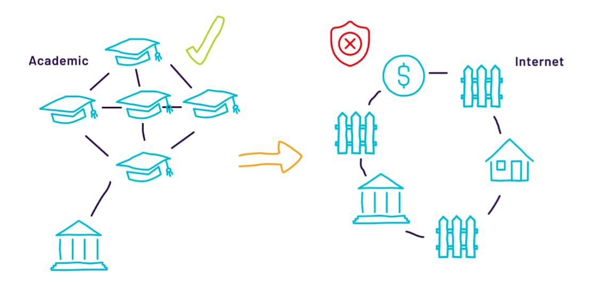
图1.1：网络的演变从大学校园的范围到全球网络的范围。

最初，通过防火墙、网络分段、私有地址空间和 ACL 来模拟用墙和守卫来保护计算机的物理访问的传统方法。这在当时是有意义的，特别是考虑到需要控制的点的数量有限。

随着网络的扩散，以及用户和商业伙伴访问点的增加，通过安全地交换和管理钥匙、凭证和令牌，物理身份验证（常见于墙壁和警卫）变得虚拟化，随着技术和需求的发展，所有这些都变得越来越有问题。

## 采用公共云

从传统的内部部署和数据中心运作迁移到公共云，放大了现有问题。

随着人们获得了在云中创建计算资源的自由，企业内的开发团队和运维团队开始更紧密地合作，并围绕着专注于软件自动化部署和管理的 DevOps 概念形成新的团队。公共云快速发展的动态环境使团队能够更频繁地进行部署 —— 从每几个月部署一次，到每天部署多次。按需配置和部署资源的能力使人们能够高速创建专门的、有针对性的、可独立部署的服务套件，其责任范围较小，俗称为**微服务**。这反过来又增加了跨部署集群识别和访问服务的需要。

这种高度动态和弹性的环境打破了公认的边界安全概念，需要更好的服务水平互动，与基础网络无关。传统的边界执行使用 IP 和端口进行认证、授权和审计，在云计算范式下，这不再是干净地映射到工作负载。

公共云的参与所激发的模式，如 API 网关或多服务工作负载的管理负载均衡器，强调了对不依赖网络拓扑或路径的身份的需求。保护这些服务与服务之间的通信的完整性变得更加重要，特别是对于需要跨工作负载统一性的团队。


图1.2：随着企业网络的复杂性增加，加上云计算、SaaS 和移动负载，建立和维护周边安全变得越来越难。

## 休斯顿，我们有一个问题

随着企业采用新技术，如容器、微服务、云计算和无服务器功能，有一个趋势是明确的：更多更小的软件。这既增加了攻击者可以利用的潜在漏洞的数量，也使得管理周边防御越来越不现实。

这种趋势正在加快，这意味着越来越多的组件被部署在自动化基础设施上，往往牺牲了安全和保障。绕过手动流程，如防火墙规则票或安全组的变化，并非闻所未闻。在这个新的现代世界里，无论部署环境如何，面向网络的访问控制都会迅速过时，需要不断维护。

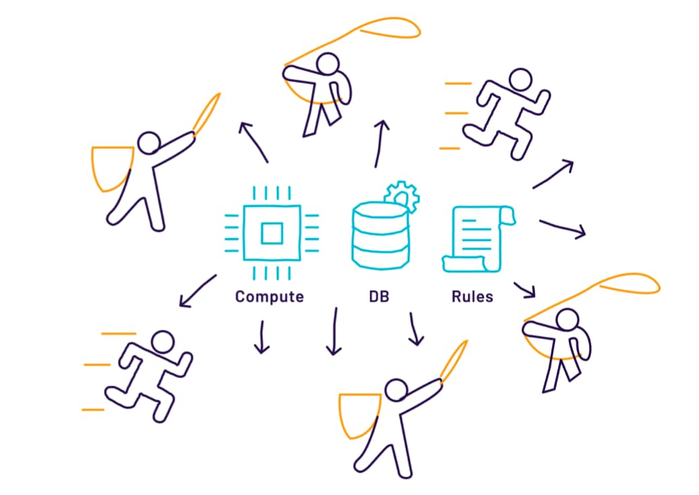
图1.3：随着新技术创新的激增，基础设施环境和相关的操作需求也越来越复杂。

这些规则和例外情况的管理可以自动化，然而，它们需要迅速发生，这在较大的基础设施中可能是一个挑战。此外，网络拓扑结构，如网络地址转换（NAT），会使其变得困难。随着基础设施变得越来越大，越来越动态，依靠人力的系统根本无法扩展。毕竟，没有人愿意花钱请一个整天玩弄防火墙规则的团队，而他们仍然无法跟上需求的进度。

依靠特定地点的细节，如服务器名称、DNS 名称、网络接口细节，在一个动态调度和弹性扩展的应用世界里有几个缺点。虽然网络结构的使用很普遍，但该模型是软件身份的一个无效的模拟。在应用层，使用传统的用户名和密码组合或其他硬编码的凭证，可以赋予一定程度的身份，但更多的是处理授权而不是认证。

在软件开发生命周期的早期整合安全并引入反馈，使开发人员能够对其工作负载的识别和信息交换机制进行更多的操作控制。有了这种变化，授权政策的决定可以委托给个别服务或产品所有者，他们最适合做出与有关组件相关的决定。

## 重新认识访问控制

在采用公有云之前，企业所经历的问题不断增加，而采用公有云后，企业又痛苦地出现了问题，这就推动了传统的周界是不够的，需要有更好的解决方案的概念。最终，去边界化意味着企业需要弄清楚如何识别他们的软件并实现服务对服务的访问控制。

**秘密是一种解决方案**

像密码和 API 密钥这样的共享秘密为分布式系统的访问控制提供了一个简单的选择。但这种解决方案也带来了许多问题。密码和 API 密钥很容易被泄露（试着在 GitHub 上搜索 "client_secret" 这样的短语，看看会发生什么）。在大型组织中，秘密可能很难因妥协而轮换，因为每个服务都需要以一种协调的方式意识到变化（而错过一个服务可能会导致停工）。

诸如 HashiCorp Vault 这样的工具和秘密存储库已经被开发出来，以帮助缓解秘密管理和生命周期的困难。虽然也有许多其他工具试图解决这个问题，但它们往往提供了一个更加有限的解决方案，效果平平（见 [Secrets at Scale: Automated Bootstrapping of Secrets & Identity in the Cloud](https://www.youtube.com/watch?v%3D15H5uCj1hlE)）。有了所有这些选择，我们最终还是回到了同一个问题上；工作负载应该如何获得对这个秘密库的访问？仍然需要一些 API 密钥、密码或其他秘密。

所有这些解决方案最终都会出现 “乌龟下面还有一只乌龟" 的问题。

- 启用对资源的访问控制，如数据库或其他资源。
- 服务需要一个秘密，如 API 密钥或密码。
- 该钥匙或密码需要被保护，所以你可以保护它，比如说用加密。但是，你仍然担心密码的解密密钥。
- 该解密密钥可以被放入秘密库，但这样你仍然需要一些凭证，如密码或 API 密钥来访问秘密库。
- 最终，保护对对一个秘密的访问会产生一个你需要保护的新秘密。

为了打破这个循环，我们需要找到一个底层乌龟，也就是说，一些秘密提供了对我们所需的认证和访问控制的其他秘密的访问。一种选择是在服务部署时手动提供秘密。然而，这在高度动态的生态系统中是无法扩展的。随着企业转向具有快速部署管道和自动扩展资源的云计算，随着新计算单元的创建，手动配置秘密变得不可行。而当一个秘密被破坏时，使旧的凭证失效会带来使整个系统崩溃的风险。

在应用程序中嵌入一个秘密，这样它就不需要手动配置了，其安全属性甚至更差。嵌入到源代码中的秘密有一个习惯，那就是出现在公共存储库中（你试过我建议的 GitHub 搜索吗）。虽然秘密可以在构建时被嵌入到机器镜像中，但这些镜像最终还是会被意外地推送到公共镜像库中，或者作为杀毒链的第二步从内部镜像库中提取。

我们希望有一种解决方案，不包括长期存在的秘密（这些秘密很容易被破坏，也很难轮换），也不需要人工向工作负载提供秘密。为了实现这一点，无论是在硬件还是在云提供商，都**必须有一个信任的根**，**在此基础上建立一个以软件（工作负载）身份为中心的自动化解决方案**。然后，这种身份构成了所有需要认证和授权的互动的基础。为了避免产生另一个底层乌龟，工作负载需要能够在没有秘密或其他凭证的情况下获得这一身份。


图1.4：有了健全的身份基石，就不再是一路乌龟了。

**迈向未来的步骤**

自 2010 年以来，业界为解决软件身份问题进行了多种努力。谷歌的低开销认证服务（LOAS），后来被命名为[应用层传输安全（ALTS）](https://cloud.google.com/security/encryption-in-transit/application-layer-transport-security/)），建立了一个新的身份格式和有线协议，用于从运行时环境接收软件身份，并将其应用于所有网络通信。它被称为**拨号音安全（dial tone security）**。

在另一个例子中，Netflix 的内部开发的解决方案（代号为 [Metatron](https://www.usenix.org/sites/default/files/conference/protected-files/enigma_haken_slides.pdf)）通过利用云 API 来证明实例上运行的机器图像，并通过 CI/CD 集成来产生机器镜像和代码身份之间的加密绑定，从而在每个实例基础上建立软件身份。这种软件身份采取 X.509 证书的形式，对服务与服务之间的通信进行相互认证，包括访问作为该解决方案一部分开发的 **秘密服务**，在此基础上实现秘密管理。

业界的其他一些努力，包括来自 [Facebook 等公司的努力](https://engineering.fb.com/security/service-encryption/)，证明了对这样一个系统的需要，并强调了实施的难度。

**人人安全生产身份框架（SPIFFE）的愿景**

在一个通用的解决方案存在之前，需要建立一个为框架编码的原则。Kubernetes 的创始工程师 Joe Beda 在过去的工作中接触过各种技术，这些技术使工程团队的生活更加轻松，他在 2016 年开始呼吁为生产身份创建一个解决方案，作为一个专门的解决方案，旨在以一种通用的方式解决问题，可以在许多不同类型的系统中利用，而不是以艰难的方式进行 PKI 的中介解决方案。这种公司之间的大规模合作努力，为基于 PKI 的服务身份开发了一个新的标准，这就是 SPIFFE 的开始。

Beda 的论文在 2016 年的 [GlueCon 上发表](https://engineering.fb.com/security/service-encryption/)，展示了一个具有这些参数的难题：

- 通过利用基于内核的自省来获得关于调用者的信息，而无需调用者出示凭证，从而解决零号秘密的问题。
- 使用 X.509，因为大多数软件已经兼容，而且
- 有效地将身份的概念从网络定位器中剥离出来。

在引入 SPIFFE 概念之后，在 Netflix 服务认同方面的专家举行了一次会议，讨论原始 SPIFFE 提案的最终形态和可行性。许多成员已经实施了、继续改进并重新解决了工作负载识别问题，突出了社区合作的机会。参加会议的成员希望获得彼此之间以及与他人之间的互操作性。这些专家意识到他们已经实施了类似的解决方案来解决同样的问题，并可以共同建立一个共同的标准。

解决工作负载身份问题的最初目标是建立一个开放的规范和相应的生产实现。该框架需要在不同的实现和现成的软件之间提供互操作性，其核心是在一个不信任的环境中建立信任的根基，驱除隐性信任。最后，摆脱以网络为中心的身份，以实现灵活性和更好的扩展特性。


图1.5：一切开始的地方：2016 年在 Netflix 的会议上，安全专家们开始勾勒出 SPIFFE 的概念。

# 2. 收益

本章从业务和技术的角度解释了在基础设施中部署 SPIFFE 和 SPIRE 的好处。

## 为每个人，每个地方

SPIFFE 和 SPIRE 旨在加强对软件组件的识别，以一种通用的方式，任何人在任何地方都可以在分布式系统中加以利用。现代基础设施的技术环境是错综复杂的。环境在硬件和软件投资的混合下变得越来越不一样。通过对系统定义、证明和维护软件身份的方式进行标准化来维护软件安全，无论系统部署在哪里，也无论谁来部署这些系统，都会带来许多好处。

对于专注于提高业务便利性和回报的企业领导人来说，SPIFFE 和 SPIRE 可以大大降低与管理和签发加密身份文件（如 X.509 证书）的开销相关的成本，并通过消除开发人员对安全的服务间通信所需的身份和认证技术的了解来加速开发和部署。

对于专注于提供强大、安全和可互操作产品的服务提供商和软件供应商来说，SPIFFE 和 SPIRE 解决了在将许多解决方案互连到最终产品时普遍存在的关键身份问题。例如，SPIFFE 可以作为一个产品的 TLS 功能和用户管理 / 认证功能的基础，一举两得。在另一个例子中，SPIFFE 可以取代管理和发行平台访问的 API 令牌的需要，**免费**带来轮转，并消除存储和管理访问所述令牌的客户负担。

对于希望不仅加强传输中的数据安全，而且实现监管合规并解决其信任根源问题的安全从业人员来说，SPIFFE 和 SPIRE 致力于在不信任的环境中提供相互认证，而不需要交换秘密。安全和管理边界可以很容易地划定，并且在策略允许的情况下，可以跨越这些边界进行通信。

对于需要身份管理抽象的开发人员、运营商和 DevOps 从业人员，以及需要与现代云原生服务和解决方案互操作的工作负载和应用程序，SPIFFE 和 SPIRE 在整个软件开发生命周期中与许多其他工具兼容，以提供可靠的产品。开发人员可以继续他们的工作，直接进入业务逻辑，而不必担心证书、私钥和 JavaScript Web Token（JWT）等烦人的问题。

## 针对企业领导人

### 现代的组织有现代的需求

在今天的商业环境中，通过差异化的应用和服务快速提供创新的客户体验是保持竞争优势的必要条件。因此，企业见证了应用程序和服务的架构、构建和部署方式的变化。诸如云和容器等新技术帮助企业更快、更大规模地发布。服务需要高速构建并部署在大量的平台上。随着开发速度的加快，这些系统变得越来越相互依赖和相互联系，以提供一致的客户体验。

组织在实现高速发展和获得市场份额或任务保证方面可能会受到抑制，主要原因是合规性、专业知识的储备以及团队 / 组织之间和现有解决方案内的互操作性挑战。

**互操作性的影响**

随着系统的发展，对互操作性的需求也在无限地增长。脱节的团队建立的服务是孤立的，互不相识，尽管他们最终需要意识到彼此的存在。收购发生时，新的或从未见过的系统需要被整合到现有的系统中。商业关系的建立，需要与可能存在于堆栈深处的服务建立新的沟通渠道。所有这些挑战都围绕着 “我如何以安全的方式将所有这些服务连接在一起，每个服务都有自己独特的属性和历史？”

当不同的技术栈必须结合在一起进行互操作时，由于组织融合而产生的技术整合可能是一个挑战。为系统与系统之间的通信与身份和认证制定一个共同的、行业认可的标准，可以简化跨多个堆栈的完全互操作性和整合的技术问题。

SPIFFE 带来了对构成软件身份的共识。通过进一步利用 SPIFFE Federation，不同组织或团队的不同系统中的组件可以建立信任，安全地进行通信，而不需要增加诸如 VPN 隧道、one-off 证书或用于这些系统之间的共享凭证等结构的开销。

**合规性和可审计性**

SPIRE 实施中的可审计性保证了执行行动的身份不会因为在环境中执行相互认证而被否定。此外，SPIFFE/SPIRE 发布的身份文件使相互认证的 TLS 得到广泛使用，有效地解决了与这种性质的项目相关的最困难的挑战之一。相互认证的 TLS 的其他好处包括对服务之间传输的数据进行本地加密，不仅保护了通信的完整性，还保证了敏感或专有数据的保密性。

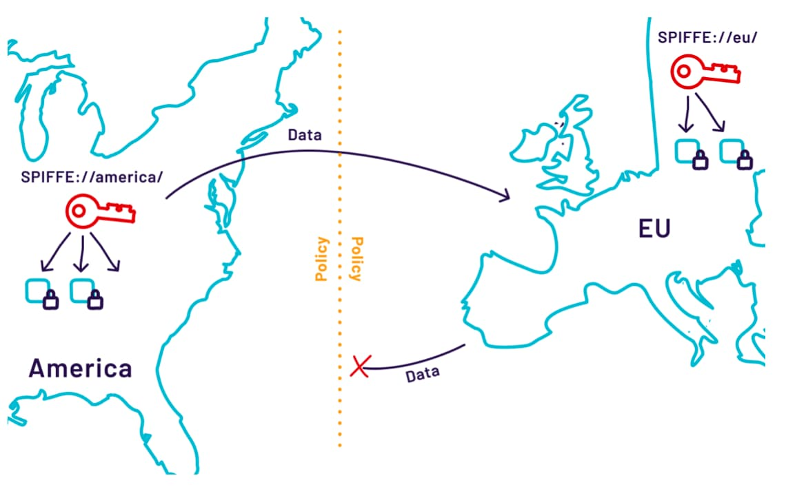
图 2.1: 使用 SPIFFE 无缝地满足合规和监管目标。

另一个常见的合规要求是由《通用数据保护条例》（GDPR）带来的 —— 特别是要求欧盟（EU）的数据完全停留在欧盟内部，而不是在其管辖范围之外的实体中转或被处理。有了多个信任根基，全球组织可以确保欧盟实体只与其他欧盟实体沟通。

**专业知识库**

确保开发、安全和运营团队具备正确的知识和经验，以适当地处理安全敏感系统，仍然是一项重大挑战。企业需要雇用具有基于标准的技能组合的开发人员，以减少入职时间，并在减少风险的情况下改善产品效率。

解决以自动方式向每个软件实例提供加密身份的问题，并从根本上实现凭证轮换，是一项重大挑战。对于安全和运维团队来说，具有的实施此类系统所需的专业知识少之又少。在不依靠社区或行业知识的情况下维持日常运营会使问题恶化，导致中断和指责。

不能合理地期望开发人员了解或获得安全的实际问题的专业知识，特别是在组织环境中适用于服务身份。此外，在开发、运维和工作负载执行方面具有深度知识的安全从业人员的储备是非常少的。利用一个开放的标准和开放的规范来解决关键的身份问题，允许没有个人经验的人通过一个得到良好支持的、不断增长的 SPIFFE/SPIRE 终端用户和从业人员社区来扩展知识。

**节约**

采用 SPIFFE/SPIRE 可以在许多方面节省成本，包括减少云 / 平台锁定，提高开发人员的效率，以及减少对专业知识的依赖，等等。

通过将云提供商的身份接口抽象为一套建立在开放标准上的定义明确的通用 API，SPIFFE 大大减轻了开发和维护**云感知**应用的负担。由于 SPIFFE 是平台无关的，它几乎可以在任何地方部署。当需要改变平台技术时，这种差异化可以节省时间和金钱，甚至可以加强与现有平台供应商的谈判地位。从历史上看，身份和访问管理服务是由每个组织自己的部署指挥和控制平台 —— 云服务提供商知道这一点，并利用这一制约因素作为主要的锁定机制，与他们的平台完全整合。

在提高开发人员的效率方面也有很大的节省。SPIFFE/SPIRE 有两个重要方面可以节省开支：加密身份及其相关生命周期的完全自动化发布和管理，以及认证和服务间通信加密的统一性和加载性。通过消除与前者相关的手动流程，以及在后者中花费的研究和试验 / 错误时间，开发人员可以更好地专注于对他们重要的事情：业务逻辑。

| **提高开发人员的生产力**                                     | 值   |
| :----------------------------------------------------------- | :--- |
| 开发人员在获取证书和配置每个应用组件的认证 / 保密协议方面花费的平均时间（小时）。 | 2    |
| 减少开发人员在每个应用组件上对应的证书所花费的时间。         | 95%  |
| 开发人员在学习和实施特定 API 网关、秘密存储等控制方面花费的平均时间（小时） | 1    |
| 减少了开发人员学习和实施特定 API 网关、秘密存储等控制的时间。 | 75%  |
| 本年度开发的新应用组件的数量                                 | 200  |
| **预计因提高开发人员生产力而节省的时间**                     | 530  |

正如我们在历史上看到的那样，财富 50 强的技术组织雇用了高度熟练和专业的工程师，花了几十年时间来解决这个身份问题。将 SPIFFE/SPIRE 添加到企业的云原生解决方案目录中，可以让你在多年的超专业安全和开发人才的基础上构建，而不需要相应的成本。

凭借强大的社区支持几十个到几十万个节点的部署，SPIFFE/SPIRE 在复杂、大规模环境中的运作经验可以满足组织的需求。

## 对于服务提供商和软件供应商

减少客户在使用产品过程中的负担，始终是任何优秀产品经理的首要目标。了解那些表面上看起来无害的功能的实际意义是很重要的。例如，如果一个数据库产品需要支持 TLS，因为这是客户的要求，很简单，在产品中添加一些配置就可以了。

不幸的是，这给客户带来了一些重大的挑战。即使是看似简单的用户管理也面临类似的挑战。考虑一下这两个常见的功能在默认情况下引入的以下客户痛点：

- 谁生成证书和密码，以及如何生成？
- 它们如何被安全地分配给需要的应用程序？
- 如何限制对私钥和密码的访问？
- 这些秘密是如何存储的，才能让它们不会泄漏到备份中？
- 当证书过期，或必须改变密码时，会发生什么？这个过程是否具有破坏性？
- 在这些任务中，有多少是必须要有人类操作的？

在这些功能从客户的角度来看是可行的之前，所有这些问题都需要得到回答。通常，客户发明或安装的解决方案在操作上是很痛苦的。

这些客户的负担是非常真实的。有些组织有整个团队专门负责管理这些负担。通过简单地支持 SPIFFE，上述所有的担忧都会得到缓解。该产品可以集成进现有的基础设施，并**免费**增加 TLS 支持。此外，由 SPIFFE 赋予的客户（用户）身份可以直接取代管理用户凭证（如密码）的需要。

### 平台访问管理

访问一个服务或平台（如 SaaS 服务）也涉及类似的挑战。归根结底，这些挑战为凭证管理所带来的固有困难，尤其是当凭证是一个共享的秘密时。

考虑一下 API 令牌 —— 在 SaaS 提供商中，使用 API 令牌来验证非人类的 API 调用者是很普遍的。它们实际上是密码，而且每一个都必须由客户仔细管理。上面列出的所有挑战都适用于此。支持 SPIFFE 认证的平台大大减轻了与访问平台有关的客户负担，一次性解决了存储、发行和生命周期问题。利用 SPIFFE，问题被简化为简单地授予给定工作负载所需的权限。

## 针对安全从业人员

技术创新不能成为安全产品的抑制因素。开发、分发和部署工具需要与安全产品和方法无缝集成，不影响软件开发的自主性或为组织带来负担。组织需要易于使用的软件产品，并为现有工具增加额外的安全性。

SPIRE 不是所有安全问题的最终解决方案。它并不否定对强大的安全实践和深度防御或分层安全的需要。然而，利用 SPIFFE/SPIRE 提供跨不信任网络的信任根，使组织能够在通往[零信任架构](https://csrc.nist.gov/publications/detail/sp/800-207/final)的道路上迈出有意义的一步，作为全面安全战略的一部分。

### 默认安全

SPIRE 可以帮助减轻 [OWASP 的几个主要威胁](https://owasp.org/www-project-top-ten/)。为了减少通过凭证泄露的可能性，SPIRE 为整个基础设施的认证提供了一个强有力的证明身份。保持保证承诺的自动化使平台默认安全，消除了开发团队的额外配置负担。

对于希望从根本上解决其产品或服务中的信任和身份问题的组织来说，SPIFFE/SPIRE 还通过实现普遍的相互 TLS 认证来解决客户的安全需求，以便在工作负载之间安全地进行通信，无论它们部署在何处。此外，与每个开源产品一样，代码库背后的社区和贡献者提供了更多双眼睛来审查合并前和合并后的代码。这个 [莱纳斯法则（Linus Law）](https://en.wikipedia.org/wiki/Linus's_law)的实施超越了**四只眼睛**的原则，以确保任何潜在的错误或已知的安全问题在进入发布阶段之前被发现。

### 策略执行

SPIRE 的 API 为安全团队提供了一种机制，以便以易于使用的方式在各平台和业务部门执行一致的认证策略。当与定义明确的策略相结合时，服务之间的互动可以保持在最低限度，确保只有授权的工作负载可以相互通信。这限制了恶意实体的潜在攻击面，并可以在策略引擎的默认拒绝规则中触发警报。

SPIRE 利用一个强大的多因素证明引擎，该引擎实时运行，可以肯定地确定加密身份的发放。它还自动发放、分配和更新短期凭证，以确保组织的身份架构准确反映工作负载的运行状态。

### 零信任

在架构中采用零信任模式，可以减少漏洞发生时的爆炸半径。相互认证和信任撤销可以阻止被破坏的前端应用服务器从网络上或集群内可能存在的不相关数据库中渗出数据。虽然不可能发生在网络安全严密的组织中，但 SPIFFE/SPIRE 肯定会增加额外的防御层，以减轻错误配置的防火墙或不变的默认登录带来的漏洞和暴露点。它还将安全决策从 IP 地址和端口号（可以用不可察觉的方式进行操纵）转移到享有完整性保护的加密标识符上。

### 记录和监控

SPIRE 可以帮助改善基础设施的可观察性。关键的 SPIRE 事件，如身份请求和发放，是可记录的事件，有助于提供一个更完整的基础设施视图。SPIRE 还将生成各种行动的事件，包括身份注册、取消注册、验证尝试、身份发放和轮换。然后，这些事件可以被汇总并发送到组织的安全信息和事件管理（SIEM）解决方案，以便进行统一监控。

## 对于开发、运维和 DevOps 来说

即使你可以通过采用和支持 SPIFFE/SPIRE 而不考虑环境，量化对开发人员甚至运维生产力的改善，但最终，它通过在日常工作中重新引入焦点、流程和快乐，缓解了团队所经历的大部分劳累。

### 聚焦

安全不能成为技术创新的障碍。安全工具和控制需要与现代产品和方法进行无摩擦的整合，不影响开发的自主性或给运维团队带来负担。

SPIFFE 和 SPIRE 提供了一个统一的服务身份控制平面，可通过一致的 API 跨平台和跨域使用，因此团队可以专注于交付应用程序和产品，而不必担心或为目的地进行特殊配置。每个开发人员都可以利用这个 API，安全、轻松地进行跨平台和跨域的认证。

开发人员还可以请求并接收一个身份，然后可用于为所提供的身份建立额外的应用程序特定控制，而运营商和 DevOps 团队可以以自动化的方式管理和扩展身份，同时实施和执行消耗这些身份的策略。此外，团队可以使用 OIDC 联盟将 SPIFFE 身份与各种云认证系统（如 AWS IAM）相关联，从而减少对复杂的秘密管理需求。

### 流程

每一个曾经生成的凭证都面临着同样的问题：在某些时候，它将不得不被改变或撤销。当时间到了，这个过程往往是手动的和痛苦的 —— 就像部署一样，越是不经常发生就越是痛苦。对过程的不熟悉和因缺乏及时性或不方便的更新程序而引起的中断是正常的。

当需要轮换时，常要求运维和开发人员进行昂贵的上下文切换。SPIFFE/SPIRE 通过将轮换作为一个关键的核心功能来解决这个问题。它是完全自动化的，并且定期发生，无需人工干预。轮换的频率由运维选择，而且涉及到权衡；然而，SPIFFE 证书每小时轮换一次的情况并不少见。这种频繁和自动化的轮换方式最大限度地减少了与证书生命周期管理有关的运维和开发人员的中断。

值得注意的是，不仅仅轮换是自动化的。证件的最初发放（最常见的是 X.509 证书的形式）也是完全自动化的。这有助于简化开发人员的流程，将生成或采购凭证的任务从启动新服务的检查清单中剔除。

### 互操作性

开发人员和集成商不再需要为组织的安全身份和认证解决方案缺乏互操作性而感到沮丧。SPIRE 提供了一个插件模型，允许开发人员和集成商扩展 SPIRE 以满足他们的需求。如果企业需要一套专有的 API 来生成 SPIRE 的密钥，或者 SPIRE 的中间签名密钥应该存在于特定的专有密钥管理服务（KMS）中，那么这种能力就特别重要。开发人员也不需要担心为即将上线的新工作负载开发定制的包装器，因为该组织正在遵守一个开放的规范。

许多团队不敢改变或删除允许网络间追踪的防火墙规则，因为这可能会对关键系统的可用性产生不利影响。运维可以将身份及其相关策略的范围扩大到应用而不是全局。运维将有信息更改本地范围的身份和策略，而不必担心对下游的影响。

### 改善日常工作

如果没有一个强大的软件身份系统，服务之间的访问管理通常是通过使用网络层面的控制（例如，基于 IP / 端口的策略）来完成的。不幸的是，这种方法产生了大量与管理网络访问控制列表（ACL）相关的操作。随着弹性基础设施的增加和减少，以及网络拓扑结构的变化，这些 ACL 需要不间断的维护。它们甚至会妨碍新基础设施的启用，因为现有的系统现在需要被告知新组件的存在。

SPIFFE 和 SPIRE 致力于减少这种辛劳，因为与网络上的主机和工作负载的安排相比，软件身份的概念相对稳定。此外，它们还为将授权决策委托给服务所有者本身铺平了道路，因为他们最终处于做出这种决策的最佳位置。例如，希望向新的消费者授予访问权的服务所有者，他们不需要关心网络层面的细节就可以创建访问策略 —— 他们可以简单地声明他们希望授予访问权的服务名称，然后继续。

SPIFFE/SPIRE 还致力于提高可观测性、监测以及最终对服务水平目标（SLO）的遵守。通过在许多不同类型的系统中规范软件身份（不一定只是容器化或云原生），并提供身份发布和使用的审计跟踪，SPIFFE/SPIRE 可以在事件发生之前、期间和之后极大地提高态势感知。更成熟的团队甚至会发现，它可以提高预测影响服务可用性问题的能力。

# 3. 身份背后的通用概念

本章解释了什么是身份，以及分配、管理和使用身份的基本知识。这些是你需要知道的概念，以便了解 SPIFFE 和 SPIRE 的工作方式。

## 什么是身份？

对于人类来说，身份是复杂的。人类是独特的个体，不能被克隆，也不能用替代的代码取代他们的思想，而且他们在一生中可能会有多种社会身份。软件服务也同样复杂。

一个单一的程序可能会扩展到成千上万的节点，或者在构建系统推送新的更新时，一天内多次改变其代码。在这样一个快速变化的环境中，一个身份必须代表服务的特定逻辑目的（例如，客户计费数据库）和与已建立的权威或信任根（例如，`my-company.example.org` 或生产工作负载的发行机构）的关联。

一旦为一个组织中的所有服务发布了身份，它们就可以被用于**认证**：证明一个服务是它所说的那样。一旦服务可以相互认证，它们就可以使用身份进行**授权**，或控制谁可以访问这些服务，以及**保密性**，或保持它们相互传输的数据的秘密。虽然 SPIFFE 本身并不包括认证、授权或保密性，但它发出的身份可用于所有这些。

为一个组织指定服务身份与设计该组织基础设施的任何其他部分类似：它密切依赖于该组织的需求。当一个服务扩大规模、改变代码或移动位置时，它保持相同的身份可能是合乎逻辑的。

### 值得信赖的身份

现在我们已经定义了身份，那么我们如何表示这种身份？我们如何知道，当一个软件（或工作负载）声称自己的身份时，这个声称是值得信赖的？为了开始探索这些问题，我们必须首先讨论身份是如何建立的。

**人类的身份**

请允许我们用我们大家共同的东西来解释这些概念：我们现实中的世界身份。

*身份证件*

如果一个名字是一个人的身份，那么这个身份的证明就是一个身份文件。护照是允许一个人证明其身份的文件，所以它是一个身份文件。像不同国家的护照一样，不同类型的软件身份文件可能看起来不同，而且不总是包含相同的信息。但为了有用，它们通常至少都包含一些共同的信息，如用户的姓名。

护照和写有你名字的餐巾纸之间的区别是什么？

最重要的区别是来源。对于护照，我们相信**签发机构**已经核实了你的身份，而且我们有能力核实护照是由该受信任的机构签发的（验证）。对于那张餐巾纸，我们不知道它来自哪里，也没有办法验证它是否来自你说的那家餐馆。我们也无法相信餐厅在餐巾纸上写了正确的名字，或者在你传达你的名字时验证了它的准确性。

*信任一个发行机构*

我们相信护照，因为我们隐含地相信签发护照的机构。我们信任他们签发这些身份文件的过程：他们有记录和控制，以确保他们只向正确的个人签发身份。我们信任这个过程的管理，所以我们知道该机构签发的护照是某人身份的忠实代表。

*核实身份文件*

鉴于此，我们如何区分真护照和假护照？这就是*验证的意义*所在。组织需要一种方法来确定身份文件是否是由我们信任的权威机构签发的。这通常是通过难以复制但容易验证的水印来实现的。

*对出示身份证件的人进行认证*

护照记录了关于身份所代表的人的几项信息。首先，它们包括一个人的照片，可以用来验证出示者是护照上的同一个人。它们还可能包括此人的其他身体特征 —— 例如，他们的身高、体重和眼睛颜色。

所有这些属性都可以用来**验证**出示护照的人。

简而言之，护照是我们的**身份文件**，我们用它来确认彼此的身份，因为我们信任**签发机构**，并且有办法**验证**该文件来自该机构。最后，我们可以通过交叉参考护照的内容和持有护照的人，来**验证**出示护照的人。

### 数字世界中的身份：加密身份

绕回工作负载身份，上述概念如何映射到计算机系统？使用的是**数字身份文件**，而不是护照。X.509 证书、签名的 JSON 网络令牌（JWT）和 Kerberos 票据，都是数字身份文件的例子。数字身份文件可以使用加密技术进行验证。然后，计算机系统可以被验证，就像一个拥有护照的人一样。

做到这一点的最有用和最普遍的技术之一是公钥基础设施（PKI）。PKI 被定义为一套创建、管理、分发、使用、存储和撤销数字证书以及管理公钥加密所需的角色、策略、硬件、软件和程序。有了 PKI，数字身份文件可以在本地进行验证，即根据一组小的、静态的根信任包进行验证。

**X.509 的简要概述**

当[国际电信联盟电信标准化部门（ITU-T）](https://www.itu.int/en/ITU-T/about/)于 1988 年首次发布 X.509 标准的 PKI 时，它在当时是非常雄心勃勃的，现在仍然被认为是如此。该标准最初设想为人类、服务器和其他设备提供证书，形成一个巨大的全球一体化安全通信系统。虽然 X.509 从未达到其最初的预期范围，但它是几乎所有安全通信协议的预期基础。

*X.509 是如何在单一机构中工作的*

1. Bob 的计算机需要一个证书。他生成了一个随机的**私钥**，还有一个**证书签署请求**（CSR），其中包括他的计算机的基本信息，比如它的名字；我们称之为 `bobsbox`。CSR 有点像护照申请。
2. Bob 将他的 CSR 发送给一个**证书颁发机构**（CA）。CA 验证 Bob 是否真的是 Bob。这种验证的具体方式可能有所不同 —— 它可能涉及一个人检查 Bob 的文件，或自动检查。
3. 然后，CA 通过对 CSR 中提出的信息进行编码来创建**证书**，并添加数字签名，以断言 CA 已经验证了其中包含的信息是真实和正确的。它把证书送回给 Bob。
4. 当 Bob 想与 Alice 建立安全通信时，他的计算机可以出示他的证书，并以密码学方式证明它拥有 Bob 的私钥（而不需要实际与任何人分享该私钥的内容）。
5. Alice 的计算机可以通过检查证书颁发机构是否签署了 Bob 的证书来检查 Bob 的证书是否真的是 Bob 的证书。她相信证书颁发机构在签署证书之前正确检查了 Bob 的身份。


图 3.1：Bob 向证书颁发机构申请证书，并用它来向 Alice 证明他的身份。


图 3.2：PKI 简况。


图 3.3：中间证书颁发机构的说明。

*带有中间证书机构的 X.509*

在许多情况下，签署了某一特定证书的 CA **并不**广为人知。相反，该 CA 有自己的密钥和证书，而该证书是由另一个 CA 签署的。通过签署该 CA 证书，上级 CA 证明了下级 CA 被授权签发数字身份。这种由高阶 CA 对低阶 CA 的授权被称为**委托（delegation）**。

委托可以重复发生，低阶 CA 进一步委托他们的权力，形成一个任意高的证书授权树。最高等级的 CA 被称为**根 CA**，必须有一个知名的证书。链中的每一个其他 CA 都被称为 **中间 CA**。这种方法的好处是，需要知名的密钥较少，允许列表的变化不那么频繁。

这导致了 X.509 的一个关键弱点：**任何 CA 可以签署任何证书，没有任何限制**。如果一个黑客决定建立自己的中间 CA，并能得到任何一个现有中间 CA 的批准，那么他就可以有效地签发他想要的任何身份。至关重要的是，每个知名的 CA 都是**完全**值得信赖的，而且他们委托的每个中间 CA 也是**完全**值得信赖的。

**证书和身份的生命周期**

在 PKI 中有几个额外的功能，使数字身份的管理和认证更容易和更安全。权限委托、身份撤销和有限的身份文件寿命是其中的几个例子。

*身份发放*

首先，必须能够发布一个新的身份。人类的诞生，新软件服务的编写，在每一种情况下，我们都必须在以前没有身份的地方颁发一个身份。

首先，一项服务需要申请一个新的身份。对于人来说，这可能是一个纸质表格。对于软件来说，它是一个 X.509 文件，称为证书签名请求（CSR），它是用一个相应的私钥创建的。CSR 类似于证书，但由于它没有被任何证书颁发机构签署，没有人会承认它是有效的。然后，该服务将 CSR 安全地发送给证书颁发机构。

接下来，证书颁发机构根据申请证书的服务检查 CSR 的每个细节。最初，这本来是一个手工过程：人类检查文书工作，并在个人基础上作出决定。今天，检查和签署过程通常是完全自动化的。如果你使用过流行的 LetsEncrypt 证书颁发机构，那么你就会熟悉完全自动化的证书颁发机构签署过程。

一旦满意，证书颁发机构将其数字签名附加到 CSR 上，将其变成一个完全成熟的证书。它把证书送回给服务。与它先前生成的私钥一起，该服务可以向世界安全地识别自己。

*证书撤销*

那么，如果一项服务被破坏了，会发生什么？如果 Bob 的笔记本电脑被黑了，或者 Bob 离开了公司，不应该再有访问权，怎么办？

这种取消信任的过程被称为证书撤销（Certificate Revocation）。证书颁发机构维护一个名为 "证书撤销列表"（CRL）的文件，其中包含被撤销的证书的唯一 ID，并将该文件的签名副本分发给任何要求的人。

撤销是很棘手的，有几个原因。首先，CRL 必须由某个端点托管和提供，这就给确保端点的正常运行和可达带来了挑战。当它不在时，PKI 是否停止工作？在实践中，大多数软件将**无法打开**，在 CRL 不可用时继续信任证书，使它们实际上没有用处。

第二，CRL 可能会变得庞大而不方便。被撤销的证书必须保留在 CRL 中，直到它过期为止，而证书的寿命一般都很长（在几年的时间内）。这可能导致服务、下载和处理清单本身的性能问题。

已经开发了几种不同的技术，试图使证书撤销更简单、更可靠，如在线证书状态协议（OCSP）。各种各样的方法使证书撤销成为一个持续的挑战。

*证书过期*

每个证书都有一个内置的过期日期。过期日期是 X.509 安全的一个重要部分，有几个不同的原因：管理过时，限制证书显示的身份变化的可能性，限制 CRL 的大小，以及减少秘钥被盗的可能性。

证书已经存在了很长时间了。当它们刚被开发出来时，许多 CA 使用 1989 年的 MD2 散列算法，这种算法很快被发现是不安全的。如果这些证书仍然有效，攻击者可以伪造它们。

有限的证书寿命的另一个重要方面是，CA 只有一次机会来验证申请者的身份，但这些信息不能保证长期保持正确。例如，域名经常改变所有权，是证书中一般包括的比较关键的信息之一。

如果使用了证书撤销列表，那么每个仍然有效的证书都有可能被撤销。如果证书永远持续下去，那么证书撤销列表就会无止境地增长。为了保持证书撤销列表的小规模，证书需要过期。

最后，证书的有效期越长，其证书的私钥或任何通往根的证书被盗的风险就越大。

*频繁的证书更新*

解决撤销所带来的挑战的一个折中办法是更多地依靠证书过期。如果证书的有效期很短（也许只有几个小时），那么 CA 就可以经常重新执行它最初做的所有检查。如果证书的更新足够频繁，那么 CRL 可能甚至没有必要，因为等待证书过期可能会更快。

**身份寿命的权衡**

| 更短的寿命                               | 更长的寿命                                             |
| :--------------------------------------- | :----------------------------------------------------- |
| 如果文件被盗，它的有效期会缩短           | 减少了证书颁发机构的负担（人和程序）                   |
| CRL 比较短，也许没有必要                 | 降低网络的负荷                                         |
| 一次性减少未结清的身份文件（更容易跟踪） | 在一个节点因网络中断而无法更新其证书时，具有更好的弹性 |

*另一种加密身份：JSON 网络令牌（JWT）*

另一个公钥身份文件，JSON 网络令牌（RFC7519），也表现为一个类似 PKI 的系统。它不使用证书，而是使用 JSON 令牌，并有一个称为 JSON Web Key Set 的结构，作为 CA 绑定来验证 JSON 令牌。证书和 JWT 之间有一些重要的区别，超出了本书的范围，但就像 X.509 证书一样，JWT 的真实性可以通过 PKI 来验证。

### 外部身份的可信度

无论你使用哪种身份，都必须由一些受信任的机构来签发。在许多情况下，并不是每个人都信任相同的当局或其颁发的过程。Alice 的纽约州驾照在纽约是有效的身份证明，但它在伦敦是无效的，因为伦敦当局不信任纽约州的政府。然而，鲍勃的美国护照在伦敦是有效的，因为英国当局信任美国政府，而伦敦当局信任英国当局。

在数字身份文件领域，情况是相同的。Alice 和 Bob 可能拥有由完全不相关的 CA 签署的证书，但只要他们都信任这些 CA，他们就可以相互认证。这并不意味着 Alice 必须信任 Bob，只是她可以安全地识别他。

## 如何使用软件身份

一旦一个软件有了数字身份文件，它就可以被用于许多不同的目的。我们已经讨论了使用身份文件进行认证。它们还可以用于相互 TLS、授权、可观测性和计量。

**认证**

身份文件最常见的用途是作为认证的基础。对于软件身份，存在几种不同的认证协议，使用 X.509 证书或 JWT 来证明一个服务对另一个服务的身份。

**保密性和完整性**

保密性意味着攻击者不能看到信息的内容，而完整性意味着他们不能在传输过程中改变信息。传输层安全（TLS）是一个广泛使用的协议，用于建立安全连接，在使用 X.509 证书的不受信任的网络连接之上提供认证、保密性和消息完整性。

TLS 的一个特点是，连接的**任何一方都**可以使用证书进行认证。例如，当你连接到你的银行网站时，你的网络浏览器使用银行提供的 X.509 证书来验证你的银行，但你的浏览器并没有向银行提供证书。(你用用户名和密码登录，而不是用证书）。

当两个软件进行通信时，连接的**双方**通常都有 X.509 证书并相互认证。这被称为相互认证的 TLS。

**授权**

一旦数字身份得到认证，它就可以被用来授权访问服务。通常情况下，每个服务都有一个允许其他服务对其提出请求的列表。授权只有在认证之后才能发生。

**可观测性**

身份识别对于提高你的组织的基础设施内的可观测性也很有用。在大型组织中，旧的或未维护的服务以神秘的、未记录的方式进行通信是非常普遍的。每个服务的独特身份可以与可观测性工具一起解决这个问题。对于日志记录来说，如果以后出了问题，请求者的可反驳身份是很有用的。

**计量**

在微服务架构中，一个常见的需求是对请求进行节流，以便快速的微服务不至于压倒慢的微服务。如果每个微服务都有一个独特的身份，就可以用来管理每秒的请求配额来解决这个问题，或者完全拒绝访问。

## 总结

人类和软件都有身份，而且都可以使用身份文件来证明自己的身份。对人类来说，护照是身份文件的一种典型形式。对于软件来说，最常见的数字身份文件形式是 X.509 证书。

证书是由证书颁发机构颁发的。证书颁发机构需要注意正确验证他们为之创建证书的人或事，并管理证书的寿命。证书颁发后，无论谁使用它，都需要信任颁发它的证书机构。

一旦有了可信的数字身份文件，它们有许多不同的用途。其中最常见的是创建一个相互认证的 TLS 连接，其中包括认证、保密性和完整性。另一个常见的用途是用于授权。有了认证、保密性、完整性和授权，服务之间的连接是安全的。

# 4. SPIFFE 和 SPIRE 概念介绍

在第三章介绍的概念基础上，本章说明了 SPIFFE 标准。解释 SPIRE 实现的组成部分以及它们是如何结合在一起的。最后，讨论威胁模型以及如果特定组件被破坏会发生什么。

## 什么是 SPIFFE？

人人安全生产身份框架（SPIFFE）是一套软件身份的开源标准。为了以一种与组织和平台无关的方式实现可互操作的软件身份，SPIFFE 定义了必要的接口和文件，以完全自动化的方式获得和验证加密身份。

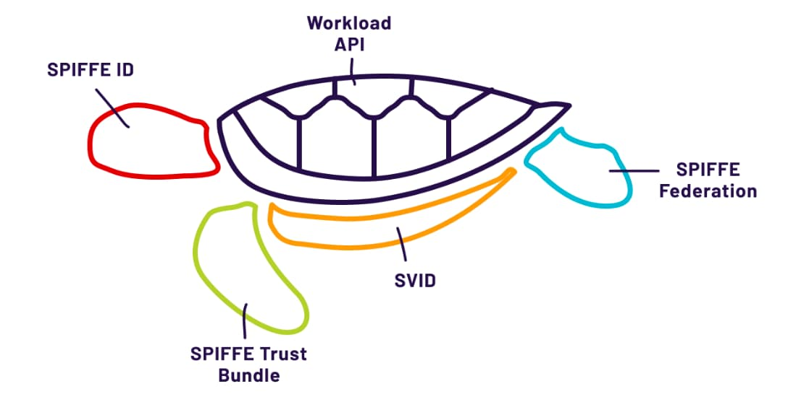
图 4.1：SPIFFE 组件。

- SPIFFE ID，代表软件服务的名称（或身份）。
- SPIFFE 可验证身份文件（SVID），这是一个可加密验证的文件，用于向对等者证明服务的身份。
- SPIFFE Workload API，这是一个简单的节点本地 API，服务用它来获得身份，而不需要认证。
- SPIFFE Trust Bundle（信任包），一种代表特定 SPIFFE 发行机构使用的公钥集合的格式。
- SPIFFE Federation，这是一个简单的机制，通过它可以共享 SPIFFE Trust Bundle。

### SPIFFE 不是什么

SPIFFE 旨在识别服务器、服务和其他通过计算机网络通信的非人类实体。这些都有一个共同点，那就是这些身份必须是可以自动发出的（没有人类在其中参与）。虽然有可能使用 SPIFFE 来识别人或其他野生动物物种，但该项目特意将这些用例排除在范围之外。除了机器人和机器之外，没有其他特别的考虑。

SPIFFE 向服务提供身份和相关信息，同时管理该身份的生命周期，但其作用仅限于提供者，因为它不直接利用所提供的身份。利用它收到的任何 SPIFFE 身份是服务的责任。在使用 SPIFFE 身份时，有多种解决方案可以实现认证层，如端到端加密通信或服务间授权和访问控制，但是，这些功能也被认为不属于 SPIFFE 项目的范围，SPIFFE 不会直接解决这些问题。

### SPIFFE ID

SPIFFE ID 是一个字符串，作为服务的唯一名称。它被模拟成一个 URI，由几个部分组成。前缀 `spie://`（作为 URI 的方案），信任域的名称（作为主机部分），以及特定工作负载的名称或身份（作为路径部分）。

一个简单的 SPIFFE ID 可能只是 `spiffe://example.com/myservice`。


图 4.2：一个 SPIFFE ID 示例，以及它的组成。

SPIFFE ID 的第一个组成部分是 `spie:// `URI 方案。虽然很普通，但包括它是一个重要的细节，因为它有助于将 SPIFFE ID 与 URL 或其他类型的 URL 区分开来。

SPIFFE ID 的第二个组成部分是信任域名称（`example.com`）。在某些情况下，整个组织只有一个信任域。在其他情况下，可能需要有许多信任域。信任域的语义将在本章后面介绍。

最后一个组成部分是工作负载本身的名称部分，由 URI 路径表示。SPIFFE ID 的这一部分的具体格式和组成是因地制宜的。各机构可以自由选择对其最有意义的命名方案。例如，我们可以选择一个既能反映组织位置又能反映工作负载目的的命名方案，如：

```
 spiffe://example.com/bizops/hr/taxrun/withholding
```

值得注意的是，SPIFFE ID 的主要目的是以一种灵活的方式来表示工作负载的身份，使人类和机器都能轻松使用。当试图在 SPIFFE ID 的格式中灌输太多的意义时，应该谨慎行事。例如，试图编纂后来被用作授权元数据的各个部分的属性，会导致互操作性和灵活性的挑战。相反，建议使用一个[单独的数据库](https://en.wiktionary.org/wiki/lookaside)。

### SPIFFE 信任域

SPIFFE 规范引入了**信任域**的概念。信任域被用来管理组织内部和组织之间的管理和安全边界，每个 SPIFFE ID 都有其信任域的名称，如上所述。具体来说，信任域是 SPIFFE ID 命名空间的一部分，在这个命名空间中，一组特定的公钥被认为是权威的。

由于不同的信任域有不同的签发机构，一个信任域的破坏不会危及另一个信任域。这是一个重要的属性，使可能不完全信任对方的各方之间能够进行安全通信，例如，在 staging 和生产之间或一个公司和另一个公司之间。

跨越多个信任域验证 SPIFFE 身份的能力被称为 SPIFFE Federation，在本章后面介绍。

### SPIFFE 可验证身份文件（SVID）

SPIFFE 可验证身份文件（SVID）是一个可加密验证的**身份文件**，用于向对等体证明一个服务的身份。SVID 包括一个单一的 SPIFFE ID，并由代表服务所在的信任域的签发机构签署。

与其发明一种新的文件类型，让软件必须学会支持，SPIFFE 选择利用那些已经被广泛使用并被充分理解的文件类型。在撰写本报告时，有两种身份文件被定义为 SPIFFE 规范中的 SVID 使用。X.509 和 JWT。

**X509-SVID**

X509-SVID 将 SPIFFE 身份编码为[标准 X.509 证书](https://tools.ietf.org/html/rfc5280)。相应的 SPIFFE ID 被设置为主题替代名称（SAN）扩展字段中的 URI 类型。虽然 X509-SVID 上只允许设置一个 URI SAN 字段，但证书可以包含任何数量的其他类型的 SAN 字段，包括 DNS SAN。

建议尽可能使用 X509-SVID，因为它们比 JWT-SVID 有更好的安全属性。具体来说，当与 TLS 结合使用时，X.509 证书不能被中间人记录和重放。

利用 X509-SVID 可能有额外的要求，请参考 [X509-SVID 规范部分](https://github.com/spiffe/spiffe/blob/master/standards/X509-SVID.md)。

**JWT-SVID**

JWT-SVID 将 SPIFFE 身份编码为一个标准的 [JWT](https://tools.ietf.org/html/rfc7519)—— 特别是一个 [JWS](https://tools.ietf.org/html/rfc7515)。JWT-SVID 被用作承载令牌，在应用层向对等者证明身份。与 X509-SVID 不同，JWT-SVID 受到一类被称为 [重放攻击](https://en.wikipedia.org/wiki/Replay_attack)的威胁，即令牌被未经授权的一方获得并重新使用。

SPIFFE 规定了三种机制来缓解这种攻击媒介。首先，JWT-SVID 必须只通过安全通道传输。其次，受众声明（或 `aud` 声明）必须被设置为与令牌的目的方严格匹配的字符串。最后，所有的 JWT-SVID 必须包括一个过期时间，限制被盗令牌的有效期限。

尤其需要注意的是，尽管有这些缓解措施，JWT-SVID 从根本上说仍然容易受到重放攻击，因此应该谨慎使用并小心处理。也就是说，它们是 SPIFFE 规范集的一个重要部分，因为它们允许 SPIFFE 认证在不可能建立端到端通信渠道的情况下发挥作用。

利用 JWT-SVID 可能有额外的要求，请参考 [JWT-SVID 规范部分](https://github.com/spiffe/spiffe/blob/master/standards/JWT-SVID.md)。

### SPIFFE 信任包

SPIFFE 信任包是一个包含信任域公钥的文件。每种 SVID 类型都有一个特定的方式在这个包中表示出来（例如，对于 X509-SVID，包括代表公钥的 CA 证书）。每个 SPIFFE 信任域都有一个与之相关的捆绑包，该捆绑包中的材料被用来验证声称位于该信任域中的 SVID。

由于信任包不包含任何秘密（只有公钥），它可以安全地与公众分享。尽管这一事实，它确实需要安全地分发，以保护其内容不被擅自修改。换句话说，保密性是不需要的，但完整性是需要的。

SPIFFE 捆绑包的格式是 JWK Set（或 JWKS 文档），与现有的认证技术如 [OpenID Connect](https://openid.net/connect/) 兼容。JWKS 是一种灵活且被广泛采用的格式，用于表示各种类型的加密密钥和文件，在新的 SVID 格式被定义的情况下，它提供了一些未来证明。

### SPIFFE Federation

通常，允许在不同信任域的服务之间进行安全通信是可取的。在许多情况下，你不能把所有的服务放在一个信任域中。一个常见的例子是两个不同的组织需要相互通信。另一个例子可能是一个组织需要建立安全边界，也许是在信任度较低的云环境和高度信任的内部服务之间。

为了能够实现这一点，每个服务必须拥有远程服务所来自的外部信任域的束。因此，SPIFFE 信任域必须公开或以其他方式分享其捆绑包内容，使外部信任域中的服务能够验证来自本地信任域的身份。用于共享信任域的捆绑内容的机制被称为捆绑端点（Bundle Endpoint）。

捆绑端点是简单的 TLS 保护的 HTTP 服务。希望与外部信任域联合的运营商必须用外部信任域的名称和捆绑端点的 URL 来配置他们的 SPIFFE 实现，允许定期获取捆绑的内容。

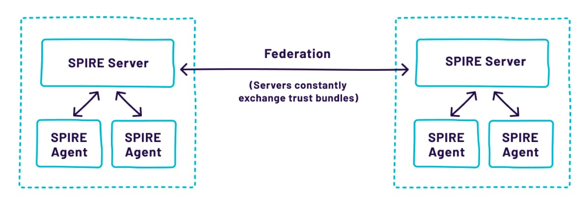
图 4.3: 有两个不同的信任域通过联邦连接的公司架构的说明。每个 SPIRE 服务器只能为自己的信任域签署 SVID。

### SPIFFE Workload API

SPIFFE Workload API 是一个本地的、非网络化的 API，工作负载用它来获取他们当前的身份文件、信任捆绑和相关信息。重要的是，这个 API 是**未经认证的**，不要求工作负载拥有任何预先存在的证书。将这一功能作为本地 API 提供，允许 SPIFFE 实现者提出创造性的解决方案，在不需要直接认证的情况下识别调用者（例如，利用操作系统提供的功能）。Workload API 以 gRPC 服务器的形式公开，并使用双向流，允许根据需要将更新推入工作负载。

Workload API 不要求调用的工作负载对自己的身份有任何了解，也不要求调用 API 时拥有任何凭证。这就避免了在工作负载旁边部署任何认证秘密的需要。


图 4.4：工作负载 API 提供信息和设施来利用 SPIFFE 的身份。

SPIFFE 工作负载 API 向工作负载提供 SVID 和信任包，并在必要时对其进行轮换。

## 什么是 SPIRE？

SPIFFE 运行环境（SPIRE）是 SPIFFE 规范中所有五个部分的一个生产可用的开源实现。

SPIRE 项目（以及 SPIFFE）由云原生计算基金会主办，该基金会由许多领先的基础设施技术公司成立，为有利于云原生社区的开源项目提供一个中立的家园。

SPIRE 有两个主要组成部分：服务器和代理。服务器负责验证代理和构建 SVID，而代理则负责为 SPIFFE Workload API 提供服务。这两个组件都是使用面向插件的架构编写的，因此它们可以很容易地被扩展，以适应大量不同的配置和平台。

### SPIRE 架构

SPIRE 的架构由两个关键组件组成，即 SPIRE 服务器和 SPIRE 代理。

**SPIRE 服务器**

SPIRE 服务器管理和发布 SPIFFE 信任域中的所有身份。它使用一个数据存储来保存关于其代理和工作负载等的信息。SPIRE 服务器通过使用注册条目获知其管理的工作负载，注册条目是为节点和工作负载分配 SPIFFE ID 的灵活规则。

该服务器可以通过 API 或命令行命令进行管理。需要注意的是，由于服务器掌握着 SVID 的签名密钥，它被认为是一个重要的安全组件。在决定它的位置时应特别考虑。这一点将在本书后面讨论。

*数据存储*

SPIRE 服务器使用一个**数据存储**来跟踪其当前的注册条目，以及它所发布的 SVID 的状态。目前，支持几种不同的 SQL 数据库。SPIRE 装有 SQLite，这是一个内存中的嵌入式数据库，用于开发和测试目的。

*上游机构*

一个信任域中的所有 SVID 都由 SPIRE 服务器签署。默认情况下，SPIRE 服务器会生成一个自签名证书（用自己随机生成的私钥签名的证书）来签署 SVID，除非配置了一个 **上游证书机构（Upstream Certificate Authority）** 插件接口。上游证书授权的插件接口允许 SPIRE 从另一个证书授权机构获得其签名证书。

在许多简单的情况下，使用自签名的证书就可以了。然而，对于较大的安装，可能需要利用预先存在的证书颁发机构和 X.509 证书的分层性质，使多个 SPIRE 服务器（和其他生成 X.509 证书的软件）一起工作。

在一些组织中，上游证书颁发机构可能是一个中央证书颁发机构，你的组织在其他方面使用它。如果你有许多不同种类的证书在使用，而且你希望它们在你的基础设施中都被信任，那么这就很有用。

**SPIRE 代理**

SPIRE 代理只有一个功能，尽管是一个非常重要的功能：为 Workload API 服务。在完成这一壮举的过程中，它解决了一些相关的问题，如确定工作负载的身份，调用它，并安全地将自己介绍给 SPIRE 服务器。在这种安排中，它是执行所有重任的代理。

代理不需要像 SPIRE 服务器那样的主动管理。虽然它们确实需要一个配置文件，但 SPIRE 代理从 SPIRE 服务器直接接收有关本地信任域和可能调用它的工作负载的信息。在给定的信任域中定义新的工作负载时，只需在 SPIRE 服务器中定义或更新记录，有关新工作负载的信息就会自动传播给相应的代理。


图 4.5：SPIRE 代理暴露了 SPIFFE Workload API，并与 SPIRE 服务器一起工作，向调用代理的工作负载发布身份信息。

*插件架构*

SPIRE 是作为一套插件建立的，因此很容易扩展，以适应新的节点验证器、工作负载验证器和上游机构。

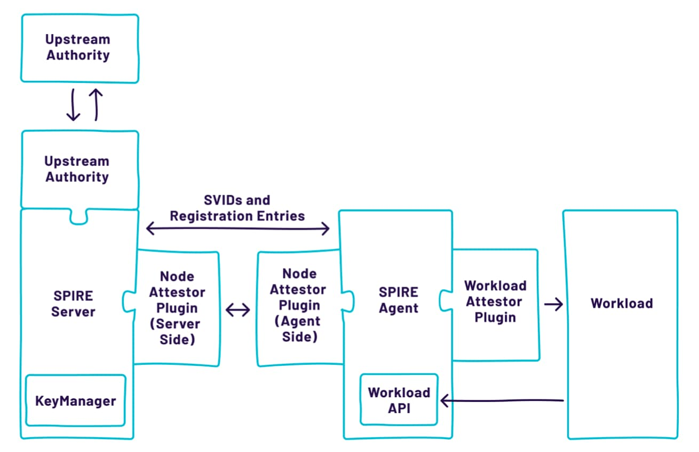
图 4.6：SPIRE 支持的密钥插件接口说明。服务器包括 Node Attestor、KeyManager 和 Upstream Authority 插件，而 Agent 端包括 Node Attestor 和 Workload Attestor 插件。

**SVID 管理**

SPIRE 代理使用其在节点认证期间获得的身份，向 SPIRE 服务器进行认证，并获得其被授权管理的工作负载的 SVID。由于 SVID 是有时间限制的，代理还负责根据需要更新 SVID，并将这些更新传达给相关工作负载。信任捆绑也会轮换和接收捆绑包，这些更新由代理跟踪并传达给工作负载。代理维护所有这些信息的内存缓存，因此，即使 SPIRE 服务器停机，也可以提供 SVID，而且还可以确保 Workload API 响应的性能，因为当有人调用工作负载 API 时，不需要往返于服务器。

### 证明

证明是一个过程，通过这个过程可以发现和断言有关工作负载及其环境的信息。换句话说，它是一个利用现有信息作为证据，肯定地证明工作负载身份的过程。

在 SPIRE 中，有两种类型的证明：节点和工作负载证明。节点证明主张描述节点的属性（例如，特定 AWS 自动扩展组的成员，或节点位于哪个 Azure 区域），而工作负载证明主张描述工作负载的属性（例如，它正在运行的 Kubernetes 服务账户，或磁盘上的二进制文件的路径）。这些属性在 SPIRE 中的表述被称为**选择器（Selector）**。

SPIRE 支持几十种开箱即用的选择器类型，而且这个列表还在继续增加。截至本文撰写之时，节点验证器列表包括对裸机、Kubernetes、亚马逊网络服务、谷歌云平台、Azure 等的支持。工作负载验证器包括对 Docker、Kubernetes、Unix 等的支持。

此外，SPIRE 的可插拔架构允许运营商轻松扩展系统，以支持他们认为合适的其他选择器类型。

**节点证明**

节点认证发生在代理首次启动时。在节点认证中，代理与 SPIRE 服务器联系并进行交流，服务器旨在积极识别代理正在运行的节点及其所有相关选择器。为了实现这一目标，在代理和服务器中都运行了一个特定平台的插件。例如，在 AWS 的情况下，代理插件从 AWS 收集只有该特定节点可以访问的信息（由 AWS 密钥签署的文件），并将其传递给服务器。然后，服务器插件验证 AWS 的签名，并进一步调用 AWS 的 API，以断定该声明的准确性，并收集有关该节点的额外选择器。

成功的节点认证会导致其向有关的代理发放身份。然后，代理使用这个身份进行所有进一步的服务器通信。

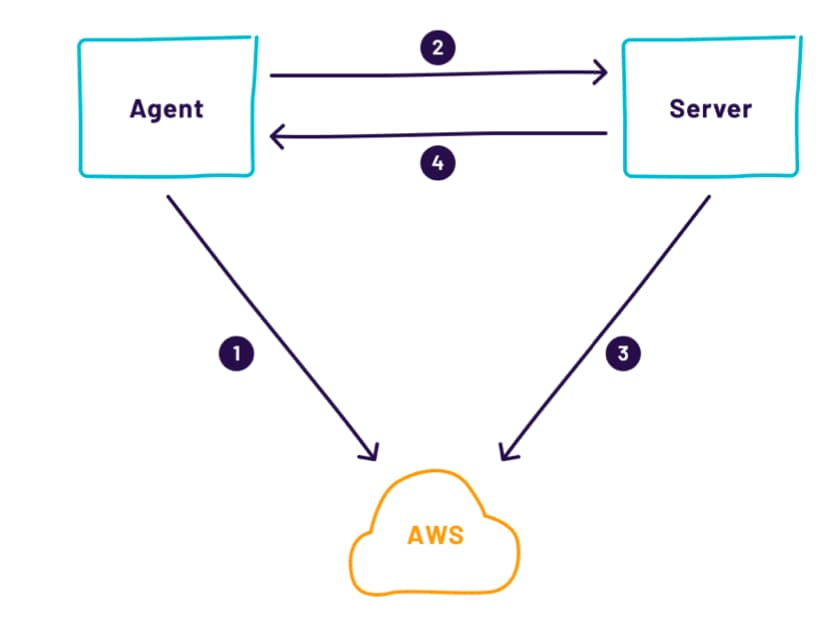
图 4.7：在 AWS 中运行的节点的节点证明。

1. 代理收集节点的身份证明，调用 AWS 的 API。
2. 代理将此身份证明发送给服务器。
3. 服务器通过调用 AWS API 验证步骤 2 中获得的身份证明，然后为代理创建一个 SPIFFE ID。

### 工作负载证明

工作负载认证是确定工作负载身份的过程，它将导致身份文件的发布和交付。在工作负载调用并建立与 SPIFFE 工作负载 API 的连接时（在工作负载对 API 的每一次 RPC 调用中），都会进行认证，而此后的过程则由 SPIRE 代理上的一组插件驱动。

当代理收到来自调用工作负载的新连接时，代理将利用操作系统功能来确定到底是哪个进程打开了新连接。所利用的操作系统功能将取决于代理运行的操作系统。在 Linux 的情况下，代理将进行系统调用，以检索进程 ID，用户标识符，以及在特定套接字上调用的远程系统的全局唯一标识符。在 BSD 和 Windows 中，要求的内核元数据将是不同的。反过来，代理将向验证器插件提供调用工作负载的 ID。从这里开始，验证器在其插件中扇出，提供关于调用者的额外进程信息，并以选择器的形式将其返回给代理。

每个验证器插件负责对调用者进行内省，生成一组描述调用者的选择器。例如，一个插件可以查看内核级别的细节，并生成选择器，如进程以何种身份运行的用户和组，而另一个插件可以与 Kubernetes 通信，并生成选择器，如进程运行的命名空间和服务账户。第三个插件可以与 Docker 守护进程通信，并生成 Docker 镜像 ID、Docker 标签和容器环境变量的选择器。


图 4.8: 工作负载证明。

1. 一个工作负载调用工作负载 API 来请求一个 SVID。
2. 代理询问节点的内核以获得调用进程的属性。
3. 代理得到发现的选择器。
4. 代理通过比较发现的选择器和注册条目来确定工作负载的身份，并向工作负载返回正确的 SVID。

### 登记条目

为了让 SPIRE 发布工作负载身份，它必须首先了解其环境中预期或允许的工作负载；哪些工作负载应该在哪里运行，它们的 SPIFFE ID 和一般组成应该是什么。SPIRE 通过**注册条目**了解这些信息，注册条目是使用 SPIRE API 创建和管理的对象，包含上述信息。

对于每个注册条目，有三个核心属性。第一个被称为 Parent ID—— 这实际上是告诉 SPIRE 一个特定的工作负载应该在哪里运行（以及延伸到哪些代理被授权代表它询问 SVID）。第二个是 SPIFFE ID—— 当我们看到这个工作负载时，我们应该向它发出什么 SPIFFE ID？最后，SPIRE 需要一些信息来帮助它识别工作负载，这就是从证明中选择器的作用。


图 4.9：注册条目的三个核心属性。

注册条目将 SPIFFE ID 与它们所代表的节点和工作负载绑定。

一个注册条目既可以描述一组节点，也可以描述一个工作负载，后者通常通过使用一个 Parent ID 来引用前者。

**节点条目**

描述一个节点（或一组节点）的注册条目使用由节点认证产生的选择器来分配一个 SPIFFE ID，这在以后注册工作负载时可以被引用。一个节点可以被证明有一组与多个节点条目相匹配的选择器，从而允许它加入一个以上的组。在决定一个特定的工作负载被允许运行的确切位置时，这提供了大量的灵活性。

SPIRE 自带各种节点验证器可供使用，每个验证器都会生成特定平台的选择器。虽然 SPIRE 服务器支持一次加载多个节点验证器插件，但 SPIRE 代理只支持加载一个。目前可用的节点选择器包括：

- 在谷歌云平台（GCP）上。
- 在 Kubernetes 上，该节点所处的 Kubernetes 集群的名称。
- 在亚马逊网络服务（AWS），节点的 AWS 安全组。

节点条目的 Parent ID 被设置为 SPIRE 服务器的 SPIFFE ID，因为是服务器在进行验证，并断言有关节点确实符合条目定义的选择器。

**工作负载条目**

描述工作负载的注册条目使用由工作负载证明产生的选择器，在满足一定条件的情况下为工作负载分配一个 SPIFFE ID。当 Parent ID 和选择器的条件得到满足时，工作负载可以得到一个 SPIFFE ID。

工作负载条目的 Parent ID 描述了该工作负载被授权运行的地方。其值是一个节点或一组节点的 SPIFFE ID。在节点上运行的 SPIRE 代理会收到该工作负载条目的副本，包括在为该特定条目发出 SVID 之前必须证明的选择器。

当工作负载调用代理时，代理进行工作负载验证，并将发现的选择器与条目中定义的选择器进行交叉对比。如果一个工作负载拥有整个定义的选择器集，那么条件就得到了满足，该工作负载就会得到一个带有定义的 SPIFFE ID 的 SVID。

与节点认证不同，SPIRE 代理支持同时加载许多工作负载验证器插件。这允许在工作负载条目中混合匹配选择器。例如，工作负载条目可能要求工作负载在特定的 Kubernetes 命名空间中，在其 Docker 镜像上应用特定的标签，并具有特定的 SHA 和。

## SPIFFE/SPIRE 应用的概念威胁模型

SPIFFE 和 SPIRE 所面临的一系列具体威胁是情景性的。了解 SPIFFE/SPIRE 的一般威胁模式是断言你的具体需求可以得到满足的重要步骤，也是发现可能需要进一步缓解的地方。

在本节中，我们将描述 SPIFFE 和 SPIRE 的安全边界，以及系统中每个组件被破坏的影响。在本书的后面，我们将介绍不同的 SPIRE 部署模式所带来的具体安全考虑。

**假设**

SPIFFE 和 SPIRE 旨在作为分布式身份和认证的基础，与[云原生](https://github.com/cncf/toc/blob/master/DEFINITION.md)设计架构一致。SPIRE 支持 Linux 和 BSD 系列（包括 MacOS）。目前不支持 Windows，尽管在这个领域已经做了一些早期的原型设计。

SPIRE 坚持零信任网络安全模型，其中假定网络通信是敌对的或可能完全被破坏。也就是说，还假设 SPIRE 组件运行的硬件以及其操作人员是值得信赖的。如果硬件植入或内部威胁是威胁模型的一部分，应围绕 SPIRE 服务器的物理位置和其配置参数的安全性进行仔细考虑。

根据所选择的节点和工作负载证明方法，可能进一步隐含对第三方平台或软件的信任。通过多个独立的机制来证明信任，可以提供更多的信任证明。例如，利用基于 AWS 或 GCP 的节点证明，意味着计算平台被认为是值得信赖的，而利用 Kubernetes 的工作负载证明，意味着 Kubernetes 的部署被认为是值得信赖的。由于完成证明的方式多种多样，而且 SPIRE 架构是完全可插拔的，因此本评估不考虑这些流程的安全性（和相关假设）。相反，它们应逐一进行评估。

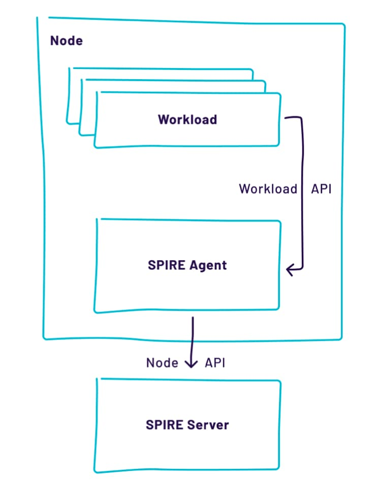
图 4.10：作为威胁模型的一部分被考虑的组件。

### 安全边界

安全边界在形式上被理解为两个不同信任程度的区域之间的交汇线。

SPIFFE/SPIRE 定义了三个主要的安全边界：一个是工作负载和代理之间，一个是代理和服务器之间，还有一个是不同信任域的服务器之间。在这个模型中，工作负载是完全不受信任的，其他信任域中的服务器也是如此，如前所述，网络通信始终是完全不受信任的。

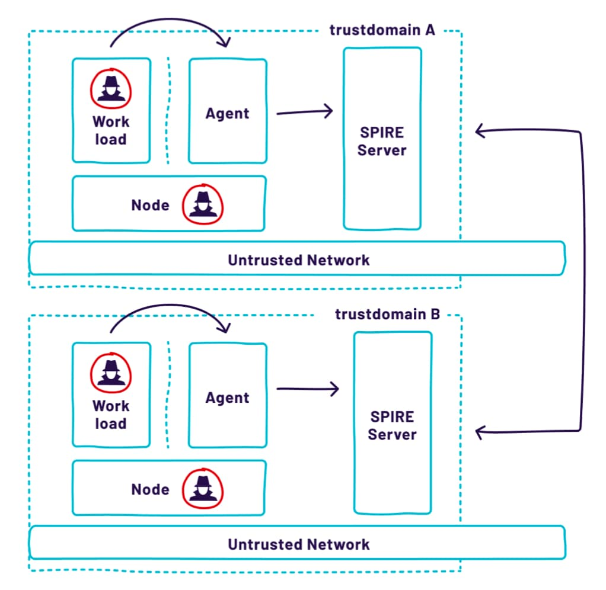
图 4.11：SPIFFE/SPIRE 的安全边界。

**工作负载 | 代理边界**

随着人们在系统中的移动和跨越这些边界，信任程度会慢慢增加。从工作负载开始，我们跨越安全边界进入代理。通常预计（尽管不是必须的），工作负载和代理之间存在超越 SPIRE 设计的安全机制，例如利用 Linux 用户权限和 / 或容器化。

代理不相信工作负载会提供任何形式的输入。代理对工作负载身份的所有断言都是通过带外检查做出的。在工作负载证明的背景下，这是一个重要的细节 —— 任何选择器的值可以被工作负载本身操纵，这本身就是不安全的。

**代理 | 服务器边界**

下一个边界存在于代理和服务器之间。代理比工作负载更值得信任，但比服务器更不值得信任。SPIRE 的一个明确的设计目标是，它应该能够在节点受到威胁的情况下存活。由于工作负载是完全不可信的，我们在任何给定的时间点上离节点只有一到两次攻击威胁。代理有能力代表工作负载创建和管理身份，但也有必要将任何特定代理的权力限制在它完成任务所严格需要的范围内（遵循最小特权原则）。

为了减轻节点（和代理）受到威胁的影响，SPIRE 需要了解特定工作负载被授权运行的地方（以 Parent ID 的形式）。代理必须能够证明注册条目的所有权，然后才能为其获得身份。因此，被攻击的代理不能获得任意的身份 —— 它们只能获得首先应该在节点上运行的工作负载的身份。

值得注意的是，在节点认证过程中，SPIRE 服务器和 SPIRE 代理之间的通信可以在不同的时间点使用 TLS 和相互 TLS，这取决于节点是否尚未被认证，或者代理是否已经拥有有效的 SVID 并可以将其用于相互 TLS，此时服务器和代理之间的所有通信是安全的。

**服务器 | 服务器边界**

最后的边界存在于不同信任域的服务器之间。SPIRE 服务器只被信任为在其直接管理的信任域内构造的 SVID。当 SPIRE 服务器相互联合并交换公钥信息时，它们收到的秘钥仍然是在它们所收到的信任域范围内的。与网络 PKI 不同，SPIFFE 不会简单地把所有的公钥扔到一个大的混合包里。其结果是，如果外部信任域的破坏不会导致本地信任域的 SVID 的构造能力。

应该注意的是，SPIRE 服务器没有任何多方保护。信任域中的每个 SPIRE 服务器都可以访问签名密钥，它可以用这些密钥构造 SVID。服务器之间存在的安全边界严格限于不同信任域的服务器，不适用于同一信任域内的服务器。

### 组件被破坏后的影响

虽然工作负载总是被认为是被破坏的，但预计代理一般不会被破坏。如果一个代理被破坏，攻击者将能够访问相应代理被授权管理的任何身份。在工作负载和代理之间存在 1:1 关系的部署中，这一点不太值得关注。在代理管理多个工作负载的部署中，这是一个需要理解的重要问题。

当代理被引用为某一身份的父代时，它们被授权管理该身份。由于这个原因，在合理的范围内，将注册条目父身份的范围尽可能地缩小是一个好主意。

在服务器被破坏的情况下，可以预计，攻击者将能够在该信任域内构造任意的身份。SPIRE 服务器无疑是整个系统中最敏感的组成部分。在管理和放置这些服务器时应小心谨慎。例如，SPIRE 解决了节点破坏的问题，因为工作负载不受信任，但如果 SPIRE 服务器与不受信任的工作负载在同一主机上运行，那么服务器就不再享有曾经由代理 / 服务器安全边界提供的保护。因此，强烈建议将 SPIRE 服务器放在与它们要管理的不受信任的工作负载不同的硬件上。

**代理的注意事项**

SPIRE 通过将一个代理的权限限定在它直接被授权管理的身份上，来说明节点的破坏...... 但如果攻击者可以破坏多个代理，或者也许是所有的代理，情况就明显要糟糕得多。

SPIRE 代理之间没有任何通信途径，大大限制了代理之间横向移动的可能性。这是一个重要的设计决定，旨在减轻可能的代理漏洞的影响。然而，应该理解的是，某些配置或部署选择可能部分或全部破坏这种缓解。例如，SPIRE 代理支持暴露一个 Prometheus 指标端点，然而，如果所有代理都暴露这个端点，并且那里存在漏洞，那么横向移动就变得轻而易举，除非有足够的网络级别控制。出于这个原因，我们强烈不建议将 SPIRE 代理暴露于传入的网络连接。

# 5. 开始前的准备

本章旨在让你为上线 SPIFFE/SPIRE 时需要做出的许多决定做好准备。

## 准备人力

如果你读了前面的章节，你一定很想开始使用 SPIRE，以一种可以在许多不同类型的系统和所有组织的服务中利用的方式管理身份。然而，在你开始之前，你需要考虑，部署 SPIRE 是**一个重大的基础设施变化**，有可能影响到许多不同的系统。本章是关于如何开始规划 SPIRE 的部署：获得认同，以不中断的方式启用 SPIRE 支持，然后利用它来实施新的安全控制。

### 组建团队并确定其他利益相关者

要部署 SPIRE，你需要确定来自安全、软件开发和 DevOps 团队的利益相关者。谁来维护 SPIRE 服务器本身？谁来部署代理？谁来编写注册条目？谁将把 SPIFFE 功能集成到应用程序中？它将如何影响现有的 CI/CD 管道？如果发生了服务中断，谁来修复它？性能要求和服务水平目标是什么？

在这本书中，以及许多公开的博客文章和会议演讲中，都有一些成功部署 SPIRE 的组织的例子，既可以作为一种模式，也可以作为向同事宣传 SPIRE 的有用材料。

### 说明你的情况并获得支持

SPIRE 跨越了几个不同的传统信息技术孤岛，因此，期望看到你的 DevOps 团队、软件开发团队和安全团队之间有更多的跨组织合作。重要的是，他们要一起工作，以确保成功和无缝部署。考虑到这些团队中的每一个都有不同的需求和优先事项，需要解决这些问题以获得他们的支持。

在规划 SPIRE 部署时，你需要了解哪些成果对你的企业最重要，并将这些成果作为项目的驱动力和你将提供的解决方案的价值。每个团队都需要看到 SPIRE 对自己以及对整个企业的好处。本书第 2 章 "收益" 中描述了 SPIRE 部署的许多好处，在本节中，我们将把其中一些好处提炼成令人信服的论据。

**对安全团队有说服力的论点**

减少安全团队的工作量是部署 SPIRE 的一个非常有说服力的案例：他们可以专注于设计正确的注册条目，以确保每个服务获得正确的身份，而不是部署临时的安全解决方案，以及手动管理数百或数千个证书。

一个更长期的好处是，SPIRE 可以提高组织的整体安全态势，因为 SPIRE 没有容易被盗或误用的凭证。与盗用或歪曲凭证有关的大量攻击，以及敏感数据的暴露，都得到了缓解。有可能向外部审计师证明，正确的服务正在相互安全地进行通信，没有意外疏忽的可能。即使外部人员可以破坏一个服务，他们对其他服务发起攻击的能力也是有限的。

**对软件开发团队有说服力的论点**

对于应用程序开发团队来说，他们能够通过不等待工单或手动工作流程来提供证书而加快行动，这是最有说服力的案例。如果他们目前在代码旁边手动部署秘密，并被安全团队谈话，他们不再需要忍受这些。他们也不需要在秘密存储中管理秘密。

一个次要的好处是，软件组件可能能够以它们以前无法安全进行的方式直接进行通信。如果云服务不能访问一个关键的数据库或基本的云服务，因为没有办法安全地做到这一点，那么就有可能使用 SPIFFE 身份来创建一个安全连接，为你的团队提供新的架构潜力。

**对 DevOps 团队有说服力的论点**

部署 SPIRE 的最大收益是针对 DevOps 团队。如果每个服务都有自己的安全身份，那么服务就可以部署在任何地方 —— 在任何内部数据中心、云供应商或一个云供应商中的区域。这种新的灵活性允许降低成本，提高可扩展性，并改善可靠性，因为部署决策可以独立于安全要求。

对 DevOps 团队来说，另一个关键的好处是，每个服务的传入请求都被贴上 SPIFFE ID 的标签，这可以被记录、测量，并报告给监控系统。这对拥有数百或数千项服务的大型组织的性能管理是非常有帮助的。

## 创建一个计划

规划 SPIRE 部署的第一个目标是确定是否每项服务都需要被 SPIFFE 感知，或者非 SPIFFE 服务的 "孤岛" 是否仍然可以满足要求。将每项服务都转移到 SPIFFE 是最直接的选择，但要一下子全部实施可能是个挑战，特别是在非常大的组织中。

### 岛屿和桥梁的规划

有些环境很复杂，要么有多个组织，要么是传统和新开发的结合。在这种情况下，人们往往希望只让环境的一个子集启用 SPIFFE。需要考虑两种选择，这取决于系统之间的整合程度和它们之间的复杂性。让我们来看看这两种架构，我们称之为 "独立岛" 和 “桥接岛”。

每个岛被认为是它自己的信任域，在每个岛上有工作负载或 “居民”。

**独立岛**

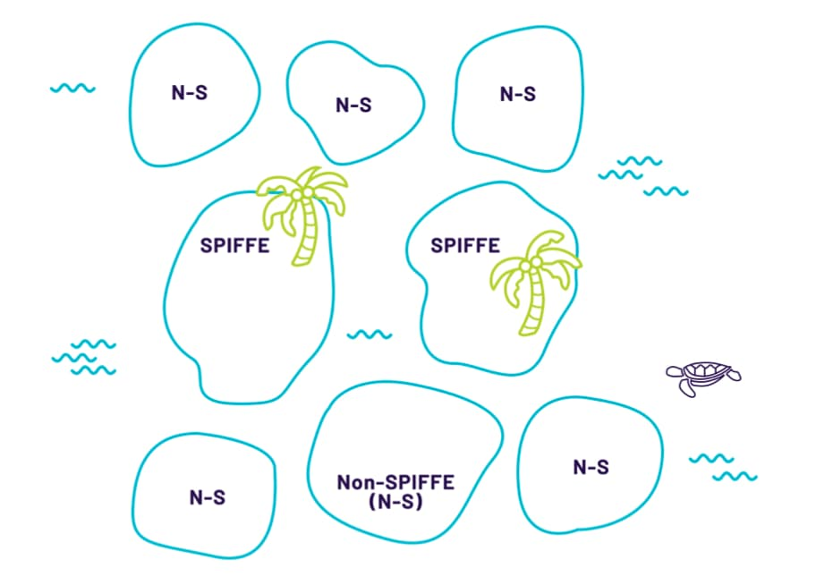
图 5.1：这里有两个独立的 SPIFFE 部署（独立岛屿）。

独立岛模式允许各个信任域相互独立运行。这通常是最简单的选择，因为每个岛可以以对该岛有意义的方式运行 SPIRE。

**桥接岛**


图 5.2：这里我们有两个独立的 SPIFFE 部署，通过 Federation 桥接，使每个岛的服务都能信任对方，从而进行通信。在 SPIFFE 和非 SPIFFE 岛屿之间仍然没有通信。

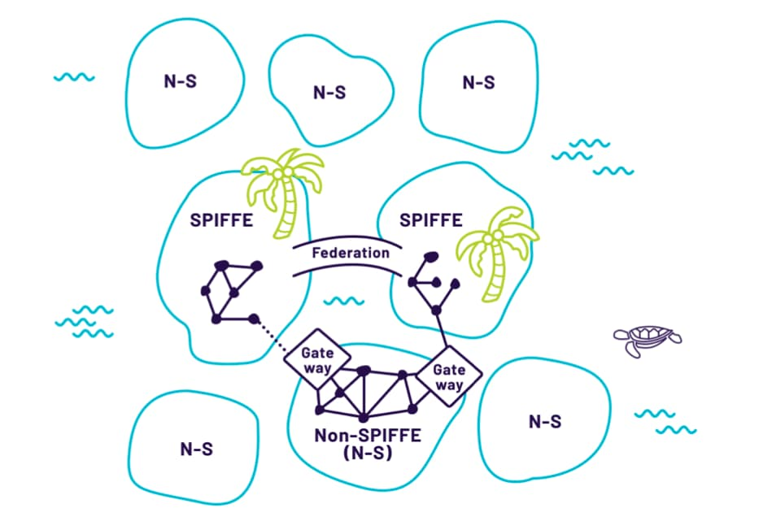
图 5.3: 向非 SPIFFE 岛添加网关是连接 SPIFFE 和非 SPIFFE 岛的一种方式。

桥接岛模式允许非 SPIFFE 岛上的非 SPIFFE 服务与网关对话。然后，网关将请求转发给支持 SPIFFE 的岛上的居民，我们称他们为 Zero。从 Zero 的角度来看，网关发出了请求。Zero 和他在支持 SPIFFE 的岛上的朋友可以向网关进行认证，并向非 SPIFFE 岛上的服务发送消息。

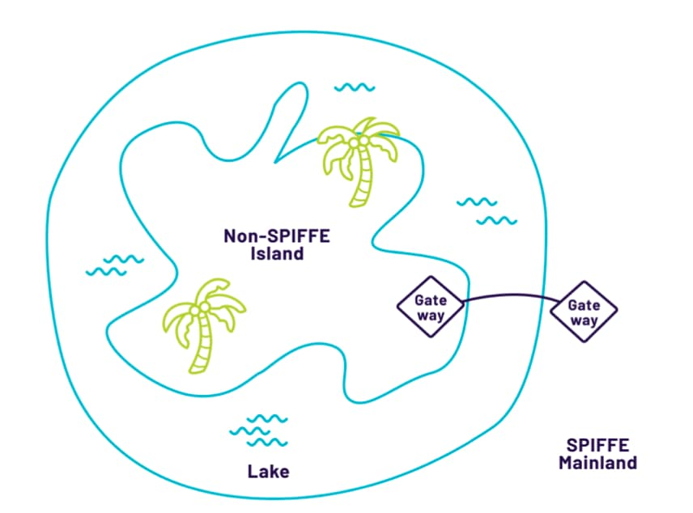
图 5.4：在这个图中，有一个支持 SPIFFE 的生态系统（大陆），而在这个生态系统中，有一个非 SPIFFE 服务的口袋（湖上的岛屿）。为了使大陆和岛屿上的服务能够相互交流，需要有一个网关。


图 5.5：桥接岛结构。

在桥接岛架构下，网关是在未启用 SPIFFE 的岛上创建的。这些非 SPIFFE 岛可能不容易采用 SPIFFE 架构，原因有很多：可能有遗留软件，不能轻易修改或更新；岛屿可能使用自己的识别生态系统，如 Kerberos 或 SPIFFE 与其他技术比较一章中描述的其他选项之一；或者系统可能在不太适合现有 SPIFFE 解决方案（如 SPIRE）模式的技术上运行工作负载。

在这些情况下，使用**网关**服务在 SPIFFE 世界和非 SPIFFE 岛之间架起连接的桥梁可能是有用的。当支持 SPIFFE 的工作负载想要与非 SPIFFE 岛的工作负载对话时，它与网关建立一个经过认证的连接，然后与目标工作负载建立一个连接。这个与目标工作负载的连接可能是未经认证的，或者使用该岛的非 SPIFFE 身份解决方案。同样，当非 SPIFFE 岛的工作负载想要连接到 SPIFFE 启用的工作负载时，非 SPIFFE 工作负载会连接到网关，然后创建一个 SPIFFE 认证的连接到目标 SPIFFE 启用的工作负载。

在这种情况下，发生在网关和启用 SPIFFE 的工作负载之间的认证在网关处被**终止**。这意味着支持 SPIFFE 的工作负载可以验证它是在与适当的网关对话，但不能验证它是在与网关另一端的正确工作负载对话。同样，目标工作负载只知道网关服务向它发送了一个请求，但却失去了原 SPIFFE 启用的工作负载的验证背景。这种模式允许这些复杂的组织开始采用 SPIFFE，而不必一下子转换。

在请求和工作流通过非 SPIFFE 岛的情况下，利用 JWT-SVID 进行跨请求的传播会很有用。你可以使用 X509-SVID 来签署文件（[如 HTTP 消息请求签署](https://tools.ietf.org/id/draft-cavage-http-signatures-12.html)），而不是只使用服务间的相互认证的 TLS，这样整个消息的真实性就可以被另一边支持 SPIFFE 的工作负载所验证。这对已知安全属性较弱的岛屿特别有用，因为它提供了对通过中间生态系统的消息没有被操纵的信心。

### 文档和监控工具

在准备开始上线时，重要的是要对服务进行检测，使指标和流量日志以一种方式暴露出来。

- 监督上线的人知道哪些（以及有多少）服务是支持 SPIFFE 的，哪些（以及有多少）不是。
- 客户端作者知道他们调用的哪些服务是支持 SPIFFE 的，哪些不是。
- 服务所有者知道他们的哪些客户端以及有多少客户端在调用支持 SPIFFE 的端点，哪些在调用传统端点。

重要的是，要为客户端和服务器实施者创建参考文件，预测你将收到的支持请求的种类，从而为上线做准备。

同样重要的是，创建工具来协助完成常见的调试和故障排除任务。回顾 SPIFFE 和 SPIRE 的收益，将 SPIFFE 引入你的组织应该赋予开发人员权力并消除路障。给利益相关者留下的印象是你在增加工作或制造摩擦，最终会减缓或停止更广泛的采用。为了减少这种情况，并确保文档和工具涵盖适当的主题，我们建议采取以下准备步骤。

| 步骤                                                         | 备注                                                         |
| :----------------------------------------------------------- | :----------------------------------------------------------- |
| 决定你将需要 SPIFFE 的哪些安全功能。                         | SPIFFE 身份可用于创建相互的 TLS 连接，用于授权，或其他功能，如审计日志。 |
| 确定使用什么格式的 SVID，用于什么目的。                      | 最常见的是将 X509-SVID 用于相互 TLS，但要确定这是否适用以及 SVID 是否将用于任何其他应用。 |
| 确定需要身份认证的工作负载的数量。                           | 不是每个工作负载都需要身份，特别是在早期。                   |
| 确定需要的独立信任域的数量。                                 | 每个信任域都需要部署自己的 SPIRE 服务器。做出这一决定的细节在下一章。 |
| 确定你的组织正在使用的语言、框架、IPC 技术等需要与 SPIFFE 兼容。 | 如果使用 X.509-SVID 进行相互 TLS，请确定你的组织中使用了哪些 Web 服务器（Apache HTTPD、NGINX、Tomcat、Jetty 等）以及使用了哪些客户端库。如果客户端库期望执行 DNS 主机名验证，请确保你的 SPIFFE 部署与这种期望兼容。 |

### 了解性能影响

应将性能影响作为部署规划的一部分加以考虑。

作为上线准备的一部分，你应该检查一系列工作负载的基准，这些工作负载代表了你的组织在生产中运行的各种应用。这可以确保你至少意识到，并希望能准备好解决在推广过程中可能出现的任何性能问题。

**TLS 性能**

在许多组织中，开发人员和运维团队提出的第一个担忧是，在服务之间建立相互的 TLS 连接会太慢。在现代硬件上，通过现代的 TLS 实现，TLS 的性能影响是最小的。

> "在我们的生产前端机器上，SSL/TLS 占 CPU 负载的比例不到 1%，每个连接占内存的比例不到 10KB，网络开销不到 2%。许多人认为，SSL/TLS 需要大量的 CPU 时间，我们希望前面的数字能帮助消除这种想法。"——Adam Langley， Google，[Overlocking SSL](https://www.imperialviolet.org/2010/06/25/overclocking-ssl.html)，2010 年

> “我们已经使用硬件和软件负载均衡器大规模地部署了 TLS。我们发现，在商用 CPU 上运行的基于软件的现代 TLS 实现，其速度足以处理繁重的 HTTPS 追踪负载，而不需要求助于专用加密硬件。"——Doug Beaver，Facebook，[HTTP2 Expression of Interest](https://lists.w3.org/Archives/Public/ietf-http-wg/2012JulSep/0251.html)，2012 年

一般来说，性能影响取决于多种因素，包括网络拓扑结构、API 网关、L4-L7 防火墙和其他许多因素。此外，你所使用的协议及其实现以及证书和密钥大小也可能影响性能，所以这是一个相当广泛的话题。

下表提供了与 TCP 相比两个不同阶段的开销数据，特别是握手和数据传输阶段的数据。

| TLS 阶段 | 协议开销                                  | 延迟       | CPU                | 内存          |
| :------- | :---------------------------------------- | :--------- | :----------------- | :------------ |
| 握手     | TLS 为 2 kB mTLS 为 3 kB +1 kB/add'l Cert | 12 - 17 ms | 比 TCP 多出约 0.5% | <10kb / 连接  |
| 数据传输 | 22B/packet                                | <3 us      | 比 TCP 多不到 1%   | <10 kB / 连接 |

## 向 SPIFFE 和 SPIRE 转变

关于组织如何对变化作出反应、影响和处理的研究有着丰富的历史。关于公众和组织对新技术的接受和采用，也有许多有趣的研究。对这些主题进行真正的公正研究超出了本书的范围，但如果我们不提及这些主题，那就是我们的失职，因为它们与 SPIFFE 的成功推广相关。

**令人信服的变化发生**

有几种方法可以说服他人，在你的组织内必须发生变化。下面的清单概述了你可以通过 SPIFFE 和 SPIRE 追求这种变革的方法。

- **感知有用性**：有人认为 SPIFFE 在帮助他们提高工作绩效方面有多大作用。展示具体成果的能力有助于提高感知的有用性。
- **感知的易用性**：人们会认为 SPIFFE 有多容易使用。对开发者和运维的用户体验的投入是至关重要的。
- **同行的影响**：某人对受尊敬的其他人对采用 SPIFFE 的看法以及他们是否采用了 SPIFFE 的看法。这就是在组织内积累政治资本的好处。往往说服正确的人比说服所有人更重要。
- **形象**：采用 SPIFFE 能在多大程度上提高某人在组织中的地位。
- **自愿性**：SPIFFE 的潜在采用者认为采用 SPIFFE 是自愿的还是强制的程度。这方面的影响取决于公司文化和个人的性格。在面对 "被迫" 采用者和拒不采用者（本章后半部分）时，请牢记这一点。

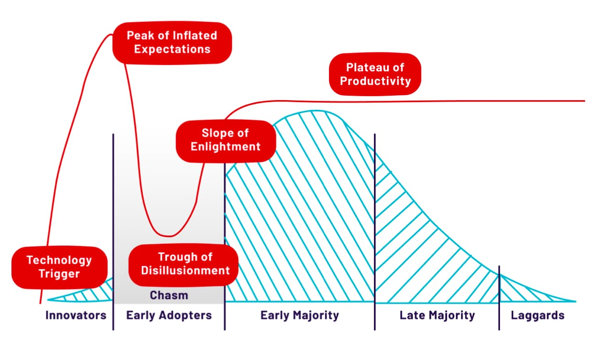
图 5.6：技术采用曲线（改编自 Roger 的钟形曲线和 Gartner 的 Hype Cycle）。图下的蓝色区域代表变化的数量和 SPIFFE 采用者的数量。红线代表对采用 SPIFFE 的热情和期望。

### 采用者角色

采用者与技术曲线相对应，可以帮助设定对如何向 SPIFFE 和 SPIRE 转变的预期。在此，我们列出了技术曲线中所涉及的采用者，并增加了两个你可能会遇到的采用者。

关于技术采用曲线中的采用者的更多信息可以在本书之外找到。

- **创新者**：把你自己看作是组织中的创新者，因为你采取了这些步骤来阅读本书，走到这一步，并决定继续前进。你基本上是在开拓将 SPIFFE 和 SPIRE 添加到你的架构中的进程，你需要帮助！你需要一个 " 白手套 “级别的支持和和帮助，所以一定要从低垂的果实和先导类别（下文有介绍）中挑选志愿者，并与他们保持良好的关系。
- **早期采用者**：重要的是要从给予创新者的 “白手套 "手把手支持水平中吸取经验教训，并将这些经验提炼成易于获取和理解的文档、有用的工具和可扩展的支持渠道。可能需要做大量的工作来实现 SPIFFE 的" 先驱者和推动者”（在本章后面会详细介绍），以便开发者能够解除障碍，然后能够实现 SPIFFE 的服务和客户端。
- **早期和晚期大众**：当你进入早期多数服务的时候，SPIFFE 的启用过程已经是一台运转良好的机器了。所有常用的使能器，如 CI/CD、工作流引擎、编排器、容器平台和服务网格，都应该启用 SPIFFE，以确保应用开发者在整个应用生命周期中得到支持，无论应用如何运行。
- **落后者**：由于团队文化、个人性格以及监管或合规要求，你的组织可能有保守的落后者。重要的是，不要对服务所有者为什么会落入这个类别下结论，而是要调查根本原因并适当解决。
- **"被迫" 转型**：最后一个采用 SPIFFE 的服务的客户可能会感到被迫转型。重要的是要为被迫转型者做好准备，确保他们采用 SPIFFE 的经验是积极的。
- **滞留者**：他们会出现，所以要让他们容易接受并受到激励。突出其他人目前正在享受生产力平台的例子。你应该期望提供额外的支持和帮助，因为在这个过程中会有很多人犹豫不决。

### 时机选择的考虑因素

在你选择谁来做的时候，在你的组织中保持最大的兼容性是至关重要的考虑。服务应保持其现有的 API 接口和端口，并在新的端口上引入其启用 SPIFFE 的 API。这样可以实现平稳过渡，并在需要时方便回滚。有许多来自其他服务团队客户端的服务团队应该期望在很长一段时间内（>6 个月）维护和支持这两个端点。

一旦一项服务的所有客户端都启用了 SPIFFE，并且不再使用非 SPIFFE 的 API，那么非 SPIFFE 的 API 就可以被关闭。

要注意不要过早地关闭遗留的端点。要特别注意批处理作业、计划任务和其他类型的不经常或不规则的调用模式。你不希望成为导致季度末或财务年度末对账工作失败的人。

如果你的环境太大或者太复杂，无法一下子完成，那么在选择服务启用 SPIFFE 的顺序时，一定要深思熟虑。从大石头、最低的果实和 " 先驱者和推动者 “的角度来考虑可能会有帮助，以加速采用。

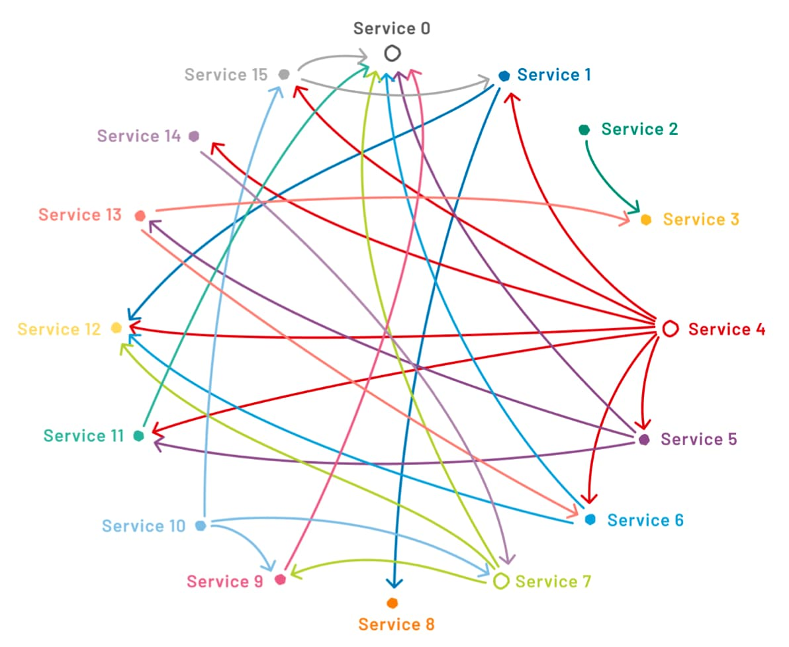
图 5.7：简化的微服务调用图。

**大石头**

大石头是指拥有最独特客户端的服务，以及与最多独特服务端连接的客户端。尽早处理大石头可能对加快采用速度很有诱惑力，但可能会导致得不偿失，造成问题，并使其他人不愿采用 SPIFFE。

看一下上面的调用图，可以通过连接最多的节点来识别大石头。它们可能是被许多客户端调用的关键服务，如 Service 0；它们可能是调用许多服务端的客户端，如 Service 4。大石头还可能包括既是客户端又是服务端的服务，如 Service 7。应对这些服务的迁移，既有好处，也有风险。

*效益*

- 有吸引力的选择
- 潜在的快速采用
- 影响广泛的好处
- 激励他人采用

*风险和挑战*

- 长期维护 2 个终端（传统的和支持 SPIFFE 的）
- 只有在所有客户端都采用了 SPIFFE 之后，才会关闭传统的端点
- 增加维护成本
- 增加了复杂性
- 扩展了组织能力
- 强制采用
- 不满的团队
- 惊喜的是，角落里有一只乌龟！

*低垂的果实*

最低矮的果实是拥有一至几个客户端的服务，或与一个或几个服务连接的客户端。这些通常是最容易指导过渡的，并且是理想的第一批采用者。

看一下上面的同一张图，低垂的果实是连接很少的节点。这些服务可能是单一的、其他服务的客户端，如 Service 2。低垂的果实也可能包括只有一个客户端的服务，比如 Service 8。在选择首先迁移哪些连接很少的服务时，明智的做法是选择那些最容易维持双端点的服务（传统的和 SPIFFE），或者那些必须在最短的时间内维持双堆栈的服务。

**效益**

- 如果出了问题，风险更小
- 由于需要较少的协调和规划，因此更容易从传统的方式完全转换到 SPIFFE 上
- 良好做法和学习机会

**风险和挑战**

- 推广工作可能被认为是缓慢的
- 可能没有足够的可见性或影响力来激发关键服务所有者的采用

**加速采用**

一些先导因素和推动因素可以促进 SPIFFE 在复杂和异构环境中的采用。它们中的每一个都有一系列不同的好处和挑战需要考虑。上面的考虑因素也适用于此；选择影响最广泛的系统，在确定所有非 SPIFFE 的消费者都已转换之前，不要转而使用非 SPIFFE 功能。

先行者包括帮助他人采用 SPIFFE 的工具和服务（如 CI/CD 和工作流引擎）。开发和运维工具应该提供给第一批采用者（创新者），并随着早期采用者的加入而反复改进。我们的目标是使工具和服务在早期大多数人加入的时候达到成熟。如果没有足够的前期投资，后期的大多数人和落伍者将陷入困境。

**开发者工具**

拥有有助于提高生产力的工具是成功推广 SPIFFE 的关键。收集一份你的组织在应用生命周期中使用的现有工具清单，从开发到运维再到报废，并考虑哪些现有工具应该支持 SPIFFE，是否需要建立、购买或部署新的工具。花在创建、整合和改进工具上的时间和精力往往会产生倍增效应，为其他人节省时间和精力，从而帮助促进更顺利的过渡。

值得注意的是，不应该孤立地建立或购买工具，而应该与他们的目标用户协商，最好是以渐进和迭代的方式。正确地做到这一点可能需要时间。

选择什么时候一个工具对第一批和早期采用者来说足够好是一个判断。在极少数情况下，工具的第一次迭代对早期和后期的大多数人来说是足够好的。

**持续集成和部署系统**

在 CI/CD 工具中实施 SPIFFE 会对组织中其他服务部门采用这种 SPIFFE 产生很大的影响，因为大多数团队都会与 CI/CD 系统定期互动。然而，反过来说，这意味着要让 CI/CD 系统的所有消费者都能意识到 SPIFFE 是一项庞大的任务，所以可能需要很长的时间来关闭所有非 SPIFFE 的集成。

**容器编排器**

如果你的组织已经在使用容器编排器，如 Kubernetes，那么你就成功了一半！你的组织已经在使用容器编排器。编排器使你的工作负载很容易通过 SPIFFE 感知代理前置，这样你的开发者就不需要再费心了。

**服务网格**

大型微服务服务网格架构作为 SPIFFE 部署的推动者尤其重要，因为在服务网格中引入 SPIFFE 支持是一种推出广泛支持的好方法，而不必让开发团队参与进来。

服务网格的相关性也伴随着一些风险和挑战。你可以想象，破坏服务网格可能会在一个环境中产生广泛的影响，并可能以灾难性的失败告终。

## 规划 SPIRE 行动

### 日复一日地运行 SPIRE

建议负责管理和支持 SPIRE 基础设施的团队尽可能早地参与。根据你的组织结构，很可能是你的安全或平台团队将负责整个生命周期的工作。

另一个需要考虑的方面是你如何分割涉及任何会影响系统安全、性能和可用性的改变的操作。在改变任何与你的 PKI、HSM、密钥轮换和相关操作有关的东西时，可能需要更严格的控制和门槛。你可能已经有一个围绕它的变更管理过程，如果没有，这是一个开始实施它的绝佳时机。

你的团队需要为不同的故障场景创建 Runbook，并对其进行测试，以了解该怎么做，需要观察哪些基本指标，并创建监控和警报。你可能已经知道你将使用什么监控和警报系统，但了解 SPIRE 服务器和代理提供的遥测数据和指标，以及这些数据意味着什么，将有助于你的团队避免停机时间。

### 测试复原力

故障注入练习帮助操作人员分析系统在某些故障条件下的表现。你可能对你的系统将如何基于架构做出反应有某些假设。尽管如此，在 SPIRE 部署中仍有多个潜在的故障点值得触发，以测试你的假设，并可作为运营团队的良好实践，以确保他们有所有的警报和 Runbook。

我们整理了一个清单，其中包括一些你想在你的故障测试程序中包括的情景。这不是一个完整的指南，只是为你的特定环境和部署模式建立检查表的一个起点。最好是用不同的停机时间来执行所有这些测试：短于配置的 TTL 的一半和更长的时间。

1. 如果 SPIRE 的部署是使用一个单一的数据库实例，请关闭该数据库。
2. 如果 SPIRE 部署在一个集群中使用一个数据库，有一个写副本和多个读副本，请关闭写实例。
3. 模拟数据库丢失，测试数据恢复。如果你不能恢复数据或只能从一个月前的数据中恢复，怎么办？
4. 在 HA 部署中关闭几台 SPIRE 服务器。
5. 在 HA 部署中关闭负载均衡器。
6. 在代理被证明后关闭它，或完全模拟 SPIRE 服务器丢失。
7. 如果使用上游授权，模拟上游授权失败。
8. 模拟根和中间 CA 的破坏、轮换和撤销。

定义哪些指标在每个测试场景中是最有用的，记录这些数值的预期健康和危险范围，并随着时间的推移进行测量。

这些场景应该被很好地记录下来，预期的输出被很好地定义，然后通过自动和定期运行的自动化测试来实现。

### 日志

像所有系统一样，日志是 SPIRE 的一个重要组成部分。然而，SPIRE 产生的日志也可作为审计和安全事件的证据。包含身份签发信息以及可观察到的证明细节，可以用来证明某些工作负载和服务的状态。由于日志可以被视为证据，因此在组建日志解决方案时，你可能希望注意到以下几个注意事项。

- 记录的保留应符合你的组织的法律要求
- 日志系统在接纳日志和存储方面都应具有高可用性
- 日志应该是防篡改的，必须能够提供证据
- 记录系统应该能够提供一个监管链

### 监控

除了通常的 SPIRE 组件的健康状况以确保系统正常运行外，你应该设置对服务器、代理和信任包的配置的监控，以检测未经授权的更改，因为这些组件是系统安全的基础。此外，还可以对身份的发放以及服务器和代理之间的通信进行监控，以发现异常情况。然而，根据系统中发布的身份信息量，你可能希望重新考虑监控的范围。

SPIRE 通过[遥测](https://en.wikipedia.org/wiki/Telemetry)技术为指标报告提供灵活的支持，允许使用多个收集器收集指标。目前支持的指标收集器有 Prometheus、Statsd、DogStatsd 和 M3。在服务器和代理中都可以同时配置多个采集器。

SPIRE 上有许多指标，其记录涵盖了所有的 API 和功能。

- 服务器
  - 管理 API 操作
  - 每个 API 的 DB 操作
  - SVID 发行的 API 操作
  - 轮换和秘钥管理
- 代理
  - 与服务器的交互
  - SVID 轮换和缓存维护
  - 工作负载证明

# 6. 设计一个 SPIRE 部署

读者将了解到 SPIRE 部署的组成部分，有哪些部署模式，以及在部署 SPIRE 时需要考虑哪些性能和安全问题。

你的 SPIRE 部署的设计应满足你的团队和组织的技术要求。它还应包括支持可用性、可靠性、安全性、可扩展性和性能的要求。该设计将作为你的部署活动的基础。

## 身份命名方案

请记住，在前面的章节中，SPIFFE ID 是一个结构化的字符串，代表一个工作负载的身份名称，正如你在第四章中看到的那样。工作负载标识符部分（URI 的路径部分）附加在信任域名（URI 的主机部分）上，可以组成关于服务所有权的含义，以表示它在什么平台上运行，谁拥有它，它的预期目的，或其他惯例。它是特意为你定义的灵活和可定制的。

你的命名方案可能是分层的，就像文件系统的路径。也就是说，为了减少歧义，命名方案不应该以尾部的正斜杠（`/`）结束。下面你将看到一些不同的样例，它们遵循三种不同的约定，你可以遵循，或者如果你感到特别有灵感，也可以想出你自己的。

### 直接命名服务

你可能会发现，作为软件开发生命周期的一部分，直接通过它从应用角度呈现的功能和它运行的环境来识别一个服务是很有用的。例如，管理员可能会规定，在特定环境中运行的任何进程都应该能够以特定身份出现。比如说。

```
 spiffe://staging.example.com/payments/mysql
```

或

```
 spiffe://staging.example.com/payments/web-fe
```

上面的两个 SPIFFE ID 指的是两个不同的组件 ——MySQL 数据库服务和一个 Web 前端 —— 在 staging 环境中运行的支付服务。`staging` 的意思是一个环境，`payment` 是一个高级服务。

前面两个例子和下面两个例子是说明性的，不是规定性的。实施者应该权衡自己的选择，决定自己喜欢的行动方案。

### 识别服务所有者

通常更高级别的编排器和平台都有自己的内置身份概念（如 Kubernetes 服务账户，或 AWS/GCP 服务账户），能够直接将 SPIFFE 身份映射到这些身份是有帮助的。比如：

```
spiffe://k8s-workload-cluster.example.com/ns/staging/sa/default
```

在这个例子中，信任域 `example.com` 的管理员正在运行一个 Kubernetes 集群 `k8s-workload-cluster.example.com`，它有一个 `staging` 命名空间，在这个命名空间中，有一个名为 `default` 的服务账户（SA）。

### 不透明的 SPIFFE 身份

SPIFFE 路径可能是不透明的，然后元数据可以被保存在一个二级数据库中。这可以被查询以检索与 SPIFFE 标识符相关的任何元数据。比如：

```
 spiffe://example.com/9eebccd2-12bf-40a6-b262-65fe0487d4
```

## SPIRE 的部署模式

我们将概述在生产中运行 SPIRE 的三种最常见的方式。这并不意味着我们要在这里限制可用的选择，但为了本书的目的，我们将把范围限制在这些部署 SPIRE 服务器的常见方式上。我们将只关注服务器的部署架构，因为每个节点通常安装一个代理。

### 数量：大信任域与小信任域的对比

信任域的数量预计是相对固定的，只是偶尔重访，而且预计不会随时间漂移太多。另一方面，一个给定的信任域中的节点数量和工作负载的数量，预计会根据负载和增长而频繁波动。

选择集中到一个大的信任域的单一信任根，还是分布和隔离到多个信任域，将由许多因素决定。本章的安全考虑部分谈到了使用信任域进行隔离的问题。还有一些原因，你可以选择多个小的信任域而不是一个大的信任域，包括增加可用性和租户的隔离。管理域边界、工作负载数量、可用性要求、云供应商数量和认证要求等变量也会影响这里的决策。

例如，你可以选择为每一个行政边界设置一个单独的信任域，以便在组织中可能有不同开发实践的不同小组之间进行自治。

| 类别     | 单信任域 | 嵌套   | 联合 |
| :------- | :------- | :----- | :--- |
| 部署规模 | 大       | 非常大 | 大   |
| 多区域   | 否       | 是     | 是   |
| 多云     | 否       | 是     | 是   |

表 6.1: 信任域大小的决策表

**一报还一报。在您的单一信任域中的单一 SPIRE 集群**

单一的 SPIRE 服务器，在高可用性的配置下，是单一信任域环境的最佳起点。


图 6.1: 单一信任域。

然而，当将单个 SPIRE 服务器部署到跨越区域、平台和云提供商环境的信任域时，当 SPIRE 代理依赖于远处的 SPIRE 服务器时，会出现潜在的扩展问题。在单个部署将跨越多个环境的情况下，解决在单个信任域上使用共享数据存储的解决方案是将 SPIRE 服务器配置为嵌套拓扑结构。

### 嵌套式 SPIRE

SPIRE 服务器的嵌套拓扑结构可使您尽可能保持 SPIRE 代理和 SPIRE 服务器之间的通信。

在这种配置中，顶级 SPIRE 服务器持有根证书和密钥，而下游服务器请求中间签名证书，作为下游服务器的 X.509 签名授权。如果顶层发生故障，中间服务器继续运行，为拓扑结构提供弹性。

嵌套拓扑结构很适合多云部署。由于能够混合和匹配节点验证器，下游服务器可以在不同的云提供商环境中驻留并为工作负载和代理提供身份。

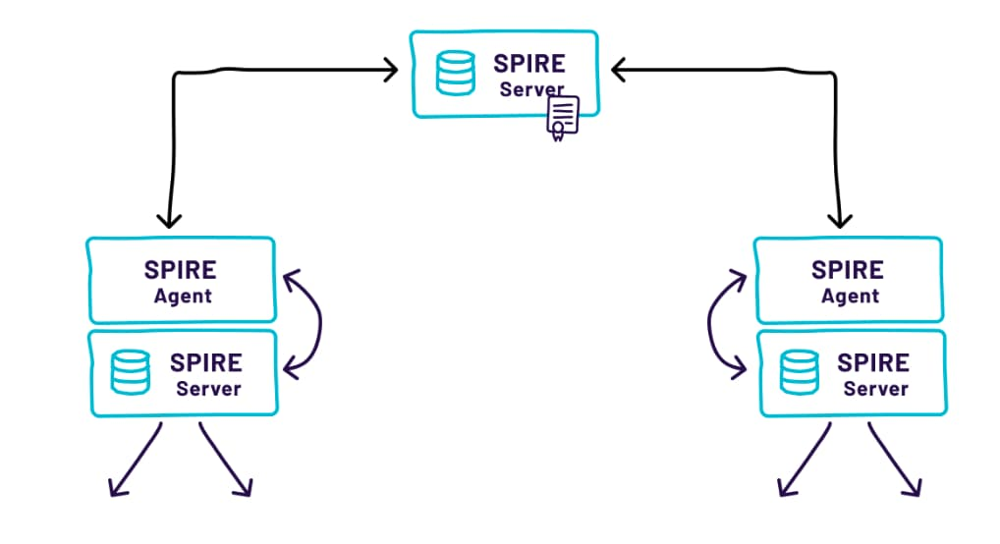
图 6.2：嵌套式 SPIRE 拓扑结构。

虽然嵌套式 SPIRE 是提高 SPIRE 部署的灵活性和可扩展性的理想方式，但它并不提供任何额外的安全性。由于 X.509 没有提供任何方法来限制中间证书颁发机构的权力，每个 SPIRE 服务器可以生成任何证书。即使你的上游证书颁发机构是你公司地下室混凝土掩体中的加固服务器，如果你的 SPIRE 服务器被破坏，你的整个网络可能会受到影响。这就是为什么必须确保每台 SPIRE 服务器都是安全的。


图 6.3：具有一个上游 SPIRE 服务器和两个嵌套 SPIRE 服务器的公司架构说明。两个嵌套的 SPIRE 服务器中的每一个都可以有自己的配置（与 AWS 和 Azure 有关），如果其中任何一个出现故障，另一个就不会受到影响。

### SPIRE 联邦

部署可能需要多个信任根基，也许是因为一个组织有不同的组织部门，有不同的管理员，或者因为他们有独立的暂存和生产环境，偶尔需要沟通。

另一个用例是组织之间的 SPIFFE 互操作性，如云供应商和其客户之间。


图 6.4：使用联邦信任域的 SPIRE 服务器。

这些多个信任域和互操作性用例都需要一个定义明确、可互操作的方法，以便一个信任域中的工作负载能够认证不同信任域中的工作负载。在联合 SPIRE 中，不同信任域之间的信任是通过首先认证各自的捆绑端点，然后通过认证的端点检索外部信任域的捆绑来建立的。

### 独立的 SPIRE 服务器

运行 SPIRE 的最简单方法是在专用服务器上，特别是如果有一个单一的信任域，而且工作负载的数量不大。在这种情况下，你可以在同一节点上共同托管一个数据存储，使用 SQLite 或 MySQL 作为数据库，简化部署。然而，当使用共同托管的部署模式时，记得要考虑数据库的复制或备份。如果你失去了节点，你可以迅速在另一个节点上运行 SPIRE 服务器，但如果你失去了数据库，你的所有代理和工作负载都需要重新测试以获得新的身份。

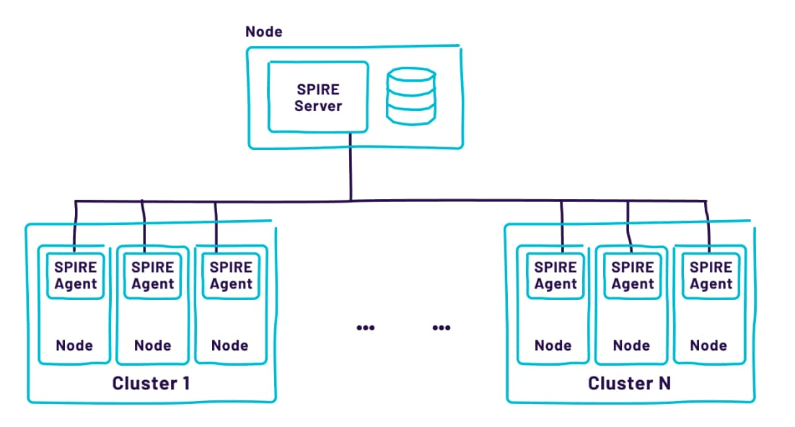
图 6.5: 单个专用的 SPIRE 服务器。

**避免单点故障**

保持简单有利也有弊。如果只有一台 SPIRE 服务器，而它丢失了，一切都会丢失，需要重建。拥有一个以上的服务器可以提高系统的可用性。仍然会有一个共享的数据存储和安全连接及数据复制。我们将在本章后面讨论这种决定的不同安全影响。

要横向扩展 SPIRE 服务器，请将同一信任域中的所有服务器配置为对同一共享数据存储进行读和写。

数据存储是 SPIRE 服务器保存动态配置信息的地方，如注册条目和身份映射策略。SQLite 与 SPIRE 服务器捆绑在一起，是默认的数据存储。


图 6.6: 多个 SPIRE 服务器实例在 HA 上运行。

## 数据存储建模

在进行数据存储设计时，你的首要关注点应该是冗余和高可用性。你需要确定每个 SPIRE 服务器集群是否有一个专用的数据存储，或者是否应该有一个共享的数据存储。

数据库类型的选择可能受到整个系统可用性要求和你的运营团队能力的影响。例如，如果运维团队有支持和扩展 MySQL 的经验，这应该是首要选择。

### 每个集群的专用数据存储

多个数据存储允许系统的每个专用部分更独立。例如，AWS 和 GCP 云中的 SPIRE 集群可能有独立的数据存储，或者 AWS 中的每个 VPC 可能有一个专用数据存储。这种选择的好处是，如果一个地区或云提供商发生故障，在其他地区或云提供商中运行的 SPIRE 部署就不会受到影响。

在发生重大故障时，每个集群的数据存储的缺点变得最为明显。如果一个地区的 SPIRE 数据存储（以及所有的 SPIRE 服务器）发生故障，就需要恢复本地数据存储，或者将代理切换到同一信任域的另一个 SPIRE 服务器集群上，假设信任域是跨区域的。

如果有必要将代理切换到一个新的集群，必须特别考虑，因为新的集群将不知道另一个 SPIRE 集群发出的身份，或该集群包含的注册条目。代理将需要对这个新集群进行重新认证，并且需要通过备份或重建来恢复注册条目。

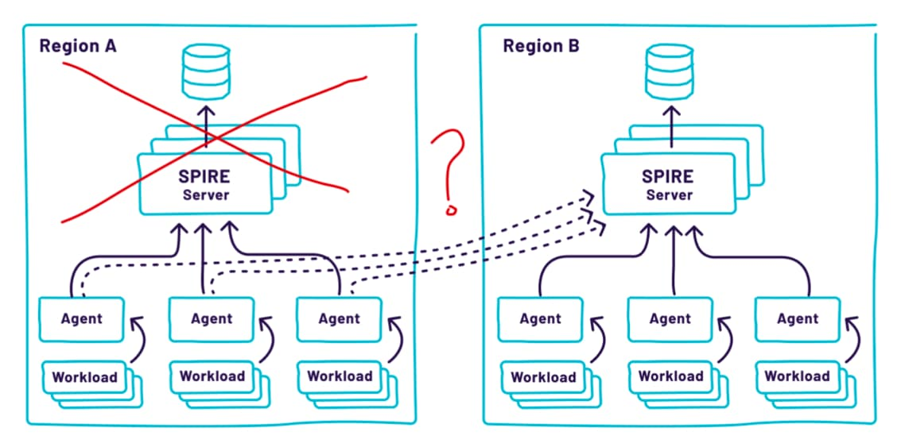
图 6.7: 如果你需要将一个集群中的所有代理迁移到另一个集群，会发生什么？

### 共享的数据存储

拥有一个共享的数据存储可以解决上述拥有单独数据存储的问题。然而，它可能会使设计和操作更加复杂，并依赖其他系统来检测故障，并在发生故障时更新 DNS 记录。此外，该设计仍然需要为每个 SPIRE 可用域、每个区域或数据中心的数据库基础设施的碎片，这取决于具体的基础设施。请查看 [SPIRE 文档](https://github.com/spiffe/spire/blob/master/doc/plugin_server_datastore_sql.md)以了解更多细节。

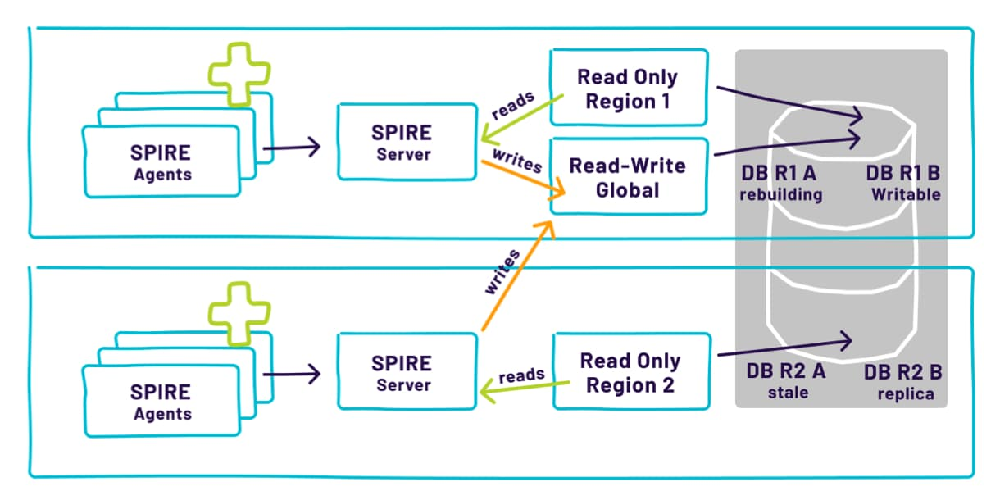
图 6.8：使用全局数据存储方案的两个集群。

## 管理失败

当基础设施发生故障时，主要的问题是如何继续向需要 SVID 才能正常运行的工作负载发放 SVID。SPIRE 代理的 SVID 内存缓存被设计为应对短期宕机的主要防线。

SPIRE 代理定期从 SPIRE 服务器获取授权发布的 SVID，以便在工作负载需要时将其交付给它们。这个过程是在工作负载请求 SVID 之前完成的。

### 性能和可靠性

SVID 缓存有两个优点：性能和可靠性。当工作负载要求获得其 SVID 时，代理不需要请求和等待 SPIRE 服务器提供 SVID，因为它已经有了缓存，这就避免了到 SPIRE 服务器的往返代价。此外，如果 SPIRE 服务器在工作负载请求其 SVID 时不可用，也不会影响 SVID 的发放，因为代理已经将其缓存起来了。

我们需要对 X509-SVID 和 JWT-SVID 进行区分。JWT-SVID 不能提前构建，因为代理不知道工作负载所需的 JWT-SVID 的具体受众，代理只预先缓存 X509-SVID。然而，SPIRE 代理确实维护着已发布的 JWT-SVID 的缓存，只要缓存的 JWT-SVID 仍然有效，它就可以向工作负载发布 JWT-SVID，而无需与 SPIRE 服务器联系。

### 存活时间

SVID 的一个重要属性是其存活时间（TTL）。如果一个 SVID 的剩余寿命小于 TTL 的一半，SPIRE 代理将更新缓存中的 SVID。这向我们表明，SPIRE 在对底层基础设施能够提供 SVID 的信心方面是保守的。它还提供了一个暗示，即 SVID TTL 在抵御中断方面的作用。较长的 TTL 可以提供更多的时间来修复和恢复任何基础设施的中断，但是在选择 TTL 的时候，需要在安全性和可用性之间做出妥协。长的 TTL 将提供充足的时间来修复故障，但代价是在较长的时间内暴露 SVID（及相关密钥）。较短的 TTL 可以减少恶意行为者利用被破坏的 SVID 的时间窗口，但需要更快地对故障作出反应。不幸的是，没有什么 "神奇" 的 TTL 可以成为所有部署的最佳选择。在选择 TTL 时，必须考虑在必须解决中断问题的时间窗口和已发布的 SVID 的可接受曝光度之间，你愿意接受什么样的权衡。

## Kubernetes 中的 SPIRE

本节介绍了在 Kubernetes 中运行 SPIRE 的细节。Kubernetes 是一个容器编排器，可以在许多不同的云供应商上管理软件部署和可用性，也可以在物理硬件上管理。SPIRE 包括几种不同形式的 Kubernetes 集成。

### Kubernetes 中的 SPIRE 代理

Kubernetes 包括 DaemonSet 的概念，这是一个自动部署在所有节点上的容器，每个节点有一个副本运行。这是运行 SPIRE 代理的一种完美方式，因为每个节点必须有一个代理。

随着新的 Kubernetes 节点上线，调度器将自动轮换 SPIRE 代理的新副本。首先，每个代理需要一份引导信任包的副本。最简单的方法是通过 Kubernetes ConfigMap 来分发。

一旦代理拥有启动信任包，它就必须向服务器证明自己的身份。Kubernetes 提供两种类型的认证令牌：

1. 服务账户令牌（SAT）
2. 预计服务账户令牌（PSAT）

服务账户令牌的安全性并不理想，因为它们永远有效，而且范围无限。预测的服务账户令牌要安全得多，但它们确实需要最新版本的 Kubernetes 和一个特殊的功能标志才能启用。SPIRE 支持用于节点证明的 SAT 和 PSAT。

### Kubernetes 中的 SPIRE 服务器

SPIRE 服务器以两种方式与 Kubernetes 交互。首先，每当它的信任包发生变化时，它必须将信任包发布到 Kubernetes ConfigMap。其次，当代理上线时，它必须使用 `TokenReview` API 验证其 SAT 或 PSAT 令牌。这两者都是通过 SPIRE 插件配置的，需要相关的 Kubernetes API 权限。

SPIRE 服务器可以完全在 Kubernetes 中运行，与工作负载一起。然而，为了安全起见，最好是在一个单独的 Kubernetes 集群上运行，或独立的硬件。这样一来，如果主集群被破坏，SPIRE 的私钥就不会有风险。


图 6.9：SPIRE 服务器与工作负载在同一集群上。

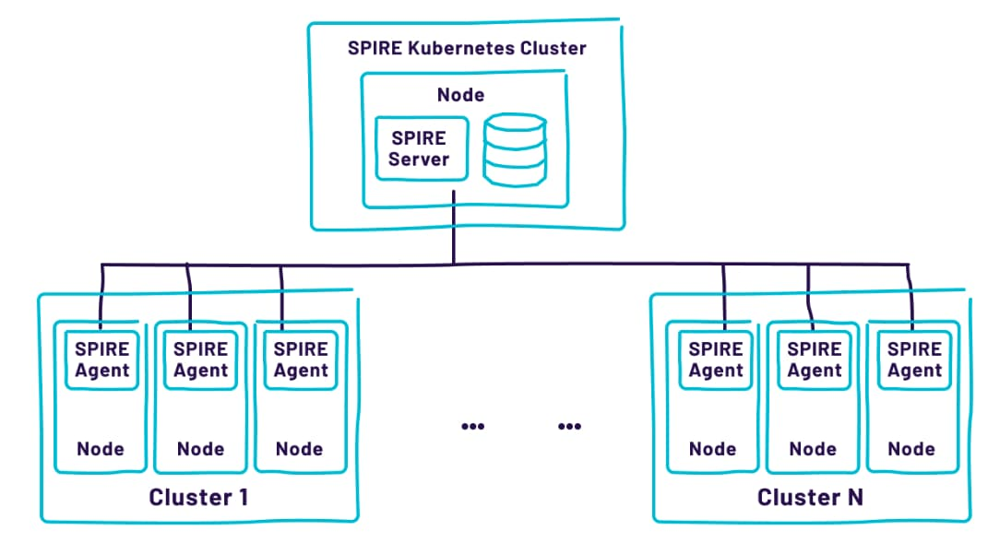
图 6.10：为了安全起见，SPIRE 服务器在一个单独的集群上。

### Kubernetes 工作负载证明

SPIRE 代理包括一个 Kubernetes 工作负载验证器插件。该插件首先使用系统调用来识别工作负载的 PID。然后，它使用对 Kubelet 的本地调用来识别工作负载的 pod 名称、镜像和其他特征。这些特征可以作为注册条目的选择器。

### Kubernetes 负载条目自动注册

一个名为 Kubernetes Workload Registrar 的 SPIRE 扩展可以自动创建节点和工作负载注册条目，充当 Kubernetes API 服务器和 SPIRE 服务器之间的桥梁。它支持几种不同的方法来识别正在运行的 pod，并在创建条目方面具有一定的灵活性。

### 增加 Sidecar

对于尚未适应使用工作负载 API 的工作负载（见第 7 章：与其他机构的集成中的本地 SPIFFE 支持一节），Kubernetes 可以很容易地添加支持的 sidecar。Sidecar 可以是一个 SPIFFE 感知的代理，比如 Envoy。或者，它可以是一个与 SPIRE 一起开发的 sidecar，名为 “SPIFFE Helper"，它监控工作负载 API，并在其 SVID 发生变化时重新配置工作负载。


图 6.11：与 sidecar 容器一起部署的 Kubernetes 集群中的工作负载。

## SPIRE 的性能考虑因素

当连接到服务器的 SPIRE 代理数量增加时，也会给服务器、数据存储和网络本身带来更多的负荷。多个因素都会造成负载，包括节点数量和每个节点的工作负载，以及你轮换秘钥的频率。使用 JWT-SVID 与嵌套的 SPIRE 模型，公钥需要保持同步，这将增加代理和服务器之间需要传输的信息量。

我们不想对每个代理的工作负载数量或每个服务器的代理数量提出具体的性能要求或建议，因为所有的数据 a）取决于硬件和网络特性，b）变化很快。仅举一例，最新的一个版本将数据的性能提高了 30%。

正如你在前几章中所了解的，SPIRE 代理不断与服务器进行通信，以获得任何新的变化，如新工作负载的 SVID 或信任包的更新。在每次同步过程中，会有多个数据存储操作。默认情况下，同步时间为 5 秒，如果这对你的系统产生了太多的压力，你可以把它增加到一个更高的值来解决这些问题。

非常短的 SVID TTL 可以减轻安全风险，但如果你使用非常短的 TTL，要准备好看到你的 SPIRE 服务器的额外负载，因为签名操作的数量与轮换频率成比例增加。

另一个影响系统性能的关键因素可能是每个节点的工作负载数量。如果你在系统中的所有节点上增加一个新的工作负载，这将突然产生一个峰值，并对整个系统产生负荷。

如果您的系统严重依赖 JWT-SVID 的使用，请记住，JWT-SVID 不是在代理端预先生成的，需要按要求进行签名。这可能会给 SPIRE 服务器和代理带来额外的负载，并在它们过载时增加延迟。

## 验证器插件

SPIRE 为节点和工作负载认证提供了各种验证器插件。选择使用哪种验证器插件取决于对认证的要求，以及底层基础设施 / 平台提供的可用支持。

对于工作负载证明，这主要取决于被编排的工作负载的类型。例如，当使用 Kubernetes 集群时，Kubernetes 工作负载验证器将是合适的，同样，OpenStack 平台的 OpenStack 验证器也是如此。

对于节点认证来说，确定安全和合规的要求是很重要的。有时需要执行工作负载的地理围栏。在这些情况下，使用来自云提供商的节点验证器，可以断言，将提供这些保证。

在高度管制的行业，可能需要使用基于硬件的认证。这些机制通常依赖于底层基础设施提供支持，如 API 或像可信平台模块（TPM）的硬件模块。这可能包括对系统软件状态的测量，包括固件、内核版本、内核模块，甚至文件系统的内容。

**为不同的云平台设计证明**

在云环境中工作时，根据云提供商提供的元数据验证您的节点身份被认为是一种最佳做法。SPIRE 提供了一种简单的方法，通过专门为您的云设计的自定义节点验证器来实现这一点。大多数云提供商分配了一个 API，可以用来识别 API 调用者。

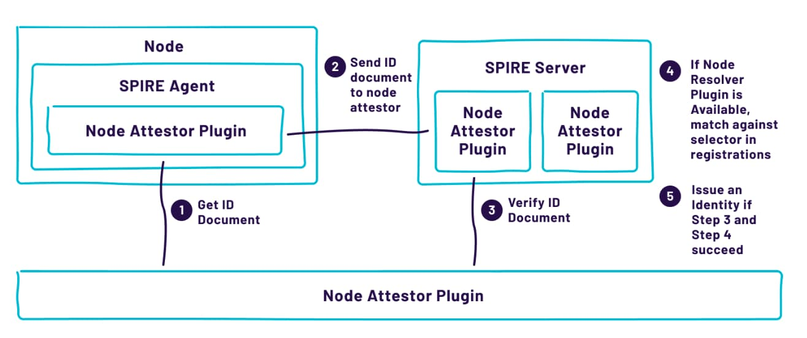
图 6.12：节点验证器的结构和流程。

节点验证器和解析器可用于亚马逊网络服务（AWS）、Azure 和谷歌云平台（GCP）。云环境的节点验证器是特定于该云的。验证器的目的是在向运行在该节点上的 SPIRE 代理发布身份信息之前对节点进行验证。

一旦建立了一个身份，SPIRE 服务器可能会安装一个 Resolver 插件，允许创建额外的选择器，与节点的元数据相匹配。可用的元数据是针对云的。

在相反的范围内，如果云提供商不提供验明节点的能力，就有可能用加入令牌进行引导。然而，这提供了一套非常有限的保证，这取决于通过什么程序完成。

## 注册条目的管理

SPIRE 服务器支持两种不同的方式来添加注册条目：通过命令行界面或注册 API（只允许管理员访问）。SPIRE 需要注册条目来运作。一种选择是由管理员手动创建。


图 6.13: 工作负载手动登记。

在大型部署或基础设施快速增长的情况下，手动流程将无法扩展。此外，任何手动程序都容易出错，而且可能无法跟踪所有的变化。

对于有大量注册条目的部署来说，使用自动流程来创建注册条目是一个更好的选择。


图 6.14: 使用与工作负载协调器通信的 "身份运营商" 自动创建工作负载注册条目的例子。

## 将安全考虑因素和威胁建模考虑在内

无论你做出什么样的设计和架构决定，都会影响到整个系统的威胁模型，也可能影响到与之互动的其他系统。

下面是一些重要的安全考虑因素和你在设计阶段应该考虑的安全问题。

### 公钥基础设施（PKI）设计

你的 PKI 的结构是什么，你如何定义你的信任域以建立安全边界，你把你的私钥放在哪里，以及它们多久轮换一次，这些都是你在这一点上需要问自己的关键问题。

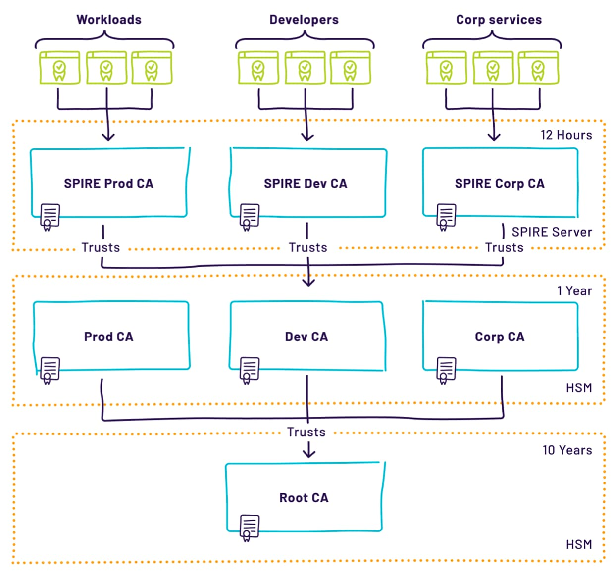
图 6.15: 一个具有三个信任域的 SPIRE 部署示例，每个信任域使用不同的企业证书颁发机构，每个证书颁发机构使用相同的根证书颁发机构。在每一层中，证书的 TTL 较短。

每个组织都会有不同的证书层次，因为每个组织有不同的要求。上图代表了一个潜在的证书层次结构。

**TTL、撤销和更新**

在处理 PKI 时，围绕证书到期、重新签发和撤销的问题总是浮出水面。有几个考虑因素可以影响这里的决定。这些因素包括：

- **文件过期 / 重新发行的性能开销**：可以容忍多少性能开销。TTL 越短，性能开销越大。
- **递送文件的延迟**：TTL 必须长于身份文件的预期递送延迟，以确保服务在验证自己时不会出现空档。
- **PKI 生态系统的成熟度**：是否有撤销机制？它们是否得到维护并保持更新？
- **组织的风险偏好**：如果不启用撤销功能，如果身份被破坏并被发现，可接受的有效时间是多少。
- **对象的预期寿命**：根据对象的预期寿命，TTL 不应该被设置为太长的时间。

**爆炸半径**

在 PKI 设计阶段，考虑其中一个组件的破坏会如何影响基础设施的其他部分是非常重要的。例如，如果你的 SPIRE 服务器将密钥保存在内存中，而服务器被攻破，那么所有下游的 SVID 都需要被取消并重新发行。为了尽量减少这种攻击的影响，你可以设计 SPIRE 基础设施，为不同的网段、虚拟私有云或云供应商提供多个信任域。

**保存你的私人钥匙的秘密**

重要的是你把你的钥匙放在哪里。正如你先前可能已经了解到的，SPIRE 有一个密钥管理器的概念，它管理 CA 密钥。如果你打算把 SPIRE 服务器作为你的 PKI 的根，你可能想让你的根密钥具有持久性，但把它存储在磁盘上并不是一个好主意。

存储 SPIRE 密钥的解决方案可能是一个软件或硬件密钥管理服务（KMS）。有独立的产品可以作为 KMS，也有每个主要云供应商的内置服务。

将 SPIRE 与现有 PKI 集成的另一种可能的设计策略是使用 SPIRE 上游授权插件接口。在这种情况下，SPIRE 服务器通过使用支持的插件之一与现有的 PKI 进行通信来签署其中间 CA 证书。

### SPIRE 数据存储的安全考虑

我们有意将 SPIRE 服务器的数据存储从第四章的威胁模型中删除。数据存储是 SPIRE 服务器保存动态配置的地方，如从 SPIRE 服务器 API 检索的注册条目和身份映射策略。SPIRE 服务器数据存储支持不同的数据库系统，它可以作为数据存储使用。数据存储的妥协将允许攻击者在任何节点上注册工作负载，并可能是节点本身。攻击者还将能够将密钥添加到信任捆绑中，并进入下游基础设施的信任链。

攻击者的另一个可能的表面是对数据库或 SPIRE 服务器连接到数据库的拒绝服务攻击，这将导致对其他基础设施的拒绝服务。

当你考虑为生产中的 SPIRE 服务器基础设施设计任何数据库时，你不可能使用数据库进程与服务器共存于同一主机的模式。尽管对数据库的有限访问，以及与服务器共存的模式大大限制了攻击面，但它很难在生产环境中扩展。

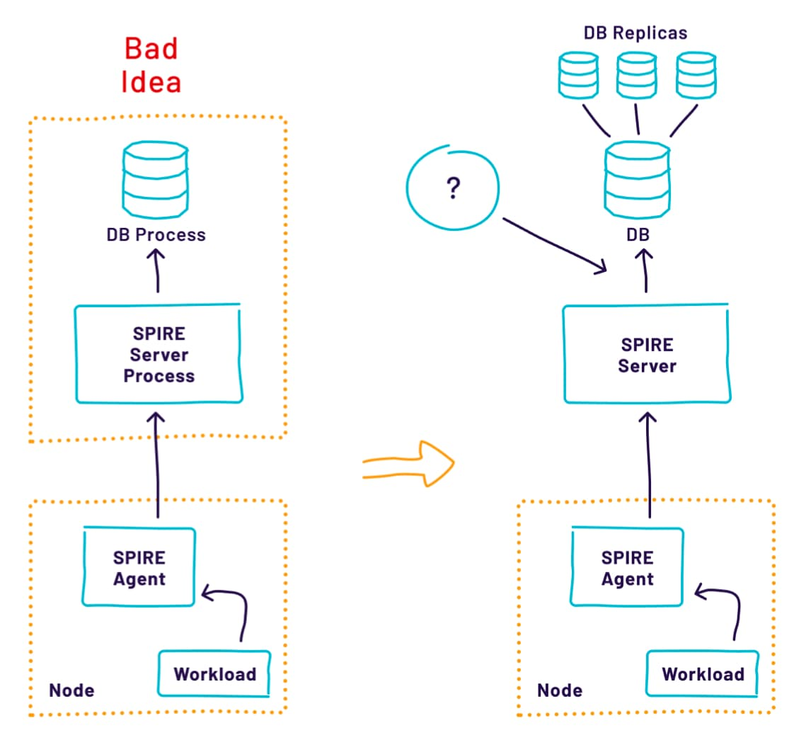
图 6.16：出于可用性和性能的考虑，SPIRE 服务器数据存储通常通过网络连接远程运行，但这带来了安全挑战。

出于可用性和性能的考虑，SPIRE 数据存储通常会是一个网络连接的数据库。但你应该考虑以下问题：

- 如果这是一个与其他服务共享的数据库，还有谁可以访问它和管理它？
- SPIRE 服务器将如何对数据库进行认证？
- 数据库连接是否允许 TLS 保护的安全通信？

这些都是需要考虑的相关问题，因为 SPIRE 服务器如何连接到数据库在很大程度上决定了整个部署的安全程度。在使用 TLS 和基于密码的认证的情况下，SPIRE 服务器的部署应依靠秘密管理器或 KMS 来保证数据安全。

在某些部署中，您可能需要添加另一个较低级别的**元 PKI** 基础设施，使你能够确保与 SPIRE 服务器的所有低级别的依赖性的通信，包括您的配置管理或部署软件。

### SPIRE 代理配置和信任包

你分配和部署 SPIRE 生态系统组件的方式，以及它在你的环境中的配置可能会对你的威胁模型和整个系统的安全模型产生严重的影响。这不仅是 SPIRE 的低级依赖，也是你所有安全系统的低级依赖，所以这里我们只关注 SPIFFE 和 SPIRE 特有的东西。

**信任包**

有不同的方法来交付代理的**引导信任包（bootstrap trust bundle）**。这是代理在最初启动时使用的信任包，以便对 SPIRE 服务器进行验证。如果攻击者能够将密钥添加到初始信任包中并进行中间人攻击，那么它将对工作负载进行同样的攻击，因为它们从受害代理那里接收 SVID 和信任包。

**配置**

SPIRE 代理的配置也需要保持安全。如果攻击者可以修改这个配置文件，那么他们可以将其指向被攻击的 SPIRE 服务器并控制代理。

### 节点验证器插件的影响

通过多个独立的机制来证明信任，可以提供更大的信任断言。你选择的节点证明可能会大大影响你的 SPIRE 部署的安全性，并将它的信任根基转向另一个系统。当决定使用什么类型的证明时，你应该把它纳入你的威胁模型，并在每次发生变化时审查该模型。

例如，任何其他基于占有证明的证明都会转移信任的根基，所以你要确保你作为下级依赖的系统符合你的组织的安全和可用性标准。

当设计一个使用加入令牌的证明模式的系统时，仔细评估添加和使用令牌的操作程序，无论是由操作者还是供应系统。

### 遥测和健康检查

SPIRE 服务器和代理都支持健康检查和不同类型的遥测。启用或错误配置健康检查和遥测可能会增加 SPIRE 基础设施的攻击面，这一点可能并不明显。SPIFFE 和 SPIRE 威胁模型假设代理只通过本地 Unix 套接字暴露工作负载 API 接口。该模型没有考虑到错误配置（或有意配置）的健康检查服务监听不在本地主机上，可能会使代理暴露于潜在的攻击，如 DoS、RCE 和内存泄漏。在选择遥测集成模型时，最好采取类似的预防措施，因为一些遥测插件（如 Prometheus）可能会暴露出额外的端口。

# 7. 与其他系统集成

本章探讨了 SPIFFE 和 SPIRE 如何与环境集成。

SPIFFE 从一开始就被设计成可插拔和可扩展的，所以将 SPIFFE 和 SPIRE 与其他软件系统集成的话题是一个广泛的话题。一个特定的集成的架构超出了本书的范围。相反，本章意在捕捉一些可能的常见集成，以及一个高层次的概述，以及进行集成工作的策略。

## 使软件能够使用 SVID

在考虑如何调整软件以使用 SVID 时，有许多选项可供选择。本节介绍了其中的几个选项，以及与之相关的注意事项。

### 本地 SPIFFE 支持

这种方法需要修改现有的服务，以使它们能够感知 SPIFFE。当所需的修改最小，或者可以在跨应用服务使用的通用库或框架中引入时，它是首选。对于那些对延迟敏感的数据平面服务，或希望在应用层利用身份的服务，本地集成是最好的方法。SPIFFE 提供了一些库，如用于 Go 编程语言的 GO-SPIFFE 和用于 Java 编程语言的 JAVA-SPIFFE，它们有助于开发支持 SPIFFE 的工作负载。

当用支持 SPIFFE 库的语言构建软件时，这通常是利用 SPIFFE 最直接的方式。上面提到的 Go 和 Java 库有使用 SPIFFE 与 gRPC 和 HTTPS 客户端和服务器的例子。

也就是说，应该注意的是，你并不局限于 Java 和 Go 语言的选择。这些库是在开放规范的基础上实现的。在撰写本文时，社区正在努力开发 Python、Rust 和 C 编程语言的 SPIFFE 库。

### SPIFFE 感知代理

通常情况下，重构的成本太高，或者服务正在运行一个不能被修改的第三方代码。在这些情况下，用一个支持 SPIFFE 的代理来前置应用，往往是一个务实的选择。根据应用程序的部署模式，它可以是一个独立的代理或一组集中的代理。共用代理的优点是代理和不安全的服务之间的追踪仍然是本地的 —— 如果使用独立的代理，代理和应用之间的安全问题仍然必须得到考虑。

Envoy 是一个受欢迎的选择，Ghostunnel 是另一个不错的选择。虽然其他代理，如 NGINX 和 Apache 也可以工作，但它们与 SPIFFE 相关的功能是有限的。

Ghostunnel 是一个 L3/L4 代理，享有对整个 SPIFFE 规范集的完全本地支持，包括对 SPIFFE Workload API 和联邦的支持。对于需要 L7 功能的应用，建议使用 Envoy。虽然 Envoy 不支持 SPIFFE Workload API，但 SPIRE 实现了 Secret Discovery Service API（或 SDS API），这是一个 Envoy API，用于检索和维护证书和私钥。

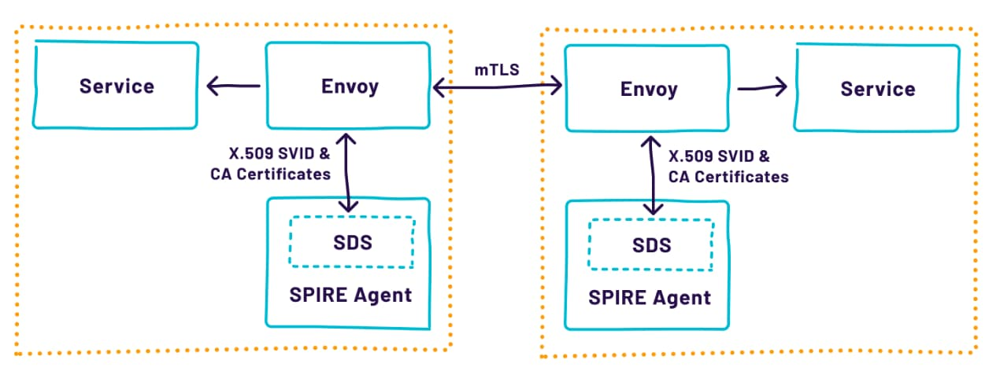
图 7.1: 两个 Envoy 代理位于两个服务之间，使用 SPIRE Agent SDS 实现建立相互的 TLS 的架构图。

通过实施 SDS API，SPIRE 可以将 TLS 证书、私钥和可信 CA 证书直接推送到 Envoy。然后，SPIRE 会根据需要轮换短命的秘钥和证书，将更新推送到 Envoy，而不需要重新启动。

**服务网格**

L7 代理（如 Envoy）可以执行 SPIFFE 安全以上的许多功能。例如，服务发现、请求授权和负载均衡都是 Envoy 带来的功能。在使用共享库比较困难的环境中（例如，当应用程序是用许多不同的语言编写的，或者不能被修改），将这种功能加载到代理上，可能特别有吸引力。这种方法也将代理的部署推向了集中的模式，即每个应用实例都有一个专门的代理运行在它旁边。

然而，这又产生了一个问题：如何管理所有这些代理？

服务网格是一个代理机群和相关代理控制平面的部署。它们通常允许在部署工作负载时自动注入和配置集中的代理，并提供对这些代理的持续管理。通过将许多平台关注点加载到服务网格中，可以使应用程序与这些功能不相干。

迄今为止，大多数服务网格的实现都是利用 SPIFFE 认证来实现服务间的追踪。有些使用 SPIRE 来实现这一目标，有些则实现了特定产品的 SPIFFE 身份提供者。

### 辅助程序

于工作负载不支持 SPIFFE 工作负载 API，但仍然支持使用证书进行认证的情况，与工作负载一起运行的辅助程序可以弥补这一差距。[SPIFFE Helper](https://github.com/spiffe/spiffe-helper/) 就是一个例子。SPIFFE 辅助程序从 SPIFFE Workload API 中获取 SVID，并将其写入磁盘，以便应用程序能够接收它们。SPIFFE 辅助程序可以继续运行，确保磁盘上的证书在轮换时不断地被更新。当更新发生时，辅助程序可以向应用程序发出信号（或运行一个可配置的命令），这样，运行中的应用程序就可以接收到这些变化。

许多支持 TLS 的现成的应用程序可以被配置成这样使用 SPIFFE。SPIFFE 辅助库有配置 MySQL 和 PostgreSQL 的例子。许多 Web 服务器，如 Apache HTTPD 和 NGINX 都可以进行类似的配置。这对客户端软件也很有用，它只能被配置为利用磁盘上的证书。

- openssl
- x509curl
- grpcurl

需要注意的是，这比本地 SPIFFE 集成的灵活性要低，因为特别是，它可能不允许相同的信任配置粒度。例如，当使用 SPIFFE Helper 来配置 Apache HTTPD 的相互 TLS 时，不可能将 `mod_ssl` 配置为只接受具有特定 SPIFFE ID 的客户端。

## 在无 SPIFFE 感知的软件中使用 SVID

由于 SVID 是基于众所周知的文档类型，所以相对来说，遇到支持文档类型的软件是很常见的，但其本身并不一定能识别 SPIFFE。好消息是，这是一个相对预期的情况，而且 SPIFFE/SPIRE 已经被设计成可以很好地处理这种情况。

### X509-SVID 双重用途

许多非 SPIFFE 系统支持使用 TLS（或相互 TLS），但依赖于证书在证书主体的通用名称（CN）或主体替代名称（SAN）扩展的 DNS 名称中具有身份信息。SPIRE 支持签发具有特定 CN 和 DNS SAN 值的 X.509 证书，这些值可以在每个工作负载的基础上指定（作为注册条目的一部分）。

这一功能是一个重要的细节，因为它允许在不直接理解如何使用 SPIFFE ID 的软件中使用 X509-SVID。例如，HTTPS 客户端往往希望所出示的证书与请求的 DNS 名称相匹配。在另一个例子中，MySQL 和 PostgreSQL 可以使用通用名称来识别相互的 TLS 客户端。通过利用这个 SPIRE 功能，以及 SPIFFE 总体上赋予的灵活性，这些用例可以用 SPIFFE 用例所使用的同样的 SVID 来适应。

### JWT-SVID 双重用途

与 X509-SVID 可用于 SPIFFE 认证以及更传统的 X.509 用例的方式相似，JWT- SVID 也支持这种双重性。虽然 JWT-SVID 确实使用标准的主体（`sub`）声明来存储 SPIFFE ID，但验证方法与 OpenID Connect（或 OIDC）类似并兼容。

更具体地说，SPIFFE Federation API 通过由 HTTPS 端点提供的 JWKS 文档公开密钥，这与用于获取 OIDC 验证的公开密钥的机制相同。因此，任何支持 OIDC 身份联盟的技术也将支持接受 JWT-SVID，无论它们是否具有 SPIFFE 感知。

支持这种身份联盟的集成的一个例子是亚马逊网络服务（AWS）身份和访问管理（IAM）。通过配置 AWS 账户中的 IAM，以接受来自 SPIRE 作为 OIDC 身份供应商的身份，就有可能使用 SPIFFE 工作负载 API 的 JWT-SVID 来承担 AWS IAM 的角色。当需要访问 AWS 资源的工作负载不在 AWS 中运行时，这一点特别强大，有效地否定了存储、共享和管理长期的 AWS 访问密钥的需要。关于如何实现这一目标的详细例子，请参见 SPIFFE 网站上的 [AWS OIDC 认证教程](https://spiffe.io/spire/try/oidc-federation-aws/)。

## 可以在 SPIFFE 的基础上建立什么

一旦 SPIFFE 作为一个通用的身份基础存在于你的生态系统中，并与你的应用程序集成，这可能是一个考虑在上面建立什么的好时机。在本节中，我们想介绍一下在 SPIFFE 和 SPIRE 的基础上可以建立什么。并不是说这个项目有所有的构件，可以让一切都开箱即用。有些集成件需要实施才能实现，而具体如何实现的细节会因部署而异。

### 日志、监测、可观察性和 SPIFFE

SPIFFE 可以向其他系统提供可验证的身份证明，这对以下组件来说是一个优势：

- 基础设施度量
- 基础设施日志
- 可观测性
- 计量
- 分布式追踪

你可以使用 SVID 来确保这些系统的客户端 - 服务器通信安全。然而，你也可以扩展所有这些组件，用 SPIFFE ID 来充实数据。这样做有多种好处，例如，能够在多种类型的平台和运行时之间对事件进行关联。它甚至可以帮助识别仍然不使用 SPIFFE 身份的应用和服务，或者发现运行异常和攻击，而不管它们可能发生在基础设施的哪个角落。

### 审计

对于任何安全系统，如你在 SPIRE 基础上建立的系统，日志不仅仅是帮助开发人员和操作员了解系统发生了什么的信息。任何安全系统的日志都是正在发生的事情的证据，所以有一个集中的位置来存储日志是一个好主意。在发生任何安全事件时，这些信息对取证分析非常有价值。

SPIFFE 可以帮助增强审计数据，通过使用对集中式审计系统的认证调用来提供不可抵赖性。例如，在与审计系统建立会话时，通过使用 X509-SVID 和相互 TLS，我们可以确定日志行的来源 —— 攻击者不能简单地操纵正在发送的标签或其他数据。

### 证书透明化

证书透明化（Certificate Transparency）通过提供一个开放的框架，几乎实时地监控和审计 X.509 证书，帮助发现对证书基础设施的攻击。证书透明化允许检测从被破坏的证书颁发机构恶意获取的证书。它还可以识别那些已经变质并恶意签发证书的证书颁发机构。要了解更多关于证书透明化的信息，请阅读[介绍文件](https://www.certificate-transparency.org/what-is-ct)。

SPIRE 与证书透明度的整合有不同的可能性。通过这种整合，可以记录你的系统颁发的所有证书的信息，并用一种称为 Merkle Tree Hashes 的特殊加密机制来保护它，以防止篡改和不当行为。

你可以考虑的另一个方法是在你的所有系统中强制执行证书透明化。这将防止与那些没有在证书透明化服务器中记录证书信息的应用程序和服务建立 TLS 和相互 TLS 连接。

与证书透明化的整合已经超出了本书的范围。请查看 SPIFFE/SPIRE 社区，了解更多信息和最新更新。

### 供应链安全

大部分关于 SPIFFE 预期用途的报道都是关于在运行时保护软件系统之间的通信安全。然而，在软件部署前的各个阶段保护软件也是至关重要的。供应链妥协是一个潜在的攻击媒介。为此，最好能保护软件供应链的完整性，以防止恶意行为者在代码中引入后门或脆弱的库。验证软件工件的出处和管道中执行的一系列步骤是验证软件没有被篡改的一种方式。

你可以考虑使用 SPIFFE 来提供签名的信任根。它也可用于向供应链系统的软件组件发放身份。有几种方法可以让它与更新框架（TUF）等补充软件或公证处等人工制品签署服务一起工作，或者与 In-Toto 等供应链日志一起利用。

有可能在两个层面上将 SPIRE 与供应链组件整合。

首先，你可以用它来识别这个供应链系统的不同元素，以确保机械和控制平面的安全。其次，通过定制选择器来确保只有已知出处的二进制文件被发出身份。作为后者的一个例子，在一个非常初级的水平上，这种属性可以作为标签传递到使用现有 docker 选择器的容器镜像中，或者通过开发一个可以检查供应链元数据的工作负载验证器。

## 为用户集成 SPIFFE

SPIFFE 和 SPIRE 架构的主要重点是软件身份。它没有考虑到用户的身份，因为这个问题已经被认为得到了很好的解决，而且在如何向人类与软件发放身份方面存在重大差异。也就是说，这并不意味着你不能向用户分发 SPIFFE 的身份。

**为用户提供可验证的身份**

用户应该如何在一个支持 SPIFFE 的生态系统中交互？请记住，SPIFFE 是 Secure Production Identity Framework for Everyone 的缩写。虽然本书的大部分内容都集中在软件的身份上，但将 SPIFFE 可验证的身份（SVID）赋予用户也同样有效，甚至是可取的。这样一来，工作负载可以用 SVID 做的所有事情，人们也可以做，比如相互 TLS 访问服务。这对于正在构建软件并需要访问其软件部署后将使用的相同资源的开发者来说，可能特别有用。

正如 SPIFFE 规范对 SPIFFE ID 的方案没有限制一样，你可以自行决定如何表示人类。把你的用户名作为 SPIFFE ID 路径可能就足够了，例如 `spiffe://example.com/users/zero_the_turtle`。或者，你可以为用户与工作负载创建一个不同的信任域，例如 `spiffe://users.example.com/zero_the_turtle`。

在一个理想的情况下，你现有的 SSO 提供商能够为你的用户产生 JWT，就像 OIDC 身份提供商的情况一样。在这种情况下，如果你能将你的 SSO 提供商配置为使用 SPIFFE ID 来进行 `sub` 声明，你可能不需要做任何额外的工作来为你的用户产生 SVID。

如果你无法直接从你的身份提供者那里获得 SPIFFE JWT，但你有办法获得可验证的身份令牌，你可以利用一个自定义的 SPIRE 验证器，接受来自你的提供者的身份令牌作为基本的证明手段。


图 7.2：使用 OIDC ID 令牌进行 SPIRE 认证的一个例子。

如果上述情况都不适用，你总是可以建立一个独特的服务，集成到你现有的 SSO 解决方案中，它可以根据用户的认证会话为他们产生 SVID。请查看 SPIFFE 网站上的[示例项目](https://github.com/JackOfMostTrades/spiffe-user-demo)。

**利用 SSH 使用 SPIFFE 和 SPIRE**

OpenSSH 支持使用证书颁发机构（CA）和[证书](https://github.com/openssh/openssh-portable/blob/master/PROTOCOL.certkeys)进行认证。尽管 OpenSSH 证书的格式与 X.509 不同，但人们可以建立一个使用 SVID 作为认证的 SSH 证书的服务。这使得你也可以利用你的 SPIFFE 身份进行 SSH。

对于需要 SSH 访问你的生态系统中的工作负载的用户来说，这种模式为 SSH 访问提供了短暂的、短期的、可审计的凭证，也提供了一个单一的控制点，你可以用它来执行访问控制策略或多因素认证。

这也允许工作负载检索服务器端（又称 "主机"）的 SSH 证书，允许工作负载向用户认证自己。使用这个证书，用户不再需要在第一次连接时被信任服务器的主机密钥的问题打断 SSH 连接。

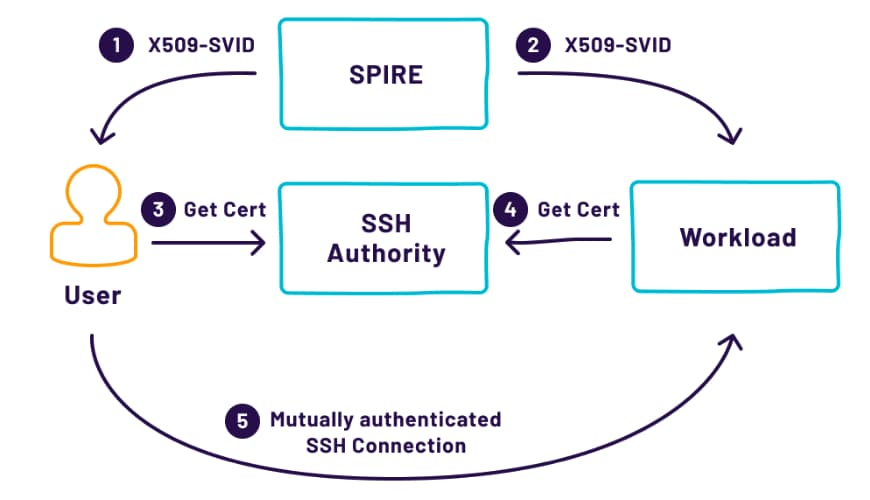
图 7.3: 使用 SVID 来引导 SSH 证书。

**微服务 UI**

虽然本书的大部分内容都是关于工作负载之间的认证，但通常也需要用户对工作负载进行认证。如果用户是通过 CLI 或其他桌面工具进行认证，那么可以使用带有用户 SVID 的相互 TLS。然而，许多微服务也希望承载某种基于浏览器的用户界面。这可能是因为开发者正在为他们的服务访问一个专门的管理或管理界面，或者消费者可能正在使用像 [Swagger UI](https://github.com/swagger-api/swagger-ui) 这样的工具来探索和试验服务的 API。

为具有基于浏览器的用户界面的服务提供良好的体验，需要在浏览器友好的认证形式和 SPIFFE 相互 TLS 认证之间架起桥梁。实现这一目标的最简单方法是有一个使用相互 TLS 的 API 端口和另一个接受浏览器友好认证方法的 API 端口，如现有的基于 Web 的 SSO 机制或 OAuth2/OIDC。

对二级端口上的请求进行认证后过滤，应该在基于浏览器的认证主体和相应的 SPIFFE ID 之间提供一个转换层。如果你已经建立了一个机制让用户直接获得 SVID，如上所述，那么这里也应该使用同样的转换。这样一来，底层应用就与所使用的特定认证机制无关了，所以由某个用户提出的基于网络的请求在功能上等同于通过相互 TLS 使用该用户的 SVID 提出的相同请求。

# 8. 使用 SPIFFE 身份通知授权

本章解释了如何实施使用 SPIFFE 身份的授权策略。

## 在 SPIFFE 的基础上建立授权

SPIFFE 专注于软件安全加密身份的发布和互操作性，但正如本书前面提到的，它并不直接解决这些身份的使用或消费问题。

SPIFFE 经常作为一个强大的授权系统的基石，而 SPIFFE ID 本身在这个故事中扮演着重要角色。在这一节中，我们将讨论使用 SPIFFE 来建立授权的选择。

## 认证与授权（AuthN Vs AuthZ）

一旦一个工作负载有了安全的加密身份，它就可以向其他服务证明其身份。向外部服务证明身份被称为认证（Authentication）。一旦通过认证，该服务就可以选择允许哪些行动。这个过程被称为授权（Authorization）。

在一些系统中，任何被认证的实体也被授权。因为 SPIFFE 会在服务启动时自动授予其身份，所以清楚地认识到并不是每一个能够验证自己的实体都应该被授权，这一点至关重要。

## 授权类型

有很多方法可以对授权进行建模。最简单的解决方案是在每个资源上附加一个授权身份的**允许列表（allowlist）**。然而，随着我们的探索，我们会注意到在处理生态系统的规模和复杂性时，允许列表的方法有几个限制。我们将研究两个更复杂的模型：基于角色的访问控制（RBAC）和基于属性的访问控制（ABAC）。

### 允许列表

在小型生态系统中，或者在刚刚开始使用 SPIFFE 和 SPIRE 时，有时最好保持简单。例如，如果你的生态系统中只有十几个身份，对每个资源（即服务、数据库）的访问可以通过维护一个有访问权限的身份列表来管理。

```bash
ghostunnel server --allow-uri spiffe://example.com/blog/web
```

在这里，ghostunnel 服务器仅根据客户的身份明确地授权访问。

这种模式的优势在于它很容易理解。只要你有数量有限的身份不改变，就很容易定义和更新资源的访问控制。然而，可扩展性会成为一个障碍。如果一个组织有成百上千的身份，维护允许名单很快就会变得无法管理。例如，每次增加一个新的服务，可能需要运维团队更新许多允许列表。

### 基于角色的访问控制（RBAC）

在基于角色的访问控制（RBAC）中，服务被分配给角色，然后根据角色来指定访问控制。然后，随着新服务的增加，只有相对较少的角色需要被编辑。

虽然有可能将一个服务的角色编码到它的 SPIFFE ID 中，但这通常是一种不好的做法，因为 SPIFFE ID 是静态的，而它被分配到的角色可能要改变。相反，最好是使用 SPIFFE ID 到角色的外部映射。

### 基于属性的访问控制（ABAC）

基于属性的访问控制（ABAC）是一个模型，授权决定是基于与服务相关的属性。结合 RBAC，ABAC 可以成为一个强大的工具来加强授权策略。例如，为了满足法律要求，可能有必要限制来自特定地区的服务对数据库的访问。区域信息可以是 ABAC 模型中的一个属性，用于授权并在 SPIFFE ID 方案中编码。

## 设计用于授权的 SPIFFE ID 方案

SPIFFE 规范没有规定或限制你可以或应该将哪些信息编码到 SPIFFE ID 中。你需要注意的唯一限制来自于最大长度的 SAN 扩展和你被允许使用的字符。

**忠告**

在将授权元数据编码成你的组织的SPIFFE ID格式时，要特别小心。下面的例子说明了如何做到这一点，因为我们并不想引入额外的授权概念。

**SPIFFE 方案实例**

为了对 SPIFFE 身份子串做出授权决定，我们必须定义身份的每一部分意味着什么。你可以用按顺序编码信息的格式来设计你的方案。在这种情况下，第一部分可能代表一个地区，第二部分代表环境，以此类推。

下面是一个计划和身份的例子。

```
spiffe://trust.domain.org/<地区>/<dev,stage,prod>/<组织>/<工作负载名称>。
```

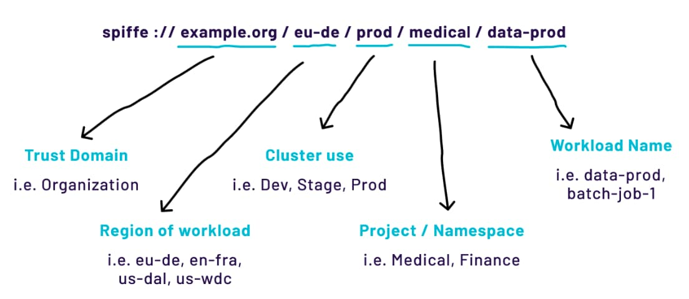
图 8.1：一个组织的 SPIFFE ID 的组成部分和潜在含义。

身份方案不仅可以采取一系列固定字段的形式，还可以采取更复杂的结构，这取决于一个组织的需求。我们可以看的一个常见的例子是跨不同协调系统的工作负载身份。例如，在 Kubernetes 和 OpenShift 中，工作负载的命名规则是不同的。下面的图示就是一个例子。你可能注意到，这些字段不仅指的是不同的属性和对象，而且 SPIFFE ID 的结构也取决于上下文。

消费者可以通过观察身份的前缀来区分方案的结构。例如，一个前缀为 `spie://trust.domain.org/Kubernetes/...` 的身份将根据下图的方案结构被解析为一个 Kubernetes 身份。


图 8.2：另一个潜在的 SPIFFE ID 方案的说明。

### 方案变更

更多时候，组织会发生变化，对身份方案的要求也会发生变化。这可能是由于组织结构的调整，甚至是技术栈的转变。可能很难预测你的环境在几年后会有多大的变化。因此，在设计 SPIFFE 身份识别方案时，关键是要考虑到未来可能发生的变化，以及这些变化将如何影响基于 SPIFFE 身份识别的其他系统。你应该考虑如何将后向和前向兼容性纳入该方案。正如我们之前已经提到的，在一个有序的方案中，你只需要在你的 SPIFFE ID 的末端添加新的实体；但是如果你需要在中间添加一些东西呢？

一种方法是用基于键值对的方案，另一种方法是我们都很熟悉的方法：版本管理！

**基于键值对的方案**

我们注意到，上面的方案设计都是有序的。方案的评估是通过查看身份的前缀来决定如何评估后面的后缀。然而，我们注意到，由于这种排序，很难轻易地在方案中增加新的字段。

键值对，就其性质而言，是无序的，这也是一种方法，可以轻松地将字段扩展到身份识别方案中，而不需要太多改变。例如，你可以使用带有已知分隔符的键值对，例如，身份内的列`：`字符。在这种情况下，上面的标识可能被编码为以下方式。

```
spiffe://trust.domain.org/environment:dev/region:us/organization:zero/name:turtle
```

因为身份的消费者将其处理成一组键值对，所以可以在不改变方案的基本结构的情况下增加更多的键。另外，SPIFFE 还有可能在将来支持将键值对纳 SVID。

像往常一样，应该考虑结构化和非结构化数据类型之间的权衡。

**版本管理**

这里可能的解决方案之一是将版本控制纳入方案。版本可以是你的方案中的第一个项目，也是最关键的部分。其余的系统在处理 SPIFFE ID 数据时需要遵循版本和编码实体之间的映射关系。

```
spiffe://trust.domain.org/v1/region/environment/organization/workload
v1 scheme:
0 = version
1 = region
2 = environment
3 = organization
4 = workload
spiffe://trust.domain.org/v2/region/datacenter/environment/organization/wor
kload
v2 scheme:
0 = version
1 = region
2 = datacenter
3 = environment
4 = organization
5 = workload
```

在 SPIFFE 中，一个工作负载可以有多个身份。然而，由你的工作负载来决定使用哪个身份。为了保持授权的简单性，每个工作负载最好先有一个身份，必要时再增加。

## 使用 HashiCorp Vault 的授权示例

让我们通过一个工作负载可能希望与之对话的服务的例子：Hashicorp Vault。我们将通过一个 RBAC 的例子和一个 ABAC 的例子，并涵盖一些使用 SPIFFE/SPIRE 执行授权时的问题和注意事项。

Vault 是一个**秘密存储器（secret store）**：管理员可以用它来安全地存储秘密，如密码、API 密钥和服务可能需要的私人密钥。由于许多组织仍然需要安全地存储秘密，即使在使用 SPIFFE 提供安全身份之后，使用 SPIFFE 来访问 Vault 是一个常见的请求。

```
spiffe://example.org/<区域>/<dev,stage,prod>/<组织>/<工作负载名称>。
```

### 为 SPIFFE 身份配置 Vault

在处理客户请求时，Vault 同时处理身份的认证和授权任务。像许多其他处理资源（在这里是指秘密）管理的应用程序一样，它有一个可插入各种认证和授权机制的接口。

在 Vault 中，这是通过 [TLS 证书认证方法](https://www.vaultproject.io/api/auth/cert)或 [JWT/OIDC 认证方法](https://www.vaultproject.io/api-docs/auth/jwt)，可以配置为识别和验证从 SPIFFE 生成的 JWT 和 X509-SVID。为了使 Vault 能够使用 SPIFFE 身份来使用，信任包需要配置这些可插拔的接口，以便它能够验证 SVID。

这就解决了认证问题，但我们仍然需要配置它来执行授权。要做到这一点，需要为 Vault 制定一套授权规则，以决定哪些身份可以访问秘密。

**一个 SPIFFE RBAC 的例子**

在下面的例子中，我们将假设我们使用的是 X509-SVID。Vault 允许创建规则，它可以表达哪些身份可以访问哪些秘密。这通常包括创建一组访问权限，并创建一个将其与访问绑定的规则。

例如，一个简单的 RBAC 策略：

```json
{
 "display_name": "medical-access-role",
 "allowed_common_names":
   ["spiffe://example.org/eu-de/prod/medical/data-proc-1",
    "spiffe://example.org/eu-de/prod/medical/data-proc-2"
],
 "token_policies": "medical-use",
}
```

这编码了一条规则，说明如果身份为 `spiffe://example.org/eu-de/prod/medical/data-proc-1`，或 `spiffe://example.org/eu-de/prod/medical/data-proc-2` 的客户能够获得一组权限（`medical-use`），它将授予医疗数据的访问权。

在这种情况下，我们已经授予这两个身份对秘密的访问权。Vault 负责将两个不同的 SPIFFE ID 映射到相同的访问控制策略中，这使得这成为 RBAC 而不是 allowlist。

**一个 SPIFFE ABAC 的例子**

在某些情况下，基于属性而不是基于角色来设计授权策略是比较容易的。通常情况下，当有多个不同的属性集可以单独与策略相匹配时，就需要这样做，而要创建足够多的独特角色来匹配每种情况是很有挑战性的。

根据上述例子，我们可以创建一个策略，授权具有某个 SPIFFE ID 前缀的工作负载。

```json
{ ...
 "display_name": "medical-access-role",
 "allowed_common_names":
   ["spiffe://example.org/eu/prod/medical/batch-job*"],
 "token_policies": "medical-use",
}
```

该策略规定，所有前缀为 `spiffe://example.org/eu/prod/medical/batch-job` 的工作负载将被授权访问该秘密。这可能很有用，因为批处理工作是短暂的，可能会被随机分配一个后缀。

另一个例子是一个有以下内容的策略：

```json
{ ...
 "display_name": "medical-access-role",
 "allowed_common_names":
   ["spiffe://example.org/eu-*/prod/medical/data-proc"],
 "token_policies": "medical-use",
}
```

该政策的预期效果是说明只有任何欧盟数据中心的 `data-proc` 工作负载可以访问医疗秘密。因此，如果在欧盟的一个新数据中心启动一个新的工作负载，任何 `data-proc` 工作负载将被授权访问医疗秘密。

### Open Policy Agent

开放策略代理（OPA）是云原生计算基金会（CNCF）的一个项目，执行高级授权。它使用一种名为 Rego 的特定领域编程语言，有效地评估传入请求的属性，并确定它应该被允许访问哪些资源。有了 Rego，就可以设计详细的授权策略和规则，包括 ABAC 和 RBAC。它还可以考虑到与 SPIFFE 无关的连接属性，例如传入请求的用户 ID。Rego 策略存储在文本文件中，因此它们可以通过持续集成系统集中维护和部署，甚至可以进行单元测试。

这里有一个例子，它编码了对某个数据库服务的访问，该服务应该只被某个 SPIFFE ID 所允许。

```json
# 允许后端服务访问数据库服务
allow {
  http_request.path == "/good/db"
  http_request.method == "GET"
  svc_spiffe_id == "spiffe://domain.test/eu-du/backend-server"
}
```

如果需要实施更详细的授权策略，那么 OPA 是一个不错的选择。Envoy 代理同时集成了 SPIRE 和 OPA，因此可以在不改变服务代码的情况下立即开始使用。要阅读更多关于使用 OPA 进行授权的细节，请查阅 OPA 文档。

## 总结

授权本身就是一个巨大而复杂的话题，远远超出了本书的范围。然而，就像生态系统中与身份交互的许多其他方面一样，了解身份与授权（以及更广泛的策略）的关系是非常有用的。

在本章中，我们介绍了使用 SPIFFE 身份认证的几种思考方式，以及与身份认证有关的设计考虑。这将有助于更好地了解你的身份解决方案的设计，以迎合你的组织的授权和策略需求。

# 9. SPIFFE 与其他安全技术对比

本章将 SPIFFE 与其他解决类似问题的技术进行了比较。

## 简介

SPIFFE 和 SPIRE 所解决的问题并不新鲜。每一个分布式系统都必须有某种形式的身份认证才是安全的。网络公钥基础设施、Kerberos/Active Directory、OAuth、秘密存储和服务网格就是例子。

然而，这些现有的身份识别形式并不适合用于识别组织内的内部服务。网络 PKI 的实施具有挑战性，对于典型的内部部署来说也是不安全的。Kerberos，Active Directory 的认证组件，需要一个永远在线的票证授予服务器，并且没有任何同等的证明。服务网格、秘密管理器和覆盖网络都解决了服务身份的部分难题，但并不完整。SPIFFE 和 SPIRE 是目前服务身份问题的唯一完整解决方案。

## 网络公钥基础设施

网络公钥基础设施（Web PKI）是广泛使用的从我们的网络浏览器连接到安全网站的方法。它利用 X.509 证书来断言用户正在连接到他们打算访问的网站。由于你可能对这种模式很熟悉，所以有理由问：为什么我们不能在我们的组织内使用 Web PKI 进行服务识别？

在传统的 Web PKI 中，证书的发放和更新完全是手工操作。这些手工过程不适合现代基础设施，因为在现代基础设施中，服务实例可能随时动态地增长和缩小。然而，在过去的几年里，网络 PKI 已经转向了一种自动的证书颁发和更新过程，称为域名验证（Domain Validation）。

在域名验证中，证书颁发机构向证书请求者发送一个令牌。证书请求者使用 HTTP 服务器共享这个令牌。证书颁发机构访问该令牌，对其进行验证，然后签署该证书。

这种安排的第一个问题是，内部服务经常没有单独的 DNS 名称或 IP 地址。如果你想在所有服务之间进行相互的 TLS，那么即使是**客户端**也需要 DNS 名称来获得证书，这对配置来说是个挑战。为在一台主机上运行的多个服务分配身份需要单独的 DNS 名称，这对配置来说也是一个挑战。

一个更微妙的问题是，任何能够成功响应请求的人都可以成功获得证书。这可能是在同一台服务器上运行的不同服务，甚至是在可以篡改本地二层网络的不同服务器上。

一般来说，虽然网络 PKI 对互联网上的安全网站很有效，但它并不适合用于服务身份。许多需要证书的内部服务并没有 DNS 名称。如果攻击者成功渗透到本地网络的任何服务中，目前可用的做证书验证的过程很容易被破坏。

## Active Directory（AD）和 Kerberos

Kerberos 是一个认证协议，最初于 20 世纪 80 年代末在 MIT 开发。最初，它被设计为允许使用一个集中的用户数据库进行人对服务的认证。后来，Kerberos 被扩展到支持服务对服务的认证，以及除了用户账户之外还可以使用机器账户。Kerberos 协议本身是与帐户数据库无关的。然而，Kerberos 最常见的用法是在 Windows 域中进行认证，使用 Active Directory (AD) 作为账户数据库。

Kerberos 的核心凭证被称为 **票据（ticket）**。一个票据是一个可以被单个客户用来访问单个资源的凭证。客户端通过调用 Ticket Granting Service (TGS) 获得票据。客户端在访问每一个资源时都需要一个新的票据。这种设计导致了更多的聊天协议并降低了可靠性。

所有服务都与 TGS 建立了信任关系。当一个服务在 TGS 注册时，它与 TGS 共享密钥材料，如对称秘密或公钥。TGS 使用密钥材料来创建票据，以验证对该服务的访问。轮换密钥材料需要服务和 TGS 之间的协调。服务必须接受以前的密钥材料，并保持对它的了解，以便现有的票据保持有效。

### SPIRE 如何缓解 Kerberos 和 AD 的弊端

在 SPIRE 中，每个客户端和资源将调用 SPIRE 服务器一次，以获得其凭证（SVID），所有资源都可以在信任域（和联合信任域）中验证这些凭证，而无需再调用 SPIRE 服务器。SPIRE 的架构避免了为每个需要访问的资源获取新凭证的所有开销。

基于 PKI 的认证机制，如 SPIRE，使凭证轮换更简单，因为这种服务和集中式验证器之间的密钥材料协调并不存在。

最后，值得注意的是，Kerberos 协议将服务与主机名紧密结合在一起，这使得每个主机和集群的多个服务变得复杂。另一方面，SPIRE 很容易支持每个工作负载和集群的多个 SVID。也有可能将同一个 SVID 分配给多个工作负载。这些特性提供了一个强大的、高度可扩展的身份识别方法。

## OAuth 和 OpenID Connect（OIDC）

OAuth 是一个旨在实现访问 ** 委托（delegation）** 协议，而不一定是作为一个实现认证本身的协议。OIDC 的主要目的是允许人类允许一个二级网站（或移动应用程序）代表他们对不同的一级网站采取行动。在实践中，该协议能够在二级网站上对用户进行认证，因为被委托的访问凭证（OAuth 协议中的访问令牌）是来自一级网站的证明，即用户针对该网站进行了认证。

如果主网站包括用户信息或提供了一种使用访问令牌检索用户信息的方法，那么二级网站可以使用主网站的令牌来验证用户。OpenID Connect 是 OAuth 的一种观点，是一个很好的例子。

OAuth 是为人类设计的，而不是为非人类实体设计的。OAuth 的登录过程需要浏览器的重定向与交互式密码。OAuth 2.0 与其前身相似，包括对非人类实体的支持，通常是通过创建服务账户（即代表工作负载而不是人类的用户身份）。当一个工作负载想要获得 OAuth 访问令牌以访问远程系统时，它必须使用 OAuth 客户端的秘密、密码或刷新令牌来验证 OAuth 提供者并接收访问令牌。工作负载都应该有独立的凭证，以实现工作负载身份的高度精细化。对于弹性计算来说，这些凭证的管理很快就会变得复杂和困难，因为每个工作负载和身份都必须向 OAuth 提供商注册。当秘密必须被撤销时，长期存在的秘密会带来更多的复杂性。由于轮换，秘密在环境中的传播减少了基础设施的流动性，在某些情况下，如果开发人员手动管理秘密，可能会出现攻击的载体。

### SPIFFE 和 SPIRE 如何减轻 OAuth 和 OIDC 的复杂性

依靠预先存在的凭证来识别工作负载，如 OAuth 客户秘密或刷新令牌，无法解决底层乌龟的问题（如第 1 章所解释）。在这些情况下，利用 SPIRE 作为身份提供者，允许在与 OAuth 基础设施联系之前发布引导凭证（bootstrap credential）或底层乌龟。SPIRE 极大地提高了安全性，因为没有长期的静态凭证需要与工作负载本身共同部署。SPIFFE 可以作为 OAuth 的补充。它消除了直接管理 OAuth 客户端凭证的需要 —— 应用程序可以根据需要使用他们的 SPIFFE ID 来验证 OAuth 提供商。事实上，OAuth 访问令牌本身可以是 SVID，允许用户以与工作负载相同的方式对 SPIFFE 生态系统中的服务进行认证。参见与 OIDC 的集成来了解更多。

## 秘密管理者

秘密管理器通常代表工作负载或管理员控制、审计和安全地存储敏感信息（共享秘密，通常是密码）。一些秘密管理器可以执行额外的功能，如加密和解密数据。许多秘密管理器的一个共同特征是中央存储，即所谓的*保险库（vault）*，它对数据进行加密。工作负载在执行秘密检索或数据解密等操作前必须单独对保险库进行认证。

部署秘密管理器的一个典型的架构挑战是如何安全地存储工作负载用来验证秘密管理器本身的凭证。这有时被称为 "零号凭证"、“引导凭证”，或者更广泛地说，安全引入的过程。

通过提供一个可以存储、检索、轮换和撤销这些秘密的安全位置，使用一个秘密管理器极大地改善了依赖共享秘密的系统的安全状况。然而，大量的使用会使共享秘密的使用永久化，而不是使用强大的身份识别。

### 如何利用 SPIFFE 和 SPIRE 来减轻秘密管理人员的挑战

如果你确实需要使用一个秘密管理器，它可以被配置为使用 SPIFFE 证书进行认证。这允许你在服务之间使用相同的 SPIFFE 证书进行直接认证，并检索秘密来与非 SPIFFE 证书对话。

## 服务网格

服务网格旨在通过提供自动认证、授权和强制执行工作负载之间的相互 TLS 来简化工作负载之间的通信。服务网格通常提供集成的工具：

- 确定工作负载。
- 调解工作负载之间的通信，通常通过部署在每个工作负载附近的代理（sidecar 模式）。
- 确保每个相邻的代理执行一致的认证和授权策略（一般通过授权策略引擎）。

所有主要的服务网格都包括一个原生的平台特定服务认证机制。

虽然服务网格可以在没有加密身份平面的情况下运行，但为了允许服务间的通信和发现，不可避免地要创建弱形式的身份。本实施方案中的服务网格不提供安全功能，也不解决前面讨论的现有信任根身份问题。

许多服务网格实现了自己的加密身份平面，或与现有的身份解决方案集成，以提供过境通信安全和信任根的解决。大多数服务网格实现了 SPIFFE 或其部分内容。许多服务网格实现都采用了 SPIFFE 规范的部分实现（包括 Istio 和 Consul），并可被视为 SPIFFE 身份提供商。有些将 SPIRE 作为其解决方案的一个组成部分（如 GreyMatter 或 Network Service Mesh）。

例如，Istio 使用 SPIFFE 进行节点识别，但其身份模型与 Kubernetes 的特定基元紧密耦合，并完全基于 Kubernetes。没有办法在 Istio 中基于 Kubernetes 之外的属性来识别服务。IBM 解释了[为什么目前的 Istio 机制是不够的](https://developer.ibm.com/articles/istio-identity-spiffe-spire/%23why-the-current-istio-mechanism-is-not-enough)。与 SPIRE 这样的通用身份控制平面相比，当希望获得更丰富的证明机制时，或者当服务需要使用通用身份系统在 Istio 之外认证时，这对 Istio 构成了制约因素。使用 SPIRE 进行工作负载身份认证的另一个优势是，它可以确保不受服务网格控制的通信。出于这样的原因，组织有时会将 SPIRE 与 Istio 集成，并使用 SPIFFE 身份而不是内置的 Istio 身份。IBM 发布了一个例子，位于 [IBM/istio-spire：Istio 身份与 SPIFFE/SPIRE](https://github.com/IBM/istio-spire)。

服务网格不是 SPIFFE/SPIRE 的直接替代品，相反，它们是互补的 SPIFFE/SPIRE 作为网格内更高层次抽象的身份解决方案。

专门实现 SPIFFE 工作负载 API 的服务网格解决方案支持任何期望该 API 可用的软件。能够为其工作负载提供 SVID 并支持 SPIFFE Federation API 的服务网格解决方案可以在网格识别的工作负载和运行 SPIRE 或运行在不同网格实现的工作负载之间自动建立信任。

## 覆盖网络

覆盖网络（Overlay Network）模拟了一个单一的统一网络，用于跨多个平台的服务。与服务网格不同，覆盖网络使用标准的网络概念，如 IP 地址和路由表来连接服务。数据被封装并跨过其他网络进行路由，创建一个建立在现有网络之上的节点和逻辑链接的虚拟网络。

虽然最常见的覆盖网络没有认证功能，但最新的网络有。然而，它们在允许服务连接之前仍然不能证明它们的身份。通常情况下，它们依赖于一个预先存在的证书。SPIFFE 很适合为覆盖网络节点提供证书。

# 10. 从业者故事

本章包括五个来自从业者的故事，他们是现实世界中部署了 SPIFFE 和 SPIRE 的企业的工程师。

## Uber：用加密身份确保下一代和传统基础设施的安全

Ryan Turner，软件工程师，Uber

在过去十年中，Uber 已经成为爆炸性增长的典型代表。随着软件服务的数量和我们运营的地理规模的增长，复杂性和风险也在增加。为了满足不断增长的需求，我们开始建立我们的下一代基础设施平台。同时，几年前，我们看到开源项目 SPIFFE 和 SPIRE 的一些早期动力。

我们立即看到了 SPIFFE 所能带来的价值，使我们能够加强我们的下一代基础设施安全态势。我们在 Uber 上线了 SPIRE，现在正使用它在各种工作负载环境中使用可加密验证的身份建立信任。我们从一些应用服务和内部服务开始，比如一个工作流引擎，它通过访问整个平台的数据，旋转多个动态工作负载来完成特定任务。SPIRE 向我们的工作负载提供 SPIFFE 身份，跨越我们的应用周期。SPIFFE 用于验证服务，帮助我们避免可能导致生产问题的错误配置。

### 使用 SPIRE 改造传统堆栈

SPIRE 现在是 Uber 的下一个基础设施的关键组成部分，但我们也在使用 sidecar 的方法，将认证改造成传统的基础设施。虽然 SPIFFE 和 SPIRE 通常都是在现代的云原生架构中工作，但我们可以将这些项目迅速适应我们专有的遗留堆栈。SPIRE 可以在 Uber 的下一代和传统基础设施中提供一个关键的信任桥梁，并对内部安全和开发人员的效率产生积极影响。

在我们的旅程中，SPIFFE 社区一直非常支持我们，帮助我们找到解决方案。因此，我们的工程师也积极为项目做出代码贡献。

### 安全、开发和审计团队正在受益于 SPIFFE

SPIFFE 使我们的安全团队对后端基础设施更有信心，对基于网络的安全控制的依赖性更低。由于我们处理的是金融数据，而且是跨地域经营，我们必须控制对金融和客户数据的访问。有了 SPIRE，我们可以为访问控制提供一个强有力的证明身份。它帮助我们满足这些要求，并在这个过程中减少审计团队的负担。

我们 Uber 的开发团队使用一致的客户端库，使用基于 SPIFFE 的身份创建 AuthZ 策略。这些项目使开发团队能够利用 X.509 和 JWT 等工作量大的身份基元，而不需要深入了解信任引导、安全引入、凭证供应或轮换等复杂主题。

## Pinterest：用 SPIFFE 克服身份危机

Jeremy Krach，高级安全工程师，Pinterest

2015 年，Pinterest 出现了身份危机。该公司的基础设施正在向不同的方向发展。每个新系统都以其独特的方式解决认证 —— 身份问题。开发人员每个月都要花几个小时的时间在会议和安全审查上，以设计、建立威胁模型和实施他们的定制身份解决方案，或将他们的新服务与不同的身份模型的依赖关系整合。很明显，安全团队需要建立一个通用的基础设施，以一种通用的方式提供身份，可以在我们的异构服务中使用。

这个系统的最初草案将身份委托给机器，作为基于主机名的 X.509 证书。它被大量用于秘密管理（见 [Knox](https://github.com/pinterest/knox)），但还没有出现更广泛的采用。随着我们不断扩大规模，特别是像 Kubernetes 这样的多租户系统，我们需要更精细的身份，这些身份并不与我们基础设施中的特定主机相联系，而是与服务本身的身份相联系。进入 SPIFFE。

### 用 SPIFFE 将复杂的问题扁平化

SPIFFE 现在为我们的大部分基础设施提供统一的身份。我们最初从 Kubernetes 开始，因为在那个多租户环境中需求是最明确的。后来，我们将其他基础设施转移到 SPIFFE，作为其主要的身份识别形式。因此，Pinterest 的几乎每个服务都有一个标准化的名字，我们可以使用，没有晦涩的惯例或不连贯的方案。它帮助我们统一和规范了我们的身份惯例，这与其他内部项目保持一致，以确定服务属性，如服务所有权。

我们利用 SPIFFE 作为 ACL 中的身份，用于秘密管理、TLS 服务之间的相互通信，甚至是通用授权策略（通过 [OPA](https://www.openpolicyagent.org/)，另一个 CNCF 项目）。Knox，Pinterest 的开源秘密管理服务，使用 SPIFFE X.509 身份文件作为支持的认证方法之一。请看我们关于 [在 Knox 中添加 SPIFFE 支持的博文](https://medium.com/pinterest-engineering/secret-management-in-multi-tenant-environments-debc9236a744)。

### 开发、安全和运维又开始和谐相处了

SPIFFE 使安全团队更容易编写授权策略。开发者的速度明显提高，因为我们的工程师不必担心自定义方案或不同的集成认证。由于我们现在有一个标准的方式来解释我们整个基础设施的身份，所以计费和所有权团队更容易确定谁拥有一项服务。有了强大的身份意识，对于记录和追踪一致性也很方便。我们对 SPIFFE 项目的未来感到兴奋，并感谢它能够帮助我们解决身份危机！。

## 字节跳动：为网络规模的服务提供拨号音认证

Eli Nesterov，安全工程经理，字节跳动

TikTok 背后的公司字节跳动已经在全球范围内建立和部署了大规模的互联网服务，为数百万用户提供服务。我们支持这些服务的基础设施是私有数据中心和公共云供应商的组合。我们的应用程序以数千个微服务的形式在多个 Kubernetes 集群和跨平台的专用节点上运行。

随着我们规模的扩大，我们的平台上有多种认证机制，包括 PKI、JWT 令牌、Kerberos、OAuth 和自定义框架。在这些认证机制中加入大量的编程语言，操作的复杂性和风险就更大了。对我们的安全和运维团队来说，管理这些认证方案在操作上变得复杂。在认证框架出现已知漏洞的情况下，我们无法迅速采取行动，因为每个框架都必须单独处理。在某些情况下，他们有代码级的依赖性，这使得改变变得更加困难。跨地域的审计和合规性是一个挑战，因为每个平台特定的认证方法都必须被单独审查和管理。

总体上走向基于零信任的架构，以及努力提高我们的开发人员的生产力，迫使我们为我们的服务建立一个统一的身份管理平面，以满足我们不断增长的需求。

### 使用 SPIRE 构建网络规模的 PKI

要建立一个能在不同的基础设施岛屿或像我们这样的平台上工作的身份系统是很难的。我们可以创建自己的，但这需要大量的努力。我们选择了 SPIRE，因为它在支持我们需要的各种平台和网络规模方面提供了规模和灵活性。由于它提供了基于标准 X.509 证书的加密身份，它可以帮助我们轻松地启用相互 TLS，在默认情况下，它符合许多合规性要求。可扩展性和开源性是另一个优点，因为我们可以很容易地将它与我们现有的控制平面和数据堆栈集成。

### 透明的认证简化了操作

有了 SPIRE，我们可以在我们所有的平台上部署一致的 “拨号音 "认证。现在，认证和安全的负担从开发人员那里被封装起来，因此他们可以专注于业务或应用逻辑。这从整体上提高了我们的部署速度。我们也不太可能因为配置问题而出现" 生产错误 "，例如在生产中使用开发凭证。

使用 SPIRE 的标准化认证也简化了合规性和审计，因为我们有跨信任域和平台的相互 TLS。SPIRE 还允许我们在身份分配方面转向一个更半分散的模式，即身份系统是本地的，比如一个数据中心。这提高了我们的整体可用性，使我们能够很好地恢复。

有了 SPIRE，我们几乎是 “面向未来 " 的，因为它可以扩展和适应，以满足我们不断增长的业务需求。

## Anthem：用 SPIFFE 保护云原生医疗应用的安全

Bobby Samuel，Anthem 人工智能工程副总裁

行业内不断上升的医疗成本迫使像 Anthem 这样的组织迅速创新，重新思考我们与供应商、雇主团体和个人的互动方式。作为这一举措的一部分，我们正在开发大量的应用程序，这些应用程序将帮助我们通过安全地开放医疗数据的访问来推动成本下降。我们已经开始在 Kubernetes 等云原生技术的基础上建立配套的下一代基础设施。这个新的基础设施将推动快速创新，并吸引更广泛的组织和开发人员的生态系统。这方面的一个例子是我们的 HealthOS 平台。HealthOS 将使第三方能够建立 HealthApp 能力，以提供到前端界面，利用去识别的健康数据的海洋。

但是，在几乎每一个大型企业，特别是医疗机构，都有人试图以恶意的方式获取他们的数据。受保护的医疗信息（PHI）的售价比金融信息高得多；因此，黑客和脚本小子等恶意行为者发现医疗系统和相应的健康信息非常有利可图。随着云原生架构的采用，风险和复杂性进一步上升。由于威胁半径大大增加，而人工安全审查和流程成为云规模的抑制因素，因此发生漏洞的风险更高。

### 为零信任架构打下基础

我们不能依靠传统的基于参数的安全工具和流程来保护我们的下一代应用程序和基础设施。零信任是一种精细的、自动化的安全方法，对我们来说很有意义，特别是在未来，因为我们计划跨组织边界和云供应商进行操作。用户和服务的身份和认证是零信任安全模型的核心原则之一。零信任使我们能够减少对基于网络的控制的依赖，而不是对每个系统或工作负载进行认证。SPIFFE 和 SPIRE 为我们的零信任安全架构提供了一个基础认证层。它们允许每个工作负载在开始通信之前以加密方式证明 " 他们是谁”。

### 摆脱秘密管理

通常，当你想到认证时，你会想到用户名、密码和 bear token。不幸的是，这些类型的凭证正在成为 Amthem 的风险和复杂性的来源。它们往往是长期存在的，对它们的管理或轮换是很棘手的。我们想摆脱这种一般的秘密管理做法。与其问一项服务 "你有什么”，我们想问的是" 你是谁 "。简而言之，我们想转向加密身份，如 SPIFFE。我们可以看到未来使用强证明身份的额外好处，比如在工作负载之间建立相互的 TLS，并将身份传导到应用程序中。


### 利用 SPIFFE 将安全作为基础设施的一部分来建设

安全往往被开发团队认为是部署的障碍。DevOps 团队希望能更快地部署新的创新功能。然而，他们不得不通过与安全控制有关的人工工单、流程、集成和审查。在 Anthem，我们加倍努力为我们的开发团队消除障碍，使安全成为基础设施的一项功能。随着 SPIFFE 等技术的采用，我们可以将安全控制的复杂性从开发团队中抽象出来，并在各种平台上提供一致的规则。SPIFFE 以及其他基于零信任的技术，将帮助我们在大多数情况下将系统供应时间从三个月缩短到两周以内。在 SPIFFE 的引领下，安全正在成为 Anthem 的一个推动因素。

## Square：将信任扩展到云端

Michael Weissbacher 和 Mat Byczkowski，高级安全工程师，Square

Square 提供各种各样的金融服务。在其生命周期中，该公司从内部发展了新的业务部门，如资本和现金，但也收购了 Weebly 和 Stitch Labs 等公司。不同的业务部门使用不同的技术，可以从不同的数据中心和云端运作，同时仍然需要无缝沟通。

我们内部开发的服务识别系统需要扩展到 Square 为其数据中心开发的内部架构之外。我们希望将该系统扩展到云端，我们希望提供一个同样安全的系统，并在未来几年内为我们提供良好的服务。我们最理想的是寻找一个基于开放标准的工具，同时能与 Envoy 代理无缝集成。SPIFFE 和 SPIRE 都支持我们的发展目标，以及与多个云和部署工具合作的独立平台。

### 一个能与流行的开源项目合作的开放标准

由于 SPIFFE 是基于现有的开放标准，如 X.509 证书，它为我们的服务身份提供了一条清晰的升级路径。Envoy 是 Square 的应用程序如何进行通信的基础构建块。由于 SPIRE 支持 Envoy 的 Secrets Discovery API，因此获得 X509-SVID 很容易。Envoy 内置访问控制，可以使用 SPIFFE 身份来决定允许哪些应用程序进行通信。

我们将 SPIRE 架构与现有的服务身份识别系统并行部署，然后对各种内部工具和框架进行修改，以支持这两个系统。接下来，我们将 SPIRE 与部署系统集成，在 SPIRE 中注册所有服务。这意味着我们可以对 SPIRE 的频繁的 SVID 轮换进行压力测试。最后，我们使用功能标志来慢慢选择服务，使其在服务与服务的调用中开始使用 SVID。

**跨云和数据中心的无缝、安全连接**

SPIFFE 和 SPIRE 使我们的安全基础设施团队能够提供一个重要的桥梁，安全地连接不同的平台和技术。我们仍处于转移到 SPIRE 的早期迁移阶段，但我们所做的改变使我们能够将我们的生产型 AWS EKS 基础设施与部署在 Square 数据中心的服务无缝连接。我们现在正在努力在我们的信任域之间进行自动联合，因为我们之前只是手动进行联合。我们使用 SPIFFE 身份作为标准，甚至用于我们公司的定制身份工作。

我们也非常高兴能参与到 SPIFFE 社区中来，在我们的旅程中，每个人都很友好，也很有帮助。这个社区还提供了一个额外的好处，那就是为一般的零信任系统提供了一个很好的讨论系统设计想法的地方。
