## 编者的话

本文作者是 Isovalent 联合创始人&CTO，原文标题 [How eBPF will solve Service Mesh - Goodbye Sidecars](https://isovalent.com/blog/post/2021-12-08-ebpf-servicemesh)，作者回顾了Linux 内核的连接性，实现服务网格的几种模式，以及如何使用 eBPF 实现无 Sidecar 的服务网格。

## 什么是服务网格？

随着分布式应用的引入，额外的可视性、连接性和安全性要求也浮出水面。应用程序组件通过不受信任的网络跨越云和集群边界进行通信，负载均衡、弹性变得至关重要，安全必须发展到发送者和接收者都可以验证彼此的身份的模式。在分布式应用的早期，这些要求是通过直接将所需的逻辑嵌入到应用中来解决的。服务网格将这些功能从应用程序中提取出来，作为基础设施的一部分提供给所有应用程序使用，因此不再需要修改每个应用程序。

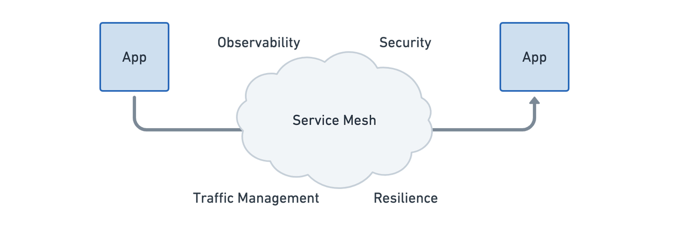

纵观今天服务网格的功能设置，可以总结为以下几点：

- **弹性连接**：服务与服务之间的通信必须能够跨越边界，如云、集群和场所。通信必须是有弹性的和容错的。
- **L7 流量管理**：负载均衡、速率限制和弹性必须是 L7 感知的（HTTP、REST、gRPC、WebSocket 等）。
- **基于身份的安全**：依靠网络标识符来实现安全已经不够了，发送和接收服务都必须能够根据身份而不是网络标识符来验证对方。
- **可观测性和跟踪**：追踪和指标形式的可观测性对于理解、监控和排除应用程序的稳定性、性能和可用性至关重要。
- **透明**：该功能必须以透明的方式提供给应用程序，即不需要改变应用程序代码。

在早期，服务网格的功能通常是以库的形式实现的，要求网格中的每个应用程序都要链接到以应用程序的语言框架编写的库。类似的事情也发生在互联网的早期：曾几何时，应用程序还需要运行自己的 TCP/IP 协议栈！正如我们将在这篇文章中讨论的那样，服务网格正在发展成为一种内核责任，就像网络堆栈一样。

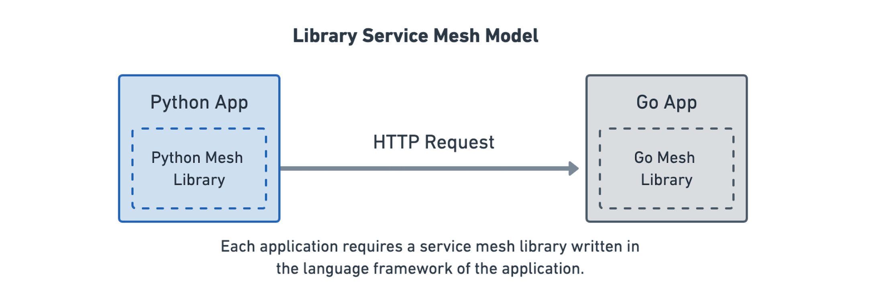

今天，服务网格通常使用一种叫做 sidecar 模型的架构来实现。这种架构将实现上述功能的代码封装到第四层代理中，服务间的流量被重定向到这个所谓的 sidecar 代理。它之所以被称为 “挎斗”，是因为每个应用程序都有一个代理，就像挎斗附着在摩托车上一样。

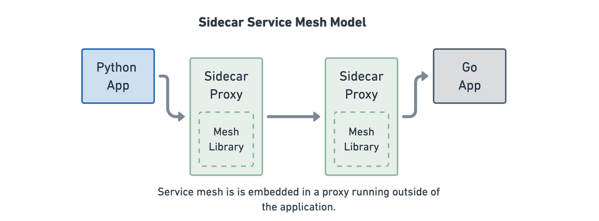

这种架构的优点是，服务不再需要自己实现服务网格的功能。如果许多服务是用不同的语言编写部署的，或者如果你正在运行不可变的第三方应用程序，这就很有好处。

这种模式的缺点是有大量的代理，许多额外的网络连接，以及复杂的重定向逻辑，将网络流量输入代理。除此之外，在什么类型的网络流量可以被重定向到第四层代理上也有限制。代理（Proxy）在其能支持的网络协议方面是有限的。

## 连接性转移到内核中的历史

几十年来，在应用程序之间提供安全可靠的连接一直是操作系统的责任。有些人可能还记得早期 Unix 和 Linux 时代的 [TCP 包装器](https://en.wikipedia.org/wiki/TCP_Wrappers)和 tcpd。tcpd 允许用户在不修改应用程序的情况下透明地添加日志、访问控制、主机名验证和欺骗保护。它使用了 libwrap，而且，在一个有趣的平行于服务网格的故事中，这个库也是以前应用程序提供这些功能的链接对象。tcpd 所带来的是能够在不修改现有应用程序的情况下将这些功能透明地添加到现有应用程序中。最终，所有这些功能都进入了 Linux 本身，并以一种更有效、更强大的方式提供给所有应用程序。今天，这已经发展到了我们所知道的 iptables。

然而，iptables 显然不适合解决现代应用的连接性、安全性和可观测性要求，因为它只在网络层面上操作，对应用协议层缺乏任何了解。自然，阻力最小的路径是回到库模型，然后是 sidecar 模型。现在，我们正处于这样一个阶段：为了最佳的透明度、效率和安全性，在操作系统中原生地支持这种模式是有意义的。

 

在 tcpd 时代，曾经的连接记录现在是追踪。IP 层面的访问控制已经演变成应用协议层面的授权，例如使用 JWT。主机名验证已被更强大的认证所取代，如 mTLS。网络负载均衡已经扩展到 L7 流量管理。HTTP 重试是新的 TCP 重传。过去用黑洞路由解决的问题今天被称为断路。这些都不是根本性的新问题，但所需的环境和控制已经发生了变化。

## 扩展内核命名空间概念

Linux 内核已经有一个概念，可以共享共同的功能，并使其对系统上运行的许多应用程序可用。这个概念被称为命名空间（Namespace），它构成了我们今天所知的容器技术的基础。命名空间（内核的那种，不是 Kubernetes 的命名空间）存在于各种抽象中，包括文件系统、用户管理、挂载设备、进程、网络等。这就是允许单个容器呈现不同的文件系统视图、不同的用户集，以及允许多个容器绑定到单个主机上的同一网络端口。在 cgroups 的帮助下，这个概念得到了扩展，可以对 CPU、内存和网络等资源进行管理和优先排序。从云原生应用开发者的角度来看，cgroups 和资源被紧密地整合到我们所知的 "容器" 概念中。

符合逻辑的是，如果我们认为服务网格是操作系统的责任，那么它必须符合并整合命名空间和 cgroup 的概念。这看起来会是这样的。

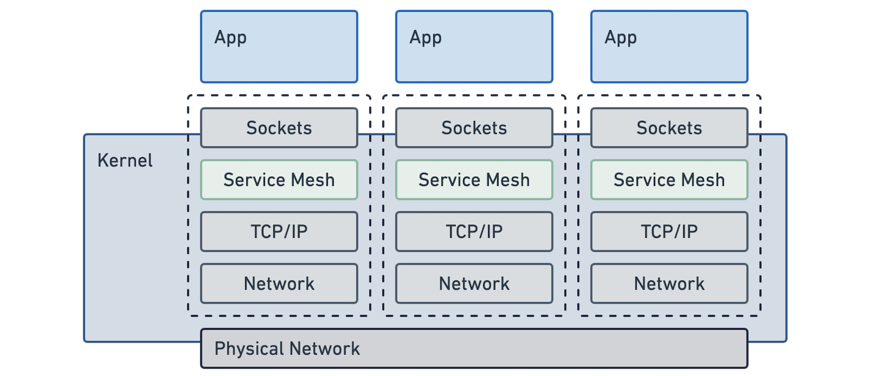

不出所料，这看起来非常自然，而且可能是大多数用户从简单的角度所期望的。应用程序保持不变，它们继续使用套接字进行通信，就像以前那样。理想的服务网格是作为 Linux 的一部分透明地提供的。它就在那里，就像今天的 TCP 一样。

### 注入 Sidecar 的成本

如果我们仔细研究一下 sidecar 模型，我们会发现它实际上是在试图模仿这种模型。应用程序继续使用套接字，一切都被塞进 Linux 内核的网络命名空间。然而，这比它看起来要复杂得多，需要许多额外的步骤来透明地注入 sidecar 代理。

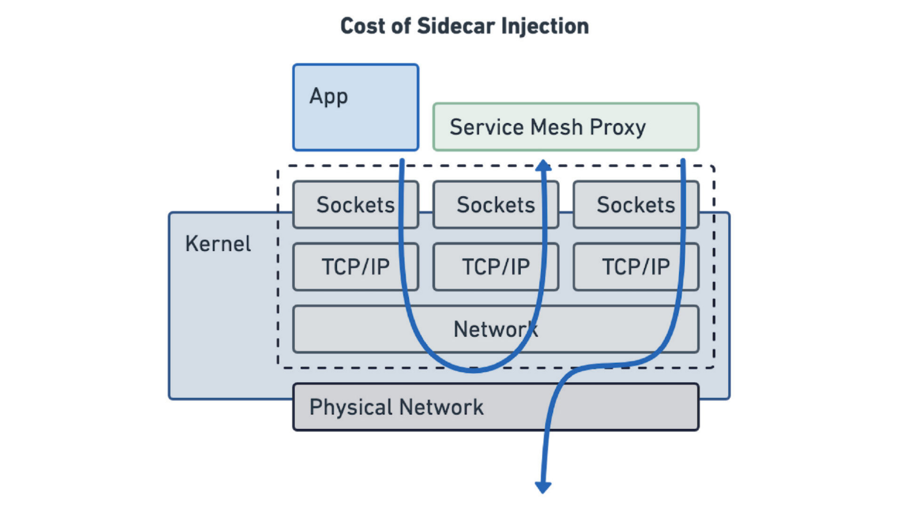 

 

这种额外的复杂性在延迟和额外资源消耗方面付出了巨大的代价。早期的基准测试表明，这对延迟的影响高达 3-4 倍，而且所有代理都需要大量的额外内存。在这篇文章的后面，我们将研究这两点，因为我们将其与基于 eBPF 的模型进行比较。

## 用 eBPF 解锁内核服务网格

为什么我们以前没有在内核中创建一个服务网格？有些人半开玩笑地说，kube-proxy 是最初的服务网格（见[我们已经构建了相当多的服务网格 - Tim Hockin, Google](https://www.youtube.com/watch?v=lUF88T16YqY&ab_channel=CloudNativeRejekts)）。这句话是有一定道理的。Kube-proxy 是一个很好的例子，说明了 Linux 内核在依靠传统的基于网络的 iptables 功能实现服务网格时，可以达到多么接近。然而，这还不够，L7 上下文是缺失的。Kube-proxy 完全在网络数据包层面运作。现代应用需要 L7 流量管理、跟踪、认证和额外的可靠性保证。Kube-proxy 不能在网络层面上提供这些。

eBPF 改变了这个模式。它允许动态地扩展 Linux 内核的功能。我们一直在使用 eBPF 为 Cilium 建立一个高效的网络、安全和可观测性数据通路，并将其直接嵌入到 Linux 内核。应用这个相同的概念，我们也可以在内核层面上解决服务网格的要求。事实上，Cilium 已经实现了各种所需的概念，如基于身份的安全、L3-L7 可观测性和授权、加密和负载均衡。缺少的部分现在正在向 Cilium 涌来。在本博客的末尾，你会发现如何加入由 Cilium 社区推动的 Cilium 服务网格测试项目的细节。

 

**有人可能想知道为什么 Linux 内核社区不直接解决这些需求**。eBPF 有一个巨大的优势，eBPF 代码可以在运行时插入到现有的 Linux 内核中，类似于 Linux 内核模块，但与内核模块不同，它可以以安全和可移植的方式进行。这使得 eBPF 的实现能够随着服务网格社区的发展而继续发展。**新的内核版本需要几年时间才能进入用户手中**。eBPF 是一项关键技术，它使 Linux 内核能够跟上快速发展的云原生技术栈。

## 无 Sidecar 的基于 eBPF 的 L7 追踪和度量

让我们看看 L7 追踪和指标可观测性，作为一个具体的例子，说明基于 eBPF 的服务网格对保持低延迟和提高观察性有巨大的影响。应用程序团队依靠应用程序的可视性和监控作为基本要求这些，这包括请求跟踪、HTTP 响应率和服务延迟信息等能力。然而，这种可观测性应该没有明显的成本（延迟、复杂性、资源…）。

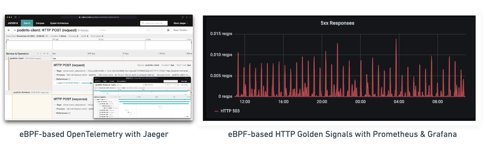

在下面的基准测试中，我们可以看到早期的测量结果，即通过 eBPF 或 sidecar 方法实现 HTTP 可视性对延迟的影响。该设置是在两个不同节点上运行的两个 pod 之间通过固定数量的连接每秒稳定运行 10K 个 HTTP 请求，并测量请求的平均延时。

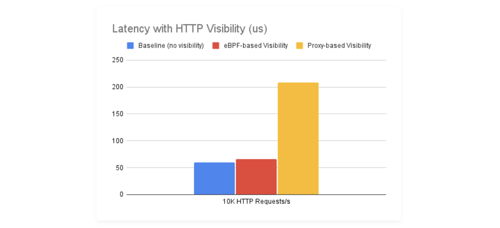

我们故意不提这些测量中使用的具体代理，因为它并不重要。对于我们测试过的所有代理，结果几乎都是一样的。要明确的是，这不是关于 Envoy、Linkerd、Nginx 或其他代理是否更快。所提到的代理有差异，但与首先注入代理的成本相比，它们是微不足道的。**几乎没有开销是来自代理本身的逻辑。开销是通过注入代理，将网络流量重定向到它，终止连接和启动新的连接而增加的。**

这些早期的测量结果表明，基于 eBPF 的内核方法是非常有前途的，可以实现完全透明的服务网格的愿望，而且没有明显的开销。

## 使用 eBPF 加速的 per-node 代理

越来越多的用例可以用这种仅有 eBPF 的方法来覆盖，从而完全取消 L4 代理。有些用例，仍然需要代理。例如，当连接需要拼接时，当 TLS 终止被执行时，或对于某些形式的 HTTP 授权。

我们的 eBPF 服务网格工作将继续关注那些从性能角度可以获得最大收益的领域。如果你必须执行 TLS 终止，你可能不介意在流量流入集群时用代理终止一次连接。然而，你会更关心在每个连接的路径中注入两个代理的影响，以提取 HTTP 指标和跟踪数据。

当一个用例不能用纯 eBPF 的方法来实现时，网格可以回退到每个节点的代理模型，直接将代理与内核的套接字层结合起来。

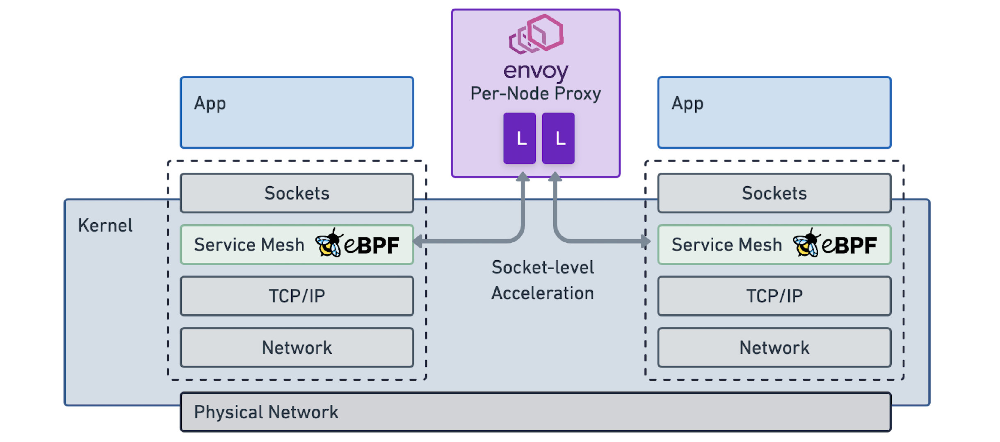 

eBPF 不依赖网络级的重定向，而是直接在套接字级别注入代理，保持路径短。在 Cilium 的案例中，正在使用 Envoy 代理，尽管从架构的角度来看，任何代理都可以被整合到这个模型。从概念上讲，这允许将 Linux 内核网络命名空间的概念直接扩展到 Envoy 监听器配置的概念，并将 Envoy 变成一个多用户代理。

## Sidecar 与 per-Node 代理

即使需要代理，代理的成本也会根据部署的架构而有所不同。让我们来看看每个节点的代理模式与 sidecar 模式的比较。

### 每个连接的代理

所需的网络连接数将因是否有代理而不同。最简单的情况是无 sidecar 模式，这意味着网络连接的数量没有变化。一个单一的连接将为请求提供服务，eBPF 将提供服务网格功能，如跟踪或现有连接上的负载均衡。

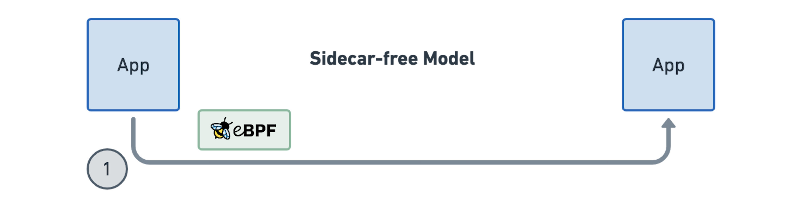

用 sidecar 模型提供同样的功能需要在连接中注入两次代理，这导致需要维护三个连接。这导致了开销的增加和所有额外的套接字缓冲区所需内存的倍增，表现为更高的服务间延迟。这就是我们之前在无 sidecar L7 可视性部分看到的 sidecar 开销。

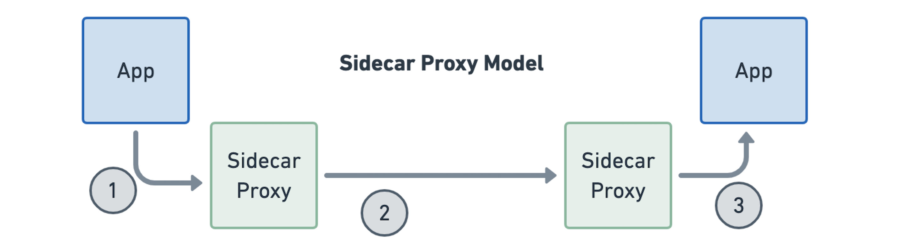

切换到 per-node 的代理模式使我们能够摆脱其中一个代理，因为我们不再依赖在每个工作负载中运行一个 sidecar。比起不需要额外的连接，这还是不够理想，但比起总是需要两个额外的连接要好。

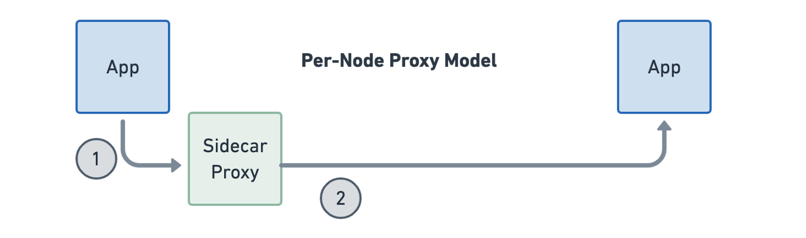

### 所需的代理总数

在每个工作负载中运行一个 sidecar 会导致大量的代理。即使每个单独的代理实例在其内存占用方面是相当优化的，但实例的数量之多将导致总的影响很大。此外，每个代理维护的数据结构，如路由和端点表，随着集群的增长而增长，所以集群越大，每个代理的内存消耗就越高。今天，一些服务网格试图通过将部分路由表推送给单个代理来解决这个问题，限制它们可以路由到哪里。

 

 

让我们假设在一个 500 个节点的集群中，每一个节点有 30 个 pod，一个基于 sidecar 的架构将需要运行 15K 个代理。在每个代理消耗 70MB 内存的情况下（假设已经经过极致优化过的路由表），这仍然导致集群中所有 sidecar 消耗 1.5TB 的内存。在 per-node 模型中，假设每个代理的内存足迹相同，500 个代理将消耗不超过 34GB 的内存。

### 多租户

当我们从 sidecar 模型转向 per-node 模型时，代理将为多个应用程序提供连接。代理必须具有多租户感知。这与我们从使用单个虚拟机转向使用容器时发生的过渡完全相同。由于我们不再使用在每个虚拟机中运行的完全独立的操作系统副本，而开始与多个应用程序共享操作系统，Linux 必须具有多租户感知。这就是命名空间和 cgroup 存在的原因。如果没有它们，一个容器可能会消耗一个系统的所有资源，容器可能会以不受控制的方式访问对方的文件系统。

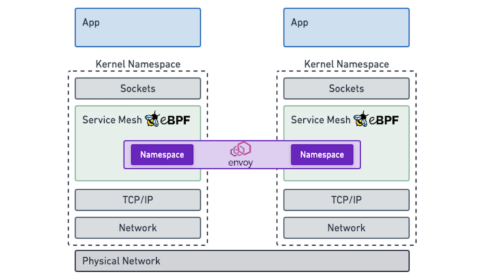

如果这在服务网格级别的网络资源上表现得完全一样，那不是很好吗？Envoy 已经有了命名空间的初步概念，它们被称为监听器。监听器可以携带单独的配置并独立运行。这将开启全新的可能性：突然间，我们可以很容易地控制资源消耗，建立公平的排队规则，并将可用的资源平等地分配给所有的应用程序，或者按照指定的规则分配。这可以而且应该与我们今天在 Kubernetes 中定义应用程序的 CPU 和内存约束的方式完全一样。如果你想了解这个话题，我曾在 EnvoyCon 上讲过这个问题（[Envoy Namespace - 以更小的代价运维基于 Envoy 的服务网格，Thomas Graf，EnvoyCon 2019](https://www.youtube.com/watch?v=08opgZkdYIw)）。

## 想参与其中吗？- 加入 Cilium 服务网格测试版

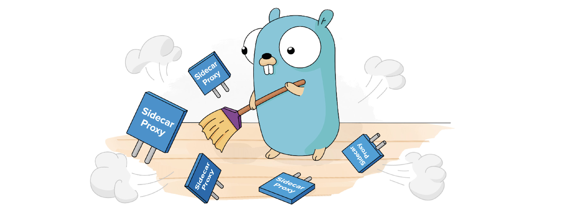 

伴随着即将发布的 Cilium 1.11 版本，Cilium 社区正在举办一个新的 Cilium Service Mesh 测试计划。它的特点是一个新的构建，将使以下功能可用。

- L7 流量管理和负载均衡（HTTP，gRPC，…）
- 跨集群、云和集群的拓扑感知路由
- TLS 终止
- 通过 Envoy 配置的金丝雀发布、重试、速率限制、断路等
- 用 OpenTelemetry 和 Jaeger 集成进行追踪
- 内置 Kubernetes Ingress 支持

上述所有功能都可以在 [github.com/cilium/cilium](https://github.com/cilium/cilium) 功能分支中找到。测试计划允许 Cilium 维护者直接与用户接触，了解他们的需求。要注册，你可以直接填写 [这个表格](https://forms.gle/j9fwhAC6HnHRJQKeA)，或者你可以在 Cilium 社区的[公告](https://cilium.io/blog/2021/12/01/cilium-service-mesh-beta)中阅读更多关于该计划的信息。

## 总结

eBPF 是提供本地和高效的服务网格实现的答案。它将把我们从 sidecar 模型中解放出来，并允许将现有的代理技术整合到现有的内核命名概念中，使它们成为我们每天都在使用的容器抽象的一部分。除此之外，eBPF 将能够卸载越来越多的目前由代理执行的功能，以进一步减少开销和复杂性。通过整合几乎任何现有的代理，该架构也允许与大多数现有的服务网格控制平面（Istio、SMI、Linkerd…）整合。这可以将 eBPF 的好处提供给广大的终端用户，同时将数据通路的效率和开销的讨论与控制平面方面相分离。

如果你有兴趣探索这个话题，我们很想听到你的意见。请随时通过 [Twitter](https://twitter.com/tgraf__) 或 [eBPF & Cilium Slack 联系我们](http://ebpf.io/slack)。

## 进一步阅读

- [eBPF 如何简化服务网格](/blog/how-ebpf-streamlines-the-service-mesh/)，Liz Rice，The New Stack
- [Cilium 服务网格测试计划](https://cilium.io/blog/2021/12/01/cilium-service-mesh-beta)，Cilium 社区
- [了解更多关于 Cilium 的信息](https://cilium.io/learn)
