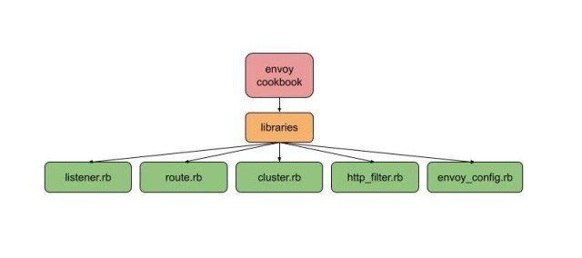
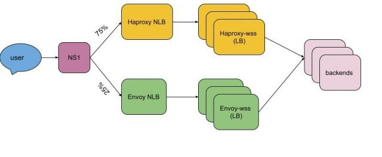

## 前言

Slack 有一个全球客户群，在高峰期有数百万同时连接的用户。用户之间的大部分通信涉及到向对方发送大量的微小信息。在 Slack 的大部分历史中，我们一直使用 [HAProxy](https://www.haproxy.com/) 作为所有传入流量的负载均衡器。今天，我们将讨论我们在使用 HAProxy 时所面临的问题，我们如何用 [Envoy Proxy](https://www.envoyproxy.io/) 来解决这些问题，迁移所涉及的步骤，以及结果是什么。让我们开始吧！

## Slack 的 Websockets

为了即时传递信息，我们使用 [websocket 连接](https://tools.ietf.org/html/rfc6455)，这是一种双向的通信链接，负责让你看到 "有几个人在打字......"，然后是他们打的东西，速度几乎是光速的。websocket 连接被摄取到一个叫做 "wss"（WebSocket 服务）的系统中，可以通过 `wss-primary.slack.com` 和 `wss-backup.slack.com`（这不是网站，如果去访问，只会得到一个 HTTP 404）从互联网上访问。


Websocket 连接一开始是普通的 HTTPS 连接，然后客户端发出协议切换请求，将连接升级为 Websocket。在 Slack，我们有不同的 websocket 服务，专门用于消息、在线（列出哪些联系人在线）和其他服务。其中一个 websocket 端点是专门为需要与 Slack 互动的应用程序制作的（因为应用程序也想要实时通信）。


过去，我们在多个 [AWS](https://aws.amazon.com/) Region 有一组专门用于 websockets 的 HAProxy 实例，以终止靠近用户的 websocket 连接，并将请求转发给相应的后端服务。

## 迁移到 Envoy Proxy 的动机

虽然我们从 Slack 开始就一直在使用 HAproxy，并且知道如何大规模地操作它，但有一些操作上的挑战让我们考虑替代方案，比如 Envoy Proxy。

### 热重启

在 Slack，后端服务端点列表的变化是一个常见的事件（由于实例被添加或删除）。HAProxy 提供两种方法来更新其配置，以适应端点列表的变化。一种是使用 HAProxy Runtime API。我们在其中一套 HAProxy 实例中使用了这种方法，我们的经验在另一篇博文中有所描述 —— [在 Slack 的可怕的、恐怖的、没有好处的、非常糟糕的一天](https://slack.engineering/a-terrible-horrible-no-good-very-bad-day-at-slack/)。另一种方法，我们用于 websockets 负载均衡器（LB），是将后端渲染到 HAProxy 配置文件中，然后重新加载 HAProxy。

每次 HAProxy 重载时，都会创建一组新的进程来处理新进入的连接。我们会让旧的进程持续运行很多小时，以便让长寿的 websocket 连接耗尽，避免用户频繁断开连接。然而，我们不能有太多的 HAProxy 进程，每个进程都运行着它自己 "当时" 的配置副本 —— 我们希望实例能更快地汇聚到新版本的配置上。我们不得不定期收割旧的 HAProxy 进程，并限制 HAProxy 重新加载的频率，以防底层后端出现混乱。

无论我们使用哪种方法，都需要一些额外的基础设施来管理 HAProxy 的重新加载。

Envoy 允许我们使用[动态配置的集群和端点](https://www.envoyproxy.io/docs/envoy/latest/intro/arch_overview/upstream/service_discovery#arch-overview-service-discovery-types-eds)，这意味着如果端点列表发生变化，它不需要重新加载。如果代码或配置确实发生了变化，Envoy 有能力在不放弃任何连接的情况下[热重启](https://www.envoyproxy.io/docs/envoy/latest/intro/arch_overview/operations/hot_restart)自己。Envoy 通过 [inotify](https://en.wikipedia.org/wiki/Inotify) 观察文件系统配置的更新。在热重启过程中，Envoy 还将统计数据从父进程复制到子进程中，因此仪表和计数器不会被重置。

这一切都使 Envoy 的运营开销大大减少，而且不需要额外的服务来管理配置变化或重新启动。

### 负载均衡功能

Envoy 提供了一些先进的负载均衡功能，如：

- 内置支持区域感知路由的功能
- 通过[异常值检测](https://www.envoyproxy.io/docs/envoy/latest/intro/arch_overview/upstream/outlier#arch-overview-outlier-detection)进行被动健康检查
- [恐慌路由](https://www.envoyproxy.io/docs/envoy/latest/intro/arch_overview/upstream/load_balancing/panic_threshold)：Envoy 通常只将流量路由到健康的后端，但是如果健康主机的百分比低于某个阈值，它可以被配置为将流量发送到所有的后端，不管是健康的还是不健康的。这在我们 [2021 年 1 月 4 日的故障](https://slack.engineering/slacks-outage-on-january-4th-2021/)中非常有帮助，这次故障是由我们基础设施中的一个广泛的网络问题引起的。

由于上述原因，在 2019 年，我们决定将我们的入口负载均衡层从 HAproxy 迁移到 Envoy Proxy，从 websockets 堆栈开始。迁移的主要目标是提高可操作性，获得 Envoy 提供的新功能，以及更加标准化。通过在整个 Slack 中从 HAProxy 迁移到 Envoy，我们的团队将不再需要了解两个软件的怪异之处，不再需要维护两种不同的配置，不再需要管理两个构建和发布管道，诸如此类。那时，我们已经在使用 Envoy Proxy 作为我们服务网格中的[数据平面](https://blog.envoyproxy.io/service-mesh-data-plane-vs-control-plane-2774e720f7fc)。我们内部也有经验丰富的 Envoy 开发人员，所以我们可以随时获得 Envoy 的专业知识。

## 生成 Envoy 配置

这次迁移的第一步是审查我们现有的 websocket 层配置，并生成一个同等的 Envoy 配置。在迁移过程中，管理 Envoy 配置是我们最大的挑战之一。Envoy 有丰富的功能集，其配置与 HAProxy 的配置有很大的不同。Envoy 配置涉及四个主要概念：

- **Listener**，接收请求，又称 TCP 套接字、SSL 套接字或 unix 域套接字。
- **Cluster**，代表我们发送请求的内部服务，如消息服务器和存在服务器
- **Route**，将 Listener 和 Cluster 连接在一起
- **Filter**，它对请求进行操作

Slack 的配置管理主要是通过 [Chef](https://www.chef.io/) 完成的。当我们开始使用 Envoy 时，我们把 Envoy 配置作为 [chef 模板文件](https://docs.chef.io/resources/template/)来部署，但它的管理变得很麻烦，而且容易出错。为了解决这个问题，我们建立了 chef 库和[自定义资源](https://docs.chef.io/custom_resources_notes/)来生成 Envoy 配置。



在 Chef 内部，配置是一个[单例](https://en.wikipedia.org/wiki/Singleton_pattern)，模拟了每个主机只有一个 Envoy 配置的情况。所有的 Chef 资源都在这个单例上操作，添加监听器、路由或集群。在 Chef 运行的最后，`envoy.yaml` 被生成、验证，然后安装 —— 我们从不写中间配置，因为这些配置可能是无效的。

这个例子展示了我们如何创建一个有两条路由的 HTTP 监听器，将流量路由到两个[动态](https://www.envoyproxy.io/docs/envoy/latest/intro/arch_overview/upstream/service_discovery#endpoint-discovery-service-eds)集群。


要在 Envoy 中复制我们复杂的 HAProxy 配置需要一些努力。大部分需要的功能在 Envoy 中已经有了，所以只需要在 chef 库中加入对它的支持就可以了。我们实现了一些缺失的 Envoy 功能（有些是[上游](https://github.com/envoyproxy/envoy/pull/12206)贡献的，有些是内部维护的扩展）。

## 对我们的新配置进行测试和验证

测试新的 Envoy websockets 层是一个迭代的过程。我们经常用手工编码的 Envoy 配置做原型，并在本地的开发机器上测试，每个监听器、路由和集群都有一个。手工编码的修改一旦成功，就会被移到 chef 库中。

HTTP 路由是用 [curl](https://curl.se/docs/manpage.html) 测试的：

- 基于头和 cookie 的特定路由到特定后端
- 基于路径、前缀和查询参数的路由到特定后端
- SSL 证书

当事情没有达到预期效果时，我们在机器上使用 Envoy 调试日志。调试日志清楚地解释了为什么 Envoy 选择将一个特定的请求路由到一个特定的集群。Envoy 的调试日志非常有用，但也很冗长，而且很昂贵（你真的不想在生产环境中启用这个功能）。调试日志可以通过 Curl 启用，如下所示。

```bash
curl -X POST http://localhost:<envoy_admin_port>/logging?level=debug
```

Envoy 管理接口在初始调试时也很有用，特别是这些端点：

- **clusters**：显示所有配置的集群，包括每个集群中所有上游主机的信息以及每个主机的统计数据。
- **/certs**：以 JSON 格式显示所有加载的 TLS 证书，包括文件名、序列号、主体替代名称和到期前的天数。
- **/listeners**：显示所有配置的监听器及其名称和地址。

我们的 Chef 库使用 `-mode validate` 命令行选项运行 Envoy，作为一个验证步骤，以防止安装无效的配置。这也可以手动完成。

```bash
sudo /path/to/envoy/binary -c </path/to/envoy.yaml> --mode validate
```

Envoy 提供 JSON 格式的监听器日志。我们将这些日志录入我们的日志管道（当然是在对日志进行 [PII](https://en.wikipedia.org/wiki/Personal_data) 处理后），这对调试工作经常很有帮助。

一旦对开发环境中的配置有信心，我们就准备做一些更多的测试 -- 在生产中！"。

## 迁移至生产

为了将迁移过程中的风险降到最低，我们建立了一个新的 Envoy websocket 栈，其配置与现有的 HAProxy 层相当。这意味着我们可以逐步、有控制地将流量转移到新的 Envoy 堆栈，并且在必要时可以快速切换回 HAProxy。缺点是我们的 AWS 成本 —— 我们在迁移过程中使用了双倍的资源，但我们愿意花费时间和资源为我们的客户透明地进行迁移。

我们通过 [NS1](https://ns1.com/) 管理我们的 DNS 记录 **wss-primary.slack.com** 和 **wss-backup.slack.com**。我们使用加权路由将流量从 **haproxy-wss** 转移到 **envoy-wss** [NLB](https://docs.aws.amazon.com/elasticloadbalancing/latest/network/introduction.html) DNS 名称。第一批区域是以 10%、25%、50%、75% 和 100% 的步骤单独上线的。由于我们对新的 Envoy 层和上线过程有信心，所以最后的区域上线速度更快（25%、50%、75%、100% 只需两天，而之前的一个区域需要一周的时间）。

尽管迁移工作很顺利，没有出现故障，但还是出现了一些小问题，比如超时值和 header 的差异。在迁移过程中，我们多次恢复、修复，并再次上线。



经过漫长而激动人心的 6 个月，迁移完成了，整个 HAProxy websocket 堆栈在全球范围内被 Envoy Proxy 取代，对客户的**影响为零**。

## 哪些进展顺利，哪些不顺利

迁移本身是相对平淡和无聊的。**枯燥是一件好事**：刺激意味着事情的中断，枯燥意味着一切顺利。

我们发现，旧的 HAProxy 配置随着时间的推移而有机地增长。它在很大程度上是由 HAProxy 使用的模型形成的 —— 一个包括所有监听器的大型配置。Envoy 的配置模型比 HAProxy 的模型使用更多的定义范围。一旦一个监听器被输入，只有该监听器内的规则适用于请求。一旦输入一个路由，只有该路由上的规则适用。这使得将规则与相关的请求联系起来更加容易。

我们花了很长时间从旧的 HAProxy 配置中提取重要的东西，这实际上是技术债务。通常很难弄清楚为什么会有某个规则，哪些是有意的，哪些是无意的，以及其他服务所依赖的行为是什么。例如，有些服务应该只在两个虚拟主机（vhosts）中的一个下，但实际上在 HAProxy 的两个 vhosts 下都可用。我们不得不复制这个错误，因为现有的代码依赖于这种行为。

我们在 HAProxy 堆栈中错过了一些细微的东西。有时这些是很重要的 —— 我们破坏了 Slack 的每日活跃用户（DAU）指标（哎呀！）。也有很多小问题需要解决。负载均衡器的行为很复杂，除了花时间调试外，没有真正的办法解决这个问题。

我们开始迁移时，没有为负载均衡器的配置提供测试框架。我们没有自动测试来验证测试的 URL 路由到正确的端点以及与请求和响应头相关的行为，而是有...... 一个 HAProxy 配置。在迁移过程中，测试是很有帮助的，因为它们可以提供很多关于预期行为的原因的背景。因为我们缺乏测试，所以我们经常不得不向服务所有者询问，以了解他们所依赖的行为。

我们建立的 Chef 资源有意只支持 Envoy 功能的一个子集。这使我们的库更简单 —— 我们只需要考虑我们实际使用的功能。缺点是，每次我们想使用新的 Envoy 功能时，都必须在我们的 Chef 库中添加对这些功能的支持。例如，[SNI](https://en.wikipedia.org/wiki/Server_Name_Indication)（https）监听器是在开发过程中编写的，当时我们认为这比向现有的监听器添加支持更简单。然而，当涉及到 vhost 支持时，我们已经开发了很多代码并在使用中，重构整个公司其他地方正在使用的资源将花费很长时间。我们的 Chef 库中的 vhost 支持是一个 hack（很快有一天我们会修复它）。

为了使改变 Envoy 资源 Chef 库更加安全，换句话说，确保我们不会破坏其他使用我们库的团队，我们引入了一套全面的测试，生成这些团队的整个配置。这使得我们可以很容易地知道，当我们更新 Envoy Chef 资源时，我们生成的所有 Envoy 配置会（或不会）受到什么影响。

这次迁移（和其他迁移一样）的关键事项之一是沟通。我们努力让每个人都了解并配合我们正在进行的改变。我们的客户体验（CE）团队是一个很好的合作伙伴 —— 他们能够监控传入的工单，以发现任何可能表明用户因这次迁移而受到影响的情况。

## 下一步是什么？

尽管偶尔会遇到一些小挫折，但 envoy websocket 的迁移还是非常成功的。我们已经跟进，将另一个关键的 Slack 服务，即我们的软件客户端指标摄取管道 —— 与我们的其他入口负载均衡器隔离 —— 迁移到 Envoy Proxy。我们几乎已经完成了将我们的网络和 API 流量的内部负载均衡器迁移到 Envoy。这场史诗般的迁移的最后一部分是将我们的（常规的、非 websocket 的）HTTP 堆栈从 HAProxy 迁移到 Envoy，这也是正在进行的。

我们的最终目标是在入口负载均衡器和服务网格数据平面上实现 Envoy Proxy 的标准化，这将大大降低团队的认知负荷和操作复杂性，并使 Envoy 的先进功能在我们的负载均衡基础设施中得到应用。自从迁移到 Envoy 后，我们已经大大超过了以前的峰值负载，没有任何问题。
