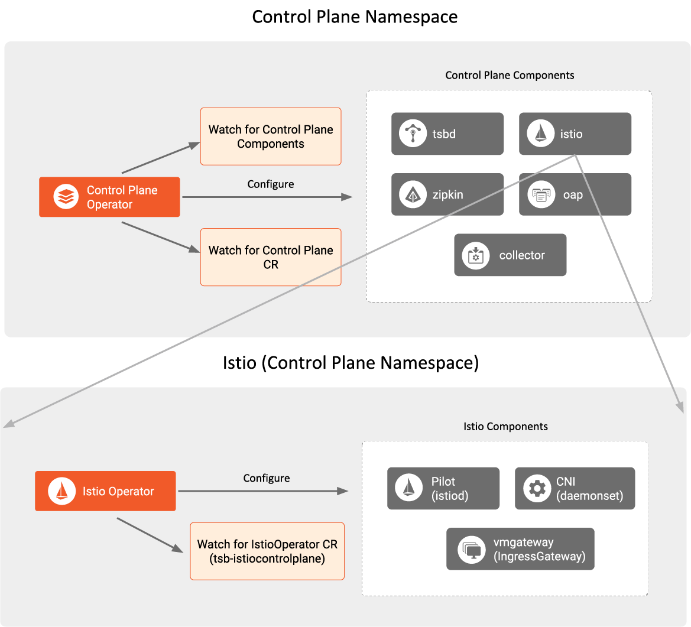

This page will introduce you to how the TSB Operator manages the lifecycle of
control plane components and what custom resources you can configure and manage
using the TSB Operator.

The TSB Operator, configured to manage the lifecycle of the control plane
components, watches for `ControlPlane` CRs in the same namespace
where it's deployed. The default namespace for the control plane is
`istio-system`. For more information about the custom resource API, refer to the
[Control Plane Install API Reference Docs](../../refs/install/controlplane/v1alpha1/spec).

## Components

These are the types of custom components you can configure and manage using the
control plane operator:

| Component     | Service              | Deployment           |
| :---          |    :----------       |          :---        |
| istio         | Istio-operator-metrics  (istiod, vmgateway) | Istio-operator  (istiod vmgateway)  (istio-cni-node daemonset in kube-system namespace) |
| oap           | oap                  | oap-deployment       |
| collector     | otel-collector       | otel-collector       |
| xcpOperator   | xcp-operator-edge    | xcp-operator-edge    |
| xcpEdge       | xcp-edge             | edge                 |

The components configured and installed by the operator are:
- **istio**: The open source Istio operator to which the TSB operator delegates
  the management of open source Istio components.
- **oap**: Responsible for mesh and envoy gateways RED metrics collection and
  aggregation and trace collection
- **collector**: The Open Telemetry Collector that collects the control plane
  components' metrics and exposes them through a Prometheus metrics endpoint.
  xcpOperator: The control plane operator to which the TSB operator delegates
  the management of control plane components
- **xcpEdge**: Responsible for translating configurations from xcpCentral into
  Istio CRDs and saving them to the local cluster, and pushing cluster
  information to xcpCentral

#### Istio as TSB component
As described above, the TSB operator responsible for the control plane, installs
the open source Istio operator. Istio and its operator are regarded as part of
the TSB control plane components, under direct control of the TSB operator.
Users do not directly configure Istio. Instead, the interaction with Istio
always happens through the TSB Operator `ControlPlane` CR.

The TSB operator that manages the control plane creates the IstioOperator CR
called `tsb-istiocontrolplane` in the control plane's namespace. The
IstioOperator CR instructs the Istio operator to manage the deployment of the
needed Istio (sub)components. For the TSB control plane, the following
(sub)components are enabled: `pilot`, `cni`, `ingressGateway`.

The TSB `ingressGateway` (sub)component is a customized configuration of Envoy
which is deployed as `vmgateway` to support smooth VM integration. Its primary
purpose is to route traffic originating from service mesh onboarded VMs to
services deployed inside the Kubernetes cluster when direct VM to Kubernetes pod
traffic is not possible.

:::note Sidecar proxy versions 
Though sidecar proxies technically belong to the data plane, their versions are
pinned to the control plane operator version.
:::
