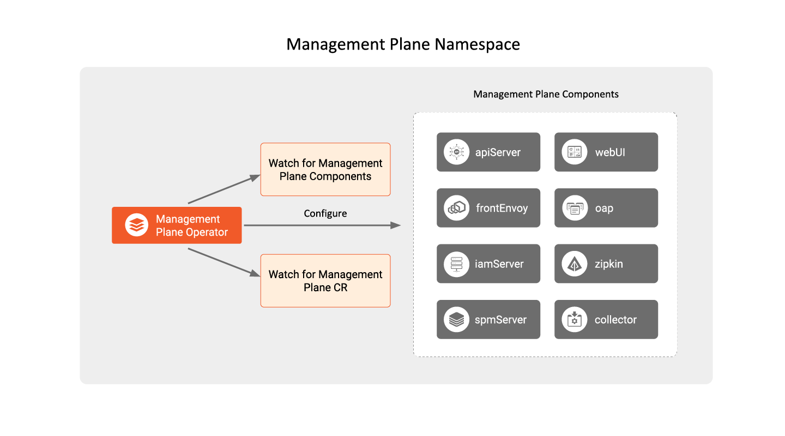

This page will introduce you to how the TSB Operator is used to configure
management plane components, and which components are managed by the TSB
Operator.

The TSB Operator configured to manage the lifecycle of the management plane
components, watches for `ManagementPlane` CRs in the same namespace
as where it's deployed. The default namespace for the Management plane is `tsb`.
For details about the custom resource API, refer to the
[Management Plane Install API Reference Docs](../../refs/install/managementplane/v1alpha1/spec).

## Components

These are the types of custom components you can configure and manage using the
management plane operator:

| Component     | Service              | Deployment           | Cronjobs         |
| :---          |    :----             |          :---        |     :---         |
| apiServer     | tsb                  | tsb                  | teamsync         |
| iamServer     | iam                  | iam                  |                  |
| webUI         | web                  | web                  |                  |
| frontEnvoy    | envoy                | envoy                |                  |
| oap           | oap                  | oap                  |                  |
| collector     | otel-collector       | otel-collector       |                  |
| xcpOperator   | xcp-operator-central | xcp-operator-central |                  |
| xcpCentral    | xcp-central          | central              |                  |
| mpc           | mpc                  | mpc                  |                  |

The components configured and installed by the operator are:
- **apiServer**: The TSB API server, responsible for:
  - Managing user-created service mesh configurations
  - Pushing service mesh configurations to control plane clusters
  - Managing cluster information pushed from the control plane cluster
  - Enforcing authorization of the operations performed by users
  - Storing audit logs of the operations performed
- **frontEnvoy**: Ingress gateway into the Management Plane
- **iamServer**: Manages user and TSB agent token authentication
- **webUI**: TSB UI server
- **oap**: Serves GraphQL queries for the TSB UI and aggregates cross-cluster
  metrics
- **collector**: An Open Telemetry Collector that collects the management and
  control plane components' metrics and exposes them through a Prometheus
  metrics endpoint
- **xcpOperator**: The control plane operator to which the TSB operator
  delegates the management of control plane components needed by the management
  plane.
- **xcpCentral**: The central component of the control plane used by the
  management plane to distribute configurations to each cluster as well as
  receive information about the state of each cluster.
- **mpc**: The configuration translation component between the apiServer and
  xcpCentral.

:::note Demo installation
As part of a demo install, in addition to the above, the TSB Operator will also
spin up PostgreSQL and Elasticsearch components which are only suitable for a
demonstration environment. They are not supported by Tetrate, and strongly
discouraged for production or even detailed system evaluation purposes.
:::
