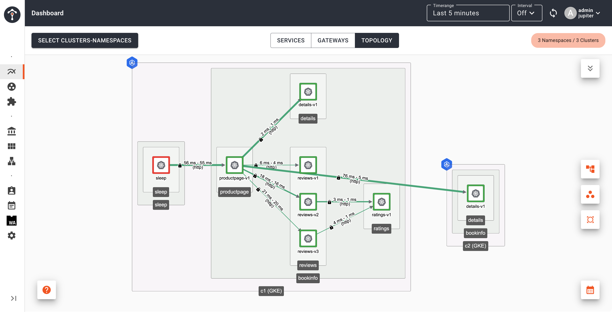
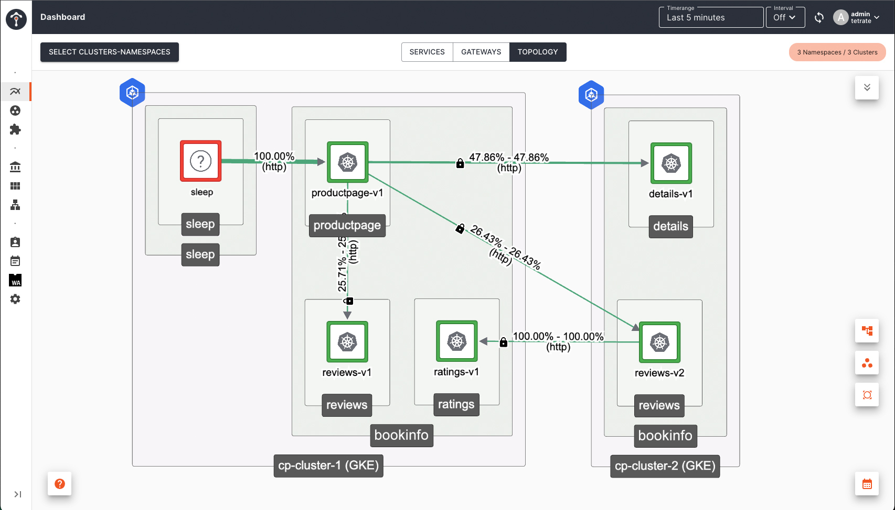
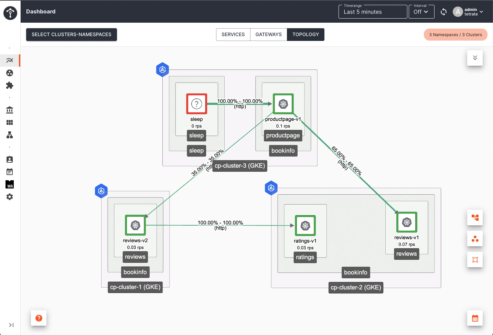

With an EastWest gateway, any internal service can be made highly-available with automated cross-cluster failover, without the need to publish it for external access via an Ingress gateway.

In this guide, you'll:

✓ Deploy [bookinfo application](https://istio.io/latest/docs/examples/bookinfo/) in one cluster `cluster-1`.  You'll deploy the same bookinfo application in a second cluster `cluster-2`.<br />
✓ Cause the reviews, details or ratings service to fail in `cluster-1`, and observe that the `bookinfo` application has failed.<br />
✓ Add the reviews, details and ratings services to an EastWest gateway.<br />
✓ Repeat the failure scenario and observe that the application is not affected, and that internal traffic is routed to the services in `cluster-2`.<br />

## Understanding EastWest gateways

An EastWest gateway is an alternative to an external-facing Ingress gateway (tier-1 or tier-2 gateway).  The EastWest gateway is local to a cluster, and is not automatically exposed to external traffic.  EastWest gateways don't require the resources needed by Ingress gateways, such as public DNS, public TLS certificates and ingress configuration.

- **Use an Ingress Gateway** for services that are externally accessible, and which are presented with a public DNS, TLS certificate and URL.  Use a **Tier 1 gateway** or a Global Server Load Balancing (GSLB) solution to make these services highly-available.
- **Use an EastWest Gateway** for any internal services that should be highly-available, with cross-cluster failover. EastWest gateways are quick and simple to configure, and provide high-availability for services without explicit service configuration.

When services are added to an EastWest gateway, Tetrate Service Bridge maintains an internal registry of these services. EastWest gateways are associated with a workspace, and by default, all services in the workspace are registered with the gateway.

When a local client attempts to access a service, it will be routed to the local service instance.  If the local service has failed and an alternative instance exists in a remote cluster that has an EastWest gateway, TSB will route client traffic to the remote EastWest gateway. Service discovery, health checks and failover routing are entirely automated, transparent to the developer or end user of the service.

## Onboarding cluster

To use EastWest routing, you will need to onboard at least two clusters into TSB. Both cluster must be on different availability zone or different region. See [cluster onboarding](../../setup/self_managed/onboarding-clusters) for more details on how to onboard cluster.

Make sure that both clusters are sharing the same root of trust. You must populate the `cacerts` with the correct certificates before deploying the Control Planes in both clusters. Please refer to the Istio docs on [Plugin CA Certificates](https://istio.io/latest/docs/tasks/security/cert-management/plugin-ca-cert/) for more detail.

:::note DNS External Address Annotation
If you want use DNS hostname for [EastWest gateway](#deploy-eastwest-gateway) [`cluster-external-addresses` annotation](../../operations/features/configure-cluster-external-addresses), you also need to [enable DNS resolution at XCP edge](../../operations/features/edge-dns-resolution) so that DNS resolution will happen at XCP Edge.
:::

## Configuration

For this example, it is assumed that you already have an Organization called `tetrate`, a tenant called `tetrate`, and two control plane clusters `cluster-1` and `cluster-2`.

### Deploy Bookinfo to cluster 1

Create the namespace `bookinfo` with istio-injection label:

```bash
kubectl create namespace bookinfo
kubectl label namespace bookinfo istio-injection=enabled
```

Deploy the bookinfo application:

```bash
kubectl apply -n bookinfo -f https://raw.githubusercontent.com/istio/istio/master/samples/bookinfo/platform/kube/bookinfo.yaml
```

Create bookinfo workspace. Create the following `workspace.yaml`

```yaml
apiversion: api.tsb.tetrate.io/v2
kind: Workspace
metadata:
  organization: tetrate
  tenant: tetrate
  name: bookinfo-ws
spec:
  namespaceSelector:
    names:
      - "*/bookinfo"
```

Apply with `tctl`

```bash
tctl apply -f bookinfo-ws.yaml
```

### Test Bookinfo, and simulate a failure in the `details` service

You will use [sleep](../../reference/samples/sleep_service) service as client.

```bash
kubectl create namespace sleep
kubectl label namespace sleep istio-injection=enabled
kubectl apply -n sleep -f https://raw.githubusercontent.com/istio/istio/master/samples/sleep/sleep.yaml
```

Send request to bookinfo productpage

```bash
kubectl exec deployment/sleep -n sleep -c sleep -- curl -s http://productpage.bookinfo:9080/productpage | grep -i details -A 8
```

You will see following response indicating that `productpage` service can get book details from `details` service

```bash
      <h4 class="text-center text-primary">Book Details</h4>
      <dl>
        <dt>Type:</dt>paperback
        <dt>Pages:</dt>200
        <dt>Publisher:</dt>PublisherA
        <dt>Language:</dt>English
        <dt>ISBN-10:</dt>1234567890
        <dt>ISBN-13:</dt>123-1234567890
      </dl>
```

Simulate a failure by terminating the `details` microservice:

```bash
kubectl scale deployment details-v1 -n bookinfo --replicas=0
```

Retest and observe that requests to bookinfo productpage is generating an error because the component service has failed.

```bash
kubectl exec deployment/sleep -n sleep -c sleep -- curl -s http://productpage.bookinfo:9080/productpage | grep -i details -A 8
```

You will see following response showing that `productpage` service cannot get book details from `details` service

```bash
      <h4 class="text-center text-primary">Error fetching product details!</h4>

      <p>Sorry, product details are currently unavailable for this book.</p>
```

Restore the `details` service deployment:

```bash
kubectl scale deployment details-v1 -n bookinfo --replicas=1
```

### Deploy EastWest gateway

You can use existing [Ingress gateway](../../quickstart/ingress_gateway) that already expose port 15443 or if you want specific EastWest gateway with only port 15443 you can deploy one by setting `eastWestOnly: true` in [IngressGateway deployment CR](../../refs/install/dataplane/v1alpha1/spec#tetrateio-api-install-dataplane-v1alpha1-ingressgatewayspec).

In the example, you will deploy a specific EastWest gateway that only expose port 15443. You can deploy EastWest gateway in any namespace.

Create following `eastwest-gateway.yaml`

``` yaml
apiVersion: install.tetrate.io/v1alpha1
kind: IngressGateway
metadata:
  name: eastwest-gateway
  namespace: eastwest
spec:
  eastWestOnly: true
```

And apply it to both clusters `cluster-1` and `cluster-2`

```bash
kubectl create ns eastwest
kubectl apply -f eastwest-gateway.yaml
```

Make sure that your EastWest gateway is assigned an IP
```
kubectl get svc -n eastwest

NAME               TYPE           CLUSTER-IP      EXTERNAL-IP    PORT(S)           AGE
eastwest-gateway   LoadBalancer   10.124.221.74   12.34.56.789   15443:31860/TCP   29s
```

### Deploy backup services in cluster 2

In `cluster-2`, deploy the same bookinfo services

```bash
kubectl create namespace bookinfo
kubectl label namespace bookinfo istio-injection=enabled
```

```bash
kubectl apply -n bookinfo -f https://raw.githubusercontent.com/istio/istio/master/samples/bookinfo/platform/kube/bookinfo.yaml
```

Create following bookinfo WorkspaceSetting to configure EastWest routing and apply with tctl. This will enable failover to all services that belong to bookinfo workspace. You can choose which services to have failover enabled by specifying service selector as shown below.

```yaml
apiVersion: api.tsb.tetrate.io/v2
kind: WorkspaceSetting
metadata:
  organization: tetrate
  tenant: tetrate
  workspace: bookinfo-ws
  name: bookinfo-ws-setting
spec:
  defaultEastWestGatewaySettings:
    - workloadSelector:
        namespace: eastwest
        labels:
          app: eastwest-gateway
```

```bash
tctl apply -f bookinfo-ws-setting.yaml
```

### Repeat the failure test against the HA configuration

In Cluster 1, verify that BookInfo is working correctly:

```bash
kubectl exec deployment/sleep -n sleep -c sleep -- curl -s http://productpage.bookinfo:9080/productpage | grep -i details -A 8
```

Terminate the `details` service on Cluster 1:

```bash
kubectl scale deployment details-v1 -n bookinfo --replicas=0
```

Verify that BookInfo is still working, because traffic for the failed service is routed to remote Cluster 2:

```bash
kubectl exec deployment/sleep -n sleep -c sleep -- curl -s http://productpage.bookinfo:9080/productpage | grep -i details -A 8
```

## Observing Failover

To observe failover you can use TSB dashboard. Before `details` service in Cluster 1 failed, `productpage` in Cluster 1 send request to `details` service in Cluster 1. After `details` service in Cluster 1 failed, `productpage` in Cluster 1 send request to `details` service in Cluster 2.

First, restore the `details` service deployment in Cluster 1:

```bash
kubectl scale deployment details-v1 -n bookinfo --replicas=1
```

Then send lots of traffic so you can see services topology in TSB dashboard.
```
while true; do kubectl exec deployment/sleep -n sleep -c sleep -- curl -s http://productpage.bookinfo:9080/productpage; sleep 10; done
```

Open TSB dashboard and set `Timerange` to 5 minutes and enable auto refresh with internal 10 seconds


After several minutes, open another terminal tab to scale down `details` service on Cluster 1 and keep the traffic going.

```bash
kubectl scale deployment details-v1 -n bookinfo --replicas=0
```

Go back to TSB dashboard, you will see that `productpage` in Cluster 1 is sending request to `details` service in Cluster 2



After several minutes, you will see `details` service on Cluster 1 disappears from topology view.


### Subset based routing and failover

Using bookinfo app as an example, if you enable subset routing using [ServiceRoute](../../quickstart/traffic_shifting) or Direct mode [VirtualService](https://istio.io/latest/docs/tasks/traffic-management/request-routing/) to route request to `v2` version of `reviews` service, when you scale down `reviews-v2` deployment in `Cluster 1` to 0, failover will happen to `reviews-v2` in `Cluster 2`.



Subset (or version) based routing is supported, even when the services are not locally present. Using bookinfo as an example again, If you like to deploy `reviews` services all together in a different cluster other than where productpage is deployed, subset based routing will still be respected.



If you are not enabling subset routing, by default `productpage` will send request to all `reviews` version `v1`, `v2` and `v3`. Failover will not happen when you scale only one version (e.g. `reviews-v2` deployment) in `Cluster 1` to 0. When you scale all `reviews` version deployment to 0, then failover to `Cluster 2` will happen.

:::note Istio Locality Load Balancing
By default, TSB includes outlier detection in the translated `DestinationRule`, which enables [Locality Load Balancing](https://istio.io/latest/docs/tasks/traffic-management/locality-load-balancing/). This ensures that your traffic remains within the cluster nodes. For example, when the `productpage` calls the `reviews` service, priority is always given to the `reviews` pods that are closest to the originating `productpage` pod, regardless of whether subset-based routing is configured or not.

Locality load balancing guarantees low latency and helps to minimize unnecessary egress costs. TSB will only route traffic to service instances in other clusters/nodes if those services become unavailable.
:::

## FAQ

### How does TSB identify remote services in the event of a failure?

A service that has same name and running in same namespace name across multiple clusters are considered same. For example, `details` service running in `bookinfo` namespace in Cluster 1 is considered same with `details` service running in `bookinfo` namespace in Cluster 2. And failover can take place when remote service meet this criteria.

Services with same name cannot failover to different namespace name. For example, `details` service in namespace `bookinfo-dev` in Cluster 1 will not failover to `details` service in namespace `bookinfo-prod` in Cluster 2.

### How can you select which services are exposed?

A `defaultEastWestGatewaySettings` object is associated with one workspace, as part of the `WorkspaceSetting` resource. By default, all services in the workspaces are exposed and are candidates for failover.

You can use service selectors to fine-tune which services are exposed in the EastWest gateway:

```yaml
apiVersion: api.tsb.tetrate.io/v2
kind: WorkspaceSetting
metadata:
  organization: tetrate
  tenant: tetrate
  workspace: bookinfo-ws
  name: bookinfo-ws-setting
spec:
defaultEastWestGatewaySettings:
  - workloadSelector:
      namespace: eastwest
      labels:
        app: eastwest-gateway
    exposedServices:
      - serviceLabels:
          failover: enable
      - serviceLabels:
          app: details
```

## Troubleshooting

If you found that failover request to remote cluster failed, please checks for following

1. Check if remote service WorkloadEntry is created in the cluster. You should see output similar to following

    ```
    kubectl get we -A

    NAMESPACE   NAME                                         AGE   ADDRESS
    bookinfo    k-details-2563fd2d9c78aacb3d42d6db45051ade   67s   12.34.56.78
    bookinfo    k-ratings-66dadd9a9f80adfda349ea5b85f6ae70   67s   12.34.56.78
    bookinfo    k-reviews-c8faecbe6a6b00a4c411d938bc485eae   67s   12.34.56.78
    ```

:::note FQDN instead of IP Address
ADDRESS column needs to display endpoints IP Addresses (not FQDNs). If the output similar to below, additional configuration step is required:
```
NAMESPACE   NAME                                                      AGE    ADDRESS
bookinfo    k-productpage-c046fe25a722387a9e85cc0c39540510            10s    ab02acc8e39f240799a682b7ae6dc42d-1914098926.ca-central-1.elb.amazonaws.com.
bookinfo    k-ratings-884c48dc6eef342bb5c8f52bdb709f65                10x    ab02acc8e39f240799a682b7ae6dc42d-1914098926.ca-central-1.elb.amazonaws.com.
bookinfo    k-reviews-ecc8c772e25c119d8a6e4ad2db69569b                10s    ab02acc8e39f240799a682b7ae6dc42d-1914098926.ca-central-1.elb.amazonaws.com.
```

Turning on the `ENABLE_DNS_RESOLUTION_AT_EDGE` paramenter in ControlPlane CR will allow XCP Edge to replaces FQDNs with IP Addresses. After enabling the parameter, ControlPlane CR will look similar to:

```
apiVersion: install.tetrate.io/v1alpha1
kind: ControlPlane
metadata:
  name: controlplane
  namespace: istio-system
spec:
  components:
    xcp:
      ...
      kubeSpec:
        overlays:
          - apiVersion: install.xcp.tetrate.io/v1alpha1
            kind: EdgeXcp
            name: edge-xcp
            patches:
              ...
              - path: spec.components.edgeServer.kubeSpec.deployment.env[-1]
                value:
                  name: ENABLE_DNS_RESOLUTION_AT_EDGE
                  value: "true"
  ...
```

After applying the change - FQDNs will be replaced with actual IP addresses and it will unblock EastWest traffic flow

:::

1. If you use `serviceLabels` selector, make sure service labels used in `defaultEastWestGatewaySettings` is available in services that you want to failover
