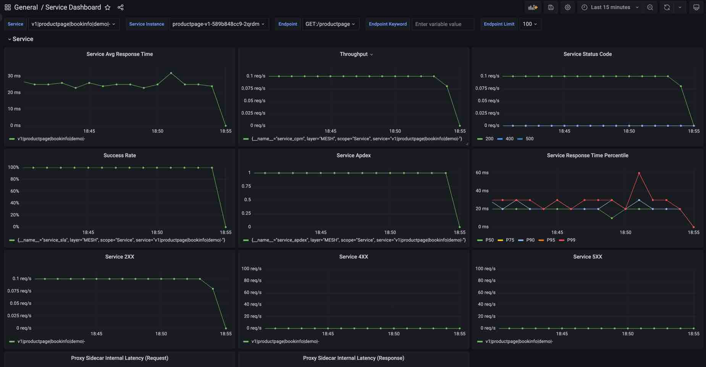

[Apache SkyWalking PromQL Service](https://skywalking.apache.org/docs/main/next/en/api/promql-service/) exposes Prometheus Querying HTTP APIs and provides the same PromQL query language as the Prometheus server.
Third-party systems or visualization platforms that already support PromQL (such as Grafana), could obtain metrics through PromQL Service in the TSB managed cluster.

Before you get started, make sure you: <br />
✓ Familiarize yourself with [TSB concepts](../concepts/toc) <br />
✓ Install the [TSB demo](../setup/self_managed/demo-installation) environment <br />
✓ Deploy the [Istio Bookinfo](../quickstart/deploy_sample_app) sample app <br />

## API Address

The PromQL Service is provided by OAP in the TSB Management Plane and expose same address and authorization as the Web UI and the base context path is `promql`.

```
${PROMQL_SERVICE_ADDRESS} = ${WEB_UI_ADDRESS}/promql
```

For example:
If the Web UI address is `https://localhost:8443`, then the PromQL Service API address is `https://localhost:8443/promql`.

## Querying From the API

### Querying Metadata

Metadata is the information about the metrics, such as the service name, instance name, endpoint name, and labels.

SkyWalking's metadata exists in the following metrics(traffics):
- service_traffic
- instance_traffic
- endpoint_traffic

For example querying all the services in the TSB managed cluster(Bookinfo):

```
curl -k -u '${user}:${pass}' ${PROMQL_SERVICE_ADDRESS}/api/v1/series -d 'match[]=service_traffic{layer='MESH'}&start=1677479336&end=1677479636'
```

The result could be:

```json
{
    "status": "success",
    "data": [
        {
            "__name__": "service_traffic",
            "service": "-|bookinfo-gateway|bookinfo|demo|-",
            "scope": "Service",
            "layer": "MESH"
        },
        {
            "__name__": "service_traffic",
            "service": "v2|reviews|bookinfo|demo|-",
            "scope": "Service",
            "layer": "MESH"
        },
        {
            "__name__": "service_traffic",
            "service": "v1|details|bookinfo|demo|-",
            "scope": "Service",
            "layer": "MESH"
        },
        {
            "__name__": "service_traffic",
            "service": "v1|ratings|bookinfo|demo|-",
            "scope": "Service",
            "layer": "MESH"
        },
        {
            "__name__": "service_traffic",
            "service": "v3|reviews|bookinfo|demo|-",
            "scope": "Service",
            "layer": "MESH"
        },
        {
            "__name__": "service_traffic",
            "service": "v1|reviews|bookinfo|demo|-",
            "scope": "Service",
            "layer": "MESH"
        },
        {
            "__name__": "service_traffic",
            "service": "v1|productpage|bookinfo|demo|-",
            "scope": "Service",
            "layer": "MESH"
        }
    ]
}
```

The following definitions apply to TSB
**Service Format Definition**, `subset|service name|namespace name|cluster|-`
**Layer Definition**, All the metrics in the TSB managed cluster are belong to the `MESH` layer.

## Querying Metrics

For example querying the `Service Avg Response Time` metric for the `v1|productpage|bookinfo|demo|-` service in 5 minutes:

```
curl -k -u 'admin:admin' https://35.220.249.46:8443/promql/api/v1/query -d 'query=service_resp_time{service="v1|productpage|bookinfo|demo|-", layer="MESH"}[5m]'
```

The result could be:
```json
{
    "status": "success",
    "data": {
        "resultType": "matrix",
        "result": [
            {
                "metric": {
                    "__name__": "service_resp_time",
                    "layer": "MESH",
                    "scope": "Service",
                    "service": "v1|productpage|bookinfo|demo|-"
                },
                "values": [
                    [
                        1680861600,
                        "24"
                    ],
                    [
                        1680861660,
                        "24"
                    ],
                    [
                        1680861720,
                        "27"
                    ],
                    [
                        1680861780,
                        "23"
                    ],
                    [
                        1680861840,
                        "24"
                    ],
                    [
                        1680861900,
                        "28"
                    ]
                ]
            }
        ]
    }
}
```

Please read the [PromQL Service document](https://skywalking.apache.org/docs/main/next/en/api/promql-service/) for more details.

## Build Grafana Dashboard

### Config Data Source

1. In the data source config panel, chose the `Prometheus` type.
2. Set the `URL` to the OAP PromQL Service address.
3. Select `Basic auth` and fill in the `User` and `Password`.
4. Click the `Save & Test` button to test the connection.


### Add Dashboard

When you complete the data source configuration, you can add a dashboard to visualize the metrics.
Here is a [sample service metrics dashboard file](../assets/howto/promql-service/grafana-service-dashboard.json) for a quick start. You can import it into Grafana and can see how it is built.

Here is a screenshot of the dashboard:



Please read the [Use Grafana As The UI document](https://skywalking.apache.org/docs/main/next/en/setup/backend/ui-grafana/#use-grafana-as-the-ui) for more details.
