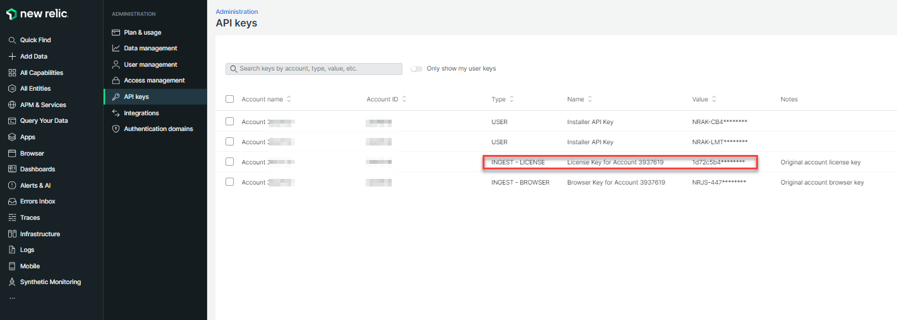

New Relic's popular software analytics platform enables businesses to monitor the health 
and performance of their applications, servers and databases. It collects and analyzes data 
from various sources, including application logs, server metrics and user interactions to 
provide detailed insights and metrics.

Tetrate's rich observability data integrates seamlessly with the New Relic platform. This 
article shows how to make telemetry data from Istio and Tetrate Service Bridge available in 
New Relic. For the metrics related to the application load - please follow 
the [New Relic article](https://newrelic.com/blog/how-to-relic/monitoring-istio-service-mesh) 
that describes Istio Data plane metrics retrieval. 

:::note 
The steps below are validated, however some customers might 
have custom New Relic setup that requires additional customization.
:::
## Data-flow

The diagram below shows the metrics workflow processing that Tetrate Service Bridge exports 
to New Relic.

 

Every Tetrate Service Bridge control plane uses the [OpenTelemetry Collector](https://opentelemetry.io/docs/collector/) to collect 
an advanced set of metrics and aggregate them in the global TSB management plane, along 
with additional metrics data associated with activity in the management plane. Once 
aggregated, the OpenTelemetry Collector can be used to export data directly to New Relic.

### Configuring Tetrate Service Bridge for New Relic

Tetrate's telemetry data collection and aggregation described above is an out-of-the-box 
TSB configuration and doesn't require any changes. Follow the steps below to integrate 
Tetrate's data with New Relic.

#### New Relic integration

Use the following steps to configure the OpenTelemetry Collector in TSB management plane 
to write data to the New Relic endpoint via the OTLP exporter. 

The basic steps are as follows with detailed instructions below:

- __Step 1:__ Create a copy of OpenTelemetry `configMap` from the TSB management plane 
and modify it to enable the OTLP exporter.
- __Step 2:__ Configure the OpenTelemetry Collector that runs in the Tetrate Service 
Bridge management plane to use the `configMap` created in the previous step.

See the [OTLP exporter project page](https://aws-otel.github.io/docs/components/otlp-exporter#new-relic) 
and the [New Relic documentation](https://docs.newrelic.com/docs/kubernetes-pixie/kubernetes-integration/advanced-configuration/link-otel-applications-kubernetes/#otlp-exporter) for more information. 

:::note Optional New Relic Kubernetes Integration
The New Relic documentation suggests the deployment of a New Relic integration inside 
of your Kubernetes cluster. This step is not required to deliver Tetrate Service Bridge 
metrics to the New Relic platform.
:::

##### Step 1: Create an OpenTelemetry `configmap​`

Download and save [`this configMap yaml file as otel-cm-tsb.yaml`](../../assets/operations/otel-cm-tsb.yaml).

Edit the file to replace the `<api key>` field with one provided by New Relic. (per the screenshot below - identify `INGEST - LICENSE` key):



Apply the config to your Kubernetes cluster using the following command:

```bash
kubectl apply -f otel-cm-tsb.yaml
```

##### Step 2: Configure the Tetrate Service Bridge OpenTelemetry Collector

To point to the `configMap` created in the previous step, the TSB management plane 
custom resource configuration needs to be patched with the following command. 

:::note Kubernetes context
Make sure your current Kubernetes context is set to the cluster running the Tetrate 
Service Bridge management plane.
:::

:::note TSB Management Plane namespace
Please note that `tsb` is the default namespace for the management plane. Modify 
the command above accordingly if your TSB management plane is deployed in a different namespace.
:::

```bash
kubectl patch managementplane managementplane -n tsb \
    --patch '{"spec":{"components":{"collector":{"kubeSpec":{"overlays":[{"apiVersion": "apps/v1","kind": "Deployment","name": "otel-collector","patches":[{"path":"spec.template.spec.volumes[0].configMap.name","value":"otel-collector-modified"}]}]}}}}}' \
    --type merge
```

### Validate the New Relic Integration

Tetrate maintains a library of prebuilt dashboards available to use as a starting point; 
users may also build their own set of dashboards with custom New Relic queries. 

The following query will confirm that the New Relic integration is working:

```
SELECT rate(sum(envoy_cluster_internal_upstream_rq), 1 SECONDS) FROM Metric WHERE ((envoy_response_code RLIKE '2.*|3.*|401') AND (component = 'front-envoy')) SINCE 60 MINUTES AGO UNTIL NOW FACET envoy_cluster_name LIMIT 100 TIMESERIES 60000 SLIDE BY 30000
```

 

### Summary

This page describes the steps required to integrate Tetrate Service Bridge metrics with the New Relic platform. Please contact Tetrate support if you need further information or assistance.
