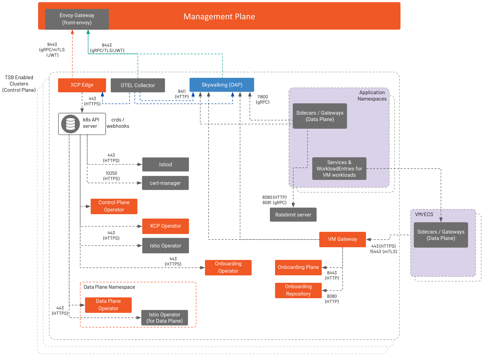

This page will explain in details TSB components and external dependencies that you have to provision and connect to be able to run TSB. 

Before you continue, make sure you've: 

✓ Checked [TSB architecture](../concepts/architecture) and understood the [four layers of TSB](../concepts/architecture#overall-architecture): data plane (envoy proxies), local control plane (Istio), global control plane (XCP) and management plane (TSB itself).

## Management Plane

Following image shows Management Plane (MP) components

:::note front-envoy port
The default Envoy Gateway (or front-envoy) port is 8443 and is user configurable (e.g. changed to 443). If default port is changed then components that communicate via front-envoy need to be adjusted accordingly to match the user-defined value.
:::

:::note front-envoy as Elasticsearch proxy
TSB front-envoy can act as proxy to Elasticsearch that is configured in `ManagementPlane` CR. 
To use this, set elastic host and port to the TSB front-envoy host and port in the `ControlPlane` CR. Then traffic from control plane OAP to Elasticsearch will go through front-envoy.
:::

There are two operators running in the management plane to manage lifecycles of the TSB components: 

| Operator name | Description |
|----------------|-------------|
| TSB management plane operator | Operator to manage lifecycle of TSB components in the management plane. |
| XCP central operator | Operator to manage lifecycle of XCP central. TSB management plane operator deploys XCP operator and CRD for this operator, leaving up to them the management of XCP central. |

Following are the management plane components. Go to [management plane install API](../refs/install/managementplane/v1alpha1/spec) for further reference.

| Component name | Description |
|----------------|-------------|
| envoy gateway (front-envoy) | Provides single entry point for TSB API and UI. |
| IAM | External authorization for front-envoy. IAM decides if incoming request to TSB API will be allowed or denied. |
| TSB API server | Core of TSB. Stores configurations that will be shipped to control planes. Uses NGAC for access decisions. Use PostgreSQL as backend storage. |
| Web UI | Provide UI components. Has BFF (Backend for Frontend) to help connecting to various TSB components (API server, OAP). |
| MPC (MP Controller) | Provide Bi-directional config and cluster state sync between TSB API and XCP central. |
| XCP central | Orchestrate multi-cluster discovery. Sends the configurations to all of the connected XCP Edges that run in the cluster. Receives cluster state and config status updates from XCP edges. This component is managed by XCP central operator. |
| OAP (SkyWalking) | Query point for UI to get aggregated metrics and traces from all clusters OAP. Use Elasticsearch as backend storage. |
| OTEL Collector | Scrapes metrics from different components in the management plane. Receives metrics from each control plane's OpenTelemetry (OTEL) collector. Note that OTEL Collector is strictly for TSB Components monitoring only, not your applications.   |
| teamsync | Created when using LDAP and Azure AD as IdP. Fetches users and groups from IdP and syncs into TSB storage. |
| cert-manager | Created when using `INTERNAL` cert-manager. `cert-manager` provisions certificates for internal TSB components for purposes like webhook certificates. |

## Control Plane

Following image shows Control Plane (CP) components along with Data Plane (DP).

There are four operators running in the control plane to manage lifecycles of the TSB components: 

| Operator name | Description |
|----------------|-------------|
| TSB control plane operator | Operator to manage lifecycle of TSB control plane components. |
| XCP edge operator | Operator to manage lifecycle of XCP edge. TSB control plane operator deploys XCP operator and CRD for this operator, leaving up to them the management of XCP edge. |
| Istio Operator | Operator to manage lifecycle of Istio control plane. TSB control plane operator deploys Istio operator and CRD for this operator, leaving up to them the management of Istio components. |
| Onboarding Operator | Operator to manage lifecycle of components required to onboard VM workloads (also known as mesh expansion). |

:::note Revisioned Control Plane
TSB 1.5 introduces Revisioned Control Plane. When you use revisioned control plane, Istio Operator is deployed by XCP edge operator instead of TSB control plane operator. To learn more about revisioned control plane, go to [Istio Isolation Boundaries](../setup/isolation-boundaries).
:::

Following are the control plane components. Go to [control plane install API](../refs/install/controlplane/v1alpha1/spec) for further reference.

| Component name | Description |
|----------------|-------------|
| XCP edge | Receive configurations from XCP central and translate to Istio configurations. Send updates to XCP central on config status and cluster inventory. Managed by XCP edge operator. |
| Istiod | Istio component that provides service discovery, configuration distribution to Envoy proxies and workload certificate management. Managed by Istio Operator. |
| OAP (SkyWalking) | Receives access logs and traces from all of the Istio sidecars and gateways in the cluster. Processes those access logs and generates metrics. Metrics and traces are sent to Elasticsearch. |
| OTEL Collector | Scrapes metrics from different TSB components in the control plane. Exports metrics to Prometheus exporter in the same pod and to Management plane OTEL collector via front envoy. Note that OTEL Collector is strictly for TSB Components monitoring only, not your applications. |
| SkyWalking HPA | Provides an external metrics adapter from which the Kubernetes Horizontal Pod Autoscaling (HPA) controller can retrieve metrics from. |
| Ratelimit server | Optional component that provides built-in ratelimiting capability. |
| VM Gateway | Deployed when mesh expansion is enabled. VM Gateway that provides connection to Istiod and OAP from sidecars running in VM. |
| Onboarding Plane | Deployed when mesh expansion is enabled. A component that the Onboarding Agent in the VM will connect to in order to onboard external mesh workload (e.g. workload running in VM) into the mesh. |
| Onboarding Repository | Deployed when mesh expansion is enabled. A HTTP server serving DEB and RPM packages of Onboarding Agent and Istio Sidecar. |
| cert-manager | Created when using `INTERNAL` cert-manager. `cert-manager` provisions certificates for internal TSB components for purposes like webhook certificates. |

## Data Plane

:::note Revisioned Control Plane
TSB 1.5 introduces Revisioned Control Plane. When you use revisioned control plane, Data plane operator is not required anymore to manage Istio gateways. To learn more about revisioned control plane, go to [Istio Isolation Boundaries](../setup/isolation-boundaries).
:::

There are two operators running in data plane to manage lifecycles of the gateway deployment: 

| Operator name | Description |
|----------------|-------------|
| TSB data plane operator | Operator to manage lifecycle of TSB data plane components. |
| Istio Operator | Operator to manage lifecycle of Istio Gateways based on Gateway CR specified in [data plane install API](../refs/install/dataplane/v1alpha1/spec) |
