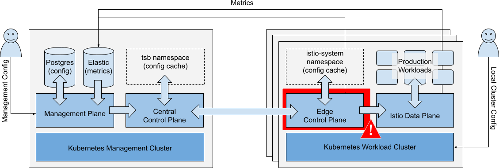
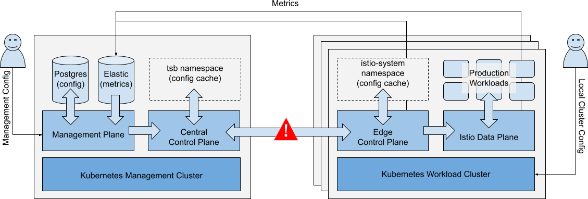

# Failure Scenarios for the Tetrate Management Plane

We will consider the following failure scenarios:

 - Workload Cluster
 - Edge Control Plane
 - Loss of connectivity from Management to Workload
 - Central Control Plane
 - Management Plane
 - Management Cluster

... and evaluate the effect of the failure on the following operations:

 - **Running production workloads** - the availability, security and correct operation of production workloads
 - **Local Cluster operations** - this includes the direct modification of cluster configuration such as kubectl actions, and indirect modification (i.e. changes made by the local Edge Control Plane to apply TSB policies or update service discovery endpoints)
 - **Metrics Collection** - the central collection and storage of metrics from remote workload clusters
 - **Management Operations** - TSB configuration changes, performed by GitOps, API or Management UI

We will look at the typical recovery scenario when a failed component recovers or is restored.

## Architecture and Terms

In this guide, we’ll use the following Architecture description:

|  _Simplified Architecture Diagram, showing primary configuration and metrics flows_ |
| :--: |

 - **Workload Cluster**: A Workload Cluster is a kubernetes cluster that hosts production workloads
 - **Production Workload**: A Production Workload is an app or service running in a Workload Cluster.  For avoidance of doubt, ‘Production Workload’ also includes non-production workloads 
 - **Data Plane**: The Data Plane is the local Istio instance, deployed in the Workload Cluster
 - **Edge Control Plane**: The Edge Control Plane is the Tetrate software component installed in the istio-system and other namespaces (e.g. cert-manager, xcp-multicluster) in the Workload Cluster.  It configures the local Istio dataplane, and reports state to the Central Control Plane
 - **Management Cluster**: The Management Cluster is the kubernetes cluster that hosts the Tetrate management plane components (Management Plane, Central Control Plane).
 - **Central Control Plane**: The Central Control Plane is the Tetrate software component that accepts configuration from the Management Plane and status information from Edge Control Planes.  It evaluates the entire configuration, then distributes necessary configuration updates to each Edge Control Plane
 - **Management Plane**: The Management Plane is the Tetrate software component that entities (GitOps, API clients, UI clients) interact with.  It provides RBAC access control to control which entities can CRUD which configuration.  Configuration is stored locally, and synced to the Central Control Plane

For more information, please refer to the Tetrate Architecture Documentation.

### Terms

 - "_Failure_" means loss of availability of the relevant component
 - "_Recovery_" means regaining availability of the relevant component, likely with out-of-date configuration or status
 - "_Restoring_" means reinstalling a failed component, where it’s not possible to recover the component
 - ✅ A component or service is not affected
 - ⚠️ A limited loss-of-service occurs.
 - ❌ A total loss-of-service in the affected component occurs

## Failure of Workload Cluster

**Scenario**: There is a catastrophic failure of a single Workload Cluster. 

|  _Catastrophic failure of a single Workload Cluster_ |
| :--: |

### Impacts

| Operations | Impact |  |
| ---------- | ------ | -- |
| Running Workloads | Local workloads are unavailable.  Workloads on other clusters are unaffected. Workload HA (Tier1 and EW gateways) ensures no interruption in service. | ⚠️ |
| Local Cluster Ops | Local cluster changes cannot be made.  Other clusters are unaffected. | ⚠️ |
| Metrics Collection | Metrics cannot be collected from the local cluster.  Other cluster metric collection unaffected. | ⚠️ |
| Management Ops | Changes to the affected Workload Cluster are queued, and applied when the cluster recovers.  All other management operations are unaffected. | ✅ |

### Recovery

If the local cluster recovers, configuration will be quickly updated and metrics collection will resume.

### Restoration

If necessary, the Tetrate Edge Control Plane can be re-installed.  When the cluster is re-introduced to the management plane, it will sync to the correct configuration.

## Failure of Edge Control Plane

**Scenario**: There is a catastrophic failure of the Edge Control Plane in a single Workload Cluster. 

|  _Catastrophic failure of the Edge Control Plane in a single Workload Cluster_ |
| :--: |

### Impacts

| Operations | Impact |  |
| ---------- | ------ | -- |
| Running Workloads | Running Workloads in local or remote clusters are not affected. | ✅ |
| Local Cluster Ops | Local cluster changes (kubectl) are unaffected. You can continue to push updates to the cluster.  Depending on the nature of the failure:<ul><li>New workloads may run partially configured until the edge control plane is restored. They may acquire global cluster policies that are already in the cluster but may lack the namespace-targeted and fine-grained policies.</li><li>Local service discovery endpoints for remote services might not be updated (local workload clusters are not aware of service changes on remote clusters).</li><li>GitOps integrations may be interrupted.</li></ul> | ⚠️ |
| Metrics Collection | Metrics are collected locally, reduced, then forwarded to Management Plane ElasticSearch.  If collector services are unavailable, metrics might not be collected. | ⚠️ |
| Management Ops | Changes to the affected Workload Cluster are queued and applied when Edge Control Plane recovers.  All other management operations are unaffected. | ✅ |

### Recovery

If the local cluster recovers, configuration will be quickly updated and metrics collection will resume.

### Restoration

If necessary, the Tetrate Edge Control Plane can be re-installed.  When the cluster is re-introduced to the management plane, it will sync to the correct configuration.

## Loss of Connectivity - Workload to Management Cluster

**Scenario**: There is a loss of connectivity between the Workload Cluster and the central Management Cluster. 

|  _Loss of connectivity between Workload Cluster and central Management Cluster_ |
| :--: |

### Impacts

| Operations | Impact |  |
| ---------- | ------ | -- |
| Running Workloads | Running Workloads in local or remote clusters are not affected. | ✅ |
| Local Cluster Ops | Local cluster changes (kubectl) are unaffected.  New workloads may run partially configured until connectivity is restored. They may acquire global cluster policies that are already in the cluster but will lack namespace-targeted and fine-grained policies. Local service discovery endpoints for remote services are not updated. GitOps operations may be interrupted. | ⚠️ |
| Metrics Collection | Metrics are collected and queued in affected Workload Clusters.  Long-term connectivity loss will result in some loss of metrics. | ⚠️ |
| Management Ops | Changes to the affected Workload Cluster(s) are queued and applied when connectivity is restored.  All other management operations are unaffected. | ✅ |

### Recovery

When connectivity is restored, configuration will be quickly updated and metrics collection will resume.

## Failure of Central Control Plane

**Scenario**: The Central Control Plane component fails. 

|  _Central Control Plane fails_ |
| :--: |

### Impacts

| Operations | Impact |  |
| ---------- | ------ | -- |
| Running Workloads | Running Workloads in local or remote clusters are not affected. | ✅ |
| Local Cluster Ops | Local cluster changes (kubectl) are unaffected.  New workloads may run partially configured until the central control plane is restored. They may acquire global cluster policies that are already in the cluster but will lack namespace-targeted and fine-grained policies. Local service discovery endpoints for remote services are not updated. | ⚠️ |
| Metrics Collection | Metrics collection is unaffected. | ✅ |
| Management Ops | Configuration reads, dashboard (metrics) unaffected. Configuration updates are queued. | ✅ |

### Recovery

When Central Control Plane recovers, its local configuration cache is automatically restored, typically within 1-2 minutes.  Remote cluster configuration is then updated.  No configuration changes or data is lost.

### Restoration

The Central Control Plane component can be re-installed if necessary with assistance from [Tetrate technical support](https://tetrate.io/contact-us/). No backups are required

## Failure of Management Plane

**Scenario**: The Management Plane component fails. 

|  _Management Plane fails_ |
| :--: |

### Impacts

| Operations | Impact |  |
| ---------- | ------ | -- |
| Running Workloads | Running Workloads in local or remote clusters are not affected. | ✅ |
| Local Cluster Ops | Local cluster changes (kubectl) are unaffected.  New workloads may run partially configured until the management plane is restored. They may acquire global cluster policies that are already in the cluster but will lack namespace-targeted and fine-grained policies. Central and Local Control Planes maintain service discovery endpoints. | ✅ |
| Metrics Collection | Metrics collection is affected if the ElasticSearch database is unavailable to Workload Clusters. | ⚠️ |
| Management Ops | TSB configuration changes cannot be made.  UI, API and GitOps actions are not available. | ❌ |

TSB configuration is stored in a customer-provisioned PostgreSQL database, and in some ancillary services - cert-manager for PKI management, the tsb namespace for other secrets. 

### Recovery

If the management plane recovers without data loss, operations proceed as before and no configuration loss should occur.

### Restoration

The Management Control Plane component can be re-built from a backup of the PostgreSQL database and the **iam-signing-key**, with assistance from [Tetrate technical support](https://tetrate.io/contact-us/).  There's an overview of the process in the [Management Plane DR](dr-managementplane) document.

## Failure of Management Cluster

**Scenario**: The Kubernetes Management Cluster fails. 

|  _Management Cluster fails_ |
| :--: |

### Impacts

| Operations | Impact |  |
| ---------- | ------ | -- |
| Running Workloads | Running Workloads in local or remote clusters are not affected. | ✅ |
| Local Cluster Ops | Local cluster changes (kubectl) are unaffected. Central TSB policies (e.g. default settings for new namespaces) are applied to new configurations.  Local service discovery endpoints for remote services are not updated. | ⚠️ |
| Metrics Collection | Metrics cannot be collected from any Workload Clusters. | ❌ |
| Management Ops | TSB configuration changes cannot be made.  UI, API and GitOps actions are not available. | ❌ |

### Recovery

If the management plane recovers without data loss, operations proceed as before and no configuration loss should occur.

### Restoration

The Management Control Plane component can be re-built from a backup of the PostgreSQL database and the **iam-signing-key**, with assistance from [Tetrate technical support](https://tetrate.io/contact-us/).  There's an overview of the process in the [Management Plane DR](dr-managementplane) document.

## Recommendations

To prepare for unexpected failure of the Management components, we recommend that you consider the following recommendations:

 * Either maintain the Postgres database in a reliable, redundant cluster, or (in the case of TSE), make use of the [regular Postgres backups](https://docs.tetrate.io/service-express/administration/postgres).
 * Maintain a backup of the **iam-signing-key**
 * If preserving metrics is important, maintain the ElasticSearch database in a reliable, redundant cluster, or make regular backups so that it can be restored if necessary.

There's an overview of the process to restore a failed Management Plane component in the [Management Plane DR](dr-managementplane) document.
