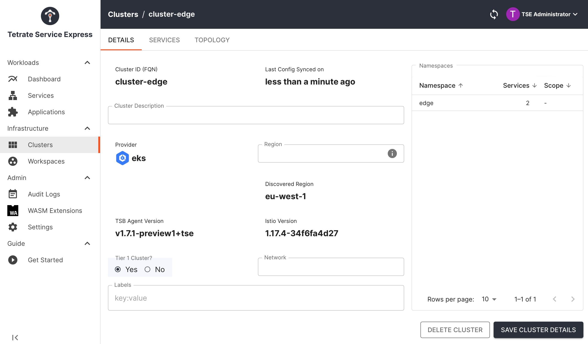
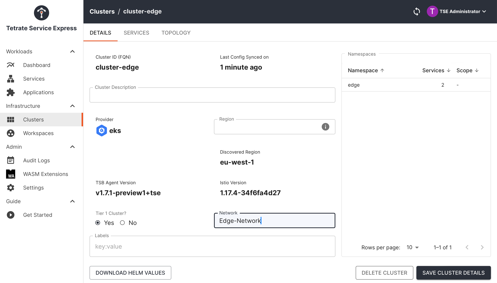
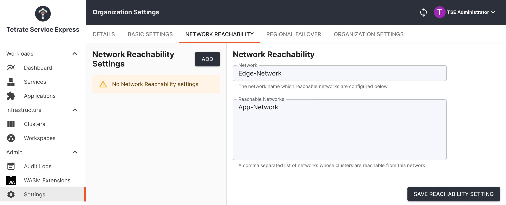
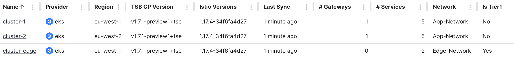
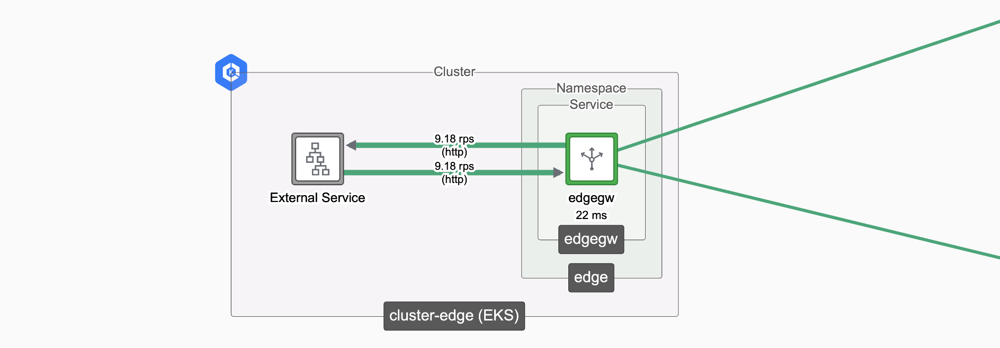

# Building the Demonstration Environment

_A simple worked example, with two workload clusters and one edge gateway cluster_

In this worked example, we'll configure three Kubernetes clusters:

 * Clusters **cluster-1** and **cluster-2** will function as workload clusters, each with an instance of the **bookinfo** application and an **Ingress Gateway** to expose the application
 * Cluster **cluster-edge** will host a front-end Edge ("Tier-1") Gateway, which will receive traffic and distribute across the Ingress Gateways in the workload clusters

| [](images/edge-workload.png) _Edge and Workload Load Balancing_ |
|  :--:  |


#### Before you Begin

There are a number of moving parts in the configuration, so it's helpful to identify and name each part before proceeding:

|                        | **cluster-1** | **cluster-2** | **cluster-edge** |
| ---------------------- | ------------- | ------------- | ---------------- |
| AWS Region:            | eu-west-1     | eu-west-2     | eu-west-1        |
| Namespace:             | bookinfo      | bookinfo      | edge             |
| Workspace:             | bookinfo-ws   | bookinfo-ws   | edge-ws          |
| Networks:              | app-network   | app-network   | edge-network     |
| Gateway Group:         | bookinfo-gwgroup-1 | bookinfo-gwgroup-2 | edge-gwgroup |
| Ingress Gateway:       | ingressgw-1   | ingressgw-2   | edgegw           |
| Gateway resource:      | bookinfo-ingress-1 | bookinfo-ingress-2 | bookinfo-edge |
| Kubectl context alias: | `k1`          | `k2`          | `k3`             |

Ensure that **cluster-1** and **cluster-edge** are located in one region, and **cluster-2** is located in a different region; this will prove useful when testing [cluster failover](cluster-failover).

In this worked example, we will use organization **tse** and tenant **tse**.  If you are using Tetrate Service Bridge (TSB), modify the Tetrate configurations to match your organizational hierarchy.

:::tip Managing Multiple Clusters

When working with multiple Kubernetes clusters, it can be useful to create an alias for the **kubectl** command for each cluster.  For example, with AWS contexts, you might do something like:

```bash
alias k1='kubectl --context arn:aws:eks:eu-west-1:901234567890:cluster/my-cluster-1'
```

You don't need to do this when applying Tetrate configuration, which is applied either using `tctl` or against any Kubernetes cluster with GitOps integration.

:::

### Prerequisites

We'll assume the following initial configuration:

 * Clusters **cluster-1**, **cluster-2** and **cluster-edge** are onboarded to the Tetrate platform, either TSE or TSB
 * Any necessary integrations (e.g. AWS Load Balancer Controller) are deployed on each cluster
 * If using Tetrate Service Express, the **Route 53 Controller** is deployed on **cluster-edge**


<Steps headingDepth={4}>

<ol>
<li>

#### [Create the Tetrate Configuration](#create-the-tetrate-configuration-1)
Create the Tetrate Workspaces, Networks and Gateway Groups 

</li>
<li>

#### [Deploy bookinfo in cluster-1](#deploy-bookinfo-in-cluster-1-1)
Deploy bookinfo into the first cluster.  Deploy an Ingress Gateway and a Gateway resource.

</li>
<li>

#### [Deploy bookinfo in cluster-2](#deploy-bookinfo-in-cluster-2-1)
Repeat, deploying bookinfo into the second cluster.  Deploy an Ingress Gateway and a Gateway resource.
</li>
<li>

#### [Configure the Edge Gateway](#configure-the-edge-gateway-1)
Deploy an Edge Gateway into the Edge cluster, and a Gateway resource.  Configure DNS if necessary and test the result.

</li>
</ol>
</Steps>

## Create the Demo Environment

### Create the Tetrate Configuration

We will:

 1. Create a Workspace for the two workload clusters, with a gateway group for each cluster
 1. Create a Workspace and Gateway Group for the edge cluster
 1. Configure **cluster-edge** to be a Tier-1 cluster
 1. Define the Tetrate Networks and the Reachability configuration

<details>
<summary>How we do it...</summary>

#### Create the configuration for the Workload Clusters

Create a Workspace **bookinfo-ws** that spans both workload clusters, and a Gateway Group for each cluster.

```bash
cat <<EOF > bookinfo-ws.yaml
apiversion: api.tsb.tetrate.io/v2
kind: Workspace
metadata:
  organization: tse
  tenant: tse
  name: bookinfo-ws
spec:
  displayName: Bookinfo
  description: Test Bookinfo application
  namespaceSelector:
    names:
      - "cluster-1/bookinfo"
      - "cluster-2/bookinfo"
EOF

tctl apply -f bookinfo-ws.yaml


cat <<EOF > bookinfo-gwgroup-1.yaml
apiVersion: gateway.tsb.tetrate.io/v2
kind: Group
metadata:
  organization: tse
  tenant: tse
  workspace: bookinfo-ws
  name: bookinfo-gwgroup-1
spec:
  namespaceSelector:
    names:
      - "cluster-1/bookinfo"
EOF

tctl apply -f bookinfo-gwgroup-1.yaml


cat <<EOF > bookinfo-gwgroup-2.yaml
apiVersion: gateway.tsb.tetrate.io/v2
kind: Group
metadata:
  organization: tse
  tenant: tse
  workspace: bookinfo-ws
  name: bookinfo-gwgroup-2
spec:
  namespaceSelector:
    names:
      - "cluster-2/bookinfo"
EOF

tctl apply -f bookinfo-gwgroup-2.yaml
```

#### Create the configuration for the Edge Cluster

Create a Workspace **edge-ws** and a Gateway Group for the Edge cluster:

```bash
cat <<EOF > edge-ws.yaml
apiversion: api.tsb.tetrate.io/v2
kind: Workspace
metadata:
  organization: tse
  tenant: tse
  name: edge-ws
spec:
  namespaceSelector:
    names:
      - "cluster-edge/edge"
EOF

tctl apply -f edge-ws.yaml


cat <<EOF > edge-gwgroup.yaml
apiVersion: gateway.tsb.tetrate.io/v2
kind: Group
metadata:
  tenant: tse
  organization: tse
  workspace: edge-ws
  name: edge-gwgroup
spec:
  namespaceSelector:
    names:
      - 'cluster-edge/edge'
EOF

tctl apply -f edge-gwgroup.yaml
```

#### Configure the Edge cluster to be a Tier-1 cluster

Set the "Is Tier 1" flag for the Edge cluster.

It's generally easier to configure Cluster settings using the Tetrate UI:

<Tabs 
  defaultValue="ui"
  values={[
    {label: 'Tetrate UI', value: 'ui'},
    {label: 'YAML API', value: 'api'}
  ]}>
  <TabItem value="ui">

Navigate to **Clusters**.  Edit **cluster-edge** and set the '**Tier 1 Cluster?**' field to **Yes**.  Save the changes:

| [](images/edge-tier1.png) _Configure **cluster-edge** to be a Tier-1 cluster_ |
|  :--:  |

</TabItem>
<TabItem value="api">

Update the **Cluster** configuration for **cluster-edge** , adding the key `spec: tier1Cluster: ` as follows:

```yaml
apiVersion: api.tsb.tetrate.io/v2
kind: Cluster
metadata:
  name: cluster-edge
  organization: tse
spec:
# highlight-next-line
  tier1Cluster: true
```

</TabItem>
</Tabs>

#### Configure Network and Reachability Settings

The Tetrate platform uses Network settings to group sets of clusters and define access control lists.  If a cluster is not assigned to a network, this cluster can be reached by any other cluster.  When operating at scale, Network settings provide a high-level way of identifying sets of clusters and defining permitted flows.

We will:

 1. Assign **cluster-edge** to the Network **Edge-Network**
 1. Assign **cluster-1** and **cluster-2** to the Network **App-Network**
 1. Define reachability settings so that **Edge-Network** can send traffic to **App-Network**

It's generally easier to configure Network settings using the Tetrate UI:

<Tabs 
  defaultValue="ui"
  values={[
    {label: 'Tetrate UI', value: 'ui'},
    {label: 'YAML API', value: 'api'}
  ]}>
  <TabItem value="ui">

#### Assign Networks

Navigate to **Clusters**.  Edit **cluster-edge** and set the **Network** field to the value **Edge-Network**.  Save the changes:

| [](images/edge-network.png) _Assign **cluster-edge** to the Network **Edge-Network**_ |
|  :--:  |

Repeat for clusters **cluster-1** and **cluster-2**, assigning them to the network **App-Network**.

#### Define Reachability

Navigate to **Settings** and **Network Reachability**.  Specify that **Edge-Network** is permitted to reach (send traffic to) **App-Network**:

| [](images/reachability.png) _Define reachability settings so that **Edge-Network** can send traffic to **App-Network**_ |
|  :--:  |

Save the changes.

</TabItem>
<TabItem value="api">

#### Assign Networks

Update each **Cluster** configuration, adding the key `spec: network: ` as follows:

```yaml
apiVersion: api.tsb.tetrate.io/v2
kind: Cluster
metadata:
  name: cluster-edge
  organization: tse
spec:
# highlight-next-line
  network: edge-network
```

#### Define Reachability

Update the **OrganizationSettings** configuration, adding the networkReachability stanza as below:

```yaml
apiVersion: api.tsb.tetrate.io/v2
kind: OrganizationSetting
metadata:
  name: default
  organization: tse
spec:
  defaultSecuritySetting:
    authenticationSettings:
      trafficMode: REQUIRED
    authorization:
      mode: RULES
      rules: {}
  fqn: organizations/tse/settings/default
# highlight-start
  networkSettings:
    networkReachability:
      Edge-Network: App-Network
# highlight-end
```

The **OrganizationSettings** resource is an internal object; you can obtain it using `tctl get organizationsettings -o yaml`.  Remove any **resourceVersion** or **etag** values before submitting an update.
</TabItem>
</Tabs>

</details>

#### Review your changes

Once you have completed your changes, the cluster page in the UI should resemble the following:

| [](images/cluster-summary.png) _Cluster summary_ |
|  :--:  |

Note the **Network** and **Is Tier1** columns and values for each cluster.

In addition, you'll have created Workspaces and Gateway Groups for each cluster, and defined the Reachability Settings so that **Edge-Network** can reach **App-Network**.


### Deploy bookinfo in cluster-1

| [](images/cluster-1-config.png) _BookInfo in Cluster 1_ |
|  :--:  |

We will:
 
 1. Create the **bookinfo** namespace and deploy the **BookInfo** application
 1. Deploy an **Ingress Gateway** in the cluster
 1. Publish a **Gateway** resource to expose the **productpage.bookinfo** service
 1. Verify that the service is functioning correctly 

Remember to set the kubectl context or use your context alias to point to **cluster-1**.

<details>
<summary>How we do it...</summary>

#### Create the bookinfo namespace and deploy the Bookinfo application:

```bash
kubectl create namespace bookinfo
kubectl label namespace bookinfo istio-injection=enabled
kubectl apply -n bookinfo -f https://raw.githubusercontent.com/istio/istio/master/samples/bookinfo/platform/kube/bookinfo.yaml

sleep 10

kubectl exec "$(kubectl get pod -n bookinfo -l app=ratings -o jsonpath='{.items[0].metadata.name}')" \
   -n bookinfo -c ratings -- curl -s productpage:9080/productpage
```

Note: the final shell command verifies that the **BookInfo** application is correctly deployed and functioning.

#### Deploy an Ingress Gateway in the cluster

We'll provision an Ingress Gateway **ingressgw-1** in the **bookinfo** namespace in the cluster:

```bash
cat <<EOF > ingressgw-1.yaml
apiVersion: install.tetrate.io/v1alpha1
kind: IngressGateway
metadata:
  name: ingressgw-1
  namespace: bookinfo
spec:
  kubeSpec:
    service:
      type: LoadBalancer
EOF

kubectl apply -f ingressgw-1.yaml
```

#### Publish a Gateway resource to expose productpage.bookinfo

We will publish a Gateway resource into the Gateway Group on the cluster, referencing the Ingress Gateway we just provisioned. 

Use **tctl** or **kubectl** (if GitOps is enabled on that cluster):

<Tabs 
  defaultValue="tctl"
  values={[
    {label: 'tctl', value: 'tctl'},
    {label: 'kubectl (GitOps)', value: 'kubectl'}
  ]}>
  <TabItem value="tctl">

```bash
cat <<EOF > bookinfo-ingress-1.yaml
apiVersion: gateway.tsb.tetrate.io/v2
kind: Gateway
metadata:
  organization: tse
  tenant: tse
  workspace: bookinfo-ws
  group: bookinfo-gwgroup-1
  name: bookinfo-ingress-1
spec:
  workloadSelector:
    namespace: bookinfo
    labels:
      app: ingressgw-1
  http:
  - name: bookinfo
    port: 80
    hostname: bookinfo.tse.tetratelabs.io
    routing:
      rules:
      - route:
          serviceDestination:
            host: bookinfo/productpage.bookinfo.svc.cluster.local
            port: 9080
EOF


tctl apply -f bookinfo-ingress-1.yaml
```

</TabItem>
<TabItem value="kubectl">

```bash
cat <<EOF > bookinfo-ingress-1.yaml
apiVersion: gateway.tsb.tetrate.io/v2
kind: Gateway
metadata:
  name: bookinfo-ingress-1
  annotations:
    tsb.tetrate.io/organization: tse
    tsb.tetrate.io/tenant: tse
    tsb.tetrate.io/workspace: bookinfo-ws
    tsb.tetrate.io/gatewayGroup: bookinfo-gwgroup-1
spec:
  workloadSelector:
    namespace: bookinfo
    labels:
      app: ingressgw-1
  http:
    - name: bookinfo
      port: 80
      hostname: bookinfo.tse.tetratelabs.io
      routing:
        rules:
          - route:
              serviceDestination:
                host: bookinfo/productpage.bookinfo.svc.cluster.local
                port: 9080
EOF

kubectl apply -f bookinfo-ingress-1.yaml
```
</TabItem>
</Tabs>

</details>

#### Verify that the service is functioning correctly 

Check that the service on **cluster-1** is functioning by sending an HTTP request through the Ingress Gateway to the **productpage** service:

```bash
export GATEWAY_IP=$(kubectl -n bookinfo get service ingressgw-1 -o jsonpath="{.status.loadBalancer.ingress[0]['hostname','ip']}")
echo $GATEWAY_IP

curl -s --connect-to bookinfo.tse.tetratelabs.io:80:$GATEWAY_IP \
    "http://bookinfo.tse.tetratelabs.io/productpage" 
```

Note: The Ingress Gateway may need a cloud load balancer, and you may need to allow several minutes for the cloud load balancer to finish provisioning. 


### Deploy bookinfo in cluster-2

| [](images/cluster-2-config.png) _BookInfo in Cluster 2_ |
|  :--:  |

We will repeat the above steps for **cluster-2**, making sure to reference the **cluster-2** **GatewayGroup**, **IngressGateway** and **Gateway** resource.

Remember to set the kubectl context or use your context alias to point to **cluster-2**.

<details>
<summary>How we do it...</summary>

#### Create the bookinfo namespace and deploy the Bookinfo application:

```bash
kubectl create namespace bookinfo
kubectl label namespace bookinfo istio-injection=enabled
kubectl apply -n bookinfo -f https://raw.githubusercontent.com/istio/istio/master/samples/bookinfo/platform/kube/bookinfo.yaml
sleep 10
kubectl exec "$(kubectl get pod -n bookinfo -l app=ratings -o jsonpath='{.items[0].metadata.name}')" \
   -n bookinfo -c ratings -- curl -s productpage:9080/productpage
```

#### Deploy an Ingress Gateway in the cluster

```bash
cat <<EOF > ingressgw-2.yaml
apiVersion: install.tetrate.io/v1alpha1
kind: IngressGateway
metadata:
  name: ingressgw-2
  namespace: bookinfo
spec:
  kubeSpec:
    service:
      type: LoadBalancer
EOF

kubectl apply -f ingressgw-2.yaml
```

#### Publish a Gateway resource to expose productpage.bookinfo

<Tabs 
  defaultValue="tctl"
  values={[
    {label: 'tctl', value: 'tctl'},
    {label: 'kubectl (GitOps)', value: 'kubectl'}
  ]}>
  <TabItem value="tctl">

```bash
cat <<EOF > bookinfo-ingress-2.yaml
apiVersion: gateway.tsb.tetrate.io/v2
kind: Gateway
metadata:
  organization: tse
  tenant: tse
  workspace: bookinfo-ws
  group: bookinfo-gwgroup-2
  name: bookinfo-ingress-2
spec:
  workloadSelector:
    namespace: bookinfo
    labels:
      app: ingressgw-2
  http:
  - name: bookinfo
    port: 80
    hostname: bookinfo.tse.tetratelabs.io
    routing:
      rules:
      - route:
          serviceDestination:
            host: bookinfo/productpage.bookinfo.svc.cluster.local
            port: 9080
EOF


tctl apply -f bookinfo-ingress-2.yaml
```

</TabItem>
<TabItem value="kubectl">

```bash
cat <<EOF > bookinfo-ingress-2.yaml
apiVersion: gateway.tsb.tetrate.io/v2
kind: Gateway
metadata:
  name: bookinfo-ingress-2
  annotations:
    tsb.tetrate.io/organization: tse
    tsb.tetrate.io/tenant: tse
    tsb.tetrate.io/workspace: bookinfo-ws
    tsb.tetrate.io/gatewayGroup: bookinfo-gwgroup-2
spec:
  workloadSelector:
    namespace: bookinfo
    labels:
      app: ingressgw-2
  http:
    - name: bookinfo
      port: 80
      hostname: bookinfo.tse.tetratelabs.io
      routing:
        rules:
          - route:
              serviceDestination:
                host: bookinfo/productpage.bookinfo.svc.cluster.local
                port: 9080
EOF

kubectl apply -f bookinfo-ingress-2.yaml
```
</TabItem>
</Tabs>

</details>

#### Verify that the service is functioning correctly 

Test against **cluster-2** as follows:

```bash
export GATEWAY_IP=$(kubectl -n bookinfo get service ingressgw-2 -o jsonpath="{.status.loadBalancer.ingress[0]['hostname','ip']}")
echo $GATEWAY_IP

curl -s --connect-to bookinfo.tse.tetratelabs.io:80:$GATEWAY_IP \
    "http://bookinfo.tse.tetratelabs.io/productpage" 
```


### Configure the Edge Gateway

| [](images/edge-config.png) _Edge Gateway in Edge Cluster_ |
|  :--:  |

We will:

 * Create the **edge** namespace
 * Deploy an **Edge Gateway** in the cluster
 * Publish a **Gateway** resource that balances traffic across the workload clusters
 * Verify that the service is functioning correctly 

If you're using TSE's **Route 53 Controller** to automatically manage DNS, remember to first enable it on this cluster.  Any public DNS should point to the Edge Gateway on this cluster.

Remember to set the kubectl context or use your context alias to point to **cluster-edge**.

<details>
<summary>How we do it...</summary>

#### Create the edge namespace

```bash
kubectl create namespace edge
kubectl label namespace edge istio-injection=enabled
```

#### Deploy an Edge Gateway in the cluster

```bash
cat <<EOF > edgegw.yaml
apiVersion: install.tetrate.io/v1alpha1
kind: Tier1Gateway
metadata:
  name: edgegw
  namespace: edge
spec:
  kubeSpec:
    service:
      type: LoadBalancer
EOF

kubectl apply -f edgegw.yaml
```

#### Publish a Gateway resource to balance traffic across the workload clusters

<Tabs 
  defaultValue="tctl"
  values={[
    {label: 'tctl', value: 'tctl'},
    {label: 'kubectl (GitOps)', value: 'kubectl'}
  ]}>
  <TabItem value="tctl">

```bash
cat <<EOF > bookinfo-edge.yaml
apiVersion: gateway.tsb.tetrate.io/v2
kind: Gateway
metadata:
  organization: tse 
  tenant: tse
  workspace: edge-ws
  group: edge-gwgroup
  name: bookinfo-edge
spec:
  workloadSelector:
    namespace: edge
    labels:
      app: edgegw
  http:
    - name: bookinfo
      port: 80
      hostname: bookinfo.tse.tetratelabs.io
      routing:
        rules:
          - route:
              clusterDestination: {}
EOF

tctl apply -f bookinfo-edge.yaml
```

</TabItem>
<TabItem value="kubectl">

```bash
cat <<EOF > bookinfo-edge..yaml
apiVersion: gateway.tsb.tetrate.io/v2
kind: Gateway
metadata:
  name: bookinfo-edge
  annotations:
    tsb.tetrate.io/organization: tse
    tsb.tetrate.io/tenant: tse
    tsb.tetrate.io/workspace: edge-ws
    tsb.tetrate.io/gatewayGroup: edge-gwgroup
spec:
  workloadSelector:
    namespace: edge
    labels:
      app: edgegw
  http:
    - name: bookinfo
      port: 80
      hostname: bookinfo.tse.tetratelabs.io
      routing:
        rules:
          - route:
              clusterDestination: {}
EOF

kubectl apply -f bookinfo-edge.yaml
```

</TabItem>
</Tabs>

</details>

#### Verify that the service is functioning correctly 

We will send test traffic to the Edge Gateway on **cluster-edge**:

```bash
export GATEWAY_IP=$(kubectl -n edge get service edgegw -o jsonpath="{.status.loadBalancer.ingress[0]['hostname','ip']}")
echo $GATEWAY_IP

curl -s --connect-to bookinfo.tse.tetratelabs.io:80:$GATEWAY_IP \
    "http://bookinfo.tse.tetratelabs.io/productpage" 
```

If you have configured DNS to point to the Edge Gateway (for example, using TSE's Route 53 Controller), you can test the service directly:

```bash
curl http://bookinfo.tse.tetratelabs.io/productpage
```

Remember that you may need to allow several minutes for the cloud load balancer to finish provisioning. 


## Next Steps

You're now ready to experiment with [workload cluster failover](cluster-failover) behaviour.
