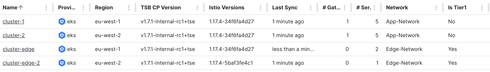

# Extending the Demonstration Environment

_Add a second Edge Gateway for Edge High Availability_

We'll extend the demonstration environment described in the [Demonstration Environment](demo-1) instructions.  We'll add one more Edge cluster in the second region, and deploy an Edge Gateway:

 * Onboard an additional Edge Cluster in **region-2**
 * Extend the Tetrate configuration for the **edge-ws** and create a second **edge-gwgroup-2** group
 * Create an **edge** namespace and deploy an **Edge Gateway** into that namespace
 * Deploy a Gateway resource for that **Edge Gateway**

| [](images/edge-workload-2.png) _Edge and Workload Load Balancing_ |
|  :--:  |


#### Before you Begin

There are a number of moving parts in the configuration, so it's helpful to identify and name each part before proceeding:


|                        | **cluster-1** | **cluster-2** | **cluster-edge** | **cluster-edge-2** |
| ---------------------- | ------------- | ------------- | ---------------- | -------------------|
| AWS Region:            | eu-west-1     | eu-west-2     | eu-west-1        | eu-west-2          |
| Namespace:             | bookinfo      | bookinfo      | edge             | edge               |
| Workspace:             | bookinfo-ws   | bookinfo-ws   | edge-ws          | edge-ws            |
| Networks:              | app-network   | app-network   | edge-network     | edge-network       |
| Gateway Group:         | bookinfo-gwgroup-1 | bookinfo-gwgroup-2 | edge-gwgroup | edge-gwgroup-2 |
| Ingress Gateway:       | ingressgw-1   | ingressgw-2   | edgegw           | edgegw-2           |
| Gateway resource:      | bookinfo-ingress-1 | bookinfo-ingress-2 | bookinfo-edge | bookinfo-edge-2 |
| Kubectl context alias: | `k1`          | `k2`          | `k3`             | `k4`               |


### Prerequisites

These instructions pick up from the deployment described in [Creating the Demonstration Environment](demo-1).

## Extend the Demo Environment

### Add the second Edge Gateway

We will:

 1. Onboard an additional Edge cluster
 1. Extend the Tetrate Configuration (**Workspace**, new **Gateway Group**, **Cluster Settings**)
 1. Configure the cluster to add the **edge** namespace and the **Tier1Gateway**
 1. Deploy the **Gateway** resource to expose the service

<details>
<summary>How we do it...</summary>

#### Onboard the additional Edge cluster

Follow the instructions for Tetrate Service Express or Tetrate Service Bridge to onboard the new **cluster-edge-2** cluster.  Make sure to install any required dependencies, such as the AWS Load Balancer Controller or the Tetrate Route 53 Controller.

#### Extend the Tetrate configuration

We will:

 * Extend the **edge-ws** Workspace to include the new cluster and namespace (to be created)
 * Add a **Gateway Group** for the new cluster
 * Edit the Cluster settings, setting the **tier1Cluster** and **network** values

```bash
cat <<EOF > edge-ws.yaml
apiversion: api.tsb.tetrate.io/v2
kind: Workspace
metadata:
  organization: tse
  tenant: tse
  name: edge-ws
spec:
  namespaceSelector:
    names:
      - "cluster-edge/edge"
      - "cluster-edge-2/edge"
EOF

tctl apply -f edge-ws.yaml


cat <<EOF > edge-gwgroup-2.yaml
apiVersion: gateway.tsb.tetrate.io/v2
kind: Group
metadata:
  tenant: tse
  organization: tse
  workspace: edge-ws
  name: edge-gwgroup-2
spec:
  namespaceSelector:
    names:
      - 'cluster-edge-2/edge'
EOF

tctl apply -f edge-gwgroup-2.yaml
```

Use the UI to edit the **edge-cluster-2** cluster, setting "Is Tier 1?" to **true** and assigning the **Edge-Network** network.

#### Configure the Cluster

Create the **edge** namespace and deploy the Edge Gateway. Remember to set the kubectl context or use your context alias to point to **cluster-edge-2**.

```bash
kubectl create namespace edge
kubectl label namespace edge istio-injection=enabled

cat <<EOF > edgegw-2.yaml
apiVersion: install.tetrate.io/v1alpha1
kind: Tier1Gateway
metadata:
  name: edgegw-2
  namespace: edge
spec:
  kubeSpec:
    service:
      type: LoadBalancer
EOF

kubectl apply -f edgegw-2.yaml
```

#### Deploy the Gateway resource

```bash
cat <<EOF > bookinfo-edge-2.yaml
apiVersion: gateway.tsb.tetrate.io/v2
kind: Gateway
metadata:
  organization: tse 
  tenant: tse
  workspace: edge-ws
  group: edge-gwgroup-2
  name: bookinfo-edge-2
spec:
  workloadSelector:
    namespace: edge
    labels:
      app: edgegw-2
  http:
    - name: bookinfo
      port: 80
      hostname: bookinfo.tse.tetratelabs.io
      routing:
        rules:
          - route:
              clusterDestination: {}
EOF

tctl apply -f bookinfo-edge-2.yaml
```

</details>


Once configuration is complete, your Cluster Summary should resemble the following:

| [](images/cluster-summary-2.png) _Cluster summary_ |
|  :--:  |


#### Verify that the service is functioning correctly 

:::info No DNS

We won't use DNS for these tests, because we want to carefully control which Edge Gateway a request for our service (**bookinfo.tse.tetratelabs.io**) is routed to.

:::

Taking care to set the correct Kubernetes context, obtain the address for each Edge Gateway:

```bash title="Set kubectl context to cluster edge-cluster"
export GATEWAY_IP_1=$(kubectl -n edge get service edgegw -o jsonpath="{.status.loadBalancer.ingress[0]['hostname','ip']}")
echo $GATEWAY_IP_1
```

```bash title="Set kubectl context to cluster edge-cluster-2"
export GATEWAY_IP_2=$(kubectl -n edge get service edgegw-2 -o jsonpath="{.status.loadBalancer.ingress[0]['hostname','ip']}")
echo $GATEWAY_IP_2
```

Verify that you can access the **productpage.bookinfo** service via each Edge Gateway:

```bash title="Test against edge-cluster"
curl -s --connect-to bookinfo.tse.tetratelabs.io:80:$GATEWAY_IP_1 "http://bookinfo.tse.tetratelabs.io/productpage" 
```

```bash title="Test against edge-cluster-2"
curl -s --connect-to bookinfo.tse.tetratelabs.io:80:$GATEWAY_IP_2 "http://bookinfo.tse.tetratelabs.io/productpage" 
```


## Next Steps

You're now ready to experiment with [edge cluster failover](edge-failover) behaviour.