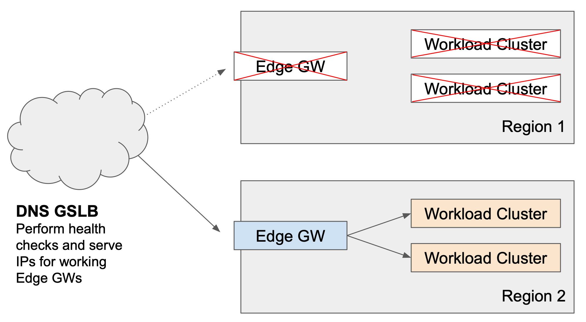

# Edge Load Balancing and Failover

This guide uses the demonstration environment described in the [Extended Demo Environment](demo-2), namely:

 * Two Edge Clusters, in **region-1** and **region-2**
 * Two Workload Clusters, in **region-1** and **region-2**
 * The **BookInfo** application running in the Workload Clusters
 * Two Edge Gateways load-balancing traffic to the Workload Clusters

| [](images/edge-workload-2.png) _Edge and Workload Load Balancing_ |
|  :--:  |

In this guide, we'll look at what happens when Workload and Edge Clusters fail, and how this can be detected.  The Platform Operator can then use this information to configure a way to distribute traffic across the Edge Clusters, such as a DNS-based GSLB solution.  The goal is to maintain the highest-possible availability, and to optimize traffic routing where possible.

## Generate and Observe Test Traffic

Test the Demonstration Environment as follows:

<details>
<summary>Verify all Components</summary>

### Verify all Components

To test all flows (both Edge Gateways to both Workload Clusters), we will use Weighted Traffic Distribution.  Edit **bookinfo-edge** and **bookinfo-edge-2** as follows, and apply the changes using **tctl**:

```yaml
    routing:
        rules:
          - route:
              clusterDestination:
                clusters:
                - name: cluster-1
                  weight: 50
                - name: cluster-2
                  weight: 50
```

Taking care to set the correct Kubernetes context, obtain the address for each Edge Gateway:

```bash title="Set kubectl context to cluster edge-cluster"
export GATEWAY_IP_1=$(kubectl -n edge get service edgegw -o jsonpath="{.status.loadBalancer.ingress[0]['hostname','ip']}")
echo $GATEWAY_IP_1
```

```bash title="Set kubectl context to cluster edge-cluster-2"
export GATEWAY_IP_2=$(kubectl -n edge get service edgegw-2 -o jsonpath="{.status.loadBalancer.ingress[0]['hostname','ip']}")
echo $GATEWAY_IP_2
```

In two different terminal windows, send requests for the **productpage.bookinfo** service via each Edge Gateway.  Note the use of the `?e1` and `?e2` query strings to identify the source Edge Gateway:

```bash title="Test against edge-cluster"
while sleep 1; do \
  curl -s --connect-to bookinfo.tse.tetratelabs.io:80:$GATEWAY_IP_1 \
    "http://bookinfo.tse.tetratelabs.io/productpage?e1" ; \
done 
```

```bash title="Test against edge-cluster-2"
while sleep 1; do \
  curl -s --connect-to bookinfo.tse.tetratelabs.io:80:$GATEWAY_IP_2 \
    "http://bookinfo.tse.tetratelabs.io/productpage?e2" ; \
done 
```

If you use the techniques to watch the gateway logs, as described in the [cluster failover](cluster-failover) guide, you should observe the following:

 * Edge Gateway 1 (**edgegw**) receives requests `GET /productpage?e1`
 * Edge Gateway 2 (**edgegw-2**) receives requests `GET /productpage?e2`
 * Ingress Gateways 1 and 2 (**ingressgw-1** and **ingressgw-2**) receive requests `GET /productpage?e1` _and_ `GET /productpage?e2`

The Topology graph in the Tetrate UI will show flows from both Edge Gateways to both Workload Clusters.

</details>

<details>
<summary>Test Workload Cluster failover</summary>

### Test Workload Cluster failover

Update the **bookinfo-edge** and **bookinfo-edge-2** configuration to use the [Auto Cluster List](cluster-failover#auto-cluster-list) configuration:

```yaml
    routing:
        rules:
          - route:
              clusterDestination: {}
```

Recall that this configuration considers all working Workload Clusters, and prefers clusters in the same region if they are available.

Your benchmark will show that Workload Cluster 1 only receives requests from Edge Gateway 1 (and the same for "2"), and the Topology Graph will also reflect this data once it syncs.

#### Provoke a Workload Cluster failure

Provoke a Workload Cluster failure on **cluster-1** by either deleting the **Gateway** resource or scaling the **Ingress Gateway** to 0 replicas, as described in the [workload cluster failover](cluster-failover#test-failure-handling) tests.

For example, to delete the **Gateway** resource on **cluster-1**, use `tctl delete -f bookinfo-ingress-1.yaml`.

Observe that both Edge Gateways now send traffic to **cluster-2**.  Failover has been successful.

</details>

## Edge Gateway Failover

The Edge Gateway pattern is a two-tier pattern, where the Edge Gateways provide a first tier of load-balancing in front of a tier of Ingress Gateways in Workload clusters.

Failure of an Edge Gateway is relatively rare compared to a Workload cluster.  Edge Gateway components have a simple and stable configuration that is fully-managed by the Tetrate Management Plane, making operational errors extremely unlikely, and the load on an Edge Gateway is typically significantly lower than the load on an equivalent Workload cluster. 

You will want to implement a failover method that takes an Edge Gateway out-of-use in two scenarios:

 * Total Failure of the Edge Gateway or entire region (scenario 2)
 * Total Failure of the local Workload Clusters in the same region as the Edge Gateway (scenario 3, optional)

The goal of a failover configuration is to maintain uptime and minimize inefficiencies in the event of these failure scenarios.  In the explanation below, we'll explain how these scenarios can be detected.  


:::info One Edge Gateway per Region

For simplicity, these scenarios consider the situation where there is a single Edge Gateway in each Region.  The scenario implementations could be extended to cover the case where there are multiple, independent Edge Gateways in a region.

:::

### Scenario 0: Normal Edge and Workload Load Balancing

During normal operation, the goal of Edge Cluster configuration is to obtain the following behavior:

| [](images/gslb-0.png) _Scenario 0: Normal Edge and Workload Load Balancing_ |
|  :--:  |

Traffic is distributed across Edge Gateways using a GSLB solution, perhaps with additional proximity or weighted load balancing.  Each Edge Gateway distributes traffic across the Workload Clusters in its local region.


### Scenario 1: Partial Failure of some Local Workload Clusters

<table>
<tr>
<td width="40%">

[](images/gslb-1.png)

</td><td width="60%">

_Some of the Workload Clusters in a region fail_

Each Edge Gateway distributes requests against all working local Workload Clusters. The GSLB solution continues distribute requests across all Edge Gateways.

Clients are not affected by the failure.

</td>
</tr>
</table>

No failover action is required as all Edge Gateways can continue to serve the impacted service.  We assume there is sufficient capacity in each region, perhaps with autoscaling in place to compensate for the loss of an active cluster.

### Scenario 2: Total Failure of an Edge Gateway or entire Region

<table>
<tr>
<td width="40%">

[](images/gslb-2.png)

</td><td width="60%">

_A region fails, either because its Edge Gateway fails or there is a total infrastructure failure_

The GSLB solution must not send traffic to the Edge Gateway in the affected region.  

In the event of DNS-based GSLB, any clients who have cached entries to the affected region will incur a failure until they refresh.
</td>
</tr>
</table>

The Edge Gateways in the affected regions must be taken out of service in the GSLB DNS solution.

GSLB solutions send 'synthetic transactions' (i.e. 'test requests') to their target IP addresses, to determine if the service is accessible from that IP address, and use this information to determine which IP addresses are candidates when a client submits a DNS request.

The failure can be detected using a simple TCP, TLS or HTTPS health check, for which the connections should fail (timeout).  The failure can also be detected by a timeout in the HTTP(S) health check described for **scenario 3**.

### Scenario 3: Total Failure of Local Workload Clusters

<table>
<tr>
<td width="40%">

[](images/gslb-3.png)

</td><td>

_All of the Workload Clusters in a region fail_

The Edge Gateway in the affected region distributes requests against remote, working Workload Clusters. Additionally, the GSLB solution should not send traffic to the Edge Gateway in the affected region.  

In the event of DNS-based GSLB, any clients who have cached entries to the affected region may incur degraded performance (latency) due to the internal cross-region hop.

</td>
</tr>
</table>

As we observed in the [Workload Cluster failover](cluster-failover) explanation, the Edge Gateway in the affected region will continue to function and will forward requests to a remote cluster.

Nevertheless, the Edge Gateways in the affected regions should be taken out of service in the GSLB DNS solution. This reduces intra-region traffic, which incurs a latency penalty and possibly a transit-cost penalty.

### Per-service Health Check

We want to implement a health check (HC) for each service with the following behavior:

 * An HC request to an Edge Gateway in a region is routed to a working Workload Cluster in the same region
 * If all of the Workload Clusters in the region have failed, the HC request should fail, even though client requests will be forwarded to remote regions and will succeed

This behavior is sufficient to detect the failures in both **scenario 2** and **scenario 3**.

#### X-HealthCheck: true

The Edge Gateway needs to be able to discriminate between a regular request, which is load-balanced across all clusters and an HC request which should only be load-balanced across local clusters.  We can do this by adding a specific header, such as `X-HealthCheck: true`, to the HC requests.  You'll need to configure the health checks in your GSLB solution to add this header.

Then, all that remains is to configure the Edge Gateways to route `X-HealthCheck: true` requests to only the local clusters.

#### Use Rules in the Gateway resource

Update the **bookinfo-edge** **Gateway** resource with the following, additional rule:

```yaml title="bookinfo-edge.yaml"
apiVersion: gateway.tsb.tetrate.io/v2
kind: Gateway
metadata:
  organization: tse
  tenant: tse
  workspace: edge-ws
  group: edge-gwgroup
  name: bookinfo-edge
spec:
  workloadSelector:
    namespace: edge
    labels:
      app: edgegw
  http:
    - hostname: "bookinfo.tse.tetratelabs.io"
      name: bookinfo
      port: 80
      routing:
        rules:
# highlight-start
          - match:
            - headers:
                x-healthcheck:
                  exact: "true"
            route:
              clusterDestination:
                clusters:
                - name: cluster-1
# highlight-end
          - route:
              clusterDestination: {}
```

### Testing the Health Check

Submit a HC request against the Edge Gateway in **cluster-edge**.  Note the use of the query string `?HC` so that we can identify the HC request:

```bash
curl -s --connect-to bookinfo.tse.tetratelabs.io:80:$GATEWAY_IP_1 \
    -H "X-HealthCheck: true" \
    "http://bookinfo.tse.tetratelabs.io/productpage?HC"
```

In normal operation, the health check will succeed.

#### Simulate a Failure

Simulate a failure by deleting the Gateway resource on the Workload Cluster **cluster-1**.  If you are running the tests described above, you'll observe that regular traffic is unaffected, and the Edge Gateway begins to forward these requests to Workload Cluster **cluster-2**.

Replay the HC request.  The HC request will fail, returning a `503` status code and the response body `no healthy upstreams`.

### Conclusion

You can use this per-service health check to trigger a failover (and recovery) for both **scenario 2** and **scenario 3**.


## What have we achieved?

We have observed the failure detection and recovery behavior of the Tetrate platform in a range of scenarios where the **Edge Cluster** or **Workload Cluster** were to fail, or their hosted services were to fail.  We have optimized the failover behavior and developed health checks for external GSLB solutions so as to minimize or eliminate any impact on end users of the services.

You will need to add a suitable implementation of the rule to the **Gateway** resource for the Edge Gateways in each region, to route HC requests to the Workload clusters in the local region.

You can also mitigate some of the effects of failure by:

 * Following the best-practices in the [Operations Tips](operations) documentation, explaining how to take resources out-of-service in a controlled manner
 * Reducing the TTL and otherwise tuning your GSLB solution to minimize downtime for affected clients
 * Referring to your GSLB provider's best practice guides to minimize downtime in the event of an unexpected incident
 * Refer to Tetrate Support for additional information on fine-tuning the Gateway configuration to control failure detection and failover


:::note Common DNS Caching Behavior

The impact of a cached DNS entry for a failed Edge Gateway can vary.  Simple clients that cache the entry until its TTL expires (typically 30 seconds) will encounter a failure.

Modern clients, including all modern web browsers, have more sophisticated behaviors to respond to precisely this eventuality. Clients may automatically refresh their DNS caches if they fail to connect, and may retry other locations if the DNS server responds with a RR (round-robin) response.  Refer to your GSLB provider for their specific best-practice guides.

:::
