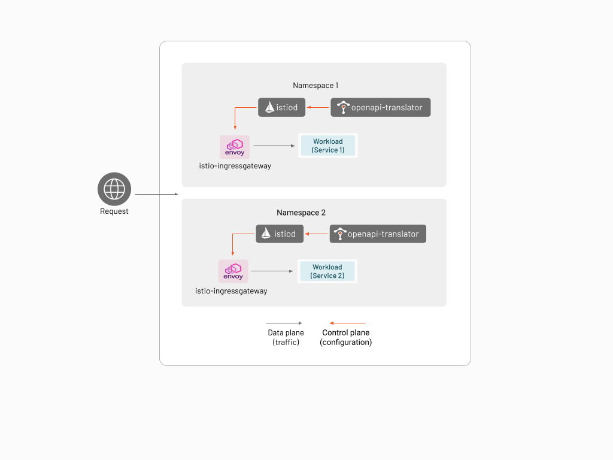

An App Ingress is an L7 ingress that allows application developers to directly harness the power of Envoy that is available.
Unlike the other types of Ingress that are available in TSB, configuring it does not require admin privileges,
and exposes the features of Envoy proxy in such a way that it's easier for application developers to define intent.

The App Ingress is a stripped down version of Istio using Istiod as the control plane component and Istio IngressGateway (i.e. Envoy proxy) as the data plane component. The App Ingress is deployed per application in the namespace owned by the application, and can only consume Istio configurations from the namespace where it is deployed in.

The App Ingress also has an OpenAPI translator add-on that allows the user to configure the ingress using an OpenAPI specification.

This feature requires `tctl` version 1.4.5 or newer.

## Configuration Using Istio

In this example you will install `httpbin` in a namespace, and create an App Ingress in the same namespace to route access to the `httpbin` workload through.

Create a namespace named `httpbin-appingress`.

```bash
kubectl create namespace httpbin-appingress
```

You will be installing the workload and the App Ingress in the same namespace.

In this example the workload will be the `httpbin` service. [Install `httpbin` by following these instructions](../../reference/samples/httpbin#deploy-the-httpbin-pod-and-service). 

Install the App Ingress using the following command.

```bash
tctl experimental app-ingress kubernetes generate -n httpbin-appingress | \
  kubectl apply -f -
```

:::note
You might see the error `unable to recognize "STDIN": no matches for kind "IstioOperator" in version "install.istio.io/v1alpha1"`. If you encounter this error, please re-run the above command.  This happens when the `IstioOperator` CRD has not been deployed yet, and usually it will go away if you retry
:::

Verify that the `httpbin`, `istio-ingressgateway`, and `istiod` pods are running properly in namespace `httpbin-appingress`:

```bash
kubectl get pod -n httpbin-appingress

NAME                                    READY   STATUS    RESTARTS   AGE
httpbin-74fb669cc6-lc4qm                1/1     Running   0          10m
istio-ingressgateway-6f9c469bd5-r7z4t   1/1     Running   0          8m8s
istio-operator-1-11-3-f88d885b5-8wb9k   1/1     Running   0          8m42s
istiod-1-11-3-597999c56f-5f2xr          1/1     Running   0          8m19s
```

You will need to access the `httpbin` service via the host name `httpbin-appingress.example.com`. To do this,
deploy an Istio Gateway and Virtual Service in the `httpbin-appingress` namespace to route HTTP traffic that intended for 
`httpbin-appingress.example.com` to the `httpbin` pod.

Create a file named `httpbin-appingress-virtualservice.yaml` with the following contents:

```yaml
apiVersion: networking.istio.io/v1alpha3
kind: Gateway
metadata:
  name: httpbin-gateway
spec:
  selector:
    istio: ingressgateway # use Istio default gateway implementation
  servers:
  - port:
      number: 80
      name: http
      protocol: HTTP
    hosts:
    - "httpbin-appingress.example.com"
---
apiVersion: networking.istio.io/v1alpha3
kind: VirtualService
metadata:
  name: httpbin
spec:
  hosts:
  - "httpbin-appingress.example.com"
  gateways:
  - httpbin-gateway
  http:
  - match:
    - uri:
        prefix: /status
    - uri:
        prefix: /delay
    route:
    - destination:
        port:
          number: 8000
        host: httpbin
```

Apply this using `kubectl`:

```bash
kubectl -n httpbin-appingress -f httpbin-appingress-virtualservice.yaml
```

Since you have not setup DNS for `httpbin-appingress.example.com`, you will need to setup your environment or change the way you issue HTTP requests to access the service that you have created. In this example you will use `kubectl port-forward` to establish port forwarding.

In a different terminal, set up port-forwarding to the `istio-ingressgateway` service in the `httpbin-appingress` namespace using local port 4040:

```bash
kubectl -n httpbin-appingress port-forward svc/istio-ingressgateway 4040:80 
```

You should now be able to reach the `httpbin` application in the `httpbin-appingress` namespace through the `istio-ingressgateway` service
using the following command:

```bash
curl -s -I \
  -H "Host: httpbin-appingress.example.com" \
  http://localhost:4040/status/200
```

## Using the OpenAPI Translator

If your application provides an OpenAPI specification (3.0.0 or higher), you can use it to generate the routing rules to your application. The OpenAPI Translator add-on takes the application's OpenAPI specification and translates it to Istio configuration and applies it to the App Ingress.

In this example you will use the `bookinfo` sample application and use its OpenAPI specification.

Create a new namespace `bookinfo-openapi`:

```bash
kubectl create namespace bookinfo-openapi
```

Deploy the `bookinfo` sample into the `bookinfo-openapi` namespace:

```bash
kubectl apply -n bookinfo-openapi \
   -f https://raw.githubusercontent.com/istio/istio/master/samples/bookinfo/platform/kube/bookinfo.yaml 
```

Once you verify that the application has been properly deployed, deploy the App Ingress in the `bookinfo-openapi` namespace. You will need to specify the "backend" service (application) that the OpenAPI specification is describing as well.

```bash
tctl experimental app-ingress kubernetes generate \
  -n bookinfo-openapi \
  --openapi-translator \
  --openapi-backend-service http://productpage.bookinfo-openapi.svc.cluster.local:9080 \
  | kubectl apply -f - 
```

The previous command creates an App Ingress that expects an OpenAPI specification in the `ConfigMap` named `openapi-translator`. Since you have not yet provided a specification the App Ingress cannot be configured properly. 

You will have to obtain an OpenAPI spec for `bookinfo`, but [the sample that is provided with Istio only comes in OpenAPI 2.0 format](https://raw.githubusercontent.com/istio/istio/master/samples/bookinfo/swagger.yaml). A version of the `bookinfo` OpenAPI specification that has been converted to OpenAPI 3.0.0 is available through [this link](../../assets/howto/bookinfo-openapi.yaml). Download the file as `bookinfo-openapi.yaml`.

Create the `ConfigMap` using this file using the following command:

```bash
kubectl -n bookinfo-openapi create configmap openapi-translator \
  --from-file=bookinfo-openapi.yaml
```

When the configuration is picked up by the OpenAPI Translator, Istio resources such as `Gateway` and `VirtualService` will be available in the namespace. You verify this by issuing `kubectl get gateway` and `kubectl get virtualservice` commands:

```bash
kubectl -n bookinfo-openapi get gateway

NAME                                    AGE
istio-ingressgateway-f6fb54b17b9120eb   64s
```

```bash
kubectl -n bookinfo-openapi get virtualservice

NAME                                                     GATEWAYS                                                     HOSTS                  AGE
istio-ingressgateway-f6fb54b17b9120eb-www-bookinfo-com   ["bookinfo-openapi/istio-ingressgateway-f6fb54b17b9120eb"]   ["www.bookinfo.com"]   5m13s
```

It is also possible to leverage more TSB features such as rate limiting, authentication, and authorization [by adding annotations](../../refs/tsb/application/v2/openapi_extensions) to your OpenAPI specification.

## Extending App Ingress using the IstioOperator 

It is possible to further configure the Istio components within App Ingress using the [Istio Operator](https://istio.io/latest/docs/reference/config/istio.operator.v1alpha1/).

For example, if you want to plug in custom CA certificates (such a config is particularly useful in Kubernetes versions higher than 1.22 where the kubernetes `pilotCertProvider` is deprecated), create a file named `configure-plug-in-certs.yaml`:

```yaml
apiVersion: install.istio.io/v1alpha1
kind: IstioOperator
metadata:
  namespace: bookinfo-appingress
  name: bookinfo-appingress 
spec:
  values:
    global:
      pilotCertProvider: istiod
```

Create the `cacerts` secret that contain the certificate and keys. For more information click [here](https://istio.io/latest/docs/tasks/security/cert-management/plugin-ca-cert/).
You can test this out by using the sample certs provided in the Istio release bundle.
Run this command to download the Istio release bundle.

```bash
curl -L https://istio.io/downloadIstio | ISTIO_VERSION=1.11.3 sh -
```

Run this commend to create the `cacerts` secret.

```bash
kubectl create secret generic cacerts -n bookinfo-appingress --from-file=ca-cert.pem=istio-1.11.3/samples/certs/ca-cert.pem --from-file=ca-key.pem=istio-1.11.3/samples/certs/ca-key.pem --from-file=root-cert.pem=istio-1.11.3/samples/certs/root-cert.pem --from-file=cert-chain.pem=istio-1.11.3/samples/certs/cert-chain.pem
```

Then supply this file when you generate the manifest for App Ingress by specifying the `-f` (`--filename`) flag:

```bash
tctl experimental app-ingress kubernetes generate \
  -n bookinfo-appingress \
  -f configure-plug-in-certs.yaml \
  | kubectl apply -f -
```

:::note
If running multiple App Ingresses in a single cluster and you are using custom `cacerts`, make sure to use the same `cacerts` secret in each namespace where App Ingress is running.
:::

## App Ingress in Docker

If you have restrictions deploying to your main Kubernetes environment, it is possible to deploy App Ingress to Docker via `docker-compose`. This might be a requirement if you want to run your App Ingress in an environment other than Kubernetes, or you might want to test your application and/or OpenAPI specification locally.

In this example you will start a service in docker, where traffic will be received via App Ingress created using docker-compose, and configured using the OpenAPI document of the service

Make sure to have [docker](https://docs.docker.com/engine/install/) and [docker-compose](https://docs.docker.com/compose/install/) installed before proceeding.

### Generating the docker-compose file

Create a directory named `appingress-compose`. Later instructions will rely on this directory being present.

Generate and save the generated docker-compose file in the `appingress-compose` directory that defines all the App Ingress containers using the following command. Notice that `--openapi-translator` option is enabled, and that the backend service `http://httpbin.tetrate.com` is specified through `--openapi-backend-service`.

```bash
tctl x app-ingress docker-compose generate \
  --openapi-translator \
  --output-dir appingress-compose \
  --openapi-backend-service http://httpbin.tetrate.com \
```

### Running docker-compose
Lets run the containers using `docker-compose`

```bash
$ cd appingress-compose
$ docker-compose up -d
```

You should see the App Ingress containers starting,  as well as a new docker network named `appingress-compose_app-ingress` being created.

```bash
$ docker ps --filter="name=appingress"
CONTAINER ID   IMAGE                                                                                          COMMAND                  CREATED       STATUS       PORTS                                            NAMES
aeae400dcdc3   istio/proxyv2:1.11.3                                                                           "/usr/local/bin/pilo…"   2 hours ago   Up 2 hours   0.0.0.0:8080->8080/tcp, 0.0.0.0:8443->8443/tcp   appingress-compose_istio-ingressgateway_1
e7d988a02384   gcr.io/tetrate-internal-containers/genistio-watcher:7c8c123e620c261e45b925de22b345f4d2b37387   "/usr/local/bin/geni…"   2 hours ago   Up 2 hours                                                    appingress-compose_openapi-translator_1
19539c0a28d3   istio/pilot:1.11.3                                                                             "/usr/local/bin/pilo…"   2 hours ago   Up 2 hours                                                    appingress-compose_pilot-discovery_1
```

```bash
$ docker network ls
NETWORK ID     NAME                             DRIVER    SCOPE
d5b159e5b631   appingress-compose_app-ingress   bridge    local
51364ba39b1b   bridge                           bridge    local
7135f2f769e4   host                             host      local
c955a05b02d1   none                             null      local
```

### Run an Application Container
Start a container with the same name mentioned in the `--openapi-backend-service` argument, which should be `httpbin.tetrate.com` in this case. The current implementation requires that the name matches the backend service name. You also need to deploy it in the same `appingress-compose_app-ingress` network which was recently created by `docker-compose`

```bash
docker run --net appingress-compose_app-ingress --name httpbin.tetrate.com -d kennethreitz/httpbin
```

### Install the OpenAPI specification

Download the file [`httpbin-openapi.json`](../../assets/howto/httpbin-openapi.json_) and save it under the `.app-ingress/config-sources` directory as `.app-ingress/config-sources/httpbin-openapi.json`. The App Ingress will consume and translate it into Istio resources.

You should instantaneously see the generated Istio resource being created as a YAML file:

```bash
$ ls .app-ingress/config-sources/app-ingress.yaml
.app-ingress/config-sources/app-ingress.yaml
```
You can include additional Istio resources such as Destination Rules, Envoy filters in this directory `.app-ingress/config-sources/` to implement your use case.

### Testing

If everything is working, you should be able to access the application running in Docker.

```bash
$ curl -vvv -H "Host: httpbin.tetrate.com" http://localhost:8080/get
*   Trying ::1...
* TCP_NODELAY set
* Connected to localhost (::1) port 8080 (#0)
> GET /get HTTP/1.1
> Host: httpbin.tetrate.com
> User-Agent: curl/7.64.1
> Accept: */*
> 
< HTTP/1.1 200 OK
< server: istio-envoy
< date: Wed, 08 Dec 2021 03:50:43 GMT
< content-type: application/json
< content-length: 432
< access-control-allow-origin: *
< access-control-allow-credentials: true
< x-envoy-upstream-service-time: 1
< 
{
  "args": {}, 
  "headers": {
    "Accept": "*/*", 
    "Host": "httpbin.tetrate.com", 
    "User-Agent": "curl/7.64.1", 
    "X-B3-Sampled": "0", 
    "X-B3-Spanid": "e5ab7bfbd817196b", 
    "X-B3-Traceid": "2729efd79fd5e2e9e5ab7bfbd817196b", 
    "X-Envoy-Attempt-Count": "1", 
    "X-Envoy-Decorator-Operation": "httpbin.tetrate.com:80/get", 
    "X-Envoy-Internal": "true"
  }, 
  "origin": "172.18.0.1", 
  "url": "http://httpbin.tetrate.com/get"
}
* Connection #0 to host localhost left intact
* Closing connection 0
```
