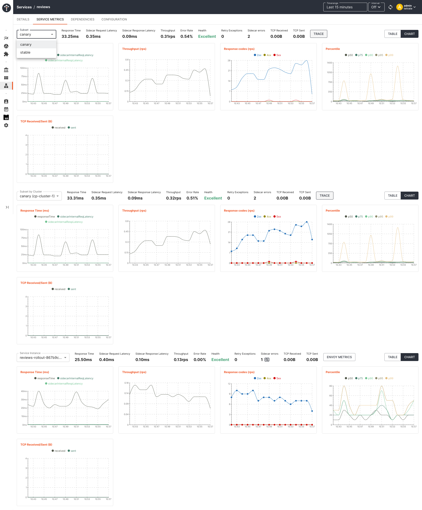
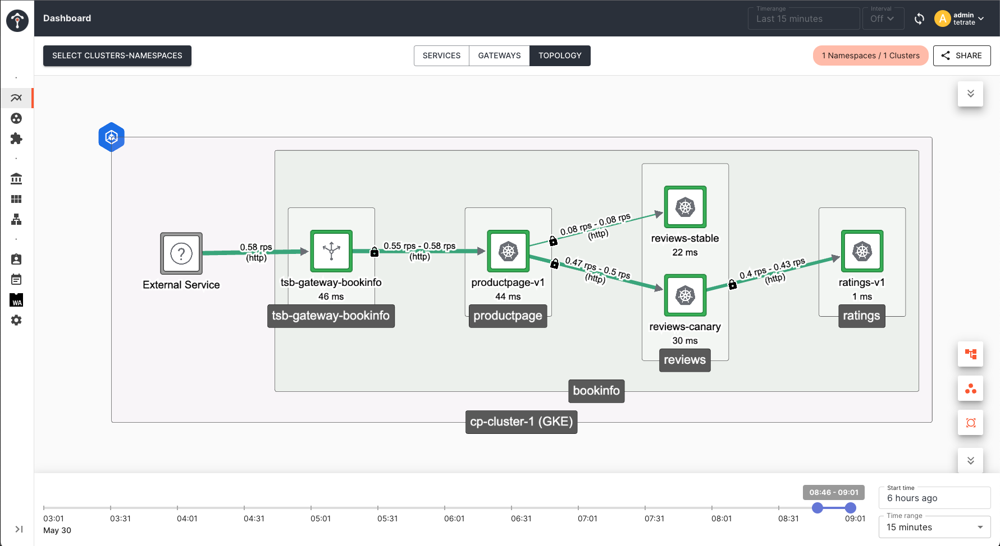

This document describes how you can configure Argo CD & integrate Argo Rollout with TSB GitOps support and use SkyWalking as the metrics provider for canary deployment analysis and progressive delivery automation

Before you get started, make sure: <br />
✓ [Argo CD](https://argo-cd.readthedocs.io/en/stable/getting_started/) is installed in your cluster and Argo CD CLI is configured to connect to your Argo CD server <br />
✓ [Argo Rollout ](https://argoproj.github.io/argo-rollouts/installation/) is installed in your cluster <br />
✓ TSB is up and running, and GitOps [has been enabled](../../operations/features/configure_gitops) for the target cluster <br />

## Create an Application from a Git repository

Create a sample application using the below command. An example repository containing Istio's [bookinfo](https://istio.io/latest/docs/examples/bookinfo/) application and TSB configurations is available at [https://github.com/tetrateio/tsb-gitops-demo](https://github.com/tetrateio/tsb-gitops-demo).
You can either use Argo CD CLI or their web UI to import application configurations directly from Git.

```bash
argocd app create bookinfo-app --repo https://github.com/tetrateio/tsb-gitops-demo.git --path application --dest-server https://kubernetes.default.svc --dest-namespace bookinfo --sync-policy automated --self-heal
```

Check the status of your application

```bash
argocd app get bookinfo-app
```

```bash
Name:               bookinfo-app
Project:            default
Server:             https://kubernetes.default.svc
Namespace:          bookinfo
URL:                https://localhost:8080/applications/bookinfo-app
Repo:               https://github.com/tetrateio/tsb-gitops-demo.git
Target:             
Path:               argo/app
SyncWindow:         Sync Allowed
Sync Policy:        Automated
Sync Status:        Synced to (1ba8e2d)
Health Status:      Healthy

GROUP  KIND            NAMESPACE  NAME                  STATUS     HEALTH   HOOK  MESSAGE
       Namespace       bookinfo   bookinfo              Running    Synced         namespace/bookinfo created
       ServiceAccount  bookinfo   bookinfo-details      Synced                    serviceaccount/bookinfo-details created
       ServiceAccount  bookinfo   bookinfo-productpage  Synced                    serviceaccount/bookinfo-productpage created
       ServiceAccount  bookinfo   bookinfo-ratings      Synced                    serviceaccount/bookinfo-ratings created
       ServiceAccount  bookinfo   bookinfo-reviews      Synced                    serviceaccount/bookinfo-reviews created
       Service         bookinfo   productpage           Synced     Healthy        service/productpage created
       Service         bookinfo   details               Synced     Healthy        service/details created
       Service         bookinfo   ratings               Synced     Healthy        service/ratings created
       Service         bookinfo   reviews               Synced     Healthy        service/reviews created
apps   Deployment      bookinfo   ratings-v1            Synced     Healthy        deployment.apps/ratings-v1 created
apps   Deployment      bookinfo   productpage-v1        Synced     Healthy        deployment.apps/productpage-v1 created
apps   Deployment      bookinfo   reviews               OutOfSync  Healthy        deployment.apps/reviews created
apps   Deployment      bookinfo   details-v1            Synced     Healthy        deployment.apps/details-v1 created
       Namespace                  bookinfo              Synced

```

## Application Setup 

If you already have kubernetes manifests created for deployment and service resource, You can choose to keep the same objects along with Argo `Rollout` object for facilitating the canary deployments.
You can make necessary changes to `Rollout` object and TSB mesh configuration of Istio VirtualService/DestinationRule to achieve the desired result.

## TSB Configuration Setup

Since Argo Rollout require you to make some modifications on Istio `VirtualService` & `DestinatrionRule` object according to their canary deployment strategy convention for Istio, You can use TSB `DIRECT` mode configuration to achieve the desired result.

* According to Argo Rollout convention, 2 subsets named `stable` and `canary` needs to be configured with necessary labels in TSB direct mode resources like `VirtualService` & `DestinationRule` to identify `canary` and `stable` pods.
* Please make sure the version labels eg: `version: canary/stable` has been configured according to Istio convention for TSB to recognize the subsets and plot the metrics in service dashboard.
* When using TSB direct mode resources with GitOps, there is an additional label `istio.io/rev: "tsb"` that needs to be added to the resources. Please refer [here](./gitops#using-istio-direct-mode-resources) for more details.

Create a `bookinfo-tsb-conf` app by importing the TSB configurations from [tsb-gitops-demo/argo/tsb/conf.yaml](https://github.com/tetrateio/tsb-gitops-demo/blob/main/argo/tsb/conf.yaml). You can also choose to keep it in the same repo. 

```bash
argocd app create bookinfo-tsb-conf --repo https://github.com/tetrateio/tsb-gitops-demo.git --path argo/tsb --dest-server https://kubernetes.default.svc --dest-namespace bookinfo --sync-policy automated --self-heal
```

Check the status of TSB resources

```bash
argocd app get bookinfo-tsb-conf

Name:               bookinfo-tsb-conf
Project:            default
Server:             https://kubernetes.default.svc
Namespace:          bookinfo
URL:                https://localhost:8080/applications/bookinfo-tsb-conf
Repo:               https://github.com/tetrateio/tsb-gitops-demo.git
Target:             
Path:               argo/tsb
SyncWindow:         Sync Allowed
Sync Policy:        Automated
Sync Status:        Synced to (1ba8e2d)
Health Status:      Healthy

GROUP                    KIND             NAMESPACE     NAME                               STATUS     HEALTH  HOOK  MESSAGE
networking.istio.io      VirtualService   bookinfo      bookinfo                           Synced                   virtualservice.networking.istio.io/bookinfo created
tsb.tetrate.io           Tenant           bookinfo      bookinfo                           Synced                   tenant.tsb.tetrate.io/bookinfo unchanged
networking.istio.io      Gateway          bookinfo      bookinfo-gateway                   Synced                   gateway.networking.istio.io/bookinfo-gateway unchanged
traffic.tsb.tetrate.io   Group            bookinfo      bookinfo-traffic                   Synced                   group.traffic.tsb.tetrate.io/bookinfo-traffic unchanged
security.tsb.tetrate.io  Group            bookinfo      bookinfo-security                  Synced                   group.security.tsb.tetrate.io/bookinfo-security unchanged
gateway.tsb.tetrate.io   Group            bookinfo      bookinfo-gateway                   Synced                   group.gateway.tsb.tetrate.io/bookinfo-gateway unchanged
tsb.tetrate.io           Workspace        bookinfo      bookinfo-ws                        Synced                   workspace.tsb.tetrate.io/bookinfo-ws unchanged
networking.istio.io      VirtualService   bookinfo      details                            Synced                   virtualservice.networking.istio.io/details unchanged
networking.istio.io      DestinationRule  bookinfo      productpage                        Synced                   destinationrule.networking.istio.io/productpage unchanged
networking.istio.io      DestinationRule  bookinfo      details                            Synced                   destinationrule.networking.istio.io/details unchanged
networking.istio.io      VirtualService   bookinfo      ratings                            Synced                   virtualservice.networking.istio.io/ratings unchanged
networking.istio.io      DestinationRule  bookinfo      reviews                            Synced                   destinationrule.networking.istio.io/reviews unchanged
networking.istio.io      DestinationRule  bookinfo      ratings                            Synced                   destinationrule.networking.istio.io/ratings unchanged
networking.istio.io      VirtualService   bookinfo      reviews                            Synced                   virtualservice.networking.istio.io/reviews unchanged
install.tetrate.io       IngressGateway   bookinfo      tsb-gateway-bookinfo               Synced                   ingressgateway.install.tetrate.io/tsb-gateway-bookinfo unchanged
```

## Verify application

Run the below command to export LB ip of `tsb-gateway-bookinfo`

```bash
export GATEWAY_IP=$(kubectl -n bookinfo get service tsb-gateway-bookinfo -o jsonpath='{.status.loadBalancer.ingress[0].ip}')
```

Confirm that you can access bookinfo application. As you can see in the response, `review v1` service which we have currently deployed doesn't call `ratings` service.

```bash
curl -v "http://bookinfo.tetrate.com/api/v1/products/1/reviews" \
    --resolve "bookinfo.tetrate.com:80:$GATEWAY_IP"

* Mark bundle as not supporting multiuse
< HTTP/1.1 200 OK
< content-type: application/json
< content-length: 361
< server: istio-envoy
< date: Mon, 22 Aug 2022 06:36:52 GMT
< x-envoy-upstream-service-time: 782
<
* Connection #0 to host bookinfo.tetrate.com left intact
{"id": "1", "podname": "reviews-rollout-56ff4b868c-74d8t", "clustername": "null", "reviews": [{"reviewer": "Reviewer1", "text": "An extremely entertaining play by Shakespeare. The slapstick humour is refreshing!"}, {"reviewer": "Reviewer2", "text": "Absolutely fun and entertaining. The play lacks thematic depth when compared to other plays by Shakespeare."}]}
```

## Setup Argo Rollout

Argo Rollout provides multiple options to migrate your existing kubernetes deployment object into Argo's `Rollout` object. You can either convert an existing k8s deployment object to `Rollout` or you can refer your existing k8s deployment from a `Rollout` object using `workloadRef`.
We will be following the latter approach in this example. 

In this example we will be doing a canary deployment of `reviews` service to demonstrate `Rollout` object configurations and how it is facilitating the traffic shifting to both primary and canary deployment of `reviews` service.

* Create a `Rollout` resource and refer your existing deployment using `workloadRef`.
* Make sure selector `matchLabels` has been configured based on your k8s application deployment manifest.
* Configure `strategy` as `canary` with subset level traffic splitting.
* Configure `canaryMetadata` & `stableMetadata` to inject labels and annotations on `canary` and `stable` pods.
* Please make sure the labels of `canaryMetadata` and `stableMetadata` are consistent with TSB direct mode configurations [here](https://github.com/tetrateio/tsb-gitops-demo/blob/main/argo/tsb/conf.yaml#L157-L165).
* Configure Istio `virtualService` and `destinationRule` under `trafficRouting` based on the TSB direct mode configurations.
* Once the `Rollout` object is created, it will spin up the required number of pods side-by-side along with the k8s deployment pods.
* Once all the `Rollout` pods are up and running, you can scale down your existing k8s deployment to `0` by changing the replicas.
* `Rollout` object won't modify your existing k8s deployment, Traffic would be shifted to the pods managed by `Rollout` object once the subset is updated in `VirtualService`.

[rollout.yaml](https://github.com/tetrateio/tsb-gitops-demo/blob/main/argo/rollout/rollout.yaml)

```yaml
apiVersion: argoproj.io/v1alpha1
kind: Rollout
metadata:
  name: reviews-rollout
spec:
  replicas: 5
  selector:
    matchLabels:
      app: reviews
  workloadRef:
    apiVersion: apps/v1
    kind: Deployment
    name: reviews
  strategy:
    canary:
      analysis:
        templates:
        - templateName: apdex
        startingStep: 2
        args:
        - name: service-name
          value: canary|reviews|bookinfo|cp-cluster-1|-
      canaryMetadata:
        annotations:
          version: canary
        labels:
          version: canary
          service.istio.io/canonical-revision: canary
      stableMetadata:
        annotations:
          version: stable
        labels:
          version: stable
          service.istio.io/canonical-revision: stable
      trafficRouting:
        istio:
          virtualService: 
            name: reviews
          destinationRule:
            name: reviews    
            canarySubsetName: canary  
            stableSubsetName: stable
      steps:
      - setWeight: 10
      - pause: {duration: 10m}
      - setWeight: 20
      - pause: {duration: 10m}
      - setWeight: 40
      - pause: {duration: 10m}
      - setWeight: 60
      - pause: {duration: 10m}
      - setWeight: 80
      - pause: {duration: 10m}

```

## Configure Canary Analysis Template with SkyWalking

[SkyWalking](https://skywalking.apache.org/), an observability component bundled in TSB, can serve as a metrics provider to support canary deployment analysis, enabling automatic promotion or rollback actions
Please refer [Analysis & Progressive delivery in Argo Rollout](https://argoproj.github.io/argo-rollouts/features/analysis/) and how [SkyWalking](https://argoproj.github.io/argo-rollouts/analysis/skywalking/) can be used as a metrics provider for more details.

* Create canary `AnalysisTemplate` using `skywalking` as the metrics provider to drive auto promotion/rollback based on the deployment analysis.
* SkyWalking metrics can be fetched by connecting to `OAP` service graphql endpoint i.e `http://oap.istio-system:12800` installed on TSB ControlPlane Cluster.
* Success condition is derived using Apdex score. Please read [Apdex score for measuring service mesh health](https://tetrate.io/blog/the-apdex-score-for-measuring-service-mesh-health/) for more details.
* Subset name of canary deployment needs to be configured as an argument `service-name` in the `analysis` template.
* TSB service name in SkyWalking follows the format `subset|service name|namespace name|cluster name|-`. Since we are using `reviews` service, use `canary|reviews|bookinfo|cp-cluster-1|-` as `service-name` value in Rollout resource.
* Configure the same `AnalysisTemplate` details in the `Rollout` object canary `analysis`. 

[analysis.yaml](https://github.com/tetrateio/tsb-gitops-demo/blob/main/argo/rollout/analysis.yaml)
```yaml
apiVersion: argoproj.io/v1alpha1
kind: AnalysisTemplate
metadata:
  name: apdex
spec:
  args:
  - name: service-name
  metrics:
  - name: apdex
    interval: 5m
    successCondition: "all(result.service_apdex.values.values, {asFloat(.value) >= 9900})"
    failureLimit: 3
    provider:
      skywalking:
        interval: 3m
        address: http://oap.istio-system:12800
        query: |
          query queryData($duration: Duration!) {
            service_apdex: readMetricsValues(
              condition: { name: "service_apdex", entity: { scope: Service, serviceName: "{{ args.service-name }}", normal: true } },
              duration: $duration) {
                label values { values { value } }
              }
          }

```

## Create Rollout 

Run the below command to create a rollout app

```bash
argocd app create reviews-rollout --repo https://github.com/tetrateio/tsb-gitops-demo.git --path argo/rollout --dest-server https://kubernetes.default.svc --dest-namespace bookinfo --sync-policy automated --self-heal
```

Check the status

```bash
argocd app get reviews-rollout

Name:               reviews-rollout
Project:            default
Server:             https://kubernetes.default.svc
Namespace:          bookinfo
URL:                https://localhost:8080/applications/reviews-rollout
Repo:               https://github.com/tetrateio/tsb-gitops-demo.git
Target:             
Path:               argo/rollout
SyncWindow:         Sync Allowed
Sync Policy:        Automated
Sync Status:        Synced to (1ba8e2d)
Health Status:      Healthy

GROUP        KIND              NAMESPACE  NAME             STATUS  HEALTH   HOOK  MESSAGE
argoproj.io  AnalysisTemplate  bookinfo   apdex            Synced                 analysistemplate.argoproj.io/apdex created
argoproj.io  Rollout           bookinfo   reviews-rollout  Synced  Healthy        rollout.argoproj.io/reviews-rollout created

```

## Trigger Canary Deployment

Update the `reviews` service deployment image to `v2` version. This will immediately trigger a canary deployment of `reviews v2` and will modify the traffic percentage as `90/10`.

```bash
kubectl argo rollouts set image reviews-rollout reviews=docker.io/istio/examples-bookinfo-reviews-v2:1.16.4 -n bookinfo
```

## Monitor Canary Deployment

Run the below command to monitor your canary deployment. 

```bash
kubectl argo rollouts get rollout reviews-rollout --watch -n bookinfo

Name:            reviews-rollout
Namespace:       bookinfo
Status:          ॥ Paused
Message:         CanaryPauseStep
Strategy:        Canary
  Step:          1/10
  SetWeight:     10
  ActualWeight:  10
Images:          docker.io/istio/examples-bookinfo-reviews-v1:1.16.4 (stable)
                 docker.io/istio/examples-bookinfo-reviews-v2:1.16.4 (canary)
Replicas:
  Desired:       5
  Current:       6
  Updated:       1
  Ready:         6
  Available:     6

NAME                                         KIND        STATUS     AGE    INFO
⟳ reviews-rollout                            Rollout     ॥ Paused   6m13s
├──# revision:2
│  └──⧉ reviews-rollout-867b9c9bcb           ReplicaSet  ✔ Healthy  21s    canary
│     └──□ reviews-rollout-867b9c9bcb-86mbt  Pod         ✔ Running  19s    ready:2/2
└──# revision:1
   └──⧉ reviews-rollout-5d9dc876c9           ReplicaSet  ✔ Healthy  6m13s  stable
      ├──□ reviews-rollout-5d9dc876c9-27mth  Pod         ✔ Running  6m12s  ready:2/2
      ├──□ reviews-rollout-5d9dc876c9-8qqpx  Pod         ✔ Running  6m11s  ready:2/2
      ├──□ reviews-rollout-5d9dc876c9-9bqbv  Pod         ✔ Running  6m11s  ready:2/2
      ├──□ reviews-rollout-5d9dc876c9-cgxgd  Pod         ✔ Running  6m11s  ready:2/2
      └──□ reviews-rollout-5d9dc876c9-d447w  Pod         ✔ Running  6m11s  ready:2/2

```

## Generate Traffic

Run the below command to send some requests to bookinfo application.

```bash
while true; do curl -m 5 -v "http://bookinfo.tetrate.com/api/v1/products/1/reviews" --resolve "bookinfo.tetrate.com:80:$GATEWAY_IP";  sleep 2 ; done ;
```

As you can see, some of the response will have the response from `ratings` service as `reviews-v2` calls `ratings` service.

```bash
> GET /api/v1/products/1/reviews HTTP/1.1
> Host: bookinfo.tetrate.com
> User-Agent: curl/7.79.1
> Accept: */*
> Content-Length: 0
> Content-Type: application/x-www-form-urlencoded
>
* Mark bundle as not supporting multiuse
< HTTP/1.1 200 OK
< content-type: application/json
< content-length: 437
< server: istio-envoy
< date: Mon, 22 Aug 2022 06:53:14 GMT
< x-envoy-upstream-service-time: 45
<
* Connection #0 to host bookinfo.tetrate.com left intact
{"id": "1", "podname": "reviews-66f8dddb8c-84pk6", "clustername": "null", "reviews": [{"reviewer": "Reviewer1", "text": "An extremely entertaining play by Shakespeare. The slapstick humour is refreshing!", "rating": {"stars": 5, "color": "black"}}, {"reviewer": "Reviewer2", "text": "Absolutely fun and entertaining. The play lacks thematic depth when compared to other plays by Shakespeare.", "rating": {"stars": 4, "color": "black"}}]}
```

## Monitor Performance Metrics in TSB

You can monitor the health of each service instance of both canary and stable pods from TSB service dashboard. 






## Canary Analysis and Auto Promotion

As we have configured in the `rollout` object, canary `analysis` is going to run from the second phase onwards as it wait for the first phase to complete in 10 minutes to build some metrics. From the second phase onwards, `AnalysisRun` i.e an instantiation of the `AnalysisTemplate` is going to get executed, based on the configured `interval`. For every completed run, based on the status of `succesfull` or `failed`, argo decides whether to promote/rollback the canary deployment based on the max `failureLimit` configured in `AnalysisTemplate`.

### During Canary Analysis

```bash
kubectl argo rollouts promote reviews-rollout --full -n bookinfo

Name:            reviews-rollout
Namespace:       bookinfo
Status:          ॥ Paused
Message:         CanaryPauseStep
Strategy:        Canary
  Step:          5/10
  SetWeight:     40
  ActualWeight:  40
Images:          docker.io/istio/examples-bookinfo-reviews-v1:1.16.4 (stable)
                 docker.io/istio/examples-bookinfo-reviews-v2:1.16.4 (canary)
Replicas:
  Desired:       5
  Current:       7
  Updated:       2
  Ready:         7
  Available:     7

NAME                                         KIND         STATUS     AGE   INFO
⟳ reviews-rollout                            Rollout      ॥ Paused   24m
├──# revision:2
│  ├──⧉ reviews-rollout-867b9c9bcb           ReplicaSet   ✔ Healthy  18m   canary
│  │  ├──□ reviews-rollout-867b9c9bcb-86mbt  Pod          ✔ Running  18m   ready:2/2
│  │  └──□ reviews-rollout-867b9c9bcb-9ghh2  Pod          ✔ Running  3m4s  ready:2/2
│  └──α reviews-rollout-867b9c9bcb-2         AnalysisRun  ◌ Running  8m4s  ✔ 2
└──# revision:1
   └──⧉ reviews-rollout-5d9dc876c9           ReplicaSet   ✔ Healthy  24m   stable
      ├──□ reviews-rollout-5d9dc876c9-27mth  Pod          ✔ Running  24m   ready:2/2
      ├──□ reviews-rollout-5d9dc876c9-8qqpx  Pod          ✔ Running  24m   ready:2/2
      ├──□ reviews-rollout-5d9dc876c9-9bqbv  Pod          ✔ Running  24m   ready:2/2
      ├──□ reviews-rollout-5d9dc876c9-cgxgd  Pod          ✔ Running  24m   ready:2/2
      └──□ reviews-rollout-5d9dc876c9-d447w  Pod          ✔ Running  24m   ready:2/2

```

### After Successful Promotion

Once all the steps gets executed with a `successfull` analysis run, argo completely rollout the image to version `v2` and marks that as `stable`. 

```bash
kubectl argo rollouts get rollout reviews-rollout --watch -n bookinfo

Name:            reviews-rollout
Namespace:       bookinfo
Status:          ✔ Healthy
Strategy:        Canary
  Step:          10/10
  SetWeight:     100
  ActualWeight:  100
Images:          docker.io/istio/examples-bookinfo-reviews-v2:1.16.4 (stable)
Replicas:
  Desired:       5
  Current:       5
  Updated:       5
  Ready:         5
  Available:     5

NAME                                         KIND         STATUS        AGE    INFO
⟳ reviews-rollout                            Rollout      ✔ Healthy     3d20h
├──# revision:2
│  ├──⧉ reviews-rollout-867b9c9bcb           ReplicaSet   ✔ Healthy     3d20h  stable
│  │  ├──□ reviews-rollout-867b9c9bcb-757hf  Pod          ✔ Running     3d20h  ready:2/2
│  │  ├──□ reviews-rollout-867b9c9bcb-tlt8z  Pod          ✔ Running     3d20h  ready:2/2
│  │  ├──□ reviews-rollout-867b9c9bcb-hwqnd  Pod          ✔ Running     3d20h  ready:2/2
│  │  ├──□ reviews-rollout-867b9c9bcb-hnfzb  Pod          ✔ Running     3d20h  ready:2/2
│  │  └──□ reviews-rollout-867b9c9bcb-h5zrw  Pod          ✔ Running     3d20h  ready:2/2
│  └──α reviews-rollout-867b9c9bcb-2         AnalysisRun  ✔ Successful  3d20h  ✔ 5
└──# revision:1
   └──⧉ reviews-rollout-5d9dc876c9           ReplicaSet   • ScaledDown  3d20h
```

## Manual Promotion of Canary Deployment

You can either do a step promote which will proceed to the next steps mentioned in the Rollout by changing the traffic weight and it will eventually rollout the new version completely or you can do a full promote to the desired version by skipping analysis, pauses, and steps.

```bash
# step promotion
kubectl argo rollouts promote reviews-rollout -n bookinfo

# full promotion
kubectl argo rollouts promote reviews-rollout --full -n bookinfo
```
