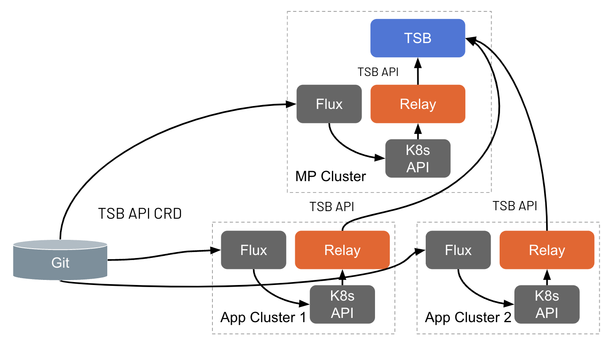

This document explains how you can leverage GitOps workflows with TSB. The document
assumes that [GitOps is already enabled](../../operations/features/configure_gitops) in the
Management Plane cluster and/or in the application clusters.

The main idea behind the GitOps support in TSB is allowing:
- Administrator teams to create TSB configuration resources directly in the Management Plane cluster.
- Application teams to create TSB configuration resources directly in the application clusters. 

Applications teams can push changes to application configuration the same way they push changes to the applications
themselves, and allows packaging together the application deployment resources and the
TSB configurations, for example inside the same Helm chart.

In order to do this, all TSB configuration objects exist as Kubernetes Custom Resource
Definitions (CRDs) so that they can be easily applied to the cluster. As shown in the figure
below, once the resources are applied to the cluster, they will be automatically reconciled
and forwarded to the Management Plane.



### TSB Kubernetes Custom Resources

Kubernetes Custom Resources for TSB configuration are used like any other Kubernetes resource.
The following example shows a `Workspace` definition:

```yaml
apiVersion: tsb.tetrate.io/v2
kind: Workspace
metadata:
  name: bookinfo
  annotations:
    tsb.tetrate.io/organization: tetrate
    tsb.tetrate.io/tenant: engineering
spec:
  namespaceSelector:
    names:
      - "*/bookinfo"
```

They are very similar to the resources you can [apply with tctl](../../reference/cli/reference/apply)
with the following differences:

* The contents of the `spec` are defined in the [YAML API reference](../../reference/yaml-api). Specs are
  the same that you use with `tctl`.
* The metadata section does not have the TSB properties such as `organization`, `tenant`, etc. Instead,
  the hierarchy information must be provided with the following annotations, where appropriate:
  * _tsb.tetrate.io/organization_
  * _tsb.tetrate.io/tenant_
  * _tsb.tetrate.io/workspace_
  * _tsb.tetrate.io/trafficGroup_
  * _tsb.tetrate.io/securityGroup_
  * _tsb.tetrate.io/gatewayGroup_
  * _tsb.tetrate.io/istioInternalGroup_
  * _tsb.tetrate.io/application_
* The `apiVersion` and `kind` properties are the same for all resources except for the following:
  * API group `api.tsb.tetrate.io/v2` is instead `tsb.tetrate.io/v2`.

See [TSB Kubernetes API](../../reference/k8s-api/guide) to download TSB Kubernetes CRDs.

#### Using Istio direct mode resources

When using Istio direct mode resources with GitOps, there is an additional label that needs to be
added to the resources:

```yaml
labels:
    istio.io/rev: "tsb"
```

For example, a Gateway object in a Gateway Group would look like:

```yaml
apiVersion: networking.istio.io/v1beta1
kind: Gateway
metadata:
  name: bookinfo-gateway
  namespace: bookinfo
  labels:
    istio.io/rev: tsb
  annotations:
    tsb.tetrate.io/organization: tetrate
    tsb.tetrate.io/tenant: tetrate
    tsb.tetrate.io/workspace: bookinfo
    tsb.tetrate.io/gatewayGroup: bookinfo
spec:
  selector:
    app: tsb-gateway-bookinfo
  servers:
    - hosts:
        - "bookinfo.tetrate.io"
      port:
        number: 80
        name: http
        protocol: HTTP
```

This is needed to prevent the running Istio in the cluster from immediately processing that resource as it
should only be read by the TSB relay to be pushed to the Management Plane. There is a validation webhook
that will check that all resources that need this label have it, and reject them otherwise.

### Applying TSB Custom Resources

TSB Custom Resources can be applied normally using `kubectl`. For example, to apply the workspace
in the example above, you can simply run:

```bash{promptUser: "alice"}
kubectl apply -f workspace.yaml

kubectl get workspaces -A
NAMESPACE   NAME       PRIVILEGED   TENANT    AGE
bookinfo    bookinfo                engineering   4m20s
```

If you want to verify that the object has properly been created in the Management Plane, you can also
use `tctl` to view the object there:

```bash{promptUser: "alice"}
$ tctl get ws bookinfo
NAME        DISPLAY NAME    DESCRIPTION
bookinfo
```

## Integration with Continuous Deployment solutions

The TSB GitOps features allows you to easily integrate the TSB configuration workflow
with CI/CD solutions. The following pages provide some configuration examples you
can follow to get an idea of how it works:

* [Configuring Flux CD for GitOps with TSB](flux)
