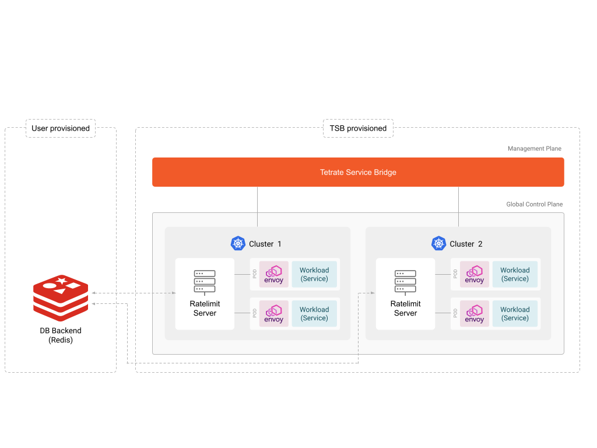
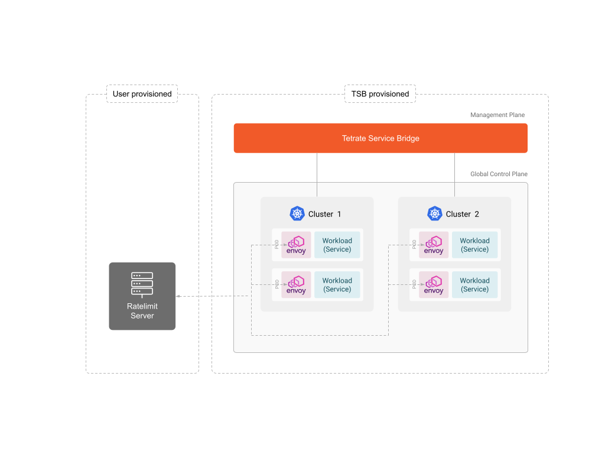

流量限制允许你根据诸如源 IP 地址和 HTTP 头部等流量属性，将通过 TSB 的流量限制在预定限额内。

如果你担心以下任何一点，你可能需要考虑流量限制：
* 防止恶意活动，如 DDoS 攻击。
* 防止你的应用程序及其资源（如数据库）过载。
* 实现某种业务逻辑，如为不同用户组设置不同的 API 限制。

TSB 支持两种流量限制模式：内部和外部。

## 内部流量限制

此模式在一个集群内或跨多个集群实现全局流量限制。
在此模式中，你可以使用 [API](../../refs/tsb/gateway/v2/ingress-gateway#ratelimitsettings) 根据各种流量属性配置限制。

在幕后，TSB 的全局控制平面在每个集群部署一个速率限制服务器，该服务器作为一个全局服务，从多个 Envoy 代理接收元数据，并根据配置作出流量限制决策。

此模式要求用户设置一个 Redis 服务器，用作存储后端，以持久化速率限制元数据计数。

如果你希望利用流量限制功能而无需实现自己的流量限制服务，我们建议使用此模式。

有关如何启用内部流量限制的详细信息，请阅读[此文档](./../rate-limiting/internal-rate-limiting)。

## 外部流量限制

在此模式中，你将部署一个实现 [Envoy 速率限制服务接口](https://www.envoyproxy.io/docs/envoy/latest/api-v3/traffic/ratelimit/v3/rls.proto) 的速率限制服务器，并配置 [API](../../refs/tsb/gateway/v2/ingress-gateway#externalratelimitservicesettings) 根据指定的标准将速率限制元数据发送到你的服务器。

外部速率限制服务器做出的决策将在 TSB 内的 Envoy 代理中强制执行。

如果你希望实现自己的流量限制服务，或者希望将流量限制决策逻辑从 TSB 分离出来成为其自己的服务，我们建议使用此模式。

## 流量限制上下文

流量限制可以在不同的上下文中配置。虽然你可以根据自己的意愿在任何这些上下文中自定义其行为，但某些类型的流量限制在特定上下文中处理效果更佳。

|                                                              |                                                              |
| ------------------------------------------------------------ | ------------------------------------------------------------ |
| [Tier1Gateway](./../rate-limiting/tier1-gateway) ([YAML](../../refs/tsb/gateway/v2/tier1-gateway#tier1externalserver)) | 根据源 IP 地址限制恶意流量                                   |
| [IngressGateway / Tier2 Gateway / Application Gateway](./../rate-limiting/ingress-gateway) ([YAML](../../refs/tsb/gateway/v2/ingress-gateway)) | 基于业务逻辑实现流量限制，或保护你的应用程序免于过载         |
| [TrafficSettings](./../rate-limiting/service-to-service) ([YAML](../../refs/tsb/traffic/v2/traffic-setting#trafficsetting)) | 对与 TrafficSettings 关联的命名空间中的所有代理应用流量限制。用于保护应用程序免于过载 |
