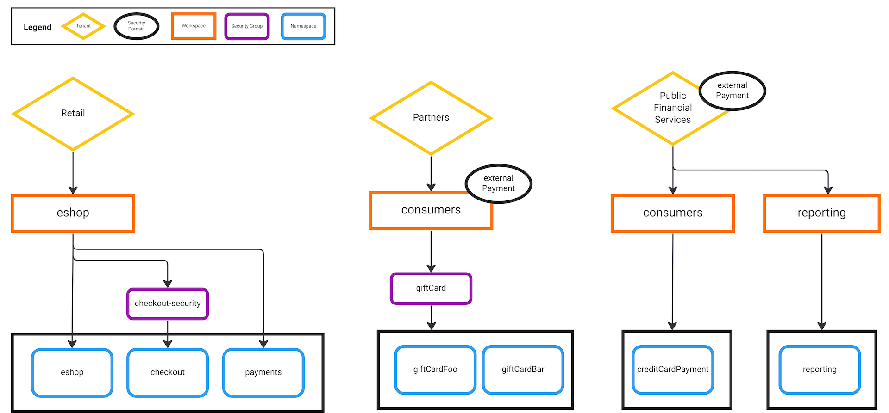

## What are Security Domains?

**Security Domains** allow you to create configuration groupings across the [TSB hierarchy](../concepts/security#tenancy) from anywhere in the configuration hierarchy - [Tenant](../refs/tsb/v2/tenant#tetrateio-api-tsb-v2-tenant), [Workspace](../refs/tsb/v2/workspace#tetrateio-api-tsb-v2-workspace) or [Security Group](../refs/tsb/security/v2/security_group#tetrateio-api-tsb-security-v2-group). Think of a `securityDomain` as a name that can be attached to any of these TSB resources, and which can then be used in TSB rules.

Once a resource is identified with a `securityDomain`, the security domain can be used as a source or target when creating rules. This allows the Operator to establish a set of requirements continuously across the **Tetrate Service Bridge (TSB)** hierarchy as new objects are created. 

## When should I use Security Domains?

As you grow your service mesh so will the number of policies that you need to enforce. In some cases, these security controls will not nicely overlay with your current TSB hierarchy choices: you have a subset of services, workspaces and tenants that share a common set of security controls.

Security Domains provides you the ability to create a single [authorization rule](../refs/tsb/security/v2/security_setting#tetrateio-api-tsb-security-v2-authorizationrules) that addresses multiple Tenants, WorkSpaces and Security Groups using their shared `securityDomain` name. You can then create broad and inclusive rules that reflect the high-level access control intent using simple [from](../refs/tsb/security/v2/security_setting#tetrateio-api-tsb-security-v2-rule-from) and [to](../refs/tsb/security/v2/security_setting#tetrateio-api-tsb-security-v2-rule-to) clauses.

## Using Security Domains

**Note: the below example assumes you already know how to [Create a Tenant](../quickstart/tenant).**

We begin with a simple, single-cluster TSB deployment with two tenants `dev_US_East`, `stg_US_East`, representing development and staging environments. As our usage of TSB grows, we want to add a US West cluster for redundancy, which will require us to create two new tenants: `dev_US_West`, `stg_US_West`.


We are going to use Security Domains to create a simple, broad authorization rule that allows traffic from all `stg` staging tenants to all `dev` development tenants.

**Step 1** Add the `dev` and `stg` security domains to your new created tenants by editing your `tenant.yaml`

```yaml
kind: Tenant
metadata:
 organization: tetrate
 tenant: dev_US_West
spec:
 displayName: Dev US West
 securityDomain: organizations/tetrate/securitydomains/dev
 ---
kind: Tenant
metadata:
 organization: tetrate
 tenant: stg_US_East
spec:
 displayName: Stg US West
 securityDomain: organizations/tetrate/securitydomains/stg
```

**Step 2** Add the rules desired between our `dev` and `stg` Security Domains using `tctl edit organizationsettings`

In this example TSB environment, we want to ensure traffic can come from Staging and reach Development, but traffic cannot come from Development and reach Staging. Without a `securityDomain`, we would need to create individual rules between each tenant, and the complexity of creating, managing and verifying these rules would grow with the number of tenants. Using a `securityDomain`, I just need to associate each tenant with the appropriate `securityDomain`. My authorization rule then references the `securityDomain` as the target in the `from` and `to` clauses:
 
```yaml
kind: OrganizationSetting
metadata:
 displayName: tetrate-settings
 name: tetrate-settings
 organization: tetrate
 resourceVersion: '"XI8Jtnl6JaE="'
spec:
 defaultSecuritySetting:
  authorization:
   mode: RULES
   rules:
    allow:
    - from:
      fqn: organizations/tetrate/securitydomains/stg
     to:
      fqn: organizations/tetrate/securitydomains/dev
 displayName: tetrate-settings
 etag: '"XI8Jtnl6JaE="'
 fqn: organizations/tetrate/settings/tetrate-settings
 ```

The final step is optional, but recommended for completeness, or if you have traffic you care about existing between your existing tenants

**Step 3** Test the behaviour between your new tenants and update your existing tenants by editing your `tenant.yaml`
 
Update your `tenant.yaml` to add your existing Tenants to your newly created security domains.

```yaml
kind: Tenant
metadata:
 organization: tetrate
 tenant: dev_US_West
spec:
 displayName: Dev US West
 securityDomain: organizations/tetrate/securitydomains/dev
---
kind: Tenant
metadata:
 organization: tetrate
 tenant: stg_US_East
spec:
 displayName: Stg US West
 securityDomain: organizations/tetrate/securitydomains/stg
```

### What did we achieve?
 
We successfully configured our new *US West* tenants and added them to their respective security domains `dev` and `stg`. As we add more pairs of `dev` and `stg` tenants, we can associate them with the appropriate `securityDomain`. TSB will automatically extend the authorization rules to apply access control across all of our tenants.


### What is the future of Security Domains?

:::note Early Feature Implementation
Security Domains is a new capability in Tetrate Service Bridge 1.6. Implementation will likely be extended in later releases as we unlock additional use cases and visualizations.
:::

The example above only scrapes the surface of what can be achieved with **Security Domains**. Although they are a major step forward in simplifying the task of creating authorization rules in large environments, even Security Domain relationships can eventually become involved and complex. Tetrate are considering UI visualizations and other extensions to make security domains more scalable and easier to configure accurately, enabling rich use cases:



If you are using Security Domains, Tetrate would love to hear from you.  Please reach out via your Tetrate account team.
