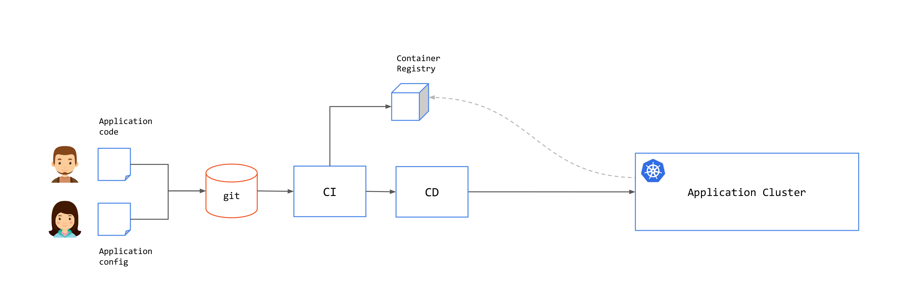

GitOps is a practice that uses Git repositories as a source of truth for application/system state. Changes to the state are performed through Pull Request (PR) and approval workflow and will be automatically applied to the system by a CD process. This is illustrated in the following image.

There are three core practices in GitOps:

### Infrastructure-as-Code

This describes the practice of keeping all infrastructure and application configurations stored as code in Git.

### Using Pull Requests for Changes

Changes are proposed on a branch, and a PR is made to merge the changes into the main branch. Using PRs allows for collaboration between operations engineers for peer review along with the development teams, security teams, and other stakeholders.

### CI (Continuous Integration) and CD (Continuous Deployment) Automation

In an ideal scenario, no manual changes are made to a GitOps-managed environment. Instead, CI and CD serve as a type of reconciliation loop. Each time a change is made, the automation tool compares the state of the environment to the source of truth defined in the Git repository. 

## GitOps Benefits

There are several benefits that you can get by using GitOps practice

1. **Revisions with history**

    Since every change is stored in Git, it is easy to discover what changes have been made. In most cases, the change can be traced back to a specific incident or change request.

2. **Ownership**

    Since the changes can be looked up in the Git history, it is possible to find out who owns the relevant files (in this case mostly the manifest/YAML files). This also means that owners of the resulting contains can be deduced and used during operation.

3. **Immutability**

    Any build or deployment is reproducible and immutable. 

4. **Deterministic**

    Even if there are manual changes to the containers/clusters, the operator responsible for applying the configuration is watching and will fix it based on the information stored in Git.

## Separating Build (CI) and Deployment (CD)

While you can have a single pipeline for both application code and configuration, you might want to separate both for following reasons:

1. **Separation of Concerns**

    Application **developers** commit code and create releases, which can be done in the CI. Application **operators** deploy artifacts to the clusters, which can be done in the CD

2. **Multiple Deployments**

    Single application code can be deployed to many environments from the CD, without having to go through the CI over and over.

3. **Repeated Deployments**

    Recreating a deployment should not require a new build. Artifacts can be managed in CD without having to go through the CI over and over.

You can connect CI with CD by using a reconciliation loop that will check for new artifact releases and create PR to the application configuration repository to update the application image tag.

## Push and Pull

There are two approaches for GitOps: **Push** and **Pull**. 

In the **push** approach, once a commit has been made on a git repository or a CI pipeline was executed successfully,
an external system (mostly CD pipelines) is triggered to deploy the artifacts to the cluster. In this approach, the pipeline system requires the relevant permissions to access to the cluster. 

Example of push solutions include: [Github actions](https://github.com/features/actions), [Azure Pipelines](https://azure.microsoft.com/en-us/services/devops/pipelines/), [GitlabCI](https://docs.gitlab.com/ee/ci/) and [CircleCI](https://circleci.com/).

In the **pull** approach, an agent inside the destination cluster regularly scans the associated git repositories. If a change is detected, the cluster state will be updated from inside the cluster. As seen in the following image, the CD components are moved to side the clusters. 

Examples of pull solutions include: [Argo CD](https://circleci.com/) and [Flux](https://fluxcd.io/).

There are pros and cons for both approaches. Please check these articles if you are interested in reading more:

* [Push vs. Pull in GitOps: Is There Really a Difference?](https://thenewstack.io/push-vs-pull-in-gitops-is-there-really-a-difference/)
* [GitOps — Comparison Pull and Push](https://faun.pub/gitops-comparison-pull-and-push-88fcbaadfe45)

There will never be a single solution that will fit all possible use cases, as each scenario varies greatly. As always, weighing the needs of your team or organization with the pros and cons of each approach will help you decide on which approach to use (or even use both of them!).

## Cluster Provisioning Pipeline

With Kubernetes, you also need to plan on how to provision a cluster using the GitOps pipeline.

This involves creating clusters, installing common infrastructure components into clusters: logging, monitoring, secrets, certificates, access controls, service mesh components like Tetrate Service Bridge (TSB) and others.

## The Challenge of GitOps

Like any technology, the path to successful adoption is about managing expectations and being fully aware of a technology's strengths and weaknesses. It is important to understand them to accurately determine which solution is right for your culture, environment, and/or process, if at all.

The following is a list of some of challenges with adopting GitOps:

**GitOps breaks down with auto-scaling and dynamic resources.** Since GitOps expects state to be stored in Git, dynamic aspects such as auto-scaling can cause problems when attempting to sync the state. Tools like ArgoCD have [custom diffs](https://argo-cd.readthedocs.io/en/stable/user-guide/diffing/) to handle this. 

**GitOps does not address promotion of releases between environments.** Configurations for each environment will probably be stored in different Git branches. Templating solutions such as [Helm](https://helm.sh/) and [Kustomize](https://kustomize.io/) are usually used to provide a base template that can be then customized on each environment.

**Auditing is problematic despite having all information in Git.** While Git has the change history, it is hard to answer certain questions without additional tools to analyze data in multiple Git repositories. For example, What percentage of deployments to environment X were successful and what had to be rolled back? How many features exist in environment X but are not in environment Y yet?

**Large scale deployment with large number of clusters and services will pose a challenge.** Operations that affect a large number of resources such as adding a new company-wide label on all deployment may be problematic, as you may be dealing with multiple services whose configurations are stored in multiple different Git repositories.

**Lack of standard practice.** A good example where there still isn't a single accepted practice on how configuration should be managed is secrets. If secrets are stored in Git, they need to be encrypted, and thus will have to have their own workflow to process them during a deployment. If they are not stored in Git, then you no longer will be able to store your cluster's state in Git. In practice organizations tend to use external secret management tools such as Vault

**Lack of visibility and runtime validation.** Git does not provide visibility into what has happened during runtime. For example, if a single update causes other dependent services, there's no easy way to find it out.

## GitOps for Service Mesh

A service mesh decouples operations from development by addressing networking, security, and observability issues across applications with an independent networking layer, or a "mesh" that controls communications between services. The mesh is formed by connected sidecars that act as proxy to services participating in the mesh. Service mesh provides capabilities to control and secure application networking without any changes to the application itself. 

Service mesh introduces control plane components to manage proxies and distribute runtime configurations to proxies. You will need to deploy and manage mesh control planes lifecycle in your GitOps pipeline. This could be added to the existing pipeline that you already have to provision a cluster or on a different pipeline.

Since service mesh runs outside of your application, you will have another configuration that you need to add to your GitOps pipeline in addition to application deployment configuration. With [Istio](https://istio.io/), this would be Istio resources, e.g. [`Gateway`](https://istio.io/latest/docs/reference/config/networking/gateway/), [`VirtualService`](https://istio.io/latest/docs/reference/config/networking/virtual-service/), [`DestinationRule`](https://istio.io/latest/docs/reference/config/networking/destination-rule/) and others.

## GitOps for TSB

TSB adds a Management Plane (MP) on top of a multi-cluster control plane and provides a unified way to connect and secure services across an entire mesh-managed environment. You will need to keep note of several factors when you incorporate TSB in your GitOps pipeline.

### TSB API Structure

TSB has two API's: installation and configuration. Installation API is usually used in provisioning both Management Plane and Control Plane clusters. Installation API are Kubernetes YAML files and can be added to cluster provisioning pipeline.

To configure application mesh behavior with TSB, you can do it in two ways:

#### TSB-based

You will need to use TSB API or use TSB CLI (`tctl`) to apply TSB configurations. TSB configurations must be applied to the TSB Management Plane, and not directly into clusters. MP will distribute configurations to the Kubernetes clusters based on the specified `namespaceSelector`.

And since TSB requires application networking configuration to be applied to the TSB management plane, you will need to add `tctl` to your CD pipeline.

#### Kubernetes-based

It requires the application clusters to have [GitOps enabled](../operations/features/configure_gitops).

Once that's done, you can add the TSB Kubernetes YAML files to the provisioning pipeline of each cluster.

You can read more about [how to do it in the GitOps howtos](../howto/gitops).

### Rollback Options

Different systems and applications follow different rollback methodologies based on their dependencies.

For TSB, and all onboarded clusters, the source of configurations is stored within TSB.
And because TSB configuration formats are (to a degree) tied to the specific version of TSB used, it is important to make sure the deployed TSB version, the configurations in TSB, and the configurations stored in Git are kept in sync. This is especially true when you attempt perform a rollback.

You will need to investigate what specific considerations you will need to take into account depending on your rollback scenario, which is outside of the scope of this document as they vary greatly from environment to environment. Examples may include rolling back TSB Configurations for an application or a set of applications in tandem with the Git config changes, rollback related to a particular Control Plane version or rollback of TSB Management plane, etc.

### Disaster Recovery Setup

Enterprises could have a mirrored environment set up for Disaster Recovery (DR) including a TSB DR. Kubernetes manifests and TSB configurations are applied to the DR clusters in sync with Primary clusters.

Another scenario is to have a single TSB manage both Primary and DR user clusters. In this case a duplicate set of configurations identical to the primary except for the resource names, cluster and namespace names can be created and applied to TSB.

## Journey into GitOps

For journeys into GitOps, organizations can start evaluating existing solutions and validate each solution against organization objectives while keeping in mind what the limitations and challenges with current GitOps solutions are.

Templating will play an important role in abstracting and scaling GitOps for large clusters and services. You will need to experiment and look at what feels right for your organization. 

As with any changes that you want to introduce to your organization, start small with single application team and build success stories that can motivate others to start adopting GitOps. GitOps adoption will require the stakeholders' buy-in. They need to see that GitOps will help them solve their problems and make their work easier and effective.

GitOps is a relatively new practice and it's still maturing. As this technology grows, open-source communities and vendors will work to solve some of its limitations. If you are interested in exploring this topic further, you can check GitOps Working Group from CNCF.

